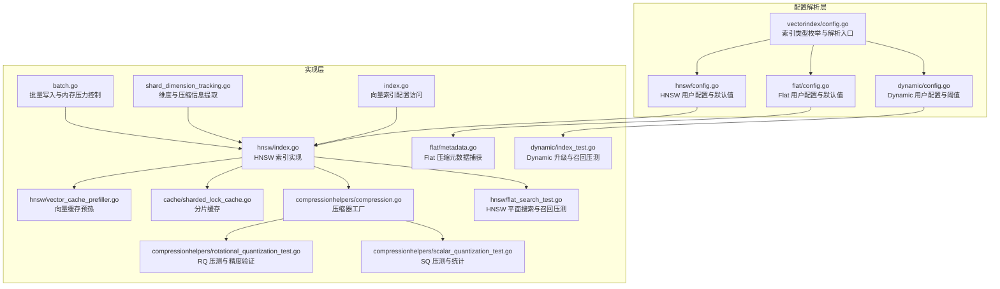
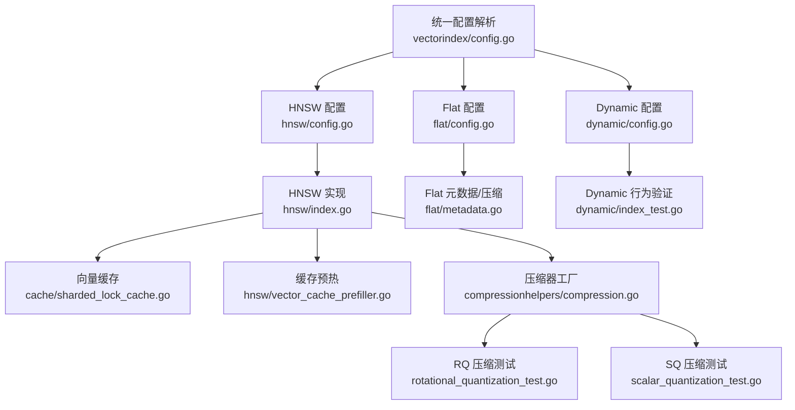
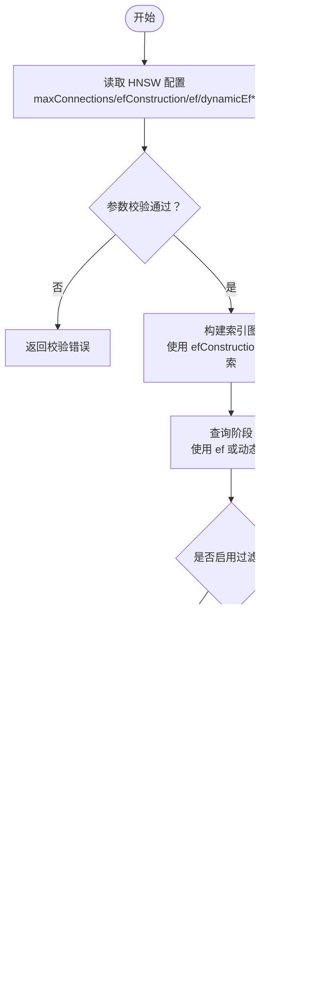
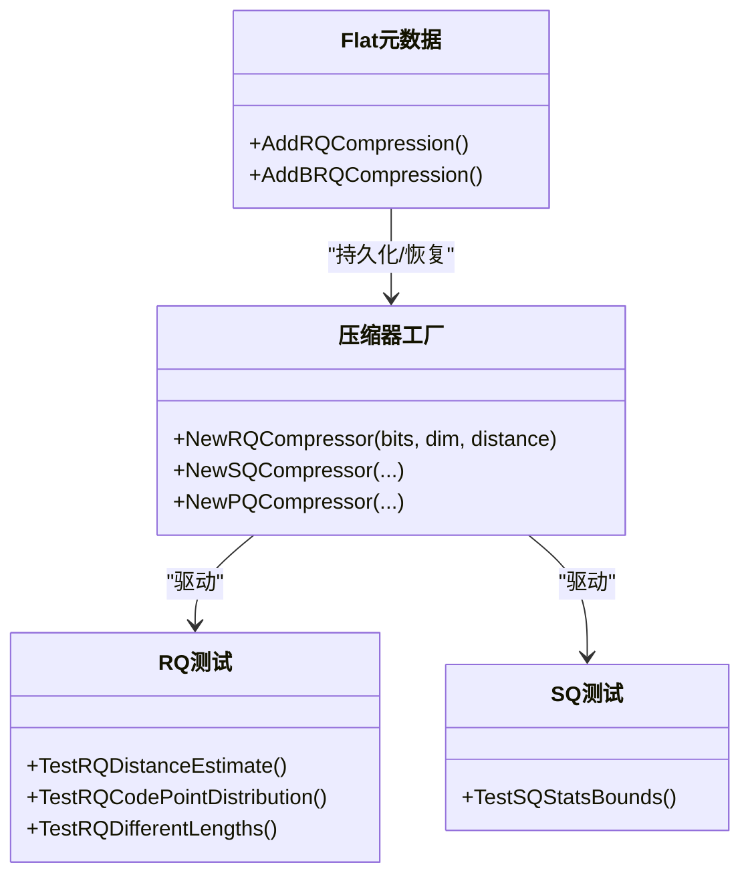
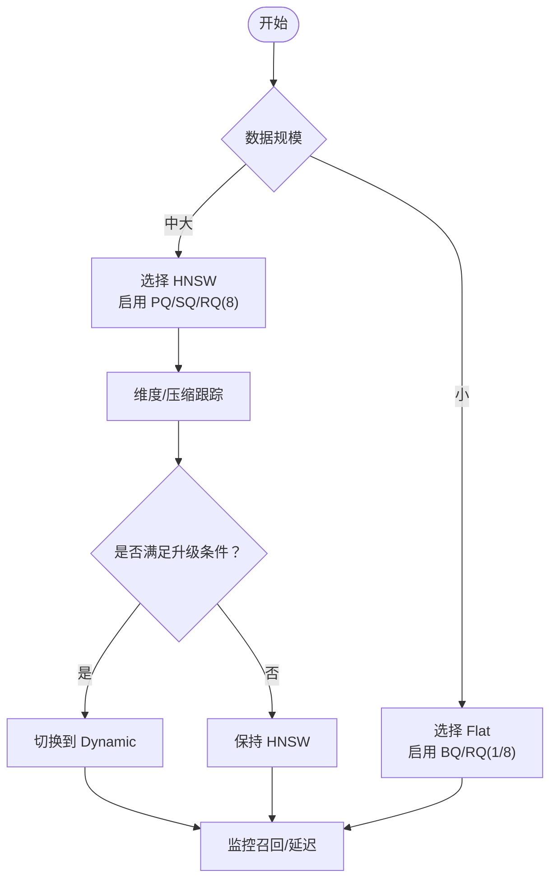
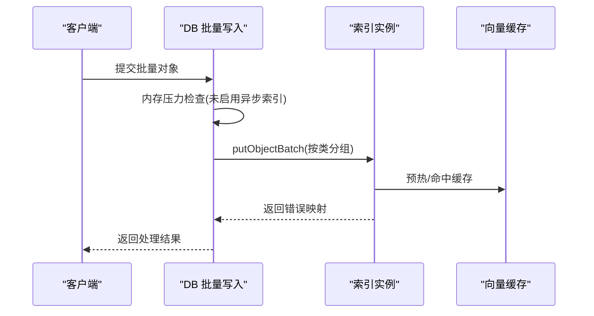
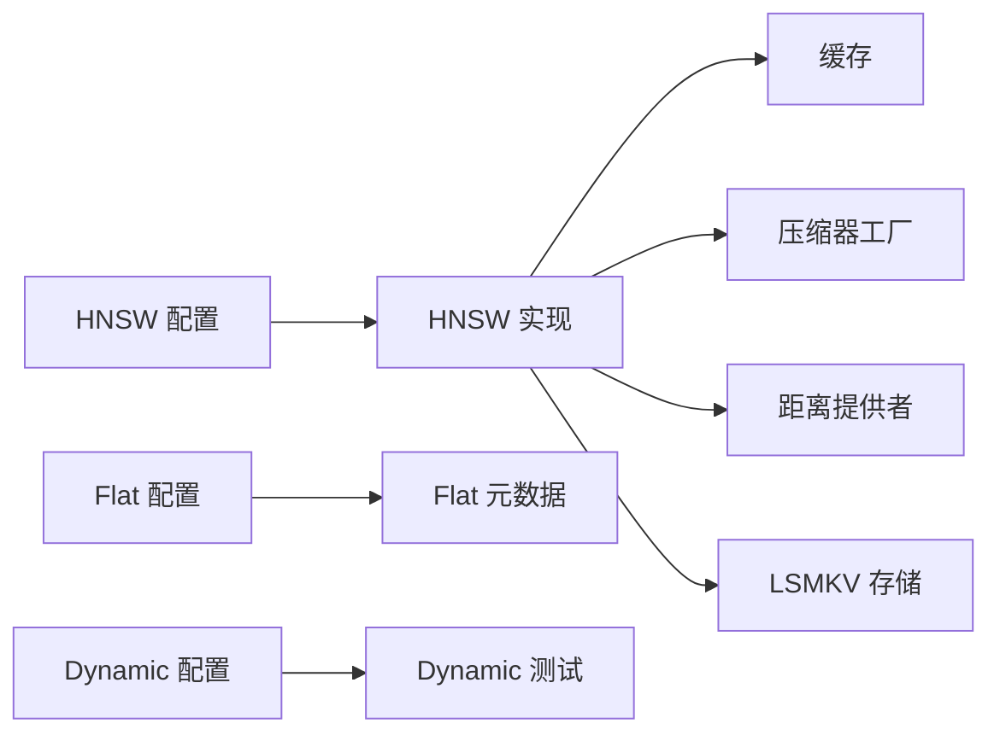

# 索引优化

<cite>
**本文引用的文件**
- [entities/vectorindex/config.go](file://entities/vectorindex/config.go)
- [entities/vectorindex/hnsw/config.go](file://entities/vectorindex/hnsw/config.go)
- [entities/vectorindex/flat/config.go](file://entities/vectorindex/flat/config.go)
- [entities/vectorindex/dynamic/config.go](file://entities/vectorindex/dynamic/config.go)
- [adapters/repos/db/vector/hnsw/index.go](file://adapters/repos/db/vector/hnsw/index.go)
- [adapters/repos/db/vector/hnsw/vector_cache_prefiller.go](file://adapters/repos/db/vector/hnsw/vector_cache_prefiller.go)
- [adapters/repos/db/vector/cache/sharded_lock_cache.go](file://adapters/repos/db/vector/cache/sharded_lock_cache.go)
- [adapters/repos/db/vector/compressionhelpers/compression.go](file://adapters/repos/db/vector/compressionhelpers/compression.go)
- [adapters/repos/db/vector/compressionhelpers/rotational_quantization_test.go](file://adapters/repos/db/vector/compressionhelpers/rotational_quantization_test.go)
- [adapters/repos/db/vector/compressionhelpers/scalar_quantization_test.go](file://adapters/repos/db/vector/compressionhelpers/scalar_quantization_test.go)
- [adapters/repos/db/vector/flat/metadata.go](file://adapters/repos/db/vector/flat/metadata.go)
- [adapters/repos/db/vector/dynamic/index_test.go](file://adapters/repos/db/vector/dynamic/index_test.go)
- [adapters/repos/db/vector/hnsw/flat_search_test.go](file://adapters/repos/db/vector/hnsw/flat_search_test.go)
- [adapters/repos/db/batch.go](file://adapters/repos/db/batch.go)
- [adapters/repos/db/shard_dimension_tracking.go](file://adapters/repos/db/shard_dimension_tracking.go)
- [adapters/repos/db/index.go](file://adapters/repos/db/index.go)
- [openapi-specs/schema.json](file://openapi-specs/schema.json)
</cite>

## 目录
1. [简介](#简介)
2. [项目结构](#项目结构)
3. [核心组件](#核心组件)
4. [架构总览](#架构总览)
5. [详细组件分析](#详细组件分析)
6. [依赖分析](#依赖分析)
7. [性能考量](#性能考量)
8. [故障排查指南](#故障排查指南)
9. [结论](#结论)
10. [附录](#附录)

## 简介
本指南面向 Weaviate 的索引优化实践，聚焦以下目标：
- HNSW 索引参数调优：efConstruction、ef、M 等关键参数的配置策略与性能影响
- 向量压缩技术：PQ、SQ、RQ 的选择标准与压缩比优化
- 索引选择策略：Flat、HNSW、Dynamic 在不同场景下的适用性
- 索引构建优化：批量构建、增量更新、索引预热
- 配置示例与性能对比建议，帮助用户按数据规模与查询模式选择最优方案

## 项目结构
Weaviate 的向量索引能力由“配置解析层”和“实现层”组成：
- 配置解析层：定义各索引类型的用户可配参数与默认值，负责校验与合并默认值
- 实现层：具体索引类型（HNSW、Flat、Dynamic）的构建、查询、压缩与缓存逻辑

**图表来源**
- [entities/vectorindex/config.go](file://entities/vectorindex/config.go#L24-L51)
- [entities/vectorindex/hnsw/config.go](file://entities/vectorindex/hnsw/config.go#L24-L136)
- [entities/vectorindex/flat/config.go](file://entities/vectorindex/flat/config.go#L22-L84)
- [entities/vectorindex/dynamic/config.go](file://entities/vectorindex/dynamic/config.go#L24-L61)
- [adapters/repos/db/vector/hnsw/index.go](file://adapters/repos/db/vector/hnsw/index.go#L44-L200)
- [adapters/repos/db/vector/hnsw/vector_cache_prefiller.go](file://adapters/repos/db/vector/hnsw/vector_cache_prefiller.go#L62-L129)
- [adapters/repos/db/vector/cache/sharded_lock_cache.go](file://adapters/repos/db/vector/cache/sharded_lock_cache.go#L201-L255)
- [adapters/repos/db/vector/compressionhelpers/compression.go](file://adapters/repos/db/vector/compressionhelpers/compression.go#L766-L801)
- [adapters/repos/db/vector/compressionhelpers/rotational_quantization_test.go](file://adapters/repos/db/vector/compressionhelpers/rotational_quantization_test.go#L46-L336)
- [adapters/repos/db/vector/compressionhelpers/scalar_quantization_test.go](file://adapters/repos/db/vector/compressionhelpers/scalar_quantization_test.go#L121-L131)
- [adapters/repos/db/vector/flat/metadata.go](file://adapters/repos/db/vector/flat/metadata.go#L336-L380)
- [adapters/repos/db/vector/dynamic/index_test.go](file://adapters/repos/db/vector/dynamic/index_test.go#L248-L891)
- [adapters/repos/db/vector/hnsw/flat_search_test.go](file://adapters/repos/db/vector/hnsw/flat_search_test.go#L38-L160)
- [adapters/repos/db/batch.go](file://adapters/repos/db/batch.go#L38-L153)
- [adapters/repos/db/shard_dimension_tracking.go](file://adapters/repos/db/shard_dimension_tracking.go#L184-L222)
- [adapters/repos/db/index.go](file://adapters/repos/db/index.go#L3783-L3827)

**章节来源**
- [entities/vectorindex/config.go](file://entities/vectorindex/config.go#L24-L51)
- [entities/vectorindex/hnsw/config.go](file://entities/vectorindex/hnsw/config.go#L24-L136)
- [entities/vectorindex/flat/config.go](file://entities/vectorindex/flat/config.go#L22-L84)
- [entities/vectorindex/dynamic/config.go](file://entities/vectorindex/dynamic/config.go#L24-L61)

## 核心组件
- 索引类型与解析
  - 默认索引类型为 HNSW；支持通过配置切换至 Flat、Dynamic、HFresh
  - 解析入口根据类型分发到对应模块进行校验与默认值填充
- HNSW 用户配置
  - 关键参数：maxConnections（M）、efConstruction、ef、dynamicEfMin/Max/Factor、flatSearchCutoff、distance、压缩配置（PQ/SQ/RQ/BQ）、过滤策略、多向量聚合
  - 默认值与最小/最大边界在配置模块内集中定义与校验
- Flat 用户配置
  - 支持 BQ、RQ（bits=1/8），默认禁用压缩；RQ 的 bits 限制为 1 或 8
- Dynamic 用户配置
  - 基于阈值自动在 Flat 与 HNSW 之间切换；分别继承各自默认配置

**章节来源**
- [entities/vectorindex/config.go](file://entities/vectorindex/config.go#L24-L51)
- [entities/vectorindex/hnsw/config.go](file://entities/vectorindex/hnsw/config.go#L24-L136)
- [entities/vectorindex/flat/config.go](file://entities/vectorindex/flat/config.go#L22-L84)
- [entities/vectorindex/dynamic/config.go](file://entities/vectorindex/dynamic/config.go#L24-L61)

## 架构总览
Weaviate 的向量索引采用“配置即接口”的设计：上层通过统一入口解析配置，底层按类型实现具体索引。HNSW 作为默认高性能索引，提供压缩、缓存与动态 ef 策略；Flat 适合小规模或特定压缩策略；Dynamic 则依据数据规模自动切换。

**图表来源**
- [entities/vectorindex/config.go](file://entities/vectorindex/config.go#L32-L50)
- [entities/vectorindex/hnsw/config.go](file://entities/vectorindex/hnsw/config.go#L138-L258)
- [entities/vectorindex/flat/config.go](file://entities/vectorindex/flat/config.go#L86-L130)
- [entities/vectorindex/dynamic/config.go](file://entities/vectorindex/dynamic/config.go#L63-L125)
- [adapters/repos/db/vector/hnsw/index.go](file://adapters/repos/db/vector/hnsw/index.go#L44-L200)
- [adapters/repos/db/vector/cache/sharded_lock_cache.go](file://adapters/repos/db/vector/cache/sharded_lock_cache.go#L201-L255)
- [adapters/repos/db/vector/hnsw/vector_cache_prefiller.go](file://adapters/repos/db/vector/hnsw/vector_cache_prefiller.go#L62-L129)
- [adapters/repos/db/vector/compressionhelpers/compression.go](file://adapters/repos/db/vector/compressionhelpers/compression.go#L766-L801)
- [adapters/repos/db/vector/compressionhelpers/rotational_quantization_test.go](file://adapters/repos/db/vector/compressionhelpers/rotational_quantization_test.go#L46-L336)
- [adapters/repos/db/vector/compressionhelpers/scalar_quantization_test.go](file://adapters/repos/db/vector/compressionhelpers/scalar_quantization_test.go#L121-L131)
- [adapters/repos/db/vector/flat/metadata.go](file://adapters/repos/db/vector/flat/metadata.go#L336-L380)
- [adapters/repos/db/vector/dynamic/index_test.go](file://adapters/repos/db/vector/dynamic/index_test.go#L248-L891)

## 详细组件分析

### HNSW 参数调优：efConstruction、ef、M
- M（maxConnections）
  - 控制节点最大连接数，决定图的稠密程度与查询/构建成本权衡
  - 默认值与校验范围集中定义，超出范围将触发校验错误
- efConstruction
  - 构建阶段扩展搜索宽度，越大召回越高但构建更慢
  - 建议在大规模训练集上适度增大以提升召回
- ef 与动态 ef（dynamicEfMin/Max/Factor）
  - ef 决定查询扩展宽度；-1 表示由系统按因子与上下界自适应
  - 动态 ef 可在高并发查询场景下平衡延迟与召回
- flatSearchCutoff
  - 当过滤候选小于该阈值时，直接平面扫描以降低开销
- 过滤策略（filterStrategy）
  - sweeping/acorn 两种策略，可通过环境变量或配置指定
- 多向量配置
  - 支持多向量聚合与 Muvera 投影配置，需遵循 KSim 等约束

**图表来源**
- [entities/vectorindex/hnsw/config.go](file://entities/vectorindex/hnsw/config.go#L24-L136)
- [entities/vectorindex/hnsw/config.go](file://entities/vectorindex/hnsw/config.go#L260-L319)
- [adapters/repos/db/vector/hnsw/index.go](file://adapters/repos/db/vector/hnsw/index.go#L88-L101)

**章节来源**
- [entities/vectorindex/hnsw/config.go](file://entities/vectorindex/hnsw/config.go#L24-L136)
- [entities/vectorindex/hnsw/config.go](file://entities/vectorindex/hnsw/config.go#L260-L319)
- [adapters/repos/db/vector/hnsw/index.go](file://adapters/repos/db/vector/hnsw/index.go#L88-L101)

### 向量压缩：PQ、SQ、RQ 选择与优化
- 压缩器工厂
  - 根据位宽（如 1/8）与维度选择旋转量化压缩器
  - 提供缓存与存储抽象，支持压缩后向量的加载与重评分
- RQ（旋转量化）
  - 支持 1/8 位编码；测试覆盖了估计误差、码点分布与不同长度向量的兼容性
  - 适合大维度向量的高压缩比与较佳检索质量
- SQ（标量量化）
  - 测试包含统计特性（A/B 边界），适合对精度有更高要求的场景
- PQ（产品量化）
  - HNSW/Flat 均支持，但 Flat 当前未开放 PQ 开关；启用时注意与缓存配合
- Bits 与 RescoreLimit
  - RQ 的 bits 与 SQ 的 rescoreLimit 是影响压缩质量与重评分成本的关键参数

**图表来源**
- [adapters/repos/db/vector/compressionhelpers/compression.go](file://adapters/repos/db/vector/compressionhelpers/compression.go#L766-L801)
- [adapters/repos/db/vector/compressionhelpers/rotational_quantization_test.go](file://adapters/repos/db/vector/compressionhelpers/rotational_quantization_test.go#L46-L336)
- [adapters/repos/db/vector/compressionhelpers/scalar_quantization_test.go](file://adapters/repos/db/vector/compressionhelpers/scalar_quantization_test.go#L121-L131)
- [adapters/repos/db/vector/flat/metadata.go](file://adapters/repos/db/vector/flat/metadata.go#L336-L380)

**章节来源**
- [adapters/repos/db/vector/compressionhelpers/compression.go](file://adapters/repos/db/vector/compressionhelpers/compression.go#L766-L801)
- [adapters/repos/db/vector/compressionhelpers/rotational_quantization_test.go](file://adapters/repos/db/vector/compressionhelpers/rotational_quantization_test.go#L46-L336)
- [adapters/repos/db/vector/compressionhelpers/scalar_quantization_test.go](file://adapters/repos/db/vector/compressionhelpers/scalar_quantization_test.go#L121-L131)
- [adapters/repos/db/vector/flat/metadata.go](file://adapters/repos/db/vector/flat/metadata.go#L336-L380)

### 索引选择策略：Flat、HNSW、Dynamic
- Flat
  - 适合小规模数据或需要稳定检索的场景；当前仅支持 BQ/RQ（bits=1/8）
  - 若启用压缩，建议开启缓存以降低重评分开销
- HNSW
  - 默认高性能索引，支持压缩与动态 ef；适合大规模数据与高并发查询
  - 可通过阈值与维度跟踪信息判断是否升级到压缩或切换到 Dynamic
- Dynamic
  - 基于阈值自动在 Flat/HNSW 间切换；测试覆盖了升级前后召回与延迟变化

**图表来源**
- [entities/vectorindex/flat/config.go](file://entities/vectorindex/flat/config.go#L22-L84)
- [entities/vectorindex/hnsw/config.go](file://entities/vectorindex/hnsw/config.go#L24-L136)
- [entities/vectorindex/dynamic/config.go](file://entities/vectorindex/dynamic/config.go#L24-L61)
- [adapters/repos/db/shard_dimension_tracking.go](file://adapters/repos/db/shard_dimension_tracking.go#L184-L222)
- [adapters/repos/db/vector/dynamic/index_test.go](file://adapters/repos/db/vector/dynamic/index_test.go#L248-L891)

**章节来源**
- [entities/vectorindex/flat/config.go](file://entities/vectorindex/flat/config.go#L22-L84)
- [entities/vectorindex/hnsw/config.go](file://entities/vectorindex/hnsw/config.go#L24-L136)
- [entities/vectorindex/dynamic/config.go](file://entities/vectorindex/dynamic/config.go#L24-L61)
- [adapters/repos/db/shard_dimension_tracking.go](file://adapters/repos/db/shard_dimension_tracking.go#L184-L222)
- [adapters/repos/db/vector/dynamic/index_test.go](file://adapters/repos/db/vector/dynamic/index_test.go#L248-L891)

### 索引构建优化：批量、增量与预热
- 批量写入
  - 在未启用异步索引时，批量写入会进行内存压力检查，避免 OOM
  - 分类聚合后并行写入各索引，统计批大小与字节指标
- 增量更新
  - HNSW 支持删除标记与墓碑清理周期任务；删除与插入互斥保证一致性
  - 删除与插入并发控制通过读写锁协调
- 索引预热
  - 向量缓存预热器按层级填充缓存，减少冷启动重评分开销
  - 分片缓存提供页粒度读锁，降低并发 miss 时的串行化成本

**图表来源**
- [adapters/repos/db/batch.go](file://adapters/repos/db/batch.go#L38-L153)
- [adapters/repos/db/vector/hnsw/vector_cache_prefiller.go](file://adapters/repos/db/vector/hnsw/vector_cache_prefiller.go#L62-L129)
- [adapters/repos/db/vector/cache/sharded_lock_cache.go](file://adapters/repos/db/vector/cache/sharded_lock_cache.go#L201-L255)

**章节来源**
- [adapters/repos/db/batch.go](file://adapters/repos/db/batch.go#L38-L153)
- [adapters/repos/db/vector/hnsw/vector_cache_prefiller.go](file://adapters/repos/db/vector/hnsw/vector_cache_prefiller.go#L62-L129)
- [adapters/repos/db/vector/cache/sharded_lock_cache.go](file://adapters/repos/db/vector/cache/sharded_lock_cache.go#L201-L255)

### 配置示例与性能对比建议
- HNSW 配置要点
  - efConstruction：建议在构建阶段设为较大值（如 128~512）以提升召回
  - ef：默认 -1 由系统按 dynamicEfMin/Max/Factor 自适应；若固定查询负载，可显式设置
  - maxConnections：默认 32；高密度图可适当增大（受上限约束）
  - flatSearchCutoff：默认 40000；过滤场景下可下调以触发平面搜索
  - 压缩：优先考虑 RQ-8；若对精度敏感可尝试 SQ；PQ 适用于特定维度与段数
- Flat 配置要点
  - bits=8 或 1；建议启用缓存以降低重评分成本
  - 当前不支持 PQ/SQ，启用压缩需配合缓存
- Dynamic 配置要点
  - threshold：根据数据规模设定（例如 10000）；测试显示升级前后召回与延迟变化明显
- 性能对比建议
  - 小规模（<10K）：Flat + RQ-8 或 BQ，延迟低、部署简单
  - 中大规模（>10K）：HNSW + RQ-8 或 SQ，兼顾吞吐与精度
  - 高并发查询：启用动态 ef，结合缓存预热与墓碑清理周期任务

**章节来源**
- [entities/vectorindex/hnsw/config.go](file://entities/vectorindex/hnsw/config.go#L24-L136)
- [entities/vectorindex/flat/config.go](file://entities/vectorindex/flat/config.go#L22-L84)
- [entities/vectorindex/dynamic/config.go](file://entities/vectorindex/dynamic/config.go#L24-L61)
- [adapters/repos/db/vector/dynamic/index_test.go](file://adapters/repos/db/vector/dynamic/index_test.go#L248-L891)
- [adapters/repos/db/vector/hnsw/flat_search_test.go](file://adapters/repos/db/vector/hnsw/flat_search_test.go#L38-L160)

## 依赖分析
- 组件耦合
  - 配置解析层与实现层通过接口解耦；HNSW/Flat/Dynamic 分别维护自身配置与行为
  - HNSW 依赖缓存、压缩器工厂与距离提供者；Dynamic 依赖阈值与维度跟踪
- 外部依赖
  - LSMKV 存储用于持久化压缩向量与桶视图
  - 距离提供者（余弦/点积/L2）影响压缩与检索质量
- 循环依赖
  - 未发现直接循环依赖；配置与实现通过接口与工厂模式隔离

**图表来源**
- [entities/vectorindex/hnsw/config.go](file://entities/vectorindex/hnsw/config.go#L138-L258)
- [entities/vectorindex/flat/config.go](file://entities/vectorindex/flat/config.go#L86-L130)
- [entities/vectorindex/dynamic/config.go](file://entities/vectorindex/dynamic/config.go#L63-L125)
- [adapters/repos/db/vector/hnsw/index.go](file://adapters/repos/db/vector/hnsw/index.go#L44-L200)
- [adapters/repos/db/vector/compressionhelpers/compression.go](file://adapters/repos/db/vector/compressionhelpers/compression.go#L766-L801)

**章节来源**
- [entities/vectorindex/hnsw/config.go](file://entities/vectorindex/hnsw/config.go#L138-L258)
- [entities/vectorindex/flat/config.go](file://entities/vectorindex/flat/config.go#L86-L130)
- [entities/vectorindex/dynamic/config.go](file://entities/vectorindex/dynamic/config.go#L63-L125)
- [adapters/repos/db/vector/hnsw/index.go](file://adapters/repos/db/vector/hnsw/index.go#L44-L200)

## 性能考量
- 参数与性能权衡
  - M（maxConnections）增大提升召回但增加内存与构建时间
  - efConstruction 增大提升召回但显著增加构建成本
  - ef 越大延迟越低但吞吐下降；动态 ef 适合波动查询负载
  - flatSearchCutoff 下调可减少图搜索开销，但过滤场景需权衡
- 压缩与缓存
  - RQ-8 提供高压缩比与较好精度；SQ 更适合高精度需求
  - 启用压缩需配合缓存；缓存预热可显著降低冷启动重评分延迟
- 批量与增量
  - 批量写入启用内存压力检查；异步索引可缓解入队阻塞
  - 删除与插入互斥锁保障一致性；定期清理墓碑降低查询开销

[本节为通用指导，无需特定文件分析]

## 故障排查指南
- 参数校验失败
  - 检查 maxConnections/efConstruction/ef/filterStrategy 是否在允许范围内
  - HNSW 不允许同时启用多种压缩方法
- 压缩启用问题
  - Flat 不支持 PQ/SQ；RQ bits 必须为 1 或 8
  - 启用压缩需同时启用缓存（除 Flat 的 RQ/BQ）
- 查询性能异常
  - 调整 ef/dynamicEfMin/Max/Factor；检查 flatSearchCutoff
  - 观察缓存命中率与预热效果；必要时扩大缓存容量
- 批量写入失败
  - 检查内存压力检查与异步索引开关；确认分类聚合与索引映射正确

**章节来源**
- [entities/vectorindex/hnsw/config.go](file://entities/vectorindex/hnsw/config.go#L260-L319)
- [entities/vectorindex/flat/config.go](file://entities/vectorindex/flat/config.go#L194-L231)
- [adapters/repos/db/batch.go](file://adapters/repos/db/batch.go#L54-L60)

## 结论
- HNSW 是默认高性能索引，适合大多数生产场景；通过 efConstruction、ef、M 与动态 ef 策略可灵活权衡召回与延迟
- 压缩策略应结合数据维度与精度需求：RQ-8 适合高压缩比，SQ 适合高精度，PQ 适用于特定场景
- Flat 适合小规模与稳定场景；Dynamic 适合按规模自动切换
- 批量写入、缓存预热与墓碑清理是构建与运行期优化的关键

[本节为总结，无需特定文件分析]

## 附录
- 配置入口与类型定义
  - 索引类型枚举与解析入口位于统一配置模块
  - OpenAPI Schema 定义了 VectorConfig 的 vectorIndexType 与 vectorIndexConfig 字段，便于外部系统集成

**章节来源**
- [entities/vectorindex/config.go](file://entities/vectorindex/config.go#L24-L51)
- [openapi-specs/schema.json](file://openapi-specs/schema.json#L1596-L1612)