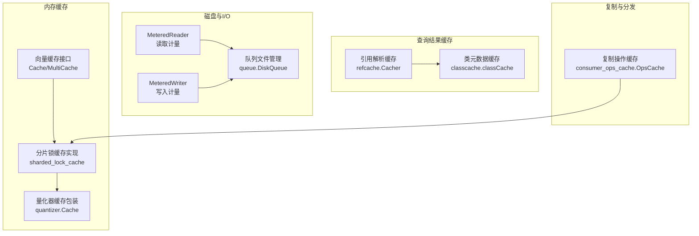
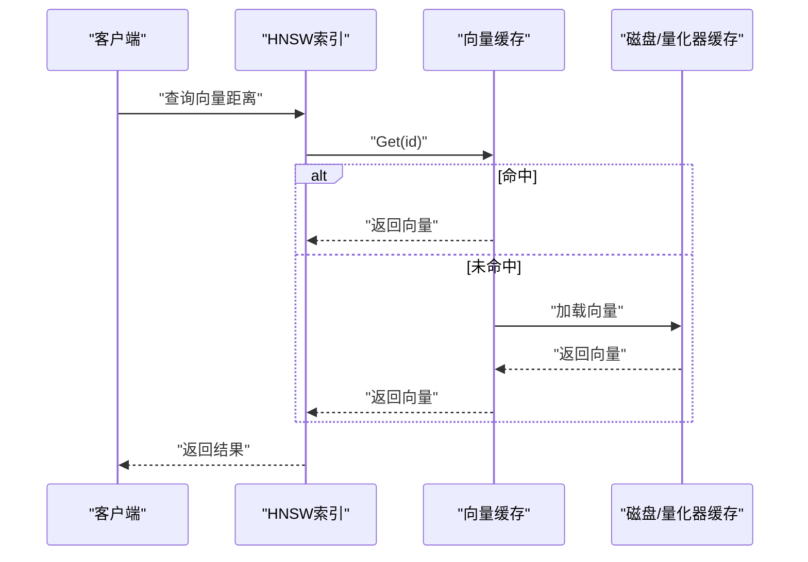
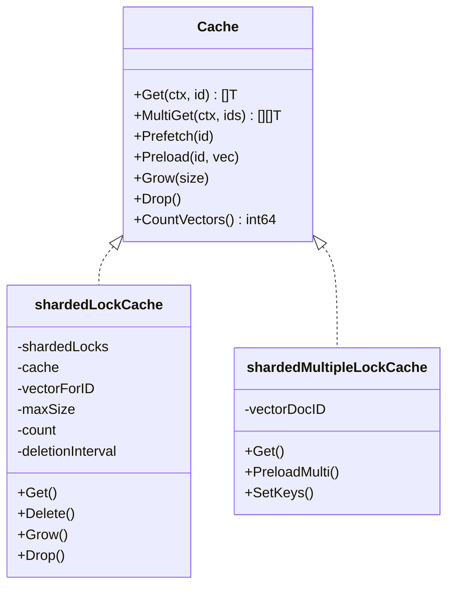
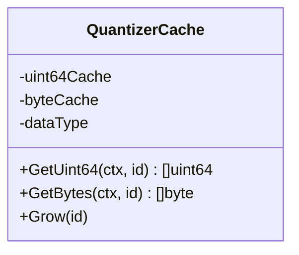
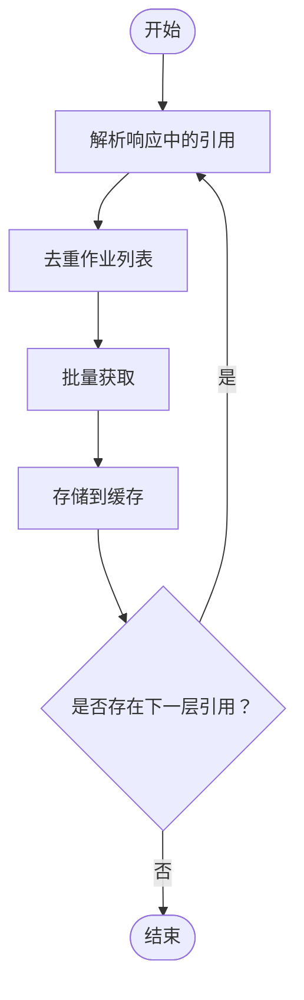
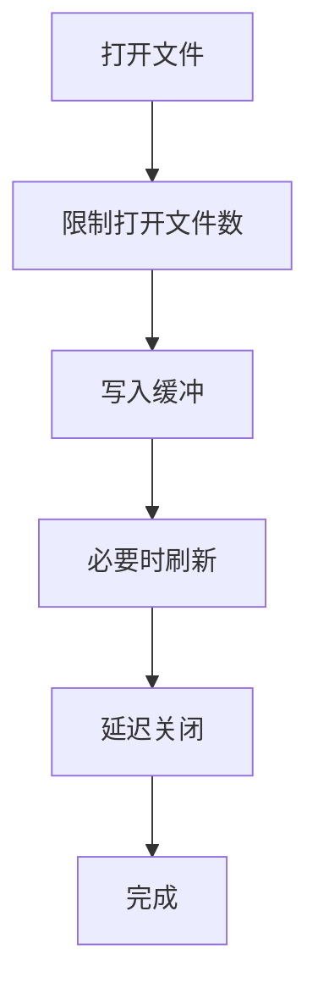
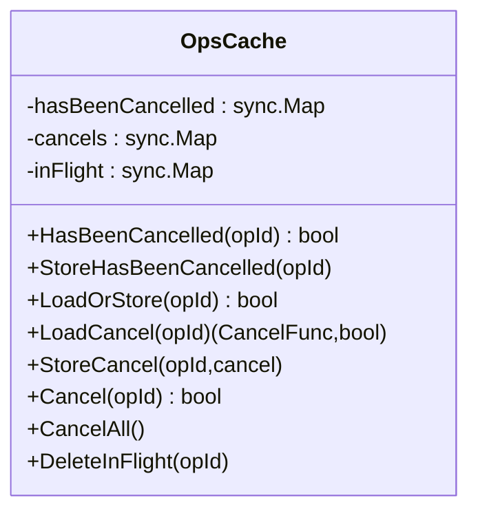
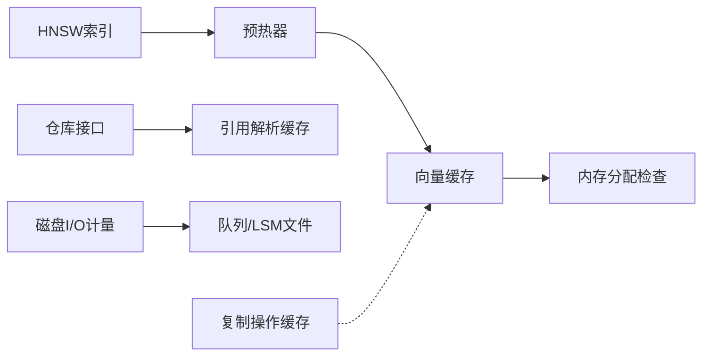

# 缓存策略

<cite>
**本文引用的文件**
- [adapters/repos/db/vector/cache/cache.go](file://adapters/repos/db/vector/cache/cache.go)
- [adapters/repos/db/vector/cache/sharded_lock_cache.go](file://adapters/repos/db/vector/cache/sharded_lock_cache.go)
- [adapters/repos/db/vector/hnsw/vector_cache_prefiller.go](file://adapters/repos/db/vector/hnsw/vector_cache_prefiller.go)
- [adapters/repos/db/vector/flat/quantizer.go](file://adapters/repos/db/vector/flat/quantizer.go)
- [adapters/repos/db/vector/flat/index_test.go](file://adapters/repos/db/vector/flat/index_test.go)
- [adapters/repos/db/vector/hnsw/dynamic_ef_test.go](file://adapters/repos/db/vector/hnsw/dynamic_ef_test.go)
- [adapters/repos/db/vector/cache/sharded_lock_cache_test.go](file://adapters/repos/db/vector/cache/sharded_lock_cache_test.go)
- [adapters/repos/db/refcache/cacher.go](file://adapters/repos/db/refcache/cacher.go)
- [entities/classcache/classcache.go](file://entities/classcache/classcache.go)
- [cluster/replication/consumer_ops_cache.go](file://cluster/replication/consumer_ops_cache.go)
- [entities/diskio/metered_reader.go](file://entities/diskio/metered_reader.go)
- [entities/diskio/metered_writer_block_size.go](file://entities/diskio/metered_writer_block_size.go)
- [adapters/repos/db/queue/queue.go](file://adapters/repos/db/queue/queue.go)
- [usecases/monitoring/prometheus.go](file://usecases/monitoring/prometheus.go)
- [usecases/objects/metrics.go](file://usecases/objects/metrics.go)
</cite>

## 目录
1. [引言](#引言)
2. [项目结构](#项目结构)
3. [核心组件](#核心组件)
4. [架构总览](#架构总览)
5. [详细组件分析](#详细组件分析)
6. [依赖关系分析](#依赖关系分析)
7. [性能考量](#性能考量)
8. [故障排查指南](#故障排查指南)
9. [结论](#结论)
10. [附录：配置示例与优化建议](#附录配置示例与优化建议)

## 引言
本指南面向 Weaviate 的缓存策略实施方案，围绕内存缓存（向量缓存、类元数据缓存、请求结果缓存）、磁盘缓存（LSM/队列文件管理与 I/O 优化）以及查询结果缓存一致性与多级缓存架构进行系统化梳理，并提供可操作的配置示例与性能优化建议。文档以代码为依据，结合流程图与类图，帮助读者在理解实现细节的同时，制定可落地的缓存方案。

## 项目结构
Weaviate 在多个层面实现了缓存能力：
- 向量缓存：基于分片锁的本地内存缓存，支持单向量与多段向量两类缓存接口与实现，具备预热、淘汰与容量控制。
- 类元数据缓存：轻量级并发缓存，用于存储类定义与版本信息。
- 请求结果缓存：针对引用解析等场景的请求级缓存，减少重复拉取与解析成本。
- 磁盘 I/O 监控：对读写进行计量回调，辅助 I/O 优化与性能分析。
- 队列与 LSM 文件：通过文件管理与缓冲策略降低磁盘压力。
- 复制/分发场景的缓存：用于跟踪复制操作状态，避免重复处理。

图表来源
- [adapters/repos/db/vector/cache/cache.go](file://adapters/repos/db/vector/cache/cache.go#L19-L49)
- [adapters/repos/db/vector/cache/sharded_lock_cache.go](file://adapters/repos/db/vector/cache/sharded_lock_cache.go#L29-L44)
- [adapters/repos/db/vector/flat/quantizer.go](file://adapters/repos/db/vector/flat/quantizer.go#L205-L224)
- [adapters/repos/db/refcache/cacher.go](file://adapters/repos/db/refcache/cacher.go#L48-L57)
- [entities/classcache/classcache.go](file://entities/classcache/classcache.go#L20-L25)
- [entities/diskio/metered_reader.go](file://entities/diskio/metered_reader.go#L25-L67)
- [entities/diskio/metered_writer_block_size.go](file://entities/diskio/metered_writer_block_size.go#L25-L58)
- [adapters/repos/db/queue/queue.go](file://adapters/repos/db/queue/queue.go#L1170-L1220)
- [cluster/replication/consumer_ops_cache.go](file://cluster/replication/consumer_ops_cache.go#L19-L33)

章节来源
- [adapters/repos/db/vector/cache/cache.go](file://adapters/repos/db/vector/cache/cache.go#L19-L49)
- [adapters/repos/db/vector/cache/sharded_lock_cache.go](file://adapters/repos/db/vector/cache/sharded_lock_cache.go#L29-L44)
- [adapters/repos/db/vector/flat/quantizer.go](file://adapters/repos/db/vector/flat/quantizer.go#L205-L224)
- [adapters/repos/db/refcache/cacher.go](file://adapters/repos/db/refcache/cacher.go#L48-L57)
- [entities/classcache/classcache.go](file://entities/classcache/classcache.go#L20-L25)
- [entities/diskio/metered_reader.go](file://entities/diskio/metered_reader.go#L25-L67)
- [entities/diskio/metered_writer_block_size.go](file://entities/diskio/metered_writer_block_size.go#L25-L58)
- [adapters/repos/db/queue/queue.go](file://adapters/repos/db/queue/queue.go#L1170-L1220)
- [cluster/replication/consumer_ops_cache.go](file://cluster/replication/consumer_ops_cache.go#L19-L33)

## 核心组件
- 向量缓存接口与实现
  - 接口定义了统一的 Get/MultiGet/Prefetch/Preload/Grow/Drop 等能力，支持按页大小分片读写锁，具备容量上限与定期清理机制。
  - 实现区分单向量与多段向量两类缓存，前者适合 HNSW 索引节点向量，后者适合分段文档向量。
- 量化器缓存包装
  - 针对压缩量化后的字节/整型向量提供缓存封装，按类型选择不同底层缓存实例。
- 查询结果缓存
  - 引用解析缓存：递归构建引用解析任务，去重后批量拉取，减少重复网络与解析开销。
  - 类元数据缓存：并发安全的类定义与版本缓存。
- 磁盘 I/O 计量
  - MeteredReader/MeteredWriter 提供读写回调，便于统计吞吐与时延，指导 I/O 优化。
- 队列与 LSM 文件管理
  - 通过文件句柄数量限制、延迟缓冲写入与块大小策略，平衡磁盘压力与吞吐。
- 复制操作缓存
  - 跟踪复制操作是否已取消、是否在途，避免重复执行与资源浪费。

章节来源
- [adapters/repos/db/vector/cache/cache.go](file://adapters/repos/db/vector/cache/cache.go#L21-L49)
- [adapters/repos/db/vector/cache/sharded_lock_cache.go](file://adapters/repos/db/vector/cache/sharded_lock_cache.go#L56-L130)
- [adapters/repos/db/vector/flat/quantizer.go](file://adapters/repos/db/vector/flat/quantizer.go#L205-L224)
- [adapters/repos/db/refcache/cacher.go](file://adapters/repos/db/refcache/cacher.go#L48-L57)
- [entities/classcache/classcache.go](file://entities/classcache/classcache.go#L20-L25)
- [entities/diskio/metered_reader.go](file://entities/diskio/metered_reader.go#L25-L67)
- [entities/diskio/metered_writer_block_size.go](file://entities/diskio/metered_writer_block_size.go#L25-L58)
- [adapters/repos/db/queue/queue.go](file://adapters/repos/db/queue/queue.go#L1170-L1220)
- [cluster/replication/consumer_ops_cache.go](file://cluster/replication/consumer_ops_cache.go#L19-L33)

## 架构总览
Weaviate 的缓存体系以“本地内存缓存”为核心，配合“查询结果缓存”和“磁盘 I/O 计量”，在向量检索、引用解析、类元数据访问等路径上形成多级协同。复制与分发场景引入“操作状态缓存”，确保一致性与幂等性。

图表来源
- [adapters/repos/db/vector/cache/sharded_lock_cache.go](file://adapters/repos/db/vector/cache/sharded_lock_cache.go#L136-L195)
- [adapters/repos/db/vector/flat/quantizer.go](file://adapters/repos/db/vector/flat/quantizer.go#L394-L408)

## 详细组件分析

### 内存缓存：向量缓存与预热
- 分片锁缓存
  - 支持 float32/byte/uint64 三类向量缓存，使用分片读写锁提升并发性能；提供预取、预加载、增长与容量上限控制。
  - 定期检查缓存条目数量，超过上限时清空缓存，避免内存膨胀。
- 预热器
  - 按 HNSW 层级顺序遍历节点，调用缓存接口触发加载，减少首次查询延迟。
- 测试验证
  - 通过基准测试验证缓存命中与召回率，同时覆盖删除与过滤场景。

图表来源
- [adapters/repos/db/vector/cache/cache.go](file://adapters/repos/db/vector/cache/cache.go#L29-L49)
- [adapters/repos/db/vector/cache/sharded_lock_cache.go](file://adapters/repos/db/vector/cache/sharded_lock_cache.go#L29-L44)
- [adapters/repos/db/vector/cache/sharded_lock_cache.go](file://adapters/repos/db/vector/cache/sharded_lock_cache.go#L425-L443)

章节来源
- [adapters/repos/db/vector/cache/sharded_lock_cache.go](file://adapters/repos/db/vector/cache/sharded_lock_cache.go#L56-L130)
- [adapters/repos/db/vector/hnsw/vector_cache_prefiller.go](file://adapters/repos/db/vector/hnsw/vector_cache_prefiller.go#L38-L95)
- [adapters/repos/db/vector/flat/index_test.go](file://adapters/repos/db/vector/flat/index_test.go#L214-L253)

### 量化器缓存：压缩向量的内存缓存
- 为旋转量化等压缩格式提供专用缓存包装，按量化类型选择对应底层缓存实例。
- 支持按需预加载与增长，保证检索阶段的低延迟。

图表来源
- [adapters/repos/db/vector/flat/quantizer.go](file://adapters/repos/db/vector/flat/quantizer.go#L205-L224)
- [adapters/repos/db/vector/flat/quantizer.go](file://adapters/repos/db/vector/flat/quantizer.go#L394-L408)

章节来源
- [adapters/repos/db/vector/flat/quantizer.go](file://adapters/repos/db/vector/flat/quantizer.go#L205-L224)
- [adapters/repos/db/vector/flat/quantizer.go](file://adapters/repos/db/vector/flat/quantizer.go#L394-L408)

### 查询结果缓存：引用解析与类元数据
- 引用解析缓存
  - 从响应中识别需要解析的引用，去重后生成批量查询，递归构建层级，最终一次性存储结果，显著降低重复请求。
- 类元数据缓存
  - 并发安全的类定义与版本缓存，避免重复解析与校验。

图表来源
- [adapters/repos/db/refcache/cacher.go](file://adapters/repos/db/refcache/cacher.go#L78-L95)
- [adapters/repos/db/refcache/cacher.go](file://adapters/repos/db/refcache/cacher.go#L315-L329)

章节来源
- [adapters/repos/db/refcache/cacher.go](file://adapters/repos/db/refcache/cacher.go#L48-L57)
- [adapters/repos/db/refcache/cacher.go](file://adapters/repos/db/refcache/cacher.go#L78-L95)
- [adapters/repos/db/refcache/cacher.go](file://adapters/repos/db/refcache/cacher.go#L315-L329)
- [entities/classcache/classcache.go](file://entities/classcache/classcache.go#L20-L25)

### 磁盘缓存优化：文件管理与 I/O 优化
- 文件管理
  - 通过文件句柄数量限制与延迟关闭策略，控制打开文件数，减少文件描述符压力。
  - 提供目录存在性、空目录检测与 fsync 工具函数，保障数据落盘一致性。
- I/O 计量
  - MeteredReader/MeteredWriter 在每次读写后回调统计信息，便于分析吞吐与时延分布。
- 队列与 LSM 文件
  - 使用延迟缓冲写入与块大小策略，减少频繁小块写入带来的磁盘抖动。

图表来源
- [adapters/repos/db/queue/queue.go](file://adapters/repos/db/queue/queue.go#L1170-L1220)
- [entities/diskio/metered_reader.go](file://entities/diskio/metered_reader.go#L30-L46)
- [entities/diskio/metered_writer_block_size.go](file://entities/diskio/metered_writer_block_size.go#L30-L41)

章节来源
- [adapters/repos/db/queue/queue.go](file://adapters/repos/db/queue/queue.go#L1170-L1220)
- [entities/diskio/metered_reader.go](file://entities/diskio/metered_reader.go#L30-L46)
- [entities/diskio/metered_writer_block_size.go](file://entities/diskio/metered_writer_block_size.go#L30-L41)

### 复制与分发：操作状态缓存
- OpsCache 维护“是否已取消”、“是否在途”、“取消函数”等映射，避免重复处理与资源泄漏。
- 支持批量取消与清理，确保复制流程的可控性与一致性。

图表来源
- [cluster/replication/consumer_ops_cache.go](file://cluster/replication/consumer_ops_cache.go#L19-L33)
- [cluster/replication/consumer_ops_cache.go](file://cluster/replication/consumer_ops_cache.go#L43-L106)

章节来源
- [cluster/replication/consumer_ops_cache.go](file://cluster/replication/consumer_ops_cache.go#L19-L33)
- [cluster/replication/consumer_ops_cache.go](file://cluster/replication/consumer_ops_cache.go#L43-L106)

## 依赖关系分析
- 向量缓存依赖分片锁与内存分配检查器，在高内存压力下阻止新分配，保护系统稳定性。
- 预热器依赖 HNSW 索引节点信息，按层级填充缓存。
- 引用解析缓存依赖仓库接口进行批量获取，减少往返次数。
- 磁盘 I/O 计量与队列文件管理共同作用于 LSM/队列写入路径，降低磁盘压力。
- 复制操作缓存与向量缓存无直接耦合，但共享“容量上限与定期清理”的设计思想。

图表来源
- [adapters/repos/db/vector/hnsw/vector_cache_prefiller.go](file://adapters/repos/db/vector/hnsw/vector_cache_prefiller.go#L38-L95)
- [adapters/repos/db/vector/cache/sharded_lock_cache.go](file://adapters/repos/db/vector/cache/sharded_lock_cache.go#L160-L195)
- [adapters/repos/db/refcache/cacher.go](file://adapters/repos/db/refcache/cacher.go#L315-L329)
- [entities/diskio/metered_reader.go](file://entities/diskio/metered_reader.go#L30-L46)
- [adapters/repos/db/queue/queue.go](file://adapters/repos/db/queue/queue.go#L1170-L1220)
- [cluster/replication/consumer_ops_cache.go](file://cluster/replication/consumer_ops_cache.go#L43-L106)

章节来源
- [adapters/repos/db/vector/hnsw/vector_cache_prefiller.go](file://adapters/repos/db/vector/hnsw/vector_cache_prefiller.go#L38-L95)
- [adapters/repos/db/vector/cache/sharded_lock_cache.go](file://adapters/repos/db/vector/cache/sharded_lock_cache.go#L160-L195)
- [adapters/repos/db/refcache/cacher.go](file://adapters/repos/db/refcache/cacher.go#L315-L329)
- [entities/diskio/metered_reader.go](file://entities/diskio/metered_reader.go#L30-L46)
- [adapters/repos/db/queue/queue.go](file://adapters/repos/db/queue/queue.go#L1170-L1220)
- [cluster/replication/consumer_ops_cache.go](file://cluster/replication/consumer_ops_cache.go#L43-L106)

## 性能考量
- 向量缓存大小与淘汰
  - 通过容量上限与定期清理机制控制内存占用；默认最大值极大，仅在自定义缩小时生效。
  - 预热器按层级填充，减少冷启动延迟。
- I/O 优化
  - MeteredReader/MeteredWriter 提供读写回调，可用于统计吞吐与时延，指导块大小与缓冲策略。
  - 队列文件管理限制打开文件数，延迟关闭，降低文件描述符与磁盘抖动。
- 动态 EF 与缓存协同
  - 动态 EF 受缓存规模影响，缓存命中率提升可降低搜索代价，建议结合缓存预热与容量规划。

章节来源
- [adapters/repos/db/vector/cache/sharded_lock_cache.go](file://adapters/repos/db/vector/cache/sharded_lock_cache.go#L376-L389)
- [adapters/repos/db/vector/hnsw/vector_cache_prefiller.go](file://adapters/repos/db/vector/hnsw/vector_cache_prefiller.go#L38-L95)
- [entities/diskio/metered_reader.go](file://entities/diskio/metered_reader.go#L30-L46)
- [entities/diskio/metered_writer_block_size.go](file://entities/diskio/metered_writer_block_size.go#L30-L41)
- [adapters/repos/db/queue/queue.go](file://adapters/repos/db/queue/queue.go#L1170-L1220)
- [adapters/repos/db/vector/hnsw/dynamic_ef_test.go](file://adapters/repos/db/vector/hnsw/dynamic_ef_test.go#L42-L88)

## 故障排查指南
- 缓存未命中或 OOM
  - 当内存压力过大时，缓存会跳过加载以保护系统；可通过日志定位具体文档/向量 ID。
- 预热不充分
  - 检查预热器是否按层级正确填充；确认缓存上限与页大小配置合理。
- 磁盘文件过多
  - 检查打开文件数限制与延迟关闭逻辑；关注队列文件清理策略。
- 复制操作重复执行
  - 检查 OpsCache 中“在途/已取消”标记，确保取消流程正确执行。

章节来源
- [adapters/repos/db/vector/cache/sharded_lock_cache.go](file://adapters/repos/db/vector/cache/sharded_lock_cache.go#L160-L195)
- [adapters/repos/db/vector/hnsw/vector_cache_prefiller.go](file://adapters/repos/db/vector/hnsw/vector_cache_prefiller.go#L38-L95)
- [adapters/repos/db/queue/queue.go](file://adapters/repos/db/queue/queue.go#L1170-L1220)
- [cluster/replication/consumer_ops_cache.go](file://cluster/replication/consumer_ops_cache.go#L43-L106)

## 结论
Weaviate 的缓存策略以“本地内存缓存”为核心，结合“查询结果缓存”和“磁盘 I/O 计量”，在向量检索、引用解析与复制分发等关键路径上形成高效协同。通过容量上限、定期清理、分片锁与预热器等机制，既能保证性能，又能维持系统稳定性。建议在生产环境中结合监控指标与压测结果，持续优化缓存大小、预热策略与 I/O 参数。

## 附录：配置示例与优化建议
- 向量缓存大小与预热
  - 通过用户配置项设置缓存最大对象数，结合预热器按层级填充，提升首次查询命中率。
  - 示例参考：[向量缓存上限测试](file://adapters/repos/db/vector/hnsw/dynamic_ef_test.go#L42-L88)
- 缓存淘汰策略
  - 默认最大值极大，仅在自定义缩小时生效；定期清理线程会在达到上限时清空缓存。
  - 示例参考：[缓存上限与清理](file://adapters/repos/db/vector/cache/sharded_lock_cache.go#L376-L389)
- 查询结果缓存
  - 引用解析缓存采用去重+批量获取策略，建议在深度嵌套场景启用，减少往返次数。
  - 示例参考：[引用解析缓存构建](file://adapters/repos/db/refcache/cacher.go#L78-L95)
- 磁盘缓存与 I/O 优化
  - 使用 MeteredReader/MeteredWriter 进行读写统计，结合队列文件管理策略调整块大小与延迟关闭阈值。
  - 示例参考：[文件管理与句柄限制](file://adapters/repos/db/queue/queue.go#L1170-L1220)
- 复制与分发一致性
  - 使用 OpsCache 跟踪操作状态，避免重复执行；在取消流程中确保清理“在途/取消”映射。
  - 示例参考：[操作状态缓存](file://cluster/replication/consumer_ops_cache.go#L43-L106)
- 性能监控与评估
  - 利用 Prometheus 指标与对象操作计数器，评估缓存命中率与查询延迟变化趋势。
  - 示例参考：[Prometheus 指标注册](file://usecases/monitoring/prometheus.go#L407-L424)、[对象操作计数器](file://usecases/objects/metrics.go#L58-L139)

章节来源
- [adapters/repos/db/vector/hnsw/dynamic_ef_test.go](file://adapters/repos/db/vector/hnsw/dynamic_ef_test.go#L42-L88)
- [adapters/repos/db/vector/cache/sharded_lock_cache.go](file://adapters/repos/db/vector/cache/sharded_lock_cache.go#L376-L389)
- [adapters/repos/db/refcache/cacher.go](file://adapters/repos/db/refcache/cacher.go#L78-L95)
- [adapters/repos/db/queue/queue.go](file://adapters/repos/db/queue/queue.go#L1170-L1220)
- [cluster/replication/consumer_ops_cache.go](file://cluster/replication/consumer_ops_cache.go#L43-L106)
- [usecases/monitoring/prometheus.go](file://usecases/monitoring/prometheus.go#L407-L424)
- [usecases/objects/metrics.go](file://usecases/objects/metrics.go#L58-L139)