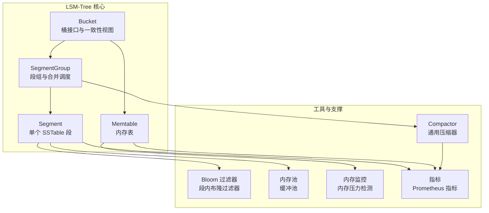
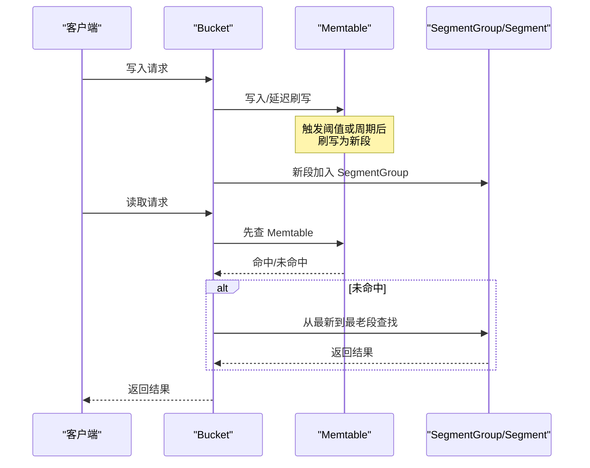
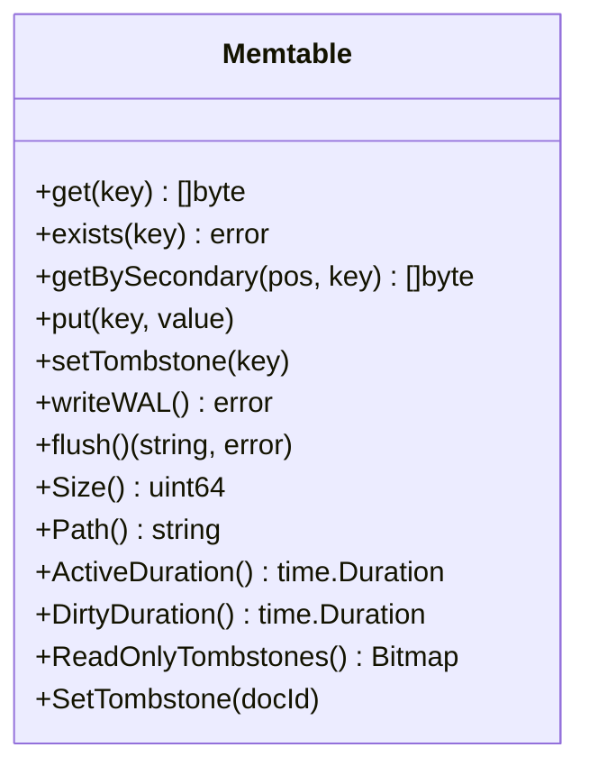
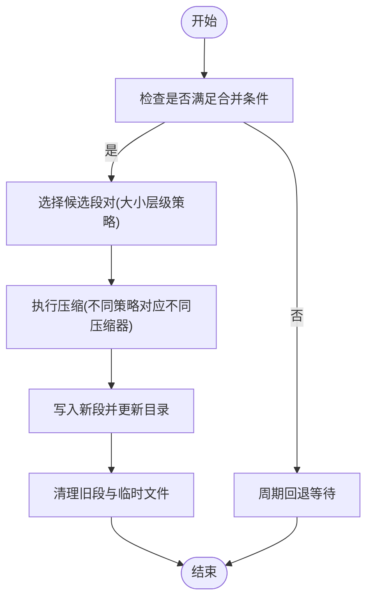
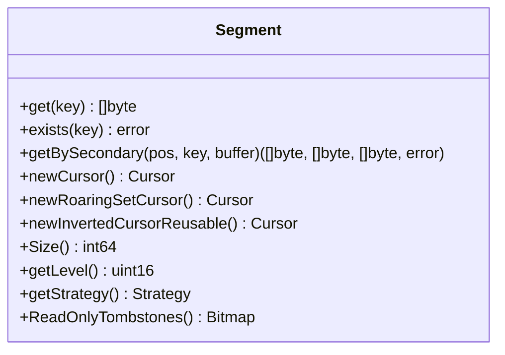
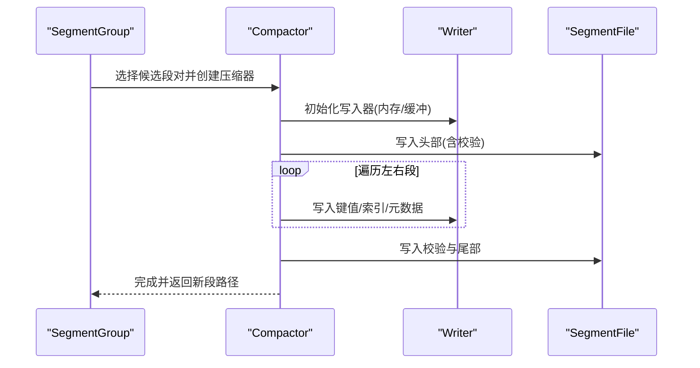
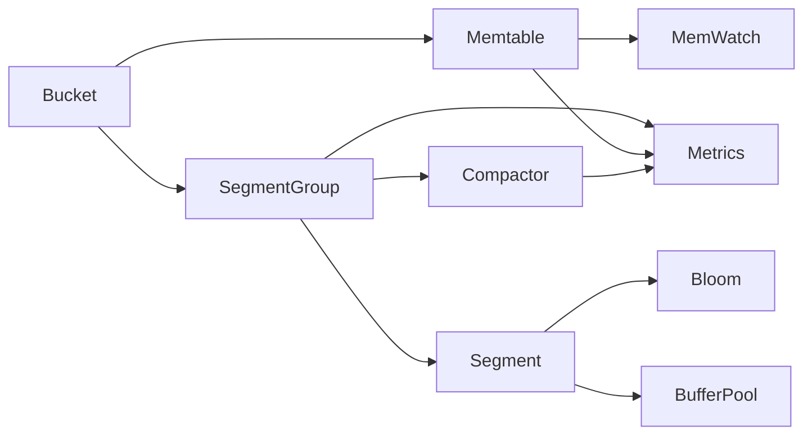

# LSM-Tree 存储引擎优化

<cite>
**本文档引用的文件**
- [memtable.go](file://adapters/repos/db/lsmkv/memtable.go)
- [segment_group.go](file://adapters/repos/db/lsmkv/segment_group.go)
- [segment.go](file://adapters/repos/db/lsmkv/segment.go)
- [bucket.go](file://adapters/repos/db/lsmkv/bucket.go)
- [compactor.go](file://adapters/repos/db/compactor/compactor.go)
- [metrics.go](file://adapters/repos/db/lsmkv/metrics.go)
- [segment_bloom_filters.go](file://adapters/repos/db/lsmkv/segment_bloom_filters.go)
- [buf_pool.go](file://adapters/repos/db/roaringset/buf_pool.go)
- [monitor.go](file://usecases/memwatch/monitor.go)
</cite>

## 目录
1. [简介](#简介)
2. [项目结构](#项目结构)
3. [核心组件](#核心组件)
4. [架构总览](#架构总览)
5. [详细组件分析](#详细组件分析)
6. [依赖关系分析](#依赖关系分析)
7. [性能考虑](#性能考虑)
8. [故障排查指南](#故障排查指南)
9. [结论](#结论)
10. [附录](#附录)

## 简介
本文件面向 Weaviate 的 LSM-Tree 存储引擎，系统性阐述其工作原理与优化策略，覆盖以下主题：
- LSM-Tree 架构：MemTable、SSTable 与磁盘分层组织
- 写入放大（Write Amplification）成因与降低策略：批量写入、延迟删除、合并策略
- 读取性能优化：布隆过滤器、索引缓存、预读机制
- Compactor 工作机制与优化配置：大小层级策略、触发条件、后台压缩调度
- 内存使用优化：内存池、缓存策略、垃圾回收联动
- 性能监控指标与调优参数

## 项目结构
Weaviate 的 LSM-Tree 实现位于 `adapters/repos/db/lsmkv` 目录，围绕 Bucket、SegmentGroup、Segment、Memtable 四个核心对象构建，辅以通用 Compactor、监控与内存压力控制模块。

**图表来源**
- [bucket.go](file://adapters/repos/db/lsmkv/bucket.go#L77-L195)
- [segment_group.go](file://adapters/repos/db/lsmkv/segment_group.go#L40-L98)
- [segment.go](file://adapters/repos/db/lsmkv/segment.go#L44-L130)
- [memtable.go](file://adapters/repos/db/lsmkv/memtable.go#L110-L150)
- [compactor.go](file://adapters/repos/db/compactor/compactor.go#L30-L106)
- [metrics.go](file://adapters/repos/db/lsmkv/metrics.go#L58-L126)

**章节来源**
- [bucket.go](file://adapters/repos/db/lsmkv/bucket.go#L1-L200)
- [segment_group.go](file://adapters/repos/db/lsmkv/segment_group.go#L1-L120)
- [segment.go](file://adapters/repos/db/lsmkv/segment.go#L1-L120)
- [memtable.go](file://adapters/repos/db/lsmkv/memtable.go#L1-L120)
- [compactor.go](file://adapters/repos/db/compactor/compactor.go#L1-L106)
- [metrics.go](file://adapters/repos/db/lsmkv/metrics.go#L1-L120)

## 核心组件
- Bucket：LSM-Tree 的逻辑桶，负责对外提供读写接口，维护 active/flushing 两块 Memtable，并协调磁盘段组 SegmentGroup 的读取与合并。
- SegmentGroup：管理同一策略下的多个 Segment，负责合并候选选择、清理过期段、注册周期回调等。
- Segment：单个持久化段，支持多种策略（替换、集合、映射、倒排等），内置索引、可选布隆过滤器、计数净增量等元数据。
- Memtable：内存中的写入缓冲，支持 WAL、延迟刷写、写入放大控制、删除标记等。
- Compactor：通用压缩器，封装段头写入、内存/缓冲写路径选择、校验与同步。
- 指标与监控：统一 Prometheus 指标体系，覆盖初始化、读写、合并、IO 等维度。
- 内存与缓存：缓冲池、内存压力检测、懒加载与预读策略。

**章节来源**
- [bucket.go](file://adapters/repos/db/lsmkv/bucket.go#L77-L195)
- [segment_group.go](file://adapters/repos/db/lsmkv/segment_group.go#L40-L98)
- [segment.go](file://adapters/repos/db/lsmkv/segment.go#L44-L130)
- [memtable.go](file://adapters/repos/db/lsmkv/memtable.go#L110-L150)
- [compactor.go](file://adapters/repos/db/compactor/compactor.go#L30-L106)
- [metrics.go](file://adapters/repos/db/lsmkv/metrics.go#L58-L126)

## 架构总览
LSM-Tree 在 Weaviate 中采用“写入内存 + 周期性合并”的模式：
- 写入路径：先写入 Memtable，必要时写入 WAL；当达到阈值或周期触发，将 Memtable 刷写为新的 Segment 并加入 SegmentGroup。
- 读取路径：按最新到最旧顺序在 Memtable 与 SegmentGroup 中查找，利用布隆过滤器与二级索引加速。
- 合并路径：根据大小层级策略选择候选段进行压缩，生成新的 Segment，清理旧段。

**图表来源**
- [bucket.go](file://adapters/repos/db/lsmkv/bucket.go#L554-L628)
- [segment_group.go](file://adapters/repos/db/lsmkv/segment_group.go#L576-L640)
- [memtable.go](file://adapters/repos/db/lsmkv/memtable.go#L563-L568)

## 详细组件分析

### Memtable（内存表）
- 结构与职责：维护键值树、集合/映射/倒排等数据结构，支持二次索引、删除标记、WAL 写入与延迟刷写。
- 关键能力：
  - 延迟 WAL 刷写：批量写入时仅在必要时一次性刷写，减少磁盘写放大。
  - 删除标记：支持 tombstone 与带时间戳的删除值，用于延迟删除与复制一致性。
  - 写入放大控制：通过 writerCount 引用计数避免并发刷写导致的数据不一致。
- 读取路径：支持主键与二级索引读取，存在即返回，不存在则继续向磁盘段查找。

**图表来源**
- [memtable.go](file://adapters/repos/db/lsmkv/memtable.go#L110-L150)
- [memtable.go](file://adapters/repos/db/lsmkv/memtable.go#L198-L331)
- [memtable.go](file://adapters/repos/db/lsmkv/memtable.go#L563-L568)

**章节来源**
- [memtable.go](file://adapters/repos/db/lsmkv/memtable.go#L110-L196)
- [memtable.go](file://adapters/repos/db/lsmkv/memtable.go#L198-L331)
- [memtable.go](file://adapters/repos/db/lsmkv/memtable.go#L563-L568)

### SegmentGroup（段组）与合并策略
- 职责：维护一组同策略的 Segment，提供合并候选选择、清理过期段、注册周期回调、一致性视图等。
- 合并触发与策略：
  - 大小层级策略：按层级与大小阈值选择候选段对，避免过大段参与合并。
  - 触发条件：周期回调、阈值检查、强制合并开关。
  - 清理策略：保留根段（level 0）的 tombstones，其余段可清理无用删除标记。
- 一致性读：提供一致视图，确保读取期间不会被合并影响。

**图表来源**
- [segment_group.go](file://adapters/repos/db/lsmkv/segment_group.go#L481-L487)
- [segment_group.go](file://adapters/repos/db/lsmkv/segment_group.go#L122-L152)
- [segment_group_compaction.go](file://adapters/repos/db/lsmkv/segment_group_compaction.go#L344-L424)

**章节来源**
- [segment_group.go](file://adapters/repos/db/lsmkv/segment_group.go#L40-L98)
- [segment_group.go](file://adapters/repos/db/lsmkv/segment_group.go#L481-L487)
- [segment_group.go](file://adapters/repos/db/lsmkv/segment_group.go#L533-L556)
- [segment_group_compaction.go](file://adapters/repos/db/lsmkv/segment_group_compaction.go#L344-L424)

### Segment（SSTable 段）
- 结构：包含头部、索引、数据区，支持多种策略与可选布隆过滤器、计数净增量等元数据。
- 读取优化：
  - 布隆过滤器：快速判断键是否存在，避免不必要的磁盘访问。
  - 懒加载与预读：根据最小映射大小阈值决定 mmap 或全量读取，结合缓冲池复用。
  - 二级索引：支持按二级键快速定位。
- 元数据：支持校验和验证、删除标记合并、属性长度统计等。

**图表来源**
- [segment.go](file://adapters/repos/db/lsmkv/segment.go#L44-L94)
- [segment.go](file://adapters/repos/db/lsmkv/segment.go#L96-L130)
- [segment_bloom_filters.go](file://adapters/repos/db/lsmkv/segment_bloom_filters.go#L286-L330)

**章节来源**
- [segment.go](file://adapters/repos/db/lsmkv/segment.go#L96-L130)
- [segment.go](file://adapters/repos/db/lsmkv/segment.go#L172-L396)
- [segment.go](file://adapters/repos/db/lsmkv/segment.go#L686-L702)
- [segment_bloom_filters.go](file://adapters/repos/db/lsmkv/segment_bloom_filters.go#L286-L330)

### Compactor（压缩器）
- 通用写入路径：根据目标文件大小选择内存缓冲或标准缓冲写入，减少多次系统调用。
- 头部写入：支持常规与倒排头部写入，保证文件完整性与可恢复性。
- 与监控集成：记录压缩写入量、耗时等指标。

**图表来源**
- [compactor.go](file://adapters/repos/db/compactor/compactor.go#L95-L106)
- [compactor.go](file://adapters/repos/db/compactor/compactor.go#L108-L154)
- [compactor.go](file://adapters/repos/db/compactor/compactor.go#L156-L215)

**章节来源**
- [compactor.go](file://adapters/repos/db/compactor/compactor.go#L30-L106)
- [compactor.go](file://adapters/repos/db/compactor/compactor.go#L108-L154)
- [compactor.go](file://adapters/repos/db/compactor/compactor.go#L156-L215)

### 布隆过滤器与索引缓存
- 布隆过滤器：段内布隆过滤器用于快速判断键是否存在，显著降低无效磁盘访问。
- 二级索引：支持多级二级索引，加速按二级键查询。
- 缓冲池：位图合并与通用缓冲池减少分配开销，提升倒排与集合操作性能。

**章节来源**
- [segment_bloom_filters.go](file://adapters/repos/db/lsmkv/segment_bloom_filters.go#L286-L330)
- [segment.go](file://adapters/repos/db/lsmkv/segment.go#L108-L120)
- [buf_pool.go](file://adapters/repos/db/roaringset/buf_pool.go#L233-L294)

## 依赖关系分析
- 组件耦合：
  - Bucket 依赖 Memtable 与 SegmentGroup 提供读写与合并能力。
  - SegmentGroup 依赖 Compactor 执行压缩，依赖 Segment 提供数据读取。
  - Segment 依赖布隆过滤器与缓冲池提升读取性能。
- 外部依赖：
  - Prometheus 指标体系用于观测生命周期、读写、合并、IO 等。
  - 内存压力检测（memwatch）用于限制高内存占用场景下的合并与读取行为。

**图表来源**
- [bucket.go](file://adapters/repos/db/lsmkv/bucket.go#L77-L195)
- [segment_group.go](file://adapters/repos/db/lsmkv/segment_group.go#L40-L98)
- [segment.go](file://adapters/repos/db/lsmkv/segment.go#L44-L130)
- [metrics.go](file://adapters/repos/db/lsmkv/metrics.go#L58-L126)
- [monitor.go](file://usecases/memwatch/monitor.go#L280-L316)

**章节来源**
- [bucket.go](file://adapters/repos/db/lsmkv/bucket.go#L77-L195)
- [segment_group.go](file://adapters/repos/db/lsmkv/segment_group.go#L40-L98)
- [segment.go](file://adapters/repos/db/lsmkv/segment.go#L44-L130)
- [metrics.go](file://adapters/repos/db/lsmkv/metrics.go#L58-L126)
- [monitor.go](file://usecases/memwatch/monitor.go#L280-L316)

## 性能考虑

### 写入放大（Write Amplification）与降低策略
- 成因：
  - 多次合并导致重复写入：频繁小段合并造成大量重写。
  - 删除标记传播：删除标记在合并过程中需要传播到新段。
  - WAL 与校验和写入：每次写入都需要额外的元数据写入。
- 降低策略：
  - 批量写入：通过延迟 WAL 刷写与批量提交减少磁盘写放大。
  - 延迟删除：使用带时间戳的删除值与 tombstone，避免立即物理删除。
  - 合并策略：采用大小层级策略，避免过大的段参与合并；在根段保留必要的 tombstone，其他段清理无用标记。

**章节来源**
- [memtable.go](file://adapters/repos/db/lsmkv/memtable.go#L563-L568)
- [segment_group.go](file://adapters/repos/db/lsmkv/segment_group.go#L444-L456)
- [segment_group_compaction.go](file://adapters/repos/db/lsmkv/segment_group_compaction.go#L344-L424)

### 读取性能优化
- 布隆过滤器：在段内启用布隆过滤器，快速判断键是否存在，减少磁盘 IO。
- 二级索引：为二级键建立索引，加速按二级键查询。
- 懒加载与预读：根据最小映射大小阈值选择 mmap 或全量读取，结合缓冲池复用，降低内存占用与分配开销。
- 预读机制：针对倒排与集合类段，使用缓冲池与位图合并优化，减少重复分配。

**章节来源**
- [segment_bloom_filters.go](file://adapters/repos/db/lsmkv/segment_bloom_filters.go#L286-L330)
- [segment.go](file://adapters/repos/db/lsmkv/segment.go#L214-L253)
- [buf_pool.go](file://adapters/repos/db/roaringset/buf_pool.go#L233-L294)

### Compactor 优化与配置
- 大小层级策略：根据段大小与层级选择候选段对，避免过大段参与合并。
- 触发条件：周期回调、阈值检查、强制合并开关。
- 后台压缩调度：通过周期回调组注册与注销，避免长时间阻塞读写。
- 写入路径选择：根据目标文件大小选择内存缓冲或标准缓冲写入，减少系统调用次数。

**章节来源**
- [segment_group.go](file://adapters/repos/db/lsmkv/segment_group.go#L481-L487)
- [segment_group.go](file://adapters/repos/db/lsmkv/segment_group.go#L122-L152)
- [compactor.go](file://adapters/repos/db/compactor/compactor.go#L95-L106)

### 内存使用优化
- 内存池：缓冲池与位图合并缓冲池减少频繁分配与 GC 压力。
- 缓存策略：根据最小映射大小阈值选择 mmap 或全量读取，平衡内存占用与性能。
- 垃圾回收联动：通过内存压力检测（memwatch）限制高内存占用场景下的合并与读取行为，防止 OOM。

**章节来源**
- [buf_pool.go](file://adapters/repos/db/roaringset/buf_pool.go#L233-L294)
- [segment.go](file://adapters/repos/db/lsmkv/segment.go#L214-L253)
- [monitor.go](file://usecases/memwatch/monitor.go#L280-L316)

### 性能监控指标与调优参数
- 指标体系：覆盖初始化、读写、合并、IO 等维度，便于定位瓶颈。
- 调优参数：
  - Memtable 阈值：控制刷写时机，平衡写入延迟与内存占用。
  - 最小映射大小：控制 mmap 与全量读取切换，影响内存占用与 IO。
  - 合并大小上限：限制单次合并段的总大小，避免大段合并导致长时间阻塞。
  - 布隆过滤器与计数净增量：按需启用，权衡空间与查询性能。

**章节来源**
- [metrics.go](file://adapters/repos/db/lsmkv/metrics.go#L58-L126)
- [bucket.go](file://adapters/repos/db/lsmkv/bucket.go#L90-L166)
- [segment.go](file://adapters/repos/db/lsmkv/segment.go#L152-L163)

## 故障排查指南
- 合并失败：检查合并指标与错误日志，确认候选段选择与写入路径是否正确。
- 读取缓慢：确认布隆过滤器是否启用、二级索引是否有效、是否触发了全量读取。
- 内存压力：通过内存监控指标观察内存使用趋势，调整最小映射大小与合并策略。
- WAL 恢复：若发现部分写入段，检查 WAL 是否存在并进行恢复。

**章节来源**
- [metrics.go](file://adapters/repos/db/lsmkv/metrics.go#L524-L599)
- [segment.go](file://adapters/repos/db/lsmkv/segment.go#L172-L273)
- [monitor.go](file://usecases/memwatch/monitor.go#L280-L316)

## 结论
Weaviate 的 LSM-Tree 存储引擎通过 Memtable、SegmentGroup、Segment 与 Compactor 的协同，实现了高效的写入与读取性能。通过延迟写入、布隆过滤器、懒加载与缓冲池等优化手段，有效降低了写入放大与内存占用；通过大小层级策略与周期回调，保障了后台合并的可控性与稳定性。结合完善的监控指标与内存压力控制，可在生产环境中实现可靠的性能与可靠性。

## 附录
- 相关文件路径与关键行号已在各章节中标注，便于进一步查阅实现细节。
- 如需深入理解具体策略（替换、集合、映射、倒排）的合并算法，请参考相应策略的压缩器实现与段解析逻辑。