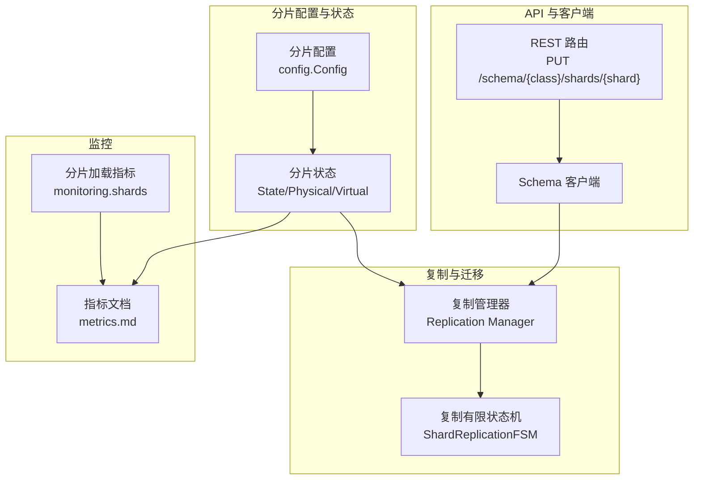
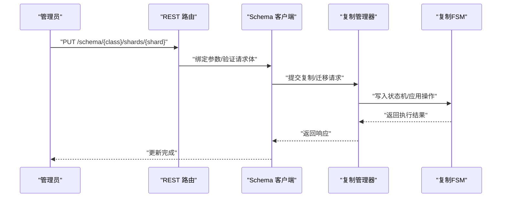
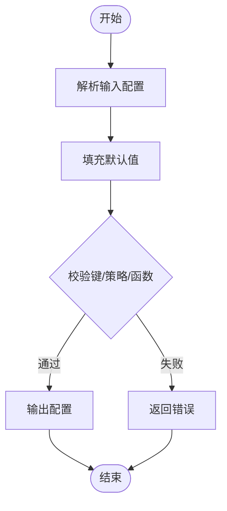
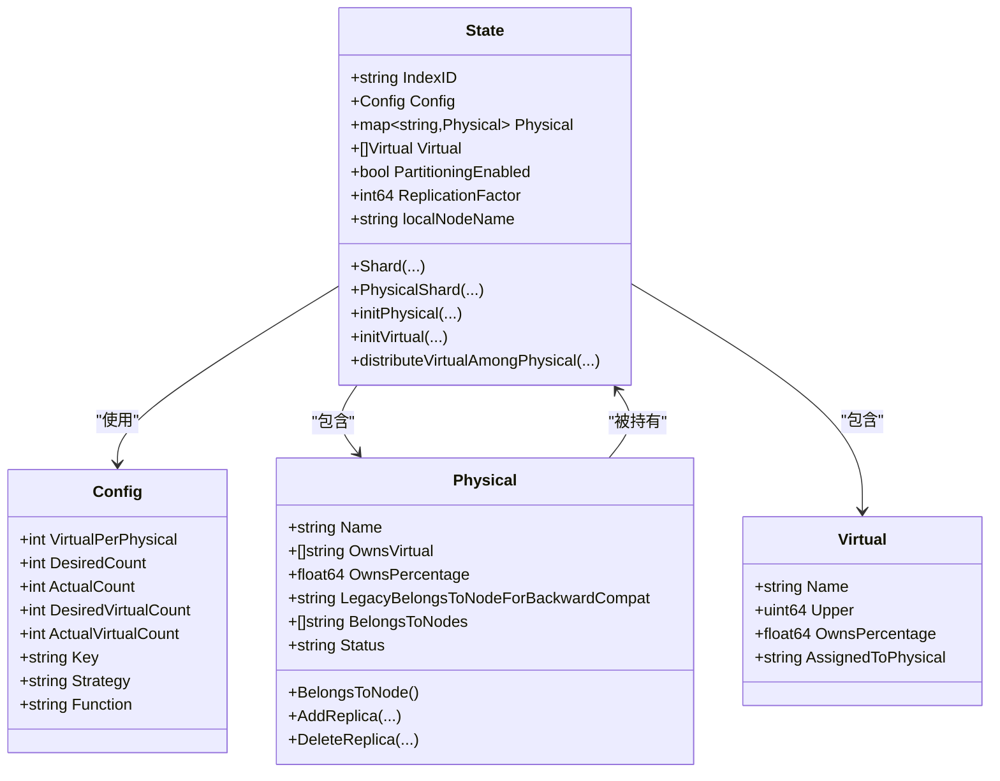
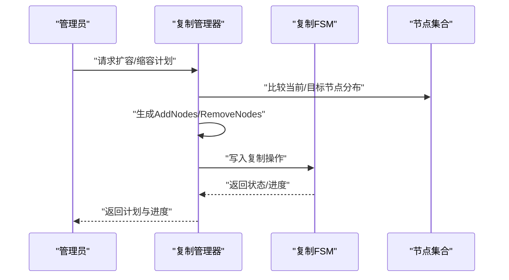
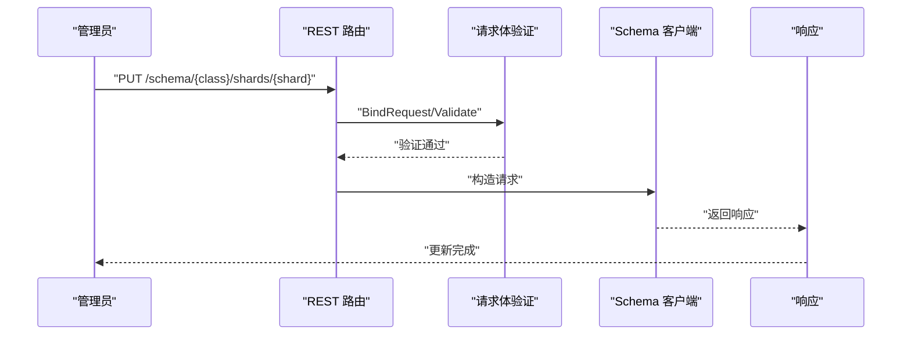
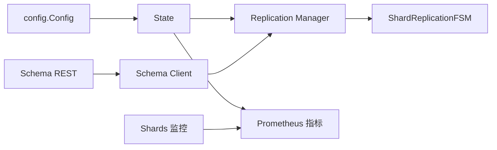

# 分片配置优化

<cite>
**本文引用的文件**
- [usecases/sharding/config/config.go](file://usecases/sharding/config/config.go)
- [usecases/sharding/state.go](file://usecases/sharding/state.go)
- [usecases/sharding/state_test.go](file://usecases/sharding/state_test.go)
- [cluster/replication/manager.go](file://cluster/replication/manager.go)
- [adapters/handlers/rest/operations/schema/schema_objects_shards_update.go](file://adapters/handlers/rest/operations/schema/schema_objects_shards_update.go)
- [adapters/handlers/rest/operations/schema/schema_objects_shards_update_parameters.go](file://adapters/handlers/rest/operations/schema/schema_objects_shards_update_parameters.go)
- [client/schema/schema_objects_shards_update_parameters.go](file://client/schema/schema_objects_shards_update_parameters.go)
- [client/schema/schema_client.go](file://client/schema/schema_client.go)
- [entities/models/shard_status.go](file://entities/models/shard_status.go)
- [docs/metrics.md](file://docs/metrics.md)
- [usecases/monitoring/shards.go](file://usecases/monitoring/shards.go)
- [usecases/monitoring/shards_test.go](file://usecases/monitoring/shards_test.go)
- [adapters/repos/db/clusterintegrationtest/helpers_for_test.go](file://adapters/repos/db/clusterintegrationtest/helpers_for_test.go)
- [adapters/repos/db/fakes_for_tests.go](file://adapters/repos/db/fakes_for_tests.go)
</cite>

## 目录
1. [简介](#简介)
2. [项目结构](#项目结构)
3. [核心组件](#核心组件)
4. [架构总览](#架构总览)
5. [详细组件分析](#详细组件分析)
6. [依赖关系分析](#依赖关系分析)
7. [性能考量](#性能考量)
8. [故障排查指南](#故障排查指南)
9. [结论](#结论)
10. [附录](#附录)

## 简介
本运维文档聚焦 Weaviate 的分片配置优化，围绕以下目标展开：
- 深入解释分片工作原理与数据分布策略（哈希分片与范围分片现状与限制）
- 明确分片数量选择原则（数据量预测、查询负载分析、硬件资源评估）
- 解释分片负载均衡策略（自动分片迁移、热点处理、动态调整）
- 说明分片状态管理与一致性保证（元数据存储、版本控制）
- 提供分片性能监控指标与故障诊断方法
- 给出分片扩容与缩容的操作流程与最佳实践

## 项目结构
Weaviate 的分片能力由“分片配置”“分片状态机”“复制与迁移引擎”“REST API 与客户端”“监控指标”等模块协同实现。下图展示与分片相关的关键模块及其交互。

图表来源
- [usecases/sharding/config/config.go](file://usecases/sharding/config/config.go#L28-L51)
- [usecases/sharding/state.go](file://usecases/sharding/state.go#L34-L44)
- [cluster/replication/manager.go](file://cluster/replication/manager.go#L35-L48)
- [adapters/handlers/rest/operations/schema/schema_objects_shards_update.go](file://adapters/handlers/rest/operations/schema/schema_objects_shards_update.go#L45-L55)
- [docs/metrics.md](file://docs/metrics.md#L113-L118)
- [usecases/monitoring/shards.go](file://usecases/monitoring/shards.go#L14-L61)

章节来源
- [usecases/sharding/config/config.go](file://usecases/sharding/config/config.go#L28-L51)
- [usecases/sharding/state.go](file://usecases/sharding/state.go#L34-L44)
- [cluster/replication/manager.go](file://cluster/replication/manager.go#L35-L48)
- [adapters/handlers/rest/operations/schema/schema_objects_shards_update.go](file://adapters/handlers/rest/operations/schema/schema_objects_shards_update.go#L45-L55)
- [docs/metrics.md](file://docs/metrics.md#L113-L118)
- [usecases/monitoring/shards.go](file://usecases/monitoring/shards.go#L14-L61)

## 核心组件
- 分片配置（config.Config）
  - 默认参数：虚拟分片每物理分片数量、分片键、分片策略、哈希函数
  - 校验逻辑：仅支持键为“_id”、策略为“hash”、函数为“murmur3”
  - 解析与深拷贝：支持从输入解析并生成副本
- 分片状态（State/Physical/Virtual）
  - 物理分片：名称、归属节点集合、拥有百分比、状态
  - 虚拟分片：环上上界、归属物理分片映射、拥有百分比
  - 初始化：按节点环初始化物理分片，随机分配虚拟分片到物理分片
  - 复制：支持为物理分片增加/删除副本，校验最小副本数
- 复制与迁移（Replication Manager）
  - 提供复制操作的生命周期管理（FSM）、状态查询、错误登记与取消
  - 支持根据当前状态生成扩容/缩容计划（节点增删）
- REST 与客户端
  - 提供更新单个分片状态的 REST 接口
  - 客户端封装请求参数与响应处理

章节来源
- [usecases/sharding/config/config.go](file://usecases/sharding/config/config.go#L28-L51)
- [usecases/sharding/config/config.go](file://usecases/sharding/config/config.go#L53-L70)
- [usecases/sharding/config/config.go](file://usecases/sharding/config/config.go#L85-L146)
- [usecases/sharding/state.go](file://usecases/sharding/state.go#L138-L147)
- [usecases/sharding/state.go](file://usecases/sharding/state.go#L286-L314)
- [usecases/sharding/state.go](file://usecases/sharding/state.go#L327-L343)
- [usecases/sharding/state.go](file://usecases/sharding/state.go#L421-L460)
- [usecases/sharding/state.go](file://usecases/sharding/state.go#L565-L590)
- [usecases/sharding/state.go](file://usecases/sharding/state.go#L595-L620)
- [cluster/replication/manager.go](file://cluster/replication/manager.go#L35-L48)
- [cluster/replication/manager.go](file://cluster/replication/manager.go#L411-L436)
- [adapters/handlers/rest/operations/schema/schema_objects_shards_update.go](file://adapters/handlers/rest/operations/schema/schema_objects_shards_update.go#L45-L55)
- [adapters/handlers/rest/operations/schema/schema_objects_shards_update_parameters.go](file://adapters/handlers/rest/operations/schema/schema_objects_shards_update_parameters.go#L46-L93)
- [client/schema/schema_objects_shards_update_parameters.go](file://client/schema/schema_objects_shards_update_parameters.go#L83-L130)
- [client/schema/schema_client.go](file://client/schema/schema_client.go#L522-L537)

## 架构总览
Weaviate 的分片架构围绕“配置—状态—复制—API—监控”五条主线协同工作：
- 配置阶段：解析用户输入，设置默认值与校验
- 状态阶段：初始化物理/虚拟分片，建立哈希环与映射
- 复制阶段：通过复制管理器与 FSM 实现跨节点的数据复制与迁移
- API 阶段：提供更新分片状态的 REST 接口，便于运维介入
- 监控阶段：暴露分片加载/卸载等指标，支撑可观测性

图表来源
- [adapters/handlers/rest/operations/schema/schema_objects_shards_update.go](file://adapters/handlers/rest/operations/schema/schema_objects_shards_update.go#L57-L82)
- [adapters/handlers/rest/operations/schema/schema_objects_shards_update_parameters.go](file://adapters/handlers/rest/operations/schema/schema_objects_shards_update_parameters.go#L70-L93)
- [client/schema/schema_objects_shards_update_parameters.go](file://client/schema/schema_objects_shards_update_parameters.go#L100-L130)
- [client/schema/schema_client.go](file://client/schema/schema_client.go#L522-L537)
- [cluster/replication/manager.go](file://cluster/replication/manager.go#L62-L75)

## 详细组件分析

### 分片配置与校验
- 默认策略
  - 默认虚拟分片每物理分片数量、分片键、策略、哈希函数均为固定值
  - 当前实现仅支持键“_id”、策略“hash”、函数“murmur3”
- 解析与深拷贝
  - 从输入解析可选字段，未提供的采用默认值
  - 深拷贝用于隔离配置对象，避免并发问题
- 测试覆盖
  - 单测覆盖不支持的键/策略/函数场景，确保校验生效

图表来源
- [usecases/sharding/config/config.go](file://usecases/sharding/config/config.go#L85-L146)
- [usecases/sharding/config/config.go](file://usecases/sharding/config/config.go#L53-L70)

章节来源
- [usecases/sharding/config/config.go](file://usecases/sharding/config/config.go#L21-L26)
- [usecases/sharding/config/config.go](file://usecases/sharding/config/config.go#L39-L51)
- [usecases/sharding/config/config.go](file://usecases/sharding/config/config.go#L85-L146)
- [usecases/sharding/config/config.go](file://usecases/sharding/config/config.go#L148-L193)
- [usecases/sharding/state_test.go](file://usecases/sharding/state_test.go#L93-L140)

### 分片状态与数据分布
- 物理分片与虚拟分片
  - 物理分片：包含归属节点集合、拥有百分比、状态
  - 虚拟分片：在环上的上界，映射到物理分片，拥有百分比由相邻上界差值得到
- 初始化与分布
  - 初始化物理分片：按节点环顺序分配，确保副本连续
  - 初始化虚拟分片：生成随机名称并计算哈希上界，排序后计算每个虚拟分片的拥有百分比
  - 初次分布：打乱虚拟分片顺序后均匀映射到物理分片
- 查询路由
  - 对象 ID 计算哈希，定位到第一个上界大于等于该哈希的虚拟分片，再映射到物理分片

图表来源
- [usecases/sharding/config/config.go](file://usecases/sharding/config/config.go#L28-L37)
- [usecases/sharding/state.go](file://usecases/sharding/state.go#L34-L44)
- [usecases/sharding/state.go](file://usecases/sharding/state.go#L138-L147)
- [usecases/sharding/state.go](file://usecases/sharding/state.go#L131-L136)

章节来源
- [usecases/sharding/state.go](file://usecases/sharding/state.go#L138-L147)
- [usecases/sharding/state.go](file://usecases/sharding/state.go#L286-L314)
- [usecases/sharding/state.go](file://usecases/sharding/state.go#L327-L343)
- [usecases/sharding/state.go](file://usecases/sharding/state.go#L421-L460)
- [usecases/sharding/state.go](file://usecases/sharding/state.go#L565-L590)
- [usecases/sharding/state.go](file://usecases/sharding/state.go#L595-L620)

### 复制与迁移（自动分片迁移）
- 复制管理器职责
  - 接收复制/迁移请求，进行合法性校验
  - 写入复制 FSM，跟踪操作状态、错误与取消
- 扩容/缩容计划
  - 基于当前状态与目标状态差异，生成节点增删计划
  - 随机选择源节点，为新增节点指定复制来源
- 迁移流程
  - 生成计划 → 应用复制 → 更新状态 → 错误登记与取消

图表来源
- [cluster/replication/manager.go](file://cluster/replication/manager.go#L411-L436)
- [cluster/replication/manager.go](file://cluster/replication/manager.go#L62-L75)

章节来源
- [cluster/replication/manager.go](file://cluster/replication/manager.go#L35-L48)
- [cluster/replication/manager.go](file://cluster/replication/manager.go#L411-L436)
- [cluster/replication/manager.go](file://cluster/replication/manager.go#L438-L468)

### 分片状态管理与一致性
- 状态模型
  - 物理分片包含归属节点集合与状态字段
  - 支持副本数量调整，最小副本数受全局复制因子约束
- 兼容性迁移
  - 旧格式兼容：从单节点归属字段迁移到多节点集合
- 节点映射
  - 支持批量替换节点名，用于节点重命名/替换场景

章节来源
- [usecases/sharding/state.go](file://usecases/sharding/state.go#L46-L59)
- [usecases/sharding/state.go](file://usecases/sharding/state.go#L541-L563)
- [usecases/sharding/state.go](file://usecases/sharding/state.go#L155-L193)
- [usecases/sharding/state.go](file://usecases/sharding/state.go#L195-L205)

### REST 接口与客户端：更新分片状态
- 接口说明
  - PUT /schema/{className}/shards/{shardName} 用于更新指定分片状态（如 READY/READONLY）
- 参数与验证
  - 请求体为 ShardStatus，包含状态字符串
  - 路由层绑定与验证，客户端参数封装
- 使用场景
  - 在磁盘空间等问题解决后，将非操作性分片恢复为可用状态

图表来源
- [adapters/handlers/rest/operations/schema/schema_objects_shards_update.go](file://adapters/handlers/rest/operations/schema/schema_objects_shards_update.go#L57-L82)
- [adapters/handlers/rest/operations/schema/schema_objects_shards_update_parameters.go](file://adapters/handlers/rest/operations/schema/schema_objects_shards_update_parameters.go#L70-L93)
- [client/schema/schema_objects_shards_update_parameters.go](file://client/schema/schema_objects_shards_update_parameters.go#L100-L130)
- [client/schema/schema_client.go](file://client/schema/schema_client.go#L522-L537)
- [entities/models/shard_status.go](file://entities/models/shard_status.go#L29-L33)

章节来源
- [adapters/handlers/rest/operations/schema/schema_objects_shards_update.go](file://adapters/handlers/rest/operations/schema/schema_objects_shards_update.go#L45-L55)
- [adapters/handlers/rest/operations/schema/schema_objects_shards_update_parameters.go](file://adapters/handlers/rest/operations/schema/schema_objects_shards_update_parameters.go#L46-L93)
- [client/schema/schema_objects_shards_update_parameters.go](file://client/schema/schema_objects_shards_update_parameters.go#L83-L130)
- [client/schema/schema_client.go](file://client/schema/schema_client.go#L522-L537)
- [entities/models/shard_status.go](file://entities/models/shard_status.go#L29-L33)

### 多租户分区与节点选择
- 多租户分区
  - 支持为不同租户创建独立物理分片，状态可独立管理（如 HOT/COLD/FROZEN）
- 节点选择策略
  - 基于轮询方式在节点集合中选择副本节点，尽量均匀分布
- 构建示例
  - 集成测试中演示了如何为多个租户生成分区与副本

章节来源
- [adapters/repos/db/clusterintegrationtest/helpers_for_test.go](file://adapters/repos/db/clusterintegrationtest/helpers_for_test.go#L107-L128)
- [adapters/repos/db/fakes_for_tests.go](file://adapters/repos/db/fakes_for_tests.go#L273-L290)

## 依赖关系分析
- 组件耦合
  - State 依赖 Config 与 cluster.NodeSelector，负责初始化与分布
  - Replication Manager 依赖 FSM 与 schemaReader，负责复制生命周期
  - REST/Client 依赖 models.ShardStatus，负责运维操作入口
- 关键依赖链
  - 配置 → 状态 → 复制 → API → 监控
- 外部依赖
  - Prometheus 指标体系用于观测分片加载/卸载与整体健康度

图表来源
- [usecases/sharding/config/config.go](file://usecases/sharding/config/config.go#L28-L37)
- [usecases/sharding/state.go](file://usecases/sharding/state.go#L34-L44)
- [cluster/replication/manager.go](file://cluster/replication/manager.go#L35-L48)
- [docs/metrics.md](file://docs/metrics.md#L113-L118)
- [usecases/monitoring/shards.go](file://usecases/monitoring/shards.go#L14-L61)

章节来源
- [usecases/sharding/config/config.go](file://usecases/sharding/config/config.go#L28-L37)
- [usecases/sharding/state.go](file://usecases/sharding/state.go#L34-L44)
- [cluster/replication/manager.go](file://cluster/replication/manager.go#L35-L48)
- [docs/metrics.md](file://docs/metrics.md#L113-L118)
- [usecases/monitoring/shards.go](file://usecases/monitoring/shards.go#L14-L61)

## 性能考量
- 哈希分布均匀性
  - 使用 Murmur3 哈希与虚拟分片环，理论上达到近似均匀分布
  - 单元测试验证各物理分片至少占 15% 数据，降低极端倾斜风险
- 虚拟分片数量
  - 虚拟分片总数 = 物理分片数 × 每物理分片虚拟分片数
  - 更高的虚拟分片数可提升分布均匀性，但会增加内存占用与查找开销
- 节点环与副本布局
  - 副本在节点环上连续放置，减少跨节点复制带来的网络开销
- 监控指标
  - 分片加载/卸载计数器可用于评估热路径与冷启动行为
  - 查询/批处理/向量索引等指标可用于评估整体性能瓶颈

章节来源
- [usecases/sharding/state.go](file://usecases/sharding/state.go#L565-L590)
- [usecases/sharding/state.go](file://usecases/sharding/state.go#L595-L620)
- [usecases/sharding/state_test.go](file://usecases/sharding/state_test.go#L29-L80)
- [docs/metrics.md](file://docs/metrics.md#L113-L118)
- [usecases/monitoring/shards.go](file://usecases/monitoring/shards.go#L14-L61)

## 故障排查指南
- 常见问题与定位
  - 分片状态异常：通过 REST 接口将分片状态更新为 READY/READONLY，结合日志与指标确认修复
  - 副本不足：检查最小副本数与可用节点数，必要时先扩容节点再调整副本
  - 热点分片：观察查询/批处理指标，评估是否需要增加分片数或引入分区
- 指标辅助
  - 分片加载/卸载计数器：判断是否存在频繁切换导致的抖动
  - 查询/批处理耗时：识别慢查询与大批次，优化查询模式或拆分分片
- 操作建议
  - 先评估再变更：变更分片数/副本前，评估数据量与查询负载
  - 渐进式扩容：小步增量，持续观察指标变化

章节来源
- [adapters/handlers/rest/operations/schema/schema_objects_shards_update.go](file://adapters/handlers/rest/operations/schema/schema_objects_shards_update.go#L45-L55)
- [usecases/monitoring/shards.go](file://usecases/monitoring/shards.go#L14-L61)
- [docs/metrics.md](file://docs/metrics.md#L113-L118)

## 结论
Weaviate 的分片实现以“哈希分片 + 虚拟分片环”为核心，辅以复制与迁移机制，满足多租户与副本管理需求。运维侧应关注：
- 合理设置虚拟分片数与分片数，平衡均匀性与资源消耗
- 借助指标与日志进行持续观测，及时发现热点与异常
- 通过 REST 接口与复制管理器实现安全可控的扩容/缩容与状态修复

## 附录

### 分片数量选择原则（运维实践要点）
- 数据量预测
  - 基于历史增长趋势估算未来数据规模，预留 20%-50% 缓冲
- 查询负载分析
  - 识别热点查询与写入高峰时段，评估分片数与副本数对吞吐的影响
- 硬件资源评估
  - CPU/内存/磁盘/网络带宽决定节点容量与副本上限
- 建议流程
  - 估算 → 设定初值 → 观测 → 调整 → 验证 → 固化

### 分片扩容与缩容操作流程（运维建议）
- 扩容
  - 新增节点 → 调整分片配置（增加 desiredCount 或 virtualPerPhysical）→ 触发复制管理器生成计划 → 应用复制 → 监控进度与指标
- 缩容
  - 评估风险与数据迁移成本 → 逐步减少副本 → 下线节点 → 更新配置
- 最佳实践
  - 优先扩容节点而非提高副本数，降低跨节点复制压力
  - 采用渐进式变更，配合指标回滚策略