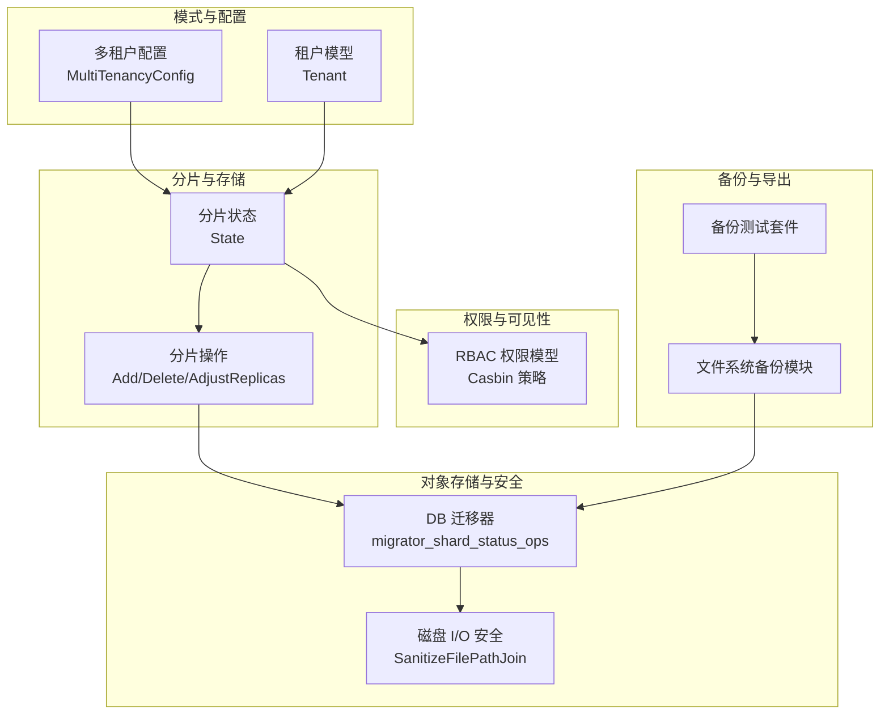
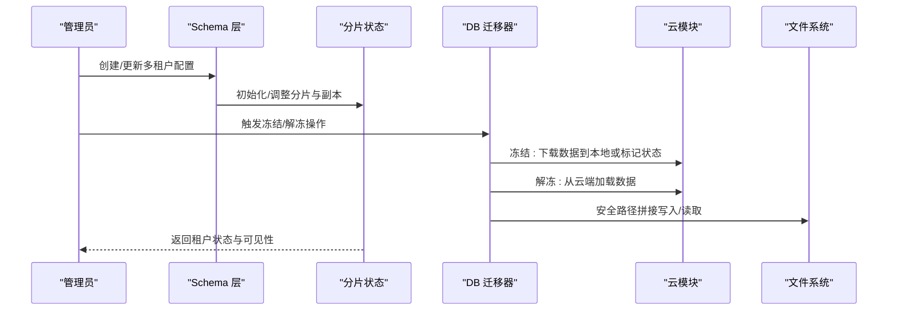
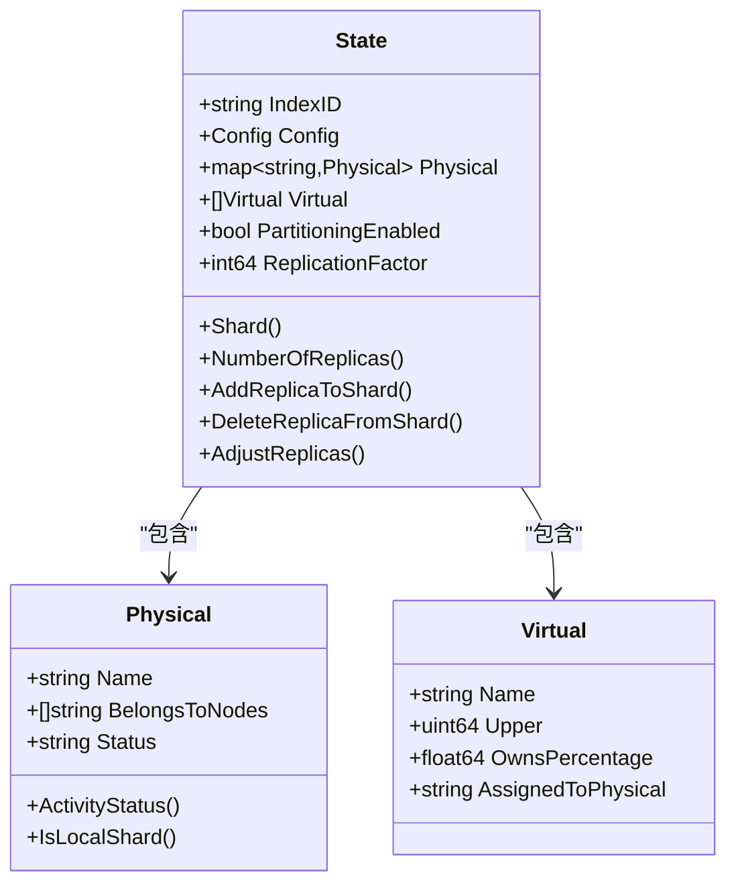
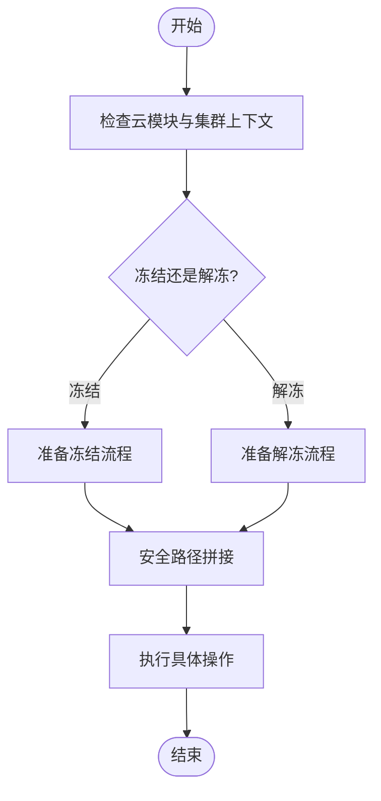
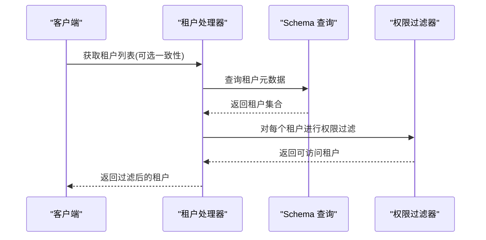
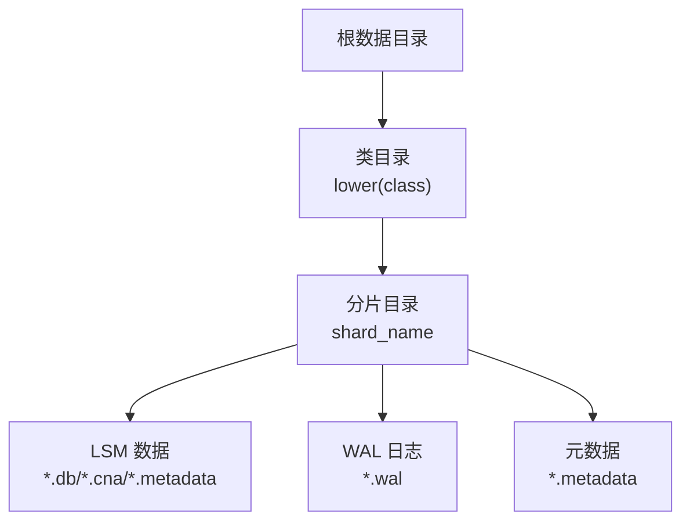
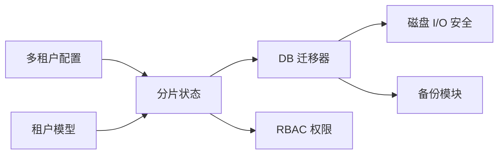

# 多租户存储隔离

<cite>
**本文引用的文件**
- [entities/models/multi_tenancy_config.go](file://entities/models/multi_tenancy_config.go)
- [entities/models/tenant.go](file://entities/models/tenant.go)
- [usecases/schema/tenant.go](file://usecases/schema/tenant.go)
- [usecases/sharding/state.go](file://usecases/sharding/state.go)
- [adapters/repos/db/migrator_shard_status_ops.go](file://adapters/repos/db/migrator_shard_status_ops.go)
- [usecases/config/config_handler.go](file://usecases/config/config_handler.go)
- [entities/diskio/files.go](file://entities/diskio/files.go)
- [adapters/repos/db/shard_usage/usage_test.go](file://adapters/repos/db/shard_usage/usage_test.go)
- [modules/backup-filesystem/backup_test.go](file://modules/backup-filesystem/backup_test.go)
- [test/helper/backuptest/suite_test.go](file://test/helper/backuptest/suite_test.go)
- [usecases/auth/authorization/conv/casbin_types_test.go](file://usecases/auth/authorization/conv/casbin_types_test.go)
</cite>

## 目录
1. [引言](#引言)
2. [项目结构](#项目结构)
3. [核心组件](#核心组件)
4. [架构总览](#架构总览)
5. [组件详解](#组件详解)
6. [依赖关系分析](#依赖关系分析)
7. [性能与资源监控](#性能与资源监控)
8. [故障排查指南](#故障排查指南)
9. [结论](#结论)
10. [附录：最佳实践与运维建议](#附录最佳实践与运维建议)

## 引言
本文件围绕 Weaviate 的多租户存储隔离进行系统化技术说明，重点覆盖以下方面：
- 多租户架构设计与数据隔离机制（物理隔离与逻辑隔离）
- 租户数据的存储组织结构、命名空间管理、目录布局与文件系统安全
- 资源配额与限制（存储空间、IOPS、内存）与安全边界
- 租户间访问控制与权限模型（数据可见性规则）
- 多租户性能监控与资源使用统计方法
- 租户迁移、数据导出与备份恢复策略
- 面向平台管理员的配置与资源管理最佳实践

## 项目结构
Weaviate 将多租户能力贯穿于“模式层（Schema）”“分片状态（Sharding）”“对象存储（DB）”“权限控制（Authorization）”“备份模块（Backup）”等多个层面。下图给出与多租户存储隔离直接相关的关键模块与交互。

**图表来源**
- [entities/models/multi_tenancy_config.go](file://entities/models/multi_tenancy_config.go#L26-L39)
- [entities/models/tenant.go](file://entities/models/tenant.go#L29-L40)
- [usecases/sharding/state.go](file://usecases/sharding/state.go#L34-L44)
- [adapters/repos/db/migrator_shard_status_ops.go](file://adapters/repos/db/migrator_shard_status_ops.go#L195-L239)
- [entities/diskio/files.go](file://entities/diskio/files.go#L97-L122)
- [usecases/auth/authorization/conv/casbin_types_test.go](file://usecases/auth/authorization/conv/casbin_types_test.go#L440-L495)
- [modules/backup-filesystem/backup_test.go](file://modules/backup-filesystem/backup_test.go#L23-L54)
- [test/helper/backuptest/suite_test.go](file://test/helper/backuptest/suite_test.go#L165-L190)

**章节来源**
- [entities/models/multi_tenancy_config.go](file://entities/models/multi_tenancy_config.go#L26-L39)
- [entities/models/tenant.go](file://entities/models/tenant.go#L29-L40)
- [usecases/sharding/state.go](file://usecases/sharding/state.go#L34-L44)

## 核心组件
- 多租户配置模型：定义是否启用多租户、自动激活/创建等行为开关。
- 租户模型：描述租户名称与活动状态（如 ACTIVE/HOT、INACTIVE/COLD、OFFLOADED/FROZEN 等）。
- 分片状态：承载物理分片、虚拟分片、副本分配与活动状态，是多租户隔离的基石。
- DB 迁移器：负责租户解冻/冻结、云模块交互、节点映射等。
- 磁盘 I/O 安全：对路径拼接进行安全校验，防止越权访问。
- 权限模型：基于 RBAC 的租户级资源过滤与可见性控制。
- 备份模块：支持多租户场景下的备份与恢复，含文件系统后端测试。

**章节来源**
- [entities/models/multi_tenancy_config.go](file://entities/models/multi_tenancy_config.go#L26-L39)
- [entities/models/tenant.go](file://entities/models/tenant.go#L29-L40)
- [usecases/sharding/state.go](file://usecases/sharding/state.go#L138-L147)
- [adapters/repos/db/migrator_shard_status_ops.go](file://adapters/repos/db/migrator_shard_status_ops.go#L195-L239)
- [entities/diskio/files.go](file://entities/diskio/files.go#L97-L122)
- [usecases/auth/authorization/conv/casbin_types_test.go](file://usecases/auth/authorization/conv/casbin_types_test.go#L440-L495)
- [modules/backup-filesystem/backup_test.go](file://modules/backup-filesystem/backup_test.go#L23-L54)

## 架构总览
Weaviate 的多租户存储隔离通过“分片状态 + 活动状态 + 副本分布 + 权限过滤”的组合实现：
- 物理隔离：每个租户对应一组物理分片，副本分布在不同节点上；冻结（OFFLOADED）时数据迁移到远端存储。
- 逻辑隔离：通过租户活动状态与权限模型控制可见性；未授权租户无法看到其他租户的数据。
- 存储组织：以“类名/分片/LSM/WAL/Metadata”等层次组织，路径拼接严格校验，避免越界。

**图表来源**
- [usecases/sharding/state.go](file://usecases/sharding/state.go#L286-L314)
- [adapters/repos/db/migrator_shard_status_ops.go](file://adapters/repos/db/migrator_shard_status_ops.go#L195-L239)
- [entities/diskio/files.go](file://entities/diskio/files.go#L97-L122)

## 组件详解

### 多租户配置与模型
- 多租户配置字段：
  - enabled：是否启用多租户
  - autoTenantActivation：访问时是否自动激活
  - autoTenantCreation：不存在时是否自动创建
- 租户模型字段：
  - name：租户标识
  - activityStatus：活动状态枚举（ACTIVE/HOT、INACTIVE/COLD、OFFLOADED/FROZEN 及过渡态）

这些模型共同决定多租户的行为边界与状态流转。

**章节来源**
- [entities/models/multi_tenancy_config.go](file://entities/models/multi_tenancy_config.go#L26-L39)
- [entities/models/tenant.go](file://entities/models/tenant.go#L29-L40)

### 分片状态与副本管理
- 分片状态包含：
  - 物理分片（Physical）：名称、归属节点列表、活动状态、虚拟分片归属
  - 虚拟分片（Virtual）：一致性哈希环上的令牌范围与归属
  - 全局配置：期望物理/虚拟分片数、复制因子、分区开关
- 关键操作：
  - 添加/删除副本：确保副本数量不小于复制因子
  - 调整副本集合：在可用节点中选择唯一节点，保证副本分布
  - 活动状态转换：通过状态映射兼容旧枚举（HOT/COLD/FROZEN → ACTIVE/INACTIVE/OFFLOADED）

**图表来源**
- [usecases/sharding/state.go](file://usecases/sharding/state.go#L34-L44)
- [usecases/sharding/state.go](file://usecases/sharding/state.go#L138-L147)
- [usecases/sharding/state.go](file://usecases/sharding/state.go#L131-L136)

**章节来源**
- [usecases/sharding/state.go](file://usecases/sharding/state.go#L155-L205)
- [usecases/sharding/state.go](file://usecases/sharding/state.go#L224-L270)
- [usecases/sharding/state.go](file://usecases/sharding/state.go#L272-L284)

### 租户活动状态与冻结/解冻流程
- 冻结（OFFLOADED）：数据迁移到远端存储，本地仅保留索引元数据或空态
- 解冻（ONLOADING/UNFREEZING）：从远端拉取数据到本地，重建分片
- DB 迁移器在执行冻结/解冻时：
  - 校验云模块与集群上下文
  - 并发处理多个租户进程
  - 使用安全路径拼接，避免越界访问

**图表来源**
- [adapters/repos/db/migrator_shard_status_ops.go](file://adapters/repos/db/migrator_shard_status_ops.go#L195-L239)
- [entities/diskio/files.go](file://entities/diskio/files.go#L97-L122)

**章节来源**
- [adapters/repos/db/migrator_shard_status_ops.go](file://adapters/repos/db/migrator_shard_status_ops.go#L195-L239)

### 访问控制与权限模型
- 租户级权限通过 RBAC 实现，策略可限定到“所有租户/某个集合/某个租户”
- 在查询租户列表时，会根据当前主体的权限进行资源过滤，确保不可见租户被屏蔽
- 测试用例覆盖了多种集合/租户维度的权限匹配

**图表来源**
- [usecases/schema/tenant.go](file://usecases/schema/tenant.go#L218-L249)
- [usecases/auth/authorization/conv/casbin_types_test.go](file://usecases/auth/authorization/conv/casbin_types_test.go#L440-L495)

**章节来源**
- [usecases/schema/tenant.go](file://usecases/schema/tenant.go#L218-L249)
- [usecases/auth/authorization/conv/casbin_types_test.go](file://usecases/auth/authorization/conv/casbin_types_test.go#L440-L495)

### 存储组织结构与文件系统布局
- 类级目录：按类名小写化组织
- 分片目录：每个物理分片一个子目录
- LSM/KV/日志：LSM 文件、WAL、元数据文件等按类型分层
- 路径安全：通过 SanitizeFilePathJoin 限制相对路径与符号链接解析，防止越界

**图表来源**
- [adapters/repos/db/shard_usage/usage_test.go](file://adapters/repos/db/shard_usage/usage_test.go#L215-L222)
- [entities/diskio/files.go](file://entities/diskio/files.go#L97-L122)

**章节来源**
- [adapters/repos/db/shard_usage/usage_test.go](file://adapters/repos/db/shard_usage/usage_test.go#L215-L222)
- [entities/diskio/files.go](file://entities/diskio/files.go#L97-L122)

### 备份与恢复（含多租户）
- 文件系统备份模块要求绝对路径，拒绝相对路径与空路径，保障备份目标明确
- 备份测试套件验证单租户与多租户场景的对象生成与存在性校验
- 多租户备份需结合分片状态与活动状态，确保冻结/解冻前后的一致性

**章节来源**
- [modules/backup-filesystem/backup_test.go](file://modules/backup-filesystem/backup_test.go#L23-L54)
- [test/helper/backuptest/suite_test.go](file://test/helper/backuptest/suite_test.go#L165-L190)

## 依赖关系分析
- 多租户配置与模型驱动分片状态初始化与副本调整
- 分片状态决定数据落盘位置与可见性（本地/远端）
- DB 迁移器协调云模块与文件系统，执行冻结/解冻
- 权限模型在查询阶段对租户结果集进行过滤
- 备份模块依赖安全路径拼接与分片布局

**图表来源**
- [entities/models/multi_tenancy_config.go](file://entities/models/multi_tenancy_config.go#L26-L39)
- [entities/models/tenant.go](file://entities/models/tenant.go#L29-L40)
- [usecases/sharding/state.go](file://usecases/sharding/state.go#L34-L44)
- [adapters/repos/db/migrator_shard_status_ops.go](file://adapters/repos/db/migrator_shard_status_ops.go#L195-L239)
- [entities/diskio/files.go](file://entities/diskio/files.go#L97-L122)
- [usecases/auth/authorization/conv/casbin_types_test.go](file://usecases/auth/authorization/conv/casbin_types_test.go#L440-L495)
- [modules/backup-filesystem/backup_test.go](file://modules/backup-filesystem/backup_test.go#L23-L54)

**章节来源**
- [usecases/sharding/state.go](file://usecases/sharding/state.go#L34-L44)
- [adapters/repos/db/migrator_shard_status_ops.go](file://adapters/repos/db/migrator_shard_status_ops.go#L195-L239)

## 性能与资源监控
- 存储用量统计：遍历分片目录，统计 LSM/WAL/Metadata 文件数量与类型，用于估算对象计数与占用空间
- 路径安全：SanitizeFilePathJoin 防止越界访问，减少异常 IO 导致的性能抖动
- 资源使用限制：通过配置项设置磁盘/内存使用阈值（只读/告警），避免资源耗尽影响服务稳定性

**章节来源**
- [adapters/repos/db/shard_usage/usage_test.go](file://adapters/repos/db/shard_usage/usage_test.go#L181-L222)
- [entities/diskio/files.go](file://entities/diskio/files.go#L97-L122)
- [usecases/config/config_handler.go](file://usecases/config/config_handler.go#L509-L547)

## 故障排查指南
- 路径拼接错误：确认备份路径为绝对路径，且未包含 “..” 或绝对路径片段
- 冻结/解冻失败：检查云模块是否启用、集群上下文是否存在、节点映射是否正确
- 权限不足：核对 RBAC 策略是否允许访问特定租户或集合
- 分片副本异常：检查复制因子与可用节点数量，确保副本调整不会低于最小值

**章节来源**
- [modules/backup-filesystem/backup_test.go](file://modules/backup-filesystem/backup_test.go#L23-L54)
- [adapters/repos/db/migrator_shard_status_ops.go](file://adapters/repos/db/migrator_shard_status_ops.go#L195-L239)
- [usecases/auth/authorization/conv/casbin_types_test.go](file://usecases/auth/authorization/conv/casbin_types_test.go#L440-L495)

## 结论
Weaviate 的多租户存储隔离以“分片状态 + 活动状态 + 副本分布 + 权限过滤 + 安全路径拼接”为核心，实现了物理与逻辑双重隔离，并通过备份模块与资源限制保障了可靠性与安全性。平台管理员应结合权限策略、资源阈值与备份策略，构建稳健的多租户运行环境。

## 附录：最佳实践与运维建议
- 启用多租户时，合理设置 autoTenantActivation/autoTenantCreation，平衡用户体验与资源占用
- 为高热租户配置更高的副本因子与本地化策略，为冷数据开启冻结以节省成本
- 使用 RBAC 精细化控制租户可见性，定期审计策略与访问日志
- 通过备份模块定期导出多租户数据，验证冻结/解冻流程与一致性
- 设置磁盘/内存使用阈值，启用只读保护，避免资源耗尽导致的服务中断