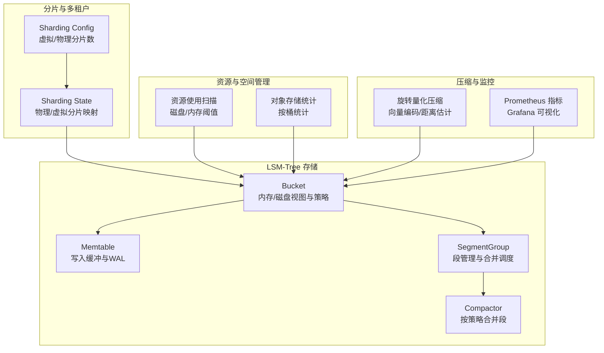
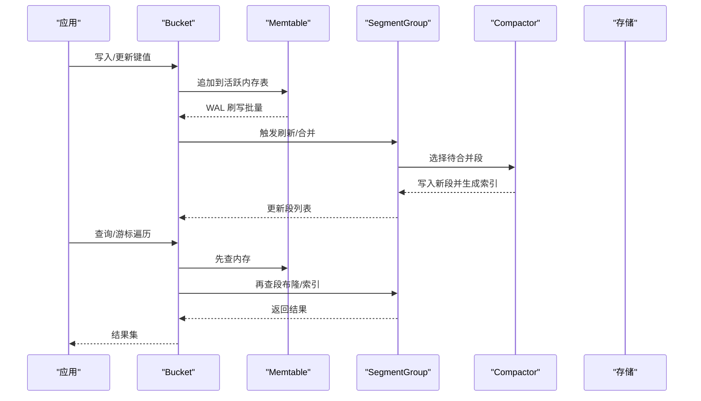
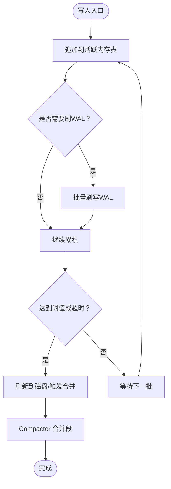
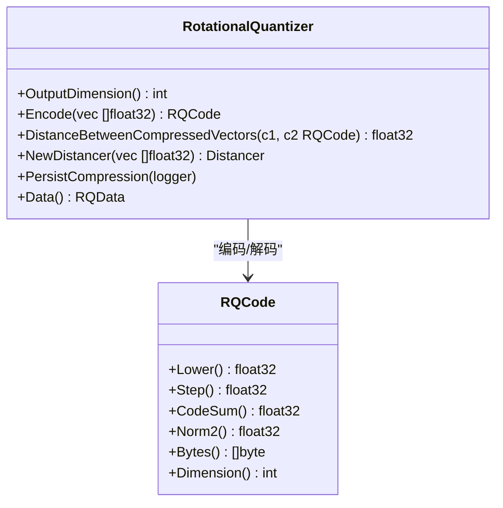
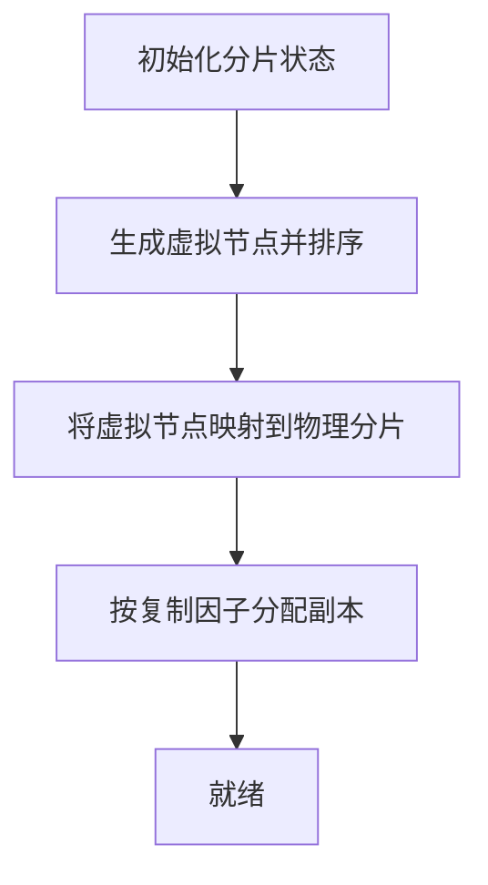
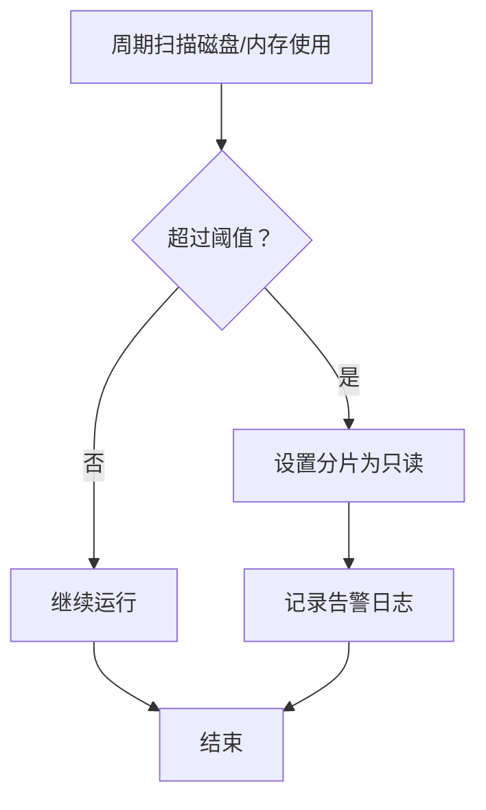
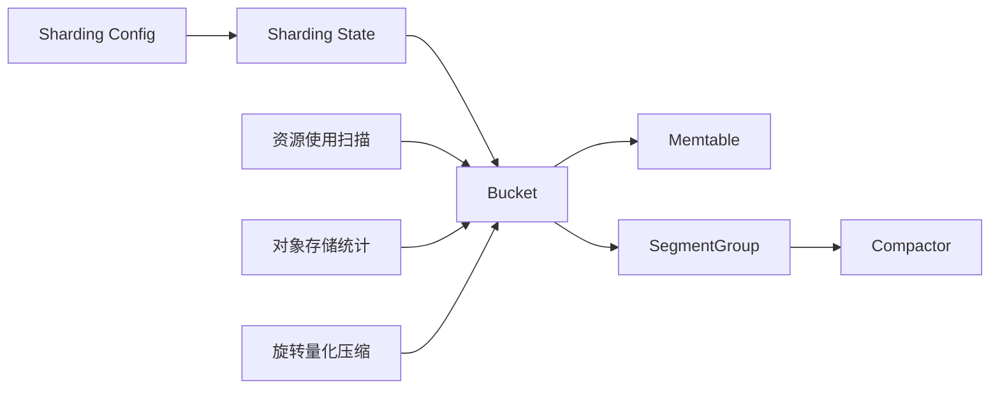

# 存储优化

<cite>
**本文引用的文件**
- [bucket.go](file://adapters/repos/db/lsmkv/bucket.go)
- [memtable.go](file://adapters/repos/db/lsmkv/memtable.go)
- [compactor_replace.go](file://adapters/repos/db/lsmkv/compactor_replace.go)
- [compactor_map.go](file://adapters/repos/db/lsmkv/compactor_map.go)
- [compactor.go](file://adapters/repos/db/compactor/compactor.go)
- [state.go](file://usecases/sharding/state.go)
- [config.go](file://usecases/sharding/config/config.go)
- [resource_use.go](file://adapters/repos/db/resource_use.go)
- [rotational_quantization.go](file://adapters/repos/db/vector/compressionhelpers/rotational_quantization.go)
- [rotational_quantization_test.go](file://adapters/repos/db/vector/compressionhelpers/rotational_quantization_test.go)
- [usage_test.go](file://adapters/repos/db/shard_usage/usage_test.go)
- [index_object_storage_test.go](file://adapters/repos/db/index_object_storage_test.go)
- [types.go](file://cluster/usage/types/types.go)
- [lsm.json](file://tools/dev/grafana/dashboards/lsm.json)
</cite>

## 目录
1. [简介](#简介)
2. [项目结构](#项目结构)
3. [核心组件](#核心组件)
4. [架构总览](#架构总览)
5. [详细组件分析](#详细组件分析)
6. [依赖关系分析](#依赖关系分析)
7. [性能考量](#性能考量)
8. [故障排查指南](#故障排查指南)
9. [结论](#结论)
10. [附录](#附录)

## 简介
本文件面向系统管理员与运维工程师，围绕 Weaviate 的 LSM-Tree 存储引擎提供一套可操作的存储优化实践指南。内容覆盖写入放大降低、读取性能提升、数据压缩策略、分片配置优化、多租户隔离与资源分配、存储空间管理（含垃圾回收与磁盘监控）、以及容量规划与基准测试建议。所有优化建议均基于仓库中的实际实现与指标采集，确保可落地、可验证。

## 项目结构
Weaviate 的持久化层以 LSM-Tree 为核心，围绕“内存表（Memtable）+ 磁盘段（Segment）+ 合并器（Compactor）”构建，并通过分片与多租户机制实现水平扩展与资源隔离。关键模块如下：
- LSM-Tree 持久化：Bucket、Memtable、SegmentGroup、Compactor
- 分片与多租户：Sharding State、Config
- 资源与空间管理：磁盘使用扫描、只读阈值控制、对象大小统计
- 压缩：向量旋转量化（Rotational Quantization）
- 监控与可视化：Prometheus 指标与 Grafana 仪表板

**图表来源**
- [bucket.go](file://adapters/repos/db/lsmkv/bucket.go#L77-L195)
- [memtable.go](file://adapters/repos/db/lsmkv/memtable.go#L551-L605)
- [state.go](file://usecases/sharding/state.go#L34-L44)
- [config.go](file://usecases/sharding/config/config.go#L85-L110)
- [resource_use.go](file://adapters/repos/db/resource_use.go#L45-L139)
- [rotational_quantization.go](file://adapters/repos/db/vector/compressionhelpers/rotational_quantization.go#L92-L380)
- [lsm.json](file://tools/dev/grafana/dashboards/lsm.json#L600-L643)

**章节来源**
- [bucket.go](file://adapters/repos/db/lsmkv/bucket.go#L1-L324)
- [state.go](file://usecases/sharding/state.go#L286-L314)
- [config.go](file://usecases/sharding/config/config.go#L53-L110)
- [resource_use.go](file://adapters/repos/db/resource_use.go#L45-L139)
- [rotational_quantization.go](file://adapters/repos/db/vector/compressionhelpers/rotational_quantization.go#L92-L380)
- [lsm.json](file://tools/dev/grafana/dashboards/lsm.json#L600-L643)

## 核心组件
- Bucket：LSM-Tree 的逻辑单元，负责内存表与磁盘段的统一访问、策略选择、计数统计、布隆过滤器、清理策略等。支持多种策略（如 Replace、MapCollection、RoaringSet），并可配置预读、校验、保留墓碑等行为。
- Memtable：活跃内存表，写入路径的首要缓冲；支持 WAL 刷写、墓碑标记（仅倒排索引策略）、属性长度统计等。
- Compactor：按策略合并段，写入新段并生成索引；支持内存/缓冲写入路径切换、校验开关、最大文件大小限制。
- Sharding State/Config：定义分片数量、虚拟分片映射、复制因子、哈希策略与函数；支持分区开启与多租户状态迁移。
- 资源使用扫描：周期性检查磁盘/内存使用率，超过阈值进入只读模式并发出告警。
- 旋转量化压缩：对向量进行旋转量化编码，支持多种距离度量，提供压缩后向量与距离估计接口。

**章节来源**
- [bucket.go](file://adapters/repos/db/lsmkv/bucket.go#L77-L195)
- [memtable.go](file://adapters/repos/db/lsmkv/memtable.go#L551-L605)
- [compactor_replace.go](file://adapters/repos/db/lsmkv/compactor_replace.go#L31-L84)
- [compactor_map.go](file://adapters/repos/db/lsmkv/compactor_map.go#L31-L91)
- [state.go](file://usecases/sharding/state.go#L34-L44)
- [config.go](file://usecases/sharding/config/config.go#L85-L110)
- [resource_use.go](file://adapters/repos/db/resource_use.go#L45-L139)
- [rotational_quantization.go](file://adapters/repos/db/vector/compressionhelpers/rotational_quantization.go#L92-L380)

## 架构总览
下图展示从写入到合并再到查询的整体流程，以及与分片、资源监控的交互。

**图表来源**
- [bucket.go](file://adapters/repos/db/lsmkv/bucket.go#L554-L628)
- [memtable.go](file://adapters/repos/db/lsmkv/memtable.go#L563-L596)
- [compactor_replace.go](file://adapters/repos/db/lsmkv/compactor_replace.go#L86-L128)
- [compactor_map.go](file://adapters/repos/db/lsmkv/compactor_map.go#L93-L135)

## 详细组件分析

### LSM-Tree 写入放大与读取性能优化
- 写入放大控制
  - 批量刷写 WAL：在批量写入场景中，仅在必要时触发 WAL 刷写，避免频繁落盘。
  - 内存表阈值与脏数据时间：通过内存表阈值与“脏数据超时”策略，平衡写放大与内存占用。
  - 预读与内存映射：可选启用预读与内存映射，减少随机写放大。
  - 布隆过滤器：默认启用布隆过滤器，加速存在性判断，降低无效磁盘访问。
- 读取性能提升
  - 一致视图：提供一致视图以减少锁竞争，提高批量读取效率。
  - 游标复用：游标在内存/磁盘之间高效切换，结合二级索引快速定位。
  - 段清理与墓碑处理：在合并阶段清理过期墓碑，减少后续读取开销。

**图表来源**
- [memtable.go](file://adapters/repos/db/lsmkv/memtable.go#L563-L596)
- [bucket.go](file://adapters/repos/db/lsmkv/bucket.go#L388-L394)

**章节来源**
- [bucket.go](file://adapters/repos/db/lsmkv/bucket.go#L77-L195)
- [memtable.go](file://adapters/repos/db/lsmkv/memtable.go#L551-L605)

### 数据压缩技术与策略
- 旋转量化压缩（向量）
  - 支持多种距离度量（余弦、点积、L2），提供编码/解码与距离估计接口。
  - 提供统计信息与零向量编码，保证异常输入的健壮性。
  - 适合高维向量的近似检索，显著降低存储与带宽开销。
- 压缩比优化建议
  - 根据向量维度与精度需求调整位宽；在可接受误差范围内提升压缩比。
  - 对于倒排索引等非向量数据，优先采用合适的 LSM-Tree 策略与段清理策略，减少冗余。

**图表来源**
- [rotational_quantization.go](file://adapters/repos/db/vector/compressionhelpers/rotational_quantization.go#L92-L380)

**章节来源**
- [rotational_quantization.go](file://adapters/repos/db/vector/compressionhelpers/rotational_quantization.go#L92-L380)
- [rotational_quantization_test.go](file://adapters/repos/db/vector/compressionhelpers/rotational_quantization_test.go#L46-L297)

### 分片（Sharding）配置优化
- 分片数量与虚拟分片
  - 物理分片数与虚拟分片数由配置决定；虚拟分片用于一致性哈希环，提升再平衡稳定性。
  - 默认策略与哈希函数固定，确保跨版本兼容与一致性。
- 负载均衡与数据分布
  - 使用 Murmur3 哈希与虚拟节点均匀分布数据；复制因子控制副本分布。
  - 多租户场景下，分区开启时直接映射到分区名，便于按租户隔离。
- 动态调整
  - 支持添加/删除副本、节点映射替换；在不破坏一致性前提下进行再平衡。

**图表来源**
- [state.go](file://usecases/sharding/state.go#L565-L620)
- [config.go](file://usecases/sharding/config/config.go#L85-L110)

**章节来源**
- [state.go](file://usecases/sharding/state.go#L286-L314)
- [state.go](file://usecases/sharding/state.go#L421-L460)
- [state.go](file://usecases/sharding/state.go#L565-L620)
- [config.go](file://usecases/sharding/config/config.go#L53-L110)

### 多租户存储隔离与资源分配
- 租户状态与分区
  - 分区启用时，每个租户对应一个物理分片；状态包含所属节点与活动状态。
  - 支持并发的租户管理与分片查询，保障高并发下的线程安全。
- 资源分配
  - 通过复制因子与节点选择器控制副本分布，避免热点与资源倾斜。
  - 结合资源使用扫描，在磁盘/内存接近阈值时自动降级为只读，保护系统稳定性。

**章节来源**
- [state.go](file://usecases/sharding/state.go#L512-L524)
- [state.go](file://usecases/sharding/state.go#L617-L620)
- [resource_use.go](file://adapters/repos/db/resource_use.go#L122-L139)

### 存储空间管理（垃圾回收、空间回收与监控）
- 磁盘使用扫描与只读保护
  - 周期性扫描磁盘使用率，超过阈值自动设置分片为只读并记录告警。
- 对象存储统计
  - 按桶统计对象存储大小，辅助容量规划与成本控制。
- 段清理与墓碑处理
  - 合并阶段清理过期墓碑，减少冗余数据占用。

**图表来源**
- [resource_use.go](file://adapters/repos/db/resource_use.go#L45-L139)
- [usage_test.go](file://adapters/repos/db/shard_usage/usage_test.go#L220-L256)

**章节来源**
- [resource_use.go](file://adapters/repos/db/resource_use.go#L45-L139)
- [usage_test.go](file://adapters/repos/db/shard_usage/usage_test.go#L220-L256)
- [index_object_storage_test.go](file://adapters/repos/db/index_object_storage_test.go#L49-L84)
- [types.go](file://cluster/usage/types/types.go#L133-L183)

## 依赖关系分析
- Bucket 依赖 Memtable 与 SegmentGroup；SegmentGroup 调用 Compactor 完成合并；Sharding State/Config 影响分片分布与副本策略；资源扫描与对象统计为容量规划提供依据；旋转量化压缩服务于向量存储。

**图表来源**
- [bucket.go](file://adapters/repos/db/lsmkv/bucket.go#L77-L195)
- [state.go](file://usecases/sharding/state.go#L34-L44)
- [config.go](file://usecases/sharding/config/config.go#L85-L110)
- [resource_use.go](file://adapters/repos/db/resource_use.go#L45-L139)
- [rotational_quantization.go](file://adapters/repos/db/vector/compressionhelpers/rotational_quantization.go#L92-L380)

**章节来源**
- [bucket.go](file://adapters/repos/db/lsmkv/bucket.go#L77-L195)
- [state.go](file://usecases/sharding/state.go#L34-L44)
- [config.go](file://usecases/sharding/config/config.go#L85-L110)
- [resource_use.go](file://adapters/repos/db/resource_use.go#L45-L139)
- [rotational_quantization.go](file://adapters/repos/db/vector/compressionhelpers/rotational_quantization.go#L92-L380)

## 性能考量
- 写入放大
  - 通过批量 WAL 刷写、合理设置内存表阈值与脏数据超时，降低频繁落盘带来的写放大。
  - 合理的段大小与合并策略，避免过多小段导致的写放大。
- 读取性能
  - 启用布隆过滤器与二级索引，减少无效磁盘访问。
  - 使用一致视图与游标复用，降低锁竞争与重复扫描。
- 压缩与存储
  - 向量采用旋转量化压缩，兼顾精度与存储/带宽节省。
  - 对非向量数据，利用段清理与墓碑处理减少冗余。
- 监控与可视化
  - Prometheus 指标与 Grafana 仪表板帮助识别热点与异常，指导容量与参数调优。

[本节为通用指导，无需特定文件引用]

## 故障排查指南
- 磁盘/内存使用过高
  - 检查资源扫描日志与只读保护触发记录；确认阈值设置是否合理。
  - 关注对象存储统计，定位占用最大的桶与分片。
- 写入延迟升高
  - 检查 WAL 刷写频率与内存表阈值；评估批量写入策略。
  - 关注合并过程的 IO 与 CPU 占用，必要时调整合并策略或段大小。
- 读取命中率低
  - 检查布隆过滤器与二级索引配置；确认段清理策略未过度清理有效数据。
- 压缩效果不佳
  - 校验旋转量化位宽与距离度量设置；对比压缩前后向量距离估计误差。

**章节来源**
- [resource_use.go](file://adapters/repos/db/resource_use.go#L82-L139)
- [usage_test.go](file://adapters/repos/db/shard_usage/usage_test.go#L220-L256)
- [lsm.json](file://tools/dev/grafana/dashboards/lsm.json#L600-L643)

## 结论
通过对 LSM-Tree 的写入路径、合并策略、布隆过滤器与二级索引的优化，结合分片与多租户的合理配置、资源使用扫描与对象存储统计，Weaviate 在大规模向量与非结构化数据场景下实现了高效的写入与读取性能。配合旋转量化压缩与完善的监控体系，可进一步降低存储与网络开销，支撑更高规模的部署与更长的生命周期运营。

[本节为总结，无需特定文件引用]

## 附录
- 容量规划建议
  - 基于对象存储统计与历史增长趋势，预留磁盘空间与副本容量。
  - 评估向量压缩比与段大小，估算冷热数据比例与归档策略。
- 基准测试
  - 使用 LSM-Tree 基准测试与长运行测试，评估不同策略组合下的吞吐与延迟。
  - 结合 Grafana 仪表板观察关键指标（IO、CPU、布隆过滤器命中等）。

**章节来源**
- [index_object_storage_test.go](file://adapters/repos/db/index_object_storage_test.go#L49-L84)
- [lsm.json](file://tools/dev/grafana/dashboards/lsm.json#L600-L643)