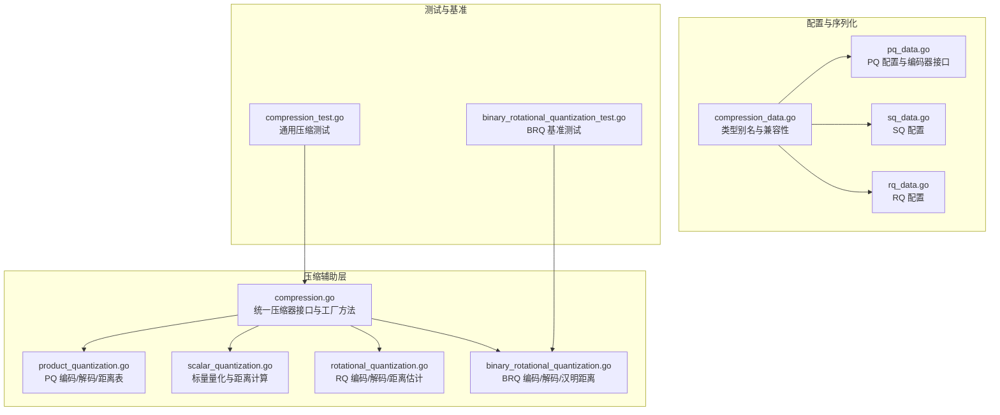
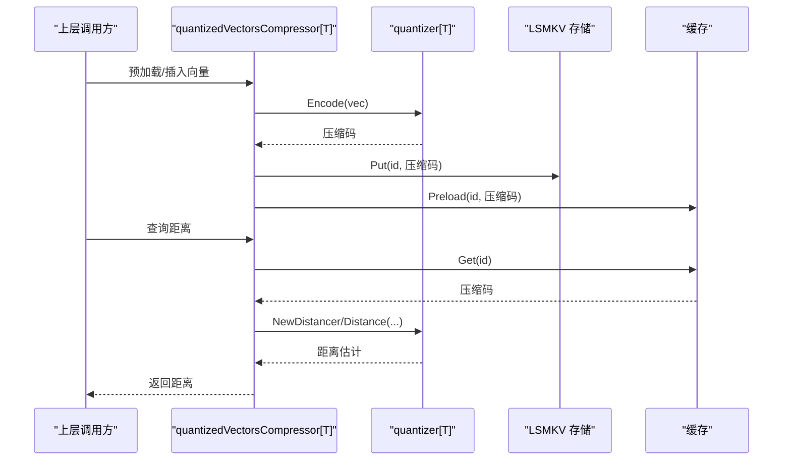
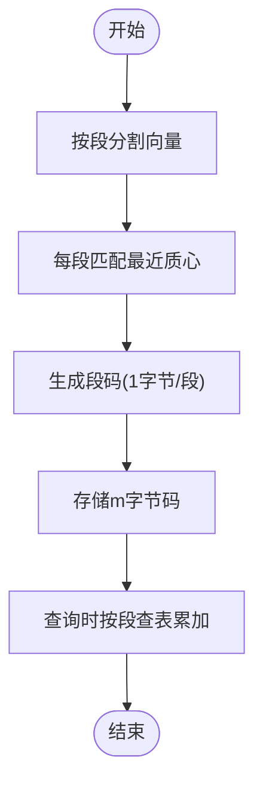
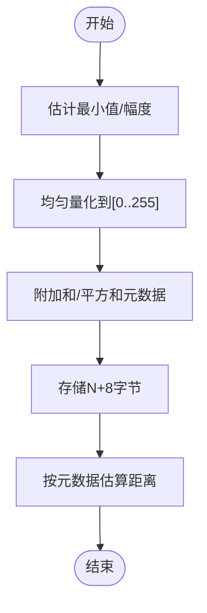
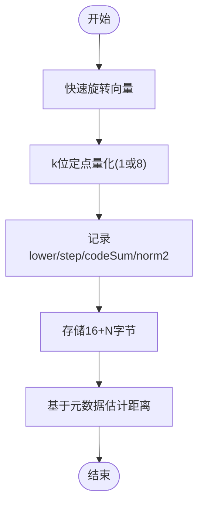
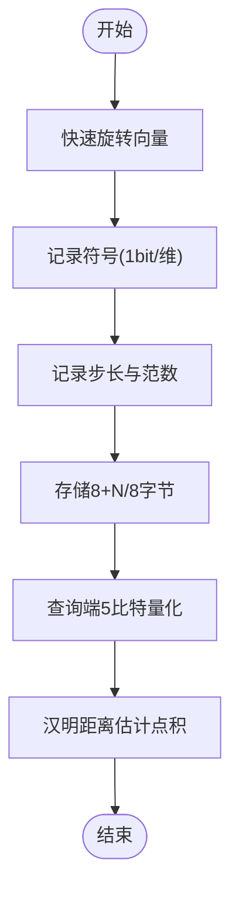
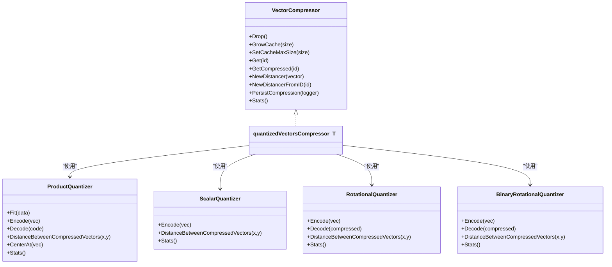

# 数据压缩技术

<cite>
**本文引用的文件**
- [compression.go](file://adapters/repos/db/vector/compressionhelpers/compression.go)
- [product_quantization.go](file://adapters/repos/db/vector/compressionhelpers/product_quantization.go)
- [scalar_quantization.go](file://adapters/repos/db/vector/compressionhelpers/scalar_quantization.go)
- [rotational_quantization.go](file://adapters/repos/db/vector/compressionhelpers/rotational_quantization.go)
- [binary_rotational_quantization.go](file://adapters/repos/db/vector/compressionhelpers/binary_rotational_quantization.go)
- [compression_data.go](file://entities/vectorindex/hnsw/compression_data.go)
- [pq_data.go](file://entities/vectorindex/compression/pq_data.go)
- [sq_data.go](file://entities/vectorindex/compression/sq_data.go)
- [rq_data.go](file://entities/vectorindex/compression/rq_data.go)
- [compression_test.go](file://adapters/repos/db/vector/compressionhelpers/compression_test.go)
- [binary_rotational_quantization_test.go](file://adapters/repos/db/vector/compressionhelpers/binary_rotational_quantization_test.go)
</cite>

## 目录
1. [简介](#简介)
2. [项目结构](#项目结构)
3. [核心组件](#核心组件)
4. [架构总览](#架构总览)
5. [详细组件分析](#详细组件分析)
6. [依赖关系分析](#依赖关系分析)
7. [性能考量](#性能考量)
8. [故障排查指南](#故障排查指南)
9. [结论](#结论)
10. [附录](#附录)

## 简介
本文件系统化梳理 Weaviate 向量索引中的数据压缩技术，覆盖 PQ（Product Quantization）、SQ（Scalar Quantization）、RQ（Randomized Quantization）与 BRQ（Binary Randomized Quantization）四大算法。文档从原理、适用场景、性能特性、压缩比与精度权衡、存储格式与访问优化、基准测试与部署评估、配置参数调优与监控指标等维度展开，帮助读者在不同数据特征与业务需求下做出合理的压缩方案选择。

## 项目结构
Weaviate 将压缩能力集中在向量压缩辅助模块中，围绕统一的压缩器接口与量化器接口组织代码；压缩配置与序列化数据结构位于独立的实体层，便于持久化与跨模块复用。

图表来源
- [compression.go](file://adapters/repos/db/vector/compressionhelpers/compression.go#L438-L998)
- [product_quantization.go](file://adapters/repos/db/vector/compressionhelpers/product_quantization.go#L176-L463)
- [scalar_quantization.go](file://adapters/repos/db/vector/compressionhelpers/scalar_quantization.go#L29-L233)
- [rotational_quantization.go](file://adapters/repos/db/vector/compressionhelpers/rotational_quantization.go#L26-L381)
- [binary_rotational_quantization.go](file://adapters/repos/db/vector/compressionhelpers/binary_rotational_quantization.go#L31-L533)
- [compression_data.go](file://entities/vectorindex/hnsw/compression_data.go#L18-L53)
- [pq_data.go](file://entities/vectorindex/compression/pq_data.go#L40-L51)
- [sq_data.go](file://entities/vectorindex/compression/sq_data.go#L14-L20)
- [rq_data.go](file://entities/vectorindex/compression/rq_data.go#L14-L21)
- [compression_test.go](file://adapters/repos/db/vector/compressionhelpers/compression_test.go)
- [binary_rotational_quantization_test.go](file://adapters/repos/db/vector/compressionhelpers/binary_rotational_quantization_test.go#L190-L222)

章节来源
- [compression.go](file://adapters/repos/db/vector/compressionhelpers/compression.go#L438-L998)

## 核心组件
- 统一压缩器接口：面向上层提供统一的压缩/解压、距离计算、缓存预填充、持久化等能力，屏蔽不同量化器差异。
- 量化器接口族：PQ、SQ、RQ、BRQ 各自实现编码/解码、距离估计、统计信息与持久化数据结构。
- 存储与缓存：压缩后的向量以键值形式落盘，配合分片缓存提升访问效率。
- 距离计算优化：通过预计算查找表（PQ）、元数据缓存（RQ/BRQ）、哈希/位运算（BRQ）等手段降低查询时开销。

章节来源
- [compression.go](file://adapters/repos/db/vector/compressionhelpers/compression.go#L60-L87)
- [compression.go](file://adapters/repos/db/vector/compressionhelpers/compression.go#L100-L283)
- [compression.go](file://adapters/repos/db/vector/compressionhelpers/compression.go#L285-L436)

## 架构总览
压缩子系统在向量索引（如 HNSW）与 LSMKV 存储之间充当“适配层”，负责：
- 训练阶段：基于样本数据训练量化器（PQ/KMeans/Tiling；SQ 参数估计；RQ/BRQ 旋转矩阵与元数据）。
- 运行阶段：对写入向量进行压缩并持久化，查询时按需解码或使用近似距离估计。
- 缓存与预填充：批量加载压缩向量到内存缓存，减少磁盘 IO。
- 持久化与恢复：将量化器参数与旋转矩阵序列化，重启后可快速恢复。

图表来源
- [compression.go](file://adapters/repos/db/vector/compressionhelpers/compression.go#L154-L283)

## 详细组件分析

### PQ（Product Quantization）
- 原理要点
  - 将向量维度划分为 m 段，每段独立训练 k 个质心（Centroids），形成 m×k 的码本。
  - 编码：逐段匹配最近质心，输出段内索引（1 字节/段）。
  - 解码：按段拼接质心重构近似向量。
  - 距离估计：预构建段级距离表，查询时查表累加，避免逐元素计算。
- 适用场景
  - 高维稠密向量（如 1024/1536/3072 维）；对压缩比要求高且能接受一定精度损失。
- 性能特性
  - 压缩比：原始大小 / 压缩大小 ≈ 维度 × 4 / 段数；典型可达数十倍。
  - 查询延迟：显著降低；但需要额外的查找表与段间距离预计算。
- 存储与访问
  - 存储：每向量仅存 m 字节码；支持多段并行训练与并行迭代预填充。
  - 访问：缓存命中优先；未命中从 LSMKV 读取并解码。
- 关键实现路径
  - 编码/解码与距离表：[product_quantization.go](file://adapters/repos/db/vector/compressionhelpers/product_quantization.go#L431-L455)
  - 工厂与恢复：[compression.go](file://adapters/repos/db/vector/compressionhelpers/compression.go#L438-L582)
  - 统计与压缩比：[product_quantization.go](file://adapters/repos/db/vector/compressionhelpers/product_quantization.go#L191-L206)

图表来源
- [product_quantization.go](file://adapters/repos/db/vector/compressionhelpers/product_quantization.go#L431-L455)

章节来源
- [product_quantization.go](file://adapters/repos/db/vector/compressionhelpers/product_quantization.go#L176-L463)
- [compression.go](file://adapters/repos/db/vector/compressionhelpers/compression.go#L438-L582)

### SQ（Scalar Quantization）
- 原理要点
  - 对每个维度进行均匀量化，将浮点范围映射到 [0..255] 的整数，再以 1 字节表示。
  - 为保证距离一致性，额外保存向量的“和”与“平方和”元数据，用于 L2/Cosine/Dot 的线性变换还原。
- 适用场景
  - 中低维向量或对常数因子敏感的距离度量；追求简单与稳定。
- 性能特性
  - 压缩比≈4：原始 4N → 压缩 N+8。
  - 查询时直接使用元数据与位运算估算距离，开销较低。
- 存储与访问
  - 元数据尾随在量化码之后；读取时可复用缓冲区减少分配。
- 关键实现路径
  - 编码/元数据与距离估计：[scalar_quantization.go](file://adapters/repos/db/vector/compressionhelpers/scalar_quantization.go#L122-L170)
  - 工厂与恢复：[compression.go](file://adapters/repos/db/vector/compressionhelpers/compression.go#L640-L764)
  - 统计与压缩比：[scalar_quantization.go](file://adapters/repos/db/vector/compressionhelpers/scalar_quantization.go#L215-L225)

图表来源
- [scalar_quantization.go](file://adapters/repos/db/vector/compressionhelpers/scalar_quantization.go#L122-L170)

章节来源
- [scalar_quantization.go](file://adapters/repos/db/vector/compressionhelpers/scalar_quantization.go#L29-L233)
- [compression.go](file://adapters/repos/db/vector/compressionhelpers/compression.go#L640-L764)

### RQ（Randomized Quantization）
- 原理要点
  - 使用快速旋转（Fast Rotation）将输入向量旋转至随机方向，随后对每个维度进行 k 位定点量化（k=8 或 1）。
  - 通过元数据（lower、step、codeSum、norm2）近似重建点积/余弦/L2，避免显式解码。
- 适用场景
  - 需要无损解码或高召回场景；对查询端计算复杂度敏感。
- 性能特性
  - 压缩比：原始 4N → 16+M 字节（M 为输出维度）。
  - 查询：基于元数据与位运算的闭式估计，避免逐元素乘加。
- 存储与访问
  - 元数据固定 16 字节 + 每维 1 字节；支持多比特与单比特两种模式。
- 关键实现路径
  - 编码/元数据/距离估计：[rotational_quantization.go](file://adapters/repos/db/vector/compressionhelpers/rotational_quantization.go#L169-L309)
  - 工厂与恢复：[compression.go](file://adapters/repos/db/vector/compressionhelpers/compression.go#L766-L881)
  - 统计与压缩比：[rotational_quantization.go](file://adapters/repos/db/vector/compressionhelpers/rotational_quantization.go#L324-L331)

图表来源
- [rotational_quantization.go](file://adapters/repos/db/vector/compressionhelpers/rotational_quantization.go#L169-L309)

章节来源
- [rotational_quantization.go](file://adapters/repos/db/vector/compressionhelpers/rotational_quantization.go#L26-L381)
- [compression.go](file://adapters/repos/db/vector/compressionhelpers/compression.go#L766-L881)

### BRQ（Binary Randomized Quantization）
- 原理要点
  - 对旋转后的向量仅保留符号信息（1 比特），通过平均范数与步长估计点积/余弦，使用汉明距离近似点积。
  - 查询端采用 5 比特有符号量化（MultiBitCode）以提升估计精度。
- 适用场景
  - 极高压缩比需求（原始 4N → 8+N/8 字节）；对召回与吞吐敏感的检索。
- 性能特性
  - 压缩比：理论可达数百倍（维度越大越明显）。
  - 查询：汉明距离 SIMD 加速，适合大规模向量检索。
- 存储与访问
  - 数据端：1 比特/维 + 8 字节元数据；查询端：5 比特/维 + 步长与范数。
- 关键实现路径
  - 编码/解码/汉明距离：[binary_rotational_quantization.go](file://adapters/repos/db/vector/compressionhelpers/binary_rotational_quantization.go#L180-L409)
  - 工厂与恢复：[compression.go](file://adapters/repos/db/vector/compressionhelpers/compression.go#L883-L998)
  - 统计与压缩比：[binary_rotational_quantization.go](file://adapters/repos/db/vector/compressionhelpers/binary_rotational_quantization.go#L518-L525)

图表来源
- [binary_rotational_quantization.go](file://adapters/repos/db/vector/compressionhelpers/binary_rotational_quantization.go#L180-L409)

章节来源
- [binary_rotational_quantization.go](file://adapters/repos/db/vector/compressionhelpers/binary_rotational_quantization.go#L31-L533)
- [compression.go](file://adapters/repos/db/vector/compressionhelpers/compression.go#L883-L998)

## 依赖关系分析
- 接口与实现
  - 统一压缩器接口依赖具体量化器实现（PQ/SQ/RQ/BRQ）。
  - 量化器实现依赖距离提供器（L2/Cosine/Dot）与旋转工具。
- 存储与缓存
  - 压缩向量落地 LSMKV，缓存按 ID 映射到压缩码，支持预填充与多向量批量预加载。
- 配置与序列化
  - 各算法的训练参数与旋转矩阵通过独立的配置结构体持久化，便于跨模块共享与恢复。

图表来源
- [compression.go](file://adapters/repos/db/vector/compressionhelpers/compression.go#L60-L98)
- [product_quantization.go](file://adapters/repos/db/vector/compressionhelpers/product_quantization.go#L176-L189)
- [scalar_quantization.go](file://adapters/repos/db/vector/compressionhelpers/scalar_quantization.go#L29-L37)
- [rotational_quantization.go](file://adapters/repos/db/vector/compressionhelpers/rotational_quantization.go#L26-L36)
- [binary_rotational_quantization.go](file://adapters/repos/db/vector/compressionhelpers/binary_rotational_quantization.go#L31-L39)

章节来源
- [compression.go](file://adapters/repos/db/vector/compressionhelpers/compression.go#L60-L98)

## 性能考量
- 压缩比与精度权衡
  - PQ：压缩比高、精度可控，适合大模型向量；需权衡质心数量与段数。
  - SQ：压缩比约 4，实现简单、稳定，适合中低维或对常数因子敏感任务。
  - RQ：可无损解码，适合需要精确重排序的场景；压缩比中等。
  - BRQ：极高压缩比，适合超大规模检索；召回可能略降，可通过查询端多比特量化缓解。
- 查询性能
  - PQ：预计算段表，查询 O(m)，适合高并发。
  - SQ：元数据 + 位运算，查询极快。
  - RQ/BRQ：元数据与 SIMD 汉明距离，查询延迟低。
- 写入与训练
  - PQ：并行训练各段编码器；注意训练上限配置。
  - SQ/RQ/BRQ：训练旋转矩阵与参数，注意内存占用与初始化时间。
- 存储与缓存
  - 压缩向量落盘 + 分片缓存；预填充策略减少冷启动抖动。
  - 大维度场景建议启用预填充与并行迭代。

[本节为通用性能讨论，不直接分析具体文件]

## 故障排查指南
- 常见错误与定位
  - 压缩向量长度不一致：检查编码器配置与维度一致性。
  - 旋转矩阵/参数缺失：确认持久化数据是否完整，恢复流程是否正确。
  - 缓存预填充异常：关注最大 ID 检测与并发迭代中断日志。
- 关键检查点
  - 编码/解码一致性测试：参考通用压缩测试用例。
  - BRQ 编码与距离器基准：参考基准测试文件。
- 日志与告警
  - 存储桶创建失败、预填充中断、ID 异常（>阈值）等均有明确日志字段。

章节来源
- [compression.go](file://adapters/repos/db/vector/compressionhelpers/compression.go#L320-L366)
- [compression_test.go](file://adapters/repos/db/vector/compressionhelpers/compression_test.go)
- [binary_rotational_quantization_test.go](file://adapters/repos/db/vector/compressionhelpers/binary_rotational_quantization_test.go#L190-L222)

## 结论
Weaviate 的向量压缩体系以统一接口抽象不同量化策略，结合预计算表、元数据与 SIMD 技术，在压缩比与查询延迟之间取得良好平衡。针对不同数据规模与精度需求，可按以下策略选择：
- 高压缩比 + 高吞吐：优先 BRQ（或 RQ 8-bit）。
- 稳定精度 + 中等压缩：SQ。
- 可控精度 + 大规模：PQ（合理设置段数与质心数）。
- 需要无损解码：RQ（1-bit）或 SQ。

[本节为总结性内容，不直接分析具体文件]

## 附录

### 压缩配置参数与调优建议
- PQ
  - 段数（Segments）：建议与向量维度整除，通常 8–64 之间；维度越高可适当增加。
  - 质心数（Centroids）：建议 ≤ 256；过大导致码表膨胀。
  - 编码器类型（Tile/KMeans）：KMeans 更灵活，Tile 更高效；根据数据分布选择。
  - 训练上限（TrainingLimit）：控制训练样本规模，避免过拟合。
- SQ
  - 无需额外参数；关注向量范围与距离类型。
- RQ/BRQ
  - RQ：位宽（1/8）按精度与压缩比权衡；BRQ：查询端多比特可提升召回。
  - 旋转轮次：默认 3 轮在质量与性能间折中；极端场景可增加。
  - 随机化取整（BRQ）：可降低偏差，适度提升召回。

章节来源
- [pq_data.go](file://entities/vectorindex/compression/pq_data.go#L40-L51)
- [rq_data.go](file://entities/vectorindex/compression/rq_data.go#L14-L21)
- [rotational_quantization.go](file://adapters/repos/db/vector/compressionhelpers/rotational_quantization.go#L58-L90)
- [binary_rotational_quantization.go](file://adapters/repos/db/vector/compressionhelpers/binary_rotational_quantization.go#L50-L86)

### 监控指标与观测建议
- 压缩比与内存占用：统计压缩前/后字节数、缓存命中率、LSMKV 读放大。
- 训练耗时与稳定性：训练迭代次数、收敛情况、异常中断。
- 查询延迟分布：P95/P99 查询耗时、距离计算耗时占比。
- 精度评估：Top-K 召回率、MRR、与未压缩基线对比。
- 存储与 IO：压缩向量写入速率、预填充耗时、磁盘空间节省。

[本节为通用指导，不直接分析具体文件]