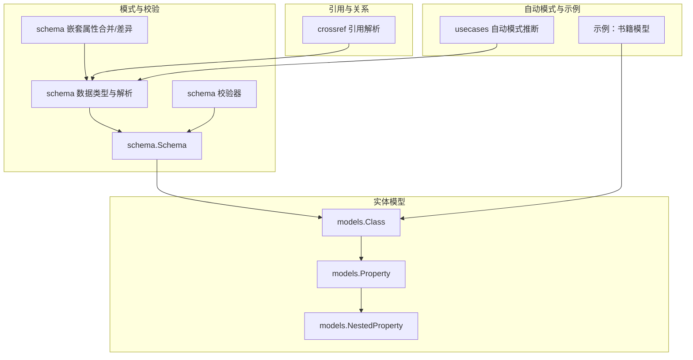
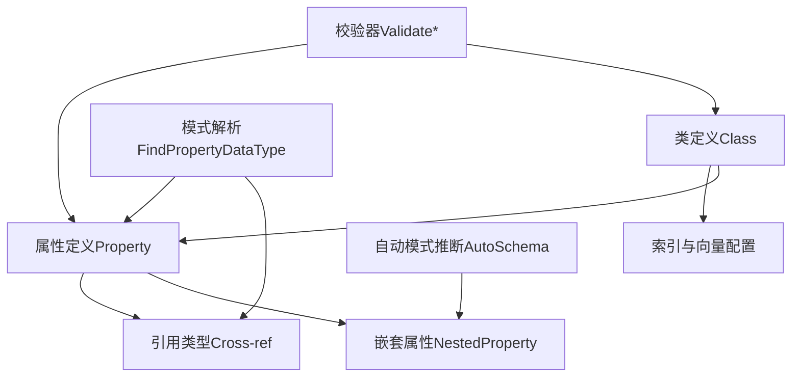
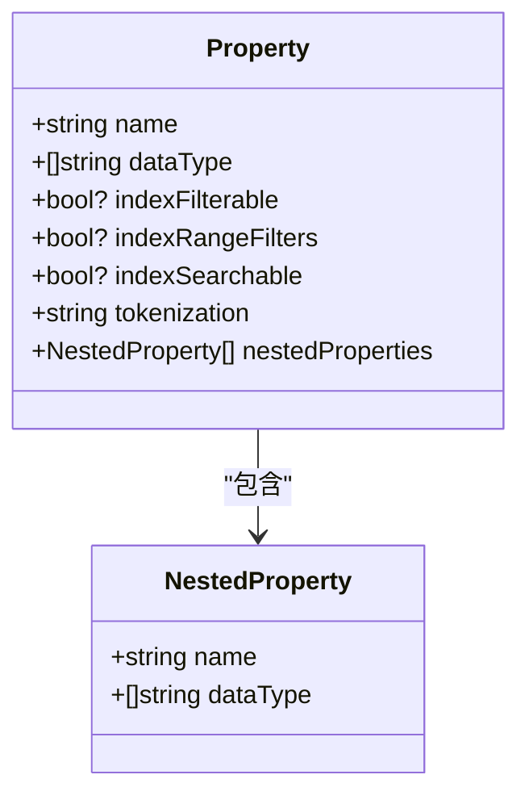
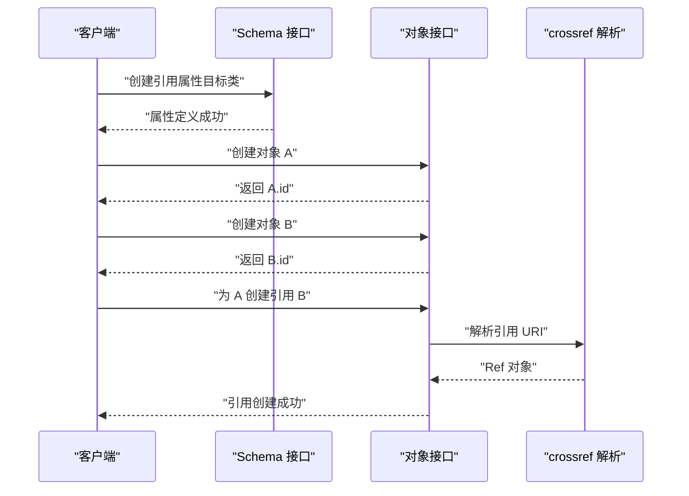
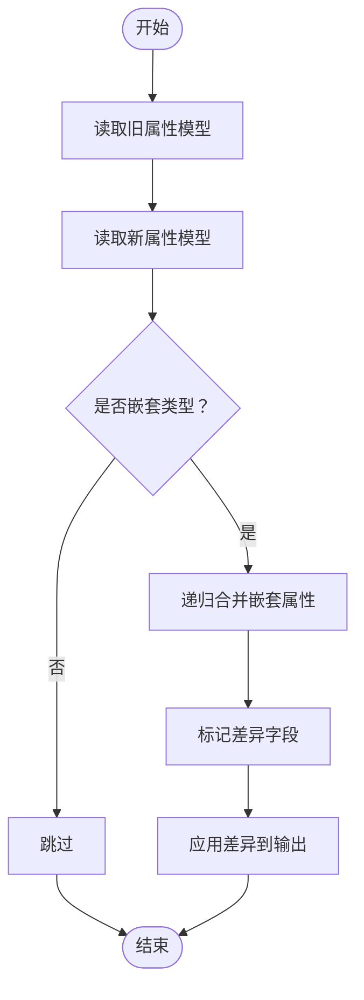
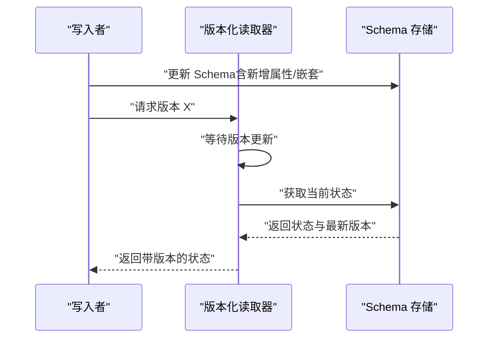
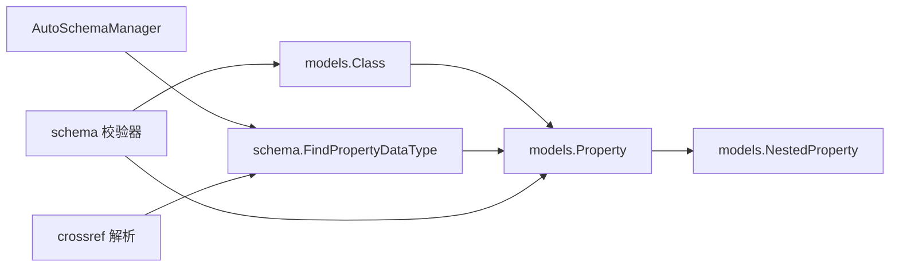

# 数据模型设计

<cite>
**本文引用的文件**   
- [entities/schema/data_types.go](file://entities/schema/data_types.go)
- [entities/schema/validation.go](file://entities/schema/validation.go)
- [entities/schema/properties.go](file://entities/schema/properties.go)
- [entities/schema/nested_properties.go](file://entities/schema/nested_properties.go)
- [entities/schema/backward_compat.go](file://entities/schema/backward_compat.go)
- [entities/schema/schema.go](file://entities/schema/schema.go)
- [entities/models/property.go](file://entities/models/property.go)
- [entities/models/class.go](file://entities/models/class.go)
- [entities/schema/crossref/crossref.go](file://entities/schema/crossref/crossref.go)
- [usecases/objects/auto_schema.go](file://usecases/objects/auto_schema.go)
- [test/helper/sample-schema/books/books.go](file://test/helper/sample-schema/books/books.go)
- [test/acceptance_with_go_client/multi_tenancy_tests/reference_test.go](file://test/acceptance_with_go_client/multi_tenancy_tests/reference_test.go)
- [usecases/schema/ref_finder_test.go](file://usecases/schema/ref_finder_test.go)
- [cluster/schema/versioned_reader.go](file://cluster/schema/versioned_reader.go)
</cite>

## 目录
1. [引言](#引言)
2. [项目结构](#项目结构)
3. [核心组件](#核心组件)
4. [架构总览](#架构总览)
5. [详细组件分析](#详细组件分析)
6. [依赖分析](#依赖分析)
7. [性能考量](#性能考量)
8. [故障排查指南](#故障排查指南)
9. [结论](#结论)
10. [附录](#附录)

## 引言
本指导文档面向数据架构师与开发者，系统梳理 Weaviate 的数据模型设计方法论与实现细节，覆盖类（Class）命名规范与继承关系、属性（Property）定义与约束、关系建模（引用属性、交叉引用、多对多）、嵌套属性与复杂数据结构、以及数据模型演进与版本化策略。文档以代码为依据，辅以图示与实践案例，帮助在真实场景中构建可维护、可扩展、向后兼容的数据模型。

## 项目结构
Weaviate 的数据模型由“类（Class）—属性（Property）—嵌套属性（NestedProperty）—引用（Cross-ref）”构成，核心定义位于实体模型与模式包中，并通过校验器、解析器与自动模式推断等机制保障一致性与可用性。

**图表来源**
- [entities/models/class.go](file://entities/models/class.go#L29-L72)
- [entities/models/property.go](file://entities/models/property.go#L30-L65)
- [entities/schema/schema.go](file://entities/schema/schema.go#L40-L42)
- [entities/schema/data_types.go](file://entities/schema/data_types.go#L24-L106)
- [entities/schema/validation.go](file://entities/schema/validation.go#L19-L54)
- [entities/schema/nested_properties.go](file://entities/schema/nested_properties.go#L25-L61)
- [entities/schema/crossref/crossref.go](file://entities/schema/crossref/crossref.go#L28-L39)
- [usecases/objects/auto_schema.go](file://usecases/objects/auto_schema.go#L473-L517)
- [test/helper/sample-schema/books/books.go](file://test/helper/sample-schema/books/books.go#L196-L261)

**章节来源**
- [entities/models/class.go](file://entities/models/class.go#L29-L72)
- [entities/models/property.go](file://entities/models/property.go#L30-L65)
- [entities/schema/schema.go](file://entities/schema/schema.go#L40-L42)
- [entities/schema/data_types.go](file://entities/schema/data_types.go#L24-L106)
- [entities/schema/validation.go](file://entities/schema/validation.go#L19-L54)
- [entities/schema/nested_properties.go](file://entities/schema/nested_properties.go#L25-L61)
- [entities/schema/crossref/crossref.go](file://entities/schema/crossref/crossref.go#L28-L39)
- [usecases/objects/auto_schema.go](file://usecases/objects/auto_schema.go#L473-L517)
- [test/helper/sample-schema/books/books.go](file://test/helper/sample-schema/books/books.go#L196-L261)

## 核心组件
- 类（Class）
  - 定义集合名称、描述、索引配置、模块配置、复制与分片配置、命名向量配置、向量化器与向量索引类型等。
  - 属性集合用于承载具体字段与嵌套结构。
- 属性（Property）
  - 支持标量类型（文本、整数、数值、布尔、日期、UUID、地理坐标、电话号码、Blob 等）与数组类型。
  - 支持嵌套对象（object/object[]）及其嵌套属性。
  - 支持过滤索引、范围过滤索引、可搜索索引与分词策略等。
- 引用（Cross-ref）
  - 以 URI 形式表达跨类引用，支持本地/远程节点、目标类名与对象 ID。
- 模式与校验
  - 提供类名、属性名、嵌套属性名的正则校验与长度限制。
  - 解析属性数据类型（标量、嵌套、引用），并进行引用存在性校验。
- 嵌套属性
  - 支持递归合并与差异计算，保证在属性更新时保留已有结构并增量变更。
- 自动模式
  - 基于示例数据推断嵌套属性结构，支持数组元素的递归合并。

**章节来源**
- [entities/models/class.go](file://entities/models/class.go#L29-L72)
- [entities/models/property.go](file://entities/models/property.go#L30-L65)
- [entities/schema/validation.go](file://entities/schema/validation.go#L19-L54)
- [entities/schema/data_types.go](file://entities/schema/data_types.go#L220-L299)
- [entities/schema/nested_properties.go](file://entities/schema/nested_properties.go#L25-L61)
- [usecases/objects/auto_schema.go](file://usecases/objects/auto_schema.go#L473-L517)

## 架构总览
Weaviate 的数据模型围绕“类—属性—嵌套—引用”展开，通过模式层统一解析与校验，结合自动模式与引用解析，形成从定义到落地的闭环。

**图表来源**
- [entities/schema/data_types.go](file://entities/schema/data_types.go#L220-L299)
- [entities/schema/validation.go](file://entities/schema/validation.go#L56-L147)
- [entities/schema/nested_properties.go](file://entities/schema/nested_properties.go#L25-L61)
- [usecases/objects/auto_schema.go](file://usecases/objects/auto_schema.go#L473-L517)

## 详细组件分析

### 类（Class）设计原则
- 命名规范
  - 类名必须以大写字母开头，允许字母、数字与下划线组合，最大长度受目录名限制；支持包含通配符与正则的类名校验。
  - 避免使用保留字与特殊前缀，确保与内部路径与查询语法兼容。
- 继承关系
  - 模型未提供显式“类继承”能力；可通过属性与引用模拟层次化语义，或在上层业务逻辑中以“标签/向量命名空间”区分不同子类。
- 属性组织策略
  - 将强关联字段与弱关联字段分离，合理设置索引策略（过滤、范围过滤、可搜索）。
  - 对文本字段配置合适的分词策略，兼顾检索与向量化需求。
- 复制、分片与多租户
  - 复制因子与分片状态影响读写分布与一致性；多租户启用后需在引用与数据写入时指定租户。

**章节来源**
- [entities/schema/validation.go](file://entities/schema/validation.go#L56-L96)
- [entities/models/class.go](file://entities/models/class.go#L29-L72)
- [entities/models/property.go](file://entities/models/property.go#L30-L65)

### 属性（Property）定义
- 数据类型选择
  - 标量：text/int/number/boolean/date/uuid/geoCoordinates/phoneNumber/blob 及其数组形式。
  - 嵌套：object/object[]，配合 NestedProperties 描述内部结构。
  - 引用：以首字母大写的类名表示跨类引用（如 ["Person"]）。
- 约束与验证规则
  - 属性名遵循 GraphQL 名称规范，最大长度受限；嵌套属性名无目录名限制但建议简洁。
  - 不得使用保留属性名（如 id/_id/_additional）。
  - 引用类型需确保目标类存在（可放宽校验用于备份恢复等场景）。
- 分词与索引
  - 文本字段可配置分词策略（word/lowercase/whitespace/field/trigram/gse/kagome_*/gse_ch）。
  - 过滤索引、范围过滤索引与可搜索索引按数据类型与查询需求选择。

**图表来源**
- [entities/models/property.go](file://entities/models/property.go#L30-L65)
- [entities/models/property.go](file://entities/models/property.go#L59-L60)

**章节来源**
- [entities/models/property.go](file://entities/models/property.go#L30-L65)
- [entities/schema/validation.go](file://entities/schema/validation.go#L135-L157)
- [entities/schema/data_types.go](file://entities/schema/data_types.go#L220-L299)

### 关系建模（引用属性、交叉引用、多对多）
- 引用属性
  - 在属性的 dataType 中使用目标类名（首字母大写）声明引用；支持单引用与多引用（数组）。
- 交叉引用
  - 使用 crossref 包提供的 Ref 结构解析 URI 形式的引用，支持本地/远程节点、目标类与对象 ID。
- 多对多关系
  - 通过在两个类分别定义引用属性实现双向多对多；引用创建时需明确目标类与对象 ID。
- 多租户下的引用
  - 在多租户启用的类之间建立引用时，需在同一租户上下文中进行；跨租户引用需谨慎设计边界。

**图表来源**
- [entities/schema/crossref/crossref.go](file://entities/schema/crossref/crossref.go#L43-L73)
- [test/acceptance_with_go_client/multi_tenancy_tests/reference_test.go](file://test/acceptance_with_go_client/multi_tenancy_tests/reference_test.go#L75-L85)

**章节来源**
- [entities/schema/crossref/crossref.go](file://entities/schema/crossref/crossref.go#L28-L39)
- [test/acceptance_with_go_client/multi_tenancy_tests/reference_test.go](file://test/acceptance_with_go_client/multi_tenancy_tests/reference_test.go#L54-L1745)

### 嵌套属性与复杂数据结构
- 嵌套属性合并与差异
  - 合并策略：若新旧属性均为嵌套类型，则递归合并其 NestedProperties；若新增字段则追加，若层级嵌套则递归合并。
  - 差异策略：仅保留新模型中新增的嵌套字段，避免覆盖已有结构。
- 自动模式推断
  - 基于示例数据推断 object/object[] 的嵌套结构；对数组元素逐项比对，递归合并嵌套属性。
- 示例参考
  - 书籍模型包含 meta（object）与 reviews（object[]）等复杂结构，展示多层嵌套与数组嵌套的组合。

**图表来源**
- [entities/schema/nested_properties.go](file://entities/schema/nested_properties.go#L25-L61)
- [entities/schema/properties.go](file://entities/schema/properties.go#L16-L78)
- [usecases/objects/auto_schema.go](file://usecases/objects/auto_schema.go#L473-L517)

**章节来源**
- [entities/schema/nested_properties.go](file://entities/schema/nested_properties.go#L25-L61)
- [entities/schema/properties.go](file://entities/schema/properties.go#L16-L78)
- [usecases/objects/auto_schema.go](file://usecases/objects/auto_schema.go#L473-L517)
- [test/helper/sample-schema/books/books.go](file://test/helper/sample-schema/books/books.go#L242-L258)

### 数据模型演进与版本管理
- 向后兼容性
  - 新增属性时采用去重与差异合并策略，避免破坏既有结构；对嵌套属性采用递归合并，仅追加新增字段。
  - 引用解析支持放宽校验（如备份恢复场景），先创建类再补全引用属性。
- 版本化与并发
  - 版本化读取器等待版本更新后再返回结果，确保读写一致性。
  - 并发测试表明多租户与分片状态查询具备线程安全能力。
- 兼容性工具
  - 提供历史数据类型判断与引用类型识别，辅助迁移与兼容处理。

**图表来源**
- [cluster/schema/versioned_reader.go](file://cluster/schema/versioned_reader.go#L130-L142)
- [entities/schema/backward_compat.go](file://entities/schema/backward_compat.go#L53-L83)

**章节来源**
- [entities/schema/backward_compat.go](file://entities/schema/backward_compat.go#L22-L207)
- [cluster/schema/versioned_reader.go](file://cluster/schema/versioned_reader.go#L130-L142)

## 依赖分析
- 类与属性
  - Class 聚合 Property，Property 可包含 NestedProperty。
- 模式解析
  - FindPropertyDataType 统一解析标量、嵌套与引用类型，并进行引用存在性校验。
- 校验器
  - ValidateClassName/PropertyName/NestedPropertyName 与长度限制共同保障命名合规。
- 自动模式
  - AutoSchemaManager 基于示例数据推断嵌套结构，与 DedupProperties 合并策略协同工作。
- 引用解析
  - crossref 提供 URI 到 Ref 的安全解析，支持本地/远程节点与目标类名。

**图表来源**
- [entities/models/class.go](file://entities/models/class.go#L52-L53)
- [entities/models/property.go](file://entities/models/property.go#L59-L60)
- [entities/schema/data_types.go](file://entities/schema/data_types.go#L220-L299)
- [entities/schema/validation.go](file://entities/schema/validation.go#L56-L147)
- [usecases/objects/auto_schema.go](file://usecases/objects/auto_schema.go#L473-L517)
- [entities/schema/crossref/crossref.go](file://entities/schema/crossref/crossref.go#L43-L73)

**章节来源**
- [entities/models/class.go](file://entities/models/class.go#L52-L53)
- [entities/models/property.go](file://entities/models/property.go#L59-L60)
- [entities/schema/data_types.go](file://entities/schema/data_types.go#L220-L299)
- [entities/schema/validation.go](file://entities/schema/validation.go#L56-L147)
- [usecases/objects/auto_schema.go](file://usecases/objects/auto_schema.go#L473-L517)
- [entities/schema/crossref/crossref.go](file://entities/schema/crossref/crossref.go#L43-L73)

## 性能考量
- 索引策略
  - 文本字段启用可搜索索引以支持 BM25/Hybrid 检索；整数/数值/日期可启用范围过滤索引提升范围查询性能。
- 向量索引
  - 根据数据规模与查询延迟要求选择 HNSW/Flat 等索引类型；命名向量可针对不同属性定制向量化策略。
- 嵌套属性
  - 嵌套结构越深，序列化/反序列化与查询成本越高；建议控制嵌套层级与数组长度。
- 引用
  - 跨类引用会引入额外的解析与路由开销；尽量减少深层交叉引用链路。

## 故障排查指南
- 命名错误
  - 类名/属性名不符合正则或超长：检查长度与字符集，确保符合 GraphQL 名称规范。
- 引用失败
  - 目标类不存在或大小写不匹配：确认引用类名首字母大写且已创建；在放宽校验场景下，先创建类再补全属性。
- 嵌套结构异常
  - 新旧模型合并后字段缺失：检查 DedupProperties 与 MergeRecursivelyNestedProperties 的差异逻辑。
- 多租户引用问题
  - 在非多租户类与多租户类之间建立引用：需在同一租户上下文内操作，避免跨租户引用导致的权限与可见性问题。

**章节来源**
- [entities/schema/validation.go](file://entities/schema/validation.go#L56-L147)
- [entities/schema/data_types.go](file://entities/schema/data_types.go#L235-L299)
- [entities/schema/nested_properties.go](file://entities/schema/nested_properties.go#L25-L61)
- [test/acceptance_with_go_client/multi_tenancy_tests/reference_test.go](file://test/acceptance_with_go_client/multi_tenancy_tests/reference_test.go#L3295-L3336)

## 结论
Weaviate 的数据模型以“类—属性—嵌套—引用”为核心，通过严格的命名与校验、灵活的索引与向量配置、稳健的引用解析与自动模式推断，支撑复杂语义与高并发场景。遵循本文的设计原则与最佳实践，可在保证向后兼容的前提下平滑演进模型，满足多样化的检索与推理需求。

## 附录

### 实际模型设计案例
- 书籍模型（含嵌套与数组）
  - 展示了 object 与 object[] 的嵌套结构、多层嵌套与数组嵌套的组合使用。
  - 参考路径：[test/helper/sample-schema/books/books.go](file://test/helper/sample-schema/books/books.go#L196-L261)

**章节来源**
- [test/helper/sample-schema/books/books.go](file://test/helper/sample-schema/books/books.go#L196-L261)

### 常见设计模式
- 单向引用：A → B（A 持有 B 的引用）
- 双向引用：A → B 与 B → A（需注意循环与一致性）
- 多对多：A 拥有 B[] 与 C[]，B 与 C 再各自拥有 A[]
- 嵌套对象：使用 object/object[] 承载复杂元信息与评论结构
- 多租户引用：在 MT 类之间建立引用时，确保租户一致

**章节来源**
- [test/acceptance_with_go_client/multi_tenancy_tests/reference_test.go](file://test/acceptance_with_go_client/multi_tenancy_tests/reference_test.go#L54-L1745)
- [usecases/schema/ref_finder_test.go](file://usecases/schema/ref_finder_test.go#L132-L193)