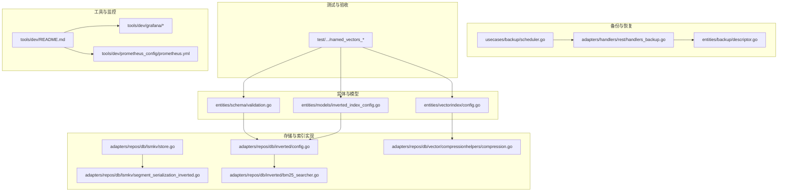
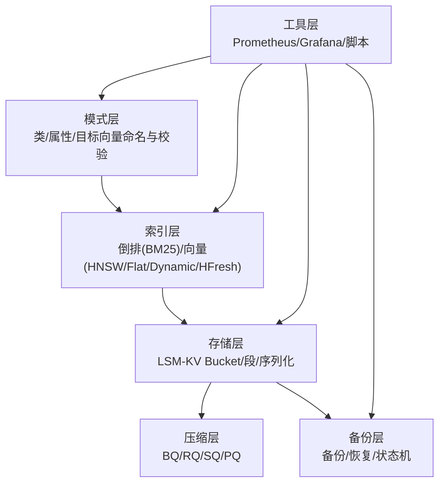
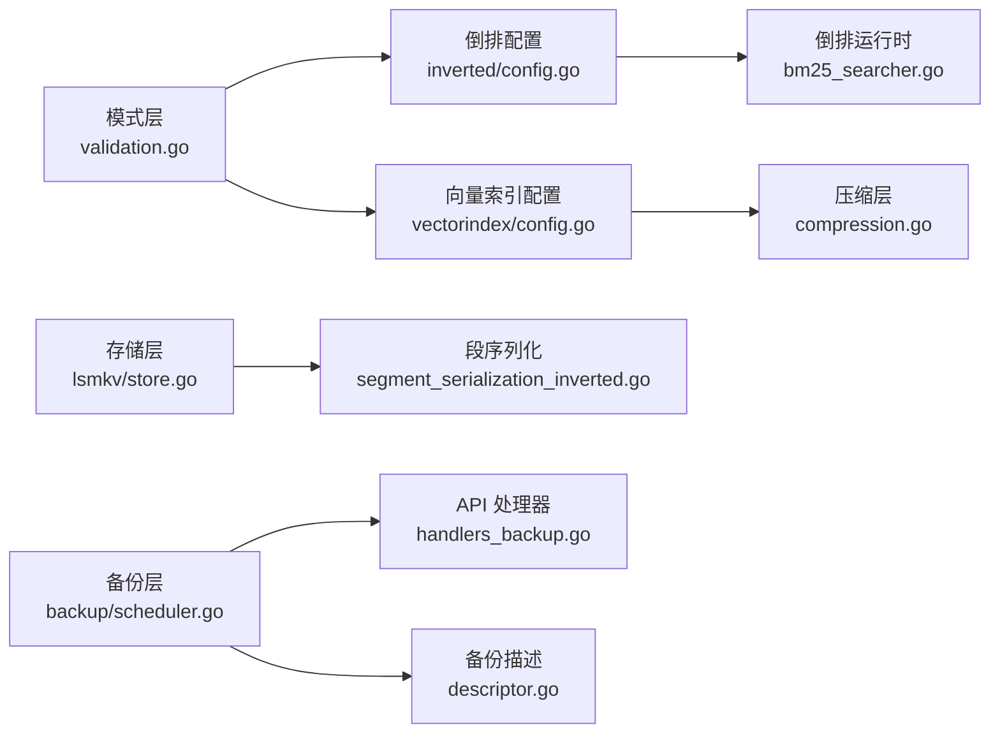

# 数据管理

<cite>
**本文引用的文件**
- [README.md](file://README.md)
- [validation.go](file://entities/schema/validation.go)
- [inverted_index_config.go](file://entities/models/inverted_index_config.go)
- [config.go](file://adapters/repos/db/inverted/config.go)
- [config_test.go](file://adapters/repos/db/inverted/config_test.go)
- [bm25_searcher.go](file://adapters/repos/db/inverted/bm25_searcher.go)
- [config.go](file://entities/vectorindex/config.go)
- [compression.go](file://adapters/repos/db/vector/compressionhelpers/compression.go)
- [compression_test.go](file://adapters/repos/db/vector/compressionhelpers/compression_test.go)
- [store.go](file://adapters/repos/db/lsmkv/store.go)
- [segment_serialization_inverted.go](file://adapters/repos/db/lsmkv/segment_serialization_inverted.go)
- [scheduler.go](file://usecases/backup/scheduler.go)
- [descriptor.go](file://entities/backup/descriptor.go)
- [named_vectors_schema.go](file://test/acceptance_with_go_client/named_vectors_tests/test_suits/named_vectors_schema.go)
- [named_vectors_vector_index_types.go](file://test/acceptance_with_go_client/named_vectors_tests/test_suits/named_vectors_vector_index_types.go)
- [named_vectors_objects_none_vectorizer.go](file://test/acceptance_with_go_client/named_vectors_tests/test_suits/named_vectors_objects_none_vectorizer.go)
- [filters_validator.go](file://entities/filters/filters_validator.go)
- [filters_validator_test.go](file://entities/filters/filters_validator_test.go)
- [shard_dimension_tracking.go](file://adapters/repos/db/shard_dimension_tracking.go)
- [handers_backup.go](file://adapters/handlers/rest/handlers_backup.go)
- [traverser_get_params_test.go](file://usecases/traverser/traverser_get_params_test.go)
- [tools/dev/README.md](file://tools/dev/README.md)
- [tools/dev/config.local-development.yaml](file://tools/dev/config.local-development.yaml)
- [tools/dev/config.runtime-overrides.yaml](file://tools/dev/config.runtime-overrides.yaml)
- [tools/dev/config.local-customdb.yaml](file://tools/dev/config.local-customdb.yaml)
- [tools/dev/config.local-esvector-only.yaml](file://tools/dev/config.local-esvector-only.yaml)
- [tools/dev/config.local-oidc.yaml](file://tools/dev/config.local-oidc.yaml)
- [tools/dev/config.readonly.yaml](file://tools/dev/config.readonly.yaml)
- [tools/dev/config.wcsauth-dev.yaml](file://tools/dev/config.wcsauth-dev.yaml)
- [tools/dev/keycloak/get_token.sh](file://tools/dev/keycloak/get_token.sh)
- [tools/dev/keycloak/import_users.sh](file://tools/dev/keycloak/import_users.sh)
- [tools/dev/keycloak/weaviate-realm.json](file://tools/dev/keycloak/weaviate-realm.json)
- [tools/dev/prometheus_config/prometheus.yml](file://tools/dev/prometheus_config/prometheus.yml)
- [tools/dev/grafana/datasource.yml](file://tools/dev/grafana/datasource.yml)
- [tools/dev/grafana/dashboard_provider.yml](file://tools/dev/grafana/dashboard_provider.yml)
- [tools/dev/grafana/grafana.ini](file://tools/dev/grafana/grafana.ini)
- [tools/dev/grafana/dashboards/overview.json](file://tools/dev/grafana/dashboards/overview.json)
- [tools/dev/grafana/dashboards/vectorindex.json](file://tools/dev/grafana/dashboards/vectorindex.json)
- [tools/dev/grafana/dashboards/lsm.json](file://tools/dev/grafana/dashboards/lsm.json)
- [tools/dev/grafana/dashboards/backup.json](file://tools/dev/grafana/dashboards/backup.json)
- [tools/dev/grafana/dashboards/db_shards.json](file://tools/dev/grafana/dashboards/db_shards.json)
- [tools/dev/grafana/dashboards/querying.json](file://tools/dev/grafana/dashboards/querying.json)
- [tools/dev/grafana/dashboards/importing.json](file://tools/dev/grafana/dashboards/importing.json)
- [tools/dev/grafana/dashboards/schema.json](file://tools/dev/grafana/dashboards/schema.json)
- [tools/dev/grafana/dashboards/tombstones.json](file://tools/dev/grafana/dashboards/tombstones.json)
- [tools/dev/grafana/dashboards/usage.json](file://tools/dev/grafana/dashboards/usage.json)
- [tools/dev/grafana/dashboards/replication-engine.json](file://tools/dev/grafana/dashboards/replication-engine.json)
- [tools/dev/grafana/dashboards/dynamic.json](file://tools/dev/grafana/dashboards/dynamic.json)
- [tools/dev/grafana/dashboards/spfresh.json](file://tools/dev/grafana/dashboards/spfresh.json)
- [tools/dev/grafana/dashboards/openai_vectoriser_metrics.json](file://tools/dev/grafana/dashboards/openai_vectoriser_metrics.json)
- [tools/dev/grafana/dashboards/host_metrics_mac.json](file://tools/dev/grafana/dashboards/host_metrics_mac.json)
- [tools/dev/grafana/dashboards/startup.json](file://tools/dev/grafana/dashboards/startup.json)
- [tools/dev/grafana/dashboards/objects.json](file://tools/dev/grafana/dashboards/objects.json)
- [tools/dev/grafana/dashboards/index_queue.json](file://tools/dev/grafana/dashboards/index_queue.json)
- [tools/dev/grafana/dashboards/auto_tenant.json](file://tools/dev/grafana/dashboards/auto_tenant.json)
- [tools/dev/grafana/dashboards/kubernetes.json](file://tools/dev/grafana/dashboards/kubernetes.json)
- [tools/dev/grafana/dashboards/tenant.json](file://tools/dev/grafana/dashboards/tenant.json)
- [tools/dev/grafana/dashboards/tenant.json](file://tools/dev/grafana/dashboards/tenant.json)
- [tools/dev/grafana/dashboards/tenant.json](file://tools/dev/grafana/dashboards/tenant.json)
- [tools/dev/grafana/dashboards/tenant.json](file://tools/dev/grafana/dashboards/tenant.json)
- [tools/dev/grafana/dashboards/tenant.json](file://tools/dev/grafana/dashboards/tenant.json)
- [tools/dev/grafana/dashboards/tenant.json](file://tools/dev/grafana/dashboards/tenant.json)
- [tools/dev/grafana/dashboards/tenant.json](file://tools/dev/grafana/dashboards/tenant.json)
- [tools/dev/grafana/dashboards/tenant.json](file://tools/dev/grafana/dashboards/tenant.json)
- [tools/dev/grafana/dashboards/tenant.json](file://tools/dev/grafana/dashboards/tenant.json)
- [tools/dev/grafana/dashboards/tenant.json](file://tools/dev/grafana/dashboards/tenant.json)
- [tools/dev/grafana/dashboards/tenant.json](file://tools/dev/grafana/dashboards/tenant.json)
- [tools/dev/grafana/dashboards/tenant.json](file://tools/dev/grafana/dashboards/tenant.json)
- [tools/dev/grafana/dashboards/tenant.json](file://tools/dev/grafana/dashboards/tenant.json)
- [tools/dev/grafana/dashboards/tenant.json](file://tools/dev/grafana/dashboards/tenant.json)
- [tools/dev/grafana/dashboards/tenant.json](file://tools/dev/grafana/dashboards/tenant.json)
- [tools/dev/grafana/dashboards/tenant.json](file://tools/dev/grafana/dashboards/tenant.json)
- [tools/dev/grafana/dashboards/tenant.json](file://tools/dev/grafana/dashboards/tenant.json)
- [tools/dev/grafana/dashboards/tenant.json](file://tools/dev/grafana/dashboards/tenant.json)
- [tools/dev/graf......](file://tools/dev/grafana/dashboards/tenant.json)
</cite>

## 目录
1. 引言
2. 项目结构
3. 核心组件
4. 架构总览
5. 组件详解
6. 依赖关系分析
7. 性能考量
8. 故障排查指南
9. 结论
10. 附录

## 引言
本指南面向数据工程师与数据库管理员，围绕 Weaviate 的数据管理实践提供系统化建议，覆盖数据模型设计、索引配置优化、存储与压缩优化、迁移与升级、数据质量保障以及运维与监控工具链。Weaviate 作为云原生向量数据库，支持向量相似搜索与关键词/混合检索，并提供备份恢复、复制、多租户等生产特性。本指南以仓库中的实现与测试为依据，提炼最佳实践与操作路径。

## 项目结构
Weaviate 采用模块化与分层架构：核心实体模型位于 entities；存储与 LSM-KV 实现位于 adapters/repos/db；API 层位于 adapters/handlers；备份与恢复逻辑位于 usecases；工具与仪表盘位于 tools。下图给出与数据管理相关的核心目录关系概览。

图表来源
- [validation.go](file://entities/schema/validation.go#L1-L188)
- [inverted_index_config.go](file://entities/models/inverted_index_config.go#L42-L216)
- [config.go](file://entities/vectorindex/config.go#L24-L52)
- [store.go](file://adapters/repos/db/lsmkv/store.go#L43-L200)
- [segment_serialization_inverted.go](file://adapters/repos/db/lsmkv/segment_serialization_inverted.go#L1-L55)
- [config.go](file://adapters/repos/db/inverted/config.go#L53-L112)
- [bm25_searcher.go](file://adapters/repos/db/inverted/bm25_searcher.go#L428-L466)
- [compression.go](file://adapters/repos/db/vector/compressionhelpers/compression.go#L89-L120)
- [scheduler.go](file://usecases/backup/scheduler.go#L140-L359)
- [descriptor.go](file://entities/backup/descriptor.go#L319-L348)
- [named_vectors_schema.go](file://test/acceptance_with_go_client/named_vectors_tests/test_suits/named_vectors_schema.go#L138-L184)
- [named_vectors_vector_index_types.go](file://test/acceptance_with_go_client/named_vectors_tests/test_suits/named_vectors_vector_index_types.go#L92-L125)
- [named_vectors_objects_none_vectorizer.go](file://test/acceptance_with_go_client/named_vectors_tests/test_suits/named_vectors_objects_none_vectorizer.go#L36-L86)

章节来源
- [README.md](file://README.md#L1-L181)

## 核心组件
- 数据模型与校验：类名、属性名、目标向量名的命名规范与正则约束，保留字保护，长度限制。
- 反向索引与 BM25：倒排索引配置、停用词、用户词典、BlockMax WAND、BM25 参数校验与默认值。
- 向量索引类型：HNSW、Flat、Dynamic、HFresh 的解析与校验。
- 向量压缩：二进制旋转量化（BQ）、旋转量化（RQ）、标量量化（SQ）、产品量化（PQ）等。
- 存储与 LSM-KV：Bucket 生命周期、并发安全、段序列化与压缩。
- 备份与恢复：备份调度、状态机、压缩类型、恢复选项。
- 过滤与校验：属性类型、UUID、数组、引用类型的过滤校验。
- 工具与监控：开发环境配置、Prometheus/Grafana 监控面板与脚本。

章节来源
- [validation.go](file://entities/schema/validation.go#L19-L188)
- [inverted_index_config.go](file://entities/models/inverted_index_config.go#L42-L216)
- [config.go](file://adapters/repos/db/inverted/config.go#L53-L112)
- [config_test.go](file://adapters/repos/db/inverted/config_test.go#L35-L58)
- [bm25_searcher.go](file://adapters/repos/db/inverted/bm25_searcher.go#L428-L466)
- [config.go](file://entities/vectorindex/config.go#L24-L52)
- [compression.go](file://adapters/repos/db/vector/compressionhelpers/compression.go#L89-L120)
- [store.go](file://adapters/repos/db/lsmkv/store.go#L43-L200)
- [segment_serialization_inverted.go](file://adapters/repos/db/lsmkv/segment_serialization_inverted.go#L1-L55)
- [scheduler.go](file://usecases/backup/scheduler.go#L140-L359)
- [descriptor.go](file://entities/backup/descriptor.go#L319-L348)
- [filters_validator.go](file://entities/filters/filters_validator.go#L97-L151)
- [filters_validator_test.go](file://entities/filters/filters_validator_test.go#L89-L290)

## 架构总览
Weaviate 的数据管理由“模式层—索引层—存储层—备份层—工具层”构成。模式层负责类与属性的命名与类型约束；索引层负责倒排与向量索引的配置与运行；存储层负责 LSM-KV 的段组织与压缩；备份层负责跨节点的备份与恢复；工具层提供监控与开发辅助。

图表来源
- [validation.go](file://entities/schema/validation.go#L19-L188)
- [config.go](file://entities/vectorindex/config.go#L24-L52)
- [store.go](file://adapters/repos/db/lsmkv/store.go#L43-L200)
- [compression.go](file://adapters/repos/db/vector/compressionhelpers/compression.go#L89-L120)
- [scheduler.go](file://usecases/backup/scheduler.go#L140-L359)

## 组件详解

### 数据模型设计与命名规范
- 类名与属性名需满足 GraphQL 名称规则与最大长度限制；目标向量名需符合 GraphQL 名称且不超过长度上限。
- 保留属性名禁止使用，避免与内部字段冲突。
- 租户名与分片名有严格字符集与长度限制，支持正则模式匹配。

最佳实践
- 类名采用大写开头的驼峰风格，避免特殊字符，便于跨平台与工具链兼容。
- 属性名尽量短小明确，避免过长导致目录名超限。
- 多向量场景为目标向量命名清晰区分用途（如“文本向量”、“图像向量”）。

章节来源
- [validation.go](file://entities/schema/validation.go#L27-L188)

### 属性定义与过滤校验
- UUID 类型、数组类型、引用类型均有专门的过滤校验规则。
- 属性长度过滤仅支持整数类型，且运算符受限，值必须非负。
- 测试覆盖了字符串/文本与布尔/整数等类型之间的互操作性。

最佳实践
- 明确属性数据类型，避免在过滤时进行隐式类型转换。
- 对引用属性的直接过滤仅支持计数场景，复杂条件应通过三层路径过滤到被引用类的原始属性。

章节来源
- [filters_validator.go](file://entities/filters/filters_validator.go#L97-L151)
- [filters_validator_test.go](file://entities/filters/filters_validator_test.go#L89-L290)
- [traverser_get_params_test.go](file://usecases/traverser/traverser_get_params_test.go#L436-L462)

### 关系建模策略
- 引用属性用于建立类间关系，过滤时需遵循三层路径约定。
- 复杂嵌套过滤通过 AND/OR 组合，注意值类型与运算符的匹配。

最佳实践
- 将频繁过滤的属性设为可搜索/可过滤，减少查询阶段的二次筛选。
- 对多对多关系，优先使用引用属性并配合聚合查询。

章节来源
- [filters_validator.go](file://entities/filters/filters_validator.go#L120-L147)

### 索引配置优化

#### 倒排索引与 BM25
- 默认启用 BlockMax WAND，BM25 参数 k1≥0、b∈[0,1]，超出范围将报错。
- 停用词支持预设与增删自定义词；用户词典可指定分词器与替换映射。
- 时间戳与属性长度索引可按需开启。

最佳实践
- 新集合默认启用 BlockMax WAND，提升 BM25 查询性能。
- 文本属性若存在大量停用词，建议使用预设停用词并按需增补。
- 对短文本或需要精确长度过滤的场景，开启属性长度索引。

章节来源
- [inverted_index_config.go](file://entities/models/inverted_index_config.go#L42-L216)
- [config.go](file://adapters/repos/db/inverted/config.go#L53-L112)
- [config_test.go](file://adapters/repos/db/inverted/config_test.go#L35-L58)
- [bm25_searcher.go](file://adapters/repos/db/inverted/bm25_searcher.go#L428-L466)

#### 向量索引选择
- HNSW：适合高维向量与大规模数据，支持动态扩容与近似最近邻。
- Flat：适合小规模或低维向量，精确检索。
- Dynamic：根据数据规模在 HNSW/Flat 之间切换。
- HFresh：面向特定场景的索引类型。

最佳实践
- 大规模高维向量优先选择 HNSW；小规模或低维场景可选 Flat。
- 多向量集合为不同用途分别配置索引类型，避免相互干扰。

章节来源
- [config.go](file://entities/vectorindex/config.go#L24-L52)
- [named_vectors_schema.go](file://test/acceptance_with_go_client/named_vectors_tests/test_suits/named_vectors_schema.go#L138-L184)
- [named_vectors_vector_index_types.go](file://test/acceptance_with_go_client/named_vectors_tests/test_suits/named_vectors_vector_index_types.go#L92-L125)
- [named_vectors_objects_none_vectorizer.go](file://test/acceptance_with_go_client/named_vectors_tests/test_suits/named_vectors_objects_none_vectorizer.go#L36-L86)

### 存储优化策略

#### LSM-KV 与段序列化
- Store 管理多个 Bucket，提供并发安全的创建/加载与状态更新。
- 段序列化包含文档 ID 与词频的打包编码，支持 Delta 编码与变长编码。

最佳实践
- 控制段大小与合并策略，避免过多小段导致读放大。
- 合理设置压缩参数，平衡 CPU 与存储占用。

章节来源
- [store.go](file://adapters/repos/db/lsmkv/store.go#L43-L200)
- [segment_serialization_inverted.go](file://adapters/repos/db/lsmkv/segment_serialization_inverted.go#L1-L55)

#### 向量压缩
- 支持 BQ、RQ、SQ、PQ 等压缩方式，按维度与位宽选择最优方案。
- 提供缓存与持久化机制，支持预加载与删除。

最佳实践
- 高维向量优先考虑 RQ/BQ；对存储敏感场景可启用 PQ/SQ。
- 结合查询负载评估缓存命中率，动态调整缓存大小。

章节来源
- [compression.go](file://adapters/repos/db/vector/compressionhelpers/compression.go#L89-L120)
- [compression.go](file://adapters/repos/db/vector/compressionhelpers/compression.go#L766-L974)
- [compression_test.go](file://adapters/repos/db/vector/compressionhelpers/compression_test.go#L30-L65)

#### 分片与维度追踪
- HNSW/Flat/Dynamic 的压缩信息提取用于指标统计与容量规划。
- 多租户分片状态构建与节点分配策略确保副本均匀分布。

最佳实践
- 多租户场景下合理设置副本因子与节点轮询，避免热点。
- 根据维度与压缩类型估算存储与内存占用，预留扩容空间。

章节来源
- [shard_dimension_tracking.go](file://adapters/repos/db/shard_dimension_tracking.go#L184-L222)

### 数据迁移与升级

#### 备份与恢复
- 备份调度器负责授权、初始化上传器、执行备份与状态查询。
- 恢复流程支持节点映射、压缩类型、RBAC/用户恢复选项。
- 备份描述包含压缩类型、版本、状态与错误信息，兼容旧版默认 gzip。

最佳实践
- 升级前先执行全量备份，记录备份 ID 与压缩类型。
- 恢复时根据目标集群配置选择合适的恢复选项（节点映射、RBAC/用户恢复）。
- 对于跨版本升级，优先在测试环境验证备份可用性与数据一致性。

章节来源
- [scheduler.go](file://usecases/backup/scheduler.go#L140-L359)
- [descriptor.go](file://entities/backup/descriptor.go#L319-L348)
- [handers_backup.go](file://adapters/handlers/rest/handlers_backup.go#L178-L214)

### 数据质量保证

#### 数据验证与完整性检查
- 属性类型过滤校验严格限制值类型与运算符组合，防止无效查询。
- UUID 类型与数组类型有专门的校验逻辑，避免误用。
- 过滤属性长度仅支持整数类型且值非负。

最佳实践
- 在入库前进行类型与取值范围校验，减少运行期错误。
- 对引用属性的过滤，明确三层路径，避免歧义。

章节来源
- [filters_validator.go](file://entities/filters/filters_validator.go#L97-L151)
- [filters_validator_test.go](file://entities/filters/filters_validator_test.go#L89-L290)

#### 一致性维护
- 备份/恢复流程包含状态机与错误处理，失败时返回详细错误信息。
- 恢复选项支持 RBAC 与用户数据的保留/覆盖策略。

最佳实践
- 恢复前核对备份元数据与版本信息，确认压缩类型与状态。
- 对关键业务数据，建议在恢复后执行一致性校验（采样比对）。

章节来源
- [scheduler.go](file://usecases/backup/scheduler.go#L140-L359)
- [descriptor.go](file://entities/backup/descriptor.go#L319-L348)

### 数据管理工具与自动化脚本
- 开发环境配置：提供多套 YAML 配置模板，覆盖开发、OIDC、只读等场景。
- 监控与可视化：Grafana 仪表盘覆盖向量索引、LSM、备份、分片、查询、导入、Schema 等主题；Prometheus 配置集中管理。
- 辅助脚本：Keycloak 用户导入、Token 获取、仪表盘与数据源配置等。

最佳实践
- 使用 tools/dev/grafana/dashboards 下的仪表盘快速定位性能瓶颈。
- 通过 Prometheus 抓取指标，结合 Grafana 仪表盘进行趋势分析。
- 使用 tools/dev/keycloak 脚本完成用户与权限初始化，便于测试与演示。

章节来源
- [tools/dev/README.md](file://tools/dev/README.md)
- [tools/dev/config.local-development.yaml](file://tools/dev/config.local-development.yaml)
- [tools/dev/config.runtime-overrides.yaml](file://tools/dev/config.runtime-overrides.yaml)
- [tools/dev/config.local-customdb.yaml](file://tools/dev/config.local-customdb.yaml)
- [tools/dev/config.local-esvector-only.yaml](file://tools/dev/config.local-esvector-only.yaml)
- [tools/dev/config.local-oidc.yaml](file://tools/dev/config.local-oidc.yaml)
- [tools/dev/config.readonly.yaml](file://tools/dev/config.readonly.yaml)
- [tools/dev/config.wcsauth-dev.yaml](file://tools/dev/config.wcsauth-dev.yaml)
- [tools/dev/keycloak/get_token.sh](file://tools/dev/keycloak/get_token.sh)
- [tools/dev/keycloak/import_users.sh](file://tools/dev/keycloak/import_users.sh)
- [tools/dev/keycloak/weaviate-realm.json](file://tools/dev/keycloak/weaviate-realm.json)
- [tools/dev/prometheus_config/prometheus.yml](file://tools/dev/prometheus_config/prometheus.yml)
- [tools/dev/grafana/datasource.yml](file://tools/dev/grafana/datasource.yml)
- [tools/dev/grafana/dashboard_provider.yml](file://tools/dev/grafana/dashboard_provider.yml)
- [tools/dev/grafana/grafana.ini](file://tools/dev/grafana/grafana.ini)
- [tools/dev/grafana/dashboards/overview.json](file://tools/dev/grafana/dashboards/overview.json)
- [tools/dev/grafana/dashboards/vectorindex.json](file://tools/dev/grafana/dashboards/vectorindex.json)
- [tools/dev/grafana/dashboards/lsm.json](file://tools/dev/grafana/dashboards/lsm.json)
- [tools/dev/grafana/dashboards/backup.json](file://tools/dev/grafana/dashboards/backup.json)
- [tools/dev/grafana/dashboards/db_shards.json](file://tools/dev/grafana/dashboards/db_shards.json)
- [tools/dev/grafana/dashboards/querying.json](file://tools/dev/grafana/dashboards/querying.json)
- [tools/dev/grafana/dashboards/importing.json](file://tools/dev/grafana/dashboards/importing.json)
- [tools/dev/grafana/dashboards/schema.json](file://tools/dev/grafana/dashboards/schema.json)
- [tools/dev/grafana/dashboards/tombstones.json](file://tools/dev/grafana/dashboards/tombstones.json)
- [tools/dev/grafana/dashboards/usage.json](file://tools/dev/grafana/dashboards/usage.json)
- [tools/dev/grafana/dashboards/replication-engine.json](file://tools/dev/grafana/dashboards/replication-engine.json)
- [tools/dev/grafana/dashboards/dynamic.json](file://tools/dev/grafana/dashboards/dynamic.json)
- [tools/dev/grafana/dashboards/spfresh.json](file://tools/dev/grafana/dashboards/spfresh.json)
- [tools/dev/grafana/dashboards/openai_vectoriser_metrics.json](file://tools/dev/grafana/dashboards/openai_vectoriser_metrics.json)
- [tools/dev/grafana/dashboards/host_metrics_mac.json](file://tools/dev/grafana/dashboards/host_metrics_mac.json)
- [tools/dev/grafana/dashboards/startup.json](file://tools/dev/grafana/dashboards/startup.json)
- [tools/dev/grafana/dashboards/objects.json](file://tools/dev/grafana/dashboards/objects.json)
- [tools/dev/grafana/dashboards/index_queue.json](file://tools/dev/grafana/dashboards/index_queue.json)
- [tools/dev/grafana/dashboards/auto_tenant.json](file://tools/dev/grafana/dashboards/auto_tenant.json)
- [tools/dev/grafana/dashboards/kubernetes.json](file://tools/dev/grafana/dashboards/kubernetes.json)

## 依赖关系分析
Weaviate 的数据管理各层之间耦合度较低，通过接口与配置解耦。模式层与索引层通过配置传递；存储层与压缩层通过接口抽象；备份层与 API 层通过调度器协调。

图表来源
- [validation.go](file://entities/schema/validation.go#L19-L188)
- [config.go](file://adapters/repos/db/inverted/config.go#L53-L112)
- [bm25_searcher.go](file://adapters/repos/db/inverted/bm25_searcher.go#L428-L466)
- [config.go](file://entities/vectorindex/config.go#L24-L52)
- [compression.go](file://adapters/repos/db/vector/compressionhelpers/compression.go#L89-L120)
- [store.go](file://adapters/repos/db/lsmkv/store.go#L43-L200)
- [segment_serialization_inverted.go](file://adapters/repos/db/lsmkv/segment_serialization_inverted.go#L1-L55)
- [scheduler.go](file://usecases/backup/scheduler.go#L140-L359)
- [descriptor.go](file://entities/backup/descriptor.go#L319-L348)
- [handers_backup.go](file://adapters/handlers/rest/handlers_backup.go#L178-L214)

## 性能考量
- 倒排索引：启用 BlockMax WAND，合理设置 BM25 参数；对短文本开启属性长度索引。
- 向量索引：HNSW 适合大规模高维向量；Flat 适合小规模；Dynamic 根据数据规模切换。
- 压缩：RQ/BQ 适合高维；PQ/SQ 适合存储敏感场景；结合缓存命中率调优。
- 存储：控制段大小与合并策略，避免读放大；LSM-KV 段序列化采用变长编码与 Delta 编码。
- 监控：通过 Grafana 仪表盘与 Prometheus 抓取指标，持续观察向量索引、LSM、备份与查询延迟。

## 故障排查指南
- 倒排配置错误：BM25.k1 必须非负，BM25.b 必须在 [0,1] 区间；否则校验失败。
- 备份恢复异常：检查备份状态与错误信息，确认压缩类型与目标集群配置一致；必要时回滚到上一版本。
- 过滤类型不匹配：UUID/数组/引用类型过滤有严格限制，需按规则构造查询。
- 存储异常：关注 Bucket 并发访问与关闭状态，避免重复关闭或并发修改。

章节来源
- [config_test.go](file://adapters/repos/db/inverted/config_test.go#L35-L58)
- [scheduler.go](file://usecases/backup/scheduler.go#L140-L359)
- [descriptor.go](file://entities/backup/descriptor.go#L319-L348)
- [filters_validator.go](file://entities/filters/filters_validator.go#L97-L151)
- [store.go](file://adapters/repos/db/lsmkv/store.go#L39-L86)

## 结论
Weaviate 的数据管理以严格的模式校验、灵活的索引配置、高效的存储与压缩、可靠的备份恢复以及完善的监控工具链为核心。遵循本文最佳实践，可在保证数据质量的同时，实现高性能与低成本的向量数据管理。

## 附录
- 快速参考
  - 类/属性/目标向量命名与长度限制：见 [validation.go](file://entities/schema/validation.go#L27-L188)
  - 倒排索引配置与 BM25 校验：见 [inverted_index_config.go](file://entities/models/inverted_index_config.go#L42-L216)、[config.go](file://adapters/repos/db/inverted/config.go#L53-L112)、[config_test.go](file://adapters/repos/db/inverted/config_test.go#L35-L58)
  - 向量索引类型选择：见 [config.go](file://entities/vectorindex/config.go#L24-L52)
  - 向量压缩与缓存：见 [compression.go](file://adapters/repos/db/vector/compressionhelpers/compression.go#L89-L120)
  - 存储与段序列化：见 [store.go](file://adapters/repos/db/lsmkv/store.go#L43-L200)、[segment_serialization_inverted.go](file://adapters/repos/db/lsmkv/segment_serialization_inverted.go#L1-L55)
  - 备份与恢复：见 [scheduler.go](file://usecases/backup/scheduler.go#L140-L359)、[descriptor.go](file://entities/backup/descriptor.go#L319-L348)
  - 过滤校验：见 [filters_validator.go](file://entities/filters/filters_validator.go#L97-L151)
  - 工具与监控：见 [tools/dev/README.md](file://tools/dev/README.md)、[tools/dev/grafana/dashboards/*](file://tools/dev/grafana/dashboards/overview.json)