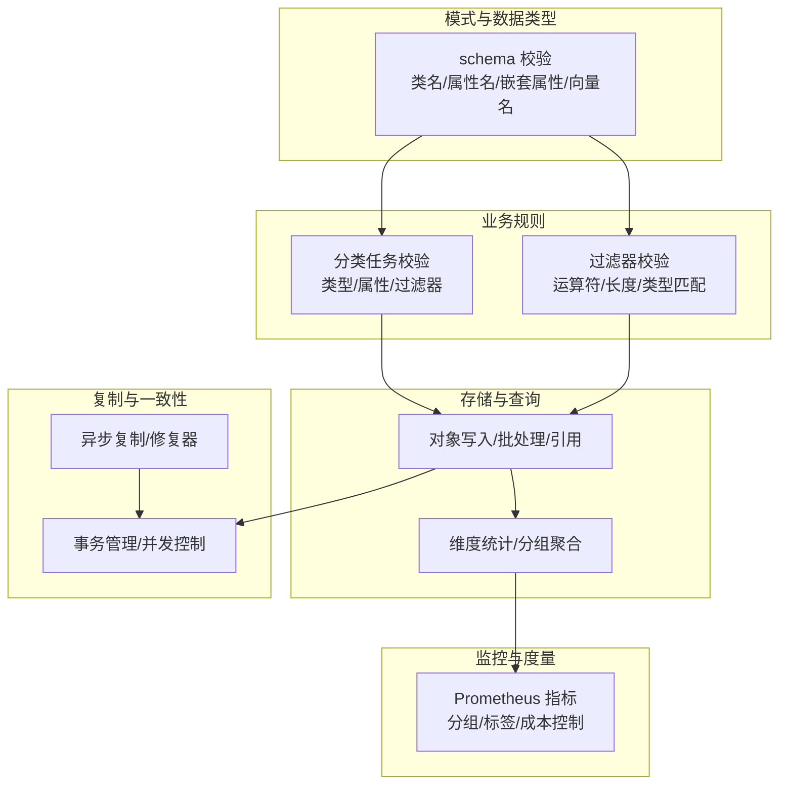
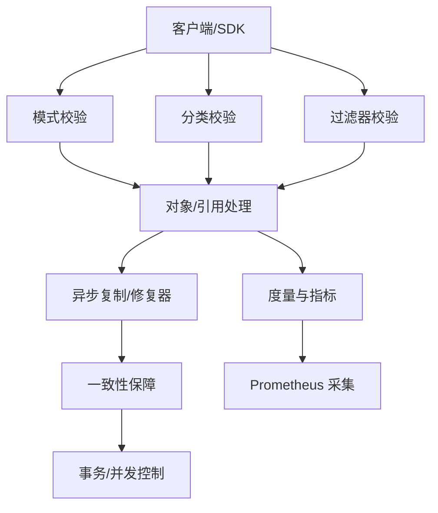
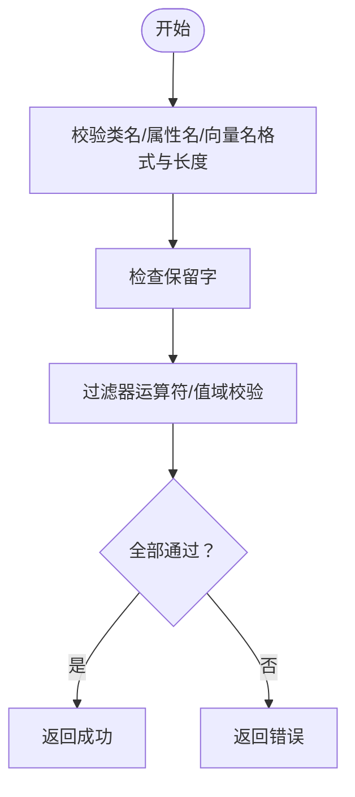
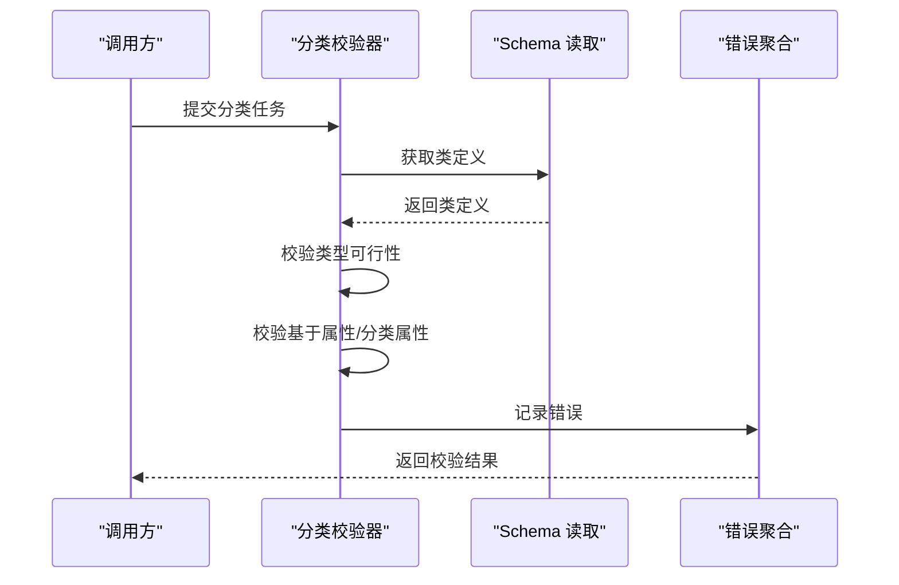
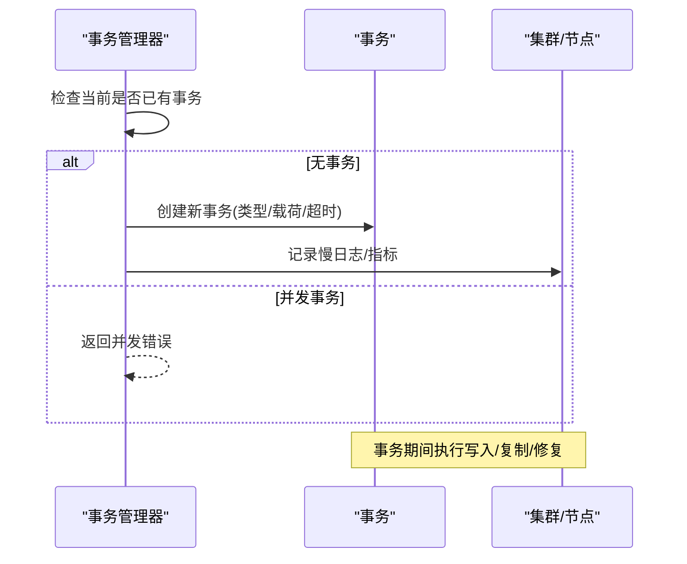
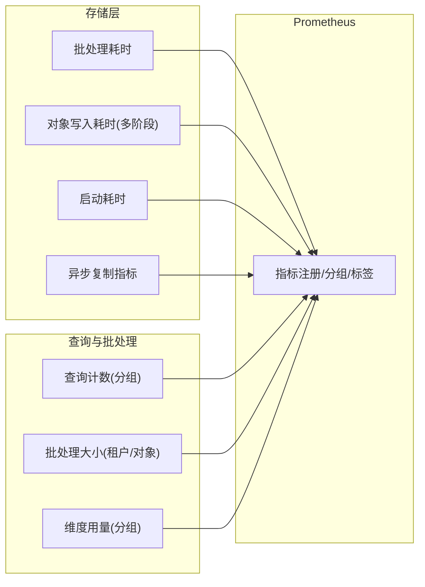
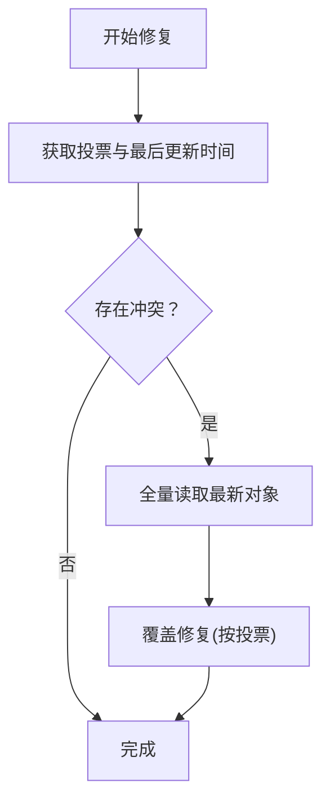
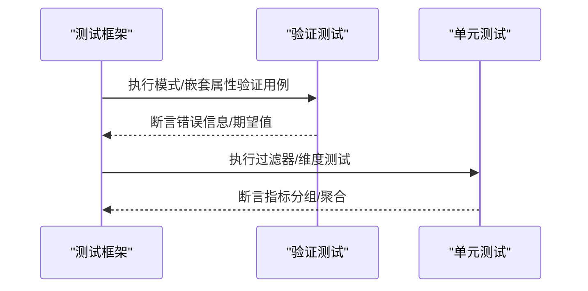
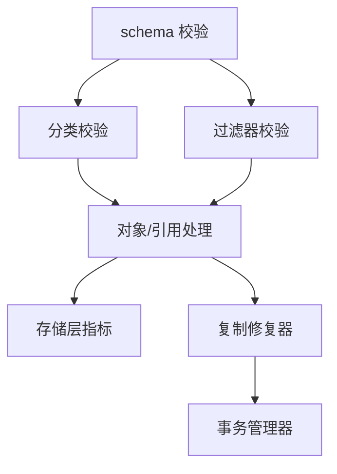

# 数据质量保证

<cite>
**本文引用的文件**
- [entities/schema/validation.go](file://entities/schema/validation.go)
- [usecases/schema/validation_test.go](file://usecases/schema/validation_test.go)
- [usecases/classification/validation.go](file://usecases/classification/validation.go)
- [adapters/repos/db/metrics.go](file://adapters/repos/db/metrics.go)
- [usecases/objects/metrics.go](file://usecases/objects/metrics.go)
- [docs/metrics.md](file://docs/metrics.md)
- [usecases/replica/repairer.go](file://usecases/replica/repairer.go)
- [usecases/cluster/transactions_write.go](file://usecases/cluster/transactions_write.go)
- [adapters/repos/db/shard_dimension_tracking_test.go](file://adapters/repos/db/shard_dimension_tracking_test.go)
- [entities/filters/filters_validator_test.go](file://entities/filters/filters_validator_test.go)
</cite>

## 目录
1. [引言](#引言)
2. [项目结构](#项目结构)
3. [核心组件](#核心组件)
4. [架构总览](#架构总览)
5. [详细组件分析](#详细组件分析)
6. [依赖关系分析](#依赖关系分析)
7. [性能考量](#性能考量)
8. [故障排查指南](#故障排查指南)
9. [结论](#结论)
10. [附录](#附录)

## 引言
本指南面向数据工程师与质量保证团队，系统梳理 Weaviate 在数据质量保证方面的验证机制、完整性与一致性保障、监控体系、修复与清理工具、以及测试与自动化策略。内容覆盖输入验证、格式检查、业务规则校验、主键/外键与参照完整性、事务与并发控制、冲突解决、指标采集与异常检测、质量报告生成、批量修复与清洗流程，并提供可操作的测试方法与最佳实践。

## 项目结构
Weaviate 的数据质量相关能力主要分布在以下层次：
- 模式与数据类型层：类名、属性名、嵌套属性、目标向量名等命名与格式校验
- 业务规则层：分类任务参数、过滤器、属性配置等规则校验
- 存储与查询层：对象写入、引用、批处理、维度统计等
- 监控与度量层：Prometheus 指标定义与采集、分组与聚合策略
- 复制与一致性层：异步复制、修复器、事务管理、并发控制与冲突解决

**章节来源**
- [entities/schema/validation.go](file://entities/schema/validation.go#L1-L188)
- [usecases/classification/validation.go](file://usecases/classification/validation.go#L1-L199)
- [adapters/repos/db/metrics.go](file://adapters/repos/db/metrics.go#L1-L753)
- [usecases/objects/metrics.go](file://usecases/objects/metrics.go#L1-L211)
- [docs/metrics.md](file://docs/metrics.md#L1-L39)

## 核心组件
- 命名与格式验证：确保类名、属性名、嵌套属性名、目标向量名符合正则与长度限制，禁止保留字
- 业务规则验证：分类任务类型可行性、属性类型与引用目标校验、过滤器运算符与值域合法性
- 存储与批处理：对象写入、引用增删改、批处理大小与耗时观测、维度统计与分组
- 监控与度量：按类/分片分组的指标、异步复制生命周期与传播耗时、查询与批处理耗时直方图
- 复制与一致性：异步复制差异计算与传播、修复器投票与冲突解决、事务开启与超时、并发事务互斥

**章节来源**
- [entities/schema/validation.go](file://entities/schema/validation.go#L56-L187)
- [usecases/classification/validation.go](file://usecases/classification/validation.go#L42-L199)
- [adapters/repos/db/metrics.go](file://adapters/repos/db/metrics.go#L27-L386)
- [usecases/objects/metrics.go](file://usecases/objects/metrics.go#L21-L211)
- [usecases/replica/repairer.go](file://usecases/replica/repairer.go#L101-L294)
- [usecases/cluster/transactions_write.go](file://usecases/cluster/transactions_write.go#L324-L365)

## 架构总览
下图展示数据质量相关模块之间的交互：输入经由模式与业务规则校验后进入存储层，存储层通过度量模块输出指标，复制与一致性模块保障跨节点的数据一致与修复。

**图表来源**
- [entities/schema/validation.go](file://entities/schema/validation.go#L56-L187)
- [usecases/classification/validation.go](file://usecases/classification/validation.go#L42-L199)
- [adapters/repos/db/metrics.go](file://adapters/repos/db/metrics.go#L27-L386)
- [usecases/replica/repairer.go](file://usecases/replica/repairer.go#L101-L294)
- [usecases/cluster/transactions_write.go](file://usecases/cluster/transactions_write.go#L324-L365)

## 详细组件分析

### 输入验证与格式检查
- 类名/别名/租户名/属性名/嵌套属性名/目标向量名的正则与长度限制
- 保留字检测（如 _additional、_id、id）
- 过滤器属性长度、运算符与值域合法性校验

**图表来源**
- [entities/schema/validation.go](file://entities/schema/validation.go#L56-L187)
- [entities/filters/filters_validator_test.go](file://entities/filters/filters_validator_test.go#L89-L290)

**章节来源**
- [entities/schema/validation.go](file://entities/schema/validation.go#L56-L187)
- [entities/filters/filters_validator_test.go](file://entities/filters/filters_validator_test.go#L89-L290)

### 业务规则验证（分类与过滤器）
- 分类任务类型可行性：不同类型的训练/目标过滤器限制
- 属性类型与引用目标：基于属性数据类型与引用目标类数量的约束
- 过滤器运算符与值域：支持的运算符集合、值类型与范围

**图表来源**
- [usecases/classification/validation.go](file://usecases/classification/validation.go#L42-L199)

**章节来源**
- [usecases/classification/validation.go](file://usecases/classification/validation.go#L42-L199)

### 数据完整性与一致性
- 主键/外键与参照完整性：通过模式校验确保命名与保留字合规；引用类型校验确保分类属性为引用类型且目标类数量满足要求
- 事务处理与并发控制：事务管理器防止并发事务、设置超时与慢日志；容忍节点失败的事务用于引导与灾备场景
- 冲突解决：复制修复器基于投票与最后更新时间进行冲突仲裁，必要时全量读取最新状态并覆盖修复

**图表来源**
- [usecases/cluster/transactions_write.go](file://usecases/cluster/transactions_write.go#L324-L365)

**章节来源**
- [usecases/cluster/transactions_write.go](file://usecases/cluster/transactions_write.go#L324-L365)
- [usecases/replica/repairer.go](file://usecases/replica/repairer.go#L101-L294)

### 数据质量监控体系
- 指标类别与使用建议：活跃仪表板、运营、告警、分析、废弃等分类与成本控制原则
- 存储层指标：批处理耗时、对象写入各阶段耗时、启动耗时、异步复制生命周期与传播耗时
- 查询与批处理指标：查询计数、批处理大小、维度用量、按类/分片分组

**图表来源**
- [adapters/repos/db/metrics.go](file://adapters/repos/db/metrics.go#L27-L386)
- [usecases/objects/metrics.go](file://usecases/objects/metrics.go#L21-L211)
- [docs/metrics.md](file://docs/metrics.md#L1-L39)

**章节来源**
- [adapters/repos/db/metrics.go](file://adapters/repos/db/metrics.go#L27-L386)
- [usecases/objects/metrics.go](file://usecases/objects/metrics.go#L21-L211)
- [docs/metrics.md](file://docs/metrics.md#L1-L39)

### 数据修复与清理工具
- 复制修复器：基于投票与最后更新时间进行冲突仲裁，必要时全量读取最新状态并覆盖修复
- 清理流程：删除策略与时序解析、删除对象的覆盖修复、冲突检测与错误返回

**图表来源**
- [usecases/replica/repairer.go](file://usecases/replica/repairer.go#L101-L294)

**章节来源**
- [usecases/replica/repairer.go](file://usecases/replica/repairer.go#L101-L294)

### 数据质量测试与自动化策略
- 模式与嵌套属性验证测试：覆盖空嵌套属性、索引/令牌化限制、引用类型不允许等边界条件
- 过滤器验证测试：属性长度、运算符与值域、文本/数组类型匹配等
- 维度统计与分组测试：验证指标分组与聚合行为

**图表来源**
- [usecases/schema/validation_test.go](file://usecases/schema/validation_test.go#L310-L629)
- [entities/filters/filters_validator_test.go](file://entities/filters/filters_validator_test.go#L89-L290)
- [adapters/repos/db/shard_dimension_tracking_test.go](file://adapters/repos/db/shard_dimension_tracking_test.go#L954-L989)

**章节来源**
- [usecases/schema/validation_test.go](file://usecases/schema/validation_test.go#L310-L629)
- [entities/filters/filters_validator_test.go](file://entities/filters/filters_validator_test.go#L89-L290)
- [adapters/repos/db/shard_dimension_tracking_test.go](file://adapters/repos/db/shard_dimension_tracking_test.go#L954-L989)

## 依赖关系分析
- 模式校验依赖正则与长度常量，禁止保留字
- 分类校验依赖授权读取类定义与数据类型判断
- 存储层指标依赖统一 Prometheus 注册与分组策略
- 复制修复器依赖投票与全量读取，事务管理器提供并发互斥与超时控制

**图表来源**
- [entities/schema/validation.go](file://entities/schema/validation.go#L56-L187)
- [usecases/classification/validation.go](file://usecases/classification/validation.go#L42-L199)
- [adapters/repos/db/metrics.go](file://adapters/repos/db/metrics.go#L27-L386)
- [usecases/replica/repairer.go](file://usecases/replica/repairer.go#L101-L294)
- [usecases/cluster/transactions_write.go](file://usecases/cluster/transactions_write.go#L324-L365)

**章节来源**
- [entities/schema/validation.go](file://entities/schema/validation.go#L56-L187)
- [usecases/classification/validation.go](file://usecases/classification/validation.go#L42-L199)
- [adapters/repos/db/metrics.go](file://adapters/repos/db/metrics.go#L27-L386)
- [usecases/replica/repairer.go](file://usecases/replica/repairer.go#L101-L294)
- [usecases/cluster/transactions_write.go](file://usecases/cluster/transactions_write.go#L324-L365)

## 性能考量
- 指标分组与标签基数控制：通过“n/a”占位与分组开关降低标签基数，避免高基数指标带来的成本压力
- 耗时观测与直方图：批处理、对象写入、查询过滤向量化等关键路径均提供毫秒级直方图观测
- 异步复制生命周期：初始化、迭代、差异计算、传播均有独立计数与耗时观测，便于定位瓶颈

**章节来源**
- [docs/metrics.md](file://docs/metrics.md#L25-L39)
- [adapters/repos/db/metrics.go](file://adapters/repos/db/metrics.go#L25-L386)
- [usecases/objects/metrics.go](file://usecases/objects/metrics.go#L21-L211)

## 故障排查指南
- 并发事务错误：当已有事务存在时拒绝新事务，检查事务生命周期与超时设置
- 复制冲突与修复失败：关注投票结果与最后更新时间，必要时触发全量读取并覆盖修复
- 指标缺失或异常：确认指标注册器与分组开关配置，检查标签是否被过度细分

**章节来源**
- [usecases/cluster/transactions_write.go](file://usecases/cluster/transactions_write.go#L324-L365)
- [usecases/replica/repairer.go](file://usecases/replica/repairer.go#L101-L294)
- [adapters/repos/db/metrics.go](file://adapters/repos/db/metrics.go#L138-L386)

## 结论
Weaviate 的数据质量保证体系以严格的输入与业务规则校验为基础，结合存储层的多阶段耗时观测、复制修复与事务并发控制，形成从“预防—观测—修复—测试”的闭环。通过 Prometheus 指标与测试用例的协同，能够持续提升数据质量的可观测性与稳定性。

## 附录
- 指标权威文档与分类说明参见：[docs/metrics.md](file://docs/metrics.md#L1-L39)
- 模式与嵌套属性验证测试参考：[usecases/schema/validation_test.go](file://usecases/schema/validation_test.go#L310-L629)
- 过滤器验证测试参考：[entities/filters/filters_validator_test.go](file://entities/filters/filters_validator_test.go#L89-L290)
- 维度统计与分组测试参考：[adapters/repos/db/shard_dimension_tracking_test.go](file://adapters/repos/db/shard_dimension_tracking_test.go#L954-L989)