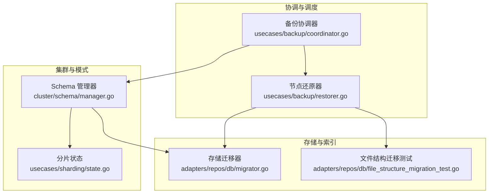
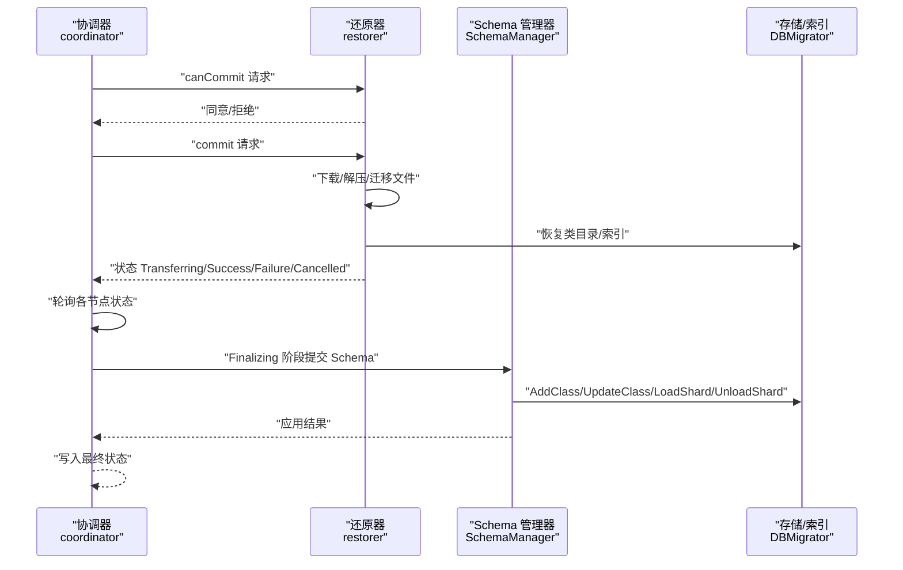
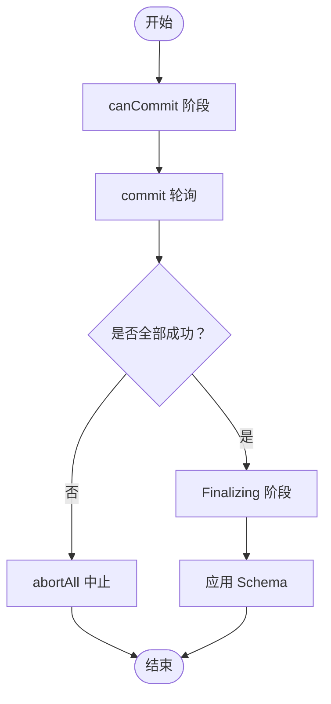
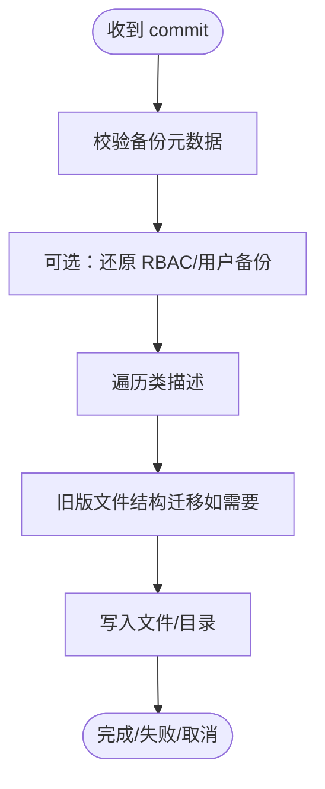
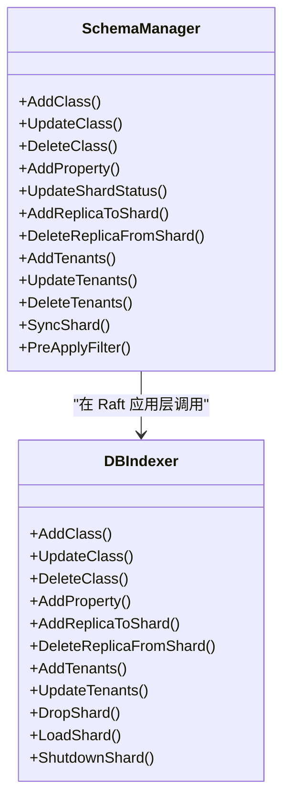
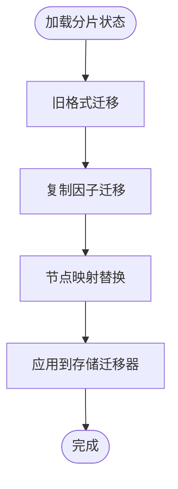
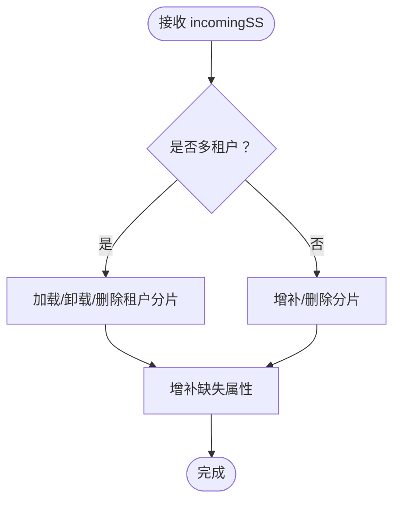
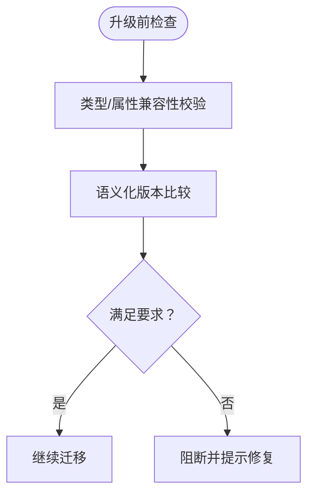
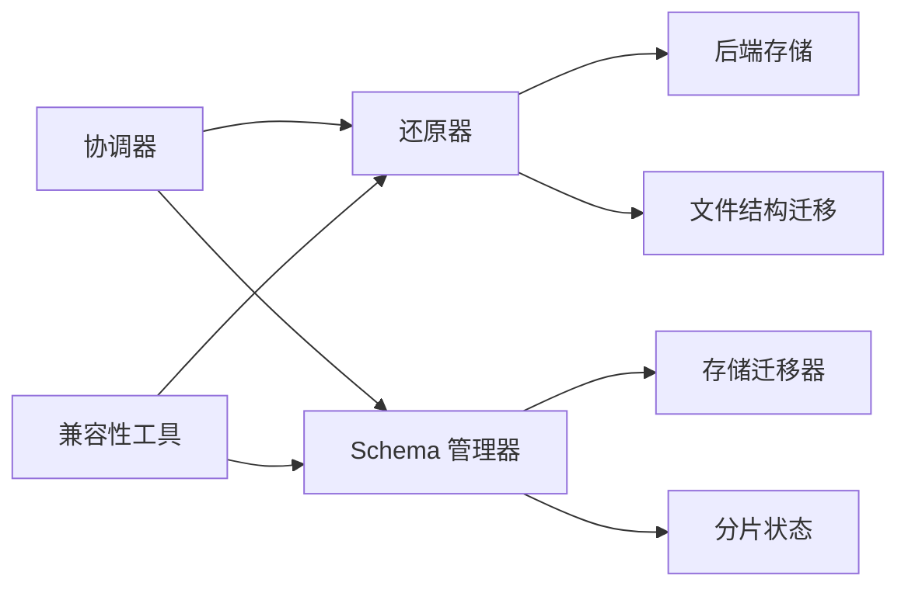

# 数据迁移

<cite>
**本文引用的文件**
- [usecases/backup/coordinator.go](file://usecases/backup/coordinator.go)
- [usecases/backup/restorer.go](file://usecases/backup/restorer.go)
- [cluster/schema/manager.go](file://cluster/schema/manager.go)
- [usecases/sharding/state.go](file://usecases/sharding/state.go)
- [adapters/repos/db/migrator.go](file://adapters/repos/db/migrator.go)
- [entities/schema/backward_compat.go](file://entities/schema/backward_compat.go)
- [adapters/repos/db/file_structure_migration_test.go](file://adapters/repos/db/file_structure_migration_test.go)
- [adapters/repos/db/clusterintegrationtest/backup_coordinator_integration_test.go](file://adapters/repos/db/clusterintegrationtest/backup_coordinator_integration_test.go)
- [adapters/repos/db/clusterintegrationtest/backup_coordinator_integration_override_test.go](file://adapters/repos/db/clusterintegrationtest/backup_coordinator_integration_override_test.go)
- [adapters/handlers/rest/handlers_debug.go](file://adapters/handlers/rest/handlers_debug.go)
- [modules/text2vec-contextionary/client/version_checks.go](file://modules/text2vec-contextionary/client/version_checks.go)
</cite>

## 目录
1. [简介](#简介)
2. [项目结构](#项目结构)
3. [核心组件](#核心组件)
4. [架构总览](#架构总览)
5. [详细组件分析](#详细组件分析)
6. [依赖关系分析](#依赖关系分析)
7. [性能考量](#性能考量)
8. [故障排查指南](#故障排查指南)
9. [结论](#结论)
10. [附录：迁移操作手册](#附录迁移操作手册)

## 简介
本指南面向运维与数据库管理员，系统化阐述 Weaviate 的数据迁移实践，覆盖版本迁移、数据格式转换、索引重建与元数据更新、向后兼容性保障、增量迁移（在线/零停机）、一致性与回滚机制、监控与可观测性，并提供迁移前准备清单与多场景迁移案例。

## 项目结构
Weaviate 的迁移能力由“分布式备份协调器”“节点还原器”“集群模式的 Schema 管理”“分片状态迁移”“底层存储迁移器”等模块协同完成。整体以 Raft 应用层为边界，围绕“分布式备份/恢复”“Schema 应用”“分片状态同步”“底层索引重建/迁移”展开。

图表来源
- [usecases/backup/coordinator.go](file://usecases/backup/coordinator.go#L161-L234)
- [usecases/backup/restorer.go](file://usecases/backup/restorer.go#L65-L145)
- [cluster/schema/manager.go](file://cluster/schema/manager.go#L171-L247)
- [usecases/sharding/state.go](file://usecases/sharding/state.go#L46-L109)
- [adapters/repos/db/migrator.go](file://adapters/repos/db/migrator.go#L288-L384)
- [adapters/repos/db/file_structure_migration_test.go](file://adapters/repos/db/file_structure_migration_test.go#L65-L103)

章节来源
- [usecases/backup/coordinator.go](file://usecases/backup/coordinator.go#L1-L120)
- [usecases/backup/restorer.go](file://usecases/backup/restorer.go#L1-L63)
- [cluster/schema/manager.go](file://cluster/schema/manager.go#L1-L60)
- [usecases/sharding/state.go](file://usecases/sharding/state.go#L1-L44)
- [adapters/repos/db/migrator.go](file://adapters/repos/db/migrator.go#L288-L307)

## 核心组件
- 备份协调器：负责分布式备份/恢复的编排、状态推进、超时与重试、取消与中止、跨节点进度聚合与最终落盘。
- 节点还原器：在单节点上执行文件下载、解压、迁移（如旧版文件结构到层级结构）、类目录恢复、最终通过 Raft 提交到 Schema 层。
- Schema 管理器：在 Raft 层应用 Schema 变更，负责类/属性/分片/租户等的添加、更新、删除与加载/卸载分片。
- 分片状态：提供复制因子迁移、旧格式兼容、节点映射替换、物理/虚拟分片分配等能力。
- 存储迁移器：根据新旧分片状态对底层索引进行增删租户/分片、加载/卸载本地分片、删除多余分片等。
- 向后兼容工具：提供类型/属性/嵌套属性的兼容性判断与默认值迁移，确保升级后差异比较不误报。

章节来源
- [usecases/backup/coordinator.go](file://usecases/backup/coordinator.go#L388-L468)
- [usecases/backup/restorer.go](file://usecases/backup/restorer.go#L147-L204)
- [cluster/schema/manager.go](file://cluster/schema/manager.go#L171-L247)
- [usecases/sharding/state.go](file://usecases/sharding/state.go#L46-L109)
- [adapters/repos/db/migrator.go](file://adapters/repos/db/migrator.go#L288-L384)
- [entities/schema/backward_compat.go](file://entities/schema/backward_compat.go#L27-L83)

## 架构总览
下图展示一次“分布式恢复”的端到端流程：协调器发起 canCommit -> 节点还原器下载/迁移 -> 协调器进入提交轮询 -> 节点进入 Finalizing -> 协调器应用 Schema -> 成功/失败/取消。

图表来源
- [usecases/backup/coordinator.go](file://usecases/backup/coordinator.go#L236-L378)
- [usecases/backup/restorer.go](file://usecases/backup/restorer.go#L65-L145)
- [cluster/schema/manager.go](file://cluster/schema/manager.go#L171-L247)

章节来源
- [usecases/backup/coordinator.go](file://usecases/backup/coordinator.go#L236-L378)
- [usecases/backup/restorer.go](file://usecases/backup/restorer.go#L147-L204)
- [cluster/schema/manager.go](file://cluster/schema/manager.go#L171-L247)

## 详细组件分析

### 组件A：备份协调器（分布式恢复编排）
- 关键职责
  - canCommit 阶段：并行向各节点询问参与意愿，收集节点映射与主机名，构建请求通道。
  - commit 阶段：轮询各节点状态，容忍部分失败或外部取消；聚合节点元信息（预压缩大小）。
  - Finalizing 阶段：仅当所有节点成功“对象存储下载”后，才允许 Schema 应用。
  - 恢复阶段指标：按阶段统计耗时，便于观测恢复瓶颈。
- 错误与回滚
  - 节点超时/失败标记为 Failed 或 Cancelled，并尝试中止未完成的事务。
  - 支持从存储读取取消信号（CANCELLING/CANCELLED），确保跨节点一致。
- 并发与限流
  - 使用带上限的并发组控制节点请求数量，避免资源争用。

图表来源
- [usecases/backup/coordinator.go](file://usecases/backup/coordinator.go#L470-L545)
- [usecases/backup/coordinator.go](file://usecases/backup/coordinator.go#L547-L683)
- [usecases/backup/coordinator.go](file://usecases/backup/coordinator.go#L388-L468)

章节来源
- [usecases/backup/coordinator.go](file://usecases/backup/coordinator.go#L470-L683)

### 组件B：节点还原器（文件迁移与类恢复）
- 关键职责
  - 接收协调器的 commit 请求，执行“对象存储下载 -> 文件写入 -> 迁移（旧版文件结构 -> 层级结构）”。
  - 支持用户/角色备份的还原选项（可选择不还原）。
  - 在每个阶段检查上下文取消，确保可中断。
- 版本兼容
  - 对于低于特定版本的备份，使用“扁平文件结构迁移器”将旧布局迁移到新的层级结构。
- 指标与可观测性
  - 记录每类备份耗时，支持按后端与类标签聚合。

图表来源
- [usecases/backup/restorer.go](file://usecases/backup/restorer.go#L147-L204)
- [usecases/backup/restorer.go](file://usecases/backup/restorer.go#L214-L246)
- [usecases/backup/restorer.go](file://usecases/backup/restorer.go#L299-L347)

章节来源
- [usecases/backup/restorer.go](file://usecases/backup/restorer.go#L147-L204)
- [usecases/backup/restorer.go](file://usecases/backup/restorer.go#L214-L246)
- [usecases/backup/restorer.go](file://usecases/backup/restorer.go#L299-L347)

### 组件C：Schema 管理器（类/分片/租户应用）
- 关键职责
  - 在 Raft 层应用类的添加/更新/删除、属性增删、分片状态变更、副本增删、租户增删与活动状态切换。
  - 在 Finalizing 阶段调用底层存储加载/卸载分片，确保一致性。
- 兼容性
  - 预应用过滤：避免重复类名、别名冲突等问题。
  - 属性默认值迁移：对新增字段设置默认值，避免升级后差异比较误判。

图表来源
- [cluster/schema/manager.go](file://cluster/schema/manager.go#L171-L247)
- [cluster/schema/manager.go](file://cluster/schema/manager.go#L391-L602)

章节来源
- [cluster/schema/manager.go](file://cluster/schema/manager.go#L171-L247)
- [cluster/schema/manager.go](file://cluster/schema/manager.go#L391-L602)

### 组件D：分片状态迁移（复制因子/节点映射/旧格式）
- 关键职责
  - 旧格式迁移：将旧版 BelongsToNode 字段迁移到新版 BelongsToNodes 列表。
  - 复制因子迁移：在未显式设置时推断并统一复制因子，保证一致性。
  - 节点映射：在节点名称变更时批量替换分片归属节点。
- 与存储迁移器配合
  - 根据新旧分片状态决定加载/卸载/删除哪些本地分片。

图表来源
- [usecases/sharding/state.go](file://usecases/sharding/state.go#L46-L109)
- [usecases/sharding/state.go](file://usecases/sharding/state.go#L541-L563)

章节来源
- [usecases/sharding/state.go](file://usecases/sharding/state.go#L46-L109)
- [usecases/sharding/state.go](file://usecases/sharding/state.go#L541-L563)

### 组件E：存储迁移器（索引/分片/租户）
- 关键职责
  - 多租户：根据 incomingSS 加载/卸载租户分片、删除不存在的租户分片。
  - 单租户：根据 incomingSS 增补缺失分片、删除多余分片。
  - 属性迁移：为缺失属性创建索引或更新配置。
- 安全性
  - 删除多余分片前会先检查是否存在，避免误删。

图表来源
- [adapters/repos/db/migrator.go](file://adapters/repos/db/migrator.go#L288-L307)
- [adapters/repos/db/migrator.go](file://adapters/repos/db/migrator.go#L309-L371)

章节来源
- [adapters/repos/db/migrator.go](file://adapters/repos/db/migrator.go#L288-L371)

### 组件F：向后兼容性与版本检查
- 类型/属性兼容：提供类型解析、嵌套属性解析、数组/引用类型判断等工具，确保 schema 解析兼容。
- 版本语义化比较：用于模块/客户端与服务端版本匹配校验，避免不兼容升级。

图表来源
- [entities/schema/backward_compat.go](file://entities/schema/backward_compat.go#L128-L167)
- [modules/text2vec-contextionary/client/version_checks.go](file://modules/text2vec-contextionary/client/version_checks.go#L47-L76)

章节来源
- [entities/schema/backward_compat.go](file://entities/schema/backward_compat.go#L128-L167)
- [modules/text2vec-contextionary/client/version_checks.go](file://modules/text2vec-contextionary/client/version_checks.go#L47-L76)

## 依赖关系分析
- 协调器依赖节点还原器与后端存储，负责跨节点的状态聚合与最终落盘。
- 还原器依赖后端存储与文件写入器，必要时执行旧版文件结构到层级结构的迁移。
- Schema 管理器在 Raft 层应用变更，驱动底层存储加载/卸载分片。
- 分片状态迁移器与存储迁移器紧密协作，确保分片/租户/属性的一致性。
- 向后兼容工具贯穿 schema 解析与版本检查，降低升级风险。

图表来源
- [usecases/backup/coordinator.go](file://usecases/backup/coordinator.go#L161-L234)
- [usecases/backup/restorer.go](file://usecases/backup/restorer.go#L147-L204)
- [cluster/schema/manager.go](file://cluster/schema/manager.go#L171-L247)
- [usecases/sharding/state.go](file://usecases/sharding/state.go#L46-L109)
- [adapters/repos/db/migrator.go](file://adapters/repos/db/migrator.go#L288-L307)
- [entities/schema/backward_compat.go](file://entities/schema/backward_compat.go#L128-L167)

章节来源
- [usecases/backup/coordinator.go](file://usecases/backup/coordinator.go#L161-L234)
- [usecases/backup/restorer.go](file://usecases/backup/restorer.go#L147-L204)
- [cluster/schema/manager.go](file://cluster/schema/manager.go#L171-L247)
- [usecases/sharding/state.go](file://usecases/sharding/state.go#L46-L109)
- [adapters/repos/db/migrator.go](file://adapters/repos/db/migrator.go#L288-L307)
- [entities/schema/backward_compat.go](file://entities/schema/backward_compat.go#L128-L167)

## 性能考量
- 并发与限流：协调器在 canCommit/commit/queryAll 阶段均采用并发组限制最大连接数，避免资源争用。
- 轮询与超时：通过超时与重试周期控制恢复轮询节奏，平衡及时性与稳定性。
- 指标观测：按阶段记录恢复耗时，辅助定位瓶颈（对象存储下载、Schema 应用等）。
- I/O 优化：还原器支持 CPU 百分比池，控制写入并发，避免磁盘 IO 抖动。

章节来源
- [usecases/backup/coordinator.go](file://usecases/backup/coordinator.go#L470-L545)
- [usecases/backup/coordinator.go](file://usecases/backup/coordinator.go#L547-L683)
- [usecases/backup/restorer.go](file://usecases/backup/restorer.go#L147-L204)

## 故障排查指南
- 恢复失败定位
  - 通过协调器状态接口查询当前状态与错误原因，确认是否处于 Failed/Canceled。
  - 检查节点还原器状态映射，定位具体失败节点与错误信息。
- 取消与中止
  - 协调器支持外部取消（存储中标记 CANCELLING/Cancelled），并在轮询阶段检测，确保一致性。
  - 节点还原器在各阶段检查上下文取消，及时返回取消状态。
- 回滚与幂等
  - 协调器在失败时调用 abortAll 中止未完成事务，避免部分应用导致的数据不一致。
  - Schema 管理器的 apply 流程具备幂等特性（多次运行不改变状态），便于安全重试。
- 调试入口
  - 提供调试接口用于触发倒排索引重建、重置迁移标记等，辅助问题复现与验证。

章节来源
- [usecases/backup/coordinator.go](file://usecases/backup/coordinator.go#L388-L468)
- [usecases/backup/restorer.go](file://usecases/backup/restorer.go#L147-L204)
- [adapters/handlers/rest/handlers_debug.go](file://adapters/handlers/rest/handlers_debug.go#L114-L157)

## 结论
Weaviate 的数据迁移以“分布式协调 + 节点还原 + Raft 应用 + 存储迁移”为核心路径，结合分片状态迁移与向后兼容工具，实现了版本升级、架构变更与数据重构的稳健迁移。通过可观测性指标、取消/中止机制与幂等设计，能够在生产环境中实现低风险、可回滚、可监控的迁移实践。

## 附录：迁移操作手册

### 一、迁移前准备
- 备份与验证
  - 执行一次完整备份，验证备份元数据完整性与可恢复性。
  - 在非生产环境先行演练，确认版本兼容与文件结构迁移无误。
- 环境检查
  - 确认集群健康、节点数量满足复制因子要求。
  - 检查磁盘空间与网络带宽，预留恢复期间的峰值需求。
- 风险评估
  - 评估 Schema 变更范围（类/属性/分片/租户），识别潜在不兼容项。
  - 明确回滚策略与数据一致性要求，制定应急预案。

章节来源
- [usecases/backup/coordinator.go](file://usecases/backup/coordinator.go#L161-L234)
- [usecases/backup/restorer.go](file://usecases/backup/restorer.go#L265-L297)

### 二、版本迁移流程
- 步骤概览
  - canCommit：协调器并行询问节点参与意愿，收集节点映射与主机名。
  - 对象存储下载：节点按类下载文件，执行旧版文件结构到层级结构的迁移。
  - 提交轮询：协调器轮询节点状态，聚合元信息，容忍部分失败。
  - Finalizing：节点进入 Finalizing，协调器应用 Schema（加载/卸载分片、增删租户）。
  - 成功/失败/取消：根据最终状态写入存储，记录指标与日志。
- 数据格式转换
  - 旧版备份（<1.23）自动触发文件结构迁移，确保新版本可用。
- 索引重建与元数据更新
  - 存储迁移器根据新分片状态增补/删除分片与租户，更新属性索引。
  - Schema 管理器在 Raft 层应用类与分片变更，驱动底层索引加载/卸载。

章节来源
- [usecases/backup/coordinator.go](file://usecases/backup/coordinator.go#L236-L378)
- [usecases/backup/restorer.go](file://usecases/backup/restorer.go#L147-L204)
- [adapters/repos/db/migrator.go](file://adapters/repos/db/migrator.go#L288-L371)
- [usecases/sharding/state.go](file://usecases/sharding/state.go#L46-L109)

### 三、向后兼容性与功能降级
- 类型/属性兼容
  - 使用兼容性工具解析类型、嵌套属性与数组/引用类型，避免解析错误。
- 默认值迁移
  - 升级后对新增字段设置默认值，避免差异比较误判。
- 版本检查
  - 通过语义化版本比较，确保模块/客户端与服务端版本满足最低要求。

章节来源
- [entities/schema/backward_compat.go](file://entities/schema/backward_compat.go#L128-L167)
- [cluster/schema/manager.go](file://cluster/schema/manager.go#L678-L706)
- [modules/text2vec-contextionary/client/version_checks.go](file://modules/text2vec-contextionary/client/version_checks.go#L47-L76)

### 四、增量迁移（在线/零停机）
- 在线迁移策略
  - 通过分片状态迁移与存储迁移器，按需加载/卸载分片，减少停机窗口。
  - 在 Finalizing 阶段集中应用 Schema，其他阶段保持业务读写。
- 一致性保证
  - 协调器仅在所有节点“对象存储下载成功”后进入 Finalizing，避免部分应用。
  - 节点还原器在各阶段检查取消，确保可中断与可恢复。
- 监控与回滚
  - 通过阶段指标与状态接口持续监控进度，失败时 abortAll 中止未完成事务。
  - 支持从存储读取取消信号，跨节点保持一致。

章节来源
- [usecases/backup/coordinator.go](file://usecases/backup/coordinator.go#L330-L378)
- [usecases/backup/coordinator.go](file://usecases/backup/coordinator.go#L547-L683)
- [usecases/backup/restorer.go](file://usecases/backup/restorer.go#L147-L204)

### 五、迁移监控与回滚机制
- 进度跟踪
  - 协调器按阶段记录耗时，还原器记录每类耗时，便于定位瓶颈。
  - 通过状态接口查询当前状态与错误原因，快速定位失败节点。
- 异常处理
  - 节点超时/失败标记为 Failed 或 Cancelled，协调器调用 abortAll。
  - 支持外部取消（存储中标记 CANCELLING/Cancelled），跨节点一致。
- 失败恢复策略
  - 重试失败节点，容忍部分失败；必要时回滚至备份状态。
  - 幂等的 Schema 应用流程，支持安全重试。

章节来源
- [usecases/backup/coordinator.go](file://usecases/backup/coordinator.go#L388-L468)
- [usecases/backup/coordinator.go](file://usecases/backup/coordinator.go#L547-L683)

### 六、不同场景迁移案例
- 版本升级（1.x → 1.y）
  - 触发文件结构迁移（扁平 → 层级），应用新分片状态，更新属性索引。
- 架构变更（复制因子/节点映射）
  - 分片状态迁移器替换节点映射，存储迁移器增补/删除分片。
- 数据重构（新增租户/属性）
  - Schema 管理器应用新增租户/属性，存储迁移器加载/卸载分片与更新索引。

章节来源
- [usecases/backup/restorer.go](file://usecases/backup/restorer.go#L214-L246)
- [usecases/sharding/state.go](file://usecases/sharding/state.go#L541-L563)
- [adapters/repos/db/migrator.go](file://adapters/repos/db/migrator.go#L288-L371)
- [cluster/schema/manager.go](file://cluster/schema/manager.go#L171-L247)

### 七、集成测试与验证
- 协同恢复集成测试：验证恢复状态查询、成功/失败路径与关闭流程。
- 覆盖桶/路径覆盖测试：验证自定义桶与路径的恢复行为。
- 文件结构迁移测试：验证旧版文件布局到层级结构的迁移正确性。

章节来源
- [adapters/repos/db/clusterintegrationtest/backup_coordinator_integration_test.go](file://adapters/repos/db/clusterintegrationtest/backup_coordinator_integration_test.go#L180-L207)
- [adapters/repos/db/clusterintegrationtest/backup_coordinator_integration_override_test.go](file://adapters/repos/db/clusterintegrationtest/backup_coordinator_integration_override_test.go#L177-L204)
- [adapters/repos/db/file_structure_migration_test.go](file://adapters/repos/db/file_structure_migration_test.go#L65-L103)