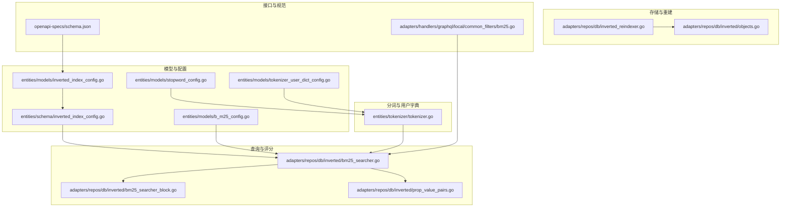
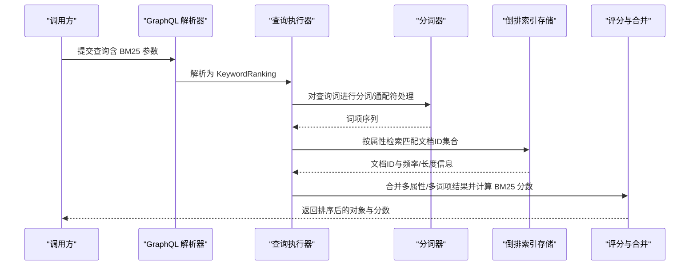
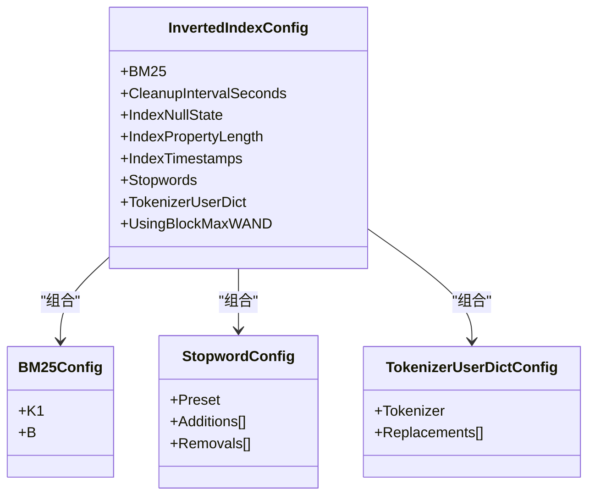
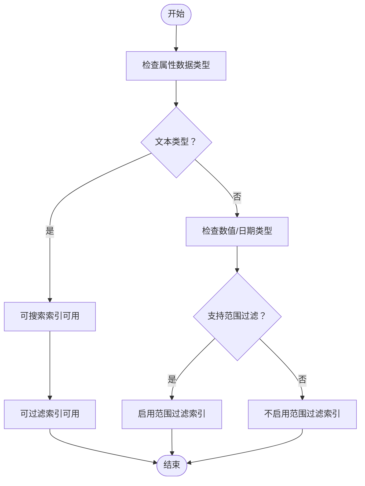
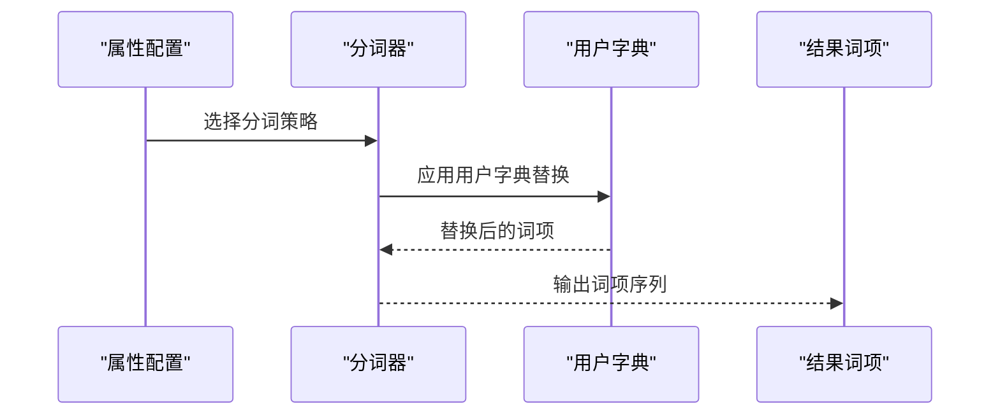
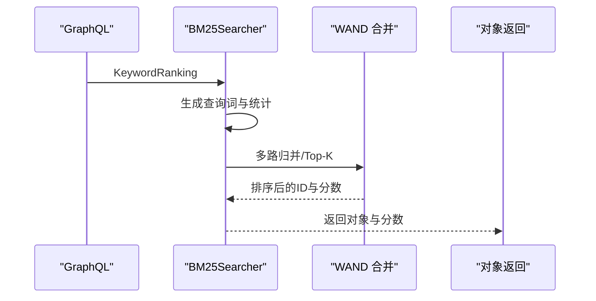
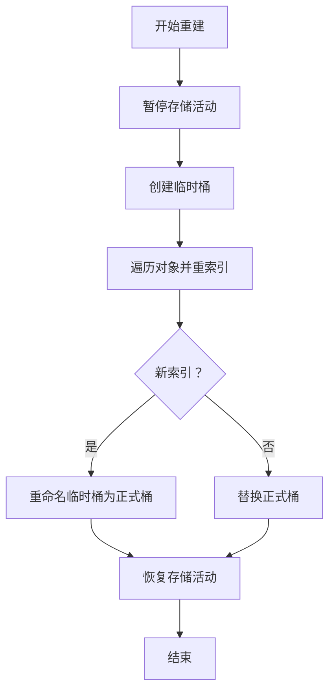
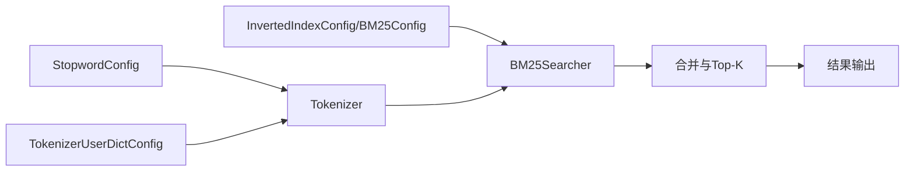

# 倒排索引配置

<cite>
**本文引用的文件**
- [entities/models/inverted_index_config.go](file://entities/models/inverted_index_config.go)
- [entities/schema/inverted_index_config.go](file://entities/schema/inverted_index_config.go)
- [entities/models/b_m25_config.go](file://entities/models/b_m25_config.go)
- [entities/models/stopword_config.go](file://entities/models/stopword_config.go)
- [entities/models/tokenizer_user_dict_config.go](file://entities/models/tokenizer_user_dict_config.go)
- [adapters/repos/db/inverted_reindexer.go](file://adapters/repos/db/inverted_reindexer.go)
- [adapters/repos/db/inverted/objects.go](file://adapters/repos/db/inverted/objects.go)
- [adapters/repos/db/inverted/bm25_searcher.go](file://adapters/repos/db/inverted/bm25_searcher.go)
- [adapters/repos/db/inverted/bm25_searcher_block.go](file://adapters/repos/db/inverted/bm25_searcher_block.go)
- [adapters/repos/db/inverted/config_test.go](file://adapters/repos/db/inverted/config_test.go)
- [adapters/repos/db/inverted/filters_integration_test.go](file://adapters/repos/db/inverted/filters_integration_test.go)
- [adapters/repos/db/inverted/prop_value_pairs.go](file://adapters/repos/db/inverted/prop_value_pairs.go)
- [adapters/repos/db/search.go](file://adapters/repos/db/search.go)
- [adapters/repos/db/sorter/query_planner.go](file://adapters/repos/db/sorter/query_planner.go)
- [adapters/repos/db/bm25f_test.go](file://adapters/repos/db/bm25f_test.go)
- [adapters/handlers/graphql/local/common_filters/bm25.go](file://adapters/handlers/graphql/local/common_filters/bm25.go)
- [openapi-specs/schema.json](file://openapi-specs/schema.json)
- [entities/tokenizer/tokenizer.go](file://entities/tokenizer/tokenizer.go)
</cite>

## 目录
1. [简介](#简介)
2. [项目结构](#项目结构)
3. [核心组件](#核心组件)
4. [架构总览](#架构总览)
5. [详细组件分析](#详细组件分析)
6. [依赖关系分析](#依赖关系分析)
7. [性能考量](#性能考量)
8. [故障排查指南](#故障排查指南)
9. [结论](#结论)
10. [附录：配置示例与测试参考](#附录配置示例与测试参考)

## 简介
本文件面向 Weaviate 的倒排索引配置，系统性阐述其工作原理、配置项与字段级索引控制，并覆盖分词器（tokenizer）、字符过滤器（charFilter）与令牌过滤器（tokenFilter）的配置要点。同时给出索引重建与迁移策略、性能优化建议以及可复用的配置示例与测试参考路径，帮助开发者在不同业务场景下选择合适的配置以平衡内存占用与查询效率。

## 项目结构
Weaviate 的倒排索引相关实现横跨模型定义、配置转换层、查询执行层与存储层。关键位置如下：
- 模型与配置定义：entities/models 与 entities/schema
- 查询与评分：adapters/repos/db/inverted
- 存储与重建：adapters/repos/db/inverted_reindexer.go
- 分词与用户字典：entities/tokenizer
- GraphQL 查询参数解析：adapters/handlers/graphql/local/common_filters/bm25.go
- OpenAPI 规范：openapi-specs/schema.json

**图表来源**
- [entities/models/inverted_index_config.go](file://entities/models/inverted_index_config.go#L28-L56)
- [entities/schema/inverted_index_config.go](file://entities/schema/inverted_index_config.go#L18-L52)
- [entities/models/b_m25_config.go](file://entities/models/b_m25_config.go#L26-L36)
- [entities/models/stopword_config.go](file://entities/models/stopword_config.go#L26-L39)
- [entities/models/tokenizer_user_dict_config.go](file://entities/models/tokenizer_user_dict_config.go#L29-L39)
- [adapters/repos/db/inverted/bm25_searcher.go](file://adapters/repos/db/inverted/bm25_searcher.go#L239-L448)
- [adapters/repos/db/inverted/bm25_searcher_block.go](file://adapters/repos/db/inverted/bm25_searcher_block.go#L240-L266)
- [adapters/repos/db/inverted/prop_value_pairs.go](file://adapters/repos/db/inverted/prop_value_pairs.go#L126-L172)
- [adapters/repos/db/inverted_reindexer.go](file://adapters/repos/db/inverted_reindexer.go#L75-L192)
- [adapters/repos/db/inverted/objects.go](file://adapters/repos/db/inverted/objects.go#L615-L646)
- [entities/tokenizer/tokenizer.go](file://entities/tokenizer/tokenizer.go#L134-L190)
- [adapters/handlers/graphql/local/common_filters/bm25.go](file://adapters/handlers/graphql/local/common_filters/bm25.go#L60-L91)
- [openapi-specs/schema.json](file://openapi-specs/schema.json#L768-L811)

**章节来源**
- [entities/models/inverted_index_config.go](file://entities/models/inverted_index_config.go#L28-L56)
- [entities/schema/inverted_index_config.go](file://entities/schema/inverted_index_config.go#L18-L52)
- [adapters/repos/db/inverted/bm25_searcher.go](file://adapters/repos/db/inverted/bm25_searcher.go#L239-L448)
- [adapters/repos/db/inverted_reindexer.go](file://adapters/repos/db/inverted_reindexer.go#L75-L192)
- [entities/tokenizer/tokenizer.go](file://entities/tokenizer/tokenizer.go#L134-L190)

## 核心组件
- 倒排索引配置模型：定义 BM25 参数、清理周期、空值/长度/时间戳索引开关、停用词与用户字典等。
- 字段级索引控制：通过属性级别布尔标志控制是否可过滤（filterable）与可搜索（searchable），并支持范围过滤（range filters）。
- 分词与用户字典：提供多种分词策略（如单词、小写、空白、三元组、日/中、韩语等），并支持用户自定义替换规则。
- 查询与评分：基于 BM25 的检索与合并流程，支持 BlockMax WAND 优化。
- 索引重建：提供暂停/恢复存储活动、临时桶构建、批量重索引与桶替换的完整流程。

**章节来源**
- [entities/models/inverted_index_config.go](file://entities/models/inverted_index_config.go#L28-L56)
- [entities/models/b_m25_config.go](file://entities/models/b_m25_config.go#L26-L36)
- [entities/models/stopword_config.go](file://entities/models/stopword_config.go#L26-L39)
- [entities/models/tokenizer_user_dict_config.go](file://entities/models/tokenizer_user_dict_config.go#L29-L39)
- [adapters/repos/db/inverted/objects.go](file://adapters/repos/db/inverted/objects.go#L615-L646)
- [entities/tokenizer/tokenizer.go](file://entities/tokenizer/tokenizer.go#L134-L190)
- [adapters/repos/db/inverted/bm25_searcher.go](file://adapters/repos/db/inverted/bm25_searcher.go#L239-L448)
- [adapters/repos/db/inverted_reindexer.go](file://adapters/repos/db/inverted_reindexer.go#L75-L192)

## 架构总览
倒排索引从“配置—分词—存储—查询—评分”的链路组织，关键交互如下：

**图表来源**
- [adapters/handlers/graphql/local/common_filters/bm25.go](file://adapters/handlers/graphql/local/common_filters/bm25.go#L60-L91)
- [adapters/repos/db/inverted/bm25_searcher.go](file://adapters/repos/db/inverted/bm25_searcher.go#L239-L448)
- [entities/tokenizer/tokenizer.go](file://entities/tokenizer/tokenizer.go#L134-L190)
- [adapters/repos/db/search.go](file://adapters/repos/db/search.go#L68-L82)

## 详细组件分析

### 倒排索引配置模型与校验
- InvertedIndexConfig：包含 BM25、清理间隔、空值/长度/时间戳索引开关、停用词、用户字典与 BlockMax WAND 开关。
- BM25Config：k1、b 参数，分别控制词频缩放与文档长度缩放。
- StopwordConfig：预设语言、新增停用词与移除停用词。
- TokenizerUserDictConfig：为指定分词器（如 kagome 日/韩）提供用户字典替换规则。

**图表来源**
- [entities/models/inverted_index_config.go](file://entities/models/inverted_index_config.go#L28-L56)
- [entities/models/b_m25_config.go](file://entities/models/b_m25_config.go#L26-L36)
- [entities/models/stopword_config.go](file://entities/models/stopword_config.go#L26-L39)
- [entities/models/tokenizer_user_dict_config.go](file://entities/models/tokenizer_user_dict_config.go#L29-L39)

**章节来源**
- [entities/models/inverted_index_config.go](file://entities/models/inverted_index_config.go#L28-L56)
- [entities/models/b_m25_config.go](file://entities/models/b_m25_config.go#L26-L36)
- [entities/models/stopword_config.go](file://entities/models/stopword_config.go#L26-L39)
- [entities/models/tokenizer_user_dict_config.go](file://entities/models/tokenizer_user_dict_config.go#L29-L39)

### 字段级索引控制（可搜索/可过滤/范围过滤）
- 属性级布尔标志决定是否建立对应索引类型：
  - 可过滤（filterable）：用于 where 过滤与聚合。
  - 可搜索（searchable）：用于 BM25 关键词检索。
  - 范围过滤（range filters）：对数值/日期等支持范围查询。
- 内置属性（如内部 ID、时间戳）具有默认行为；可通过全局配置开启额外索引（空值、属性长度）。

**图表来源**
- [adapters/repos/db/inverted/objects.go](file://adapters/repos/db/inverted/objects.go#L615-L646)

**章节来源**
- [adapters/repos/db/inverted/objects.go](file://adapters/repos/db/inverted/objects.go#L615-L646)

### 分词器、字符过滤器与令牌过滤器
- 分词策略：
  - 单词（word）、小写（lowercase）、空白（whitespace）、字段（field）、三元组（trigram）、GSE（日/中）、Kagome（日/韩）。
- 字符过滤器（charFilter）与令牌过滤器（tokenFilter）：
  - 通过用户字典（TokenizerUserDictConfig）在分词前/后进行替换或映射，适用于日/韩语等需要自定义词典的场景。
- 通配符查询：
  - 支持在特定分词模式下保留通配符进行模糊匹配。

**图表来源**
- [entities/tokenizer/tokenizer.go](file://entities/tokenizer/tokenizer.go#L134-L190)
- [entities/models/tokenizer_user_dict_config.go](file://entities/models/tokenizer_user_dict_config.go#L29-L39)

**章节来源**
- [entities/tokenizer/tokenizer.go](file://entities/tokenizer/tokenizer.go#L134-L190)
- [entities/models/tokenizer_user_dict_config.go](file://entities/models/tokenizer_user_dict_config.go#L29-L39)

### 查询与评分（BM25）
- 查询流程：
  - 解析 GraphQL 参数为 KeywordRanking。
  - 对查询词进行分词与去重加权。
  - 并行检索各属性词项，收集候选文档。
  - 使用 BlockMax WAND 或传统 WAND 合并，计算 BM25 分数并排序。
- 性能细节：
  - 平均属性长度回退到安全默认值，避免 NaN/零导致异常。
  - 支持附加解释（AdditionalExplanations）便于调试。

**图表来源**
- [adapters/handlers/graphql/local/common_filters/bm25.go](file://adapters/handlers/graphql/local/common_filters/bm25.go#L60-L91)
- [adapters/repos/db/inverted/bm25_searcher.go](file://adapters/repos/db/inverted/bm25_searcher.go#L239-L448)
- [adapters/repos/db/inverted/bm25_searcher_block.go](file://adapters/repos/db/inverted/bm25_searcher_block.go#L240-L266)

**章节来源**
- [adapters/handlers/graphql/local/common_filters/bm25.go](file://adapters/handlers/graphql/local/common_filters/bm25.go#L60-L91)
- [adapters/repos/db/inverted/bm25_searcher.go](file://adapters/repos/db/inverted/bm25_searcher.go#L239-L448)
- [adapters/repos/db/inverted/bm25_searcher_block.go](file://adapters/repos/db/inverted/bm25_searcher_block.go#L240-L266)

### 索引重建与迁移
- 在线重建（Online Rebuild）：
  - 适用于需要最小停机窗口的场景。流程包括暂停/恢复存储、创建临时桶、批量重索引、替换桶。
- 批量重建（Bulk Rebuild）：
  - 适用于离线或低峰时段的大规模索引重构，可一次性完成全量重索引。
- 任务编排：
  - 通过 ShardInvertedReindexer 统一调度，按属性与索引类型生成目标策略与桶选项。

**图表来源**
- [adapters/repos/db/inverted_reindexer.go](file://adapters/repos/db/inverted_reindexer.go#L75-L192)

**章节来源**
- [adapters/repos/db/inverted_reindexer.go](file://adapters/repos/db/inverted_reindexer.go#L75-L192)

### 字段级索引配置示例与验证
- 示例场景（来自集成测试）：
  - 文本属性仅启用可搜索索引，禁用可过滤索引。
  - 整数属性仅启用可过滤索引，禁用可搜索索引。
  - 其他组合（如同时启用、关闭）亦有覆盖。
- 验证逻辑：
  - 属性索引组合的有效性由 schema 层校验，确保与数据类型兼容。

**章节来源**
- [adapters/repos/db/inverted/filters_integration_test.go](file://adapters/repos/db/inverted/filters_integration_test.go#L1258-L1297)
- [adapters/repos/db/inverted/config_test.go](file://adapters/repos/db/inverted/config_test.go#L35-L58)

## 依赖关系分析
- 配置层与查询层解耦：InvertedIndexConfig 与 BM25Config 作为输入，经查询执行器统一处理。
- 分词器与用户字典：独立于倒排索引存储，但影响词项生成与后续检索。
- 查询合并与并发：通过 goroutine 与错误组并行处理子查询，提升吞吐。

**图表来源**
- [entities/models/inverted_index_config.go](file://entities/models/inverted_index_config.go#L28-L56)
- [entities/models/b_m25_config.go](file://entities/models/b_m25_config.go#L26-L36)
- [entities/models/stopword_config.go](file://entities/models/stopword_config.go#L26-L39)
- [entities/models/tokenizer_user_dict_config.go](file://entities/models/tokenizer_user_dict_config.go#L29-L39)
- [entities/tokenizer/tokenizer.go](file://entities/tokenizer/tokenizer.go#L134-L190)
- [adapters/repos/db/inverted/bm25_searcher.go](file://adapters/repos/db/inverted/bm25_searcher.go#L239-L448)

**章节来源**
- [adapters/repos/db/inverted/prop_value_pairs.go](file://adapters/repos/db/inverted/prop_value_pairs.go#L126-L172)
- [adapters/repos/db/sorter/query_planner.go](file://adapters/repos/db/sorter/query_planner.go#L102-L122)

## 性能考量
- BM25 参数调优
  - k1 控制词频饱和度，过高会放大高频词权重；过低则弱化词频差异。
  - b 控制文档长度归一化程度，更接近 1 时对长文档更友好。
- BlockMax WAND
  - 新建集合默认启用（可在配置中显式控制），显著降低合并成本，提高 Top-K 场景下的吞吐。
- 清理周期
  - 倒排索引异步清理周期可配置，默认每 60 秒一次，可根据写入压力调整。
- 空值/长度索引
  - 空值索引与属性长度索引可减少过滤扫描范围，但会增加写入与存储开销，需按需开启。
- 分词器选择
  - 日/韩语使用 Kagome 并结合用户字典可提升召回；中文可选 GSE；英文默认 word/lowercase 已覆盖多数场景。
- 并发与资源限制
  - 分词器并发受环境变量与全局并发上限约束，避免过度竞争导致抖动。

**章节来源**
- [entities/models/inverted_index_config.go](file://entities/models/inverted_index_config.go#L36-L55)
- [adapters/repos/db/inverted/bm25_searcher.go](file://adapters/repos/db/inverted/bm25_searcher.go#L239-L448)
- [entities/tokenizer/tokenizer.go](file://entities/tokenizer/tokenizer.go#L63-L104)

## 故障排查指南
- BM25 参数非法
  - k1 必须非负；b 必须在 [0, 1] 区间内。校验失败会返回明确错误信息。
- 查询耗时异常
  - 检查是否启用 BlockMax WAND；确认平均属性长度统计正常（若为 NaN/0 将回退到默认值）。
- 重建中断
  - 确认上下文未取消；检查临时桶创建、替换与状态切换是否成功；关注日志中的暂停/恢复步骤。
- 分词器初始化失败
  - 检查环境变量与并发阈值；确认用户字典格式正确且与分词器匹配。

**章节来源**
- [adapters/repos/db/inverted/config_test.go](file://adapters/repos/db/inverted/config_test.go#L35-L58)
- [adapters/repos/db/inverted/bm25_searcher.go](file://adapters/repos/db/inverted/bm25_searcher.go#L227-L237)
- [adapters/repos/db/inverted_reindexer.go](file://adapters/repos/db/inverted_reindexer.go#L194-L230)
- [entities/tokenizer/tokenizer.go](file://entities/tokenizer/tokenizer.go#L305-L348)

## 结论
Weaviate 的倒排索引通过清晰的配置模型、灵活的分词体系与高效的查询合并机制，实现了对多语言、多数据类型的通用支持。合理配置 BM25、BlockMax WAND、清理周期与字段级索引开关，可在保证查询质量的同时控制存储与写入成本。重建流程提供了在线与离线两种策略，满足不同运维场景的需求。

## 附录：配置示例与测试参考
- OpenAPI 规范中的配置字段说明（BM25、停用词、用户字典等）
  - 参考路径：[openapi-specs/schema.json](file://openapi-specs/schema.json#L768-L811)
- BM25 参数对比测试（验证算法一致性）
  - 参考路径：[adapters/repos/db/bm25f_test.go](file://adapters/repos/db/bm25f_test.go#L798-L800)
- 字段级索引组合示例（可搜索/可过滤/范围过滤）
  - 参考路径：[adapters/repos/db/inverted/filters_integration_test.go](file://adapters/repos/db/inverted/filters_integration_test.go#L1258-L1297)
- 倒排索引配置校验（BM25 参数边界）
  - 参考路径：[adapters/repos/db/inverted/config_test.go](file://adapters/repos/db/inverted/config_test.go#L35-L58)