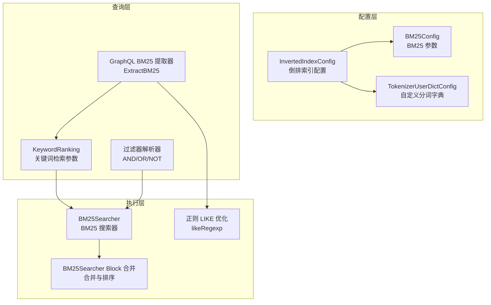
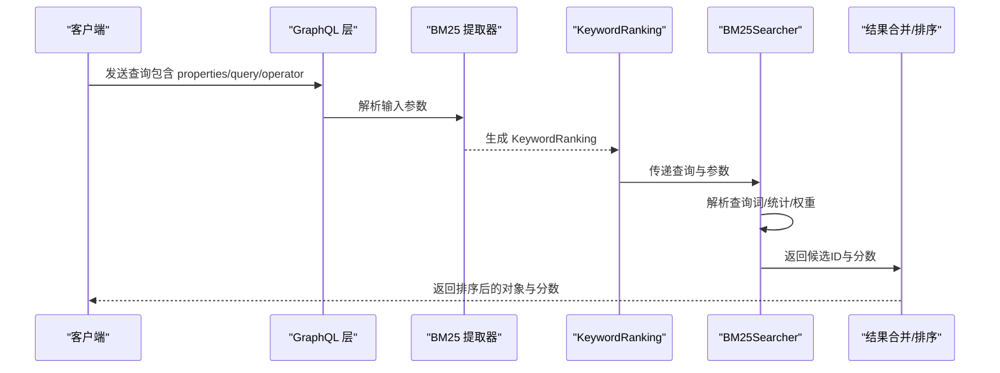
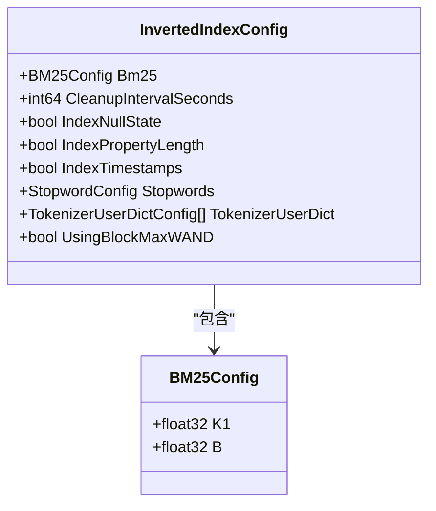
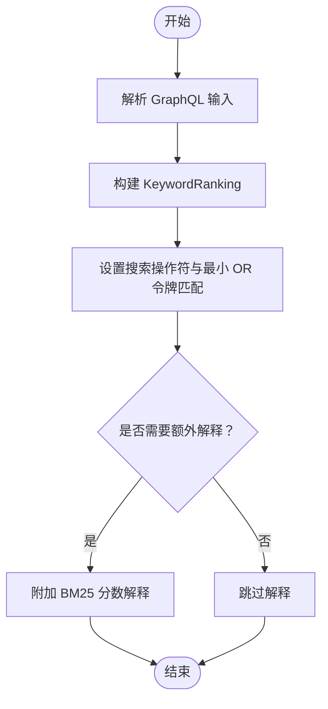
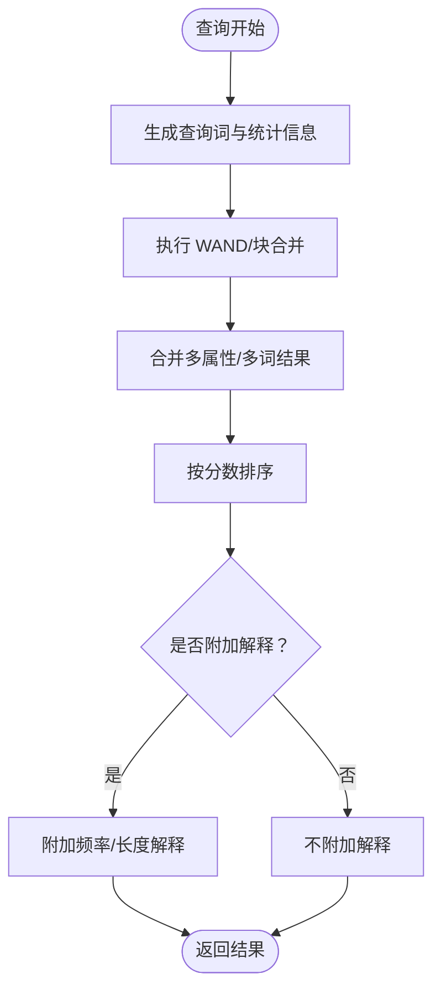
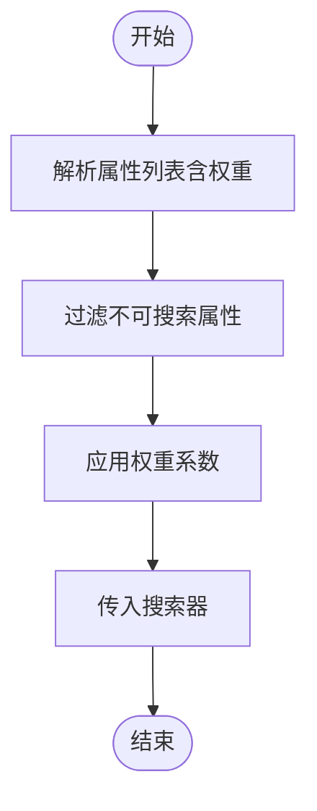
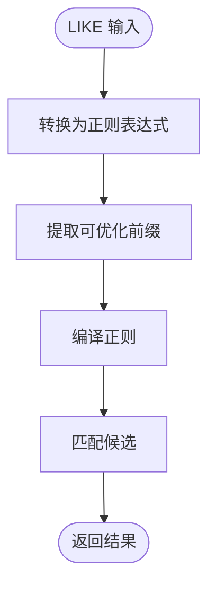
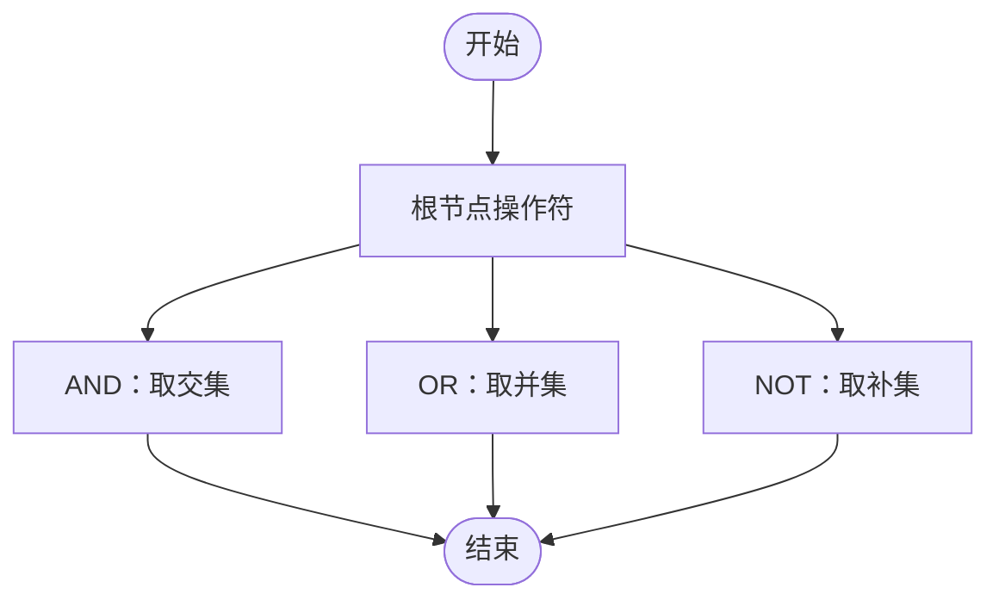
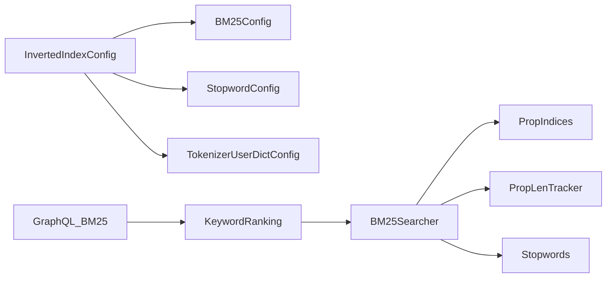

# 全文搜索配置

<cite>
**本文引用的文件**
- [entities/models/b_m25_config.go](file://entities/models/b_m25_config.go)
- [entities/models/inverted_index_config.go](file://entities/models/inverted_index_config.go)
- [adapters/handlers/graphql/local/common_filters/bm25.go](file://adapters/handlers/graphql/local/common_filters/bm25.go)
- [adapters/repos/db/inverted/bm25_searcher.go](file://adapters/repos/db/inverted/bm25_searcher.go)
- [adapters/repos/db/inverted/bm25_searcher_block.go](file://adapters/repos/db/inverted/bm25_searcher_block.go)
- [adapters/repos/db/inverted/config.go](file://adapters/repos/db/inverted/config.go)
- [adapters/repos/db/inverted/like_regexp.go](file://adapters/repos/db/inverted/like_regexp.go)
- [adapters/repos/db/inverted/searcher_integration_test.go](file://adapters/repos/db/inverted/searcher_integration_test.go)
- [adapters/repos/db/bm25f_block_test.go](file://adapters/repos/db/bm25f_block_test.go)
- [adapters/repos/db/bm25f_test.go](file://adapters/repos/db/bm25f_test.go)
- [entities/searchparams/retrieval.go](file://entities/searchparams/retrieval.go)
- [entities/tokenizer/tokenizer_userdict.go](file://entities/tokenizer/tokenizer_userdict.go)
- [example/semantic_search_test.go](file://example/semantic_search_test.go)
</cite>

## 目录
1. [简介](#简介)
2. [项目结构](#项目结构)
3. [核心组件](#核心组件)
4. [架构总览](#架构总览)
5. [详细组件分析](#详细组件分析)
6. [依赖关系分析](#依赖关系分析)
7. [性能考虑](#性能考虑)
8. [故障排查指南](#故障排查指南)
9. [结论](#结论)
10. [附录](#附录)

## 简介
本指南面向需要在 Weaviate 中配置与优化全文搜索的开发者，重点围绕 BM25 算法参数、字段权重、查询构建（通配符、短语、模糊）、过滤器组合（AND/OR/NOT）以及性能优化（预计算相关性与查询缓存）展开，并提供可复现的查询示例与评分对比思路，帮助理解不同配置对搜索结果质量的影响。

## 项目结构
Weaviate 的全文搜索能力由“倒排索引配置”“BM25 搜索器”“GraphQL 查询提取器”“过滤器解析器”等多个模块协同实现。下图展示与全文搜索配置直接相关的模块与文件：

**图表来源**
- [entities/models/inverted_index_config.go](file://entities/models/inverted_index_config.go#L31-L56)
- [entities/models/b_m25_config.go](file://entities/models/b_m25_config.go#L26-L36)
- [adapters/handlers/graphql/local/common_filters/bm25.go](file://adapters/handlers/graphql/local/common_filters/bm25.go#L60-L91)
- [entities/searchparams/retrieval.go](file://entities/searchparams/retrieval.go#L32-L39)
- [adapters/repos/db/inverted/bm25_searcher.go](file://adapters/repos/db/inverted/bm25_searcher.go#L46-L86)
- [adapters/repos/db/inverted/bm25_searcher_block.go](file://adapters/repos/db/inverted/bm25_searcher_block.go#L240-L266)
- [adapters/repos/db/inverted/like_regexp.go](file://adapters/repos/db/inverted/like_regexp.go#L27-L46)

**章节来源**
- [entities/models/inverted_index_config.go](file://entities/models/inverted_index_config.go#L28-L56)
- [adapters/handlers/graphql/local/common_filters/bm25.go](file://adapters/handlers/graphql/local/common_filters/bm25.go#L60-L91)

## 核心组件
- BM25 算法参数
  - k1：控制词频饱和度，越大越抑制高频词影响，提升长文档与短查询的平衡。
  - b：控制文档长度归一化强度，越大越强调长度归一化效果。
- 字段权重
  - 在属性名后追加“^权重系数”，例如 “title^2”。权重越高，该字段对最终相关性贡献越大。
- 查询构建
  - 支持通配符 LIKE（? 单字符、* 多字符），支持最小前缀优化；支持短语搜索（双引号）与模糊匹配（取决于分词器与停用词配置）。
- 过滤器组合
  - AND、OR、NOT 可在 WHERE 子句中组合使用，形成允许集/禁止集的交并补运算。
- 性能优化
  - BlockMax WAND 查询执行开关；可开启额外分数解释以辅助调参；合理设置最小 OR 令牌匹配数以减少候选集。

**章节来源**
- [entities/models/b_m25_config.go](file://entities/models/b_m25_config.go#L26-L36)
- [adapters/repos/db/bm25f_block_test.go](file://adapters/repos/db/bm25f_block_test.go#L641-L663)
- [adapters/repos/db/inverted/like_regexp.go](file://adapters/repos/db/inverted/like_regexp.go#L27-L46)
- [adapters/repos/db/inverted/searcher_integration_test.go](file://adapters/repos/db/inverted/searcher_integration_test.go#L466-L504)
- [adapters/handlers/graphql/local/common_filters/bm25.go](file://adapters/handlers/graphql/local/common_filters/bm25.go#L81-L88)

## 架构总览
下图展示从 GraphQL 到 BM25 执行的整体流程：

**图表来源**
- [adapters/handlers/graphql/local/common_filters/bm25.go](file://adapters/handlers/graphql/local/common_filters/bm25.go#L60-L91)
- [entities/searchparams/retrieval.go](file://entities/searchparams/retrieval.go#L32-L39)
- [adapters/repos/db/inverted/bm25_searcher.go](file://adapters/repos/db/inverted/bm25_searcher.go#L239-L448)
- [adapters/repos/db/inverted/bm25_searcher_block.go](file://adapters/repos/db/inverted/bm25_searcher_block.go#L240-L266)

## 详细组件分析

### 组件 A：BM25 参数与倒排索引配置
- 关键点
  - BM25Config 提供 k1、b 两个参数，默认值见模型注释。
  - InvertedIndexConfig 封装了倒排索引整体配置，包含 BM25、清理间隔、是否索引空状态/属性长度/时间戳、停用词、用户自定义分词字典、BlockMax WAND 开关等。
  - 配置校验函数会验证 BM25、停用词与用户字典配置的有效性。
- 实战建议
  - 对于短查询场景，适当提高 k1 以增强词频敏感度；对于长文档场景，提高 b 以更好归一化长度差异。
  - 若查询规模大且延迟敏感，启用 BlockMax WAND 并结合最小 OR 令牌匹配数降低候选集。

**图表来源**
- [entities/models/b_m25_config.go](file://entities/models/b_m25_config.go#L26-L36)
- [entities/models/inverted_index_config.go](file://entities/models/inverted_index_config.go#L31-L56)

**章节来源**
- [entities/models/b_m25_config.go](file://entities/models/b_m25_config.go#L26-L36)
- [entities/models/inverted_index_config.go](file://entities/models/inverted_index_config.go#L28-L56)
- [adapters/repos/db/inverted/config.go](file://adapters/repos/db/inverted/config.go#L27-L48)

### 组件 B：GraphQL 到 BM25 的参数映射
- 关键点
  - ExtractBM25 将 GraphQL 输入映射为 KeywordRanking，支持 properties、query、searchOperator（含 minimumOrTokensMatch）。
  - 支持 additionalExplanations，便于调试评分构成。
- 实战建议
  - 当需要短语/精确匹配时，确保查询词被正确分词；必要时使用双引号或调整分词器。
  - 使用 additionalExplanations 查看每个查询词在各属性上的频率与属性长度，辅助权重调优。

**图表来源**
- [adapters/handlers/graphql/local/common_filters/bm25.go](file://adapters/handlers/graphql/local/common_filters/bm25.go#L60-L91)
- [entities/searchparams/retrieval.go](file://entities/searchparams/retrieval.go#L32-L39)

**章节来源**
- [adapters/handlers/graphql/local/common_filters/bm25.go](file://adapters/handlers/graphql/local/common_filters/bm25.go#L60-L91)
- [entities/searchparams/retrieval.go](file://entities/searchparams/retrieval.go#L32-L39)

### 组件 C：BM25 搜索器与结果合并
- 关键点
  - BM25Searcher 负责生成查询词、统计信息、属性平均长度、属性权重等，随后执行 WAND 或块级合并。
  - combineResults 负责将多属性/多查询词的结果合并、去重、排序，并可选附加分数解释。
- 实战建议
  - 合理设置 minimumOrTokensMatch，避免 OR 条件导致候选集过大。
  - 使用 additionalExplanations 观察“频率/属性长度”对分数的贡献，据此微调权重与 k1/b。

**图表来源**
- [adapters/repos/db/inverted/bm25_searcher.go](file://adapters/repos/db/inverted/bm25_searcher.go#L239-L448)
- [adapters/repos/db/inverted/bm25_searcher_block.go](file://adapters/repos/db/inverted/bm25_searcher_block.go#L240-L266)

**章节来源**
- [adapters/repos/db/inverted/bm25_searcher.go](file://adapters/repos/db/inverted/bm25_searcher.go#L239-L448)
- [adapters/repos/db/inverted/bm25_searcher_block.go](file://adapters/repos/db/inverted/bm25_searcher_block.go#L240-L266)

### 组件 D：字段权重与属性选择
- 关键点
  - 属性权重通过“属性名^权重系数”声明，如 “title^2”。
  - ChooseSearchableProperties 会过滤不可搜索的属性（仅文本/文本数组默认可搜索）。
  - 测试用例展示了不同权重下的排序变化，可用于对比验证。
- 实战建议
  - 对关键字段（如标题）适当提高权重；对冗余字段降低权重。
  - 使用 PropertyHasSearchableIndex 验证属性是否参与搜索索引。

**图表来源**
- [entities/searchparams/retrieval.go](file://entities/searchparams/retrieval.go#L82-L94)
- [adapters/repos/db/bm25f_block_test.go](file://adapters/repos/db/bm25f_block_test.go#L641-L663)
- [adapters/repos/db/bm25f_test.go](file://adapters/repos/db/bm25f_test.go#L924-L940)

**章节来源**
- [entities/searchparams/retrieval.go](file://entities/searchparams/retrieval.go#L82-L94)
- [adapters/repos/db/bm25f_block_test.go](file://adapters/repos/db/bm25f_block_test.go#L641-L663)
- [adapters/repos/db/bm25f_test.go](file://adapters/repos/db/bm25f_test.go#L924-L940)

### 组件 E：LIKE 通配符与短语/模糊匹配
- 关键点
  - LIKE 通配符 ?（单字符）与 *（任意字符）会被转换为正则表达式进行匹配，并对可优化前缀进行最小前缀优化。
  - 短语搜索可通过双引号实现；模糊匹配取决于分词器与停用词策略。
- 实战建议
  - LIKE 仅在必要时使用，优先采用标准 BM25 查询词以获得更佳性能。
  - 对日文/韩文等语言，需配置相应分词器与用户字典。

**图表来源**
- [adapters/repos/db/inverted/like_regexp.go](file://adapters/repos/db/inverted/like_regexp.go#L27-L46)

**章节来源**
- [adapters/repos/db/inverted/like_regexp.go](file://adapters/repos/db/inverted/like_regexp.go#L27-L46)

### 组件 F：过滤器组合（AND/OR/NOT）
- 关键点
  - 支持在 WHERE 子句中使用 AND、OR、NOT 组合，形成允许/禁止集合的交并补。
  - 测试用例覆盖了不同集合间的 AND/OR/NOT 场景，可作为行为参考。
- 实战建议
  - 尽量将高选择性的条件放在前面，减少后续过滤范围。
  - 复杂过滤器建议拆分为多个简单条件，便于维护与性能评估。

**图表来源**
- [adapters/repos/db/inverted/searcher_integration_test.go](file://adapters/repos/db/inverted/searcher_integration_test.go#L466-L504)

**章节来源**
- [adapters/repos/db/inverted/searcher_integration_test.go](file://adapters/repos/db/inverted/searcher_integration_test.go#L466-L504)

### 组件 G：自定义分词字典与停用词
- 关键点
  - 支持为特定类配置用户自定义分词字典，用于替换/规范化词汇。
  - 配置校验会检查重复源词、空源词等问题。
- 实战建议
  - 仅在必要时添加自定义字典，避免过度干预分词导致召回下降。
  - 与停用词策略配合使用，平衡召回与精度。

**章节来源**
- [entities/tokenizer/tokenizer_userdict.go](file://entities/tokenizer/tokenizer_userdict.go#L23-L34)
- [adapters/repos/db/inverted/config.go](file://adapters/repos/db/inverted/config.go#L185-L218)

## 依赖关系分析
- 配置依赖
  - InvertedIndexConfig 依赖 BM25Config、StopwordConfig、TokenizerUserDictConfig。
  - ValidateConfig 对上述子配置进行一致性与合法性校验。
- 查询依赖
  - GraphQL BM25 提取器依赖 KeywordRanking，后者驱动 BM25Searcher。
  - BM25Searcher 依赖属性索引、属性长度追踪器、停用词检测器等。

**图表来源**
- [entities/models/inverted_index_config.go](file://entities/models/inverted_index_config.go#L31-L56)
- [adapters/handlers/graphql/local/common_filters/bm25.go](file://adapters/handlers/graphql/local/common_filters/bm25.go#L60-L91)
- [adapters/repos/db/inverted/bm25_searcher.go](file://adapters/repos/db/inverted/bm25_searcher.go#L46-L86)

**章节来源**
- [entities/models/inverted_index_config.go](file://entities/models/inverted_index_config.go#L28-L56)
- [adapters/handlers/graphql/local/common_filters/bm25.go](file://adapters/handlers/graphql/local/common_filters/bm25.go#L60-L91)
- [adapters/repos/db/inverted/bm25_searcher.go](file://adapters/repos/db/inverted/bm25_searcher.go#L46-L86)

## 性能考虑
- BlockMax WAND
  - 通过开关控制是否使用 BlockMax WAND 优化查询执行，适合大规模集合与复杂查询。
- 最小 OR 令牌匹配
  - 通过 minimumOrTokensMatch 控制 OR 条件下至少需要满足的令牌数量，减少候选集。
- 额外分数解释
  - 启用 additionalExplanations 可输出每个查询词在各属性上的频率与属性长度，辅助调参与性能分析。
- 缓存与预计算
  - 建议结合业务场景对热点查询结果进行缓存；对常用属性长度统计进行预计算，减少运行时开销。

[本节为通用指导，无需列出具体文件来源]

## 故障排查指南
- 配置校验失败
  - 检查 BM25、停用词、用户字典配置是否符合约束（如重复源词、空源词、不支持的分词器类型）。
- LIKE 表达式异常
  - 确认通配符使用是否正确；检查最小前缀优化是否生效。
- 过滤器结果异常
  - 检查 AND/OR/NOT 组合逻辑与属性类型是否匹配；确认允许/禁止集合大小与预期一致。
- 相关性评分不符合预期
  - 使用 additionalExplanations 查看频率与属性长度对分数的贡献；调整权重与 k1/b。

**章节来源**
- [adapters/repos/db/inverted/config.go](file://adapters/repos/db/inverted/config.go#L185-L218)
- [adapters/repos/db/inverted/like_regexp.go](file://adapters/repos/db/inverted/like_regexp.go#L27-L46)
- [adapters/repos/db/inverted/searcher_integration_test.go](file://adapters/repos/db/inverted/searcher_integration_test.go#L466-L504)
- [adapters/repos/db/inverted/bm25_searcher.go](file://adapters/repos/db/inverted/bm25_searcher.go#L428-L443)

## 结论
通过合理配置 BM25 参数（k1/b）、字段权重（^系数）、查询构建（LIKE/短语/模糊）与过滤器组合（AND/OR/NOT），并结合 BlockMax WAND、最小 OR 令牌匹配与额外分数解释，可在 Weaviate 中实现高质量且高性能的全文搜索。建议以测试用例为基准，逐步调整参数并对比评分与排序，持续优化搜索体验。

[本节为总结性内容，无需列出具体文件来源]

## 附录

### 实际查询示例与评分对比思路
- 示例路径
  - GraphQL 混合搜索示例（包含 BM25 关键词与向量融合）：[example/semantic_search_test.go](file://example/semantic_search_test.go#L118-L156)
  - BM25F 不同参数与权重对比测试（权重提升与排序变化）：[adapters/repos/db/bm25f_block_test.go](file://adapters/repos/db/bm25f_block_test.go#L641-L663)
- 评分对比步骤
  - 固定查询词与属性，分别调整 k1/b 与字段权重，记录前 N 条结果的分数与排序。
  - 使用 additionalExplanations 观察频率与属性长度对分数的贡献，定位权重不足或饱和度问题。
  - 对比启用/关闭 BlockMax WAND 的延迟与吞吐，选择适合生产环境的配置。

**章节来源**
- [example/semantic_search_test.go](file://example/semantic_search_test.go#L118-L156)
- [adapters/repos/db/bm25f_block_test.go](file://adapters/repos/db/bm25f_block_test.go#L641-L663)
- [adapters/repos/db/inverted/bm25_searcher.go](file://adapters/repos/db/inverted/bm25_searcher.go#L428-L443)