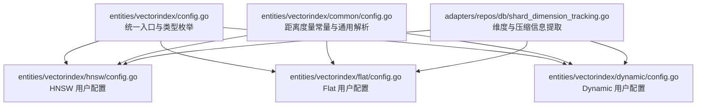
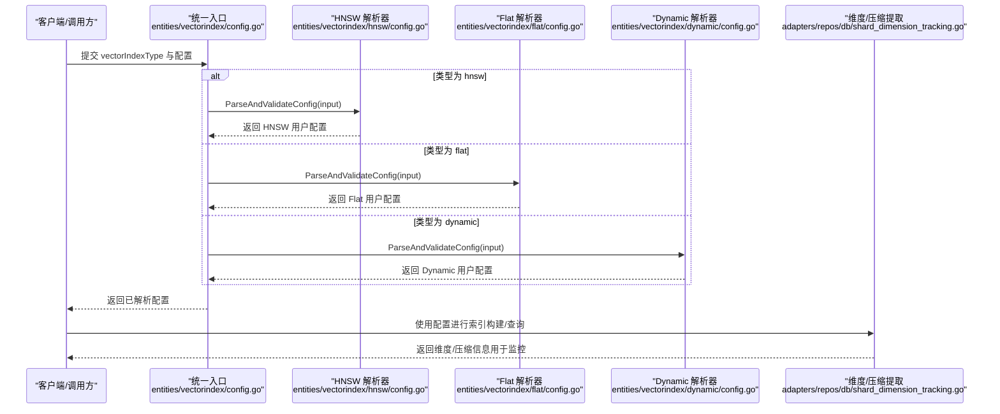
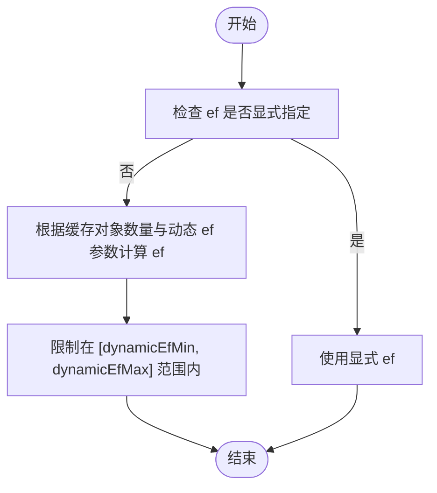
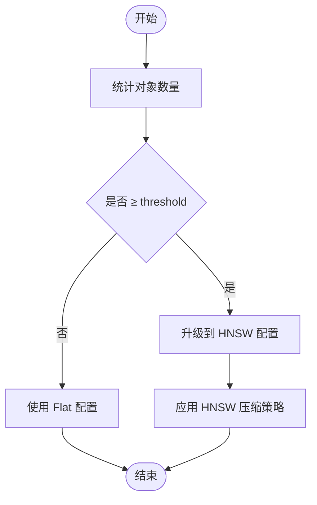
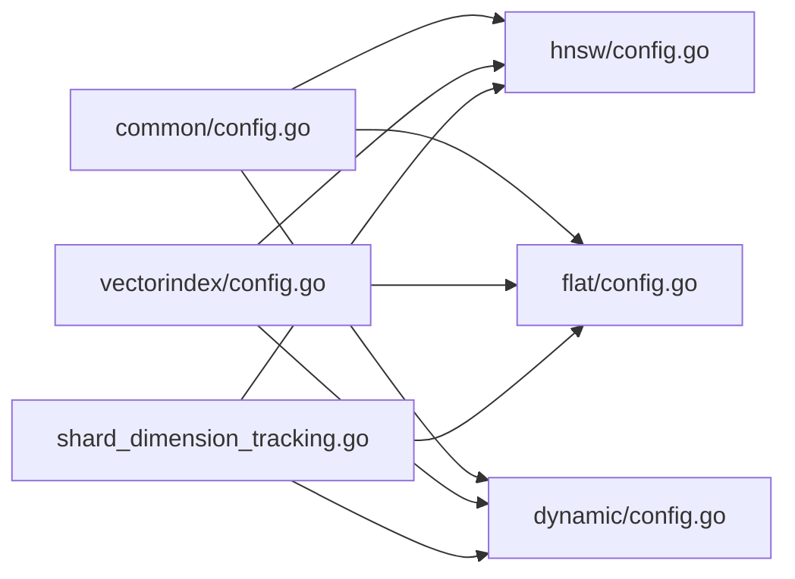

# 向量索引配置

<cite>
**本文引用的文件**
- [entities/vectorindex/config.go](file://entities/vectorindex/config.go)
- [entities/vectorindex/hnsw/config.go](file://entities/vectorindex/hnsw/config.go)
- [entities/vectorindex/flat/config.go](file://entities/vectorindex/flat/config.go)
- [entities/vectorindex/dynamic/config.go](file://entities/vectorindex/dynamic/config.go)
- [entities/vectorindex/common/config.go](file://entities/vectorindex/common/config.go)
- [adapters/repos/db/vector/dynamic/index_test.go](file://adapters/repos/db/vector/dynamic/index_test.go)
- [adapters/repos/db/vector/hnsw/dynamic_ef_test.go](file://adapters/repos/db/vector/hnsw/dynamic_ef_test.go)
- [adapters/repos/db/vector/hnsw/compress_sift_test.go](file://adapters/repos/db/vector/hnsw/compress_sift_test.go)
- [adapters/repos/db/shard_dimension_tracking.go](file://adapters/repos/db/shard_dimension_tracking.go)
</cite>

## 目录
1. [简介](#简介)
2. [项目结构](#项目结构)
3. [核心组件](#核心组件)
4. [架构总览](#架构总览)
5. [详细组件分析](#详细组件分析)
6. [依赖关系分析](#依赖关系分析)
7. [性能考量](#性能考量)
8. [故障排查指南](#故障排查指南)
9. [结论](#结论)
10. [附录](#附录)

## 简介
本技术指南围绕 Weaviate 的向量索引配置展开，系统讲解以下内容：
- HNSW（分层可导航小世界）索引的关键参数：maxConnections（构建时连接数 M）、efConstruction（构建时探索深度）、ef（查询时探索深度）、动态 ef 配置、过滤策略、多向量聚合与默认量化开关等。
- Flat 索引的简单配置与当前支持的压缩能力边界。
- Dynamic 索引的自动切换机制与阈值配置策略。
- 距离度量选择（cosine、l2-squared、dot、manhattan、hamming）对检索精度与性能的影响。
- 向量索引压缩配置：PQ（乘积量化）、SQ（标量量化）、BRQ/RQ（随机化量化）的启用方式与限制。
- 基于仓库内基准测试文件的性能参考（构建耗时、压缩耗时、不同 ef 下召回率变化等），并给出调优建议。

## 项目结构
Weaviate 将向量索引类型抽象为统一入口，并按类型拆分配置解析与校验逻辑：
- 统一入口负责根据索引类型分发到具体子模块进行解析与校验。
- HNSW、Flat、Dynamic 分别定义各自的用户配置结构与默认值。
- 公共模块提供距离度量常量与通用解析工具。
- DB 层提供维度与压缩信息提取，用于指标统计与监控。

图表来源
- [entities/vectorindex/config.go](file://entities/vectorindex/config.go#L32-L51)
- [entities/vectorindex/hnsw/config.go](file://entities/vectorindex/hnsw/config.go#L140-L258)
- [entities/vectorindex/flat/config.go](file://entities/vectorindex/flat/config.go#L88-L130)
- [entities/vectorindex/dynamic/config.go](file://entities/vectorindex/dynamic/config.go#L65-L125)
- [entities/vectorindex/common/config.go](file://entities/vectorindex/common/config.go#L22-L32)
- [adapters/repos/db/shard_dimension_tracking.go](file://adapters/repos/db/shard_dimension_tracking.go#L184-L222)

章节来源
- [entities/vectorindex/config.go](file://entities/vectorindex/config.go#L24-L51)
- [entities/vectorindex/common/config.go](file://entities/vectorindex/common/config.go#L22-L32)

## 核心组件
- 统一入口与类型分发：根据 vectorIndexType 决定使用 HNSW、Flat、Dynamic 或 HFresh 的解析器。
- HNSW 用户配置：包含构建参数（maxConnections、efConstruction）、查询参数（ef、dynamicEfMin/Max/Factor）、缓存与过滤策略、距离度量、压缩配置（PQ/BQ/SQ/RQ）以及多向量配置。
- Flat 用户配置：包含距离度量、缓存上限、压缩配置（BQ/RQ），并明确当前不支持 PQ/SQ。
- Dynamic 用户配置：包含阈值 threshold，以及嵌套的 HNSW 与 Flat 子配置；支持在运行时根据数据规模自动切换。
- 距离度量常量：提供 cosine、l2-squared、dot、manhattan、hamming 等选项。
- 维度与压缩信息提取：从 HNSW/Flat/Dynamic 配置中抽取压缩类别与参数，用于监控与指标统计。

章节来源
- [entities/vectorindex/hnsw/config.go](file://entities/vectorindex/hnsw/config.go#L48-L136)
- [entities/vectorindex/flat/config.go](file://entities/vectorindex/flat/config.go#L43-L84)
- [entities/vectorindex/dynamic/config.go](file://entities/vectorindex/dynamic/config.go#L28-L55)
- [entities/vectorindex/common/config.go](file://entities/vectorindex/common/config.go#L22-L40)
- [adapters/repos/db/shard_dimension_tracking.go](file://adapters/repos/db/shard_dimension_tracking.go#L184-L222)

## 架构总览
下图展示向量索引配置在运行时的解析与校验流程，以及与 DB 层维度/压缩信息提取的关系。

图表来源
- [entities/vectorindex/config.go](file://entities/vectorindex/config.go#L32-L51)
- [entities/vectorindex/hnsw/config.go](file://entities/vectorindex/hnsw/config.go#L140-L258)
- [entities/vectorindex/flat/config.go](file://entities/vectorindex/flat/config.go#L88-L130)
- [entities/vectorindex/dynamic/config.go](file://entities/vectorindex/dynamic/config.go#L65-L125)
- [adapters/repos/db/shard_dimension_tracking.go](file://adapters/repos/db/shard_dimension_tracking.go#L184-L222)

## 详细组件分析

### HNSW 索引：参数与调优
- 关键参数
  - maxConnections（M）：节点最大连接数，默认值与有效范围由校验规则限定。
  - efConstruction：构建阶段的探索深度，默认值与最小值由校验规则限定。
  - ef：查询阶段的探索深度；当 ef=-1 时表示由系统动态决定。
  - dynamicEfMin/Max/Factor：动态 ef 的上下限与因子，用于根据缓存对象数量自适应调整 ef。
  - filterStrategy：过滤策略，支持 sweeping 与 acorn 两种。
  - distance：距离度量，默认 cosine。
  - vectorCacheMaxObjects：向量缓存上限。
  - flatSearchCutoff：当向量数量低于该阈值时采用 Flat 搜索路径。
  - 多向量配置：支持多向量聚合与 Muvera 编码配置。
  - 压缩配置：PQ、BQ、SQ、RQ 可选其一，且存在默认量化与跟踪开关。
- 默认量化与跟踪
  - 支持通过解析默认量化策略为 HNSW 自动启用某类压缩（如 pq/sq/rq-1/rq-8/bq），并可选择跳过默认量化或跟踪默认量化。
- 动态 ef 计算
  - 当 ef=-1 时，系统会基于缓存对象数量与动态 ef 参数计算最终 ef，确保在不同规模下维持查询质量与性能平衡。

图表来源
- [adapters/repos/db/vector/hnsw/dynamic_ef_test.go](file://adapters/repos/db/vector/hnsw/dynamic_ef_test.go#L42-L88)
- [entities/vectorindex/hnsw/config.go](file://entities/vectorindex/hnsw/config.go#L54-L56)
- [entities/vectorindex/hnsw/config.go](file://entities/vectorindex/hnsw/config.go#L245-L255)

章节来源
- [entities/vectorindex/hnsw/config.go](file://entities/vectorindex/hnsw/config.go#L24-L136)
- [entities/vectorindex/hnsw/config.go](file://entities/vectorindex/hnsw/config.go#L140-L258)
- [adapters/repos/db/vector/hnsw/dynamic_ef_test.go](file://adapters/repos/db/vector/hnsw/dynamic_ef_test.go#L42-L88)

### Flat 索引：简单配置与限制
- 关键配置
  - distance：距离度量，默认 cosine。
  - vectorCacheMaxObjects：向量缓存上限。
  - 压缩配置：支持 BQ 与 RQ，RQ 支持 bits=1 或 8；PQ 与 SQ 当前不支持。
  - cache 与 enabled 必须成对使用，否则报错。
- 适用场景
  - 数据规模较小、内存充足时优先考虑 Flat；当数据量超过 flatSearchCutoff 时，HNSW 通常更合适。

章节来源
- [entities/vectorindex/flat/config.go](file://entities/vectorindex/flat/config.go#L43-L130)
- [entities/vectorindex/flat/config.go](file://entities/vectorindex/flat/config.go#L156-L231)

### Dynamic 索引：自动切换机制与策略
- 配置要点
  - threshold：触发升级到 HNSW 的阈值（对象数量）。
  - 嵌套配置：包含 HNSW 与 Flat 的子配置，二者独立生效。
  - 多向量不支持：Dynamic 不支持多向量配置。
- 切换策略
  - 在对象数量达到 threshold 前使用 Flat；超过 threshold 后升级为 HNSW。
  - 升级过程中可配置 HNSW 的压缩策略以优化存储与查询性能。
- 测试用例参考
  - 包含多种从 Flat 到 HNSW 的压缩策略组合（如 BQ->SQ、RQ->PQ 等），验证升级路径与压缩效果。

图表来源
- [entities/vectorindex/dynamic/config.go](file://entities/vectorindex/dynamic/config.go#L28-L55)
- [adapters/repos/db/vector/dynamic/index_test.go](file://adapters/repos/db/vector/dynamic/index_test.go#L407-L463)

章节来源
- [entities/vectorindex/dynamic/config.go](file://entities/vectorindex/dynamic/config.go#L65-L125)
- [adapters/repos/db/vector/dynamic/index_test.go](file://adapters/repos/db/vector/dynamic/index_test.go#L407-L463)

### 距离度量选择与影响
- 支持的距离度量：cosine、l2-squared、dot、manhattan、hamming。
- 影响
  - 精度：不同度量对向量归一化、稀疏性、二值化等特性敏感，直接影响检索排序与召回。
  - 性能：某些度量在硬件/实现上具备更优的计算效率（例如 L2-Squared 在不需要开方时更高效）。
  - 选择建议：文本/图像向量常用 cosine；需要严格距离语义时可考虑 dot 或 l2-squared；二值向量适合 hamming；曼哈顿距离适合特定稀疏场景。

章节来源
- [entities/vectorindex/common/config.go](file://entities/vectorindex/common/config.go#L22-L32)

### 向量索引压缩配置
- HNSW 支持的压缩
  - PQ：可配置 segments、centroids、训练上限、编码器类型与分布等。
  - SQ：可配置训练上限与重打分上限。
  - RQ/BRQ：可配置 bits（1 或 8）与重打分上限。
  - BQ：布尔量化，无额外位宽参数。
  - 注意：同一时间只能启用一种压缩方式；默认量化可通过解析器自动启用。
- Flat 支持的压缩
  - BQ：布尔量化，支持 cache。
  - RQ：支持 bits=1 或 8，支持 cache。
  - PQ/SQ 当前不支持。
- 维度与压缩信息提取
  - DB 层根据配置提取压缩类别（PQ/BQ/SQ/RQ/标准）与相关参数（如 segments、bits），用于监控与指标统计。

章节来源
- [entities/vectorindex/hnsw/config.go](file://entities/vectorindex/hnsw/config.go#L60-L67)
- [entities/vectorindex/flat/config.go](file://entities/vectorindex/flat/config.go#L30-L52)
- [adapters/repos/db/shard_dimension_tracking.go](file://adapters/repos/db/shard_dimension_tracking.go#L184-L222)

## 依赖关系分析
- 统一入口依赖各索引类型的解析器。
- HNSW/Flat/Dynamic 的配置均依赖公共模块提供的距离度量常量与通用解析工具。
- DB 层依赖各索引配置提取维度与压缩信息，用于监控与指标统计。

图表来源
- [entities/vectorindex/common/config.go](file://entities/vectorindex/common/config.go#L22-L40)
- [entities/vectorindex/hnsw/config.go](file://entities/vectorindex/hnsw/config.go#L140-L258)
- [entities/vectorindex/flat/config.go](file://entities/vectorindex/flat/config.go#L88-L130)
- [entities/vectorindex/dynamic/config.go](file://entities/vectorindex/dynamic/config.go#L65-L125)
- [entities/vectorindex/config.go](file://entities/vectorindex/config.go#L32-L51)
- [adapters/repos/db/shard_dimension_tracking.go](file://adapters/repos/db/shard_dimension_tracking.go#L184-L222)

章节来源
- [entities/vectorindex/config.go](file://entities/vectorindex/config.go#L32-L51)
- [entities/vectorindex/common/config.go](file://entities/vectorindex/common/config.go#L22-L40)
- [adapters/repos/db/shard_dimension_tracking.go](file://adapters/repos/db/shard_dimension_tracking.go#L184-L222)

## 性能考量
- HNSW 构建与压缩
  - 构建耗时与 efConstruction、maxConnections 密切相关；较大的 efConstruction 与 M 会提升构建质量但增加时间成本。
  - 压缩（PQ/SQ/RQ）显著降低存储占用并加速查询，但会引入重建/重打分成本；可在数据增长到一定规模后启用。
  - 基准测试文件展示了在不同 ef 下的召回率变化与压缩耗时，可用于指导 ef 与压缩策略的权衡。
- 查询延迟
  - ef 越大，召回越充分但延迟越高；dynamic ef 可在不同规模下自动调节 ef，平衡精度与延迟。
  - flatSearchCutoff 决定何时切换到 HNSW；合理设置可避免 Flat 在大数据下的线性扫描瓶颈。
- Flat 与 Dynamic
  - Flat 在小规模数据下具有较低延迟与简单维护成本；Dynamic 在达到阈值后自动升级到 HNSW，兼顾扩展性与性能。

章节来源
- [adapters/repos/db/vector/hnsw/compress_sift_test.go](file://adapters/repos/db/vector/hnsw/compress_sift_test.go#L72-L577)
- [adapters/repos/db/vector/hnsw/dynamic_ef_test.go](file://adapters/repos/db/vector/hnsw/dynamic_ef_test.go#L42-L88)
- [entities/vectorindex/hnsw/config.go](file://entities/vectorindex/hnsw/config.go#L58-L58)

## 故障排查指南
- 参数校验错误
  - maxConnections、efConstruction 超出允许范围或过滤策略非法会导致校验失败。
- 压缩配置冲突
  - 同时启用多种压缩方式会报错；RQ 的 bits 必须为 1 或 8；启用 cache 必须同时启用对应压缩。
- Dynamic 配置限制
  - Dynamic 不支持多向量配置；threshold 设置需结合数据规模与资源预算。
- 默认量化与跟踪
  - 若启用了默认量化或跳过默认量化，需确保与实际部署策略一致，避免出现意外的压缩行为。

章节来源
- [entities/vectorindex/hnsw/config.go](file://entities/vectorindex/hnsw/config.go#L260-L319)
- [entities/vectorindex/flat/config.go](file://entities/vectorindex/flat/config.go#L194-L231)
- [entities/vectorindex/dynamic/config.go](file://entities/vectorindex/dynamic/config.go#L102-L104)

## 结论
- HNSW 是生产环境的首选索引类型，通过合理设置 M、efConstruction、ef 与动态 ef，可在精度与延迟之间取得良好平衡。
- Flat 适用于小规模数据与低延迟场景，注意其对 PQ/SQ 的不支持限制。
- Dynamic 提供平滑扩展能力，建议结合业务数据规模设定合理的阈值与压缩策略。
- 距离度量应结合向量特性与业务目标选择；cosine 在大多数场景下表现稳健。
- 压缩策略应在构建/升级阶段进行，结合基准测试结果评估 ef 与压缩参数的综合收益。

## 附录
- 常用配置要点速查
  - HNSW：maxConnections、efConstruction、ef/dynamicEfMin/Max/Factor、distance、压缩（PQ/SQ/RQ/BQ）。
  - Flat：distance、vectorCacheMaxObjects、压缩（BQ/RQ）。
  - Dynamic：threshold、HNSW/Flat 子配置、禁用多向量。
- 基准测试参考
  - 压缩耗时与召回率：见 HNSW 压缩基准测试文件中的 ef 与压缩切换段落。
  - 动态 ef 行为：见动态 ef 测试文件中的不同输入与期望输出。

章节来源
- [adapters/repos/db/vector/hnsw/compress_sift_test.go](file://adapters/repos/db/vector/hnsw/compress_sift_test.go#L72-L577)
- [adapters/repos/db/vector/hnsw/dynamic_ef_test.go](file://adapters/repos/db/vector/hnsw/dynamic_ef_test.go#L42-L88)