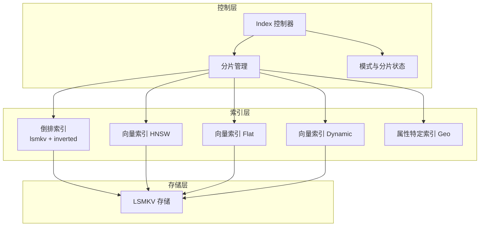
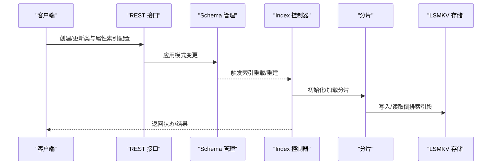
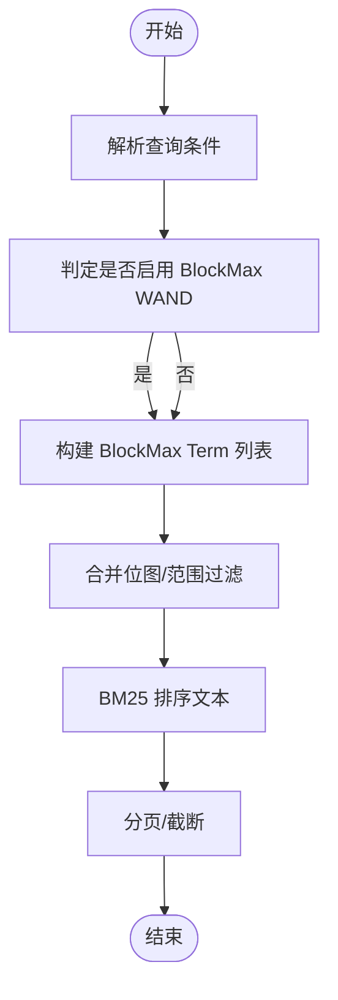
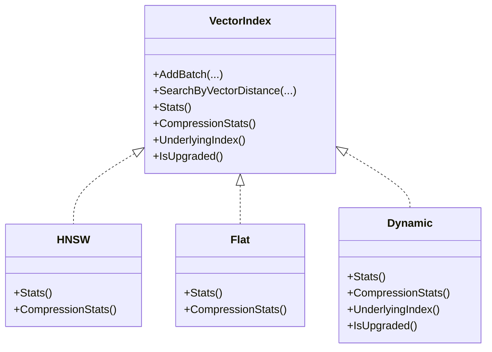
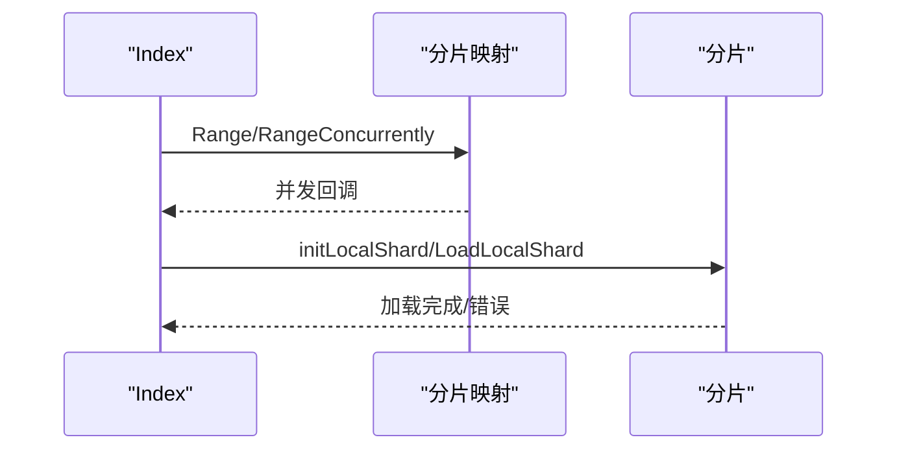
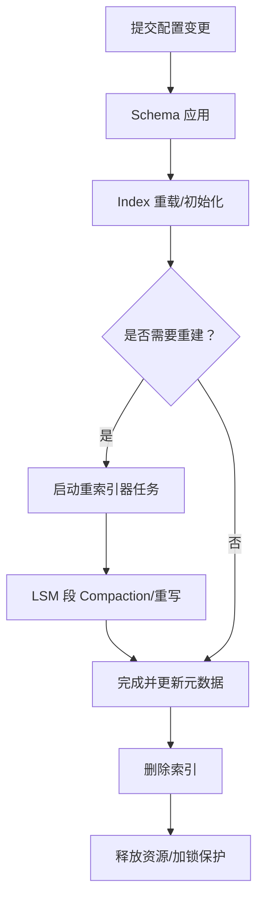
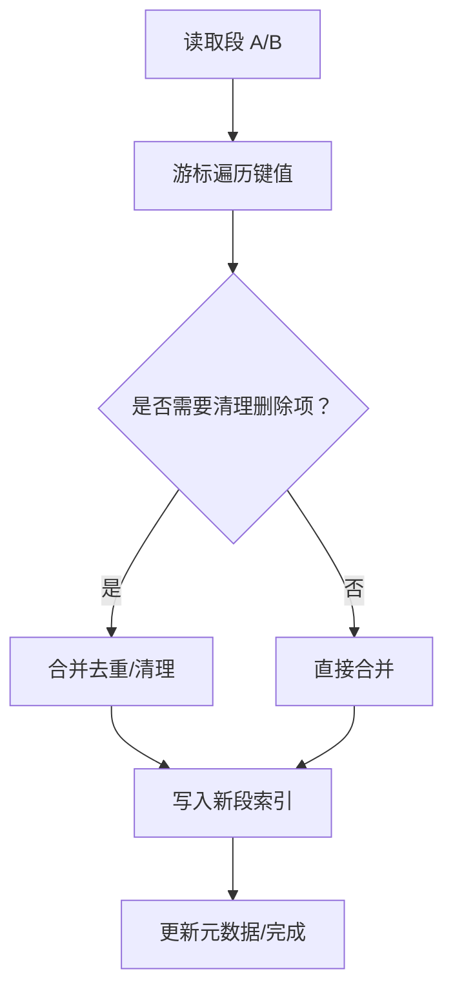
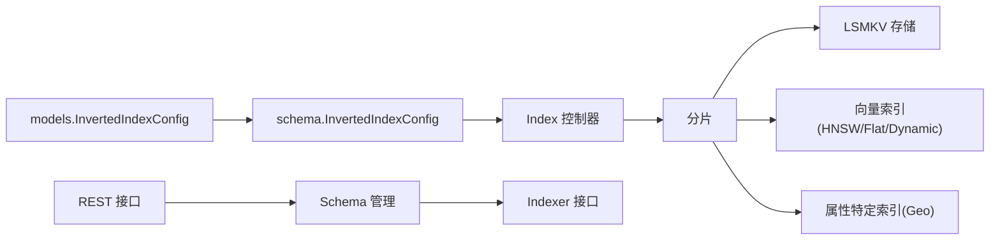

# 复合索引管理

<cite>
**本文引用的文件**
- [adapters/repos/db/index.go](file://adapters/repos/db/index.go)
- [adapters/repos/db/propertyspecific/index.go](file://adapters/repos/db/propertyspecific/index.go)
- [adapters/repos/db/vector/hnsw/index.go](file://adapters/repos/db/vector/hnsw/index.go)
- [adapters/repos/db/vector/flat/index.go](file://adapters/repos/db/vector/flat/index.go)
- [adapters/repos/db/vector/dynamic/index.go](file://adapters/repos/db/vector/dynamic/index.go)
- [adapters/repos/db/inverted/filters_integration_test.go](file://adapters/repos/db/inverted/filters_integration_test.go)
- [adapters/repos/db/inverted_reindexer_v3.go](file://adapters/repos/db/inverted_reindexer_v3.go)
- [adapters/repos/db/inverted_reindexer_map_to_blockmax.go](file://adapters/repos/db/inverted_reindexer_map_to_blockmax.go)
- [adapters/repos/db/lsmkv/compactor_inverted.go](file://adapters/repos/db/lsmkv/compactor_inverted.go)
- [adapters/repos/db/lsmkv/compactor_map.go](file://adapters/repos/db/lsmkv/compactor_map.go)
- [adapters/repos/db/roaringset/compactor.go](file://adapters/repos/db/roaringset/compactor.go)
- [adapters/repos/db/lsmkv/segmentindex/indexes.go](file://adapters/repos/db/lsmkv/segmentindex/indexes.go)
- [adapters/repos/db/shard_dimension_tracking.go](file://adapters/repos/db/shard_dimension_tracking.go)
- [adapters/repos/db/repo.go](file://adapters/repos/db/repo.go)
- [entities/models/inverted_index_config.go](file://entities/models/inverted_index_config.go)
- [entities/schema/inverted_index_config.go](file://entities/schema/inverted_index_config.go)
- [usecases/schema/class.go](file://usecases/schema/class.go)
- [usecases/schema/property_test.go](file://usecases/schema/property_test.go)
- [adapters/handlers/rest/operations/weaviate_api.go](file://adapters/handlers/rest/operations/weaviate_api.go)
- [cluster/schema/types.go](file://cluster/schema/types.go)
</cite>

## 目录
1. [简介](#简介)
2. [项目结构](#项目结构)
3. [核心组件](#核心组件)
4. [架构总览](#架构总览)
5. [详细组件分析](#详细组件分析)
6. [依赖关系分析](#依赖关系分析)
7. [性能考量](#性能考量)
8. [故障排查指南](#故障排查指南)
9. [结论](#结论)
10. [附录](#附录)

## 简介
本文件面向数据库管理员与工程团队，系统性阐述 Weaviate 的复合索引管理能力，覆盖多字段索引的创建与管理、复合搜索条件的索引策略与查询优化、属性特定索引（如地理坐标）的配置方法、分片索引的分布与负载均衡、索引生命周期（创建/更新/删除/重建）、索引维护最佳实践（定期优化、碎片整理、性能监控），以及在复杂查询场景下的应用与不同索引策略的性能对比。

## 项目结构
Weaviate 的索引体系由“倒排索引（文本/过滤/范围）+ 向量索引（HNSW/Flat/Dynamic）+ 属性特定索引（如 Geo）”构成，并通过分片与复制实现水平扩展与高可用。倒排索引与向量索引分别由 LSMKV 存储与向量子系统管理，属性特定索引以独立模块挂载于分片之上。

图示来源
- [adapters/repos/db/index.go](file://adapters/repos/db/index.go#L1-L200)
- [adapters/repos/db/vector/hnsw/index.go](file://adapters/repos/db/vector/hnsw/index.go#L1-L200)
- [adapters/repos/db/vector/flat/index.go](file://adapters/repos/db/vector/flat/index.go#L1-L200)
- [adapters/repos/db/vector/dynamic/index.go](file://adapters/repos/db/vector/dynamic/index.go#L662-L732)

章节来源
- [adapters/repos/db/index.go](file://adapters/repos/db/index.go#L1-L200)

## 核心组件
- 倒排索引与查询优化
  - 支持 BM25、停用词、用户字典、BlockMax WAND 等参数；支持按属性长度、时间戳、空值等维度建立索引。
  - 提供从模型配置到内部配置的转换，确保一致性与可验证性。
- 向量索引
  - HNSW/Flat/Dynamic 三种实现，支持 PQ/BQ/SQ/RQ 压缩与缓存策略，动态切换与统计接口完善。
- 属性特定索引
  - 当前支持 Geo 坐标索引，未来可扩展至单属性向量化。
- 分片与复制
  - Index 维护分片映射，支持懒加载、并发遍历、加载状态判断与远程分片路由。
- 模式与配置
  - 模型层与实体层的倒排索引配置双向转换；属性索引组合校验与默认迁移逻辑。

章节来源
- [entities/models/inverted_index_config.go](file://entities/models/inverted_index_config.go#L28-L56)
- [entities/schema/inverted_index_config.go](file://entities/schema/inverted_index_config.go#L18-L52)
- [adapters/repos/db/vector/hnsw/index.go](file://adapters/repos/db/vector/hnsw/index.go#L44-L200)
- [adapters/repos/db/vector/flat/index.go](file://adapters/repos/db/vector/flat/index.go#L49-L200)
- [adapters/repos/db/vector/dynamic/index.go](file://adapters/repos/db/vector/dynamic/index.go#L662-L732)
- [adapters/repos/db/propertyspecific/index.go](file://adapters/repos/db/propertyspecific/index.go#L22-L59)
- [adapters/repos/db/index.go](file://adapters/repos/db/index.go#L91-L200)
- [usecases/schema/class.go](file://usecases/schema/class.go#L637-L656)

## 架构总览
Weaviate 的索引管理围绕 Index 控制器展开：Index 负责类级配置、分片生命周期、懒加载与并发访问；分片内集成倒排索引（LSMKV + inverted）、向量索引（HNSW/Flat/Dynamic）与属性特定索引（Geo）。模式与分片状态通过集群接口同步，REST 接口提供模式与分片管理操作。

图示来源
- [adapters/handlers/rest/operations/weaviate_api.go](file://adapters/handlers/rest/operations/weaviate_api.go#L1408-L1434)
- [cluster/schema/types.go](file://cluster/schema/types.go#L27-L48)
- [adapters/repos/db/index.go](file://adapters/repos/db/index.go#L2821-L2855)

## 详细组件分析

### 倒排索引与复合搜索策略
- 配置要点
  - BM25 参数、停用词、用户字典、BlockMax WAND、属性长度索引、时间戳索引、空值索引、清理周期等。
  - 属性层面可启用 indexFilterable、indexSearchable、indexRangeFilters，或统一使用 indexInverted 进行迁移。
- 查询优化
  - BlockMax WAND 用于加速布尔/短语检索；BM25 用于文本相似度排序。
  - 属性长度索引可用于范围过滤与排序优化。
- 复合条件
  - 多字段过滤（如数值范围 + 文本匹配）建议优先利用倒排索引的位图集合运算与合并策略，减少全表扫描。
  - 对于高选择性字段优先放前，降低中间结果集规模。

图示来源
- [entities/models/inverted_index_config.go](file://entities/models/inverted_index_config.go#L28-L56)
- [entities/schema/inverted_index_config.go](file://entities/schema/inverted_index_config.go#L18-L52)

章节来源
- [entities/models/inverted_index_config.go](file://entities/models/inverted_index_config.go#L28-L56)
- [entities/schema/inverted_index_config.go](file://entities/schema/inverted_index_config.go#L18-L52)
- [usecases/schema/class.go](file://usecases/schema/class.go#L637-L656)
- [usecases/schema/property_test.go](file://usecases/schema/property_test.go#L626-L659)
- [adapters/repos/db/inverted/filters_integration_test.go](file://adapters/repos/db/inverted/filters_integration_test.go#L1258-L1297)

### 向量索引：HNSW/Flat/Dynamic
- HNSW
  - 支持压缩（PQ/BQ/SQ/RQ）与缓存；提供统计接口与底层指标；支持动态 ef、扁平搜索阈值等参数。
- Flat
  - 支持 BQ/RQ 压缩与缓存；适合中小规模或冷数据；提供量化器与元数据持久化。
- Dynamic
  - 自动在 Flat/HNSW 间切换；暴露 UnderlyingIndex 与压缩统计接口；支持升级状态跟踪。

图示来源
- [adapters/repos/db/vector/hnsw/index.go](file://adapters/repos/db/vector/hnsw/index.go#L44-L200)
- [adapters/repos/db/vector/flat/index.go](file://adapters/repos/db/vector/flat/index.go#L49-L200)
- [adapters/repos/db/vector/dynamic/index.go](file://adapters/repos/db/vector/dynamic/index.go#L662-L732)

章节来源
- [adapters/repos/db/vector/hnsw/index.go](file://adapters/repos/db/vector/hnsw/index.go#L44-L200)
- [adapters/repos/db/vector/flat/index.go](file://adapters/repos/db/vector/flat/index.go#L49-L200)
- [adapters/repos/db/vector/dynamic/index.go](file://adapters/repos/db/vector/dynamic/index.go#L662-L732)
- [adapters/repos/db/shard_dimension_tracking.go](file://adapters/repos/db/shard_dimension_tracking.go#L184-L222)

### 属性特定索引：Geo
- Geo 索引作为属性特定索引的一种，挂载于分片之上，支持按属性名检索与删除。
- 删除时仅支持 Geo 类型属性索引，其他类型会报错提示。

章节来源
- [adapters/repos/db/propertyspecific/index.go](file://adapters/repos/db/propertyspecific/index.go#L22-L59)

### 分片索引的分布与负载均衡
- 分片映射与并发访问
  - Index 内部使用并发 map 管理分片，提供 Range/RangeConcurrently、Loaded/Load 等方法，支持懒加载与并发遍历。
- 加载策略
  - initLocalShard/LoadLocalShard 支持强制加载与隐式加载，避免重复加载与并发冲突。
- 负载均衡
  - 通过分片状态与 BelongsToNodes 字段决定数据归属；结合复制因子与异步复制配置实现高可用与读扩展。

图示来源
- [adapters/repos/db/index.go](file://adapters/repos/db/index.go#L91-L200)
- [adapters/repos/db/index.go](file://adapters/repos/db/index.go#L2821-L2855)

章节来源
- [adapters/repos/db/index.go](file://adapters/repos/db/index.go#L91-L200)
- [adapters/repos/db/index.go](file://adapters/repos/db/index.go#L2821-L2855)

### 索引生命周期管理
- 创建
  - 通过 REST 接口提交类与属性配置，Schema 管理器应用后触发 Index 重载。
- 更新
  - 属性索引组合校验与默认迁移：若仅设置 indexInverted，则自动推导 indexFilterable/indexSearchable/indexRangeFilters；若启用新字段，则覆盖旧字段。
- 删除
  - 通过删除类或禁用索引位实现；DB 层提供 DeleteIndex 流程，加锁保护并释放资源。
- 重建
  - 倒排索引重建通过重索引器（V3/MapToBlockmax）在 LSMKV 层执行，支持在 LSM 初始化前后阶段插入任务，保障一致性。

图示来源
- [usecases/schema/class.go](file://usecases/schema/class.go#L637-L656)
- [adapters/repos/db/repo.go](file://adapters/repos/db/repo.go#L373-L390)
- [adapters/repos/db/inverted_reindexer_v3.go](file://adapters/repos/db/inverted_reindexer_v3.go#L207-L245)
- [adapters/repos/db/inverted_reindexer_map_to_blockmax.go](file://adapters/repos/db/inverted_reindexer_map_to_blockmax.go#L290-L342)

章节来源
- [usecases/schema/class.go](file://usecases/schema/class.go#L637-L656)
- [adapters/repos/db/repo.go](file://adapters/repos/db/repo.go#L373-L390)
- [adapters/repos/db/inverted_reindexer_v3.go](file://adapters/repos/db/inverted_reindexer_v3.go#L207-L245)
- [adapters/repos/db/inverted_reindexer_map_to_blockmax.go](file://adapters/repos/db/inverted_reindexer_map_to_blockmax.go#L290-L342)

### 索引维护与碎片整理
- LSMKV Compaction
  - Inverted/Map Collection/BitMap 等策略在写入新段时进行合并与索引重建，支持清理墓碑、属性长度合并与二次索引写入。
- RoaringSet Compact
  - 通过游标合并左右段，清理删除项与空值，输出新的段索引，减少碎片与提升查询效率。
- 段索引写入策略
  - 根据预期大小与内存分配检查选择内存直写或临时文件写入，平衡性能与内存占用。

图示来源
- [adapters/repos/db/lsmkv/compactor_inverted.go](file://adapters/repos/db/lsmkv/compactor_inverted.go#L115-L450)
- [adapters/repos/db/lsmkv/compactor_map.go](file://adapters/repos/db/lsmkv/compactor_map.go#L265-L295)
- [adapters/repos/db/roaringset/compactor.go](file://adapters/repos/db/roaringset/compactor.go#L322-L376)
- [adapters/repos/db/lsmkv/segmentindex/indexes.go](file://adapters/repos/db/lsmkv/segmentindex/indexes.go#L47-L83)

章节来源
- [adapters/repos/db/lsmkv/compactor_inverted.go](file://adapters/repos/db/lsmkv/compactor_inverted.go#L115-L450)
- [adapters/repos/db/lsmkv/compactor_map.go](file://adapters/repos/db/lsmkv/compactor_map.go#L265-L295)
- [adapters/repos/db/roaringset/compactor.go](file://adapters/repos/db/roaringset/compactor.go#L322-L376)
- [adapters/repos/db/lsmkv/segmentindex/indexes.go](file://adapters/repos/db/lsmkv/segmentindex/indexes.go#L47-L83)

### 复合索引在复杂查询中的应用
- 多字段过滤与排序
  - 结合倒排索引的位图合并与属性长度索引，可高效处理数值范围 + 文本匹配 + 排序的复合查询。
- 向量 + 文本混合检索
  - 先用倒排索引缩小候选集，再在候选集上执行向量检索，显著降低向量计算开销。
- 性能对比建议
  - 小规模/冷数据：Flat + BQ/RQ 压缩。
  - 大规模/热数据：HNSW + PQ/BQ/SQ/RQ 压缩；Dynamic 在数据增长时自动切换。
  - 文本检索：启用 BlockMax WAND 与 BM25；合理设置清理周期与停用词/用户字典。

章节来源
- [adapters/repos/db/vector/hnsw/index.go](file://adapters/repos/db/vector/hnsw/index.go#L44-L200)
- [adapters/repos/db/vector/flat/index.go](file://adapters/repos/db/vector/flat/index.go#L49-L200)
- [adapters/repos/db/vector/dynamic/index.go](file://adapters/repos/db/vector/dynamic/index.go#L662-L732)

## 依赖关系分析
- 模型与实体配置
  - models.InvertedIndexConfig 与 schema.InvertedIndexConfig 双向转换，确保 REST/Schema 层与内部实现一致。
- 控制与执行
  - Index 依赖分片解析器与 Schema Reader，负责分片初始化与懒加载；向量索引通过 LSMKV Store 访问底层段。
- 集群与 REST
  - REST 接口提供模式与分片管理端点；SchemaManager 与 Indexer 接口负责集群内索引更新与回调触发。

图示来源
- [entities/models/inverted_index_config.go](file://entities/models/inverted_index_config.go#L28-L56)
- [entities/schema/inverted_index_config.go](file://entities/schema/inverted_index_config.go#L18-L52)
- [adapters/handlers/rest/operations/weaviate_api.go](file://adapters/handlers/rest/operations/weaviate_api.go#L1408-L1434)
- [cluster/schema/types.go](file://cluster/schema/types.go#L27-L48)

章节来源
- [entities/models/inverted_index_config.go](file://entities/models/inverted_index_config.go#L28-L56)
- [entities/schema/inverted_index_config.go](file://entities/schema/inverted_index_config.go#L18-L52)
- [adapters/handlers/rest/operations/weaviate_api.go](file://adapters/handlers/rest/operations/weaviate_api.go#L1408-L1434)
- [cluster/schema/types.go](file://cluster/schema/types.go#L27-L48)

## 性能考量
- 倒排索引
  - 合理设置 BlockMax WAND 与 BM25 参数；启用属性长度索引以优化范围/排序；定期清理周期避免碎片堆积。
- 向量索引
  - 根据数据规模选择 HNSW/Flat/Dynamic；启用压缩（PQ/BQ/SQ/RQ）与缓存；调整 ef/扁平搜索阈值平衡精度与速度。
- 分片与复制
  - 依据查询热点与写入峰值规划分片数量与副本数；结合懒加载减少启动时内存压力。
- 维护
  - 定期触发重索引与 Compaction；监控段大小与索引写入 I/O；必要时进行碎片整理与元数据校正。

## 故障排查指南
- 倒排索引重建失败
  - 检查重索引器日志与 LSMKV 段写入状态；确认任务在 LSM 初始化前后阶段正确注册。
- 向量索引异常
  - 查看 HNSW/Flat/Dynamic 的统计与压缩统计接口；核对压缩配置与缓存设置；关注重启/升级过程中的元数据一致性。
- 属性特定索引删除报错
  - 确认属性类型为 Geo；非 Geo 类型无法通过 DropAll 删除。
- 分片加载问题
  - 使用 Loaded/Load 方法区分懒加载状态；检查 initLocalShard/LoadLocalShard 的上下文与错误信息。

章节来源
- [adapters/repos/db/inverted_reindexer_v3.go](file://adapters/repos/db/inverted_reindexer_v3.go#L207-L245)
- [adapters/repos/db/inverted_reindexer_map_to_blockmax.go](file://adapters/repos/db/inverted_reindexer_map_to_blockmax.go#L290-L342)
- [adapters/repos/db/propertyspecific/index.go](file://adapters/repos/db/propertyspecific/index.go#L42-L59)
- [adapters/repos/db/index.go](file://adapters/repos/db/index.go#L2821-L2855)

## 结论
Weaviate 的复合索引管理通过“倒排索引 + 向量索引 + 属性特定索引”的协同，结合分片与复制实现高可用与高性能。管理员应基于业务场景选择合适的索引策略（文本/过滤/范围/向量），配合合理的分片分布与定期维护，持续优化查询延迟与吞吐。对于复杂查询，建议采用“倒排先过滤 + 向量后召回”的流水线策略，并根据数据规模与访问模式动态调整压缩与缓存配置。

## 附录
- REST 管理端点
  - 模式与分片管理：/schema、/schema/{className}、/schema/{className}/shards、/schema/{className}/shards/{shardName}
- 关键流程参考路径
  - 倒排索引配置转换：[entities/models/inverted_index_config.go](file://entities/models/inverted_index_config.go#L28-L56)、[entities/schema/inverted_index_config.go](file://entities/schema/inverted_index_config.go#L18-L52)
  - 属性索引组合校验与默认迁移：[usecases/schema/class.go](file://usecases/schema/class.go#L637-L656)
  - 分片懒加载与并发访问：[adapters/repos/db/index.go](file://adapters/repos/db/index.go#L91-L200)、[adapters/repos/db/index.go](file://adapters/repos/db/index.go#L2821-L2855)
  - 向量索引统计与压缩：[adapters/repos/db/vector/hnsw/index.go](file://adapters/repos/db/vector/hnsw/index.go#L44-L200)、[adapters/repos/db/vector/flat/index.go](file://adapters/repos/db/vector/flat/index.go#L49-L200)、[adapters/repos/db/vector/dynamic/index.go](file://adapters/repos/db/vector/dynamic/index.go#L662-L732)
  - 重索引与碎片整理：[adapters/repos/db/inverted_reindexer_v3.go](file://adapters/repos/db/inverted_reindexer_v3.go#L207-L245)、[adapters/repos/db/inverted_reindexer_map_to_blockmax.go](file://adapters/repos/db/inverted_reindexer_map_to_blockmax.go#L290-L342)、[adapters/repos/db/lsmkv/compactor_inverted.go](file://adapters/repos/db/lsmkv/compactor_inverted.go#L115-L450)、[adapters/repos/db/roaringset/compactor.go](file://adapters/repos/db/roaringset/compactor.go#L322-L376)