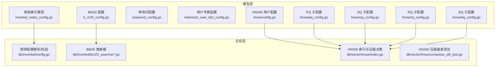
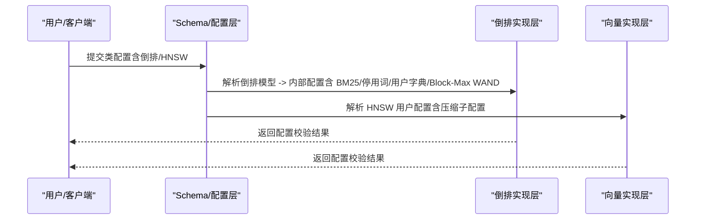
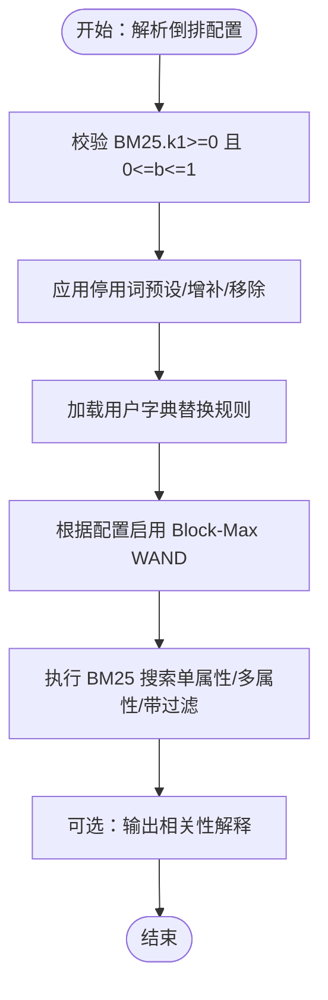
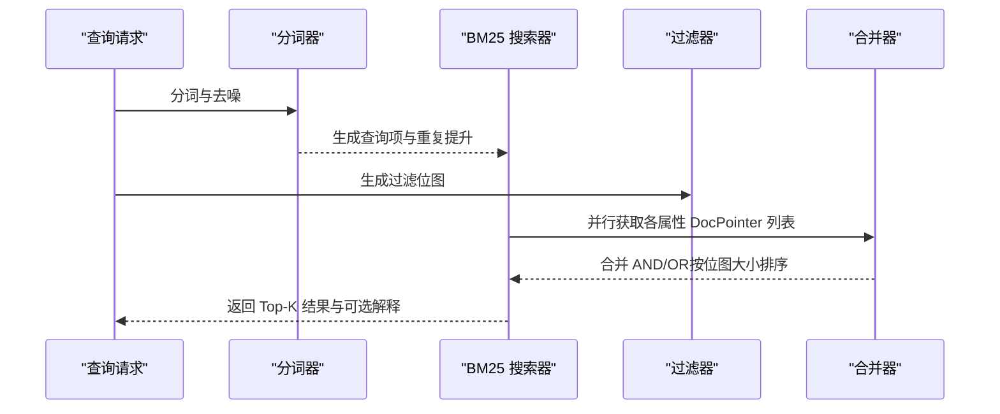
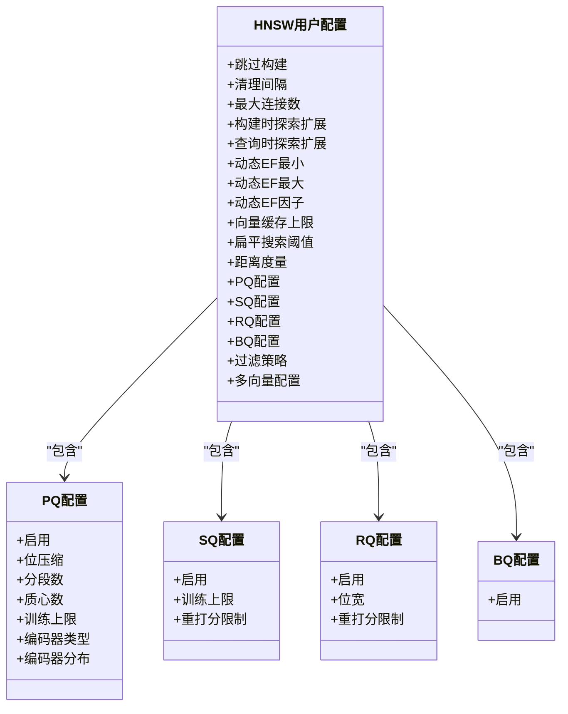
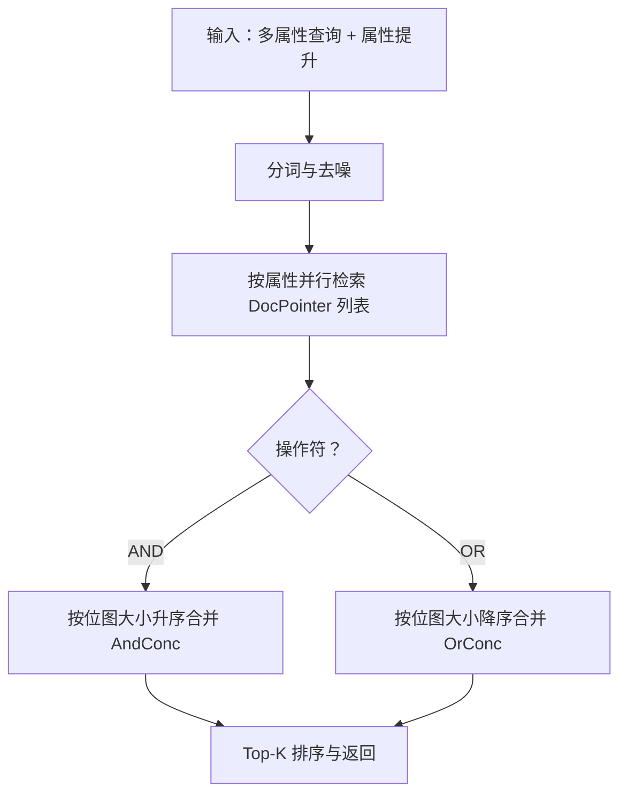
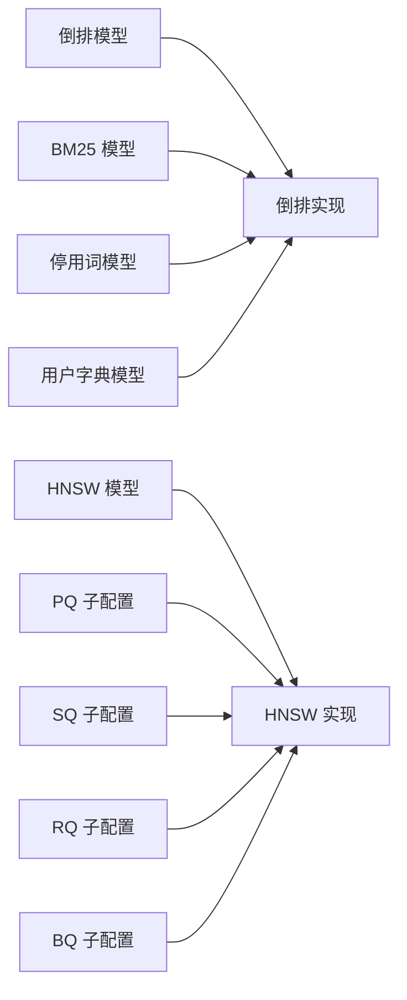

# 索引配置

<cite>
**本文引用的文件**
- [entities/models/inverted_index_config.go](file://entities/models/inverted_index_config.go)
- [adapters/repos/db/inverted/config.go](file://adapters/repos/db/inverted/config.go)
- [adapters/repos/db/inverted/config_test.go](file://adapters/repos/db/inverted/config_test.go)
- [entities/models/b_m25_config.go](file://entities/models/b_m25_config.go)
- [entities/models/stopword_config.go](file://entities/models/stopword_config.go)
- [entities/models/tokenizer_user_dict_config.go](file://entities/models/tokenizer_user_dict_config.go)
- [adapters/repos/db/inverted/bm25_searcher.go](file://adapters/repos/db/inverted/bm25_searcher.go)
- [adapters/repos/db/inverted/bm25_searcher_block.go](file://adapters/repos/db/inverted/bm25_searcher_block.go)
- [adapters/repos/db/inverted/prop_value_pairs.go](file://adapters/repos/db/inverted/prop_value_pairs.go)
- [adapters/repos/db/inverted/merge_benchmarks_test.go](file://adapters/repos/db/inverted/merge_benchmarks_test.go)
- [adapters/repos/db/bm25f_block_test.go](file://adapters/repos/db/bm25f_block_test.go)
- [adapters/repos/db/vector/hnsw/index.go](file://adapters/repos/db/vector/hnsw/index.go)
- [adapters/repos/db/vector/hnsw/compress_sift_test.go](file://adapters/repos/db/vector/hnsw/compress_sift_test.go)
- [entities/vectorindex/hnsw/config.go](file://entities/vectorindex/hnsw/config.go)
- [entities/vectorindex/hnsw/pq_config.go](file://entities/vectorindex/hnsw/pq_config.go)
- [entities/vectorindex/hnsw/sq_config.go](file://entities/vectorindex/hnsw/sq_config.go)
- [entities/vectorindex/hnsw/rq_config.go](file://entities/vectorindex/hnsw/rq_config.go)
- [entities/vectorindex/hnsw/bq_config.go](file://entities/vectorindex/hnsw/bq_config.go)
</cite>

## 目录
1. [简介](#简介)
2. [项目结构](#项目结构)
3. [核心组件](#核心组件)
4. [架构总览](#架构总览)
5. [详细组件分析](#详细组件分析)
6. [依赖关系分析](#依赖关系分析)
7. [性能考量](#性能考量)
8. [故障排查指南](#故障排查指南)
9. [结论](#结论)
10. [附录](#附录)

## 简介
本技术指南聚焦 Weaviate 的索引配置，覆盖三大方向：
- 倒排索引：分词器、停用词、用户字典、BM25 参数与 Block-Max WAND 查询优化
- 向量索引：HNSW 构建参数、动态 EF、距离度量、索引压缩（PQ/SQ/RQ/BQ）
- 全文搜索：BM25F 多字段加权、属性提升、相关性解释与过滤合并策略
同时提供复合索引（多字段）与联合查询优化建议，并给出性能调优与实证对比思路，帮助数据库管理员与性能工程师落地配置。

## 项目结构
Weaviate 将索引配置分为两类模型与实现：
- 模型层：定义 JSON 可序列化配置结构（倒排、BM25、停用词、用户字典；向量 HNSW 及其子配置）
- 实现层：解析、校验、默认值填充、运行时行为（查询、压缩、距离归一化）

**图表来源**
- [entities/models/inverted_index_config.go](file://entities/models/inverted_index_config.go#L42-L56)
- [adapters/repos/db/inverted/config.go](file://adapters/repos/db/inverted/config.go#L53-L88)
- [adapters/repos/db/inverted/bm25_searcher.go](file://adapters/repos/db/inverted/bm25_searcher.go#L468-L519)
- [adapters/repos/db/vector/hnsw/index.go](file://adapters/repos/db/vector/hnsw/index.go#L890-L943)
- [entities/vectorindex/hnsw/config.go](file://entities/vectorindex/hnsw/config.go#L47-L136)

**章节来源**
- [entities/models/inverted_index_config.go](file://entities/models/inverted_index_config.go#L42-L56)
- [adapters/repos/db/inverted/config.go](file://adapters/repos/db/inverted/config.go#L53-L88)
- [entities/vectorindex/hnsw/config.go](file://entities/vectorindex/hnsw/config.go#L47-L136)

## 核心组件
- 倒排索引配置模型：包含 BM25、停用词、用户字典、Block-Max WAND 开关等
- BM25 配置模型：k1、b 调整项
- 停用词配置模型：预设语言、增补、移除
- 用户字典配置模型：替换对与适用分词器
- HNSW 用户配置：maxConnections、efConstruction、ef、动态 EF、向量缓存上限、扁平检索阈值、距离度量、压缩子配置（PQ/SQ/RQ/BQ）、过滤策略、多向量聚合
- HNSW 压缩子配置：PQ 编码器类型与分布、SQ/RQ/BQ 开关与训练/重打分限制

**章节来源**
- [entities/models/inverted_index_config.go](file://entities/models/inverted_index_config.go#L42-L56)
- [entities/models/b_m25_config.go](file://entities/models/b_m25_config.go#L26-L36)
- [entities/models/stopword_config.go](file://entities/models/stopword_config.go#L26-L39)
- [entities/models/tokenizer_user_dict_config.go](file://entities/models/tokenizer_user_dict_config.go#L29-L39)
- [entities/vectorindex/hnsw/config.go](file://entities/vectorindex/hnsw/config.go#L47-L136)
- [entities/vectorindex/hnsw/pq_config.go](file://entities/vectorindex/hnsw/pq_config.go#L37-L51)
- [entities/vectorindex/hnsw/sq_config.go](file://entities/vectorindex/hnsw/sq_config.go#L22-L26)
- [entities/vectorindex/hnsw/rq_config.go](file://entities/vectorindex/hnsw/rq_config.go#L28-L32)
- [entities/vectorindex/hnsw/bq_config.go](file://entities/vectorindex/hnsw/bq_config.go#L20-L22)

## 架构总览
Weaviate 在“类”级配置中分别声明倒排与向量索引参数。运行时：
- 倒排：解析模型为内部配置，校验 BM25 参数范围，启用 Block-Max WAND 提升查询性能
- 向量：解析 HNSW 用户配置，设置默认值与约束，按需启用压缩（PQ/SQ/RQ/BQ），在构建或增量插入时决定是否进入压缩态

**图表来源**
- [adapters/repos/db/inverted/config.go](file://adapters/repos/db/inverted/config.go#L53-L88)
- [adapters/repos/db/vector/hnsw/config.go](file://entities/vectorindex/hnsw/config.go#L140-L258)

## 详细组件分析

### 倒排索引与 BM25 配置
- 关键点
  - 默认 BM25.k1=1.2、b=0.75；k1≥0，b∈[0,1]
  - 支持停用词预设、增补、移除
  - 支持用户字典替换（特定分词器）
  - Block-Max WAND 查询开关（新集合默认开启）
- 运行时行为
  - BM25 搜索器按属性并行提取 DocPointer 列表，支持过滤位图与 OR/AND 合并
  - Block 版本按分词粒度批量构建块级结果，支持最小 OR 匹配控制
  - 可输出相关性解释（频率、属性长度等）

**图表来源**
- [adapters/repos/db/inverted/config.go](file://adapters/repos/db/inverted/config.go#L90-L103)
- [adapters/repos/db/inverted/bm25_searcher.go](file://adapters/repos/db/inverted/bm25_searcher.go#L468-L519)
- [adapters/repos/db/inverted/bm25_searcher_block.go](file://adapters/repos/db/inverted/bm25_searcher_block.go#L89-L125)

**章节来源**
- [adapters/repos/db/inverted/config.go](file://adapters/repos/db/inverted/config.go#L53-L88)
- [adapters/repos/db/inverted/config_test.go](file://adapters/repos/db/inverted/config_test.go#L35-L58)
- [adapters/repos/db/inverted/bm25_searcher.go](file://adapters/repos/db/inverted/bm25_searcher.go#L428-L466)
- [adapters/repos/db/inverted/bm25_searcher_block.go](file://adapters/repos/db/inverted/bm25_searcher_block.go#L89-L125)

### 全文搜索：BM25F 与属性加权
- 多字段加权：通过属性提升 map 控制不同字段的权重
- 过滤合并：AND/OR 使用位图合并，优先小到大合并以减少内存占用
- 性能指标：基准测试包含排序、线性查找等基元性能参考

**图表来源**
- [adapters/repos/db/inverted/bm25_searcher.go](file://adapters/repos/db/inverted/bm25_searcher.go#L468-L519)
- [adapters/repos/db/inverted/prop_value_pairs.go](file://adapters/repos/db/inverted/prop_value_pairs.go#L231-L255)
- [adapters/repos/db/inverted/merge_benchmarks_test.go](file://adapters/repos/db/inverted/merge_benchmarks_test.go#L111-L135)

**章节来源**
- [adapters/repos/db/inverted/prop_value_pairs.go](file://adapters/repos/db/inverted/prop_value_pairs.go#L93-L122)
- [adapters/repos/db/inverted/prop_value_pairs.go](file://adapters/repos/db/inverted/prop_value_pairs.go#L231-L255)
- [adapters/repos/db/inverted/merge_benchmarks_test.go](file://adapters/repos/db/inverted/merge_benchmarks_test.go#L111-L135)

### 向量索引：HNSW 参数与压缩
- HNSW 用户配置要点
  - maxConnections、efConstruction、ef、动态 EF（min/max/factor）
  - 向量缓存上限、扁平检索阈值、距离度量、过滤策略（acorn/sweeping）
  - 压缩子配置：PQ（编码器类型/分布、分段、质心数、训练上限）、SQ（训练/重打分）、RQ（位宽 1/8）、BQ（二进制量化）
- 运行时行为
  - 是否压缩由 SQ/PQ/RQ 开启状态与训练阈值决定
  - cos 相关距离需要向量归一化
  - 压缩后统计已索向量数量与当前向量计数

**图表来源**
- [entities/vectorindex/hnsw/config.go](file://entities/vectorindex/hnsw/config.go#L47-L136)
- [entities/vectorindex/hnsw/pq_config.go](file://entities/vectorindex/hnsw/pq_config.go#L37-L51)
- [entities/vectorindex/hnsw/sq_config.go](file://entities/vectorindex/hnsw/sq_config.go#L22-L26)
- [entities/vectorindex/hnsw/rq_config.go](file://entities/vectorindex/hnsw/rq_config.go#L28-L32)
- [entities/vectorindex/hnsw/bq_config.go](file://entities/vectorindex/hnsw/bq_config.go#L20-L22)

**章节来源**
- [entities/vectorindex/hnsw/config.go](file://entities/vectorindex/hnsw/config.go#L24-L45)
- [entities/vectorindex/hnsw/config.go](file://entities/vectorindex/hnsw/config.go#L140-L258)
- [adapters/repos/db/vector/hnsw/index.go](file://adapters/repos/db/vector/hnsw/index.go#L890-L943)

### 复合索引与联合查询优化
- 复合索引（多字段）：通过 BM25F 对多个属性进行加权融合，结合属性提升 map 实现差异化权重
- 联合查询（AND/OR）：利用位图合并策略，先按位图规模排序，再进行 AndConc/OrConc 合并，降低内存峰值
- Block-Max WAND：在倒排查询中启用，减少无效候选集，提升大规模属性扫描效率

**图表来源**
- [adapters/repos/db/inverted/bm25_searcher.go](file://adapters/repos/db/inverted/bm25_searcher.go#L468-L519)
- [adapters/repos/db/inverted/prop_value_pairs.go](file://adapters/repos/db/inverted/prop_value_pairs.go#L231-L255)

**章节来源**
- [adapters/repos/db/inverted/bm25_searcher.go](file://adapters/repos/db/inverted/bm25_searcher.go#L468-L519)
- [adapters/repos/db/inverted/prop_value_pairs.go](file://adapters/repos/db/inverted/prop_value_pairs.go#L231-L255)

## 依赖关系分析
- 倒排配置依赖于模型层（BM25、停用词、用户字典），并在实现层完成校验与默认值填充
- 向量 HNSW 配置独立于倒排，但两者共同构成“类”级索引能力
- 压缩子配置互斥（同一索引仅允许一种压缩方式启用），并受训练阈值与位宽等参数约束

**图表来源**
- [adapters/repos/db/inverted/config.go](file://adapters/repos/db/inverted/config.go#L53-L88)
- [entities/vectorindex/hnsw/config.go](file://entities/vectorindex/hnsw/config.go#L292-L307)

**章节来源**
- [adapters/repos/db/inverted/config.go](file://adapters/repos/db/inverted/config.go#L53-L88)
- [entities/vectorindex/hnsw/config.go](file://entities/vectorindex/hnsw/config.go#L292-L307)

## 性能考量
- 倒排搜索
  - 启用 Block-Max WAND 可显著降低无效候选集
  - 合理设置 BM25.k1 与 b，避免过拟合短文档或长文档
  - 使用属性提升与用户字典提升关键字段的相关性
  - 过滤场景下优先使用位图合并策略，小到大合并
- 向量搜索
  - 动态 EF（min/max/factor）在召回与延迟间折衷
  - 扁平搜索阈值用于平衡 HNSW 与线性扫描
  - 距离度量选择影响向量归一化策略（cosine-dot 需要归一化）
- 压缩
  - PQ/SQ/RQ/BQ 各有适用场景与权衡（召回、内存、写放大）
  - 基准测试文件展示了压缩前后构建耗时与召回差异，可用于对比评估

**章节来源**
- [adapters/repos/db/vector/hnsw/index.go](file://adapters/repos/db/vector/hnsw/index.go#L890-L943)
- [adapters/repos/db/vector/hnsw/compress_sift_test.go](file://adapters/repos/db/vector/hnsw/compress_sift_test.go#L175-L217)
- [adapters/repos/db/vector/hnsw/compress_sift_test.go](file://adapters/repos/db/vector/hnsw/compress_sift_test.go#L444-L481)
- [adapters/repos/db/vector/hnsw/compress_sift_test.go](file://adapters/repos/db/vector/hnsw/compress_sift_test.go#L538-L577)

## 故障排查指南
- 倒排配置校验失败
  - BM25.k1 必须 ≥0；b 必须 ∈[0,1]
  - 停用词预设为空时回退至英文预设
- 向量配置校验失败
  - maxConnections、efConstruction 下限约束
  - 仅允许单一压缩方式启用（PQ/SQ/RQ/BQ）
  - RQ 位宽仅允许 1 或 8
- 查询异常
  - 过滤导致位图合并异常：检查属性长度索引是否开启（如需按属性长度过滤）
  - Block-Max WAND 未生效：确认集合创建版本与默认开关

**章节来源**
- [adapters/repos/db/inverted/config_test.go](file://adapters/repos/db/inverted/config_test.go#L35-L58)
- [adapters/repos/db/inverted/config.go](file://adapters/repos/db/inverted/config.go#L90-L103)
- [adapters/repos/db/inverted/config.go](file://adapters/repos/db/inverted/config.go#L105-L112)
- [entities/vectorindex/hnsw/config.go](file://entities/vectorindex/hnsw/config.go#L260-L291)
- [entities/vectorindex/hnsw/rq_config.go](file://entities/vectorindex/hnsw/rq_config.go#L34-L43)
- [adapters/repos/db/inverted/prop_value_pairs.go](file://adapters/repos/db/inverted/prop_value_pairs.go#L257-L262)

## 结论
- 倒排索引通过 BM25 与 Block-Max WAND 实现高效相关性检索，辅以停用词与用户字典提升语义质量
- 向量索引以 HNSW 为核心，参数空间丰富，压缩方案多样，应结合数据规模与召回要求选择
- 复合索引与联合查询可通过属性加权与位图合并策略获得更优的查询体验
- 建议以基准测试与小流量灰度验证的方式逐步调优，确保在召回、延迟与资源占用之间取得最佳平衡

## 附录
- 示例与对比思路
  - 倒排：对比不同 k1/b 组合下的平均查询延迟与 NDCG；对比启用/关闭 Block-Max WAND 的吞吐差异
  - 向量：对比不同 maxConnections/efConstruction 对召回的影响；对比 PQ/SQ/RQ/BQ 在不同维度/位宽下的内存与延迟
  - 复合索引：对比单字段 vs 多字段 BM25F 的相关性解释与用户满意度
- 参考测试
  - 倒排 Block-Max WAND 测试与 BM25F 行为验证
  - HNSW 压缩构建与召回对比基准

**章节来源**
- [adapters/repos/db/bm25f_block_test.go](file://adapters/repos/db/bm25f_block_test.go#L263-L393)
- [adapters/repos/db/vector/hnsw/compress_sift_test.go](file://adapters/repos/db/vector/hnsw/compress_sift_test.go#L175-L217)
- [adapters/repos/db/vector/hnsw/compress_sift_test.go](file://adapters/repos/db/vector/hnsw/compress_sift_test.go#L444-L481)
- [adapters/repos/db/vector/hnsw/compress_sift_test.go](file://adapters/repos/db/vector/hnsw/compress_sift_test.go#L538-L577)