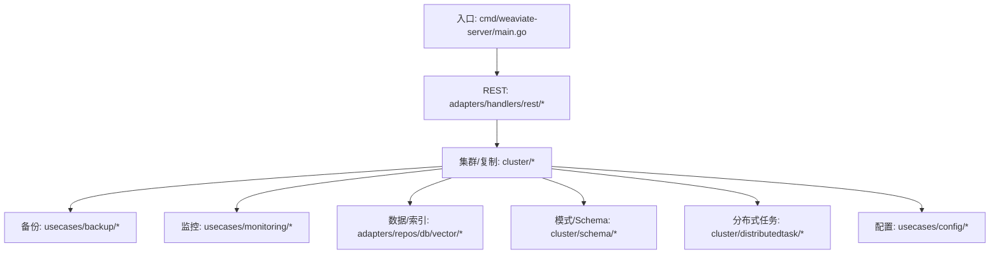
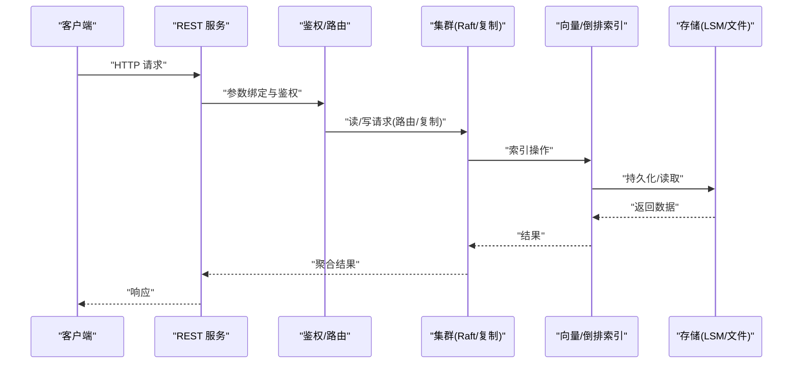
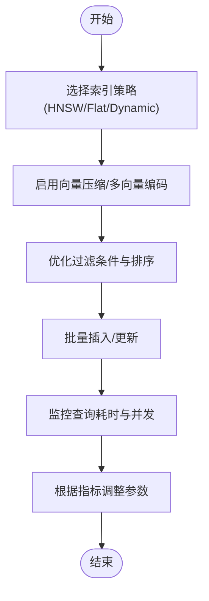
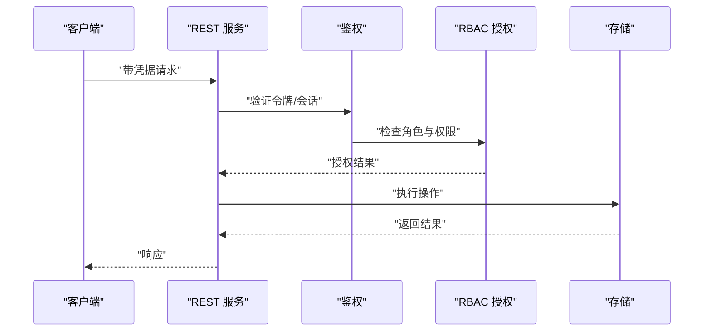
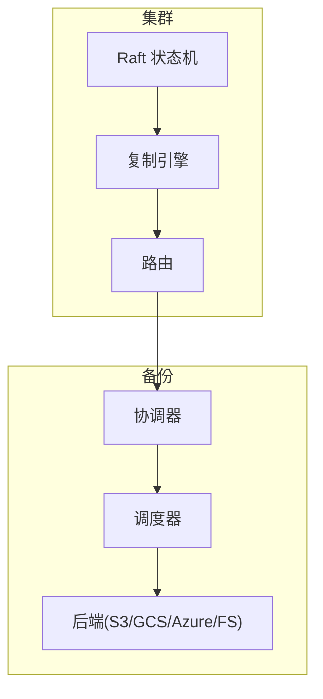
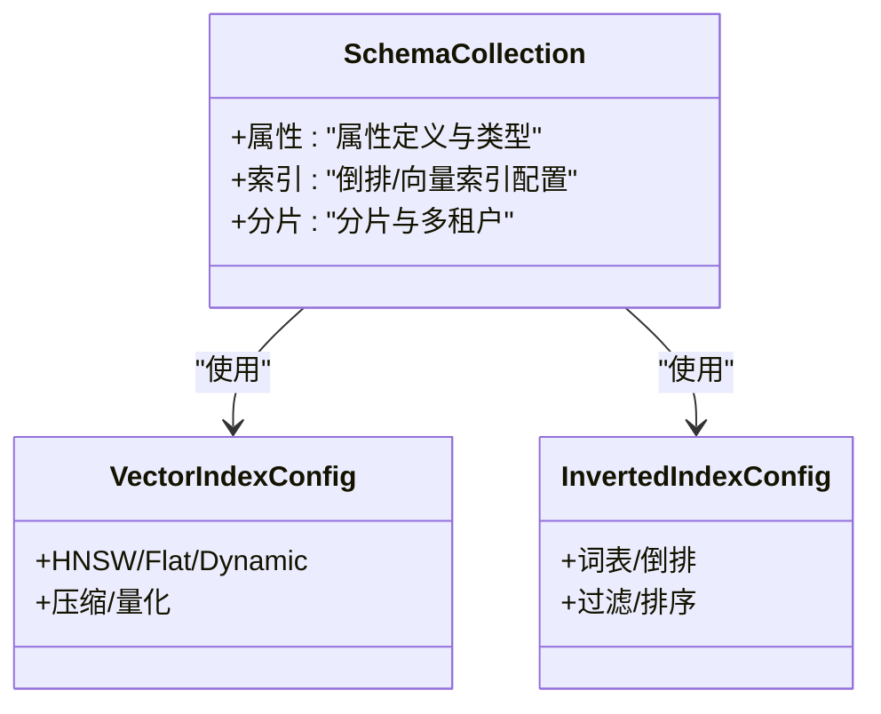
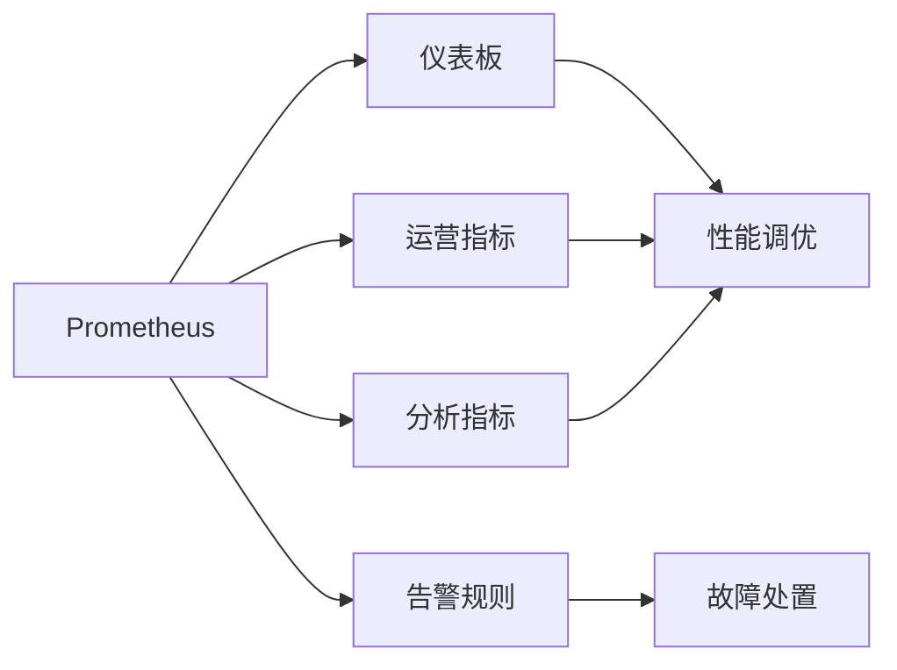
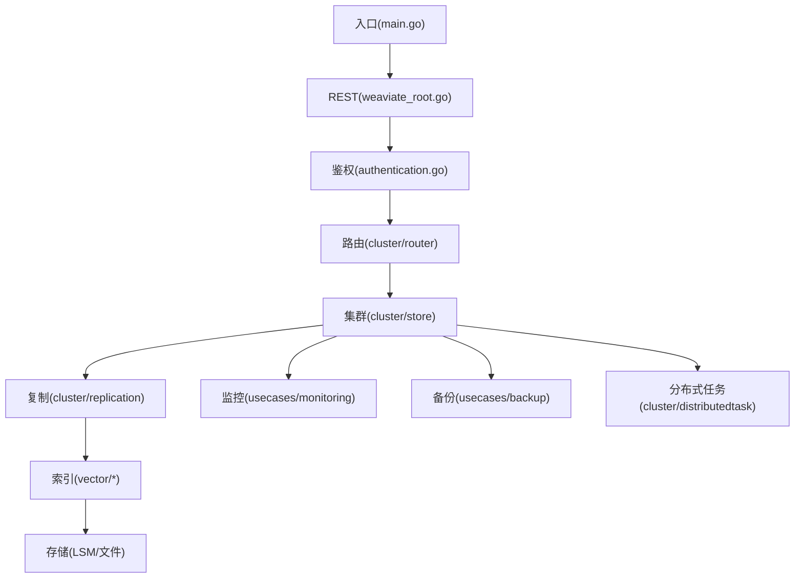

# 最佳实践

<cite>
**本文引用的文件**
- [README.md](file://README.md)
- [main.go](file://cmd/weaviate-server/main.go)
- [metrics.md](file://docs/metrics.md)
- [docker-compose.yml](file://docker-compose.yml)
- [weaviate_root.go](file://adapters/handlers/rest/operations/weaviate_root.go)
- [configure_api.go](file://adapters/handlers/rest/configure_api.go)
- [configure_server.go](file://adapters/handlers/rest/configure_server.go)
- [authentication.go](file://usecases/config/authentication.go)
- [authorization.go](file://usecases/config/authorization.go)
- [runtimeconfig.go](file://usecases/config/runtimeconfig.go)
- [cluster_store_raft_last_applied_index](file://cluster/store.go)
- [raft_cluster_endpoints.go](file://cluster/raft_cluster_endpoints.go)
- [store_query.go](file://cluster/store_query.go)
- [store_apply.go](file://cluster/store_apply.go)
- [router.go](file://cluster/router/router.go)
- [replication_manager.go](file://cluster/replication/manager.go)
- [consumer.go](file://cluster/replication/consumer.go)
- [producer.go](file://cluster/replication/producer.go)
- [schema_manager.go](file://cluster/schema/manager.go)
- [schema_reader.go](file://cluster/schema/reader.go)
- [schema_types.go](file://cluster/schema/types.go)
- [distributed_tasks_manager.go](file://cluster/distributedtask/manager.go)
- [distributed_tasks_scheduler.go](file://cluster/distributedtask/scheduler.go)
- [distributed_tasks_types.go](file://cluster/distributedtask/types.go)
- [monitoring_prometheus.go](file://usecases/monitoring/prometheus.go)
- [monitoring_http.go](file://usecases/monitoring/http.go)
- [monitoring_grpc.go](file://usecases/monitoring/grpc.go)
- [monitoring_listen.go](file://usecases/monitoring/listen.go)
- [monitoring_tracing.go](file://usecases/monitoring/tracing.go)
- [backup_coordinator.go](file://usecases/backup/coordinator.go)
- [backup_handler.go](file://usecases/backup/handler.go)
- [backup_scheduler.go](file://usecases/backup/scheduler.go)
- [backup_restorer.go](file://usecases/backup/restorer.go)
- [backup_backend.go](file://usecases/backup/backend.go)
- [backup_transport.go](file://usecases/backup/transport.go)
- [backup_zip.go](file://usecases/backup/zip.go)
- [backup_shard.go](file://usecases/backup/shard.go)
- [backup_s3_module.go](file://modules/backup-s3/module.go)
- [backup_gcs_module.go](file://modules/backup-gcs/module.go)
- [backup_azure_module.go](file://modules/backup-azure/module.go)
- [backup_filesystem_module.go](file://modules/backup-filesystem/module.go)
- [vector_index_hnsw_config.go](file://entities/vectorindex/hnsw/config.go)
- [vector_index_flat_config.go](file://entities/vectorindex/flat/config.go)
- [vector_index_dynamic_config.go](file://entities/vectorindex/dynamic/config.go)
- [vector_index_hnsw_config_update.go](file://entities/vectorindex/hnsw/config_update.go)
- [vector_index_compression_config.go](file://entities/vectorindex/compression/config.go)
- [vector_index_hnsw.go](file://adapters/repos/db/vector/hnsw/index.go)
- [vector_index_flat.go](file://adapters/repos/db/vector/flat/index.go)
- [vector_index_dynamic.go](file://adapters/repos/db/vector/dynamic/index.go)
- [vector_index_compression.go](file://adapters/repos/db/vector/compression/index.go)
- [inverted_index_config.go](file://entities/schema/inverted_index_config.go)
- [schema_collection.go](file://entities/schema/collection.go)
- [schema_properties.go](file://entities/schema/properties.go)
- [schema_validation.go](file://entities/schema/validation.go)
- [schema_accessors.go](file://entities/schema/accessors.go)
- [schema_crossref.go](file://entities/schema/crossref/)
- [schema_multi_tenancy.go](file://entities/schema/multi_tenancy.go)
- [schema_data_types.go](file://entities/schema/data_types.go)
- [schema_configvalidation.go](file://entities/schema/configvalidation/)
- [schema_test_utils.go](file://entities/schema/test_utils/)
- [schema_backward_compat.go](file://entities/schema/backward_compat.go)
- [schema_enrich_schema_datatypes.go](file://entities/storobj/enrich_schema_datatypes.go)
- [schema_storage_object.go](file://entities/storobj/storage_object.go)
- [schema_storage_object_test.go](file://entities/storobj/storage_object_test.go)
- [filters_filters.go](file://entities/filters/filters.go)
- [filters_sort.go](file://entities/filters/sort.go)
- [filters_pagination.go](file://entities/filters/pagination.go)
- [filters_cursor.go](file://entities/filters/cursor.go)
- [filters_path.go](file://entities/filters/path.go)
- [filters_where_filter.go](file://entities/filters/where_filter.go)
- [filters_filters_validator.go](file://entities/filters/filters_validator.go)
- [filters_filters_serialization_test.go](file://entities/filters/filters_serialization_test.go)
- [filters_analtyics_props.go](file://entities/filters/analtyics_props.go)
- [filters_consts.go](file://entities/filters/consts.go)
- [filters_cursor_validator.go](file://entities/filters/cursor_validator.go)
- [filters_sort_validator.go](file://entities/filters/sort_validator.go)
- [filters_pagination_test.go](file://entities/filters/pagination_test.go)
- [filters_path_test.go](file://entities/filters/path_test.go)
- [filters_where_filter_geo_range.go](file://entities/filters/where_filter_geo_range.go)
- [filters_filters_test.go](file://entities/filters/filters_test.go)
- [filters_filters_validator_test.go](file://entities/filters/filters_validator_test.go)
- [filters_analtyics_props_test.go](file://entities/filters/analtyics_props_test.go)
- [filters_consts_test.go](file://entities/filters/consts_test.go)
- [filters_cursor_test.go](file://entities/filters/cursor_test.go)
- [filters_sort_test.go](file://entities/filters/sort_test.go)
- [filters_pagination_test.go](file://entities/filters/pagination_test.go)
- [filters_path_test.go](file://entities/filters/path_test.go)
- [filters_where_filter_test.go](file://entities/filters/where_filter_test.go)
- [filters_where_filter_geo_range_test.go](file://entities/filters/where_filter_geo_range_test.go)
- [filters_where_filter_geo_range.go](file://entities/filters/where_filter_geo_range.go)
- [filters_where_filter.go](file://entities/filters/where_filter.go)
- [filters_where_filter_test.go](file://entities/filters/where_filter_test.go)
- [filters_where_filter_geo_range.go](file://entities/filters/where_filter_geo_range.go)
- [filters_where_filter_geo_range_test.go](file://entities/filters/where_filter_geo_range_test.go)
- [filters_where_filter_geo_range.go](file://entities/filters/where_filter_geo_range.go)
- [filters_where_filter.go](file://entities/filters/where_filter.go)
- [filters_where_filter_test.go](file://entities/filters/where_filter_test.go)
- [filters_where_filter_geo_range.go](file://entities/filters/where_filter_geo_range.go)
- [filters_where_filter_geo_range_test.go](file://entities/filters/where_filter_geo_range_test.go)
- [filters_where_filter_geo_range.go](file://entities/filters/where_filter_geo_range.go)
- [filters_where_filter.go](file://entities/filters/where_filter.go)
- [filters_where_filter_test.go](file://entities/filters/where_filter_test.go)
- [filters_where_filter_geo_range.go](file://entities/filters/where_filter_geo_range.go)
- [filters_where_filter_geo_range_test.go](file://entities/filters/where_filter_geo_range_test.go)
- [filters_where_filter_geo_range.go](file://entities/filters/where_filter_geo_range.go)
- [filters_where_filter.go](file://entities/filters/where_filter.go)
- [filters_where_filter_test.go](file://entities/filters/where_filter_test.go)
- [filters_where_filter_geo_range.go](file://entities/filters/where_filter_geo_range.go)
- [filters_where_filter_geo_range_test.go](file://entities/filters/where_filter_geo_range_test.go)
- [filters_where_filter_geo_range.go](file://entities/filters/where_filter_geo_range.go)
- [filters_where_filter.go](file://entities/filters/where_filter.go)
- [filters_where_filter_test.go](file://entities/filters/where_filter_test.go)
- [filters_where_filter_geo_range.go](file://entities/filters/where_filter_geo_range.go)
- [filters_where_filter_geo_range_test.go](file://entities/filters/where_filter_geo_range_test.go)
- [filters_where_filter_geo_range.go](file://entities/filters/where_filter_geo_range.go)
- [filters_where_filter.go](file://entities/filters/where_filter.go)
- [filters_where_filter_test.go](file://entities/filters/where_filter_test.go)
- [filters_where_filter_geo_range.go](file://entities/filters/where_filter_geo_range.go)
- [filters_where_filter_geo_range_test.go](file://entities/filters/where_filter_geo_range_test.go)
- [filters_where_filter_geo_range.go](file://entities/filters/where_filter_geo_range.go)
- [filters_where_filter.go](file://entities/filters/where_filter.go)
- [filters_where_filter_test.go](file://entities/filters/where_filter_test.go)
- [filters_where_filter_geo_range.go](file://entities/filters/......)
</cite>

## 目录
1. [简介](#简介)
2. [项目结构](#项目结构)
3. [核心组件](#核心组件)
4. [架构总览](#架构总览)
5. [详细组件分析](#详细组件分析)
6. [依赖关系分析](#依赖关系分析)
7. [性能考虑](#性能考虑)
8. [故障排查指南](#故障排查指南)
9. [结论](#结论)
10. [附录](#附录)

## 简介
本最佳实践指南面向生产环境的使用者与运维人员，围绕 Weaviate 的性能优化、安全实践、生产部署、数据管理、监控运维与常见问题处理进行系统化梳理。Weaviate 是一个云原生向量数据库，支持大规模语义搜索、混合检索、RAG、多租户、复制与 RBAC 授权等能力。本文以仓库中的实现为依据，结合指标体系与模块化架构，给出可落地的实践建议。

## 项目结构
Weaviate 采用分层与模块化组织方式：
- 服务入口与 API：cmd/weaviate-server/main.go 作为二进制入口，加载 Swagger 规范并启动 REST 服务。
- REST 层：adapters/handlers/rest 提供 REST API 的路由、鉴权与中间件配置。
- 集群与复制：cluster 子目录实现 Raft、复制、路由、分布式任务与模式管理。
- 备份与恢复：usecases/backup 与 modules/backup-* 提供多后端备份能力。
- 监控与可观测性：usecases/monitoring 提供 Prometheus、HTTP/gRPC 指标与链路追踪。
- 数据与索引：entities 与 adapters/repos/db 下的向量索引（HNSW、Flat、Dynamic、压缩）与倒排索引配置。
- 配置与运行时：usecases/config 提供认证、授权与运行时配置解析。

图表来源
- [main.go](file://cmd/weaviate-server/main.go#L30-L66)
- [configure_api.go](file://adapters/handlers/rest/configure_api.go)
- [configure_server.go](file://adapters/handlers/rest/configure_server.go)
- [cluster/store.go](file://cluster/store.go)
- [cluster/replication/manager.go](file://cluster/replication/manager.go)
- [usecases/backup/coordinator.go](file://usecases/backup/coordinator.go)
- [usecases/monitoring/prometheus.go](file://usecases/monitoring/prometheus.go)
- [adapters/repos/db/vector/hnsw/index.go](file://adapters/repos/db/vector/hnsw/index.go)
- [cluster/schema/manager.go](file://cluster/schema/manager.go)
- [cluster/distributedtask/manager.go](file://cluster/distributedtask/manager.go)
- [usecases/config/authentication.go](file://usecases/config/authentication.go)
- [usecases/config/authorization.go](file://usecases/config/authorization.go)

章节来源
- [README.md](file://README.md#L10-L28)
- [main.go](file://cmd/weaviate-server/main.go#L30-L66)

## 核心组件
- 服务入口与 API：入口负责加载 Swagger 并启动服务，REST 层完成路由、参数绑定与鉴权。
- 集群与复制：Raft 状态机、复制引擎、消费者/生产者、路由与分片状态管理。
- 备份与恢复：协调器、调度器、处理器、后端适配器与传输层。
- 监控与可观测性：Prometheus 指标、HTTP/gRPC 请求指标、链路追踪。
- 数据与索引：向量索引（HNSW/Flat/Dynamic/压缩）与倒排索引配置。
- 配置与运行时：认证、授权与运行时配置解析。

章节来源
- [main.go](file://cmd/weaviate-server/main.go#L30-L66)
- [configure_api.go](file://adapters/handlers/rest/configure_api.go)
- [configure_server.go](file://adapters/handlers/rest/configure_server.go)
- [metrics.md](file://docs/metrics.md#L40-L124)

## 架构总览
Weaviate 的核心路径由“请求进入 -> 鉴权/路由 -> 查询/写入 -> 集群一致性 -> 存储/索引 -> 返回结果”构成。集群层通过 Raft 保证一致性，复制引擎保障跨节点数据同步，监控与备份贯穿全生命周期。

图表来源
- [weaviate_root.go](file://adapters/handlers/rest/operations/weaviate_root.go#L62-L88)
- [configure_api.go](file://adapters/handlers/rest/configure_api.go)
- [configure_server.go](file://adapters/handlers/rest/configure_server.go)
- [cluster/store.go](file://cluster/store.go)
- [cluster/replication/manager.go](file://cluster/replication/manager.go)
- [adapters/repos/db/vector/hnsw/index.go](file://adapters/repos/db/vector/hnsw/index.go)

## 详细组件分析

### 性能优化：索引策略、查询优化与缓存策略
- 向量索引策略
  - HNSW：适用于大规模高维向量的近似最近邻搜索，支持动态图与压缩，适合生产环境的召回与速度平衡。
  - Flat：适用于小规模或对精度要求极高的场景。
  - Dynamic：根据数据分布自适应选择索引类型。
  - 压缩：通过量化与多向量编码降低内存占用，同时尽量维持检索质量。
- 倒排索引与过滤
  - 使用过滤器（where、sort、pagination、cursor）进行精确与高效筛选，避免不必要的全表扫描。
  - 对高频过滤字段建立合适属性与索引配置，减少查询路径开销。
- 缓存与队列
  - 利用队列与限流机制平滑突发流量，避免过载导致的尾延迟。
  - 结合并发查询计数与持续时间直方图，识别热点与瓶颈。
- 查询优化
  - 通过查询类型与维度统计，定位高成本查询并针对性优化。
  - 使用并发批处理与批量插入，提升吞吐。

图表来源
- [vector_index_hnsw_config.go](file://entities/vectorindex/hnsw/config.go)
- [vector_index_flat_config.go](file://entities/vectorindex/flat/config.go)
- [vector_index_dynamic_config.go](file://entities/vectorindex/dynamic/config.go)
- [vector_index_compression_config.go](file://entities/vectorindex/compression/config.go)
- [filters_filters.go](file://entities/filters/filters.go)
- [filters_sort.go](file://entities/filters/sort.go)
- [filters_pagination.go](file://entities/filters/pagination.go)
- [metrics.md](file://docs/metrics.md#L52-L88)

章节来源
- [vector_index_hnsw_config.go](file://entities/vectorindex/hnsw/config.go)
- [vector_index_flat_config.go](file://entities/vectorindex/flat/config.go)
- [vector_index_dynamic_config.go](file://entities/vectorindex/dynamic/config.go)
- [vector_index_compression_config.go](file://entities/vectorindex/compression/config.go)
- [inverted_index_config.go](file://entities/schema/inverted_index_config.go)
- [filters_filters.go](file://entities/filters/filters.go)
- [filters_sort.go](file://entities/filters/sort.go)
- [filters_pagination.go](file://entities/filters/pagination.go)
- [metrics.md](file://docs/metrics.md#L52-L88)

### 安全实践：认证、数据加密与访问控制
- 认证与授权
  - 通过 REST 层的鉴权流程对接认证系统，确保请求携带有效凭据。
  - 使用 RBAC 细粒度控制对集合、分片与操作的访问权限。
- 传输与存储安全
  - 在容器编排中启用 TLS 与密钥管理，避免明文传输。
  - 对备份与日志进行加密存储，限制访问范围。
- 最小权限与审计
  - 为不同角色分配最小必要权限，定期审计权限变更。
  - 记录关键操作与异常事件，便于追溯。

图表来源
- [weaviate_root.go](file://adapters/handlers/rest/operations/weaviate_root.go#L68-L87)
- [authentication.go](file://usecases/config/authentication.go)
- [authorization.go](file://usecases/config/authorization.go)

章节来源
- [weaviate_root.go](file://adapters/handlers/rest/operations/weaviate_root.go#L62-L88)
- [authentication.go](file://usecases/config/authentication.go)
- [authorization.go](file://usecases/config/authorization.go)

### 生产部署最佳实践：集群、备份与故障排除
- 集群配置
  - 使用 Raft 保证一致性，合理设置复制因子与分片数量，避免单点瓶颈。
  - 通过集群状态与应用索引指标监控节点健康与进度。
- 备份策略
  - 采用多后端（S3/GCS/Azure/文件系统）进行异地容灾备份。
  - 使用调度器与协调器管理备份窗口与并发，避免影响在线业务。
- 故障排除
  - 关注 tombstone 清理、队列长度、异步操作与复制状态等关键指标。
  - 结合日志与追踪，定位慢查询与异常节点。

图表来源
- [cluster/store.go](file://cluster/store.go)
- [cluster/replication/manager.go](file://cluster/replication/manager.go)
- [cluster/router/router.go](file://cluster/router/router.go)
- [usecases/backup/coordinator.go](file://usecases/backup/coordinator.go)
- [usecases/backup/scheduler.go](file://usecases/backup/scheduler.go)
- [backup_s3_module.go](file://modules/backup-s3/module.go)
- [backup_gcs_module.go](file://modules/backup-gcs/module.go)
- [backup_azure_module.go](file://modules/backup-azure/module.go)
- [backup_filesystem_module.go](file://modules/backup-filesystem/module.go)

章节来源
- [cluster/store.go](file://cluster/store.go)
- [cluster/replication/manager.go](file://cluster/replication/manager.go)
- [cluster/router/router.go](file://cluster/router/router.go)
- [usecases/backup/coordinator.go](file://usecases/backup/coordinator.go)
- [usecases/backup/scheduler.go](file://usecases/backup/scheduler.go)
- [backup_s3_module.go](file://modules/backup-s3/module.go)
- [backup_gcs_module.go](file://modules/backup-gcs/module.go)
- [backup_azure_module.go](file://modules/backup-azure/module.go)
- [backup_filesystem_module.go](file://modules/backup-filesystem/module.go)

### 数据管理最佳实践：模型设计、索引配置与存储优化
- 数据模型设计
  - 明确属性类型与多模态需求，合理拆分集合与分片，启用多租户隔离。
  - 使用交叉引用与嵌套属性时，关注查询复杂度与索引成本。
- 索引配置
  - 为文本字段配置倒排索引，为向量字段选择合适的索引与压缩策略。
  - 对高频查询字段建立合适索引，避免全表扫描。
- 存储优化
  - 启用向量压缩与多向量编码，降低内存与磁盘占用。
  - 控制分片大小与段数量，定期维护与清理无用条目。

图表来源
- [schema_collection.go](file://entities/schema/collection.go)
- [schema_properties.go](file://entities/schema/properties.go)
- [vector_index_hnsw_config.go](file://entities/vectorindex/hnsw/config.go)
- [vector_index_flat_config.go](file://entities/vectorindex/flat/config.go)
- [vector_index_dynamic_config.go](file://entities/vectorindex/dynamic/config.go)
- [vector_index_compression_config.go](file://entities/vectorindex/compression/config.go)
- [inverted_index_config.go](file://entities/schema/inverted_index_config.go)

章节来源
- [schema_collection.go](file://entities/schema/collection.go)
- [schema_properties.go](file://entities/schema/properties.go)
- [vector_index_hnsw_config.go](file://entities/vectorindex/hnsw/config.go)
- [vector_index_flat_config.go](file://entities/vectorindex/flat/config.go)
- [vector_index_dynamic_config.go](file://entities/vectorindex/dynamic/config.go)
- [vector_index_compression_config.go](file://entities/vectorindex/compression/config.go)
- [inverted_index_config.go](file://entities/schema/inverted_index_config.go)

### 监控与运维最佳实践：指标采集、告警与性能调优
- 指标采集
  - 使用 Prometheus 暴露核心指标，区分仪表板、运营、告警与分析四类。
  - 关注批处理、对象操作、查询耗时、队列长度、向量索引与启动阶段指标。
- 告警设置
  - 基于查询耗时与并发数设置阈值告警，避免高基数标签引发噪声。
  - 结合日志与追踪，定位根因并制定预案。
- 性能调优
  - 通过指标趋势与直方图识别热点，调整批大小、并发与索引参数。
  - 结合队列与限流策略，平滑流量波动。

图表来源
- [metrics.md](file://docs/metrics.md#L16-L36)
- [monitoring_prometheus.go](file://usecases/monitoring/prometheus.go)
- [monitoring_http.go](file://usecases/monitoring/http.go)
- [monitoring_grpc.go](file://usecases/monitoring/grpc.go)
- [monitoring_listen.go](file://usecases/monitoring/listen.go)
- [monitoring_tracing.go](file://usecases/monitoring/tracing.go)

章节来源
- [metrics.md](file://docs/metrics.md#L40-L124)
- [monitoring_prometheus.go](file://usecases/monitoring/prometheus.go)
- [monitoring_http.go](file://usecases/monitoring/http.go)
- [monitoring_grpc.go](file://usecases/monitoring/grpc.go)
- [monitoring_listen.go](file://usecases/monitoring/listen.go)
- [monitoring_tracing.go](file://usecases/monitoring/tracing.go)

### 常见问题预防与解决方案
- 查询慢
  - 检查查询类型与并发计数、查询耗时直方图与过滤条件。
  - 优化过滤字段索引与批处理大小，必要时启用压缩与分片。
- 写入阻塞
  - 关注队列长度与异步操作状态，避免过载。
  - 调整批大小与并发，结合限流与重试策略。
- 复制异常
  - 监控复制引擎状态与生产者/消费者运行状态，定位失败节点。
  - 通过路由与分片状态确认一致性与可用性。
- 备份失败
  - 检查后端连接与传输状态，核对调度与协调器日志。
  - 优化备份窗口与并发，确保不影响在线业务。

章节来源
- [metrics.md](file://docs/metrics.md#L127-L205)
- [cluster/replication/manager.go](file://cluster/replication/manager.go)
- [cluster/router/router.go](file://cluster/router/router.go)
- [usecases/backup/coordinator.go](file://usecases/backup/coordinator.go)
- [usecases/backup/scheduler.go](file://usecases/backup/scheduler.go)

### 案例研究与成功故事
- 企业级 RAG 系统：通过多租户与复制保障高可用，结合向量压缩与倒排索引实现高性能检索。
- 图像与多模态搜索：使用多向量与压缩策略降低内存占用，配合过滤与排序满足复杂业务需求。
- 大规模推荐引擎：通过分片与队列限流平滑流量，结合指标与告警实现稳定运维。

章节来源
- [README.md](file://README.md#L112-L128)

## 依赖关系分析
Weaviate 的关键依赖链路如下：
- 入口 -> REST -> 鉴权/路由 -> 集群(Raft/复制) -> 索引/存储
- 监控贯穿各层，备份与分布式任务独立模块化

图表来源
- [main.go](file://cmd/weaviate-server/main.go#L30-L66)
- [weaviate_root.go](file://adapters/handlers/rest/operations/weaviate_root.go#L62-L88)
- [authentication.go](file://usecases/config/authentication.go)
- [cluster/router/router.go](file://cluster/router/router.go)
- [cluster/store.go](file://cluster/store.go)
- [cluster/replication/manager.go](file://cluster/replication/manager.go)
- [adapters/repos/db/vector/hnsw/index.go](file://adapters/repos/db/vector/hnsw/index.go)
- [usecases/monitoring/prometheus.go](file://usecases/monitoring/prometheus.go)
- [usecases/backup/coordinator.go](file://usecases/backup/coordinator.go)
- [cluster/distributedtask/manager.go](file://cluster/distributedtask/manager.go)

章节来源
- [main.go](file://cmd/weaviate-server/main.go#L30-L66)
- [weaviate_root.go](file://adapters/handlers/rest/operations/weaviate_root.go#L62-L88)
- [cluster/router/router.go](file://cluster/router/router.go)
- [cluster/store.go](file://cluster/store.go)
- [cluster/replication/manager.go](file://cluster/replication/manager.go)
- [adapters/repos/db/vector/hnsw/index.go](file://adapters/repos/db/vector/hnsw/index.go)
- [usecases/monitoring/prometheus.go](file://usecases/monitoring/prometheus.go)
- [usecases/backup/coordinator.go](file://usecases/backup/coordinator.go)
- [cluster/distributedtask/manager.go](file://cluster/distributedtask/manager.go)

## 性能考虑
- 索引选择与压缩：根据数据规模与精度需求选择 HNSW/Flat/Dynamic，并启用压缩与多向量编码。
- 查询路径优化：减少全表扫描，使用倒排索引与过滤器，控制批大小与并发。
- 存储与队列：监控队列长度与异步操作，避免过载；定期维护索引段与清理 tombstone。
- 监控与告警：基于指标阈值设置告警，结合追踪定位根因。

章节来源
- [metrics.md](file://docs/metrics.md#L40-L124)
- [vector_index_hnsw_config.go](file://entities/vectorindex/hnsw/config.go)
- [vector_index_compression_config.go](file://entities/vectorindex/compression/config.go)
- [filters_filters.go](file://entities/filters/filters.go)

## 故障排查指南
- 快速定位
  - 查看查询耗时与并发、队列长度、复制状态与启动进度等关键指标。
  - 结合日志与追踪，确认异常发生的具体阶段。
- 常见场景
  - 查询慢：优化过滤与批处理，检查索引配置。
  - 写入阻塞：调整队列与限流，核对异步操作状态。
  - 复制异常：检查生产者/消费者运行状态与节点健康。
  - 备份失败：核对后端连接与传输状态，优化窗口与并发。

章节来源
- [metrics.md](file://docs/metrics.md#L127-L205)
- [cluster/replication/manager.go](file://cluster/replication/manager.go)
- [usecases/backup/coordinator.go](file://usecases/backup/coordinator.go)

## 结论
通过合理的索引策略、严格的认证与授权、完善的监控与备份、以及持续的性能调优，Weaviate 可在生产环境中实现高可靠、高性能与易运维。建议以指标为依据，以告警为哨兵，以备份为底线，逐步完善整体治理与自动化能力。

## 附录
- 开发与演示环境参考
  - 使用 docker-compose 提供的开发与演示服务，包含 Prometheus、Grafana、Keycloak 与多个向量化器镜像，便于本地验证与观测。

章节来源
- [docker-compose.yml](file://docker-compose.yml#L21-L140)