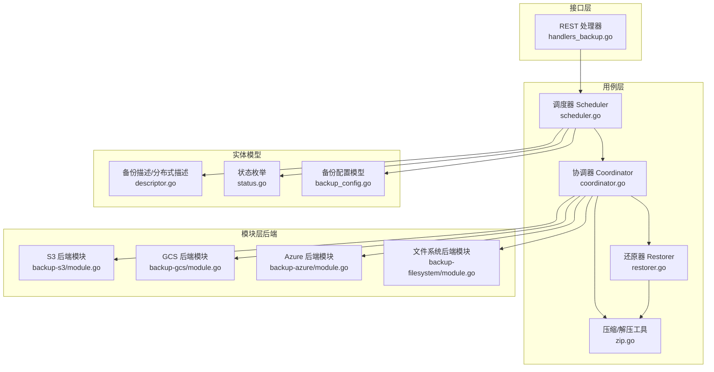
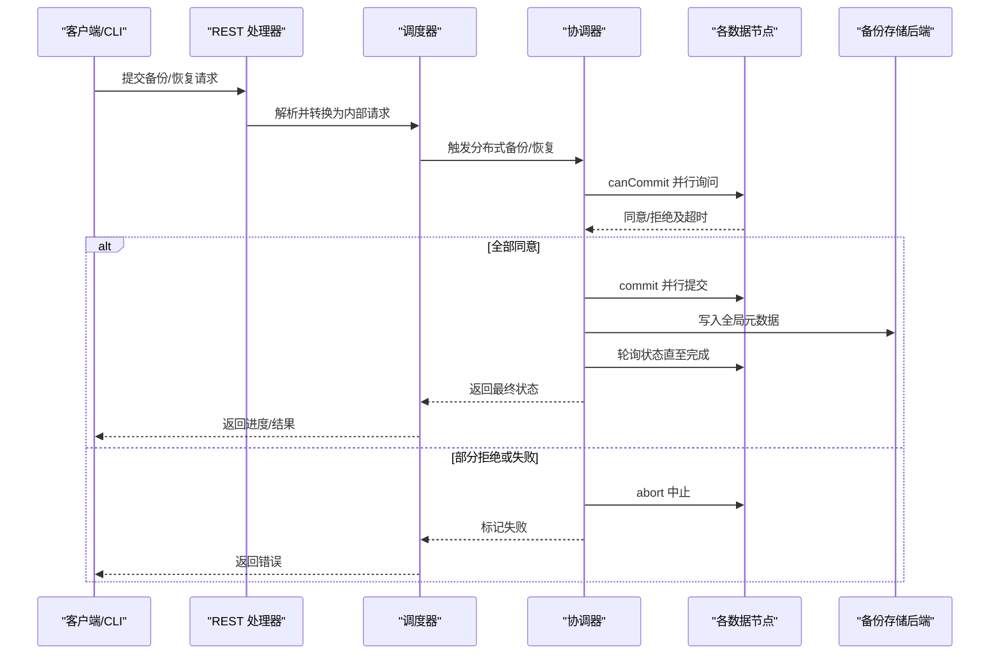
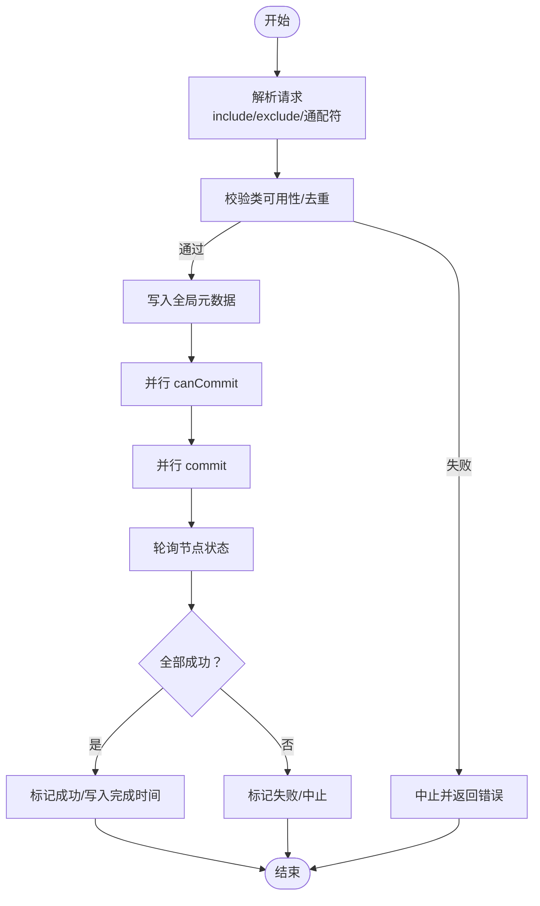
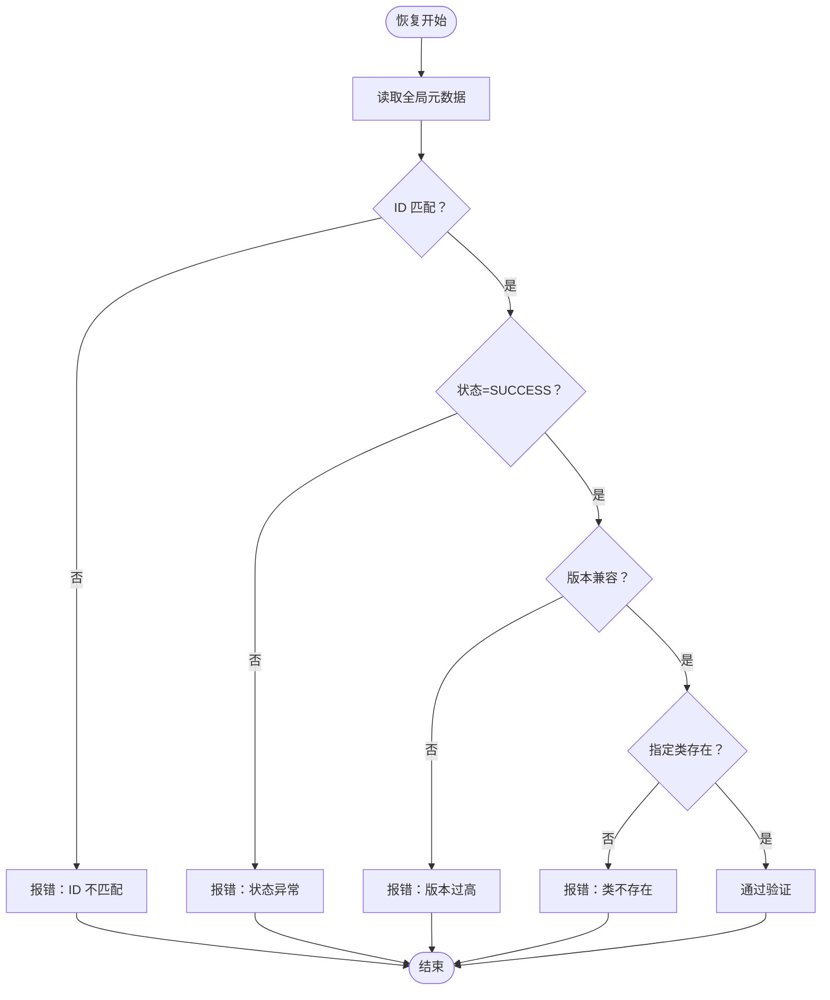
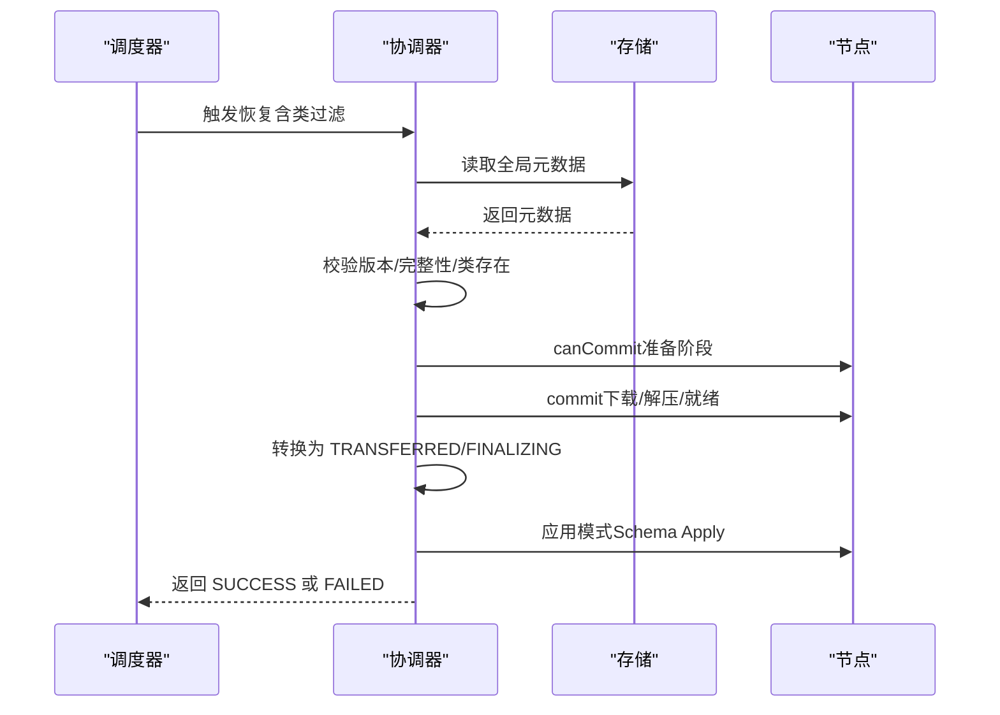
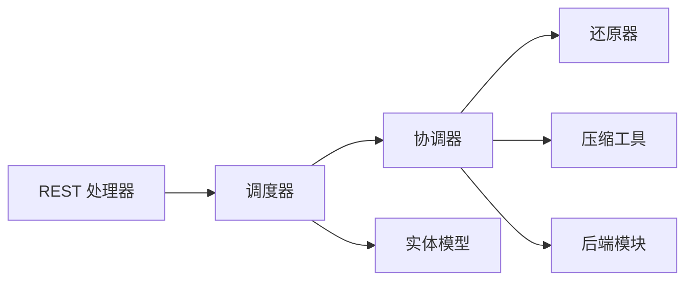

# 备份策略

<cite>
**本文引用的文件**
- [modules/backup-s3/module.go](file://modules/backup-s3/module.go)
- [modules/backup-gcs/module.go](file://modules/backup-gcs/module.go)
- [modules/backup-azure/module.go](file://modules/backup-azure/module.go)
- [modules/backup-filesystem/module.go](file://modules/backup-filesystem/module.go)
- [usecases/backup/coordinator.go](file://usecases/backup/coordinator.go)
- [usecases/backup/scheduler.go](file://usecases/backup/scheduler.go)
- [usecases/backup/restorer.go](file://usecases/backup/restorer.go)
- [usecases/backup/zip.go](file://usecases/backup/zip.go)
- [entities/backup/descriptor.go](file://entities/backup/descriptor.go)
- [entities/backup/status.go](file://entities/backup/status.go)
- [entities/models/backup_config.go](file://entities/models/backup_config.go)
- [adapters/handlers/rest/handlers_backup.go](file://adapters/handlers/rest/handlers_backup.go)
- [adapters/handlers/rest/handlers_backup_test.go](file://adapters/handlers/rest/handlers_backup_test.go)
- [test/helper/backuptest/suite.go](file://test/helper/backuptest/suite.go)
- [adapters/repos/db/clusterintegrationtest/backup_coordinator_integration_test.go](file://adapters/repos/db/clusterintegrationtest/backup_coordinator_integration_test.go)
- [adapters/repos/db/clusterintegrationtest/backup_coordinator_integration_override_test.go](file://adapters/repos/db/clusterintegrationtest/backup_coordinator_integration_override_test.go)
- [test/acceptance/authn/dynamic_users_restore_test.go](file://test/acceptance/authn/dynamic_users_restore_test.go)
</cite>

## 目录
1. [简介](#简介)
2. [项目结构](#项目结构)
3. [核心组件](#核心组件)
4. [架构总览](#架构总览)
5. [详细组件分析](#详细组件分析)
6. [依赖关系分析](#依赖关系分析)
7. [性能与成本优化](#性能与成本优化)
8. [故障排查指南](#故障排查指南)
9. [结论](#结论)
10. [附录](#附录)

## 简介
本指南面向运维工程师，系统化阐述 Weaviate 的备份与恢复策略，覆盖备份类型选择（全量/增量/差异）、存储后端配置（S3/GCS/Azure/本地文件系统）、调度与频率规划、验证与监控、恢复演练（部分/全量/灾难恢复），以及性能与成本优化建议。文档基于仓库中的实现进行说明，并提供可操作的步骤与可视化图示。

## 项目结构
Weaviate 的备份能力由“使用用例层”和“模块层”协同实现：
- 使用用例层：分布式协调器、调度器、还原器、压缩打包等逻辑位于 usecases/backup。
- 模块层：各云存储后端作为备份后端模块，位于 modules/backup-*。
- 实体模型：备份描述、状态、配置等位于 entities/backup 与 entities/models。
- 接口适配：REST 层负责参数解析与压缩等级映射，位于 adapters/handlers/rest。

图表来源
- [usecases/backup/scheduler.go](file://usecases/backup/scheduler.go#L57-L83)
- [usecases/backup/coordinator.go](file://usecases/backup/coordinator.go#L114-L136)
- [usecases/backup/restorer.go](file://usecases/backup/restorer.go#L265-L297)
- [usecases/backup/zip.go](file://usecases/backup/zip.go#L33-L65)
- [entities/backup/descriptor.go](file://entities/backup/descriptor.go#L325-L348)
- [entities/backup/status.go](file://entities/backup/status.go#L14-L25)
- [entities/models/backup_config.go](file://entities/models/backup_config.go#L49-L132)
- [adapters/handlers/rest/handlers_backup.go](file://adapters/handlers/rest/handlers_backup.go#L43-L94)
- [modules/backup-s3/module.go](file://modules/backup-s3/module.go#L25-L100)
- [modules/backup-gcs/module.go](file://modules/backup-gcs/module.go#L24-L103)
- [modules/backup-azure/module.go](file://modules/backup-azure/module.go#L24-L103)
- [modules/backup-filesystem/module.go](file://modules/backup-filesystem/module.go#L30-L126)

章节来源
- [usecases/backup/scheduler.go](file://usecases/backup/scheduler.go#L57-L83)
- [usecases/backup/coordinator.go](file://usecases/backup/coordinator.go#L114-L136)
- [modules/backup-s3/module.go](file://modules/backup-s3/module.go#L25-L100)
- [modules/backup-gcs/module.go](file://modules/backup-gcs/module.go#L24-L103)
- [modules/backup-azure/module.go](file://modules/backup-azure/module.go#L24-L103)
- [modules/backup-filesystem/module.go](file://modules/backup-filesystem/module.go#L30-L126)

## 核心组件
- 调度器（Scheduler）：接收用户请求，校验类列表与后端可用性，协调分布式备份/恢复。
- 协调器（Coordinator）：按分片分组节点，发起 canCommit/commit/poll 流程，聚合节点结果并写入全局元数据。
- 还原器（Restorer）：在恢复前校验备份元数据版本与完整性，执行阶段化还原。
- 压缩工具（zip.go）：支持 gzip/zstd/no-compression 及 CPU 百分比控制。
- 描述与状态（descriptor/status）：统一描述备份内容与状态机。
- REST 映射（handlers_backup.go）：将请求模型映射到内部压缩配置。

章节来源
- [usecases/backup/scheduler.go](file://usecases/backup/scheduler.go#L481-L524)
- [usecases/backup/coordinator.go](file://usecases/backup/coordinator.go#L161-L234)
- [usecases/backup/restorer.go](file://usecases/backup/restorer.go#L265-L297)
- [usecases/backup/zip.go](file://usecases/backup/zip.go#L33-L65)
- [entities/backup/descriptor.go](file://entities/backup/descriptor.go#L325-L348)
- [entities/backup/status.go](file://entities/backup/status.go#L14-L25)
- [adapters/handlers/rest/handlers_backup.go](file://adapters/handlers/rest/handlers_backup.go#L43-L94)

## 架构总览
分布式备份/恢复的关键流程如下：

图表来源
- [usecases/backup/scheduler.go](file://usecases/backup/scheduler.go#L57-L83)
- [usecases/backup/coordinator.go](file://usecases/backup/coordinator.go#L470-L545)
- [usecases/backup/coordinator.go](file://usecases/backup/coordinator.go#L547-L683)
- [usecases/backup/restorer.go](file://usecases/backup/restorer.go#L265-L297)

## 详细组件分析

### 备份类型与策略选择
- 全量备份：Weaviate 当前以“全量”方式生成备份，备份描述中包含每个类的完整结构与分片信息。该模式适合一致性要求高、恢复场景多样的环境。
- 增量/差异备份：当前仓库未发现内置的增量/差异备份实现。若需增量/差异能力，可在外部通过对象级变更日志或应用层策略配合使用，但需注意与 Weaviate 分片/复制机制的兼容性。

章节来源
- [entities/backup/descriptor.go](file://entities/backup/descriptor.go#L325-L348)
- [usecases/backup/coordinator.go](file://usecases/backup/coordinator.go#L161-L234)

### 存储后端配置与优化
Weaviate 支持多种备份存储后端，均通过模块化实现，具备统一的初始化与元信息查询接口。

- S3 后端
  - 关键环境变量：端点、桶名、是否启用 SSL、路径前缀。
  - 初始化：从环境变量读取配置，构建客户端；若桶名缺失则初始化失败。
  - 元信息：返回端点、桶名、根目录（如配置）、SSL 开关。
  
  章节来源
  - [modules/backup-s3/module.go](file://modules/backup-s3/module.go#L25-L100)

- GCS 后端
  - 关键环境变量：桶名、路径前缀。
  - 初始化：从环境变量读取配置；若桶名缺失则初始化失败。
  - 元信息：返回桶名与根目录（如配置）。
  
  章节来源
  - [modules/backup-gcs/module.go](file://modules/backup-gcs/module.go#L24-L103)

- Azure 后端
  - 关键环境变量：容器名、路径前缀。
  - 初始化：从环境变量读取配置；若容器名缺失则初始化失败。
  - 元信息：返回容器名与根目录（如配置）。
  
  章节来源
  - [modules/backup-azure/module.go](file://modules/backup-azure/module.go#L24-L103)

- 文件系统后端
  - 本地路径：通过环境变量指定备份根目录。
  - 列举：扫描备份根目录下的全局元数据文件，解析分布式备份描述。
  - 元信息：返回备份根路径。
  
  章节来源
  - [modules/backup-filesystem/module.go](file://modules/backup-filesystem/module.go#L30-L126)

- 后端选择与限制
  - 若后端为非外部存储且集群节点数大于 1，则不允许使用本地后端进行备份。
  
  章节来源
  - [usecases/backup/scheduler.go](file://usecases/backup/scheduler.go#L481-L484)

### 备份调度与频率规划
- 类选择与去重：支持 include/exclude 与通配符展开；重复项会报错。
- 可用性校验：确保所选类均可备份。
- 全局元数据：在开始前写入全局备份元数据，便于后续恢复与状态查询。
- 并发与轮询：协调器对节点并发 canCommit/commit，并周期性轮询状态，容忍部分失败取决于策略。
- 验证与恢复：恢复前严格校验备份元数据版本、完整性与状态，避免跨版本不兼容与损坏备份导致的恢复失败。

图表来源
- [usecases/backup/scheduler.go](file://usecases/backup/scheduler.go#L481-L524)
- [usecases/backup/coordinator.go](file://usecases/backup/coordinator.go#L470-L545)
- [usecases/backup/coordinator.go](file://usecases/backup/coordinator.go#L547-L683)

章节来源
- [usecases/backup/scheduler.go](file://usecases/backup/scheduler.go#L481-L524)
- [usecases/backup/coordinator.go](file://usecases/backup/coordinator.go#L470-L545)
- [usecases/backup/coordinator.go](file://usecases/backup/coordinator.go#L547-L683)

### 备份验证流程
- 元数据校验：恢复前读取全局元数据，校验 ID、状态、版本与完整性。
- 版本兼容：若备份版本高于当前服务器版本则拒绝。
- 类存在性：若指定类不在备份中则报错。
- 压缩类型：新旧备份的压缩类型兼容处理，保证读取正确性。

图表来源
- [usecases/backup/restorer.go](file://usecases/backup/restorer.go#L265-L297)
- [entities/backup/descriptor.go](file://entities/backup/descriptor.go#L448-L467)

章节来源
- [usecases/backup/restorer.go](file://usecases/backup/restorer.go#L265-L297)
- [entities/backup/descriptor.go](file://entities/backup/descriptor.go#L448-L467)

### 恢复流程演练
- 部分恢复：仅恢复指定类，先做类存在性校验，再进入阶段化还原。
- 全量恢复：恢复所有类，遵循相同验证与阶段化流程。
- 灾难恢复：当集群节点大规模故障时，可从外部备份恢复至新集群，协调器在 Finalizing 阶段阻塞取消，确保 Raft 提交安全。

图表来源
- [usecases/backup/coordinator.go](file://usecases/backup/coordinator.go#L236-L378)
- [usecases/backup/restorer.go](file://usecases/backup/restorer.go#L265-L297)

章节来源
- [usecases/backup/coordinator.go](file://usecases/backup/coordinator.go#L236-L378)
- [usecases/backup/restorer.go](file://usecases/backup/restorer.go#L265-L297)

### 压缩与传输优化
- 压缩级别：支持 gzip 默认/最佳速度/最佳压缩，以及 zstd 对应级别，或无压缩。
- CPU 百分比：通过 CPUPercentage 控制压缩并发与资源占用，避免峰值时段过度占用。
- 传输：协调器在 commit 阶段聚合节点预压缩大小，便于容量评估与成本估算。

章节来源
- [usecases/backup/zip.go](file://usecases/backup/zip.go#L33-L65)
- [entities/models/backup_config.go](file://entities/models/backup_config.go#L49-L132)
- [adapters/handlers/rest/handlers_backup.go](file://adapters/handlers/rest/handlers_backup.go#L43-L94)
- [adapters/handlers/rest/handlers_backup_test.go](file://adapters/handlers/rest/handlers_backup_test.go#L75-L109)
- [usecases/backup/coordinator.go](file://usecases/backup/coordinator.go#L636-L683)

## 依赖关系分析
- 调度器依赖：授权器、客户端、选择器、后端提供者、节点解析器、模式管理器、日志。
- 协调器依赖：选择器、客户端、模式管理器、日志、节点解析器、后端提供者。
- REST 层依赖：备份配置模型与压缩映射。
- 后端模块依赖：各自云服务 SDK 与环境变量配置。

图表来源
- [usecases/backup/scheduler.go](file://usecases/backup/scheduler.go#L57-L83)
- [usecases/backup/coordinator.go](file://usecases/backup/coordinator.go#L114-L136)
- [adapters/handlers/rest/handlers_backup.go](file://adapters/handlers/rest/handlers_backup.go#L43-L94)
- [modules/backup-s3/module.go](file://modules/backup-s3/module.go#L25-L100)
- [modules/backup-gcs/module.go](file://modules/backup-gcs/module.go#L24-L103)
- [modules/backup-azure/module.go](file://modules/backup-azure/module.go#L24-L103)
- [modules/backup-filesystem/module.go](file://modules/backup-filesystem/module.go#L30-L126)

章节来源
- [usecases/backup/scheduler.go](file://usecases/backup/scheduler.go#L57-L83)
- [usecases/backup/coordinator.go](file://usecases/backup/coordinator.go#L114-L136)

## 性能与成本优化
- 压缩策略
  - 低延迟优先：选择 BestSpeed（gzip/zstd）以降低备份窗口。
  - 空间优先：选择 BestCompression（gzip）或对应 zstd 级别。
  - 无压缩：适用于网络带宽充足、CPU 资源紧张的场景。
  - CPU 百分比：根据备份窗口与业务负载动态调整，避免与查询高峰重叠。
- 传输与并发
  - 利用协调器的并发 canCommit/commit 与轮询机制，合理设置节点数量与网络带宽。
  - 通过后端路径前缀组织备份，便于生命周期管理与成本分摊。
- 成本控制
  - 选择就近区域的 S3/GCS/Azure 存储，减少跨区域传输费用。
  - 使用对象生命周期策略自动归档冷数据，降低长期存储成本。
  - 结合压缩级别与预压缩大小统计，评估实际占用与传输成本。

章节来源
- [usecases/backup/zip.go](file://usecases/backup/zip.go#L33-L65)
- [entities/models/backup_config.go](file://entities/models/backup_config.go#L49-L132)
- [usecases/backup/coordinator.go](file://usecases/backup/coordinator.go#L636-L683)
- [modules/backup-s3/module.go](file://modules/backup-s3/module.go#L25-L100)
- [modules/backup-gcs/module.go](file://modules/backup-gcs/module.go#L24-L103)
- [modules/backup-azure/module.go](file://modules/backup-azure/module.go#L24-L103)
- [modules/backup-filesystem/module.go](file://modules/backup-filesystem/module.go#L30-L126)

## 故障排查指南
- 备份失败
  - 检查后端初始化参数（桶/容器/路径/SSL）是否正确。
  - 查看全局元数据状态与错误字段，定位具体节点失败原因。
  - 若出现“节点可能宕机”提示，确认节点可达性与磁盘空间。
- 恢复失败
  - 确认备份 ID、类列表与版本兼容性。
  - 检查 Finalizing 阶段是否被外部取消（CancelRestore）。
- 验证与监控
  - 通过状态接口轮询进度，观察 TRANSFERRING/TRANSFERRED/FINALIZING/SUCCESS/FAILED/CANCELLED 状态变化。
  - 使用 Prometheus 指标（如 restore phase durations）观测恢复阶段耗时。

章节来源
- [usecases/backup/coordinator.go](file://usecases/backup/coordinator.go#L685-L739)
- [usecases/backup/restorer.go](file://usecases/backup/restorer.go#L265-L297)
- [entities/backup/status.go](file://entities/backup/status.go#L14-L25)

## 结论
Weaviate 的备份体系以“全量备份+分布式协调+多后端支持”为核心，结合压缩与并发机制，在保证一致性的同时兼顾性能与成本。建议在生产环境中采用“定期全量+严格的验证与恢复演练”，并结合对象生命周期策略与就近存储，持续优化备份窗口与存储成本。

## 附录
- 集成测试与验收测试展示了备份创建、状态轮询与恢复流程的端到端行为，可作为演练参考。
- 动态用户与角色恢复测试覆盖了用户与权限的恢复选项，便于在 RBAC 场景下进行演练。

章节来源
- [test/helper/backuptest/suite.go](file://test/helper/backuptest/suite.go#L456-L490)
- [adapters/repos/db/clusterintegrationtest/backup_coordinator_integration_test.go](file://adapters/repos/db/clusterintegrationtest/backup_coordinator_integration_test.go#L139-L180)
- [adapters/repos/db/clusterintegrationtest/backup_coordinator_integration_override_test.go](file://adapters/repos/db/clusterintegrationtest/backup_coordinator_integration_override_test.go#L136-L175)
- [test/acceptance/authn/dynamic_users_restore_test.go](file://test/acceptance/authn/dynamic_users_restore_test.go#L52-L146)