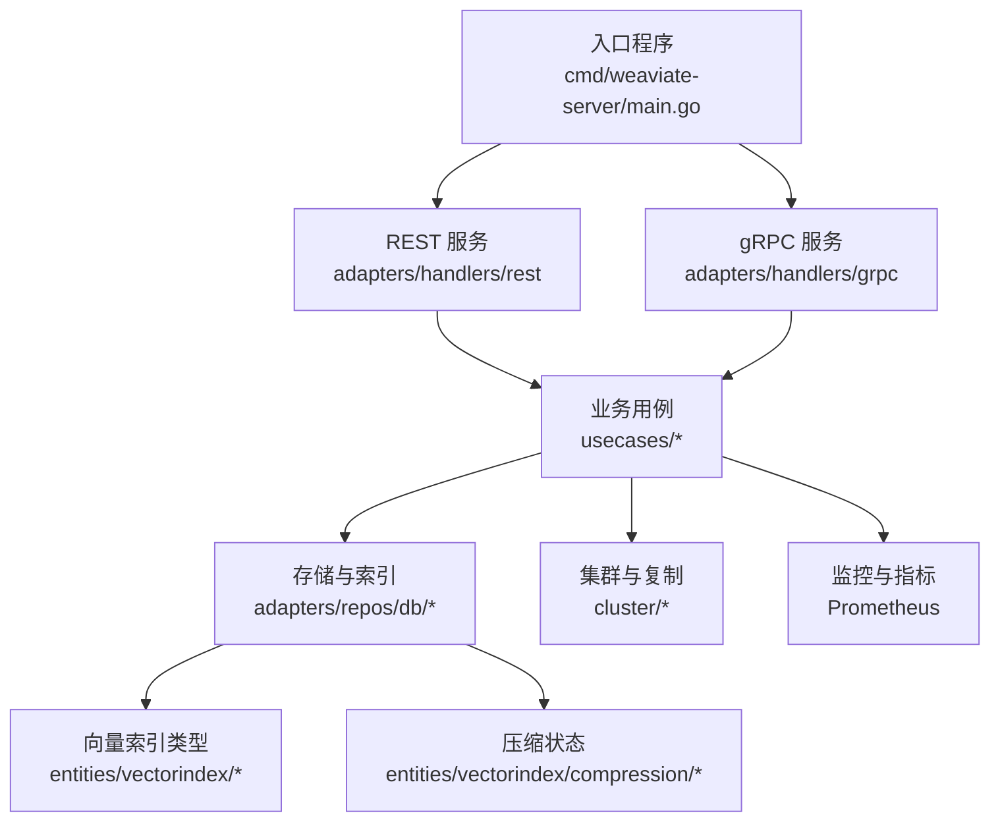
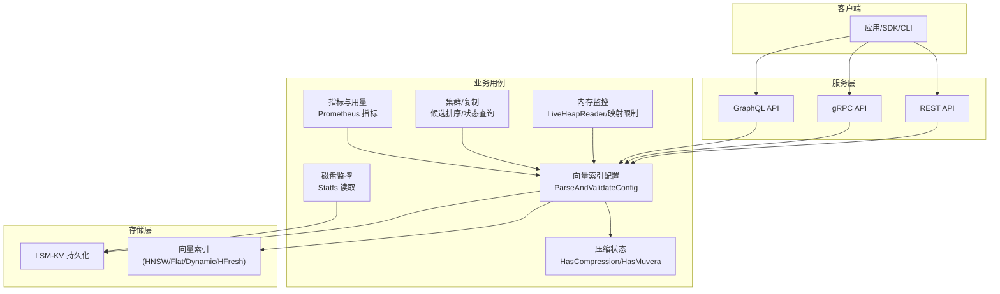
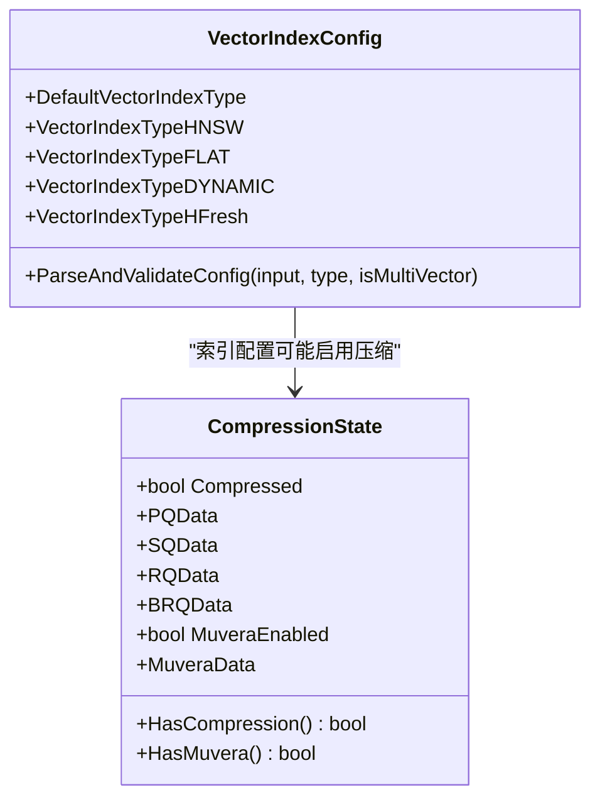
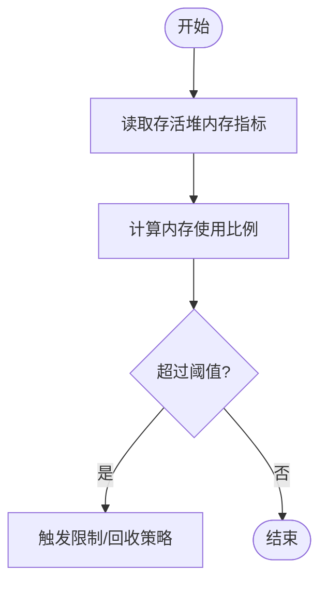
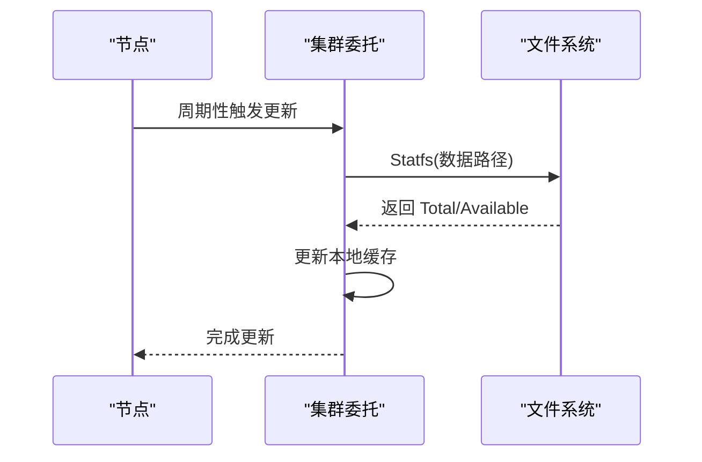
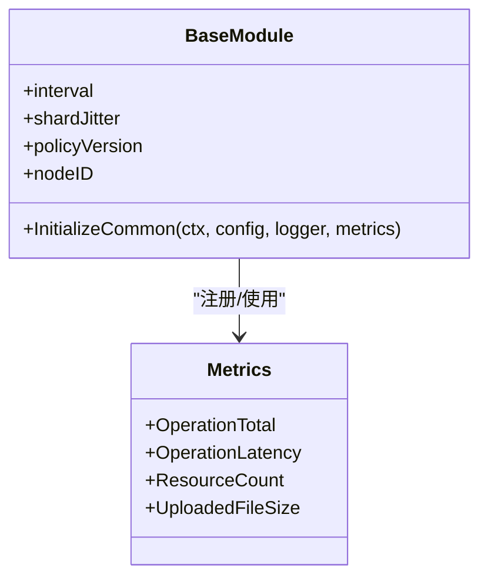
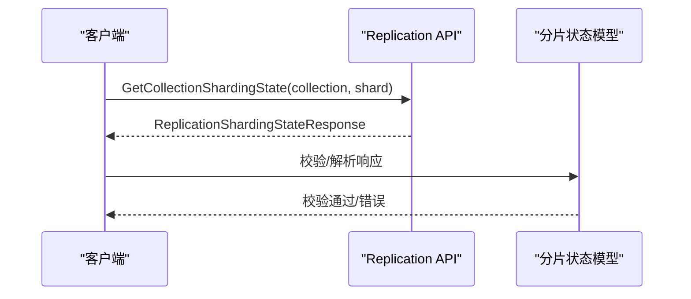
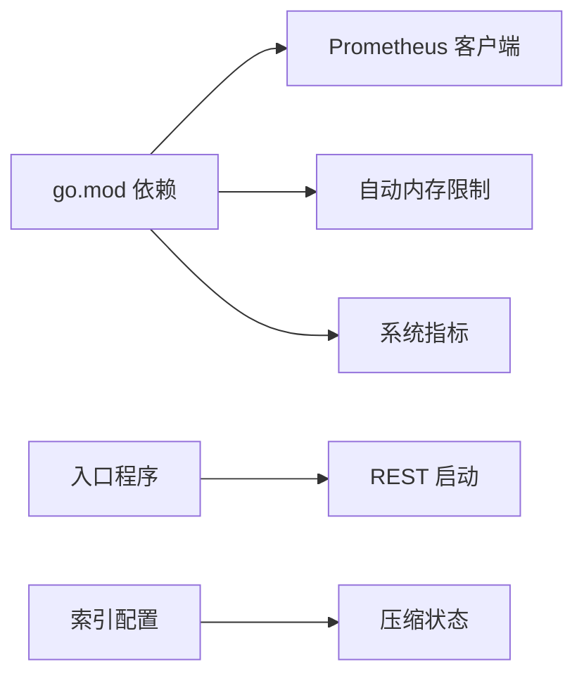

# 容量规划

<cite>
**本文引用的文件**
- [README.md](file://README.md)
- [go.mod](file://go.mod)
- [cmd/weaviate-server/main.go](file://cmd/weaviate-server/main.go)
- [entities/config/helpers.go](file://entities/config/helpers.go)
- [entities/vectorindex/config.go](file://entities/vectorindex/config.go)
- [entities/vectorindex/compression/state.go](file://entities/vectorindex/compression/state.go)
- [adapters/repos/db/vector/hnsw/compress_recall_test.go](file://adapters/repos/db/vector/hnsw/compress_recall_test.go)
- [adapters/repos/db/vector/hnsw/compress_test.go](file://adapters/repos/db/vector/hnsw/compress_test.go)
- [adapters/repos/db/metrics.go](file://adapters/repos/db/metrics.go)
- [adapters/repos/db/vector/hfresh/metrics.go](file://adapters/repos/db/vector/hfresh/metrics.go)
- [usecases/memwatch/monitor.go](file://usecases/memwatch/monitor.go)
- [usecases/memwatch/monitor_test.go](file://usecases/memwatch/monitor_test.go)
- [usecases/cluster/disk_use_unix.go](file://usecases/cluster/disk_use_unix.go)
- [adapters/repos/db/disk_use_unix.go](file://adapters/repos/db/disk_use_unix.go)
- [usecases/cluster/delegate.go](file://usecases/cluster/delegate.go)
- [usecases/modulecomponents/usage/base_module.go](file://usecases/modulecomponents/usage/base_module.go)
- [usecases/modulecomponents/usage/metrics.go](file://usecases/modulecomponents/usage/metrics.go)
- [entities/models/replication_sharding_state_response.go](file://entities/models/replication_sharding_state_response.go)
- [test/acceptance/replication/replica_replication/fast/endpoints_test.go](file://test/acceptance/replication/replica_replication/fast/endpoints_test.go)
</cite>

## 目录
1. 引言
2. 项目结构
3. 核心组件
4. 架构总览
5. 详细组件分析
6. 依赖关系分析
7. 性能考量
8. 故障排查指南
9. 结论
10. 附录

## 引言
本指南面向系统架构师与运维工程师，围绕 Weaviate 的资源需求评估、扩展策略、成本优化、监控与容量预测等主题，提供可操作的规划与管理建议。Weaviate 是一个云原生向量数据库，具备水平扩展、复制、多租户、向量压缩等能力，适合在生产环境中承载大规模语义搜索与 RAG 场景。

## 项目结构
Weaviate 采用模块化与分层架构：入口程序负责启动 REST/gRPC/GraphQL 服务；核心业务逻辑分布在 usecases、adapters、entities 等目录；存储与索引实现位于 adapters/repos/db 及其子包；监控与指标通过 Prometheus 暴露；集群与复制状态由 cluster 与 replication 子系统管理。

图表来源
- [cmd/weaviate-server/main.go](file://cmd/weaviate-server/main.go#L30-L68)
- [adapters/repos/db/metrics.go](file://adapters/repos/db/metrics.go#L1-L50)
- [entities/vectorindex/config.go](file://entities/vectorindex/config.go#L24-L51)

章节来源
- [README.md](file://README.md#L10-L128)
- [go.mod](file://go.mod#L1-L106)

## 核心组件
- 服务入口与协议栈
  - 入口程序加载 Swagger 规范并启动 REST 服务，支持命令行参数解析与服务生命周期管理。
- 向量索引与压缩
  - 支持 HNSW、Flat、Dynamic、HFresh 等索引类型；压缩状态包含 PQ/SQ/RQ/BinaryRotational 与 Muvera 多向量编码。
- 内存与映射监控
  - 提供实时堆内存读取、最大映射数限制与保留机制，保障运行时稳定性。
- 存储空间监控
  - 通过系统调用读取磁盘总量与可用空间，用于容量评估与告警。
- 集群与复制
  - 节点候选排序、磁盘使用更新、复制/分片状态查询等能力支撑横向扩展与高可用。
- 指标与用量上报
  - Prometheus 指标定义与采集间隔、抖动间隔、资源计数与上传大小等，便于容量预测与成本优化。

章节来源
- [cmd/weaviate-server/main.go](file://cmd/weaviate-server/main.go#L30-L68)
- [entities/vectorindex/config.go](file://entities/vectorindex/config.go#L24-L51)
- [entities/vectorindex/compression/state.go](file://entities/vectorindex/compression/state.go#L14-L53)
- [usecases/memwatch/monitor.go](file://usecases/memwatch/monitor.go#L236-L282)
- [usecases/cluster/disk_use_unix.go](file://usecases/cluster/disk_use_unix.go#L20-L32)
- [adapters/repos/db/disk_use_unix.go](file://adapters/repos/db/disk_use_unix.go#L20-L35)
- [usecases/cluster/delegate.go](file://usecases/cluster/delegate.go#L259-L297)
- [usecases/modulecomponents/usage/metrics.go](file://usecases/modulecomponents/usage/metrics.go#L27-L64)

## 架构总览
下图展示 Weaviate 在资源管理与容量规划中的关键交互：客户端请求经 REST/gRPC/GraphQL 到达服务层；业务用例根据配置选择向量索引与压缩策略；存储层负责 LSM-KV、向量索引持久化与磁盘使用统计；监控模块暴露指标并参与容量预测与预警。

图表来源
- [cmd/weaviate-server/main.go](file://cmd/weaviate-server/main.go#L30-L68)
- [entities/vectorindex/config.go](file://entities/vectorindex/config.go#L32-L51)
- [entities/vectorindex/compression/state.go](file://entities/vectorindex/compression/state.go#L39-L53)
- [usecases/memwatch/monitor.go](file://usecases/memwatch/monitor.go#L255-L266)
- [usecases/cluster/disk_use_unix.go](file://usecases/cluster/disk_use_unix.go#L20-L32)
- [adapters/repos/db/disk_use_unix.go](file://adapters/repos/db/disk_use_unix.go#L20-L35)
- [usecases/cluster/delegate.go](file://usecases/cluster/delegate.go#L259-L297)
- [usecases/modulecomponents/usage/metrics.go](file://usecases/modulecomponents/usage/metrics.go#L27-L64)

## 详细组件分析

### 向量索引与压缩配置
- 索引类型解析与校验：支持 HNSW、Flat、Dynamic、HFresh，默认类型为 HNSW。
- 压缩状态：包含压缩开关、PQ/SQ/RQ/BinaryRotational 数据以及 Muvera 多向量编码开关；提供 HasCompression/HasMuvera 辅助判断。
- 压缩流程与回归测试：包含压缩前后的检索一致性验证与并发添加流程，确保压缩不显著影响召回率。

图表来源
- [entities/vectorindex/config.go](file://entities/vectorindex/config.go#L24-L51)
- [entities/vectorindex/compression/state.go](file://entities/vectorindex/compression/state.go#L14-L53)

章节来源
- [entities/vectorindex/config.go](file://entities/vectorindex/config.go#L32-L51)
- [entities/vectorindex/compression/state.go](file://entities/vectorindex/compression/state.go#L14-L53)
- [adapters/repos/db/vector/hnsw/compress_recall_test.go](file://adapters/repos/db/vector/hnsw/compress_recall_test.go#L83-L116)
- [adapters/repos/db/vector/hnsw/compress_test.go](file://adapters/repos/db/vector/hnsw/compress_test.go#L245-L287)

### 内存与映射监控
- 实时堆内存读取：通过内部指标采样获取当前存活堆字节，作为内存占用评估依据。
- 最大映射数限制：从 Linux 系统读取 max_map_count，并预留安全余量；支持环境变量覆盖。
- 映射保留与清理：提供映射保留与超时清理逻辑，避免并发场景下的映射耗尽。

图表来源
- [usecases/memwatch/monitor.go](file://usecases/memwatch/monitor.go#L255-L266)
- [usecases/memwatch/monitor.go](file://usecases/memwatch/monitor.go#L236-L253)
- [usecases/memwatch/monitor_test.go](file://usecases/memwatch/monitor_test.go#L88-L150)

章节来源
- [usecases/memwatch/monitor.go](file://usecases/memwatch/monitor.go#L236-L282)
- [usecases/memwatch/monitor_test.go](file://usecases/memwatch/monitor_test.go#L88-L306)

### 存储空间监控
- 磁盘使用统计：通过 Statfs 获取总空间、可用空间，用于容量评估与告警。
- 集群节点磁盘更新：周期性更新本地磁盘使用情况，排序候选节点时考虑空闲空间差异。

图表来源
- [usecases/cluster/delegate.go](file://usecases/cluster/delegate.go#L279-L297)
- [usecases/cluster/disk_use_unix.go](file://usecases/cluster/disk_use_unix.go#L20-L32)
- [adapters/repos/db/disk_use_unix.go](file://adapters/repos/db/disk_use_unix.go#L20-L35)

章节来源
- [usecases/cluster/disk_use_unix.go](file://usecases/cluster/disk_use_unix.go#L20-L32)
- [adapters/repos/db/disk_use_unix.go](file://adapters/repos/db/disk_use_unix.go#L20-L35)
- [usecases/cluster/delegate.go](file://usecases/cluster/delegate.go#L259-L297)

### 指标与用量上报
- 指标命名规范：统一以 weaviate_{module}_ 前缀，包含操作总数、延迟直方图、资源数量、上传文件大小等。
- 采集与抖动：支持采集间隔与分片抖动间隔配置，避免集中采集导致的尖峰。
- 用量模块初始化：校验集群主机名、版本策略、权限验证开关等。

图表来源
- [usecases/modulecomponents/usage/metrics.go](file://usecases/modulecomponents/usage/metrics.go#L27-L64)
- [usecases/modulecomponents/usage/base_module.go](file://usecases/modulecomponents/usage/base_module.go#L83-L124)

章节来源
- [usecases/modulecomponents/usage/metrics.go](file://usecases/modulecomponents/usage/metrics.go#L27-L64)
- [usecases/modulecomponents/usage/base_module.go](file://usecases/modulecomponents/usage/base_module.go#L83-L124)

### 分片与复制状态
- 分片状态模型：提供分片状态响应模型，支持上下文校验与序列化。
- 端到端测试：验证获取集合与分片的分片状态、副本数量与集合名称等。

图表来源
- [entities/models/replication_sharding_state_response.go](file://entities/models/replication_sharding_state_response.go#L44-L97)
- [test/acceptance/replication/replica_replication/fast/endpoints_test.go](file://test/acceptance/replication/replica_replication/fast/endpoints_test.go#L101-L121)

章节来源
- [entities/models/replication_sharding_state_response.go](file://entities/models/replication_sharding_state_response.go#L44-L97)
- [test/acceptance/replication/replica_replication/fast/endpoints_test.go](file://test/acceptance/replication/replica_replication/fast/endpoints_test.go#L101-L121)

## 依赖关系分析
- 外部依赖与监控
  - Prometheus 客户端与通用指标库被广泛使用，用于暴露运行时指标。
  - 自动内存限制库与系统级指标库用于资源感知与限制。
- 服务启动与协议
  - Swagger 加载与 flags 解析用于 REST 服务启动与参数注入。
- 向量索引与压缩
  - 索引类型解析与压缩状态结构体为容量规划提供配置与状态依据。

图表来源
- [go.mod](file://go.mod#L69-L106)
- [cmd/weaviate-server/main.go](file://cmd/weaviate-server/main.go#L30-L68)
- [entities/vectorindex/config.go](file://entities/vectorindex/config.go#L32-L51)
- [entities/vectorindex/compression/state.go](file://entities/vectorindex/compression/state.go#L14-L53)

章节来源
- [go.mod](file://go.mod#L1-L106)
- [cmd/weaviate-server/main.go](file://cmd/weaviate-server/main.go#L30-L68)
- [entities/vectorindex/config.go](file://entities/vectorindex/config.go#L32-L51)
- [entities/vectorindex/compression/state.go](file://entities/vectorindex/compression/state.go#L14-L53)

## 性能考量
- 索引类型选择
  - HNSW 适合大规模高维向量的近似最近邻搜索；Flat 适合小规模或对精度要求极高的场景；Dynamic/HFresh 适配不同数据分布与查询模式。
- 压缩策略
  - 启用 PQ/SQ/RQ/BinaryRotational 或 Muvera 编码可显著降低内存与存储占用，需结合召回率回归测试评估影响。
- 内存与映射
  - 通过实时堆内存读取与映射上限控制，避免 OOM 与映射耗尽；合理设置阈值与回收策略。
- 存储与磁盘
  - 周期性读取磁盘使用并进行节点排序，有助于均衡写入与查询负载，防止单点过载。

章节来源
- [entities/vectorindex/config.go](file://entities/vectorindex/config.go#L24-L51)
- [adapters/repos/db/vector/hnsw/compress_test.go](file://adapters/repos/db/vector/hnsw/compress_test.go#L245-L287)
- [usecases/memwatch/monitor.go](file://usecases/memwatch/monitor.go#L236-L282)
- [usecases/cluster/delegate.go](file://usecases/cluster/delegate.go#L259-L297)

## 故障排查指南
- 内存相关
  - 若出现内存使用过高或映射不足，检查环境变量与系统限制；确认映射保留与清理逻辑是否生效。
- 存储相关
  - 当磁盘空间不足或节点空闲空间差异过大，调整写入策略或扩容节点；核对 Statfs 读取是否成功。
- 指标缺失
  - 若指标未暴露，检查模块初始化与注册流程，确认采集间隔与抖动配置有效。

章节来源
- [usecases/memwatch/monitor_test.go](file://usecases/memwatch/monitor_test.go#L88-L306)
- [usecases/cluster/disk_use_unix.go](file://usecases/cluster/disk_use_unix.go#L20-L32)
- [adapters/repos/db/disk_use_unix.go](file://adapters/repos/db/disk_use_unix.go#L20-L35)
- [usecases/modulecomponents/usage/base_module.go](file://usecases/modulecomponents/usage/base_module.go#L83-L124)

## 结论
Weaviate 的容量规划应综合考虑向量索引类型、压缩策略、内存与映射限制、磁盘空间与集群节点分布，并通过 Prometheus 指标与分片/复制状态进行持续观测与预警。合理的资源配置与弹性伸缩策略可显著提升成本效益与系统稳定性。

## 附录

### 资源需求评估方法与公式（概念性）
- CPU
  - 查询 QPS × 单查询 CPU 时延 × 并发系数 × 安全系数
- 内存
  - 向量维度 × 向量数量 × 单向量字节数（含压缩）× 索引开销 × 安全系数
- 存储
  - 向量存储 × 压缩比 × 索引存储 × 元数据与日志 × 安全系数
- 网络带宽
  - 写入吞吐 × 单对象大小 × 压缩比 × 复制因子 × 安全系数

说明：上述公式为概念性模板，实际数值需结合具体索引类型、压缩配置与业务负载进行实测与校准。

### 扩展策略制定
- 垂直扩展
  - 优先提升 CPU/内存规格，适用于短期峰值或索引类型切换带来的资源压力。
- 水平扩展
  - 通过分片与复制增加节点，均衡查询与写入负载；结合磁盘使用与节点排序策略进行调度。

### 成本优化策略
- 资源配置优化
  - 根据指标趋势动态调整实例规格与副本数，避免过度预留。
- 存储压缩
  - 启用向量压缩与多向量编码，在保证召回的前提下降低内存与存储成本。
- 按需付费
  - 在云环境中结合自动伸缩与预留实例，平衡成本与性能。

### 监控指标分析
- 资源利用率
  - CPU/内存/磁盘/网络的实时与历史趋势，结合阈值与告警联动。
- 性能瓶颈识别
  - 关注查询延迟、写入堆积、索引压缩耗时、映射保留失败等信号。
- 容量预警机制
  - 基于磁盘使用与内存映射的阈值告警，提前扩容或回收。

### 容量预测模型
- 数据增长趋势
  - 基于对象数量、向量维度、压缩比与日增写入量的趋势拟合。
- 未来需求估算
  - 结合业务增长预期与 SLA 要求，叠加安全系数与扩展窗口，得出容量规划目标。

### 资源池管理与弹性伸缩
- 资源池
  - 将节点按资源池划分，区分生产/测试/离线任务，避免互相干扰。
- 弹性伸缩
  - 结合查询负载与磁盘使用，自动增减节点；确保分片与复制状态稳定。