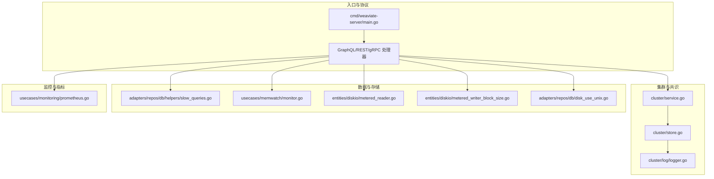
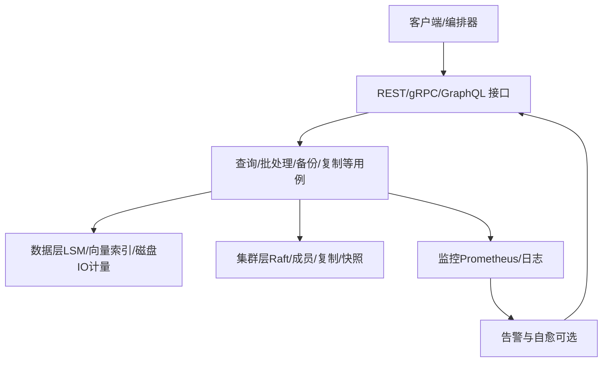
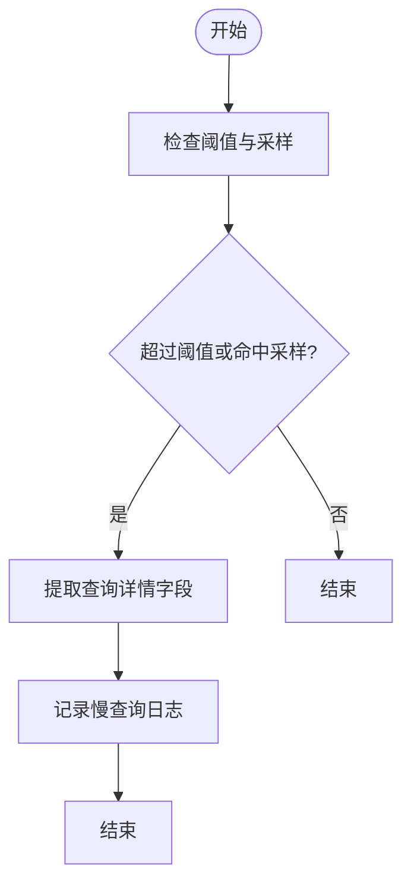
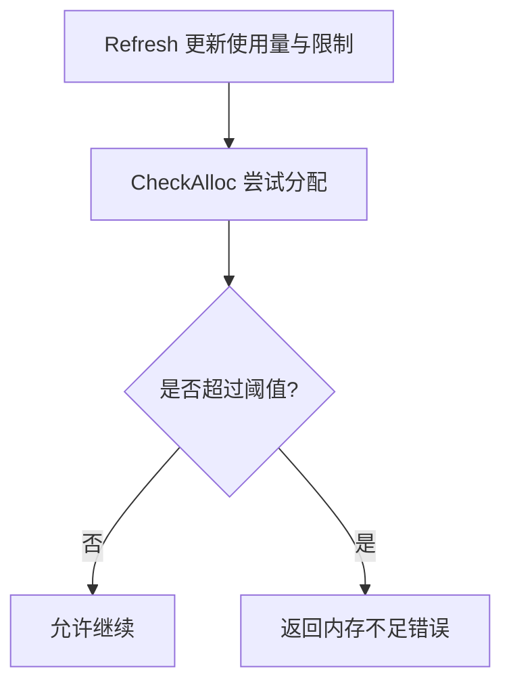
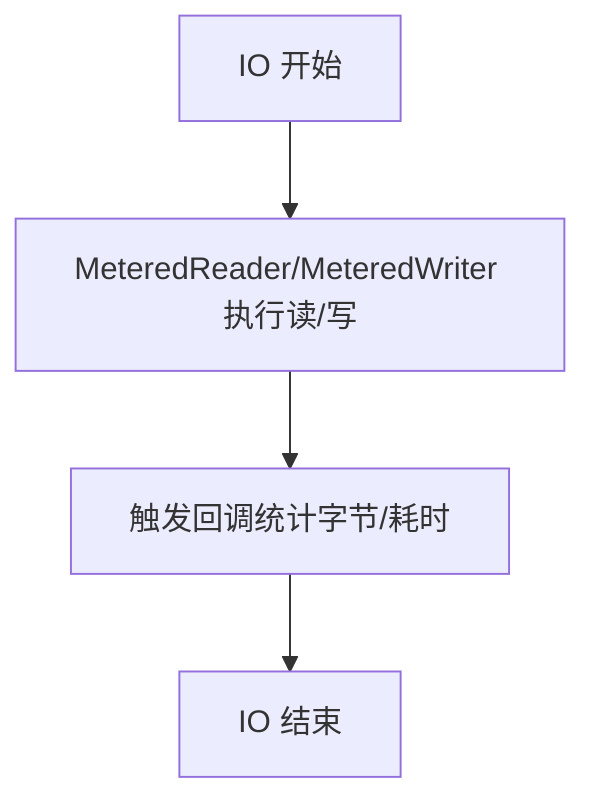
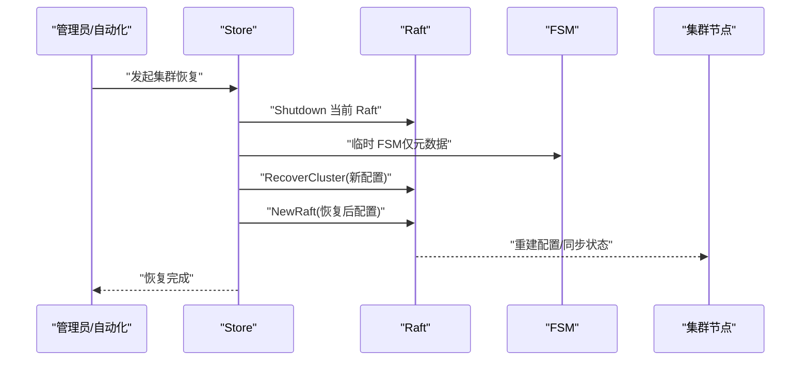
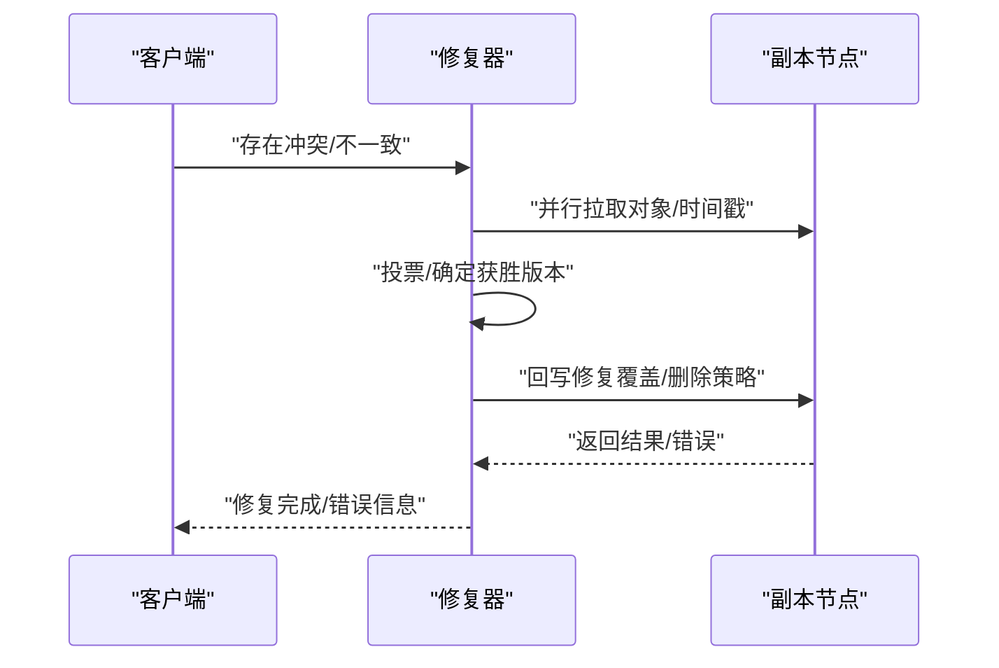
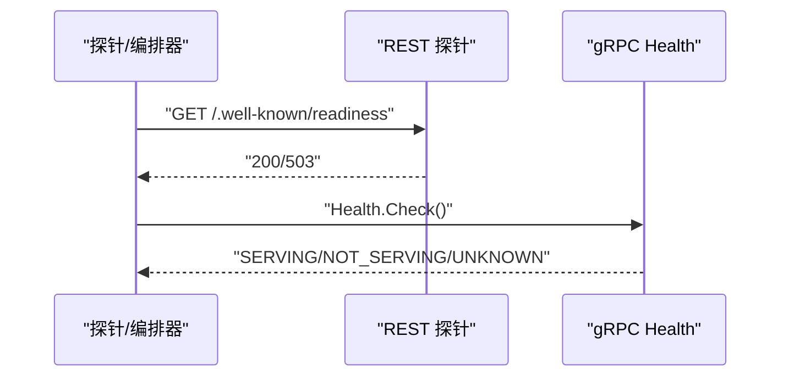
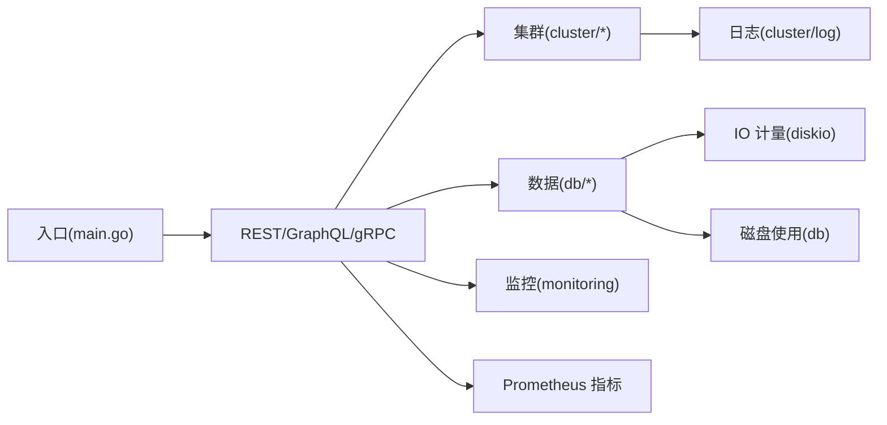

# 故障排除

<cite>
**本文引用的文件**
- [README.md](file://README.md)
- [cmd/weaviate-server/main.go](file://cmd/weaviate-server/main.go)
- [cluster/service.go](file://cluster/service.go)
- [cluster/store.go](file://cluster/store.go)
- [cluster/log/logger.go](file://cluster/log/logger.go)
- [entities/errors/error_group_wrapper.go](file://entities/errors/error_group_wrapper.go)
- [entities/errors/go_wrapper_test.go](file://entities/errors/go_wrapper_test.go)
- [adapters/repos/db/helpers/slow_queries.go](file://adapters/repos/db/helpers/slow_queries.go)
- [usecases/memwatch/monitor.go](file://usecases/memwatch/monitor.go)
- [usecases/memwatch/monitor_test.go](file://usecases/memwatch/monitor_test.go)
- [entities/diskio/metered_reader.go](file://entities/diskio/metered_reader.go)
- [entities/diskio/metered_writer_block_size.go](file://entities/diskio/metered_writer_block_size.go)
- [adapters/repos/db/disk_use_unix.go](file://adapters/repos/db/disk_use_unix.go)
- [usecases/cluster/state_test.go](file://usecases/cluster/state_test.go)
- [cluster/backoff_test.go](file://cluster/backoff_test.go)
- [usecases/monitoring/prometheus.go](file://usecases/monitoring/prometheus.go)
- [client/operations/weaviate_wellknown_readiness_responses.go](file://client/operations/weaviate_wellknown_readiness_responses.go)
- [client/operations/weaviate_wellknown_liveness_responses.go](file://client/operations/weaviate_wellknown_liveness_responses.go)
- [grpc/generated/protocol/v1/health_weaviate.pb.go](file://grpc/generated/protocol/v1/health_weaviate.pb.go)
- [usecases/replica/repairer.go](file://usecases/replica/repairer.go)
- [usecases/replica/repairer_test.go](file://usecases/replica/repairer_test.go)
- [test/acceptance/replication/replica_replication/fast/mutating_data_test.go](file://test/acceptance/replication/replica_replication/fast/mutating_data_test.go)
- [test/acceptance/schema/update_class_async_replication_test.go](file://test/acceptance/schema/update_class_async_replication_test.go)
- [entities/config/helpers.go](file://entities/config/helpers.go)
</cite>

## 目录
1. [简介](#简介)
2. [项目结构](#项目结构)
3. [核心组件](#核心组件)
4. [架构总览](#架构总览)
5. [详细组件分析](#详细组件分析)
6. [依赖关系分析](#依赖关系分析)
7. [性能考量](#性能考量)
8. [故障排查指南](#故障排查指南)
9. [结论](#结论)
10. [附录](#附录)

## 简介
本指南面向技术支持工程师与运维人员，提供 Weaviate 在生产环境中的系统化故障排除手册。内容覆盖集群节点故障、数据不一致、性能退化、Raft 协议异常、错误日志分析、应急响应流程以及预防性维护与演练方案。文档以仓库现有实现为依据，结合关键模块的源码路径，帮助快速定位与解决问题。

## 项目结构
Weaviate 采用分层与功能域结合的组织方式：
- 顶层入口负责启动 REST/gRPC 服务与参数解析
- 集群子系统实现 Raft 分布式一致性、成员管理、复制与快照
- 数据层包含 LSM-树索引、向量索引、备份与磁盘 IO 计量
- 监控与指标导出贯穿各子系统，便于故障定位与容量规划
- 测试用例覆盖复制一致性、异步复制配置、健康检查等关键行为

**图表来源**
- [cmd/weaviate-server/main.go](file://cmd/weaviate-server/main.go#L30-L66)
- [cluster/service.go](file://cluster/service.go#L46-L70)
- [cluster/store.go](file://cluster/store.go#L735-L770)
- [cluster/log/logger.go](file://cluster/log/logger.go#L104-L139)
- [adapters/repos/db/helpers/slow_queries.go](file://adapters/repos/db/helpers/slow_queries.go#L52-L95)
- [usecases/memwatch/monitor.go](file://usecases/memwatch/monitor.go#L62-L105)
- [entities/diskio/metered_reader.go](file://entities/diskio/metered_reader.go#L1-L68)
- [entities/diskio/metered_writer_block_size.go](file://entities/diskio/metered_writer_block_size.go#L1-L59)
- [adapters/repos/db/disk_use_unix.go](file://adapters/repos/db/disk_use_unix.go#L1-L35)
- [usecases/monitoring/prometheus.go](file://usecases/monitoring/prometheus.go#L23-L36)

**章节来源**
- [README.md](file://README.md#L1-L181)
- [cmd/weaviate-server/main.go](file://cmd/weaviate-server/main.go#L30-L66)

## 核心组件
- 服务入口与生命周期：负责加载 Swagger 规范、初始化 REST 服务、解析命令行参数并启动服务。
- 集群服务与 Raft：封装 Raft 层，协调复制引擎、RPC 客户端/服务端、日志与配置。
- 慢查询检测：基于阈值与采样输出慢查询日志，辅助定位热点查询。
- 内存监控：动态监测堆内存与映射数，防止 OOM 与映射耗尽。
- 磁盘 IO 计量：对读写进行字节与耗时统计，辅助 IO 性能分析。
- 健康检查与就绪探针：提供 Liveness/Readiness 与 gRPC Health 接口，用于容器编排与外部探测。
- 监控指标：集中暴露查询、批处理、LSM、向量索引、备份恢复、租户离线等指标。

**章节来源**
- [cmd/weaviate-server/main.go](file://cmd/weaviate-server/main.go#L30-L66)
- [cluster/service.go](file://cluster/service.go#L46-L70)
- [adapters/repos/db/helpers/slow_queries.go](file://adapters/repos/db/helpers/slow_queries.go#L52-L95)
- [usecases/memwatch/monitor.go](file://usecases/memwatch/monitor.go#L62-L105)
- [entities/diskio/metered_reader.go](file://entities/diskio/metered_reader.go#L1-L68)
- [entities/diskio/metered_writer_block_size.go](file://entities/diskio/metered_writer_block_size.go#L1-L59)
- [usecases/monitoring/prometheus.go](file://usecases/monitoring/prometheus.go#L23-L36)

## 架构总览
Weaviate 的故障排除围绕“可观测性—定位—处置—验证”的闭环展开。入口层负责对外服务；集群层负责一致性与复制；数据层负责存储与 IO；监控层提供指标与日志。

[本图为概念性架构示意，不直接映射具体源码文件，故无图表来源]

## 详细组件分析

### 慢查询检测与性能基线
- 慢查询检测器根据阈值与采样策略输出日志，便于识别长尾请求。
- 可结合 Prometheus 查询时延指标与并发协程数，定位热点与并发瓶颈。

**图表来源**
- [adapters/repos/db/helpers/slow_queries.go](file://adapters/repos/db/helpers/slow_queries.go#L52-L95)
- [usecases/monitoring/prometheus.go](file://usecases/monitoring/prometheus.go#L499-L512)

**章节来源**
- [adapters/repos/db/helpers/slow_queries.go](file://adapters/repos/db/helpers/slow_queries.go#L52-L95)
- [usecases/monitoring/prometheus.go](file://usecases/monitoring/prometheus.go#L499-L512)

### 内存监控与泄漏防护
- 监控器周期刷新内存使用与限制，并在分配超过阈值时返回内存不足错误。
- 支持 Linux 下最大映射数读取与安全预留，避免映射耗尽导致的异常。

**图表来源**
- [usecases/memwatch/monitor.go](file://usecases/memwatch/monitor.go#L62-L105)
- [usecases/memwatch/monitor.go](file://usecases/memwatch/monitor.go#L236-L253)

**章节来源**
- [usecases/memwatch/monitor.go](file://usecases/memwatch/monitor.go#L62-L105)
- [usecases/memwatch/monitor_test.go](file://usecases/memwatch/monitor_test.go#L46-L96)

### 磁盘 IO 计量与空间不足排查
- 读写器包装器在成功读写后回调统计函数，记录字节数与耗时。
- Unix 平台通过系统调用读取磁盘总量/可用空间，用于空间预警与清理策略。

**图表来源**
- [entities/diskio/metered_reader.go](file://entities/diskio/metered_reader.go#L1-L68)
- [entities/diskio/metered_writer_block_size.go](file://entities/diskio/metered_writer_block_size.go#L1-L59)
- [adapters/repos/db/disk_use_unix.go](file://adapters/repos/db/disk_use_unix.go#L1-L35)

**章节来源**
- [entities/diskio/metered_reader.go](file://entities/diskio/metered_reader.go#L1-L68)
- [entities/diskio/metered_writer_block_size.go](file://entities/diskio/metered_writer_block_size.go#L1-L59)
- [adapters/repos/db/disk_use_unix.go](file://adapters/repos/db/disk_use_unix.go#L1-L35)

### 集群与 Raft：节点失联、复制异常与恢复
- 集群服务封装 Raft、复制引擎、RPC 客户端/服务端与日志。
- Store 中配置 Raft 超时、心跳、任期与快照参数，支持集群恢复流程。
- Memberlist/WAN/LAN 配置与超时倍数影响选举与失败检测灵敏度。
- 回退策略根据选举超时动态设置初始/最大等待时间，提升稳定性。

**图表来源**
- [cluster/service.go](file://cluster/service.go#L46-L70)
- [cluster/store.go](file://cluster/store.go#L735-L770)
- [cluster/store.go](file://cluster/store.go#L887-L930)
- [usecases/cluster/state_test.go](file://usecases/cluster/state_test.go#L376-L454)
- [cluster/backoff_test.go](file://cluster/backoff_test.go#L23-L53)

**章节来源**
- [cluster/service.go](file://cluster/service.go#L46-L70)
- [cluster/store.go](file://cluster/store.go#L735-L770)
- [cluster/store.go](file://cluster/store.go#L887-L930)
- [usecases/cluster/state_test.go](file://usecases/cluster/state_test.go#L376-L454)
- [cluster/backoff_test.go](file://cluster/backoff_test.go#L23-L53)

### 复制一致性与修复流程
- 修复器在多副本冲突时进行投票、拉取最新版本并回写修复。
- 支持删除冲突策略与时间戳优先策略，保障最终一致性。
- 测试覆盖异步复制配置更新与变更期间的数据修改场景。

**图表来源**
- [usecases/replica/repairer.go](file://usecases/replica/repairer.go#L101-L149)
- [usecases/replica/repairer_test.go](file://usecases/replica/repairer_test.go#L517-L563)
- [test/acceptance/replication/replica_replication/fast/mutating_data_test.go](file://test/acceptance/replication/replica_replication/fast/mutating_data_test.go#L36-L42)
- [test/acceptance/schema/update_class_async_replication_test.go](file://test/acceptance/schema/update_class_async_replication_test.go#L93-L142)

**章节来源**
- [usecases/replica/repairer.go](file://usecases/replica/repairer.go#L101-L149)
- [usecases/replica/repairer_test.go](file://usecases/replica/repairer_test.go#L517-L563)
- [test/acceptance/replication/replica_replication/fast/mutating_data_test.go](file://test/acceptance/replication/replica_replication/fast/mutating_data_test.go#L36-L42)
- [test/acceptance/schema/update_class_async_replication_test.go](file://test/acceptance/schema/update_class_async_replication_test.go#L93-L142)

### 健康检查与就绪状态
- 提供 Liveness/Readiness 与 gRPC Health 接口，便于容器编排与外部探测。
- Readiness/ Liveness 响应类型定义清晰，便于自动化脚本判断服务状态。

**图表来源**
- [client/operations/weaviate_wellknown_readiness_responses.go](file://client/operations/weaviate_wellknown_readiness_responses.go#L31-L67)
- [client/operations/weaviate_wellknown_liveness_responses.go](file://client/operations/weaviate_wellknown_liveness_responses.go#L83-L99)
- [grpc/generated/protocol/v1/health_weaviate.pb.go](file://grpc/generated/protocol/v1/health_weaviate.pb.go#L68-L107)

**章节来源**
- [client/operations/weaviate_wellknown_readiness_responses.go](file://client/operations/weaviate_wellknown_readiness_responses.go#L31-L67)
- [client/operations/weaviate_wellknown_liveness_responses.go](file://client/operations/weaviate_wellknown_liveness_responses.go#L83-L99)
- [grpc/generated/protocol/v1/health_weaviate.pb.go](file://grpc/generated/protocol/v1/health_weaviate.pb.go#L68-L107)

## 依赖关系分析
- 入口层依赖 REST/GraphQL/gRPC 处理器，后者进一步依赖集群与数据层。
- 集群层依赖 Raft、RPC、日志与配置；数据层依赖 IO 计量与磁盘使用。
- 监控层贯穿全链路，提供查询、批处理、LSM、向量索引等指标。

**图表来源**
- [cmd/weaviate-server/main.go](file://cmd/weaviate-server/main.go#L30-L66)
- [cluster/service.go](file://cluster/service.go#L46-L70)
- [cluster/log/logger.go](file://cluster/log/logger.go#L104-L139)
- [usecases/monitoring/prometheus.go](file://usecases/monitoring/prometheus.go#L23-L36)

**章节来源**
- [cmd/weaviate-server/main.go](file://cmd/weaviate-server/main.go#L30-L66)
- [cluster/service.go](file://cluster/service.go#L46-L70)
- [cluster/log/logger.go](file://cluster/log/logger.go#L104-L139)
- [usecases/monitoring/prometheus.go](file://usecases/monitoring/prometheus.go#L23-L36)

## 性能考量
- 查询性能：结合慢查询日志与查询时延指标，定位热点类/分片与高并发时段。
- 批处理与 IO：关注批处理时延、LSM 段数量与大小、磁盘 IO 读写耗时。
- 内存与映射：设置合理内存上限与映射数阈值，避免 OOM 与映射耗尽。
- Raft 参数：根据网络环境调整心跳/选举/任期与超时倍数，平衡一致性与可用性。

[本节为通用指导，不直接分析具体文件，故无章节来源]

## 故障排查指南

### 一、常见问题诊断方法
- 集群节点故障
  - 使用健康检查接口确认节点存活与就绪状态
  - 查看集群日志与 Raft 日志，定位节点加入/离开与领导者变更
  - 检查 Memberlist/WAN/LAN 配置与超时倍数
- 数据不一致
  - 使用修复器流程对比时间戳与内容，回写修复
  - 关注异步复制配置与冲突策略
- 性能下降
  - 慢查询日志与查询时延指标定位热点
  - 批处理与 IO 指标识别瓶颈
  - 内存与映射监控防止资源耗尽

**章节来源**
- [client/operations/weaviate_wellknown_readiness_responses.go](file://client/operations/weaviate_wellknown_readiness_responses.go#L31-L67)
- [client/operations/weaviate_wellknown_liveness_responses.go](file://client/operations/weaviate_wellknown_liveness_responses.go#L83-L99)
- [grpc/generated/protocol/v1/health_weaviate.pb.go](file://grpc/generated/protocol/v1/health_weaviate.pb.go#L68-L107)
- [cluster/log/logger.go](file://cluster/log/logger.go#L104-L139)
- [usecases/cluster/state_test.go](file://usecases/cluster/state_test.go#L376-L454)
- [usecases/replica/repairer.go](file://usecases/replica/repairer.go#L101-L149)
- [adapters/repos/db/helpers/slow_queries.go](file://adapters/repos/db/helpers/slow_queries.go#L52-L95)
- [usecases/monitoring/prometheus.go](file://usecases/monitoring/prometheus.go#L499-L512)
- [usecases/memwatch/monitor.go](file://usecases/memwatch/monitor.go#L62-L105)

### 二、性能问题排查流程
- 查询慢
  - 步骤：启用慢查询日志、采集查询时延与并发指标、定位类/分片热点
  - 工具：慢查询日志、查询时延指标、并发协程数
- 内存泄漏
  - 步骤：观察堆内存使用与限制、检查分配阈值触发点、核对映射数
  - 工具：内存监控、映射数阈值、环境变量开关
- 磁盘空间不足
  - 步骤：读取磁盘总量/可用空间、监控 IO 耗时、清理过期数据
  - 工具：磁盘使用统计、IO 计量

**章节来源**
- [adapters/repos/db/helpers/slow_queries.go](file://adapters/repos/db/helpers/slow_queries.go#L52-L95)
- [usecases/monitoring/prometheus.go](file://usecases/monitoring/prometheus.go#L499-L512)
- [usecases/memwatch/monitor.go](file://usecases/memwatch/monitor.go#L62-L105)
- [usecases/memwatch/monitor_test.go](file://usecases/memwatch/monitor_test.go#L46-L96)
- [entities/diskio/metered_reader.go](file://entities/diskio/metered_reader.go#L1-L68)
- [entities/diskio/metered_writer_block_size.go](file://entities/diskio/metered_writer_block_size.go#L1-L59)
- [adapters/repos/db/disk_use_unix.go](file://adapters/repos/db/disk_use_unix.go#L1-L35)

### 三、集群问题处理
- 节点失联
  - 检查 Memberlist 配置与失败检测灵敏度
  - 调整超时倍数与回退策略，避免频繁选举
- 数据复制异常
  - 核查复制配置与异步复制参数
  - 使用修复器流程处理冲突与删除策略
- Raft 协议问题
  - 检查心跳/选举/任期与快照配置
  - 在必要时执行集群恢复流程

**章节来源**
- [usecases/cluster/state_test.go](file://usecases/cluster/state_test.go#L376-L454)
- [cluster/backoff_test.go](file://cluster/backoff_test.go#L23-L53)
- [cluster/store.go](file://cluster/store.go#L735-L770)
- [cluster/store.go](file://cluster/store.go#L887-L930)
- [test/acceptance/schema/update_class_async_replication_test.go](file://test/acceptance/schema/update_class_async_replication_test.go#L93-L142)
- [usecases/replica/repairer.go](file://usecases/replica/repairer.go#L101-L149)

### 四、错误日志分析
- 日志级别与字段：统一使用 logrus，支持 action 字段与上下文字段
- 错误组与恐慌恢复：错误组包装器与恐慌恢复开关，避免进程崩溃
- 环境开关：通过环境变量控制栈跟踪与恢复行为

**章节来源**
- [cluster/log/logger.go](file://cluster/log/logger.go#L104-L139)
- [entities/errors/error_group_wrapper.go](file://entities/errors/error_group_wrapper.go#L28-L59)
- [entities/errors/go_wrapper_test.go](file://entities/errors/go_wrapper_test.go#L26-L139)
- [entities/config/helpers.go](file://entities/config/helpers.go#L16-L23)

### 五、应急响应流程
- 故障隔离
  - 通过健康检查与就绪探针快速识别不可用节点
  - 临时降级或隔离异常分片/类
- 数据恢复
  - 使用备份/恢复流程与集群恢复流程
  - 核查复制与一致性策略
- 系统重启
  - 有序关闭服务，确保 Raft 状态与快照一致
  - 重启后验证健康检查与指标回归

**章节来源**
- [client/operations/weaviate_wellknown_readiness_responses.go](file://client/operations/weaviate_wellknown_readiness_responses.go#L31-L67)
- [client/operations/weaviate_wellknown_liveness_responses.go](file://client/operations/weaviate_wellknown_liveness_responses.go#L83-L99)
- [grpc/generated/protocol/v1/health_weaviate.pb.go](file://grpc/generated/protocol/v1/health_weaviate.pb.go#L68-L107)
- [cluster/store.go](file://cluster/store.go#L887-L930)
- [cmd/weaviate-server/main.go](file://cmd/weaviate-server/main.go#L30-L66)

### 六、预防性维护与演练
- 预防性维护
  - 定期检查内存与映射阈值、磁盘空间与 IO 耗时
  - 调优 Raft 超时与快照参数，适应网络环境
  - 监控查询与批处理指标，提前发现异常
- 故障演练
  - 模拟节点失联、复制冲突与磁盘空间不足场景
  - 验证修复器与恢复流程的有效性

**章节来源**
- [usecases/memwatch/monitor.go](file://usecases/memwatch/monitor.go#L62-L105)
- [usecases/memwatch/monitor_test.go](file://usecases/memwatch/monitor_test.go#L46-L96)
- [adapters/repos/db/disk_use_unix.go](file://adapters/repos/db/disk_use_unix.go#L1-L35)
- [usecases/cluster/state_test.go](file://usecases/cluster/state_test.go#L376-L454)
- [usecases/replica/repairer_test.go](file://usecases/replica/repairer_test.go#L517-L563)
- [test/acceptance/replication/replica_replication/fast/mutating_data_test.go](file://test/acceptance/replication/replica_replication/fast/mutating_data_test.go#L36-L42)

## 结论
本指南基于 Weaviate 代码实现，提供了从入口、集群、数据到监控的全链路故障排除路径。通过健康检查、慢查询日志、内存/磁盘 IO 监控与 Raft 参数调优，可有效定位与缓解集群节点故障、数据不一致与性能退化问题。建议在生产环境中持续观测指标、定期演练与优化配置，以提升系统稳定性与可维护性。

[本节为总结性内容，不直接分析具体文件，故无章节来源]

## 附录
- 常用环境变量与开关
  - 栈跟踪与恢复：通过环境变量控制错误组与恐慌恢复行为
  - 内存估计与映射数：通过环境变量设置估算与最大映射数
- 健康检查端点
  - Liveness/Readiness 与 gRPC Health 接口用于外部探测

**章节来源**
- [entities/config/helpers.go](file://entities/config/helpers.go#L16-L23)
- [usecases/memwatch/monitor_test.go](file://usecases/memwatch/monitor_test.go#L29-L44)
- [client/operations/weaviate_wellknown_readiness_responses.go](file://client/operations/weaviate_wellknown_readiness_responses.go#L31-L67)
- [client/operations/weaviate_wellknown_liveness_responses.go](file://client/operations/weaviate_wellknown_liveness_responses.go#L83-L99)
- [grpc/generated/protocol/v1/health_weaviate.pb.go](file://grpc/generated/protocol/v1/health_weaviate.pb.go#L68-L107)