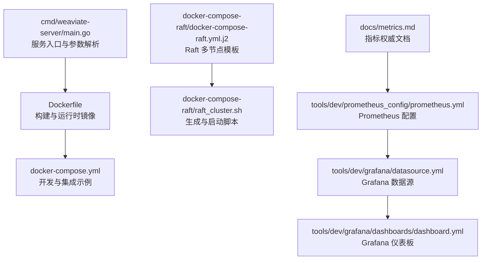
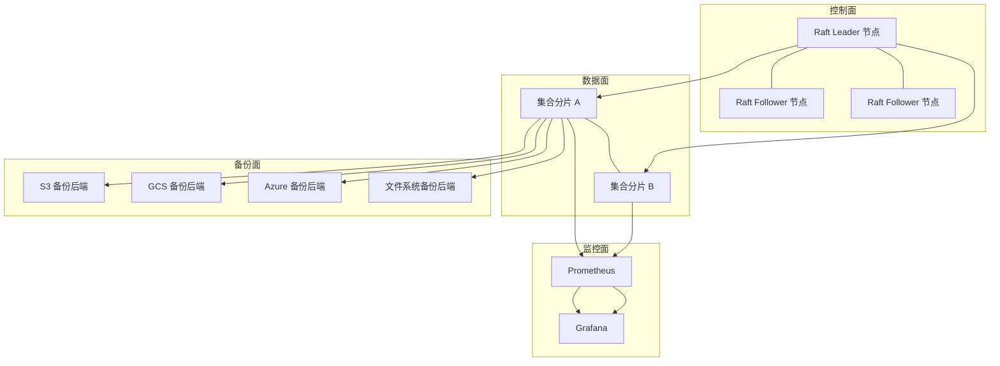
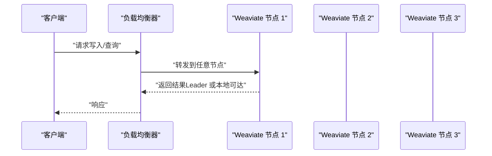
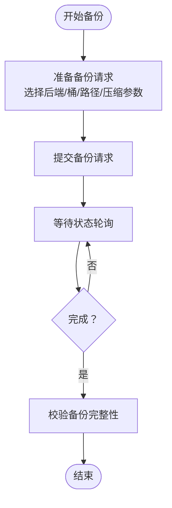
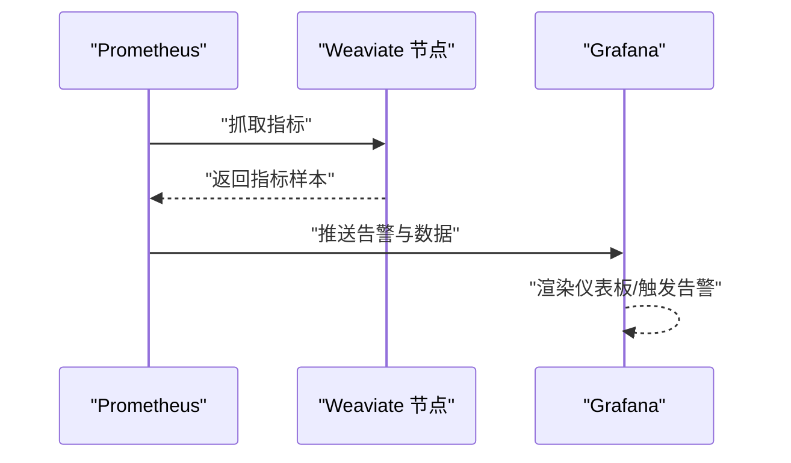
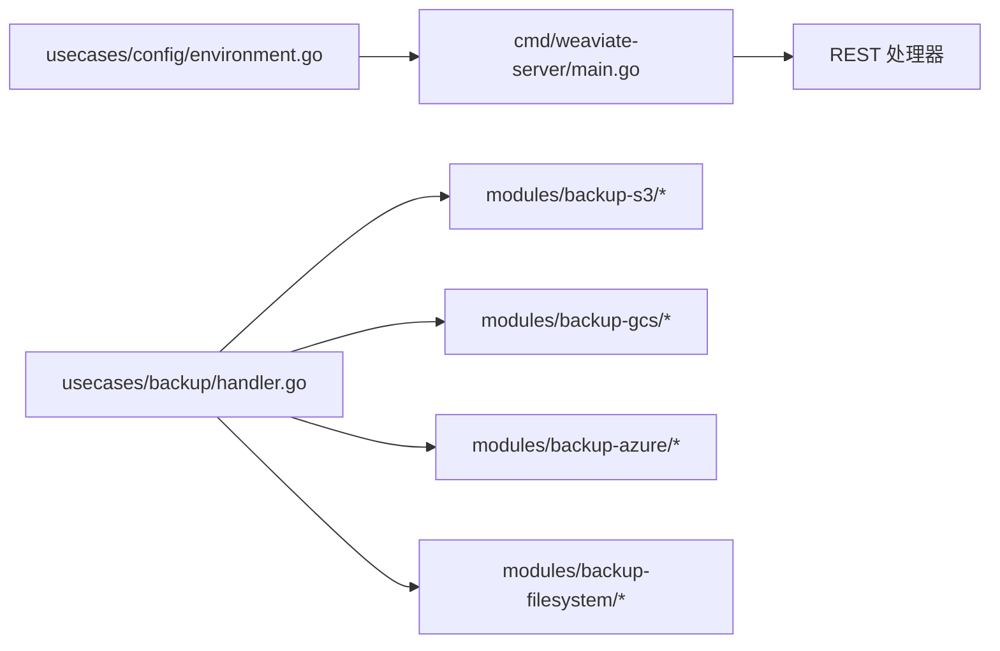

# 生产部署

<cite>
**本文引用的文件**
- [README.md](file://README.md)
- [Dockerfile](file://Dockerfile)
- [docker-compose.yml](file://docker-compose.yml)
- [docker-compose-raft/docker-compose-raft.yml.j2](file://docker-compose-raft/docker-compose-raft.yml.j2)
- [docker-compose-raft/raft_cluster.sh](file://docker-compose-raft/raft_cluster.sh)
- [cmd/weaviate-server/main.go](file://cmd/weaviate-server/main.go)
- [docs/metrics.md](file://docs/metrics.md)
- [tools/dev/config.local-development.yaml](file://tools/dev/config.local-development.yaml)
- [usecases/config/environment.go](file://usecases/config/environment.go)
- [usecases/backup/handler.go](file://usecases/backup/handler.go)
- [entities/models/backup_config.go](file://entities/models/backup_config.go)
- [adapters/handlers/rest/operations/backups/backups_create_responses.go](file://adapters/handlers/rest/operations/backups/backups_create_responses.go)
- [adapters/handlers/rest/operations/backups/backups_list_responses.go](file://adapters/handlers/rest/operations/backups/backups_list_responses.go)
- [modules/backup-s3/module.go](file://modules/backup-s3/module.go)
- [modules/backup-s3/client.go](file://modules/backup-s3/client.go)
- [modules/backup-s3/config.go](file://modules/backup-s3/config.go)
- [modules/backup-gcs/module.go](file://modules/backup-gcs/module.go)
- [modules/backup-gcs/client.go](file://modules/backup-gcs/client.go)
- [modules/backup-azure/module.go](file://modules/backup-azure/module.go)
- [modules/backup-azure/client.go](file://modules/backup-azure/client.go)
- [modules/backup-filesystem/module.go](file://modules/backup-filesystem/module.go)
- [modules/backup-filesystem/backup.go](file://modules/backup-filesystem/backup.go)
- [cluster/replication/metrics/metrics_test.go](file://cluster/replication/metrics/metrics_test.go)
- [usecases/monitoring/noop.go](file://usecases/monitoring/noop.go)
- [tools/dev/grafana/grafana.ini](file://tools/dev/grafana/grafana.ini)
- [tools/dev/prometheus_config/prometheus.yml](file://tools/dev/prometheus_config/prometheus.yml)
- [tools/dev/grafana/datasource.yml](file://tools/dev/grafana/datasource.yml)
- [tools/dev/grafana/dashboards/dashboard.yml](file://tools/dev/grafana/dashboards/dashboard.yml)
</cite>

## 目录
1. [简介](#简介)
2. [项目结构](#项目结构)
3. [核心组件](#核心组件)
4. [架构总览](#架构总览)
5. [详细组件分析](#详细组件分析)
6. [依赖关系分析](#依赖关系分析)
7. [性能考量](#性能考量)
8. [故障排除指南](#故障排除指南)
9. [结论](#结论)
10. [附录](#附录)

## 简介
本指南面向 DevOps 工程师与系统管理员，提供 Weaviate 在生产环境中的部署最佳实践，覆盖集群配置策略、备份与恢复、故障排除、容量规划、监控告警与运维检查清单。Weaviate 是一个云原生向量数据库，支持大规模语义搜索、混合检索、RAG、复制与多租户等生产特性，并通过 Prometheus 指标与 Grafana 可视化实现可观测性。

## 项目结构
仓库包含服务入口、集群与复制、备份模块、指标文档、开发与测试配置、以及 Docker 与 Compose 示例。生产部署可基于容器镜像与 Compose 编排，结合 Raft 集群模板进行多节点部署。

**图表来源**
- [cmd/weaviate-server/main.go](file://cmd/weaviate-server/main.go#L30-L69)
- [Dockerfile](file://Dockerfile#L50-L57)
- [docker-compose.yml](file://docker-compose.yml#L1-L140)
- [docker-compose-raft/docker-compose-raft.yml.j2](file://docker-compose-raft/docker-compose-raft.yml.j2#L1-L85)
- [docker-compose-raft/raft_cluster.sh](file://docker-compose-raft/raft_cluster.sh#L1-L52)
- [docs/metrics.md](file://docs/metrics.md#L1-L395)
- [tools/dev/prometheus_config/prometheus.yml](file://tools/dev/prometheus_config/prometheus.yml)
- [tools/dev/grafana/datasource.yml](file://tools/dev/grafana/datasource.yml)
- [tools/dev/grafana/dashboards/dashboard.yml](file://tools/dev/grafana/dashboards/dashboard.yml)

**章节来源**
- [README.md](file://README.md#L19-L28)
- [Dockerfile](file://Dockerfile#L1-L57)
- [docker-compose.yml](file://docker-compose.yml#L1-L140)
- [docker-compose-raft/docker-compose-raft.yml.j2](file://docker-compose-raft/docker-compose-raft.yml.j2#L1-L85)
- [docker-compose-raft/raft_cluster.sh](file://docker-compose-raft/raft_cluster.sh#L1-L52)
- [docs/metrics.md](file://docs/metrics.md#L1-L395)

## 核心组件
- 服务入口与启动
  - 服务通过命令行参数解析与 Swagger 规范初始化，绑定 REST 服务并监听端口。
  - 参考路径：[cmd/weaviate-server/main.go](file://cmd/weaviate-server/main.go#L30-L69)
- 容器镜像与运行时
  - 使用 Alpine 基础镜像，构建静态二进制并以默认 HTTP 监听方式运行。
  - 参考路径：[Dockerfile](file://Dockerfile#L50-L57)
- 开发与测试编排
  - 提供包含上下文词典、向量化推理、监控与备份模拟服务的 Compose 示例。
  - 参考路径：[docker-compose.yml](file://docker-compose.yml#L1-L140)
- Raft 集群模板
  - Jinja2 模板生成多节点 Raft 集群，支持动态扩缩容与端口映射。
  - 参考路径：[docker-compose-raft/docker-compose-raft.yml.j2](file://docker-compose-raft/docker-compose-raft.yml.j2#L1-L85)、[docker-compose-raft/raft_cluster.sh](file://docker-compose-raft/raft_cluster.sh#L1-L52)
- 指标与可观测性
  - 指标权威文档定义了活跃、运营、告警、分析等类别的指标与标签策略。
  - 参考路径：[docs/metrics.md](file://docs/metrics.md#L1-L395)
- 开发配置示例
  - 包含匿名认证、向量化器、查询默认限制、日志与遥测开关等开发场景配置。
  - 参考路径：[tools/dev/config.local-development.yaml](file://tools/dev/config.local-development.yaml#L1-L31)

**章节来源**
- [cmd/weaviate-server/main.go](file://cmd/weaviate-server/main.go#L30-L69)
- [Dockerfile](file://Dockerfile#L50-L57)
- [docker-compose.yml](file://docker-compose.yml#L1-L140)
- [docker-compose-raft/docker-compose-raft.yml.j2](file://docker-compose-raft/docker-compose-raft.yml.j2#L1-L85)
- [docker-compose-raft/raft_cluster.sh](file://docker-compose-raft/raft_cluster.sh#L1-L52)
- [docs/metrics.md](file://docs/metrics.md#L1-L395)
- [tools/dev/config.local-development.yaml](file://tools/dev/config.local-development.yaml#L1-L31)

## 架构总览
Weaviate 生产部署建议采用容器化与编排平台（如 Kubernetes），结合 Raft 集群实现高可用与复制。典型拓扑包括：
- 控制面：Raft Leader 与 Followers，负责元数据与状态机一致性。
- 数据面：分片与副本分布，按租户与集合划分。
- 监控面：Prometheus 抓取指标，Grafana 展示仪表板，告警规则触发通知。
- 备份面：多后端（S3/GCS/Azure/文件系统）备份与恢复。

[本图为概念性架构示意，不直接映射具体源码文件，故无“图表来源”标注]

## 详细组件分析

### 集群配置策略
- 节点角色与职责
  - Raft Leader：处理写入与状态机应用，协调复制与分片状态更新。
  - Raft Follower：跟随 Leader，参与多数派投票与日志复制。
  - 建议在生产中至少部署 3 个 Voter 节点以满足多数派要求。
- 网络拓扑
  - gossip 与数据绑定端口需在 Compose 模板中统一配置，避免冲突。
  - 参考路径：[docker-compose-raft/docker-compose-raft.yml.j2](file://docker-compose-raft/docker-compose-raft.yml.j2#L32-L37)
- 负载均衡
  - 建议在编排层（如 Kubernetes Service 或反向代理）对多个 Weaviate 实例进行轮询或会话亲和。
  - Raft 集群内部通过 Leader 与 Followers 的角色分工保证一致性，对外仅暴露读写端点。

**章节来源**
- [docker-compose-raft/docker-compose-raft.yml.j2](file://docker-compose-raft/docker-compose-raft.yml.j2#L1-L85)
- [docker-compose-raft/raft_cluster.sh](file://docker-compose-raft/raft_cluster.sh#L1-L52)

### 备份策略与恢复流程
- 备份后端
  - 支持 S3、GCS、Azure 与文件系统后端，便于跨云与本地归档。
  - 参考模块路径：
    - [modules/backup-s3/module.go](file://modules/backup-s3/module.go)
    - [modules/backup-gcs/module.go](file://modules/backup-gcs/module.go)
    - [modules/backup-azure/module.go](file://modules/backup-azure/module.go)
    - [modules/backup-filesystem/module.go](file://modules/backup-filesystem/module.go)
- 备份请求与配置
  - 备份请求包含压缩级别、CPU 利用率、包含/排除集合、节点映射、桶与路径覆盖等字段。
  - 参考模型与请求结构：
    - [usecases/backup/handler.go](file://usecases/backup/handler.go#L111-L149)
    - [entities/models/backup_config.go](file://entities/models/backup_config.go#L134-L168)
- API 响应与错误处理
  - 备份创建与列出接口包含 422/500 等错误响应封装，便于定位失败原因。
  - 参考路径：
    - [adapters/handlers/rest/operations/backups/backups_create_responses.go](file://adapters/handlers/rest/operations/backups/backups_create_responses.go#L148-L230)
    - [adapters/handlers/rest/operations/backups/backups_list_responses.go](file://adapters/handlers/rest/operations/backups/backups_list_responses.go#L196-L233)
- 恢复流程演练
  - 建议定期在隔离环境中验证恢复流程，核对数据完整性与查询一致性。
  - 结合指标与日志确认恢复阶段耗时与传输字节数，参考指标：
    - [docs/metrics.md](file://docs/metrics.md#L316-L327)

**章节来源**
- [usecases/backup/handler.go](file://usecases/backup/handler.go#L111-L149)
- [entities/models/backup_config.go](file://entities/models/backup_config.go#L134-L168)
- [adapters/handlers/rest/operations/backups/backups_create_responses.go](file://adapters/handlers/rest/operations/backups/backups_create_responses.go#L148-L230)
- [adapters/handlers/rest/operations/backups/backups_list_responses.go](file://adapters/handlers/rest/operations/backups/backups_list_responses.go#L196-L233)
- [docs/metrics.md](file://docs/metrics.md#L316-L327)

### 故障排除方法
- 常见问题诊断
  - 通过 Prometheus 指标识别查询延迟、队列长度、向量索引操作耗时与 tombstone 清理进度。
  - 参考指标类别与命名：
    - [docs/metrics.md](file://docs/metrics.md#L40-L124)
- 性能问题排查
  - 关注并发查询数、批处理持续时间、HTTP/gRPC 请求时延、分片加载与等待许可数量。
  - 参考路径：
    - [docs/metrics.md](file://docs/metrics.md#L127-L205)
- 复制与分布式任务
  - 监控复制引擎运行状态、待处理/进行中/完成/失败/取消操作数，辅助判断数据一致性与吞吐瓶颈。
  - 参考路径：
    - [docs/metrics.md](file://docs/metrics.md#L152-L163)
    - [cluster/replication/metrics/metrics_test.go](file://cluster/replication/metrics/metrics_test.go#L416-L442)
- 灾难恢复准备
  - 定期演练恢复流程，验证不同后端的传输耗时与数据一致性，记录恢复时间目标（RTO/RPO）。

**章节来源**
- [docs/metrics.md](file://docs/metrics.md#L40-L124)
- [docs/metrics.md](file://docs/metrics.md#L127-L205)
- [docs/metrics.md](file://docs/metrics.md#L152-L163)
- [cluster/replication/metrics/metrics_test.go](file://cluster/replication/metrics/metrics_test.go#L416-L442)

### 容量规划方法
- 资源需求评估
  - CPU：根据查询并发与批处理规模估算；向量化器调用与压缩策略影响 CPU 利用。
  - 内存：LSM 分段、向量索引大小、分片加载与缓存占用。
  - 存储：分片数量与大小、压缩比、备份占用与快照空间。
  - 网络：gRPC/REST 流量、备份传输带宽。
- 扩展策略
  - 水平扩展：增加分片与副本，提升吞吐与可用性。
  - 垂直扩展：提升单节点资源配置，配合压缩与索引优化。
- 成本优化
  - 启用向量压缩与合适的分片策略，降低存储与内存占用。
  - 使用多后端备份，结合冷热分层与生命周期策略。

[本节为通用容量规划建议，未直接分析具体源码文件，故无“章节来源”标注]

### 监控与告警配置
- 关键指标监控
  - 查询时延与并发、批处理耗时、LSM 分段与内存表、向量索引大小与操作、HTTP/gRPC 请求、复制引擎状态、分布式任务运行数。
  - 参考路径：[docs/metrics.md](file://docs/metrics.md#L40-L124)
- 告警阈值与通知
  - Prometheus 抓取 Weaviate 指标，Grafana 配置告警规则与通知渠道。
  - 参考路径：
    - [tools/dev/prometheus_config/prometheus.yml](file://tools/dev/prometheus_config/prometheus.yml)
    - [tools/dev/grafana/grafana.ini](file://tools/dev/grafana/grafana.ini#L771-L780)
- 数据源与仪表板
  - Prometheus 作为数据源，Grafana 导入仪表板模板。
  - 参考路径：
    - [tools/dev/grafana/datasource.yml](file://tools/dev/grafana/datasource.yml)
    - [tools/dev/grafana/dashboards/dashboard.yml](file://tools/dev/grafana/dashboards/dashboard.yml)

**章节来源**
- [docs/metrics.md](file://docs/metrics.md#L1-L395)
- [tools/dev/prometheus_config/prometheus.yml](file://tools/dev/prometheus_config/prometheus.yml)
- [tools/dev/grafana/grafana.ini](file://tools/dev/grafana/grafana.ini#L771-L780)
- [tools/dev/grafana/datasource.yml](file://tools/dev/grafana/datasource.yml)
- [tools/dev/grafana/dashboards/dashboard.yml](file://tools/dev/grafana/dashboards/dashboard.yml)

## 依赖关系分析
- 服务启动依赖
  - main.go 依赖 REST 处理器与 Swagger 规范，解析命令行参数并启动服务。
  - 参考路径：[cmd/weaviate-server/main.go](file://cmd/weaviate-server/main.go#L30-L69)
- 配置与环境变量
  - 环境变量用于启用 Prometheus 分组、指标命名空间、关键桶模式等。
  - 参考路径：[usecases/config/environment.go](file://usecases/config/environment.go#L72-L107)
- 备份模块
  - 各后端模块提供统一接口，备份请求通过 usecases/backup/handler.go 组织。
  - 参考路径：
    - [modules/backup-s3/module.go](file://modules/backup-s3/module.go)
    - [modules/backup-gcs/module.go](file://modules/backup-gcs/module.go)
    - [modules/backup-azure/module.go](file://modules/backup-azure/module.go)
    - [modules/backup-filesystem/module.go](file://modules/backup-filesystem/module.go)
    - [usecases/backup/handler.go](file://usecases/backup/handler.go#L111-L149)

**图表来源**
- [cmd/weaviate-server/main.go](file://cmd/weaviate-server/main.go#L30-L69)
- [usecases/config/environment.go](file://usecases/config/environment.go#L72-L107)
- [usecases/backup/handler.go](file://usecases/backup/handler.go#L111-L149)
- [modules/backup-s3/module.go](file://modules/backup-s3/module.go)
- [modules/backup-gcs/module.go](file://modules/backup-gcs/module.go)
- [modules/backup-azure/module.go](file://modules/backup-azure/module.go)
- [modules/backup-filesystem/module.go](file://modules/backup-filesystem/module.go)

**章节来源**
- [cmd/weaviate-server/main.go](file://cmd/weaviate-server/main.go#L30-L69)
- [usecases/config/environment.go](file://usecases/config/environment.go#L72-L107)
- [usecases/backup/handler.go](file://usecases/backup/handler.go#L111-L149)

## 性能考量
- 指标导向优化
  - 依据指标文档中的活跃与运营类指标，持续观测查询延迟、批处理耗时、队列长度与复制状态，及时发现异常。
  - 参考路径：[docs/metrics.md](file://docs/metrics.md#L40-L205)
- 资源与配置
  - 合理设置查询默认限制、异步索引、内存表刷新空闲时间等参数，平衡吞吐与延迟。
  - 参考路径：[docker-compose-raft/docker-compose-raft.yml.j2](file://docker-compose-raft/docker-compose-raft.yml.j2#L35-L42)
- 模块与外部调用
  - 监控外部向量化器与模块调用的请求时延、令牌用量与错误统计，避免成为瓶颈。
  - 参考路径：[docs/metrics.md](file://docs/metrics.md#L101-L112)

[本节为通用性能建议，未直接分析具体源码文件，故无“章节来源”标注]

## 故障排除指南
- 指标与日志
  - 使用指标文档定位异常维度（查询类型、类名、分片名等），结合日志与调试指标进行根因分析。
  - 参考路径：[docs/metrics.md](file://docs/metrics.md#L232-L395)
- 复制与分片
  - 关注复制引擎运行状态与待处理/进行中操作数，必要时暂停/重启复制引擎以缓解压力。
  - 参考路径：[docs/metrics.md](file://docs/metrics.md#L152-L163)
- 备份与恢复
  - 通过备份/恢复指标确认传输字节数与阶段耗时，定位网络或存储瓶颈。
  - 参考路径：[docs/metrics.md](file://docs/metrics.md#L316-L327)

**章节来源**
- [docs/metrics.md](file://docs/metrics.md#L232-L395)
- [docs/metrics.md](file://docs/metrics.md#L152-L163)
- [docs/metrics.md](file://docs/metrics.md#L316-L327)

## 结论
生产部署 Weaviate 需要在高可用（Raft 集群）、可观测性（Prometheus/Grafana）、备份恢复（多后端）、容量规划与性能优化之间取得平衡。遵循本文提供的配置策略、监控告警与故障排除方法，可显著提升系统的稳定性与可维护性。

[本节为总结性内容，未直接分析具体源码文件，故无“章节来源”标注]

## 附录

### 部署检查清单（生产）
- 集群与网络
  - Raft 节点数量满足多数派要求（建议 ≥3）
  - 端口映射与绑定一致，避免冲突
  - 负载均衡器配置健康检查与会话亲和
- 安全与认证
  - 启用匿名访问仅限开发/测试；生产环境配置认证与授权
- 监控与告警
  - Prometheus 抓取 Weaviate 指标，Grafana 导入仪表板
  - 设置关键指标阈值与告警规则
- 备份与恢复
  - 配置多后端备份（S3/GCS/Azure/文件系统）
  - 制定备份频率与保留策略，定期演练恢复流程
- 容量与成本
  - 评估 CPU/内存/存储/网络需求，制定扩容与压缩策略
  - 使用指标与日志持续优化

[本节为通用运维检查清单，未直接分析具体源码文件，故无“章节来源”标注]