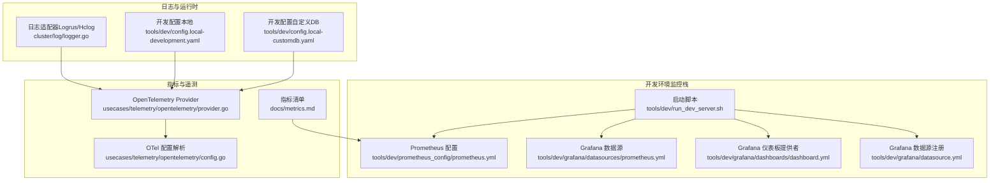
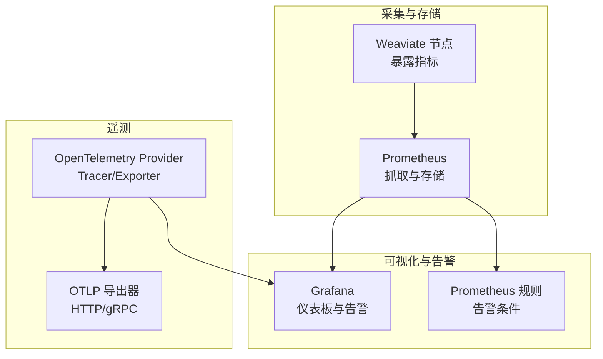
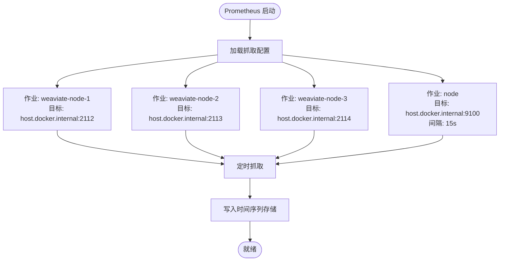
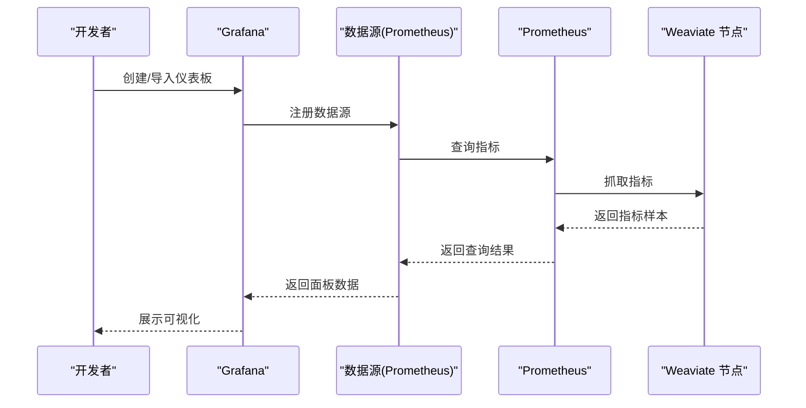
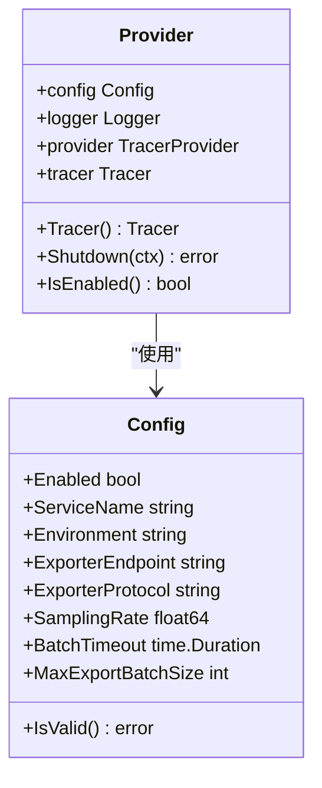
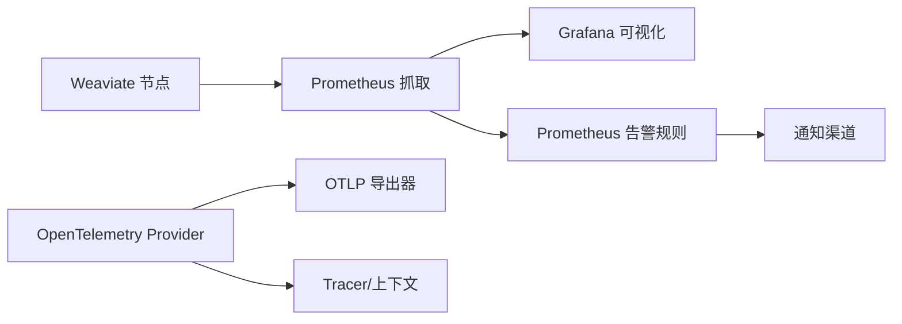

# 监控告警

<cite>
**本文引用的文件**
- [docs/metrics.md](file://docs/metrics.md)
- [tools/dev/prometheus_config/prometheus.yml](file://tools/dev/prometheus_config/prometheus.yml)
- [tools/dev/grafana/datasource.yml](file://tools/dev/grafana/datasource.yml)
- [tools/dev/grafana/dashboards/dashboard.yml](file://tools/dev/grafana/dashboards/dashboard.yml)
- [tools/dev/grafana/datasources/prometheus.yml](file://tools/dev/grafana/datasources/prometheus.yml)
- [usecases/telemetry/opentelemetry/provider.go](file://usecases/telemetry/opentelemetry/provider.go)
- [usecases/telemetry/opentelemetry/config.go](file://usecases/telemetry/opentelemetry/config.go)
- [cluster/log/logger.go](file://cluster/log/logger.go)
- [tools/dev/run_dev_server.sh](file://tools/dev/run_dev_server.sh)
- [tools/dev/config.local-development.yaml](file://tools/dev/config.local-development.yaml)
- [tools/dev/config.local-customdb.yaml](file://tools/dev/config.local-customdb.yaml)
</cite>

## 目录
1. [简介](#简介)
2. [项目结构](#项目结构)
3. [核心组件](#核心组件)
4. [架构总览](#架构总览)
5. [详细组件分析](#详细组件分析)
6. [依赖关系分析](#依赖关系分析)
7. [性能考量](#性能考量)
8. [故障排查指南](#故障排查指南)
9. [结论](#结论)
10. [附录](#附录)

## 简介
本指南面向运维团队，围绕 Weaviate 的监控告警体系建设提供端到端指导，覆盖指标监控（系统、应用、业务）、告警阈值与通知、Prometheus/Grafana/OpenTelemetry 集成、日志管理策略、性能监控方法、仪表板设计与告警响应流程。文档严格基于仓库内现有配置与指标清单进行说明，并提供可视化图示帮助理解。

## 项目结构
Weaviate 在开发环境提供了可直接使用的监控栈集成脚本与配置，便于快速搭建本地 Prometheus、Grafana 与 OpenTelemetry 环境，同时在官方文档中明确了指标分类与使用场景，为构建仪表板与告警规则提供权威依据。

图表来源
- [tools/dev/prometheus_config/prometheus.yml](file://tools/dev/prometheus_config/prometheus.yml#L1-L26)
- [tools/dev/grafana/datasources/prometheus.yml](file://tools/dev/grafana/datasources/prometheus.yml#L1-L15)
- [tools/dev/grafana/dashboards/dashboard.yml](file://tools/dev/grafana/dashboards/dashboard.yml#L1-L12)
- [tools/dev/grafana/datasource.yml](file://tools/dev/grafana/datasource.yml#L1-L22)
- [tools/dev/run_dev_server.sh](file://tools/dev/run_dev_server.sh#L1139-L1178)
- [docs/metrics.md](file://docs/metrics.md#L1-L395)
- [usecases/telemetry/opentelemetry/provider.go](file://usecases/telemetry/opentelemetry/provider.go#L47-L165)
- [usecases/telemetry/opentelemetry/config.go](file://usecases/telemetry/opentelemetry/config.go#L90-L140)
- [cluster/log/logger.go](file://cluster/log/logger.go#L58-L182)
- [tools/dev/config.local-development.yaml](file://tools/dev/config.local-development.yaml#L1-L31)
- [tools/dev/config.local-customdb.yaml](file://tools/dev/config.local-customdb.yaml#L1-L31)

章节来源
- [tools/dev/prometheus_config/prometheus.yml](file://tools/dev/prometheus_config/prometheus.yml#L1-L26)
- [tools/dev/grafana/datasource.yml](file://tools/dev/grafana/datasource.yml#L1-L22)
- [tools/dev/grafana/dashboards/dashboard.yml](file://tools/dev/grafana/dashboards/dashboard.yml#L1-L12)
- [tools/dev/grafana/datasources/prometheus.yml](file://tools/dev/grafana/datasources/prometheus.yml#L1-L15)
- [tools/dev/run_dev_server.sh](file://tools/dev/run_dev_server.sh#L1139-L1178)
- [docs/metrics.md](file://docs/metrics.md#L1-L395)
- [usecases/telemetry/opentelemetry/provider.go](file://usecases/telemetry/opentelemetry/provider.go#L47-L165)
- [usecases/telemetry/opentelemetry/config.go](file://usecases/telemetry/opentelemetry/config.go#L90-L140)
- [cluster/log/logger.go](file://cluster/log/logger.go#L58-L182)
- [tools/dev/config.local-development.yaml](file://tools/dev/config.local-development.yaml#L1-L31)
- [tools/dev/config.local-customdb.yaml](file://tools/dev/config.local-customdb.yaml#L1-L31)

## 核心组件
- 指标与分类：官方指标文档明确列出各指标类别（仪表板、运营、告警、分析、可废弃、已废弃），并标注高基数与低基数标签，指导仪表板与告警的构建。
- Prometheus 配置：开发环境提供多节点抓取目标与系统节点抓取配置，支持按实例分组与标签管理。
- Grafana 集成：提供数据源与仪表板自动加载配置，便于快速可视化。
- OpenTelemetry：提供可插拔的遥测导出器（HTTP/gRPC），支持采样率、批处理等参数配置。
- 日志适配：统一日志适配层，便于与 OpenTelemetry 上下文关联与集中化采集。

章节来源
- [docs/metrics.md](file://docs/metrics.md#L16-L36)
- [tools/dev/prometheus_config/prometheus.yml](file://tools/dev/prometheus_config/prometheus.yml#L5-L26)
- [tools/dev/grafana/datasources/prometheus.yml](file://tools/dev/grafana/datasources/prometheus.yml#L1-L15)
- [usecases/telemetry/opentelemetry/provider.go](file://usecases/telemetry/opentelemetry/provider.go#L105-L134)
- [usecases/telemetry/opentelemetry/config.go](file://usecases/telemetry/opentelemetry/config.go#L90-L140)
- [cluster/log/logger.go](file://cluster/log/logger.go#L58-L182)

## 架构总览
Weaviate 的监控告警体系由“指标采集—存储—可视化—告警—通知”构成。开发环境通过启动脚本一键拉起 Prometheus 与 Grafana，并以容器方式提供服务；指标由 Weaviate 节点暴露，Prometheus 抓取后用于仪表板与告警规则评估；OpenTelemetry 可选启用，用于链路追踪与分布式观测。

图表来源
- [tools/dev/run_dev_server.sh](file://tools/dev/run_dev_server.sh#L1155-L1175)
- [tools/dev/prometheus_config/prometheus.yml](file://tools/dev/prometheus_config/prometheus.yml#L5-L26)
- [tools/dev/grafana/datasource.yml](file://tools/dev/grafana/datasource.yml#L6-L18)
- [usecases/telemetry/opentelemetry/provider.go](file://usecases/telemetry/opentelemetry/provider.go#L105-L134)

## 详细组件分析

### 指标监控配置与阈值建议
- 指标分类与使用场景
  - 仪表板（🎯 Active dashboard）：用于核心仪表板展示，标签应有限且稳定，适合长期保留与常规观察。
  - 运营（⚙️ Active operational）：健康与后台进程相关，建议采样降低开销。
  - 告警（🚨 Alerting）：症状导向、低基数标签，最小化阈值数量，避免误报。
  - 分析（📊 Analytical）：调试与分析用，避免长期保留在 Prometheus，建议迁移到日志/追踪/外部存储。
  - 可废弃（‼️ Can be deprecated）：需迁移，逐步移除。
  - 已废弃（🗑️ Deprecated）：已移除，需清理仪表板与告警。

- 关键指标与监控范围
  - 批处理与对象操作：关注批处理耗时、对象计数、队列长度等，结合高基数标签进行聚合与分位数分析。
  - 查询操作：并发查询数、请求总量、查询耗时直方图/分位数、向量维度使用量等。
  - LSM/向量索引：活动段数、内存表大小、索引大小、墓碑数量与清理进度、典型操作耗时等。
  - 启动与磁盘 I/O：启动进度比例、磁盘吞吐等。
  - 文本向量化（T2V）：并发批次、队列耗时、请求耗时、令牌统计、速率限制统计等。
  - 索引分片：分片总数与状态更新耗时。
  - 自动租户：处理总数与时长分布。
  - 运行时配置：配置加载成功与哈希变化，便于变更追踪。
  - HTTP/gRPC 服务器：请求耗时、请求/响应大小、飞行中请求数等。
  - 集群存储与复制：FSM 应用耗时与失败次数、复制待处理/进行中/完成/失败/取消数量、引擎运行状态等。
  - 分布式任务：按命名空间的活跃任务数。
  - 模块使用：模块操作耗时与上传文件大小等。

- 阈值与告警级别建议（通用实践）
  - 正常范围：基于历史分位数（P50/P90/P95/P99）与基线波动范围设定。
  - 告警级别：
    - 警告（Warning）：短期异常或接近阈值上限；
    - 严重（Critical）：持续异常或超出阈值显著区间；
    - 紧急（Emergency）：系统不可用或关键路径阻塞。
  - 通知渠道：邮件、IM、电话（按级别分级），并确保静默窗口与抑制规则合理配置。
  - 注意：阈值应结合业务 SLA 与容量规划制定，定期复核与迭代。

章节来源
- [docs/metrics.md](file://docs/metrics.md#L16-L36)
- [docs/metrics.md](file://docs/metrics.md#L40-L124)
- [docs/metrics.md](file://docs/metrics.md#L127-L205)
- [docs/metrics.md](file://docs/metrics.md#L208-L215)
- [docs/metrics.md](file://docs/metrics.md#L217-L229)
- [docs/metrics.md](file://docs/metrics.md#L232-L264)
- [docs/metrics.md](file://docs/metrics.md#L267-L395)

### Prometheus 配置与抓取
- 多节点抓取：通过静态配置为多个 Weaviate 节点建立抓取作业，并设置实例标签以便区分。
- 系统节点抓取：额外抓取主机系统指标（如 Node Exporter），便于关联系统资源与应用指标。
- 抓取间隔：根据指标频率与成本控制选择合适的 scrape_interval，平衡实时性与资源消耗。

图表来源
- [tools/dev/prometheus_config/prometheus.yml](file://tools/dev/prometheus_config/prometheus.yml#L5-L26)

章节来源
- [tools/dev/prometheus_config/prometheus.yml](file://tools/dev/prometheus_config/prometheus.yml#L1-L26)

### Grafana 集成与仪表板设计
- 数据源注册：通过 YAML 注册 Prometheus 数据源，指定访问模式与默认数据源。
- 仪表板提供者：配置从文件系统加载仪表板，支持热更新与 UI 更新。
- 设计建议：
  - 使用“实例/节点/类名/查询类型”等有限标签进行面板分组；
  - 对高基数标签采用聚合（如 topk、by 行为）与分位数展示；
  - 为关键路径（查询延迟、批处理耗时、索引维护耗时）设置趋势与阈值告警；
  - 结合系统指标（CPU/内存/IO）进行根因分析。

图表来源
- [tools/dev/grafana/datasource.yml](file://tools/dev/grafana/datasource.yml#L6-L18)
- [tools/dev/grafana/datasources/prometheus.yml](file://tools/dev/grafana/datasources/prometheus.yml#L1-L15)
- [tools/dev/grafana/dashboards/dashboard.yml](file://tools/dev/grafana/dashboards/dashboard.yml#L1-L12)
- [tools/dev/prometheus_config/prometheus.yml](file://tools/dev/prometheus_config/prometheus.yml#L5-L26)

章节来源
- [tools/dev/grafana/datasource.yml](file://tools/dev/grafana/datasource.yml#L1-L22)
- [tools/dev/grafana/datasources/prometheus.yml](file://tools/dev/grafana/datasources/prometheus.yml#L1-L15)
- [tools/dev/grafana/dashboards/dashboard.yml](file://tools/dev/grafana/dashboards/dashboard.yml#L1-L12)

### OpenTelemetry 集成与配置
- 启用与导出：Provider 支持 HTTP 与 gRPC 两种 OTLP 导出协议，可通过环境变量调整采样率、批处理超时与最大批量大小。
- 全局设置：设置全局 TracerProvider 与 W3C TraceContext/Baggage Propagator，便于跨服务链路追踪。
- 配置校验：对服务名、导出端点、采样率、批处理参数进行有效性检查。

图表来源
- [usecases/telemetry/opentelemetry/provider.go](file://usecases/telemetry/opentelemetry/provider.go#L47-L165)
- [usecases/telemetry/opentelemetry/config.go](file://usecases/telemetry/opentelemetry/config.go#L90-L140)

章节来源
- [usecases/telemetry/opentelemetry/provider.go](file://usecases/telemetry/opentelemetry/provider.go#L47-L165)
- [usecases/telemetry/opentelemetry/config.go](file://usecases/telemetry/opentelemetry/config.go#L90-L140)

### 日志管理策略
- 日志适配：统一使用 Logrus 适配 Hclog，支持级别映射、字段注入与标准输出。
- 日志级别：生产环境建议 Info 或更高，调试阶段可临时提升至 Debug；结合业务流量与存储成本控制日志量。
- 日志轮转：建议结合系统日志轮转工具（如 systemd/journald/logrotate）进行按大小/时间轮转。
- 集中式采集：通过日志代理（如 Fluent Bit/Filebeat）将容器 stdout/文件采集至集中式平台（如 ELK/OTel Collector）。
- 与遥测关联：在日志中保留 TraceID/ SpanID 字段，便于日志与链路追踪关联分析。

章节来源
- [cluster/log/logger.go](file://cluster/log/logger.go#L58-L182)

### 性能监控方法
- 查询性能分析：关注查询耗时直方图/分位数、并发查询数、请求状态码分布；结合类名与查询类型进行切片分析。
- 索引效率监控：LSM 活动段数与内存表大小、向量索引大小与段数、墓碑清理进度与耗时、典型操作耗时等。
- 存储使用跟踪：结合系统指标（磁盘使用率、IO 吞吐）与应用指标（队列长度、异步操作数）综合评估。
- 批处理与向量化：批处理耗时、队列等待时间、令牌使用与速率限制统计，识别瓶颈与限流风险。

章节来源
- [docs/metrics.md](file://docs/metrics.md#L42-L124)
- [docs/metrics.md](file://docs/metrics.md#L61-L94)
- [docs/metrics.md](file://docs/metrics.md#L101-L112)
- [docs/metrics.md](file://docs/metrics.md#L113-L118)

### 告警响应流程
- 告警触发：Prometheus Rule 基于阈值与表达式触发告警，进入告警状态。
- 通知分发：通过 Webhook/Silence/Route 将告警推送到 IM/邮件/电话等渠道。
- 事件升级：根据级别与持续时间自动升级，必要时触发静默窗口避免风暴。
- 处置与复盘：记录处置过程与根因，更新阈值与规则，形成闭环。

（本节为概念性流程说明，未直接分析具体文件）

## 依赖关系分析
- 组件耦合：Grafana 依赖 Prometheus 数据源；Prometheus 依赖 Weaviate 指标暴露；OpenTelemetry Provider 依赖导出端点配置。
- 外部依赖：Prometheus 与 Grafana 作为独立容器运行；OTLP 导出器依赖远端接收端点（HTTP/gRPC）。
- 配置一致性：指标分类与标签策略决定仪表板与告警的稳定性与可维护性。

图表来源
- [tools/dev/prometheus_config/prometheus.yml](file://tools/dev/prometheus_config/prometheus.yml#L5-L26)
- [tools/dev/grafana/datasource.yml](file://tools/dev/grafana/datasource.yml#L6-L18)
- [usecases/telemetry/opentelemetry/provider.go](file://usecases/telemetry/opentelemetry/provider.go#L105-L134)

章节来源
- [tools/dev/prometheus_config/prometheus.yml](file://tools/dev/prometheus_config/prometheus.yml#L1-L26)
- [tools/dev/grafana/datasource.yml](file://tools/dev/grafana/datasource.yml#L1-L22)
- [usecases/telemetry/opentelemetry/provider.go](file://usecases/telemetry/opentelemetry/provider.go#L105-L134)

## 性能考量
- 指标成本控制：遵循低基数标签优先、避免每租户/每类/每路由的标签爆炸；将探索性分析移出 Prometheus。
- 抓取频率与存储：根据业务 SLA 与资源成本选择合适的 scrape_interval 与 retention。
- 采样与批处理：OTel 批处理大小与超时、采样率需权衡可观测性与性能。
- 仪表板与告警：减少高基数标签使用，采用聚合与分位数展示，避免过度细分导致查询与渲染压力。

章节来源
- [docs/metrics.md](file://docs/metrics.md#L25-L30)
- [usecases/telemetry/opentelemetry/config.go](file://usecases/telemetry/opentelemetry/config.go#L90-L140)

## 故障排查指南
- 指标缺失或异常
  - 检查 Prometheus 抓取配置与目标可达性；
  - 核对 Weaviate 指标暴露端口与路径；
  - 查看 Grafana 数据源连接状态与查询错误。
- 告警误报/漏报
  - 复核阈值与表达式，确认静默与抑制规则；
  - 检查标签基数与聚合方式是否合理。
- OpenTelemetry 导出失败
  - 校验导出端点与协议（HTTP/gRPC）；
  - 检查采样率、批处理超时与批量大小配置；
  - 确认网络连通与证书/鉴权设置。
- 日志问题
  - 检查日志级别与输出目标；
  - 确认日志轮转策略与集中化采集链路。

章节来源
- [tools/dev/prometheus_config/prometheus.yml](file://tools/dev/prometheus_config/prometheus.yml#L1-L26)
- [tools/dev/grafana/datasource.yml](file://tools/dev/grafana/datasource.yml#L1-L22)
- [usecases/telemetry/opentelemetry/provider.go](file://usecases/telemetry/opentelemetry/provider.go#L105-L134)
- [usecases/telemetry/opentelemetry/config.go](file://usecases/telemetry/opentelemetry/config.go#L114-L140)
- [cluster/log/logger.go](file://cluster/log/logger.go#L58-L182)

## 结论
Weaviate 的监控告警体系以官方指标文档为纲，结合开发环境提供的 Prometheus/Grafana 集成与可插拔的 OpenTelemetry 遥测能力，能够支撑从系统到应用再到业务的全链路可观测。通过合理的阈值设定、标签治理与仪表板设计，可实现高效、稳定的运维保障。建议持续优化指标与规则，完善告警响应流程，并将日志与追踪纳入统一的集中化平台，提升整体可观测性与故障定位效率。

## 附录
- 开发环境一键启动：通过启动脚本拉起 Prometheus 与 Grafana 容器，挂载配置与仪表板目录，便于本地验证与演示。
- 运行时配置参考：开发配置文件展示了匿名访问、向量索引、持久化路径、调试开关与遥测开关等关键项，便于在不同场景下启用/禁用功能。

章节来源
- [tools/dev/run_dev_server.sh](file://tools/dev/run_dev_server.sh#L1139-L1178)
- [tools/dev/config.local-development.yaml](file://tools/dev/config.local-development.yaml#L1-L31)
- [tools/dev/config.local-customdb.yaml](file://tools/dev/config.local-customdb.yaml#L1-L31)