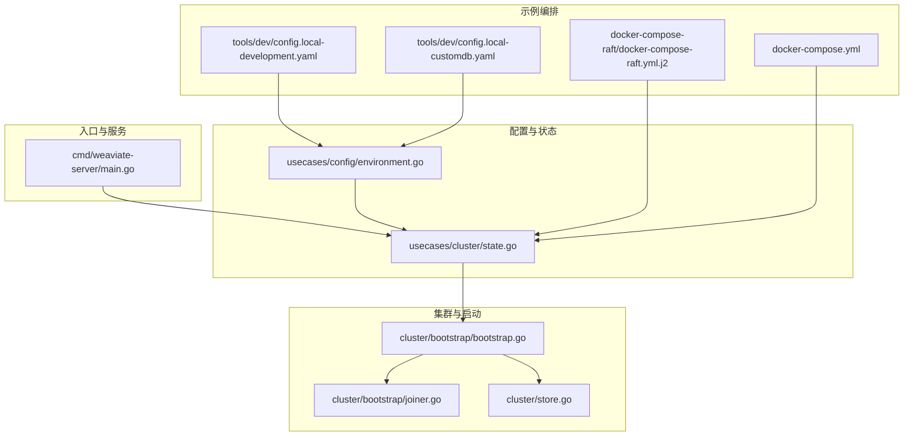
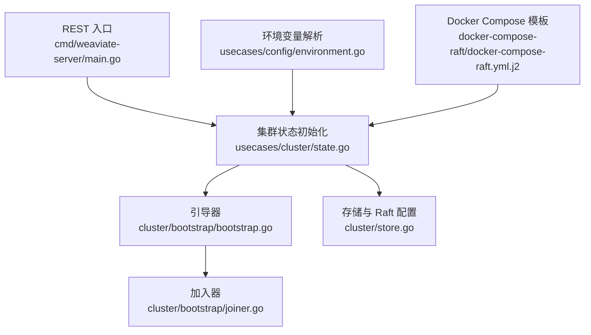
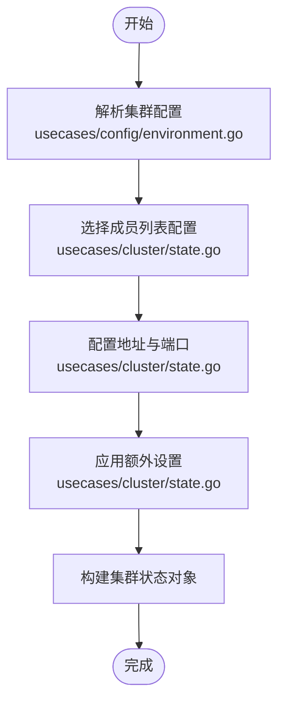
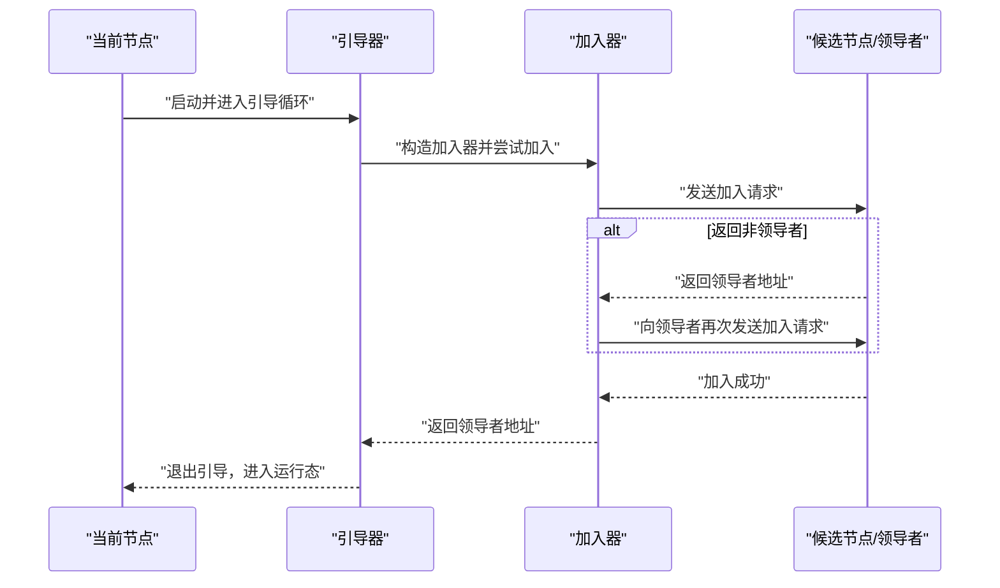
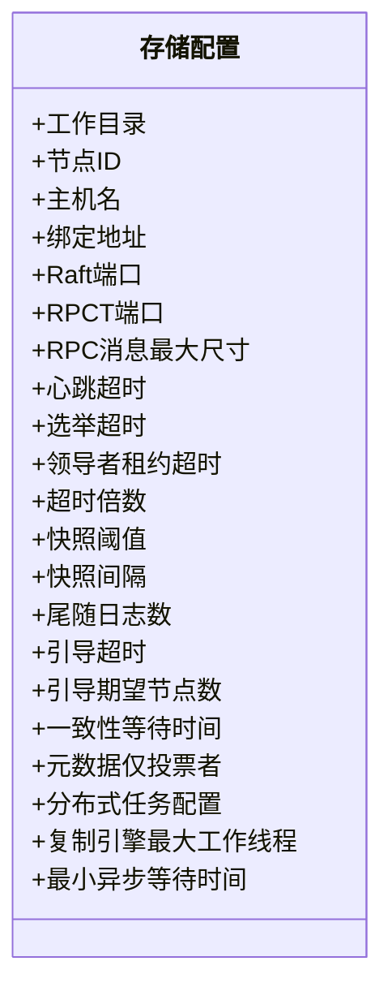
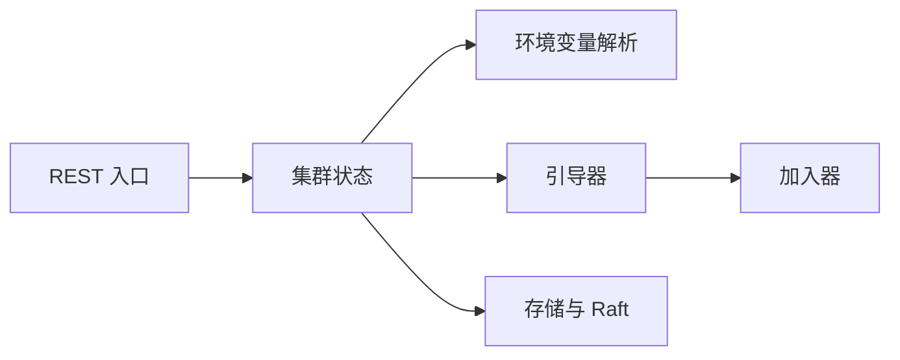

# 集群配置

<cite>
**本文引用的文件**
- [cmd/weaviate-server/main.go](file://cmd/weaviate-server/main.go)
- [cluster/bootstrap/bootstrap.go](file://cluster/bootstrap/bootstrap.go)
- [cluster/bootstrap/joiner.go](file://cluster/bootstrap/joiner.go)
- [cluster/store.go](file://cluster/store.go)
- [usecases/config/environment.go](file://usecases/config/environment.go)
- [usecases/cluster/state.go](file://usecases/cluster/state.go)
- [usecases/cluster/state_test.go](file://usecases/cluster/state_test.go)
- [docker-compose-raft/docker-compose-raft.yml.j2](file://docker-compose-raft/docker-compose-raft.yml.j2)
- [docker-compose.yml](file://docker-compose.yml)
- [tools/dev/config.local-development.yaml](file://tools/dev/config.local-development.yaml)
- [tools/dev/config.local-customdb.yaml](file://tools/dev/config.local-customdb.yaml)
</cite>

## 目录
1. [简介](#简介)
2. [项目结构](#项目结构)
3. [核心组件](#核心组件)
4. [架构总览](#架构总览)
5. [详细组件分析](#详细组件分析)
6. [依赖分析](#依赖分析)
7. [性能考虑](#性能考虑)
8. [故障排查指南](#故障排查指南)
9. [结论](#结论)
10. [附录](#附录)

## 简介
本指南面向系统管理员，提供 Weaviate 集群的完整配置与运维指导。内容覆盖节点角色分配（协调者/数据/仲裁）、网络拓扑与防火墙、负载均衡与健康检查、集群启动流程、关键配置参数、以及扩缩容策略与最佳实践。文档基于仓库中的源码与示例配置进行梳理，确保可操作性与准确性。

## 项目结构
Weaviate 的集群能力由多模块协同实现：REST 入口负责对外服务；集群子系统负责成员发现、Raft 一致性、状态同步与启动流程；配置解析模块负责从环境变量与配置文件加载集群参数；示例编排文件提供开发与测试场景下的集群拓扑参考。

**图表来源**
- [cmd/weaviate-server/main.go](file://cmd/weaviate-server/main.go#L30-L66)
- [cluster/bootstrap/bootstrap.go](file://cluster/bootstrap/bootstrap.go#L64-L130)
- [cluster/bootstrap/joiner.go](file://cluster/bootstrap/joiner.go#L47-L114)
- [cluster/store.go](file://cluster/store.go#L68-L189)
- [usecases/config/environment.go](file://usecases/config/environment.go#L1539-L1555)
- [usecases/cluster/state.go](file://usecases/cluster/state.go#L150-L189)
- [docker-compose-raft/docker-compose-raft.yml.j2](file://docker-compose-raft/docker-compose-raft.yml.j2#L9-L43)
- [docker-compose.yml](file://docker-compose.yml#L10-L140)
- [tools/dev/config.local-development.yaml](file://tools/dev/config.local-development.yaml#L1-L31)
- [tools/dev/config.local-customdb.yaml](file://tools/dev/config.local-customdb.yaml#L1-L31)

**章节来源**
- [cmd/weaviate-server/main.go](file://cmd/weaviate-server/main.go#L30-L66)
- [usecases/config/environment.go](file://usecases/config/environment.go#L1539-L1555)
- [usecases/cluster/state.go](file://usecases/cluster/state.go#L150-L189)
- [cluster/bootstrap/bootstrap.go](file://cluster/bootstrap/bootstrap.go#L64-L130)
- [cluster/bootstrap/joiner.go](file://cluster/bootstrap/joiner.go#L47-L114)
- [cluster/store.go](file://cluster/store.go#L68-L189)
- [docker-compose-raft/docker-compose-raft.yml.j2](file://docker-compose-raft/docker-compose-raft.yml.j2#L9-L43)
- [docker-compose.yml](file://docker-compose.yml#L10-L140)
- [tools/dev/config.local-development.yaml](file://tools/dev/config.local-development.yaml#L1-L31)
- [tools/dev/config.local-customdb.yaml](file://tools/dev/config.local-customdb.yaml#L1-L31)

## 核心组件
- 启动与入口
  - 服务入口负责加载 Swagger 规范、初始化 REST 服务器，并处理命令行参数与启动流程。
- 集群启动与加入
  - 引导器负责解析远端节点、尝试加入现有集群或发起新集群通知；加入器负责向候选领导者发送加入请求并处理非领导者重定向。
- 集群状态与配置
  - 集群状态在启动时校验配置、选择成员列表配置、设置地址与端口、应用额外设置并构建状态对象。
  - 环境变量解析负责读取集群主机名、加入地址、广告地址与端口等关键参数。
- 存储与 Raft
  - 存储配置包含工作目录、节点 ID、绑定地址、Raft/RPC 端口、消息大小限制、超时与快照参数、引导超时与期望节点数、一致性等待时间、元数据仅投票者模式、分布式任务、复制引擎等。
- 示例编排与配置
  - 提供基于 Docker Compose 的开发与测试集群模板，以及本地开发/自定义数据库配置样例。

**章节来源**
- [cmd/weaviate-server/main.go](file://cmd/weaviate-server/main.go#L30-L66)
- [cluster/bootstrap/bootstrap.go](file://cluster/bootstrap/bootstrap.go#L35-L61)
- [cluster/bootstrap/joiner.go](file://cluster/bootstrap/joiner.go#L27-L42)
- [usecases/cluster/state.go](file://usecases/cluster/state.go#L150-L189)
- [usecases/config/environment.go](file://usecases/config/environment.go#L1539-L1555)
- [cluster/store.go](file://cluster/store.go#L68-L189)
- [docker-compose-raft/docker-compose-raft.yml.j2](file://docker-compose-raft/docker-compose-raft.yml.j2#L9-L43)
- [tools/dev/config.local-development.yaml](file://tools/dev/config.local-development.yaml#L1-L31)
- [tools/dev/config.local-customdb.yaml](file://tools/dev/config.local-customdb.yaml#L1-L31)

## 架构总览
下图展示了 Weaviate 集群的关键交互：REST 入口、集群状态初始化、引导与加入、Raft 存储与配置。

**图表来源**
- [cmd/weaviate-server/main.go](file://cmd/weaviate-server/main.go#L30-L66)
- [usecases/cluster/state.go](file://usecases/cluster/state.go#L150-L189)
- [cluster/bootstrap/bootstrap.go](file://cluster/bootstrap/bootstrap.go#L64-L130)
- [cluster/bootstrap/joiner.go](file://cluster/bootstrap/joiner.go#L47-L114)
- [cluster/store.go](file://cluster/store.go#L68-L189)
- [usecases/config/environment.go](file://usecases/config/environment.go#L1539-L1555)
- [docker-compose-raft/docker-compose-raft.yml.j2](file://docker-compose-raft/docker-compose-raft.yml.j2#L9-L43)

## 详细组件分析

### 节点角色分配策略
- 投票者（Voter）与元数据仅投票者
  - 存储配置支持“元数据仅投票者”模式，用于将投票节点作为协调者而不承载数据，以降低数据节点压力并提升写入一致性选举效率。
- 数据节点
  - 承载实际数据与索引，参与 Raft 日志复制与查询处理。
- 仲裁节点（仲裁者）
  - 在某些部署中可使用“元数据仅投票者”作为仲裁角色，不存储数据但参与决策，减少跨机房/跨区域部署的仲裁成本。

最佳实践
- 将投票者数量设为奇数（如 3、5），以避免平票。
- 将协调职责与数据职责分离：使用元数据仅投票者作为仲裁者，数据节点专注于数据与查询。
- 在跨区域部署中，优先将投票者分布在不同可用区，确保多数派选举不受单一区域故障影响。

**章节来源**
- [cluster/store.go](file://cluster/store.go#L140-L141)

### 网络拓扑设计
- 成员发现与地址配置
  - 集群状态初始化会根据用户配置选择成员列表配置、设置日志输出、节点名称、地址与端口，并应用额外设置。
- 广告地址与端口
  - 支持通过环境变量设置广告地址与端口，便于容器化与跨主机部署。
- 端口范围
  - 建议为 gossip 与数据端口预留连续端口段，避免与宿主服务冲突。

**图表来源**
- [usecases/config/environment.go](file://usecases/config/environment.go#L1539-L1555)
- [usecases/cluster/state.go](file://usecases/cluster/state.go#L150-L189)

**章节来源**
- [usecases/cluster/state.go](file://usecases/cluster/state.go#L150-L189)
- [usecases/config/environment.go](file://usecases/config/environment.go#L1539-L1555)

### 负载均衡与健康检查
- 请求队列与限流
  - 环境变量解析包含请求队列配置项（启用开关、工作线程数、队列长度、队列满时状态码、关闭超时等），可用于控制请求处理能力与稳定性。
- 健康检查
  - 通过 REST 入口提供的健康端点（如就绪/存活探针）进行健康检查，结合外部负载均衡器（如反向代理、Kubernetes Service）实现流量调度。
- 故障转移
  - Raft 集群具备自动领导者选举与故障转移能力；当领导者不可用时，候选节点在选举超时后成为新领导者，保证服务连续性。

**章节来源**
- [usecases/config/environment_test.go](file://usecases/config/environment_test.go#L261-L342)
- [cmd/weaviate-server/main.go](file://cmd/weaviate-server/main.go#L30-L66)

### 集群启动流程
- 引导阶段
  - 引导器在节点启动后持续尝试加入现有集群；若无法加入，则向其他节点发出“准备加入”的通知，达到预期节点数后共同引导新集群。
- 加入阶段
  - 加入器向候选节点发送加入请求；若收到“非领导者”响应，则跟随返回的领导者地址重新加入。
- 状态同步
  - 集群状态初始化完成后，节点进入正常运行态，Raft 保障配置与模式变更的一致性传播。

**图表来源**
- [cluster/bootstrap/bootstrap.go](file://cluster/bootstrap/bootstrap.go#L64-L130)
- [cluster/bootstrap/joiner.go](file://cluster/bootstrap/joiner.go#L47-L114)

**章节来源**
- [cluster/bootstrap/bootstrap.go](file://cluster/bootstrap/bootstrap.go#L64-L130)
- [cluster/bootstrap/joiner.go](file://cluster/bootstrap/joiner.go#L47-L114)

### 配置参数详解
- 集群基础参数
  - 主机名、加入地址、广告地址与端口、数据绑定端口、Gossip 绑定端口等。
- Raft 参数
  - 心跳/选举/领导者租约超时、超时倍数、快照阈值与间隔、尾随日志数、引导超时与期望节点数、一致性等待时间、元数据仅投票者等。
- 复制与分布式任务
  - 复制引擎最大工作线程、最小异步等待时间、分布式任务调度间隔与完成任务 TTL 等。
- 内存与运行时
  - 内存使用警告与只读阈值等运行时指标。

**图表来源**
- [cluster/store.go](file://cluster/store.go#L68-L189)

**章节来源**
- [cluster/store.go](file://cluster/store.go#L68-L189)
- [usecases/config/environment.go](file://usecases/config/environment.go#L1516-L1537)
- [usecases/config/environment_test.go](file://usecases/config/environment_test.go#L261-L342)

### 扩缩容策略与最佳实践
- 扩容
  - 新增节点时，确保其加入地址与端口正确配置；对于投票者扩容，建议奇数个以维持多数派优势。
  - 使用“元数据仅投票者”作为临时仲裁节点，待数据节点扩容后再迁移角色。
- 缩容
  - 缩容前先迁移数据分片与副本至其他节点，确认一致性后再移除目标节点。
- 最佳实践
  - 跨可用区部署投票者，避免单点故障。
  - 为 Raft 端口与数据端口预留连续端口段，避免冲突。
  - 结合监控与日志，定期评估快照与日志保留策略，平衡恢复时间与存储开销。

**章节来源**
- [cluster/store.go](file://cluster/store.go#L126-L131)
- [usecases/cluster/state_test.go](file://usecases/cluster/state_test.go#L23-L81)

## 依赖分析
- 组件耦合
  - REST 入口依赖集群状态初始化；集群状态初始化依赖环境变量解析与成员列表配置；引导与加入模块依赖 RPC 客户端与 Raft 存储。
- 外部依赖
  - 使用成员列表（memberlist）进行节点发现与通信；使用 Raft 实现一致性与领导者选举；使用 Prometheus 进行监控（可选）。

**图表来源**
- [cmd/weaviate-server/main.go](file://cmd/weaviate-server/main.go#L30-L66)
- [usecases/cluster/state.go](file://usecases/cluster/state.go#L150-L189)
- [cluster/bootstrap/bootstrap.go](file://cluster/bootstrap/bootstrap.go#L64-L130)
- [cluster/bootstrap/joiner.go](file://cluster/bootstrap/joiner.go#L47-L114)
- [cluster/store.go](file://cluster/store.go#L68-L189)

**章节来源**
- [cmd/weaviate-server/main.go](file://cmd/weaviate-server/main.go#L30-L66)
- [usecases/cluster/state.go](file://usecases/cluster/state.go#L150-L189)
- [cluster/bootstrap/bootstrap.go](file://cluster/bootstrap/bootstrap.go#L64-L130)
- [cluster/bootstrap/joiner.go](file://cluster/bootstrap/joiner.go#L47-L114)
- [cluster/store.go](file://cluster/store.go#L68-L189)

## 性能考虑
- 端口与网络
  - 为 Raft 与数据通信预留专用端口段，避免与业务端口冲突；在高延迟网络中适当增大 Raft 超时参数，避免频繁选举。
- 快照与日志
  - 合理设置快照阈值与间隔，平衡恢复时间与磁盘 I/O；保持尾随日志数适中，以便快速回放而非全量传输。
- 内存与只读阈值
  - 设置合理的内存使用警告与只读阈值，防止节点过载导致性能骤降。
- 监控与指标
  - 开启 Prometheus 监控（可选），关注 Raft 日志提交延迟、快照耗时、成员列表变更频率等关键指标。

[本节为通用性能建议，无需特定文件引用]

## 故障排查指南
- 启动失败或无法加入集群
  - 检查加入地址与端口是否可达；确认广告地址与端口配置正确；查看引导器与加入器的日志，定位“非领导者”重定向或通知失败原因。
- 端口冲突或不可达
  - 使用状态校验用例中的端口范围约束，确保端口在有效范围内且未被占用。
- 快照与恢复异常
  - 调整快照阈值与间隔，观察磁盘空间与 I/O 压力；必要时清理历史快照。
- 内存压力
  - 调整内存使用阈值，启用只读保护，避免节点不可用。

**章节来源**
- [usecases/cluster/state_test.go](file://usecases/cluster/state_test.go#L23-L81)
- [cluster/bootstrap/bootstrap.go](file://cluster/bootstrap/bootstrap.go#L87-L130)
- [cluster/bootstrap/joiner.go](file://cluster/bootstrap/joiner.go#L67-L114)
- [usecases/config/environment.go](file://usecases/config/environment.go#L1516-L1537)

## 结论
通过明确的角色划分、规范的网络拓扑、完善的启动与加入流程、合理的配置参数与监控体系，Weaviate 集群可在生产环境中实现高可用与高性能。建议在部署前制定详细的扩缩容计划与故障演练方案，确保变更可控、风险可预知。

[本节为总结性内容，无需特定文件引用]

## 附录
- 示例编排与配置
  - 开发与测试集群模板：参见 docker-compose-raft 模板。
  - 本地开发与自定义数据库配置样例：参见本地配置文件。
  - 通用编排文件：参见 docker-compose 文件。

**章节来源**
- [docker-compose-raft/docker-compose-raft.yml.j2](file://docker-compose-raft/docker-compose-raft.yml.j2#L9-L43)
- [docker-compose.yml](file://docker-compose.yml#L10-L140)
- [tools/dev/config.local-development.yaml](file://tools/dev/config.local-development.yaml#L1-L31)
- [tools/dev/config.local-customdb.yaml](file://tools/dev/config.local-customdb.yaml#L1-L31)