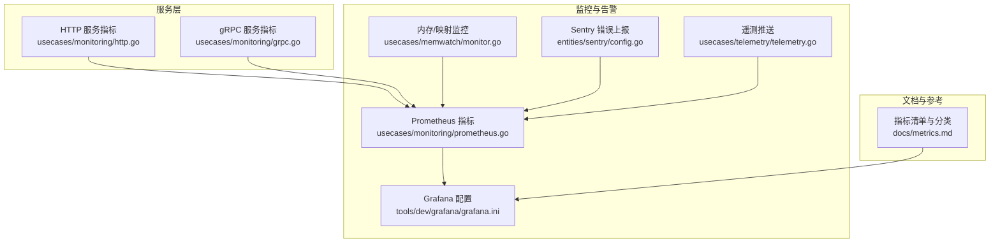
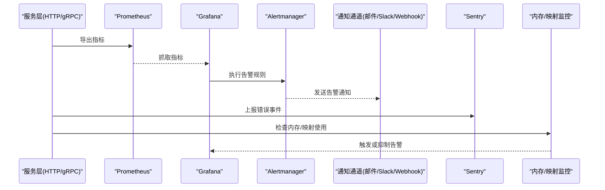
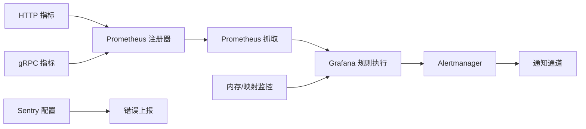

# 告警配置

<cite>
**本文引用的文件**
- [docs/metrics.md](file://docs/metrics.md)
- [usecases/monitoring/prometheus.go](file://usecases/monitoring/prometheus.go)
- [usecases/monitoring/http.go](file://usecases/monitoring/http.go)
- [usecases/monitoring/grpc.go](file://usecases/monitoring/grpc.go)
- [tools/dev/grafana/grafana.ini](file://tools/dev/grafana/grafana.ini)
- [entities/sentry/config.go](file://entities/sentry/config.go)
- [usecases/telemetry/telemetry.go](file://usecases/telemetry/telemetry.go)
- [usecases/memwatch/monitor.go](file://usecases/memwatch/monitor.go)
</cite>

## 目录
1. [简介](#简介)
2. [项目结构](#项目结构)
3. [核心组件](#核心组件)
4. [架构总览](#架构总览)
5. [详细组件分析](#详细组件分析)
6. [依赖关系分析](#依赖关系分析)
7. [性能考量](#性能考量)
8. [故障排查指南](#故障排查指南)
9. [结论](#结论)
10. [附录](#附录)

## 简介
本指南面向 SRE 与运维团队，围绕 Weaviate 的监控与告警体系提供“可落地”的配置与管理建议。Weaviate 通过 Prometheus 暴露指标，并结合 Grafana 统一告警与通知；同时内置 Sentry 错误上报与内存映射监控能力，辅助识别潜在风险。本文将从指标类别、阈值设定、时间窗口、通知渠道、分级策略、去重与抑制、常见场景示例、历史与统计等方面，给出系统化的实践路径。

## 项目结构
Weaviate 的告警相关能力主要由以下模块构成：
- 指标定义与导出：Prometheus 指标注册与采集
- HTTP/gRPC 服务指标：请求时延、并发、大小等
- Grafana 配置：统一告警引擎、规则与通知通道
- 错误上报：Sentry 配置与采样
- 内存与映射监控：内存占用与 mmap 映射上限预警
- 遥测：遥测推送与可视化

图表来源
- [usecases/monitoring/prometheus.go](file://usecases/monitoring/prometheus.go#L438-L800)
- [usecases/monitoring/http.go](file://usecases/monitoring/http.go#L45-L97)
- [usecases/monitoring/grpc.go](file://usecases/monitoring/grpc.go#L48-L68)
- [tools/dev/grafana/grafana.ini](file://tools/dev/grafana/grafana.ini#L716-L806)
- [entities/sentry/config.go](file://entities/sentry/config.go#L48-L83)
- [usecases/telemetry/telemetry.go](file://usecases/telemetry/telemetry.go#L172-L199)
- [usecases/memwatch/monitor.go](file://usecases/memwatch/monitor.go#L46-L134)
- [docs/metrics.md](file://docs/metrics.md#L1-L395)

章节来源
- [docs/metrics.md](file://docs/metrics.md#L1-L395)
- [usecases/monitoring/prometheus.go](file://usecases/monitoring/prometheus.go#L438-L800)
- [usecases/monitoring/http.go](file://usecases/monitoring/http.go#L45-L97)
- [usecases/monitoring/grpc.go](file://usecases/monitoring/grpc.go#L48-L68)
- [tools/dev/grafana/grafana.ini](file://tools/dev/grafana/grafana.ini#L716-L806)
- [entities/sentry/config.go](file://entities/sentry/config.go#L48-L83)
- [usecases/telemetry/telemetry.go](file://usecases/telemetry/telemetry.go#L172-L199)
- [usecases/memwatch/monitor.go](file://usecases/memwatch/monitor.go#L46-L134)

## 核心组件
- 指标体系与分类
  - 活动仪表板指标（活跃）：用于仪表板展示，标签基数低
  - 运营指标（运营）：健康/运行状态与后台进程，尽量采样
  - 告警指标（告警）：最小化、基于症状的告警，标签基数低
  - 分析指标（分析）：调试/分析，避免长期留存于 Prometheus
  - 废弃指标：已移除或即将移除
- HTTP 与 gRPC 服务指标
  - 请求时延、请求/响应体大小、并发请求数等
- Grafana 统一告警
  - 规则执行、超时、最小评估间隔、通知超时与重试次数等
- Sentry 错误上报
  - DSN、环境、集群标识、错误采样率与禁用开关
- 内存与映射监控
  - 实时内存使用比、mmap 映射数量与上限检查
- 遥测推送
  - 遥测数据收集与推送端点

章节来源
- [docs/metrics.md](file://docs/metrics.md#L16-L36)
- [usecases/monitoring/http.go](file://usecases/monitoring/http.go#L45-L97)
- [usecases/monitoring/grpc.go](file://usecases/monitoring/grpc.go#L48-L68)
- [tools/dev/grafana/grafana.ini](file://tools/dev/grafana/grafana.ini#L760-L806)
- [entities/sentry/config.go](file://entities/sentry/config.go#L48-L83)
- [usecases/memwatch/monitor.go](file://usecases/memwatch/monitor.go#L46-L134)
- [usecases/telemetry/telemetry.go](file://usecases/telemetry/telemetry.go#L172-L199)

## 架构总览
下图展示了 Weaviate 的监控与告警链路：服务层暴露指标，Prometheus 抓取，Grafana 执行规则并发送通知，Sentry 聚合错误，内存/映射监控辅助定位资源瓶颈。

图表来源
- [usecases/monitoring/http.go](file://usecases/monitoring/http.go#L63-L96)
- [usecases/monitoring/grpc.go](file://usecases/monitoring/grpc.go#L126-L158)
- [tools/dev/grafana/grafana.ini](file://tools/dev/grafana/grafana.ini#L716-L806)
- [entities/sentry/config.go](file://entities/sentry/config.go#L48-L83)
- [usecases/memwatch/monitor.go](file://usecases/memwatch/monitor.go#L96-L134)

## 详细组件分析

### 指标体系与告警分类
- 指标类别与用途
  - 活动仪表板：聚焦核心健康度，标签基数低
  - 运营：后台进程与运行状态，尽量采样
  - 告警：症状导向、最小化、低基数
  - 分析：调试/分析，避免长期留存 Prometheus
  - 废弃：即将移除，需迁移
- 关键告警指标
  - 查询时延、并发查询数、队列长度、向量索引维护时延、备份恢复时长等

章节来源
- [docs/metrics.md](file://docs/metrics.md#L16-L36)
- [docs/metrics.md](file://docs/metrics.md#L208-L215)

### HTTP 服务指标与告警阈值建议
- 指标要点
  - 请求时延直方图、请求/响应体大小直方图、并发请求数
- 告警阈值与时间窗口
  - 时延：P95/P99 超过 SLA（例如 500ms/2s），时间窗口 5–15 分钟，静默 5 分钟
  - 并发：超过基线 N 倍持续 3 个周期
  - 大小：异常突增（如单请求体积异常增长）
- 告警分级
  - 关键：SLA 时延越线、高并发阻塞
  - 警告：轻微延迟或异常波动
  - 信息：仅用于审计与趋势

章节来源
- [usecases/monitoring/http.go](file://usecases/monitoring/http.go#L45-L97)
- [docs/metrics.md](file://docs/metrics.md#L40-L125)

### gRPC 服务指标与告警阈值建议
- 指标要点
  - 请求时延直方图、请求/响应体大小直方图、并发请求数
- 告警阈值与时间窗口
  - 时延：P95/P99 越线，时间窗口 5–15 分钟
  - 错误码分布异常：非 2xx 比例上升
- 告警分级
  - 关键：批量错误或超时
  - 警告：偶发错误
  - 信息：审计

章节来源
- [usecases/monitoring/grpc.go](file://usecases/monitoring/grpc.go#L48-L68)
- [usecases/monitoring/grpc.go](file://usecases/monitoring/grpc.go#L126-L158)
- [docs/metrics.md](file://docs/metrics.md#L127-L206)

### Grafana 统一告警配置
- 规则执行与超时
  - 评估超时、最小评估间隔、通知超时与最大重试次数
- 通知通道
  - 支持邮件、Slack、Webhook 等，按环境配置
- 告警注释与保留
  - 注释存储时长与条数限制

章节来源
- [tools/dev/grafana/grafana.ini](file://tools/dev/grafana/grafana.ini#L716-L806)
- [tools/dev/grafana/grafana.ini](file://tools/dev/grafana/grafana.ini#L760-L806)

### Sentry 错误上报配置
- 启用与 DSN
- 环境与集群标识
- 错误采样率与禁用开关

章节来源
- [entities/sentry/config.go](file://entities/sentry/config.go#L48-L83)

### 内存与映射监控
- 目标
  - 防止 OOM 与 mmap 数量达到系统上限
- 关键指标
  - 实时内存使用比、mmap 映射数量
- 告警建议
  - 内存使用比接近阈值（如 80%/90%）触发警告，接近上限触发关键
  - mmap 映射数接近上限触发关键

章节来源
- [usecases/memwatch/monitor.go](file://usecases/memwatch/monitor.go#L46-L134)

### 遥测推送
- 目标
  - 收集与推送遥测数据，便于趋势与异常分析
- 关键点
  - 推送端点、失败处理与日志

章节来源
- [usecases/telemetry/telemetry.go](file://usecases/telemetry/telemetry.go#L172-L199)

## 依赖关系分析
- 服务层指标依赖 Prometheus 注册器
- Grafana 依赖 Prometheus 数据源与 Alertmanager
- Sentry 与服务层解耦，独立配置
- 内存/映射监控作为资源侧预警，可与 Grafana 规则联动

图表来源
- [usecases/monitoring/http.go](file://usecases/monitoring/http.go#L63-L96)
- [usecases/monitoring/grpc.go](file://usecases/monitoring/grpc.go#L126-L158)
- [usecases/monitoring/prometheus.go](file://usecases/monitoring/prometheus.go#L438-L800)
- [tools/dev/grafana/grafana.ini](file://tools/dev/grafana/grafana.ini#L716-L806)
- [entities/sentry/config.go](file://entities/sentry/config.go#L48-L83)
- [usecases/memwatch/monitor.go](file://usecases/memwatch/monitor.go#L96-L134)

## 性能考量
- 标签基数控制
  - 优先使用少量有界标签，避免每租户/每类/每路由的标签爆炸
- 采样与直方图桶
  - 对高频指标采用采样与合理桶设置，降低存储与计算开销
- 评估间隔与超时
  - 设置最小评估间隔与评估超时，避免规则执行对后端造成压力

章节来源
- [docs/metrics.md](file://docs/metrics.md#L25-L36)
- [tools/dev/grafana/grafana.ini](file://tools/dev/grafana/grafana.ini#L760-L769)

## 故障排查指南
- 指标缺失或异常
  - 检查 Prometheus 抓取目标与标签基数
  - 核对指标分类与使用状态
- 告警风暴
  - 在 Grafana 中启用静默、抑制与去重
  - 调整评估间隔与阈值
- Sentry 未收到错误
  - 校验 DSN、环境、采样率与禁用开关
- 内存/映射告警频繁
  - 结合服务层指标分析是否为批处理峰值或索引重建
  - 调整阈值与时间窗口

章节来源
- [docs/metrics.md](file://docs/metrics.md#L16-L36)
- [tools/dev/grafana/grafana.ini](file://tools/dev/grafana/grafana.ini#L716-L806)
- [entities/sentry/config.go](file://entities/sentry/config.go#L48-L83)
- [usecases/memwatch/monitor.go](file://usecases/memwatch/monitor.go#L96-L134)

## 结论
通过明确的指标分类、合理的阈值与时间窗口、统一的 Grafana 告警与通知、Sentry 错误上报与内存/映射监控，Weaviate 可实现“症状导向、低基数、可审计”的告警体系。建议以“关键/警告/信息”三级分类为抓手，配合静默、抑制与去重，避免告警风暴，提升故障响应效率。

## 附录

### 常见告警场景与配置示例
- 服务不可用
  - 关键：HTTP/gRPC 5xx 比例或连接失败持续升高
  - 时间窗口：5 分钟，静默 5 分钟
- 性能下降
  - 关键：查询 P95/P99 超过 SLA；警告：并发查询数异常升高
  - 时间窗口：5–15 分钟
- 存储空间不足
  - 警告：队列长度或磁盘使用接近阈值
  - 时间窗口：10 分钟
- 内存/映射风险
  - 关键：内存使用比接近阈值；警告：mmap 映射数接近上限
  - 时间窗口：1 分钟滚动窗口

章节来源
- [docs/metrics.md](file://docs/metrics.md#L40-L125)
- [docs/metrics.md](file://docs/metrics.md#L127-L206)
- [usecases/memwatch/monitor.go](file://usecases/memwatch/monitor.go#L96-L134)