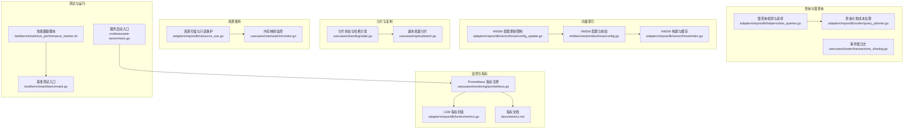
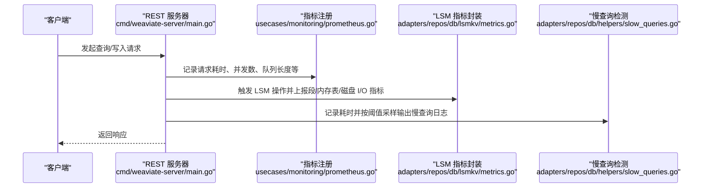
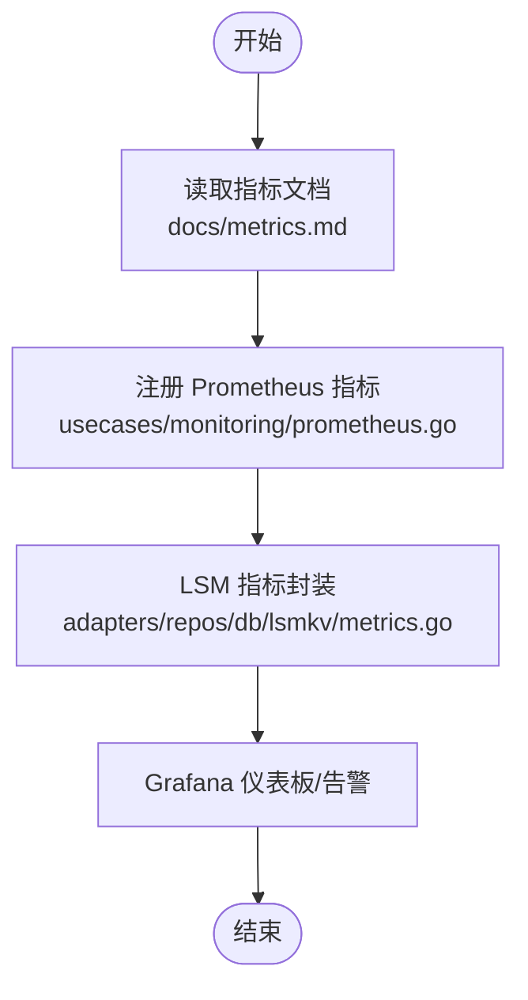
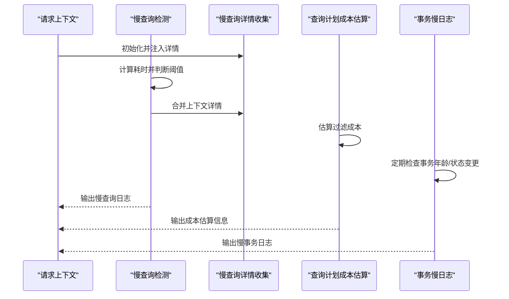
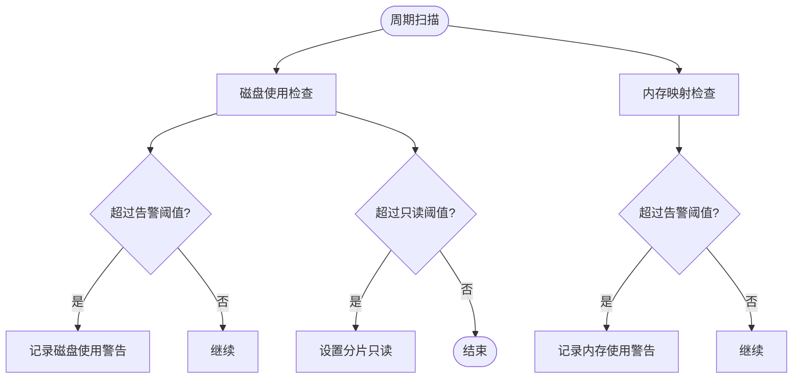
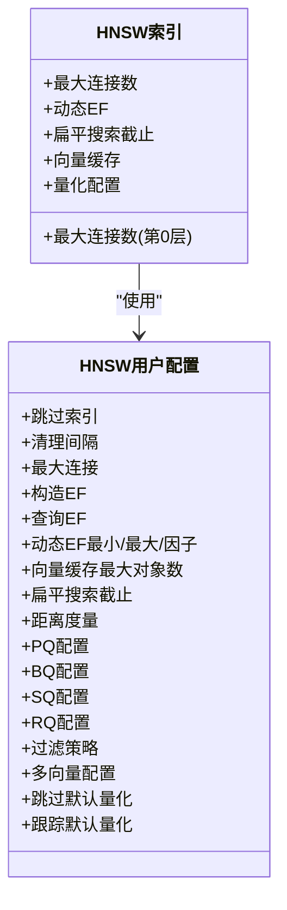
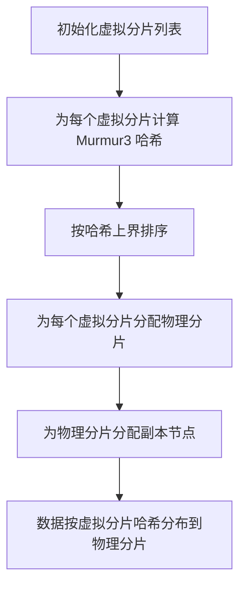
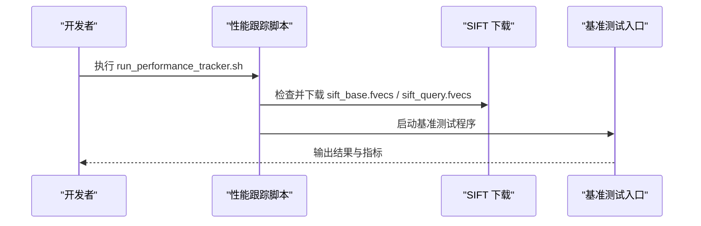
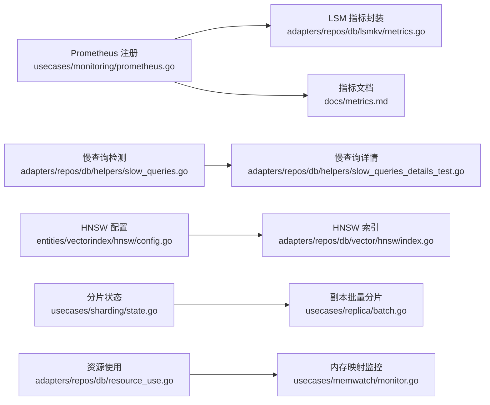

# 性能调优

<cite>
**本文引用的文件**
- [metrics.md](file://docs/metrics.md)
- [prometheus.go](file://usecases/monitoring/prometheus.go)
- [metrics.go](file://adapters/repos/db/lsmkv/metrics.go)
- [config.go](file://entities/vectorindex/hnsw/config.go)
- [index.go](file://adapters/repos/db/vector/hnsw/index.go)
- [state.go](file://usecases/sharding/state.go)
- [batch.go](file://usecases/replica/batch.go)
- [resource_use.go](file://adapters/repos/db/resource_use.go)
- [monitor.go](file://usecases/memwatch/monitor.go)
- [helpers.go](file://entities/config/helpers.go)
- [config_update.go](file://adapters/repos/db/vector/hnsw/config_update.go)
- [config_update_test.go](file://adapters/repos/db/vector/hnsw/config_update_test.go)
- [slow_queries.go](file://adapters/repos/db/helpers/slow_queries.go)
- [slow_queries_details_test.go](file://adapters/repos/db/helpers/slow_queries_details_test.go)
- [query_planner.go](file://adapters/repos/db/sorter/query_planner.go)
- [transactions_slowlog.go](file://usecases/cluster/transactions_slowlog.go)
- [run_performance_tracker.sh](file://test/benchmark/run_performance_tracker.sh)
- [benchmark.go](file://test/benchmark/benchmark.go)
- [host_metrics_mac.json](file://tools/dev/grafana/dashboards/host_metrics_mac.json)
- [main.go](file://cmd/weaviate-server/main.go)
</cite>

## 目录
1. [简介](#简介)
2. [项目结构](#项目结构)
3. [核心组件](#核心组件)
4. [架构总览](#架构总览)
5. [详细组件分析](#详细组件分析)
6. [依赖关系分析](#依赖关系分析)
7. [性能考量](#性能考量)
8. [故障排查指南](#故障排查指南)
9. [结论](#结论)
10. [附录](#附录)

## 简介
本指南面向性能工程师与高级运维人员，系统性梳理 Weaviate 在查询延迟分析、热点定位、资源使用优化、向量索引调优、分片与数据分布均衡、基准与压力测试、以及常见性能问题诊断与修复等方面的实践路径。文档以仓库中的真实实现为依据，结合指标体系与可观测性工具，提供可落地的优化建议。

## 项目结构
Weaviate 的性能相关能力主要分布在以下模块：
- 指标与监控：Prometheus 指标定义与注册、LSM 指标封装
- 查询与慢查询：慢查询检测、采样与上下文细节收集
- 向量索引：HNSW 参数与量化配置、缓存策略
- 分片与复制：分片状态与哈希分发、副本分配
- 资源使用：内存映射与磁盘使用阈值监控、只读保护
- 基准测试：SIFT 数据集与运行脚本
- 运行入口：REST 服务启动流程

图表来源
- [prometheus.go](file://usecases/monitoring/prometheus.go#L43-L347)
- [metrics.go](file://adapters/repos/db/lsmkv/metrics.go#L103-L658)
- [metrics.md](file://docs/metrics.md#L40-L395)
- [slow_queries.go](file://adapters/repos/db/helpers/slow_queries.go#L52-L95)
- [query_planner.go](file://adapters/repos/db/sorter/query_planner.go#L102-L122)
- [config.go](file://entities/vectorindex/hnsw/config.go#L24-L366)
- [index.go](file://adapters/repos/db/vector/hnsw/index.go#L296-L333)
- [config_update.go](file://adapters/repos/db/vector/hnsw/config_update.go#L31-L73)
- [state.go](file://usecases/sharding/state.go#L332-L599)
- [batch.go](file://usecases/replica/batch.go#L63-L99)
- [resource_use.go](file://adapters/repos/db/resource_use.go#L45-L139)
- [monitor.go](file://usecases/memwatch/monitor.go#L62-L316)
- [run_performance_tracker.sh](file://test/benchmark/run_performance_tracker.sh#L1-L19)
- [benchmark.go](file://test/benchmark/benchmark.go#L141-L191)
- [main.go](file://cmd/weaviate-server/main.go#L30-L69)

章节来源
- [metrics.md](file://docs/metrics.md#L40-L395)
- [prometheus.go](file://usecases/monitoring/prometheus.go#L43-L347)
- [metrics.go](file://adapters/repos/db/lsmkv/metrics.go#L103-L658)
- [slow_queries.go](file://adapters/repos/db/helpers/slow_queries.go#L52-L95)
- [config.go](file://entities/vectorindex/hnsw/config.go#L24-L366)
- [index.go](file://adapters/repos/db/vector/hnsw/index.go#L296-L333)
- [state.go](file://usecases/sharding/state.go#L332-L599)
- [batch.go](file://usecases/replica/batch.go#L63-L99)
- [resource_use.go](file://adapters/repos/db/resource_use.go#L45-L139)
- [monitor.go](file://usecases/memwatch/monitor.go#L62-L316)
- [run_performance_tracker.sh](file://test/benchmark/run_performance_tracker.sh#L1-L19)
- [benchmark.go](file://test/benchmark/benchmark.go#L141-L191)
- [main.go](file://cmd/weaviate-server/main.go#L30-L69)

## 核心组件
- 指标体系与仪表板：通过统一的指标文档与 Prometheus 注册，覆盖批处理、对象操作、查询、LSM、队列、向量索引、启动、墓碑、文本向量化等维度，支持仪表板与告警。
- 慢查询检测：基于时间阈值与采样策略输出慢查询日志，并可附加上下文详情，便于定位瓶颈。
- 向量索引（HNSW）：提供参数默认值、校验规则、量化配置（PQ/BQ/SQ/RQ）、动态 EF、缓存大小等，支持运行时配置更新限制。
- 分片与复制：基于 Murmur3 哈希的虚拟分片到物理分片映射，支持多副本与节点选择。
- 资源使用：周期性扫描磁盘与内存使用，达到阈值后发出警告并在更高阈值下进入只读模式。
- 基准测试：内置 SIFT 数据集下载与运行脚本，便于快速开展性能评估。

章节来源
- [metrics.md](file://docs/metrics.md#L40-L395)
- [prometheus.go](file://usecases/monitoring/prometheus.go#L43-L347)
- [metrics.go](file://adapters/repos/db/lsmkv/metrics.go#L103-L658)
- [slow_queries.go](file://adapters/repos/db/helpers/slow_queries.go#L52-L95)
- [config.go](file://entities/vectorindex/hnsw/config.go#L24-L366)
- [index.go](file://adapters/repos/db/vector/hnsw/index.go#L296-L333)
- [state.go](file://usecases/sharding/state.go#L332-L599)
- [batch.go](file://usecases/replica/batch.go#L63-L99)
- [resource_use.go](file://adapters/repos/db/resource_use.go#L45-L139)
- [monitor.go](file://usecases/memwatch/monitor.go#L62-L316)
- [run_performance_tracker.sh](file://test/benchmark/run_performance_tracker.sh#L1-L19)
- [benchmark.go](file://test/benchmark/benchmark.go#L141-L191)

## 架构总览
Weaviate 的性能相关链路贯穿“采集—分析—决策—执行”闭环：
- 采集层：HTTP/gRPC 请求、LSM 写入/读取、向量索引插入/删除、Schema/备份/复制等后台任务均产生指标。
- 分析层：Prometheus 汇总与聚合，结合 Grafana 仪表板进行可视化；慢查询与事务慢日志用于定位热点。
- 决策层：资源使用阈值触发只读保护；配置更新限制避免运行时不稳定。
- 执行层：基准测试驱动容量规划与回归验证。

图表来源
- [main.go](file://cmd/weaviate-server/main.go#L30-L69)
- [prometheus.go](file://usecases/monitoring/prometheus.go#L43-L347)
- [metrics.go](file://adapters/repos/db/lsmkv/metrics.go#L103-L658)
- [slow_queries.go](file://adapters/repos/db/helpers/slow_queries.go#L52-L95)

## 详细组件分析

### 指标体系与仪表板
- 指标分类与用途：活跃仪表板、运营、告警、分析、可废弃等类别，明确标签基数与采样策略，降低 Prometheus 存储成本。
- 关键指标示例：
  - 查询：并发查询数、请求总量、查询耗时直方图、过滤向量查询耗时摘要、查询维度总数。
  - 批处理：单批次耗时直方图、批次大小字节/对象/租户统计。
  - LSM：活动段数、内存表大小、位图缓冲使用、读写 I/O 摘要。
  - 队列：队列长度、磁盘使用、分区处理耗时。
  - 向量索引：墓碑数量/清理计数/意外墓碑、索引操作总数、索引大小、量化段/维度汇总、典型操作耗时摘要。
  - 启动：启动进度比例、磁盘 I/O 吞吐摘要。
  - 文本向量化：并发批次、队列阶段耗时、请求耗时、令牌统计、限流统计。
  - 索引分片：分片总数与状态、状态更新耗时直方图。
  - 自动模式：租户处理总数与耗时、自动租户操作耗时直方图。

图表来源
- [metrics.md](file://docs/metrics.md#L40-L395)
- [prometheus.go](file://usecases/monitoring/prometheus.go#L43-L347)
- [metrics.go](file://adapters/repos/db/lsmkv/metrics.go#L103-L658)

章节来源
- [metrics.md](file://docs/metrics.md#L40-L395)
- [prometheus.go](file://usecases/monitoring/prometheus.go#L43-L347)
- [metrics.go](file://adapters/repos/db/lsmkv/metrics.go#L103-L658)

### 慢查询识别与定位
- 慢查询检测：基于阈值与 1% 采样输出日志，支持附加上下文详情（线程安全收集）。
- 上下文细节：通过初始化的上下文在并发场景中收集键值对，最终合并到日志字段，辅助定位热点。
- 查询计划成本估算：根据匹配对象比例与总对象数估算过滤成本，便于理解慢查询成因。
- 事务慢日志：持续监控事务年龄与状态变更，超过阈值或曾被记录则输出慢事务日志。

图表来源
- [slow_queries.go](file://adapters/repos/db/helpers/slow_queries.go#L52-L95)
- [slow_queries_details_test.go](file://adapters/repos/db/helpers/slow_queries_details_test.go#L24-L46)
- [query_planner.go](file://adapters/repos/db/sorter/query_planner.go#L102-L122)
- [transactions_slowlog.go](file://usecases/cluster/transactions_slowlog.go#L55-L161)

章节来源
- [slow_queries.go](file://adapters/repos/db/helpers/slow_queries.go#L52-L95)
- [slow_queries_details_test.go](file://adapters/repos/db/helpers/slow_queries_details_test.go#L24-L46)
- [query_planner.go](file://adapters/repos/db/sorter/query_planner.go#L102-L122)
- [transactions_slowlog.go](file://usecases/cluster/transactions_slowlog.go#L55-L161)

### 资源使用优化策略
- 磁盘使用：周期性扫描磁盘占用，超过告警阈值打印警告，超过只读阈值将分片设置为只读，防止进一步写入导致崩溃。
- 内存使用：通过内存映射监控器定期刷新使用情况与上限，预留映射缓冲，避免超过系统最大映射数导致失败。
- 配置开关：通过环境变量启用/禁用某些功能，确保在资源受限环境下可控。

图表来源
- [resource_use.go](file://adapters/repos/db/resource_use.go#L45-L139)
- [monitor.go](file://usecases/memwatch/monitor.go#L62-L316)
- [helpers.go](file://entities/config/helpers.go#L16-L23)

章节来源
- [resource_use.go](file://adapters/repos/db/resource_use.go#L45-L139)
- [monitor.go](file://usecases/memwatch/monitor.go#L62-L316)
- [helpers.go](file://entities/config/helpers.go#L16-L23)

### 向量索引性能调优（HNSW）
- 参数与默认值：最大连接数、构造 EF、查询 EF、动态 EF 最小/最大/因子、扁平搜索截止、距离度量、向量缓存最大对象数、过滤策略等。
- 量化配置：PQ（分段/质心/编码器）、BQ（二进制量化）、SQ（标量量化）、RQ（低位量化，支持不同位宽与重打分阈值），同一时间仅允许启用一种量化。
- 缓存策略：根据是否多向量与 Muvera 配置选择合适的缓存类型与大小，支持预加载与分页。
- 运行时更新限制：部分参数不可热更新，更新时会报错提示不可变字段。

图表来源
- [config.go](file://entities/vectorindex/hnsw/config.go#L24-L366)
- [index.go](file://adapters/repos/db/vector/hnsw/index.go#L296-L333)
- [config_update.go](file://adapters/repos/db/vector/hnsw/config_update.go#L31-L73)

章节来源
- [config.go](file://entities/vectorindex/hnsw/config.go#L24-L366)
- [index.go](file://adapters/repos/db/vector/hnsw/index.go#L296-L333)
- [config_update.go](file://adapters/repos/db/vector/hnsw/config_update.go#L31-L73)
- [config_update_test.go](file://adapters/repos/db/vector/hnsw/config_update_test.go#L69-L111)

### 分片负载均衡与数据分布优化
- 分片状态：维护物理分片与虚拟分片映射，使用 Murmur3 哈希计算 token 并排序，保证均匀分布。
- 复制与副本：支持为每个分片分配多个副本节点，提供添加/删除副本的能力。
- 批量分片：将数据按物理分片拆分，便于并行写入与复制。

图表来源
- [state.go](file://usecases/sharding/state.go#L565-L599)
- [state.go](file://usecases/sharding/state.go#L332-L599)
- [batch.go](file://usecases/replica/batch.go#L63-L99)

章节来源
- [state.go](file://usecases/sharding/state.go#L332-L599)
- [batch.go](file://usecases/replica/batch.go#L63-L99)

### 性能基准测试与压力测试
- SIFT 数据集：脚本自动下载基准数据集，准备测试环境。
- 基准入口：提供基准测试程序入口，支持指定名称、条目数量、批次等参数。
- 建议流程：在隔离环境中运行，对比不同配置下的指标变化，记录吞吐与延迟。

图表来源
- [run_performance_tracker.sh](file://test/benchmark/run_performance_tracker.sh#L1-L19)
- [benchmark.go](file://test/benchmark/benchmark.go#L141-L191)

章节来源
- [run_performance_tracker.sh](file://test/benchmark/run_performance_tracker.sh#L1-L19)
- [benchmark.go](file://test/benchmark/benchmark.go#L141-L191)

### 常见性能问题诊断与解决
- 高延迟查询
  - 使用查询耗时直方图与慢查询日志定位热点，结合上下文详情与查询计划成本估算分析过滤/扫描路径。
  - 优化建议：调整 HNSW 查询参数（EF/Dynamic EF）、启用合适量化、优化过滤条件、减少返回字段。
- 内存泄漏/内存压力
  - 监控内存映射使用与上限，避免超过系统最大映射数；必要时降低向量缓存大小或关闭不必要的功能。
- 磁盘空间不足
  - 设置磁盘使用阈值并开启只读保护，清理历史数据或扩展磁盘；关注 LSM 段与内存表大小指标。
- 高并发写入阻塞
  - 关注批处理耗时与队列长度指标，适当增加批处理大小或并行度，同时检查向量索引队列与墓碑清理状态。

章节来源
- [metrics.md](file://docs/metrics.md#L40-L395)
- [slow_queries.go](file://adapters/repos/db/helpers/slow_queries.go#L52-L95)
- [monitor.go](file://usecases/memwatch/monitor.go#L62-L316)
- [resource_use.go](file://adapters/repos/db/resource_use.go#L45-L139)

## 依赖关系分析
- 指标注册依赖于 Prometheus 注册器，LSM 指标封装复用 Prometheus 向量与计数器。
- 慢查询检测依赖于全局阈值与采样策略，上下文详情通过独立模块收集。
- HNSW 配置与索引实现解耦，通过用户配置与默认值约束参数范围。
- 分片状态与复制逻辑相互独立但共同决定数据分布与可用性。
- 资源使用监控与内存映射监控协同工作，保障系统稳定性。

图表来源
- [prometheus.go](file://usecases/monitoring/prometheus.go#L43-L347)
- [metrics.go](file://adapters/repos/db/lsmkv/metrics.go#L103-L658)
- [metrics.md](file://docs/metrics.md#L40-L395)
- [slow_queries.go](file://adapters/repos/db/helpers/slow_queries.go#L52-L95)
- [slow_queries_details_test.go](file://adapters/repos/db/helpers/slow_queries_details_test.go#L24-L46)
- [config.go](file://entities/vectorindex/hnsw/config.go#L24-L366)
- [index.go](file://adapters/repos/db/vector/hnsw/index.go#L296-L333)
- [state.go](file://usecases/sharding/state.go#L332-L599)
- [batch.go](file://usecases/replica/batch.go#L63-L99)
- [resource_use.go](file://adapters/repos/db/resource_use.go#L45-L139)
- [monitor.go](file://usecases/memwatch/monitor.go#L62-L316)

章节来源
- [prometheus.go](file://usecases/monitoring/prometheus.go#L43-L347)
- [metrics.go](file://adapters/repos/db/lsmkv/metrics.go#L103-L658)
- [metrics.md](file://docs/metrics.md#L40-L395)
- [slow_queries.go](file://adapters/repos/db/helpers/slow_queries.go#L52-L95)
- [slow_queries_details_test.go](file://adapters/repos/db/helpers/slow_queries_details_test.go#L24-L46)
- [config.go](file://entities/vectorindex/hnsw/config.go#L24-L366)
- [index.go](file://adapters/repos/db/vector/hnsw/index.go#L296-L333)
- [state.go](file://usecases/sharding/state.go#L332-L599)
- [batch.go](file://usecases/replica/batch.go#L63-L99)
- [resource_use.go](file://adapters/repos/db/resource_use.go#L45-L139)
- [monitor.go](file://usecases/memwatch/monitor.go#L62-L316)

## 性能考量
- 指标粒度与标签基数：遵循“活跃仪表板”与“活跃运营”的低基数原则，避免每租户/每类/每路由的标签爆炸。
- 采样与成本控制：慢查询采用 1% 采样，HTTP/gRPC 请求耗时直方图按方法/路由聚合，降低存储与查询开销。
- 缓存与量化：合理设置向量缓存大小与量化策略，平衡检索精度与内存/CPU 占用。
- 分布式一致性：分片与副本策略需兼顾高可用与查询局部性，避免跨节点频繁访问。

## 故障排查指南
- 高延迟查询
  - 步骤：查看查询耗时直方图与慢查询日志，提取上下文详情，结合查询计划成本估算定位过滤/扫描瓶颈。
  - 处理：调整 HNSW 查询参数、优化过滤条件、减少返回字段、启用合适量化。
- 内存泄漏/内存压力
  - 步骤：监控内存映射使用与上限，确认是否接近系统最大映射数。
  - 处理：降低向量缓存大小、关闭不必要的功能、检查大对象序列化与内存分配。
- 磁盘空间不足
  - 步骤：观察磁盘使用率与只读阈值触发日志，检查 LSM 段与内存表大小。
  - 处理：清理历史数据、扩展磁盘、优化写入批大小与频率。
- 高并发写入阻塞
  - 步骤：关注批处理耗时与队列长度，检查向量索引队列与墓碑清理状态。
  - 处理：提升批处理大小/并行度、优化量化与缓存配置、缩短墓碑清理周期。

章节来源
- [metrics.md](file://docs/metrics.md#L40-L395)
- [slow_queries.go](file://adapters/repos/db/helpers/slow_queries.go#L52-L95)
- [monitor.go](file://usecases/memwatch/monitor.go#L62-L316)
- [resource_use.go](file://adapters/repos/db/resource_use.go#L45-L139)

## 结论
通过统一的指标体系、完善的慢查询检测与上下文详情、可调的 HNSW 参数与量化策略、稳健的分片与复制机制，以及严格的资源使用监控与只读保护，Weaviate 能够在复杂生产环境中实现稳定、可观测且可调优的性能表现。建议在部署前完成基准测试与容量规划，并在上线后持续监控关键指标与慢查询日志，以实现持续优化。

## 附录
- 仪表板参考：主机级磁盘 I/O 图表可用于定位磁盘瓶颈。
- 启动流程：REST 服务启动入口负责加载 Swagger 规范并启动服务器。

章节来源
- [host_metrics_mac.json](file://tools/dev/grafana/dashboards/host_metrics_mac.json#L515-L581)
- [main.go](file://cmd/weaviate-server/main.go#L30-L69)