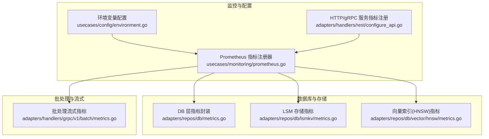
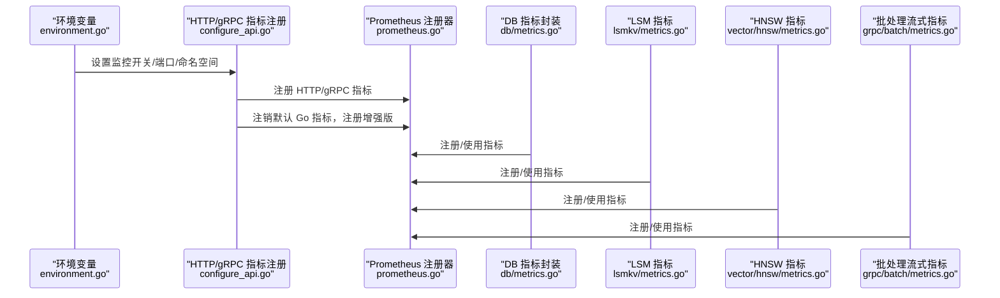
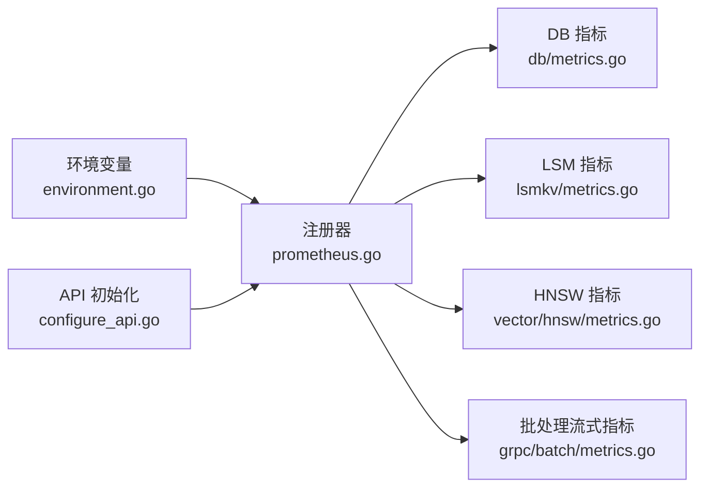

# 指标收集

<cite>
**本文引用的文件**   
- [docs/metrics.md](file://docs/metrics.md)
- [usecases/monitoring/prometheus.go](file://usecases/monitoring/prometheus.go)
- [adapters/repos/db/metrics.go](file://adapters/repos/db/metrics.go)
- [adapters/repos/db/lsmkv/metrics.go](file://adapters/repos/db/lsmkv/metrics.go)
- [adapters/repos/db/vector/hnsw/metrics.go](file://adapters/repos/db/vector/hnsw/metrics.go)
- [adapters/handlers/grpc/v1/batch/metrics.go](file://adapters/handlers/grpc/v1/batch/metrics.go)
- [adapters/handlers/rest/configure_api.go](file://adapters/handlers/rest/configure_api.go)
- [usecases/config/environment.go](file://usecases/config/environment.go)
- [tools/dev/prometheus_config/prometheus.yml](file://tools/dev/prometheus_config/prometheus.yml)
</cite>

## 目录
1. [简介](#简介)
2. [项目结构](#项目结构)
3. [核心组件](#核心组件)
4. [架构总览](#架构总览)
5. [组件详解](#组件详解)
6. [依赖关系分析](#依赖关系分析)
7. [性能考量](#性能考量)
8. [故障排查指南](#故障排查指南)
9. [结论](#结论)
10. [附录](#附录)

## 简介
本指南面向运维工程师与数据分析师，系统讲解 Weaviate 的指标收集体系与使用方法。内容覆盖 Prometheus 指标采集机制、系统/应用/业务三类指标的配置与使用、标签体系与分类管理、命名规范与最佳实践、导出配置示例与可视化方案，并提供历史趋势分析思路与排障建议。

## 项目结构
Weaviate 的指标体系由统一的 Prometheus 指标注册器集中管理，各子系统在各自模块内按需注册并使用指标。关键位置如下：
- 统一指标定义与注册：usecases/monitoring/prometheus.go
- 数据库层指标封装：adapters/repos/db/metrics.go
- LSM 存储指标：adapters/repos/db/lsmkv/metrics.go
- 向量索引（HNSW）指标：adapters/repos/db/vector/hnsw/metrics.go
- 批处理流式指标：adapters/handlers/grpc/v1/batch/metrics.go
- HTTP/gRPC 服务端指标：usecases/monitoring/prometheus.go 中的 NewHTTPServerMetrics/NewGRPCServerMetrics
- 指标导出与注册：adapters/handlers/rest/configure_api.go
- 指标采集开关与命名空间：usecases/config/environment.go
- Prometheus 抓取配置示例：tools/dev/prometheus_config/prometheus.yml

**图表来源**
- [usecases/monitoring/prometheus.go](file://usecases/monitoring/prometheus.go#L1-L184)
- [adapters/repos/db/metrics.go](file://adapters/repos/db/metrics.go#L1-L120)
- [adapters/repos/db/lsmkv/metrics.go](file://adapters/repos/db/lsmkv/metrics.go#L1-L120)
- [adapters/repos/db/vector/hnsw/metrics.go](file://adapters/repos/db/vector/hnsw/metrics.go#L1-L60)
- [adapters/handlers/grpc/v1/batch/metrics.go](file://adapters/handlers/grpc/v1/batch/metrics.go#L1-L80)
- [adapters/handlers/rest/configure_api.go](file://adapters/handlers/rest/configure_api.go#L253-L280)

**章节来源**
- [usecases/monitoring/prometheus.go](file://usecases/monitoring/prometheus.go#L1-L184)
- [adapters/handlers/rest/configure_api.go](file://adapters/handlers/rest/configure_api.go#L253-L280)

## 核心组件
- Prometheus 指标注册器与全局指标集合：集中定义各类 Histogram/Gauge/Counter/Summary 指标，支持按需注册与去重。
- DB 层指标封装：按类名/分片名/操作类型等维度封装常用指标，提供批量写入、对象存储、启动阶段等观测点。
- LSM 存储指标：围绕桶初始化/关闭、游标打开、读写操作、段统计、WAL 恢复、压缩等生命周期事件进行度量。
- 向量索引（HNSW）指标：围绕墓碑清理、插入/删除、增长、启动阶段、内存分配拒绝等进行观测。
- 批处理流式指标：跟踪流式连接数、错误总数、处理队列吞吐与排队对象数等。
- HTTP/gRPC 服务端指标：请求耗时、请求体/响应体大小、在途请求数等。
- 环境变量与命名空间：通过环境变量开启 Prometheus 监控、设置端口、是否聚合标签、命名空间前缀等。

**章节来源**
- [usecases/monitoring/prometheus.go](file://usecases/monitoring/prometheus.go#L40-L184)
- [adapters/repos/db/metrics.go](file://adapters/repos/db/metrics.go#L27-L120)
- [adapters/repos/db/lsmkv/metrics.go](file://adapters/repos/db/lsmkv/metrics.go#L58-L126)
- [adapters/repos/db/vector/hnsw/metrics.go](file://adapters/repos/db/vector/hnsw/metrics.go#L21-L60)
- [adapters/handlers/grpc/v1/batch/metrics.go](file://adapters/handlers/grpc/v1/batch/metrics.go#L19-L80)
- [usecases/config/environment.go](file://usecases/config/environment.go#L65-L91)

## 架构总览
Weaviate 在启动时根据环境变量启用 Prometheus 监控，注册 HTTP/gRPC 服务端指标，并注销默认 Go 指标收集器，再注册增强版 Go 指标收集器。随后，各子系统在各自的模块中通过统一的 Prometheus 注册器注册自身指标，最终由 Prometheus 抓取器定期拉取。

**图表来源**
- [usecases/config/environment.go](file://usecases/config/environment.go#L65-L91)
- [adapters/handlers/rest/configure_api.go](file://adapters/handlers/rest/configure_api.go#L253-L280)
- [usecases/monitoring/prometheus.go](file://usecases/monitoring/prometheus.go#L214-L289)
- [adapters/repos/db/metrics.go](file://adapters/repos/db/metrics.go#L68-L120)
- [adapters/repos/db/lsmkv/metrics.go](file://adapters/repos/db/lsmkv/metrics.go#L128-L180)
- [adapters/repos/db/vector/hnsw/metrics.go](file://adapters/repos/db/vector/hnsw/metrics.go#L46-L120)
- [adapters/handlers/grpc/v1/batch/metrics.go](file://adapters/handlers/grpc/v1/batch/metrics.go#L30-L80)

**章节来源**
- [adapters/handlers/rest/configure_api.go](file://adapters/handlers/rest/configure_api.go#L253-L280)
- [usecases/monitoring/prometheus.go](file://usecases/monitoring/prometheus.go#L214-L289)

## 组件详解

### 指标分类与使用类别
- 活跃（仪表板）：核心指标，标签基数受控，适合仪表板展示
- 活跃（运营）：健康/运行状态与后台进程，尽量采样
- 告警：最小化、基于症状的告警，标签基数低
- 分析（可移出 Prometheus）：调试/分析，避免长期保留在 Prometheus
- 可废弃：候选废弃，使用者应迁移
- 已废弃：已移除，记录一个版本帮助迁移

参考文档中的分类与标签基数指导，确保指标集精简与成本可控。

**章节来源**
- [docs/metrics.md](file://docs/metrics.md#L16-L36)

### 系统指标（CPU、内存、磁盘）
- 进程级运行时指标：Weaviate 启动时注销默认 Go 指标，注册增强版 Go 指标，以获取更细粒度的运行时指标（如调度器延迟等）。该增强版指标由环境变量控制启用。
- 文件 I/O 与内存映射：LSM 模块提供文件写入/读取总量与 mmap 操作计数等指标，辅助评估磁盘与内存压力。
- 磁盘 I/O 吞吐：启动阶段提供磁盘 I/O 吞吐观测，辅助定位冷启动瓶颈。

**章节来源**
- [adapters/handlers/rest/configure_api.go](file://adapters/handlers/rest/configure_api.go#L265-L270)
- [adapters/repos/db/lsmkv/metrics.go](file://adapters/repos/db/lsmkv/metrics.go#L50-L56)
- [adapters/repos/db/metrics.go](file://adapters/repos/db/metrics.go#L120-L170)

### 应用指标（查询延迟、批量操作、向量索引）
- 查询指标
  - 并发查询数：并发运行的查询操作数，按类名与查询类型分组
  - 请求总量：按状态码/类名/API/查询类型分组
  - 查询耗时直方图：按类名与查询类型分组
  - 过滤向量查询耗时：按类名/分片/操作分组
  - 查询维度总数：按查询类型/操作/类名分组
- 批量指标
  - 单批次耗时直方图：按操作/类名/分片分组
  - 批量大小与字节数：按 API/批次维度统计
  - 批量删除耗时：按操作/类名/分片分组
  - 批量处理对象/字节计数：按类名/分片分组
- 向量索引指标
  - 墓碑数/清理线程/清理计数/意外墓碑
  - 插入/删除/维护/后台操作耗时与计数
  - 索引大小/段数/维度总数
  - 内存分配拒绝计数

**章节来源**
- [docs/metrics.md](file://docs/metrics.md#L42-L111)
- [usecases/monitoring/prometheus.go](file://usecases/monitoring/prometheus.go#L438-L789)
- [adapters/repos/db/metrics.go](file://adapters/repos/db/metrics.go#L417-L753)
- [adapters/repos/db/vector/hnsw/metrics.go](file://adapters/repos/db/vector/hnsw/metrics.go#L21-L190)

### 业务指标（对象数量、租户使用情况）
- 对象数量：按类名与分片名的当前异步操作数
- 租户活动：通过租户活动处理器记录读/写/全量使用情况，可用于业务侧的租户用量分析

**章节来源**
- [docs/metrics.md](file://docs/metrics.md#L47-L50)
- [adapters/handlers/rest/configure_api.go](file://adapters/handlers/rest/configure_api.go#L258-L260)

### 指标标签体系
- 类名（class_name）：用于区分不同类别的数据
- 分片名（shard_name）：用于区分多分片场景
- 查询类型（query_type）：区分不同查询路径
- 操作（operation）：区分具体操作（如 create/delete/put 等）
- 步骤（step）：区分操作内部阶段（如 put 的不同子阶段）
- 路由/方法（route/method）：HTTP/gRPC 服务端指标
- 状态（status）：HTTP 状态码、备份/恢复状态等
- 策略（strategy）：LSM 段策略
- 状态（status）：索引分片状态
- 向量目标（target_vector）：向量索引队列按目标向量维度分组
- 统计项（stat）：文本向量化速率限制/重复统计等

**章节来源**
- [docs/metrics.md](file://docs/metrics.md#L42-L124)
- [usecases/monitoring/prometheus.go](file://usecases/monitoring/prometheus.go#L438-L789)

### 指标分类管理
- 批量操作指标：单批次耗时、批量大小、批量删除耗时、处理对象/字节计数
- 查询指标：并发查询数、请求总量、查询耗时直方图、过滤向量查询耗时、查询维度总数
- LSM 存储指标：桶初始化/关闭、游标、读写、段统计、WAL 恢复、压缩
- 向量索引指标：墓碑、插入/删除/维护/后台操作、尺寸/段数/维度、内存分配拒绝
- 服务端指标：HTTP/gRPC 请求耗时、请求/响应体大小、在途请求数
- 流式批处理指标：打开流数、错误总数、处理吞吐EMA、排队对象数

**章节来源**
- [docs/metrics.md](file://docs/metrics.md#L42-L124)
- [usecases/monitoring/prometheus.go](file://usecases/monitoring/prometheus.go#L214-L289)
- [adapters/repos/db/lsmkv/metrics.go](file://adapters/repos/db/lsmkv/metrics.go#L128-L737)
- [adapters/repos/db/vector/hnsw/metrics.go](file://adapters/repos/db/vector/hnsw/metrics.go#L46-L190)
- [adapters/handlers/grpc/v1/batch/metrics.go](file://adapters/handlers/grpc/v1/batch/metrics.go#L30-L80)

### 指标命名规范与最佳实践
- 命名空间：可通过环境变量设置指标前缀，便于多集群/多实例隔离
- 聚合策略：通过环境变量开启“聚合标签”模式，减少高基数标签带来的指标爆炸
- 标签基数控制：优先使用少量有界标签集；避免每租户/每类/每路由的标签爆炸
- 指标类型选择：耗时使用直方图/分位图；计数使用 Counter；瞬时状态使用 Gauge；需要分位统计使用 Summary
- 历史保留：分析型指标建议移出 Prometheus，避免长期保留造成存储压力

**章节来源**
- [docs/metrics.md](file://docs/metrics.md#L25-L36)
- [usecases/config/environment.go](file://usecases/config/environment.go#L65-L91)

### 指标导出配置示例
- 开启 Prometheus 监控：设置 PROMETHEUS_MONITORING_ENABLED=true，端口默认 2112（可通过 PROMETHEUS_MONITORING_PORT 覆盖），可选设置命名空间 PROMETHEUS_MONITORING_METRIC_NAMESPACE
- 聚合标签：PROMETHEUS_MONITORING_GROUP 或 PROMETHEUS_MONITORING_GROUP_CLASSES（新名 PROMETHEUS_MONITORING_GROUP）
- 关键桶：PROMETHEUS_MONITOR_CRITICAL_BUCKETS_ONLY 控制 LSM 关键桶监控
- Prometheus 抓取配置示例：tools/dev/prometheus_config/prometheus.yml 展示了多节点静态配置与节点 Exporter 抓取

**章节来源**
- [usecases/config/environment.go](file://usecases/config/environment.go#L65-L91)
- [tools/dev/prometheus_config/prometheus.yml](file://tools/dev/prometheus_config/prometheus.yml#L1-L26)

### 数据可视化与历史趋势分析
- 仪表板建议
  - 查询延迟：使用查询耗时直方图与并发查询数，结合查询类型/类名进行分组对比
  - 批处理吞吐：使用批量对象/字节计数与批处理流式吞吐EMA，观察峰值与稳定性
  - 向量索引健康：使用墓碑数/清理进度/维护耗时，关注异常波动
  - LSM 健康：使用段数/段大小/压缩耗时/失败计数，识别碎片与压缩压力
  - 系统资源：结合节点 Exporter 指标（CPU/内存/磁盘/网络）与 Weaviate 自身指标联动分析
- 历史趋势
  - 利用直方图/分位图查看 P50/P95/P99 延迟变化
  - 使用 Counter 累积值计算速率与异常突增
  - 结合时间序列聚类与异常检测定位问题根因

[本节为通用可视化建议，不直接分析具体文件]

## 依赖关系分析
- 统一注册器依赖：各模块通过统一注册器注册指标，避免重复与冲突
- 环境变量驱动：监控开关、端口、命名空间、聚合策略均由环境变量控制
- 服务端指标：HTTP/gRPC 服务端指标在 API 初始化阶段注册，确保服务启动即具备可观测性
- 指标删除：提供按类/分片删除指标的能力，便于动态扩缩容场景下的指标清理

**图表来源**
- [usecases/config/environment.go](file://usecases/config/environment.go#L65-L91)
- [adapters/handlers/rest/configure_api.go](file://adapters/handlers/rest/configure_api.go#L253-L280)
- [usecases/monitoring/prometheus.go](file://usecases/monitoring/prometheus.go#L438-L789)

**章节来源**
- [usecases/monitoring/prometheus.go](file://usecases/monitoring/prometheus.go#L291-L372)

## 性能考量
- 标签基数控制：避免在高频变化维度上打散标签，优先使用少量有界标签
- 桶设置：直方图桶应结合实际分布调整，避免过多桶导致内存与查询开销上升
- 采样与聚合：运营侧尽量采用采样与聚合策略，降低存储与查询压力
- 启动阶段观测：利用启动阶段的磁盘 I/O 吞吐与耗时指标，优化冷启动性能

[本节为通用性能建议，不直接分析具体文件]

## 故障排查指南
- 指标缺失
  - 检查 PROMETHEUS_MONITORING_ENABLED 是否开启
  - 确认端口与抓取配置一致
  - 核对命名空间与标签聚合设置
- 指标爆炸/内存压力
  - 启用聚合标签（GROUP）或限制关键桶（MonitorCriticalBucketsOnly）
  - 审核标签维度，减少高基数标签
- 查询延迟升高
  - 对比查询耗时直方图与并发查询数
  - 关注过滤向量查询耗时与查询维度总数
- 批处理异常
  - 观察批量对象/字节计数与批处理流式吞吐EMA
  - 检查批量删除耗时与错误总数
- 向量索引异常
  - 关注墓碑清理进度与线程数
  - 检查维护/后台操作耗时与失败计数
- LSM 异常
  - 关注段数/段大小/压缩耗时与失败计数
  - 检查 WAL 恢复与游标打开/关闭指标

**章节来源**
- [usecases/config/environment.go](file://usecases/config/environment.go#L65-L91)
- [docs/metrics.md](file://docs/metrics.md#L25-L36)

## 结论
Weaviate 的指标体系以统一注册器为核心，覆盖系统、应用与业务三个层面，提供完善的标签体系与分类管理。通过环境变量灵活配置监控开关、端口与命名空间，并结合直方图/分位图与计数器/仪表的合理选择，可在保证可观测性的同时控制成本与标签基数。配合 Prometheus 抓取与 Grafana 可视化，可实现对查询、批处理、向量索引与 LSM 存储的全链路监控与历史趋势分析。

[本节为总结，不直接分析具体文件]

## 附录
- 指标权威文档：docs/metrics.md
- Prometheus 抓取配置示例：tools/dev/prometheus_config/prometheus.yml
- 服务端指标注册：adapters/handlers/rest/configure_api.go
- 统一指标注册与类型定义：usecases/monitoring/prometheus.go
- DB 层指标封装：adapters/repos/db/metrics.go
- LSM 指标：adapters/repos/db/lsmkv/metrics.go
- HNSW 指标：adapters/repos/db/vector/hnsw/metrics.go
- 批处理流式指标：adapters/handlers/grpc/v1/batch/metrics.go

**章节来源**
- [docs/metrics.md](file://docs/metrics.md#L1-L395)
- [tools/dev/prometheus_config/prometheus.yml](file://tools/dev/prometheus_config/prometheus.yml#L1-L26)