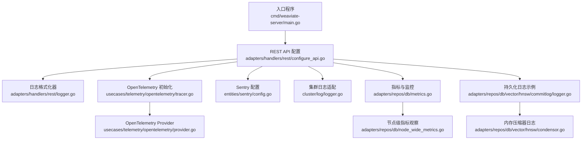
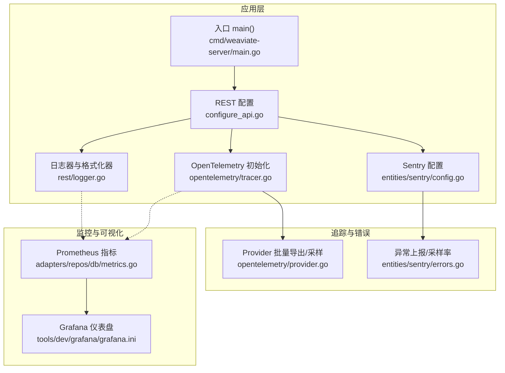
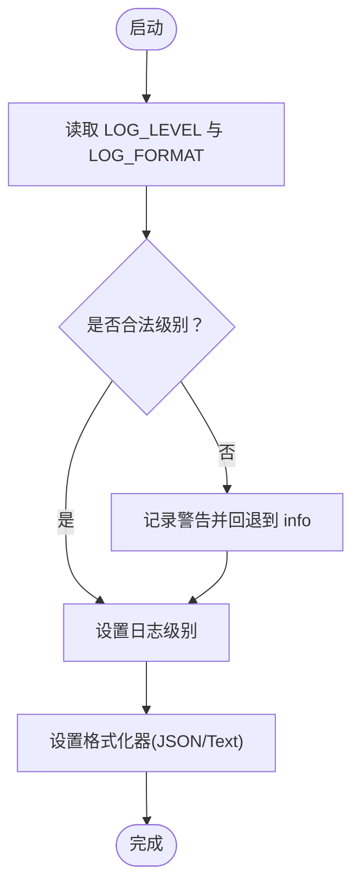
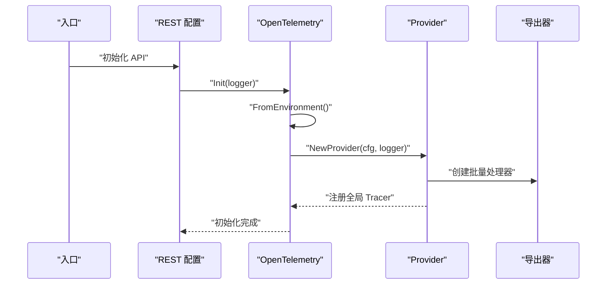
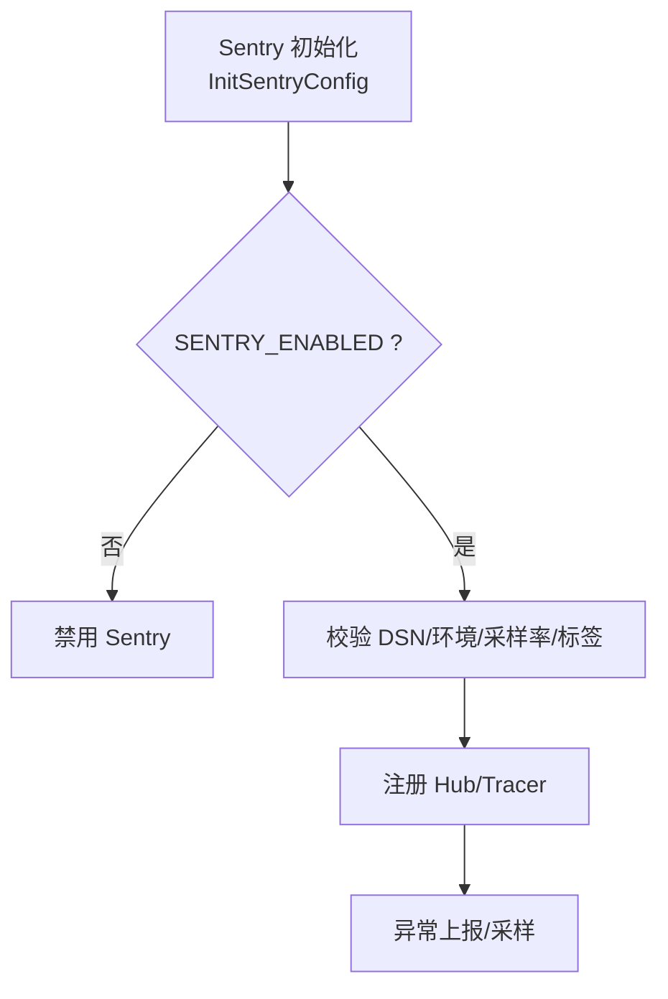
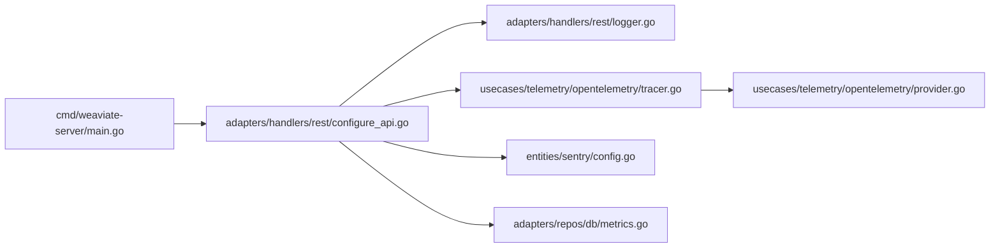

# 日志管理

<cite>
**本文引用的文件**
- [cmd/weaviate-server/main.go](file://cmd/weaviate-server/main.go)
- [adapters/handlers/rest/configure_api.go](file://adapters/handlers/rest/configure_api.go)
- [adapters/handlers/rest/logger.go](file://adapters/handlers/rest/logger.go)
- [cluster/log/logger.go](file://cluster/log/logger.go)
- [usecases/telemetry/opentelemetry/tracer.go](file://usecases/telemetry/opentelemetry/tracer.go)
- [usecases/telemetry/opentelemetry/provider.go](file://usecases/telemetry/opentelemetry/provider.go)
- [entities/sentry/config.go](file://entities/sentry/config.go)
- [entities/sentry/errors.go](file://entities/sentry/errors.go)
- [usecases/config/environment.go](file://usecases/config/environment.go)
- [adapters/repos/db/vector/hnsw/commitlog/logger.go](file://adapters/repos/db/vector/hnsw/commitlog/logger.go)
- [adapters/repos/db/vector/hnsw/condensor.go](file://adapters/repos/db/vector/hnsw/condensor.go)
- [adapters/repos/db/node_wide_metrics.go](file://adapters/repos/db/node_wide_metrics.go)
- [adapters/repos/db/metrics.go](file://adapters/repos/db/metrics.go)
- [tools/dev/run_dev_server.sh](file://tools/dev/run_dev_server.sh)
- [tools/dev/grafana/grafana.ini](file://tools/dev/grafana/grafana.ini)
- [tools/telemetry-dashboard/main.go](file://tools/telemetry-dashboard/main.go)
</cite>

## 目录
1. [简介](#简介)
2. [项目结构](#项目结构)
3. [核心组件](#核心组件)
4. [架构总览](#架构总览)
5. [详细组件分析](#详细组件分析)
6. [依赖分析](#依赖分析)
7. [性能考虑](#性能考虑)
8. [故障排查指南](#故障排查指南)
9. [结论](#结论)
10. [附录](#附录)

## 简介
本指南面向开发与运维团队，系统化梳理 Weaviate 的日志管理体系，覆盖日志级别配置、日志聚合与轮转、日志分析与异常检测、分布式追踪集成、日志监控与告警、以及日志长期保存与合规策略。文档以仓库源码为依据，提供可操作的配置建议与最佳实践。

## 项目结构
Weaviate 的日志体系由以下层次构成：
- 入口与启动：服务入口负责初始化 REST API 与日志器。
- REST 层日志：统一的文本/JSON 格式化器与日志级别解析。
- 内部日志适配：集群模块将 logrus 与 hclog 统一桥接。
- 分布式追踪：OpenTelemetry 提供全局追踪能力。
- 错误采集：Sentry 配置与异常上报。
- 指标与可观测：Prometheus 指标与 Grafana 可视化。
- 存储层日志：向量索引提交日志与内存压缩器日志。

**图示来源**
- [cmd/weaviate-server/main.go](file://cmd/weaviate-server/main.go#L30-L66)
- [adapters/handlers/rest/configure_api.go](file://adapters/handlers/rest/configure_api.go#L1304-L1325)
- [adapters/handlers/rest/logger.go](file://adapters/handlers/rest/logger.go#L22-L66)
- [cluster/log/logger.go](file://cluster/log/logger.go#L25-L30)
- [usecases/telemetry/opentelemetry/tracer.go](file://usecases/telemetry/opentelemetry/tracer.go#L26-L50)
- [usecases/telemetry/opentelemetry/provider.go](file://usecases/telemetry/opentelemetry/provider.go#L47-L103)
- [entities/sentry/config.go](file://entities/sentry/config.go#L48-L117)
- [adapters/repos/db/metrics.go](file://adapters/repos/db/metrics.go#L76-L130)
- [adapters/repos/db/node_wide_metrics.go](file://adapters/repos/db/node_wide_metrics.go#L53-L102)
- [adapters/repos/db/vector/hnsw/commitlog/logger.go](file://adapters/repos/db/vector/hnsw/commitlog/logger.go#L323-L362)
- [adapters/repos/db/vector/hnsw/condensor.go](file://adapters/repos/db/vector/hnsw/condensor.go#L472-L474)

**章节来源**
- [cmd/weaviate-server/main.go](file://cmd/weaviate-server/main.go#L30-L66)
- [adapters/handlers/rest/configure_api.go](file://adapters/handlers/rest/configure_api.go#L1304-L1325)

## 核心组件
- 日志器与格式化器
  - 文本/JSON 格式化器在 REST 层定义，并注入构建版本信息字段。
  - 日志级别从环境变量解析，支持 panic、fatal、error、warn/warning、info、debug、trace。
- 日志级别映射与适配
  - 集群模块将 logrus 与 hclog 对齐，确保统一的日志级别语义。
- 分布式追踪
  - OpenTelemetry 全局提供者按环境变量初始化，支持批量导出、采样率与资源标签。
- 错误采集
  - Sentry 配置通过环境变量启用，支持错误采样率、追踪采样率与标签。
- 指标与可视化
  - Prometheus 指标分组与命名空间控制；Grafana 仪表盘与告警规则。
- 存储层日志
  - 向量索引提交日志与内存压缩器日志，便于定位写入与压缩阶段问题。

**章节来源**
- [adapters/handlers/rest/logger.go](file://adapters/handlers/rest/logger.go#L22-L91)
- [cluster/log/logger.go](file://cluster/log/logger.go#L39-L182)
- [usecases/telemetry/opentelemetry/tracer.go](file://usecases/telemetry/opentelemetry/tracer.go#L26-L72)
- [entities/sentry/config.go](file://entities/sentry/config.go#L48-L117)
- [adapters/repos/db/metrics.go](file://adapters/repos/db/metrics.go#L76-L130)

## 架构总览
下图展示日志与追踪在系统中的交互路径：入口初始化 REST 与日志器；REST 层根据环境变量设置格式与级别；OpenTelemetry 提供全局追踪；Sentry 负责错误与追踪采集；Prometheus/Grafana 提供指标与可视化。

**图示来源**
- [cmd/weaviate-server/main.go](file://cmd/weaviate-server/main.go#L30-L66)
- [adapters/handlers/rest/configure_api.go](file://adapters/handlers/rest/configure_api.go#L1304-L1325)
- [adapters/handlers/rest/logger.go](file://adapters/handlers/rest/logger.go#L22-L66)
- [usecases/telemetry/opentelemetry/tracer.go](file://usecases/telemetry/opentelemetry/tracer.go#L26-L50)
- [usecases/telemetry/opentelemetry/provider.go](file://usecases/telemetry/opentelemetry/provider.go#L47-L103)
- [entities/sentry/config.go](file://entities/sentry/config.go#L48-L117)
- [adapters/repos/db/metrics.go](file://adapters/repos/db/metrics.go#L76-L130)
- [tools/dev/grafana/grafana.ini](file://tools/dev/grafana/grafana.ini#L672-L719)

## 详细组件分析

### 日志级别与配置
- 支持的日志级别（大小写不敏感）：panic、fatal、error、warn/warning、info、debug、trace。
- 默认格式为 JSON；当 LOG_FORMAT 设置为 text 时切换为文本格式。
- 默认级别为 info；若 LOG_LEVEL 值非法，将回退到 info 并记录警告。

**图示来源**
- [adapters/handlers/rest/configure_api.go](file://adapters/handlers/rest/configure_api.go#L1304-L1325)
- [adapters/handlers/rest/logger.go](file://adapters/handlers/rest/logger.go#L70-L91)

**章节来源**
- [adapters/handlers/rest/configure_api.go](file://adapters/handlers/rest/configure_api.go#L1304-L1325)
- [adapters/handlers/rest/logger.go](file://adapters/handlers/rest/logger.go#L70-L91)

### 日志聚合与轮转
- 日志格式化器在 JSON/Text 中注入构建版本信息字段，便于跨实例聚合与检索。
- 仓库未内置基于时间或大小的自动轮转逻辑；建议结合外部日志代理（如 Fluent Bit、Vector、Logstash）实现轮转与归档。
- Prometheus 指标可用于观测日志量趋势，辅助容量规划。

**章节来源**
- [adapters/handlers/rest/logger.go](file://adapters/handlers/rest/logger.go#L22-L66)
- [adapters/repos/db/metrics.go](file://adapters/repos/db/metrics.go#L76-L130)

### 日志分析与异常检测
- 关键字段：构建版本、Go 版本、镜像标签、Git 提交号等，有助于定位版本与环境差异。
- 建议在日志中保留统一的结构化字段（如 action、module、request_id），便于过滤与聚合。
- 异常检测可基于错误级别阈值、错误类型分布、速率突增等规则触发告警。

**章节来源**
- [adapters/handlers/rest/logger.go](file://adapters/handlers/rest/logger.go#L37-L66)

### 分布式追踪集成
- OpenTelemetry 全局提供者按环境变量初始化，支持批量导出、采样率与资源标签。
- 通过全局 Tracer 获取追踪器，用于关键路径埋点与链路追踪。
- Sentry 亦可与追踪联动，按采样率上报事务与错误。

**图示来源**
- [usecases/telemetry/opentelemetry/tracer.go](file://usecases/telemetry/opentelemetry/tracer.go#L26-L50)
- [usecases/telemetry/opentelemetry/provider.go](file://usecases/telemetry/opentelemetry/provider.go#L47-L103)

**章节来源**
- [usecases/telemetry/opentelemetry/tracer.go](file://usecases/telemetry/opentelemetry/tracer.go#L26-L72)
- [usecases/telemetry/opentelemetry/provider.go](file://usecases/telemetry/opentelemetry/provider.go#L47-L103)

### 错误采集与采样
- Sentry 通过环境变量启用，支持错误采样率、追踪采样率与标签。
- 当启用时，异常可通过 Recover/CaptureException 上报；可结合 OpenTelemetry 事务上下文提升关联度。

**图示来源**
- [entities/sentry/config.go](file://entities/sentry/config.go#L48-L117)
- [entities/sentry/errors.go](file://entities/sentry/errors.go#L18-L32)

**章节来源**
- [entities/sentry/config.go](file://entities/sentry/config.go#L48-L117)
- [entities/sentry/errors.go](file://entities/sentry/errors.go#L18-L32)

### 指标与监控
- Prometheus 指标分组与命名空间控制，支持按类/分片聚合，降低指标基数。
- Grafana 仪表盘与告警规则可用于日志量、错误率、延迟等指标的可视化与告警。
- 开发脚本提供了本地 Prometheus/Grafana 启动流程，便于验证监控链路。

**章节来源**
- [adapters/repos/db/metrics.go](file://adapters/repos/db/metrics.go#L76-L130)
- [adapters/repos/db/node_wide_metrics.go](file://adapters/repos/db/node_wide_metrics.go#L53-L102)
- [tools/dev/run_dev_server.sh](file://tools/dev/run_dev_server.sh#L1155-L1178)
- [tools/dev/grafana/grafana.ini](file://tools/dev/grafana/grafana.ini#L672-L719)

### 存储层日志与定位
- 向量索引提交日志与内存压缩器日志可用于定位写入与压缩阶段的性能瓶颈与异常。
- 建议在生产环境开启必要的存储层日志，并结合追踪 ID 进行端到端关联。

**章节来源**
- [adapters/repos/db/vector/hnsw/commitlog/logger.go](file://adapters/repos/db/vector/hnsw/commitlog/logger.go#L323-L362)
- [adapters/repos/db/vector/hnsw/condensor.go](file://adapters/repos/db/vector/hnsw/condensor.go#L472-L474)

## 依赖分析
- 入口程序依赖 REST 服务器与 Swagger 规范加载。
- REST 配置依赖日志器、OpenTelemetry、Sentry 与模块初始化。
- OpenTelemetry 依赖 Provider 创建导出器与批量处理器。
- Sentry 依赖配置解析与 Hub 注册。
- 指标模块依赖 Prometheus 客户端与分组策略。

**图示来源**
- [cmd/weaviate-server/main.go](file://cmd/weaviate-server/main.go#L30-L66)
- [adapters/handlers/rest/configure_api.go](file://adapters/handlers/rest/configure_api.go#L1304-L1325)
- [adapters/handlers/rest/logger.go](file://adapters/handlers/rest/logger.go#L22-L66)
- [usecases/telemetry/opentelemetry/tracer.go](file://usecases/telemetry/opentelemetry/tracer.go#L26-L50)
- [usecases/telemetry/opentelemetry/provider.go](file://usecases/telemetry/opentelemetry/provider.go#L47-L103)
- [entities/sentry/config.go](file://entities/sentry/config.go#L48-L117)
- [adapters/repos/db/metrics.go](file://adapters/repos/db/metrics.go#L76-L130)

**章节来源**
- [cmd/weaviate-server/main.go](file://cmd/weaviate-server/main.go#L30-L66)
- [adapters/handlers/rest/configure_api.go](file://adapters/handlers/rest/configure_api.go#L1304-L1325)

## 性能考虑
- 日志级别与格式：在高吞吐场景建议使用 JSON 格式与 info/warn 级别，避免 debug/trace 的高频开销。
- OpenTelemetry 批量导出与采样：合理设置批大小与超时，降低导出开销；采样率需平衡可观测性与成本。
- Sentry 采样：默认错误全量上报，追踪仅 10%，可根据业务调整。
- 指标分组：启用 Prometheus 分组可显著降低指标基数，提升查询效率。

[本节为通用指导，无需特定文件引用]

## 故障排查指南
- 日志级别无效
  - 现象：设置 LOG_LEVEL 后被回退到 info 并记录警告。
  - 处理：确认环境变量值为受支持级别之一。
- OpenTelemetry 未生效
  - 现象：未看到追踪导出日志。
  - 处理：检查环境变量配置与导出器端点；确认初始化成功。
- Sentry 未上报
  - 现象：异常未出现在 Sentry。
  - 处理：确认 SENTRY_ENABLED 与 DSN；检查采样率与标签；确保异常被捕获路径正确。
- 指标缺失或异常
  - 现象：Grafana 无数据或数据异常。
  - 处理：检查 Prometheus 抓取端口与分组开关；核对指标命名空间与标签。

**章节来源**
- [adapters/handlers/rest/configure_api.go](file://adapters/handlers/rest/configure_api.go#L1317-L1323)
- [usecases/telemetry/opentelemetry/tracer.go](file://usecases/telemetry/opentelemetry/tracer.go#L37-L47)
- [entities/sentry/config.go](file://entities/sentry/config.go#L61-L64)
- [adapters/repos/db/metrics.go](file://adapters/repos/db/metrics.go#L82-L86)

## 结论
Weaviate 的日志体系以 REST 层日志器为核心，结合 OpenTelemetry 与 Sentry 实现可观测与错误采集，辅以 Prometheus 指标与 Grafana 可视化。通过合理的日志级别、格式与采样策略，可在保证性能的同时满足问题定位与运营监控需求。建议在生产环境中配合外部日志代理实现轮转与归档，并建立完善的告警与合规策略。

[本节为总结，无需特定文件引用]

## 附录

### 环境变量与配置要点
- 日志相关
  - LOG_LEVEL：支持 panic、fatal、error、warn、warning、info、debug、trace。
  - LOG_FORMAT：非 text 时使用 JSON 格式。
- OpenTelemetry
  - 通过环境变量初始化，支持服务名、环境、导出端点、协议、采样率等。
- Sentry
  - SENTRY_ENABLED、SENTRY_DSN、SENTRY_ENVIRONMENT、SENTRY_ERROR_SAMPLE_RATE、SENTRY_TRACES_SAMPLE_RATE、SENTRY_PROFILE_SAMPLE_RATE、SENTRY_TAG_*。
- 指标与监控
  - PROMETHEUS_MONITORING_ENABLED、PROMETHEUS_MONITORING_GROUP、PROMETHEUS_MONITORING_METRIC_NAMESPACE、PROMETHEUS_MONITOR_CRITICAL_BUCKETS_ONLY。

**章节来源**
- [adapters/handlers/rest/configure_api.go](file://adapters/handlers/rest/configure_api.go#L1304-L1325)
- [usecases/telemetry/opentelemetry/tracer.go](file://usecases/telemetry/opentelemetry/tracer.go#L26-L50)
- [entities/sentry/config.go](file://entities/sentry/config.go#L48-L117)
- [usecases/config/environment.go](file://usecases/config/environment.go#L62-L91)