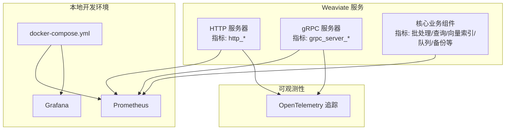
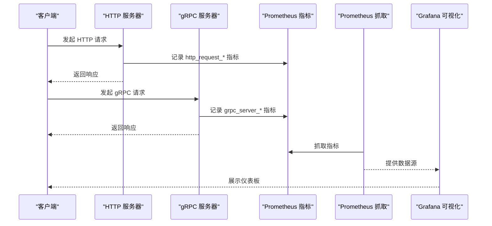
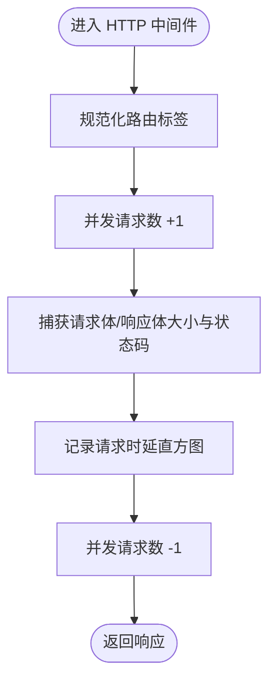
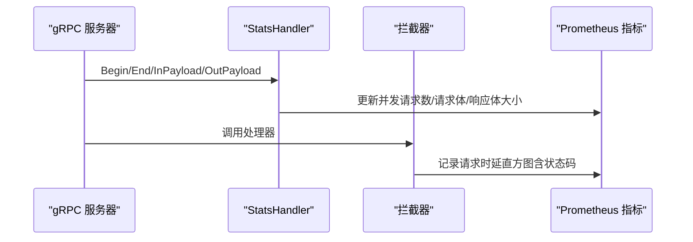
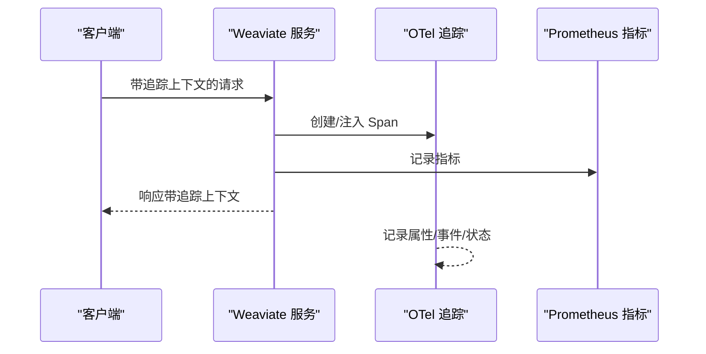
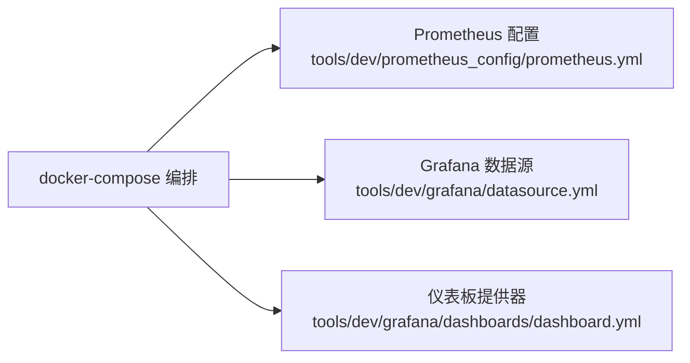
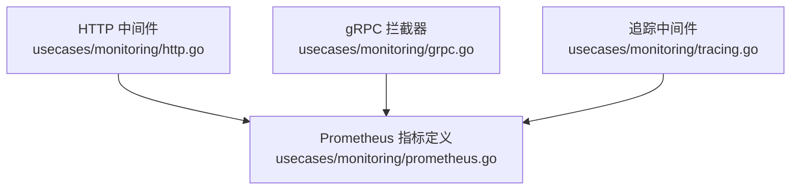

# 监控运维

<cite>
**本文引用的文件**
- [docs/metrics.md](file://docs/metrics.md)
- [usecases/monitoring/prometheus.go](file://usecases/monitoring/prometheus.go)
- [usecases/monitoring/http.go](file://usecases/monitoring/http.go)
- [usecases/monitoring/grpc.go](file://usecases/monitoring/grpc.go)
- [usecases/monitoring/tracing.go](file://usecases/monitoring/tracing.go)
- [tools/dev/prometheus_config/prometheus.yml](file://tools/dev/prometheus_config/prometheus.yml)
- [tools/dev/grafana/datasource.yml](file://tools/dev/grafana/datasource.yml)
- [tools/dev/grafana/dashboards/dashboard.yml](file://tools/dev/grafana/dashboards/dashboard.yml)
- [docker-compose.yml](file://docker-compose.yml)
</cite>

## 目录
1. [简介](#简介)
2. [项目结构](#项目结构)
3. [核心组件](#核心组件)
4. [架构总览](#架构总览)
5. [详细组件分析](#详细组件分析)
6. [依赖关系分析](#依赖关系分析)
7. [性能考虑](#性能考虑)
8. [故障排查指南](#故障排查指南)
9. [结论](#结论)
10. [附录](#附录)

## 简介
本指南面向运维工程师与 SRE 团队，围绕 Weaviate 的监控与运维实践提供系统化方案。内容覆盖指标采集策略（系统、应用、业务）、告警配置方法（规则、通知、分级）、性能调优（慢查询识别、资源优化、瓶颈定位）、日志管理（级别、聚合、分析）、运维自动化（巡检与自愈思路）、仪表板与报告模板等，帮助在生产环境中实现可观测性与稳定性。

## 项目结构
Weaviate 在监控与可观测性方面采用“指标 + 追踪 + 日志”三位一体的设计：
- 指标体系：集中于 Prometheus，指标清单与分类由官方文档统一维护，并在核心模块中按类别注册。
- 追踪体系：基于 OpenTelemetry，贯穿 HTTP/gRPC 请求链路，便于端到端问题定位。
- 本地开发环境：提供 Prometheus、Grafana 的一键编排，便于仪表板与告警规则验证。

图表来源
- [docker-compose.yml](file://docker-compose.yml#L21-L41)
- [usecases/monitoring/http.go](file://usecases/monitoring/http.go#L45-L97)
- [usecases/monitoring/grpc.go](file://usecases/monitoring/grpc.go#L48-L68)
- [usecases/monitoring/prometheus.go](file://usecases/monitoring/prometheus.go#L214-L289)

章节来源
- [docker-compose.yml](file://docker-compose.yml#L1-L140)
- [tools/dev/prometheus_config/prometheus.yml](file://tools/dev/prometheus_config/prometheus.yml#L1-L26)
- [tools/dev/grafana/datasource.yml](file://tools/dev/grafana/datasource.yml#L1-L22)
- [tools/dev/grafana/dashboards/dashboard.yml](file://tools/dev/grafana/dashboards/dashboard.yml#L1-L12)

## 核心组件
- 指标注册与命名规范：统一的指标命名空间与标签集合，确保跨节点一致性与可读性。
- HTTP/gRPC 服务器指标：请求时延、请求体/响应体大小、并发请求数等，支持静态路由标签以控制标签基数。
- 追踪中间件：自动提取/注入上下文，记录关键属性与事件，便于跨服务链路分析。
- 本地开发栈：Prometheus/Grafana 编排，便于快速验证仪表板与告警规则。

章节来源
- [usecases/monitoring/prometheus.go](file://usecases/monitoring/prometheus.go#L27-L36)
- [usecases/monitoring/http.go](file://usecases/monitoring/http.go#L31-L61)
- [usecases/monitoring/grpc.go](file://usecases/monitoring/grpc.go#L48-L68)
- [usecases/monitoring/tracing.go](file://usecases/monitoring/tracing.go#L32-L89)

## 架构总览
下图展示 Weaviate 在监控与追踪方面的关键交互路径：HTTP/gRPC 服务器通过中间件/拦截器采集指标；核心业务组件注册各类指标；Prometheus 抓取；Grafana 展示；OpenTelemetry 负责链路追踪。

图表来源
- [usecases/monitoring/http.go](file://usecases/monitoring/http.go#L63-L97)
- [usecases/monitoring/grpc.go](file://usecases/monitoring/grpc.go#L90-L158)
- [usecases/monitoring/prometheus.go](file://usecases/monitoring/prometheus.go#L214-L289)
- [tools/dev/prometheus_config/prometheus.yml](file://tools/dev/prometheus_config/prometheus.yml#L5-L26)

## 详细组件分析

### 指标体系与采集策略
- 指标分类与用途
  - 仪表盘类（活跃）：用于仪表板的核心指标，标签有限且稳定。
  - 运营类（活跃）：健康/运行状态与后台任务，尽量采样。
  - 告警类：最小化、基于症状的告警，低标签基数。
  - 分析类（可移出 Prometheus）：调试/分析用，避免长期留存与高基数。
  - 可废弃/已废弃：逐步迁移与清理。
- 关键指标类别
  - 批处理与对象操作：批处理耗时、批处理字节数、对象数量等。
  - 查询操作：并发查询数、请求总数、查询耗时、向量维度统计等。
  - LSM/向量索引：段数量、内存表大小、墓碑、维护耗时、后台操作等。
  - 启动阶段：启动进度、启动耗时、磁盘吞吐等。
  - 队列与备份：队列长度/磁盘占用/暂停状态/分区处理耗时；备份/恢复阶段耗时与传输字节等。
  - 模块与分词器：外部模块请求次数/耗时/大小/状态码；分词器令牌统计等。
  - HTTP/gRPC 服务器：请求时延、请求/响应体大小、并发请求数等。
- 标签基数控制
  - 优先使用少量有界标签集。
  - 避免每租户/每类/每路由的标签爆炸，除非对运营至关重要。
  - 探索性或宽标签分析移至日志/追踪或外部存储。

章节来源
- [docs/metrics.md](file://docs/metrics.md#L16-L36)
- [docs/metrics.md](file://docs/metrics.md#L40-L124)
- [docs/metrics.md](file://docs/metrics.md#L127-L205)
- [docs/metrics.md](file://docs/metrics.md#L208-L216)
- [docs/metrics.md](file://docs/metrics.md#L217-L230)
- [docs/metrics.md](file://docs/metrics.md#L232-L266)
- [docs/metrics.md](file://docs/metrics.md#L267-L395)

### HTTP 指标采集与路由标签
- 静态路由标签：将动态路径规范化为静态标签，避免路由参数导致的标签爆炸。
- 指标维度：方法、静态路由、状态码；同时记录请求体/响应体大小与并发请求数。
- 实现要点：在中间件中注入计数器与直方图，使用 httpsnoop 获取时延与状态码。

图表来源
- [usecases/monitoring/http.go](file://usecases/monitoring/http.go#L63-L97)

章节来源
- [usecases/monitoring/http.go](file://usecases/monitoring/http.go#L23-L61)
- [usecases/monitoring/http.go](file://usecases/monitoring/http.go#L63-L97)

### gRPC 指标采集与状态映射
- 指标维度：服务名、方法、状态码（映射自错误）。
- 实现要点：通过 stats.Handler 统计并发请求数；通过拦截器记录时延直方图；将 Go 错误映射为 gRPC 状态码。

图表来源
- [usecases/monitoring/grpc.go](file://usecases/monitoring/grpc.go#L70-L158)

章节来源
- [usecases/monitoring/grpc.go](file://usecases/monitoring/grpc.go#L37-L68)
- [usecases/monitoring/grpc.go](file://usecases/monitoring/grpc.go#L70-L158)

### 追踪与链路分析
- HTTP 追踪：从请求头提取上下文，创建 Span，注入响应头，记录状态码、响应大小、耗时与事件。
- gRPC 追踪：从元数据提取上下文，创建 Span，注入出站元数据，记录耗时与状态码。
- 追踪传输：为 HTTP 客户端注入上下文，便于跨服务链路串联。

图表来源
- [usecases/monitoring/tracing.go](file://usecases/monitoring/tracing.go#L32-L89)
- [usecases/monitoring/tracing.go](file://usecases/monitoring/tracing.go#L91-L156)
- [usecases/monitoring/tracing.go](file://usecases/monitoring/tracing.go#L301-L328)

章节来源
- [usecases/monitoring/tracing.go](file://usecases/monitoring/tracing.go#L32-L89)
- [usecases/monitoring/tracing.go](file://usecases/monitoring/tracing.go#L91-L156)
- [usecases/monitoring/tracing.go](file://usecases/monitoring/tracing.go#L294-L347)

### 本地开发与可视化
- Prometheus 抓取配置：多节点静态目标与节点 Exporter。
- Grafana 数据源与仪表板：自动挂载数据源与仪表板目录。
- docker-compose：一键拉起 Prometheus/Grafana 与 Weaviate 开发环境。

图表来源
- [tools/dev/prometheus_config/prometheus.yml](file://tools/dev/prometheus_config/prometheus.yml#L5-L26)
- [tools/dev/grafana/datasource.yml](file://tools/dev/grafana/datasource.yml#L6-L21)
- [tools/dev/grafana/dashboards/dashboard.yml](file://tools/dev/grafana/dashboards/dashboard.yml#L2-L11)
- [docker-compose.yml](file://docker-compose.yml#L21-L41)

章节来源
- [tools/dev/prometheus_config/prometheus.yml](file://tools/dev/prometheus_config/prometheus.yml#L1-L26)
- [tools/dev/grafana/datasource.yml](file://tools/dev/grafana/datasource.yml#L1-L22)
- [tools/dev/grafana/dashboards/dashboard.yml](file://tools/dev/grafana/dashboards/dashboard.yml#L1-L12)
- [docker-compose.yml](file://docker-compose.yml#L1-L140)

## 依赖关系分析
- 指标注册与使用
  - Prometheus 指标在核心模块中就近注册，避免全局共享带来的耦合。
  - 提供删除类/分片指标的辅助函数，便于多租户场景下的指标清理。
- HTTP/gRPC 与指标
  - 中间件/拦截器仅依赖 Prometheus 注册器与指标向量，解耦业务逻辑。
- 追踪与指标
  - 追踪与指标并行采集，互不干扰，便于独立分析与关联。

图表来源
- [usecases/monitoring/prometheus.go](file://usecases/monitoring/prometheus.go#L438-L780)
- [usecases/monitoring/http.go](file://usecases/monitoring/http.go#L45-L97)
- [usecases/monitoring/grpc.go](file://usecases/monitoring/grpc.go#L48-L158)
- [usecases/monitoring/tracing.go](file://usecases/monitoring/tracing.go#L32-L156)

章节来源
- [usecases/monitoring/prometheus.go](file://usecases/monitoring/prometheus.go#L291-L372)
- [usecases/monitoring/http.go](file://usecases/monitoring/http.go#L31-L61)
- [usecases/monitoring/grpc.go](file://usecases/monitoring/grpc.go#L48-L68)
- [usecases/monitoring/tracing.go](file://usecases/monitoring/tracing.go#L294-L347)

## 性能考虑
- 慢查询识别
  - 关注查询时延直方图与并发查询数，结合类名/查询类型进行聚合分析。
  - 对向量相关查询关注过滤后向量耗时与维度总量。
- 资源使用优化
  - LSM 指标：段数量、内存表大小、未加载段数量，辅助判断合并/刷写策略。
  - 向量索引：墓碑数量与清理进度、后台操作耗时与待处理数量。
  - 队列：队列长度/磁盘占用/暂停状态/分区处理耗时，评估背压与异步处理能力。
- 瓶颈定位方法
  - 结合 HTTP/gRPC 时延与状态码分布，定位慢端点与错误集中区域。
  - 利用追踪事件与属性，复原端到端耗时构成，定位热点模块。

章节来源
- [docs/metrics.md](file://docs/metrics.md#L52-L124)
- [docs/metrics.md](file://docs/metrics.md#L61-L118)
- [docs/metrics.md](file://docs/metrics.md#L113-L163)
- [docs/metrics.md](file://docs/metrics.md#L169-L184)
- [usecases/monitoring/http.go](file://usecases/monitoring/http.go#L63-L97)
- [usecases/monitoring/grpc.go](file://usecases/monitoring/grpc.go#L90-L158)

## 故障排查指南
- 快速定位
  - 查看查询时延与并发查询数异常；检查向量索引墓碑与后台操作积压。
  - 观察 HTTP/gRPC 时延与状态码分布，识别错误集中端点。
- 指标清理
  - 多租户/分片删除后，使用删除类/分片指标函数清理历史标签组合，避免残留。
- 追踪辅助
  - 在问题时段开启追踪，结合指标与追踪事件，还原请求路径与耗时构成。

章节来源
- [usecases/monitoring/prometheus.go](file://usecases/monitoring/prometheus.go#L291-L372)
- [usecases/monitoring/http.go](file://usecases/monitoring/http.go#L63-L97)
- [usecases/monitoring/grpc.go](file://usecases/monitoring/grpc.go#L90-L158)
- [usecases/monitoring/tracing.go](file://usecases/monitoring/tracing.go#L32-L89)

## 结论
通过统一的指标分类、严格的标签基数控制、完善的 HTTP/gRPC 指标采集与 OpenTelemetry 追踪，Weaviate 在生产环境中实现了可观测性的闭环。配合本地开发栈与仪表板模板，SRE 团队可以高效地建立监控、告警与自愈流程，持续提升系统稳定性与可维护性。

## 附录

### 指标采集策略与仪表板建议
- 系统指标（节点 Exporter）
  - 抓取频率：15s；重点关注 CPU、内存、磁盘 IO、网络。
- 应用指标（Weaviate）
  - 抓取频率：5s；按类别划分仪表板页签（批处理/查询/索引/队列/备份/模块）。
- 业务指标（可选）
  - 通过外部系统上报业务 KPI，避免直接进入 Prometheus 长期存储。

章节来源
- [tools/dev/prometheus_config/prometheus.yml](file://tools/dev/prometheus_config/prometheus.yml#L2-L3)
- [docs/metrics.md](file://docs/metrics.md#L16-L36)

### 告警设置方法
- 告警规则配置
  - 基于查询时延分位数与并发查询数设置阈值告警。
  - 基于向量索引后台操作积压与失败率设置容量/健康告警。
- 通知渠道设置
  - Prometheus Alertmanager 集成邮件/聊天/电话；按级别路由至不同通道。
- 告警分级管理
  - P0：查询时延异常/服务不可用；P1：索引异常/队列积压；P2：模块外部调用错误率上升。

章节来源
- [docs/metrics.md](file://docs/metrics.md#L208-L216)

### 运维自动化工具与巡检
- 自动化巡检
  - 周期性抓取关键指标，生成健康报告（查询时延、索引状态、队列状况、备份状态）。
- 故障自愈机制
  - 基于告警触发的限流/降级/扩容脚本；对异常分片执行重建/迁移。

章节来源
- [docs/metrics.md](file://docs/metrics.md#L127-L205)

### 运维仪表板与报告模板
- 仪表板模板
  - 顶部：服务可用性与总体负载（并发查询数、HTTP/gRPC 时延）。
  - 中部：索引健康（段数量、内存表大小、墓碑与后台操作）。
  - 底部：队列与备份（队列长度/磁盘占用、备份/恢复阶段耗时）。
- 报告模板
  - 时间范围、关键指标趋势、异常事件、根因分析与改进措施。

章节来源
- [tools/dev/grafana/datasource.yml](file://tools/dev/grafana/datasource.yml#L6-L21)
- [tools/dev/grafana/dashboards/dashboard.yml](file://tools/dev/grafana/dashboards/dashboard.yml#L2-L11)