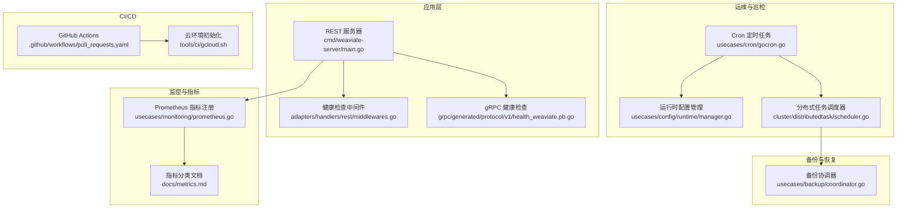
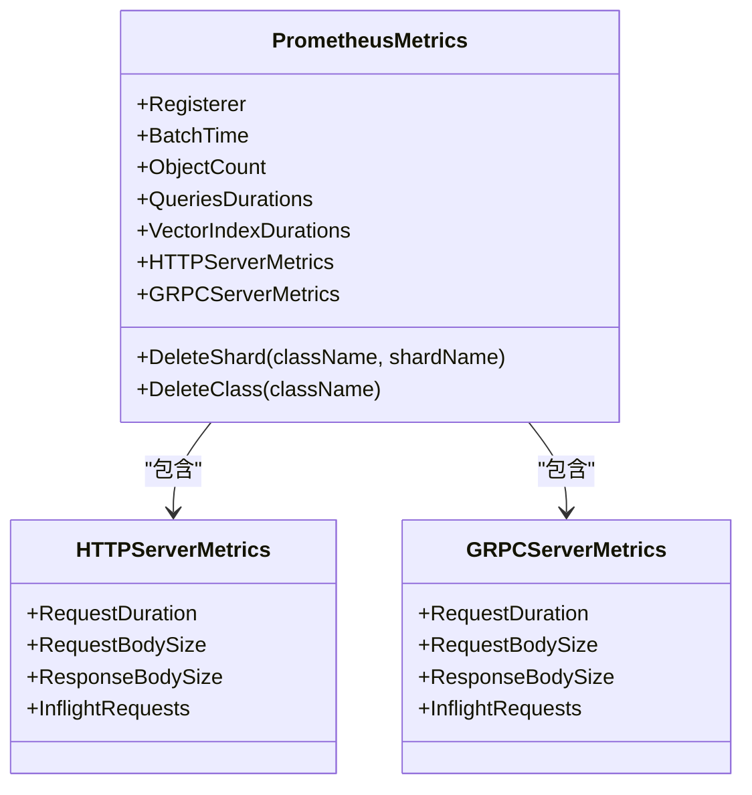
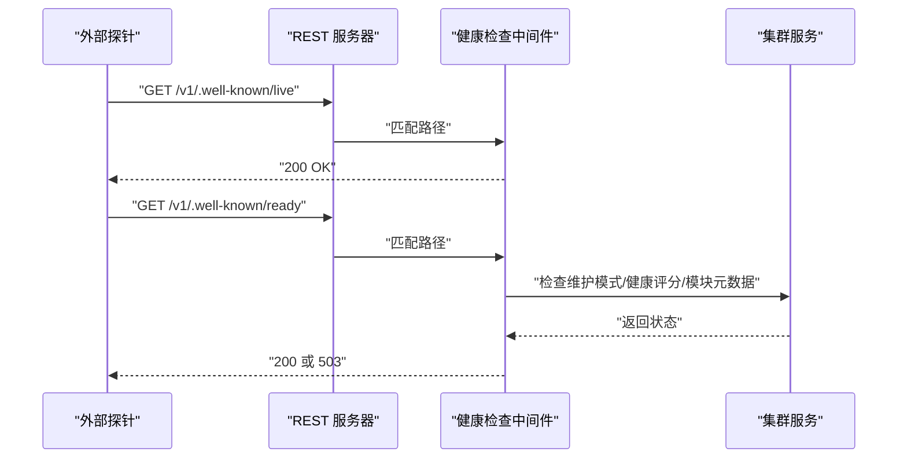
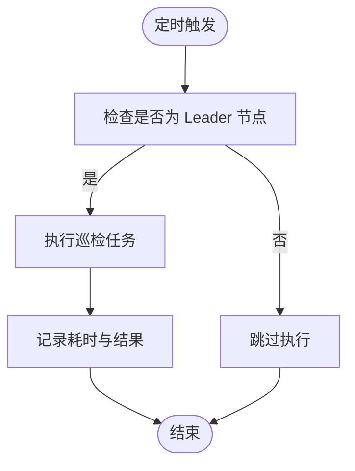
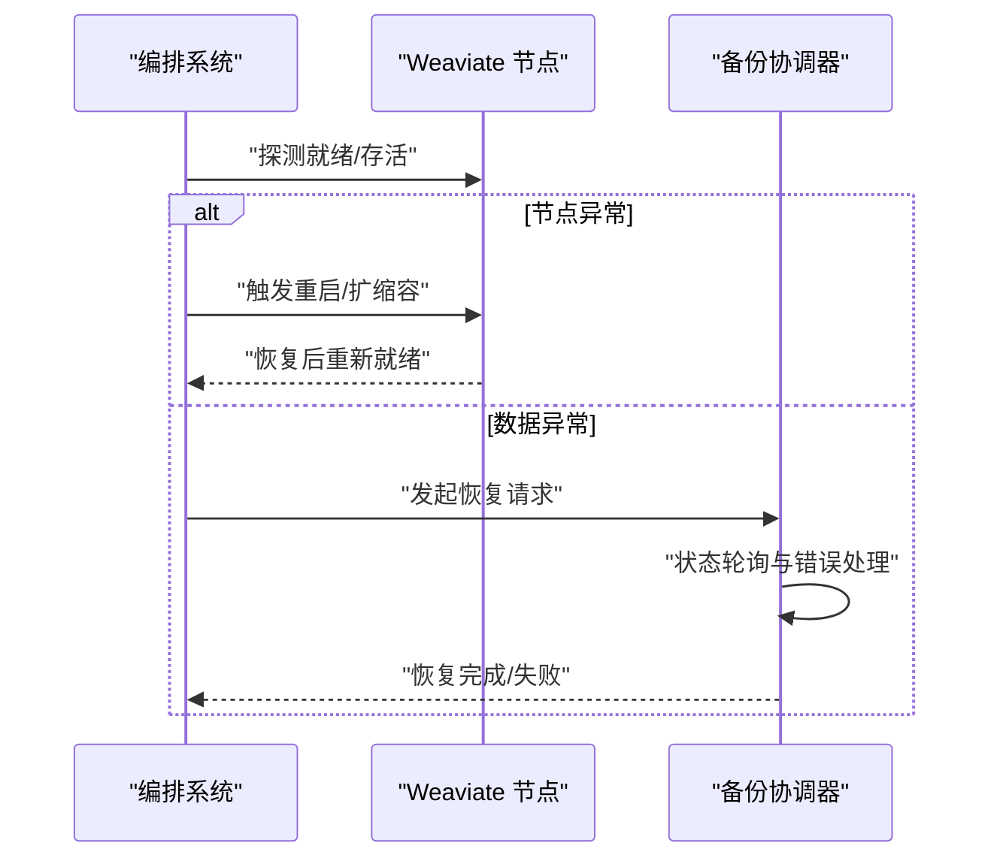
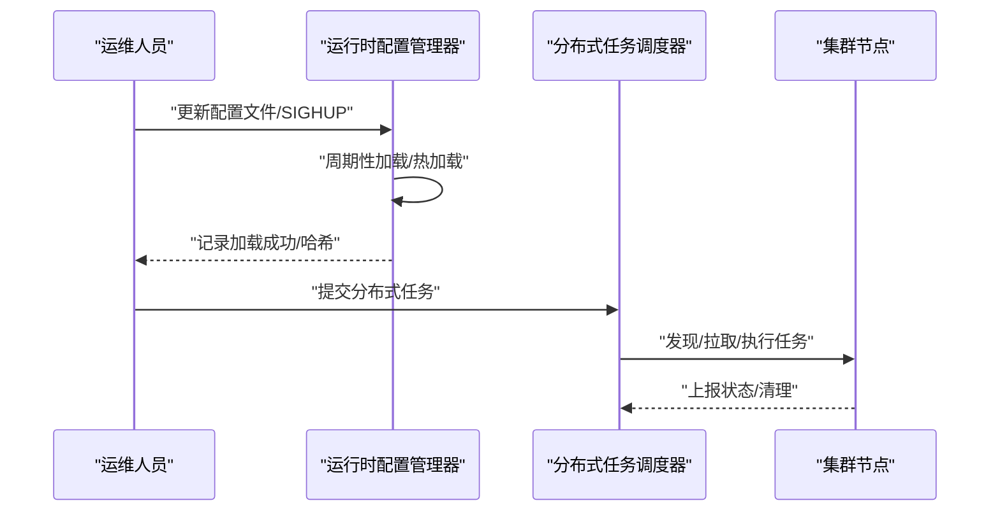
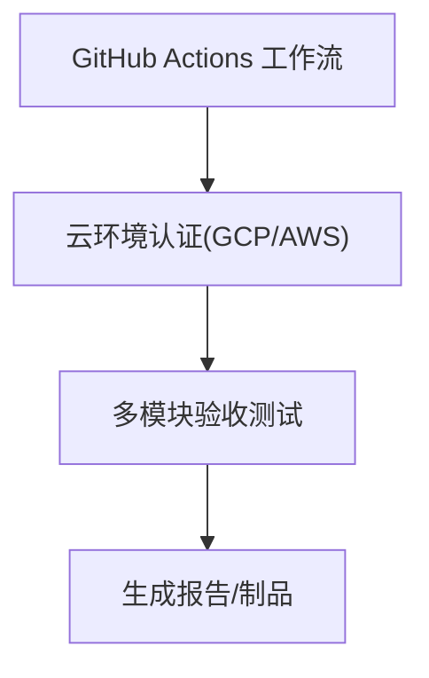
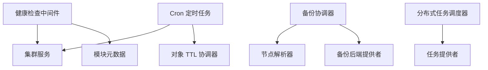

# 自动化运维

<cite>
**本文引用的文件**
- [usecases/monitoring/prometheus.go](file://usecases/monitoring/prometheus.go)
- [docs/metrics.md](file://docs/metrics.md)
- [adapters/handlers/rest/middlewares.go](file://adapters/handlers/rest/middlewares.go)
- [client/operations/operations_client.go](file://client/operations/operations_client.go)
- [grpc/generated/protocol/v1/health_weaviate.pb.go](file://grpc/generated/protocol/v1/health_weaviate.pb.go)
- [usecases/backup/coordinator.go](file://usecases/backup/coordinator.go)
- [usecases/backup/restorer_test.go](file://usecases/backup/restorer_test.go)
- [usecases/cron/gocron.go](file://usecases/cron/gocron.go)
- [entities/cron/gocron.go](file://entities/cron/gocron.go)
- [usecases/config/runtime/manager.go](file://usecases/config/runtime/manager.go)
- [cluster/distributedtask/scheduler.go](file://cluster/distributedtask/scheduler.go)
- [cluster/store.go](file://cluster/store.go)
- [.github/workflows/pull_requests.yaml](file://.github/workflows/pull_requests.yaml)
- [tools/ci/gcloud.sh](file://tools/ci/gcloud.sh)
- [cmd/weaviate-server/main.go](file://cmd/weaviate-server/main.go)
</cite>

## 目录
1. [简介](#简介)
2. [项目结构](#项目结构)
3. [核心组件](#核心组件)
4. [架构总览](#架构总览)
5. [详细组件分析](#详细组件分析)
6. [依赖分析](#依赖分析)
7. [性能考量](#性能考量)
8. [故障排查指南](#故障排查指南)
9. [结论](#结论)
10. [附录](#附录)

## 简介
本指南面向 DevOps 与 SRE 团队，围绕 Weaviate 的自动化运维能力，系统讲解监控指标体系、健康检查与故障检测、自动化巡检与自愈机制、运维自动化流程（部署/配置/变更），以及与 CI/CD 的集成方案与最佳实践。文档以仓库现有实现为依据，结合 Prometheus 指标、健康检查端点、分布式备份协调器、定时任务调度器、分布式任务调度器与运行时配置管理等模块，给出可落地的操作建议与可视化图示。

## 项目结构
Weaviate 的自动化运维相关能力主要分布在以下层次：
- 监控与指标：Prometheus 指标注册与分类、HTTP/gRPC 服务器指标
- 健康检查：REST 与 gRPC 健康检查端点、就绪/存活探针中间件
- 备份与恢复：分布式备份协调器、恢复流程与状态轮询
- 定时与巡检：基于 Cron 的定时任务（如对象 TTL 清理）
- 运维自动化：运行时配置热加载、分布式任务调度器
- CI/CD 集成：GitHub Actions 工作流与云环境配置脚本

```mermaid
graph TB
subgraph "监控与指标"
M1["Prometheus 指标定义<br/>usecases/monitoring/prometheus.go"]
M2["指标分类与使用说明<br/>docs/metrics.md"]
end
subgraph "健康检查"
H1["REST 健康端点<br/>adapters/handlers/rest/middlewares.go"]
H2["gRPC 健康检查<br/>grpc/generated/protocol/v1/health_weaviate.pb.go"]
H3["客户端健康调用<br/>client/operations/operations_client.go"]
end
subgraph "备份与恢复"
B1["分布式备份协调器<br/>usecases/backup/coordinator.go"]
B2["恢复流程测试<br/>usecases/backup/restorer_test.go"]
end
subgraph "定时与巡检"
C1["Cron 定时任务<br/>usecases/cron/gocron.go"]
C2["Go-Cron 日志桥接<br/>entities/cron/gocron.go"]
end
subgraph "运维自动化"
R1["运行时配置管理<br/>usecases/config/runtime/manager.go"]
D1["分布式任务调度器<br/>cluster/distributedtask/scheduler.go"]
end
subgraph "CI/CD 集成"
CI1[".github workflows<br/>.github/workflows/pull_requests.yaml"]
CI2["云环境初始化脚本<br/>tools/ci/gcloud.sh"]
end
M1 --> M2
H1 --> H3
H2 --> H3
B1 --> B2
C1 --> C2
R1 --> D1
CI1 --> CI2
```

**图表来源**
- [usecases/monitoring/prometheus.go](file://usecases/monitoring/prometheus.go#L1-L200)
- [docs/metrics.md](file://docs/metrics.md#L1-L120)
- [adapters/handlers/rest/middlewares.go](file://adapters/handlers/rest/middlewares.go#L233-L260)
- [grpc/generated/protocol/v1/health_weaviate.pb.go](file://grpc/generated/protocol/v1/health_weaviate.pb.go#L109-L151)
- [client/operations/operations_client.go](file://client/operations/operations_client.go#L94-L136)
- [usecases/backup/coordinator.go](file://usecases/backup/coordinator.go#L1-L120)
- [usecases/backup/restorer_test.go](file://usecases/backup/restorer_test.go#L95-L147)
- [usecases/cron/gocron.go](file://usecases/cron/gocron.go#L1-L75)
- [entities/cron/gocron.go](file://entities/cron/gocron.go#L1-L48)
- [usecases/config/runtime/manager.go](file://usecases/config/runtime/manager.go#L46-L202)
- [cluster/distributedtask/scheduler.go](file://cluster/distributedtask/scheduler.go#L1-L120)
- [.github/workflows/pull_requests.yaml](file://.github/workflows/pull_requests.yaml#L559-L586)
- [tools/ci/gcloud.sh](file://tools/ci/gcloud.sh#L1-L26)

**章节来源**
- [usecases/monitoring/prometheus.go](file://usecases/monitoring/prometheus.go#L1-L200)
- [docs/metrics.md](file://docs/metrics.md#L1-L120)
- [adapters/handlers/rest/middlewares.go](file://adapters/handlers/rest/middlewares.go#L233-L260)
- [grpc/generated/protocol/v1/health_weaviate.pb.go](file://grpc/generated/protocol/v1/health_weaviate.pb.go#L109-L151)
- [client/operations/operations_client.go](file://client/operations/operations_client.go#L94-L136)
- [usecases/backup/coordinator.go](file://usecases/backup/coordinator.go#L1-L120)
- [usecases/backup/restorer_test.go](file://usecases/backup/restorer_test.go#L95-L147)
- [usecases/cron/gocron.go](file://usecases/cron/gocron.go#L1-L75)
- [entities/cron/gocron.go](file://entities/cron/gocron.go#L1-L48)
- [usecases/config/runtime/manager.go](file://usecases/config/runtime/manager.go#L46-L202)
- [cluster/distributedtask/scheduler.go](file://cluster/distributedtask/scheduler.go#L1-L120)
- [.github/workflows/pull_requests.yaml](file://.github/workflows/pull_requests.yaml#L559-L586)
- [tools/ci/gcloud.sh](file://tools/ci/gcloud.sh#L1-L26)

## 核心组件
- 指标与监控
  - Prometheus 指标集中定义与注册，覆盖批处理、对象、查询、LSM、向量索引、启动、墓碑、文本转矢量、分片、模块使用、复制引擎、分布式任务、HTTP/gRPC 服务器、集群存储、模式管理、运行时配置等维度。
  - 指标分类与使用场景在文档中明确标注，便于区分仪表板、运营、告警与分析用途。
- 健康检查
  - REST 层提供存活与就绪探针，结合维护模式与集群健康评分、模块元数据可用性进行判定。
  - gRPC 健康检查协议支持服务级健康查询。
  - 客户端封装了健康检查请求方法，便于外部探针调用。
- 备份与恢复
  - 分布式备份协调器负责跨节点的任务编排、状态同步、超时与重试、元数据持久化与恢复。
  - 恢复流程具备状态轮询与错误处理，支持按类/分片粒度恢复。
- 定时与巡检
  - 基于 Cron 的定时任务（如对象 TTL 清理）具备动态调度更新、并发保护与日志桥接。
- 运维自动化
  - 运行时配置管理器支持周期性加载与 SIGHUP 触发热加载，并暴露指标记录加载成功与配置哈希。
  - 分布式任务调度器负责跨节点任务的发现、拉取、执行与清理。
- CI/CD 集成
  - GitHub Actions 工作流中集成云环境认证与多模块验收测试，配合云 SDK 初始化脚本完成环境准备。

**章节来源**
- [usecases/monitoring/prometheus.go](file://usecases/monitoring/prometheus.go#L1-L200)
- [docs/metrics.md](file://docs/metrics.md#L1-L120)
- [adapters/handlers/rest/middlewares.go](file://adapters/handlers/rest/middlewares.go#L233-L260)
- [grpc/generated/protocol/v1/health_weaviate.pb.go](file://grpc/generated/protocol/v1/health_weaviate.pb.go#L109-L151)
- [client/operations/operations_client.go](file://client/operations/operations_client.go#L94-L136)
- [usecases/backup/coordinator.go](file://usecases/backup/coordinator.go#L1-L120)
- [usecases/cron/gocron.go](file://usecases/cron/gocron.go#L1-L75)
- [usecases/config/runtime/manager.go](file://usecases/config/runtime/manager.go#L46-L202)
- [cluster/distributedtask/scheduler.go](file://cluster/distributedtask/scheduler.go#L1-L120)
- [.github/workflows/pull_requests.yaml](file://.github/workflows/pull_requests.yaml#L559-L586)
- [tools/ci/gcloud.sh](file://tools/ci/gcloud.sh#L1-L26)

## 架构总览
下图展示 Weaviate 自动化运维的关键交互：监控指标采集、健康检查端点、备份协调器、定时任务与分布式任务调度器、运行时配置管理，以及 CI/CD 流水线。

**图表来源**
- [cmd/weaviate-server/main.go](file://cmd/weaviate-server/main.go#L1-L69)
- [adapters/handlers/rest/middlewares.go](file://adapters/handlers/rest/middlewares.go#L233-L260)
- [grpc/generated/protocol/v1/health_weaviate.pb.go](file://grpc/generated/protocol/v1/health_weaviate.pb.go#L109-L151)
- [usecases/monitoring/prometheus.go](file://usecases/monitoring/prometheus.go#L1-L200)
- [docs/metrics.md](file://docs/metrics.md#L1-L120)
- [usecases/cron/gocron.go](file://usecases/cron/gocron.go#L1-L75)
- [usecases/config/runtime/manager.go](file://usecases/config/runtime/manager.go#L46-L202)
- [cluster/distributedtask/scheduler.go](file://cluster/distributedtask/scheduler.go#L1-L120)
- [usecases/backup/coordinator.go](file://usecases/backup/coordinator.go#L1-L120)
- [.github/workflows/pull_requests.yaml](file://.github/workflows/pull_requests.yaml#L559-L586)
- [tools/ci/gcloud.sh](file://tools/ci/gcloud.sh#L1-L26)

## 详细组件分析

### 组件一：监控与指标体系
- 指标定义与注册
  - Prometheus 指标在统一结构体中集中声明，包含批处理、对象、查询、LSM、向量索引、启动、墓碑、文本转矢量、分片、模块使用、复制引擎、分布式任务、HTTP/gRPC 服务器、集群存储、模式管理、运行时配置等维度。
  - 支持按类/分片粒度的高基数标签，同时提供“仅关键桶”等优化选项以降低噪声。
- 指标分类与使用
  - 文档明确区分“仪表板活跃”“运营活跃”“告警”“分析（可能移出）”“可废弃”“已废弃”，指导团队在仪表板、告警与分析场景中合理选择指标。
- 实践要点
  - 在生产环境中建议启用关键桶策略，减少高基数标签带来的存储与查询压力。
  - 对于探索性分析，建议将细粒度标签与高基数指标迁移到日志/追踪/外部存储，避免长期滞留 Prometheus。

**图表来源**
- [usecases/monitoring/prometheus.go](file://usecases/monitoring/prometheus.go#L40-L200)
- [usecases/monitoring/prometheus.go](file://usecases/monitoring/prometheus.go#L214-L289)

**章节来源**
- [usecases/monitoring/prometheus.go](file://usecases/monitoring/prometheus.go#L1-L200)
- [docs/metrics.md](file://docs/metrics.md#L1-L120)

### 组件二：健康检查与故障检测
- REST 健康检查
  - 存活端点直接返回成功状态；就绪端点根据维护模式、集群健康评分、模块元数据可用性综合判定。
- gRPC 健康检查
  - 协议定义了服务级健康查询，便于外部探针与编排系统集成。
- 客户端健康调用
  - 客户端封装了存活与就绪检查方法，便于自动化探针调用。
- 故障检测建议
  - 结合就绪探针与集群健康评分，快速识别节点不可用或模块异常。
  - 在编排系统中配置探针失败阈值与延迟，避免抖动导致误判。

**图表来源**
- [adapters/handlers/rest/middlewares.go](file://adapters/handlers/rest/middlewares.go#L233-L260)
- [client/operations/operations_client.go](file://client/operations/operations_client.go#L94-L136)

**章节来源**
- [adapters/handlers/rest/middlewares.go](file://adapters/handlers/rest/middlewares.go#L233-L260)
- [grpc/generated/protocol/v1/health_weaviate.pb.go](file://grpc/generated/protocol/v1/health_weaviate.pb.go#L109-L151)
- [client/operations/operations_client.go](file://client/operations/operations_client.go#L94-L136)

### 组件三：自动化巡检机制
- 定时任务（巡检）
  - 基于 Cron 的定时任务（如对象 TTL 清理）支持动态调度更新、并发保护与日志桥接，确保只在 Leader 节点执行。
- 巡检项配置
  - 通过运行时配置管理器周期性加载配置，支持 SIGHUP 触发热加载，记录加载成功与配置哈希。
- 巡检结果处理
  - 任务执行日志记录开始/结束耗时与错误信息，便于审计与告警。

**图表来源**
- [usecases/cron/gocron.go](file://usecases/cron/gocron.go#L166-L195)
- [usecases/config/runtime/manager.go](file://usecases/config/runtime/manager.go#L178-L202)

**章节来源**
- [usecases/cron/gocron.go](file://usecases/cron/gocron.go#L1-L221)
- [entities/cron/gocron.go](file://entities/cron/gocron.go#L1-L48)
- [usecases/config/runtime/manager.go](file://usecases/config/runtime/manager.go#L46-L202)

### 组件四：故障自愈机制
- 自动重启
  - 通过编排系统的存活/就绪探针与重启策略实现节点级自愈；健康检查端点为探针提供基础。
- 资源扩容
  - 通过水平扩展副本与分片策略提升吞吐与可用性；备份协调器支持跨节点恢复，保障数据一致性。
- 数据修复
  - 备份协调器具备元数据持久化与断点续修能力，恢复流程包含状态轮询与错误处理，支持按类/分片粒度恢复。

**图表来源**
- [adapters/handlers/rest/middlewares.go](file://adapters/handlers/rest/middlewares.go#L233-L260)
- [usecases/backup/coordinator.go](file://usecases/backup/coordinator.go#L161-L244)

**章节来源**
- [adapters/handlers/rest/middlewares.go](file://adapters/handlers/rest/middlewares.go#L233-L260)
- [usecases/backup/coordinator.go](file://usecases/backup/coordinator.go#L1-L200)

### 组件五：运维自动化流程
- 部署自动化
  - 通过容器镜像与编排平台实现一键部署；健康检查端点为部署后验证提供基础。
- 配置自动化
  - 运行时配置管理器支持周期性加载与 SIGHUP 热加载，记录加载成功与配置哈希，便于审计与回滚。
- 变更自动化
  - 分布式任务调度器负责跨节点任务的发现、拉取、执行与清理，确保变更在集群内一致生效。

**图表来源**
- [usecases/config/runtime/manager.go](file://usecases/config/runtime/manager.go#L178-L202)
- [cluster/distributedtask/scheduler.go](file://cluster/distributedtask/scheduler.go#L110-L158)

**章节来源**
- [usecases/config/runtime/manager.go](file://usecases/config/runtime/manager.go#L46-L202)
- [cluster/distributedtask/scheduler.go](file://cluster/distributedtask/scheduler.go#L1-L200)

### 组件六：CI/CD 集成方案
- GitHub Actions 工作流
  - 在流水线中集成云环境认证（GCP/AWS），执行多模块验收测试，确保变更在不同环境下的一致性。
- 云环境初始化
  - 通过云 SDK 初始化脚本完成认证与项目设置，为测试与部署提供稳定环境。

**图表来源**
- [.github/workflows/pull_requests.yaml](file://.github/workflows/pull_requests.yaml#L559-L586)
- [tools/ci/gcloud.sh](file://tools/ci/gcloud.sh#L1-L26)

**章节来源**
- [.github/workflows/pull_requests.yaml](file://.github/workflows/pull_requests.yaml#L559-L586)
- [tools/ci/gcloud.sh](file://tools/ci/gcloud.sh#L1-L26)

## 依赖分析
- 组件耦合
  - 健康检查中间件依赖集群服务与模块元数据可用性，确保就绪判断准确。
  - 备份协调器依赖节点解析器、后端提供者与模式管理器，保证跨节点一致性。
  - Cron 与分布式任务调度器分别负责周期性任务与跨节点任务，二者互补。
- 外部依赖
  - Prometheus 注册器用于指标暴露；Go-Cron 提供调度能力；编排系统（Kubernetes）用于探针与扩缩容。

**图表来源**
- [adapters/handlers/rest/middlewares.go](file://adapters/handlers/rest/middlewares.go#L233-L260)
- [usecases/backup/coordinator.go](file://usecases/backup/coordinator.go#L114-L136)
- [usecases/cron/gocron.go](file://usecases/cron/gocron.go#L109-L195)
- [cluster/distributedtask/scheduler.go](file://cluster/distributedtask/scheduler.go#L76-L108)

**章节来源**
- [adapters/handlers/rest/middlewares.go](file://adapters/handlers/rest/middlewares.go#L233-L260)
- [usecases/backup/coordinator.go](file://usecases/backup/coordinator.go#L114-L136)
- [usecases/cron/gocron.go](file://usecases/cron/gocron.go#L109-L195)
- [cluster/distributedtask/scheduler.go](file://cluster/distributedtask/scheduler.go#L76-L108)

## 性能考量
- 指标基数控制
  - 采用“仅关键桶”策略与低基数标签，减少高基数标签带来的存储与查询开销。
- 并发与阻塞
  - Cron 任务使用并发保护链，避免重复执行；分布式任务调度器按命名空间隔离任务状态。
- I/O 与网络
  - 备份协调器引入超时与重试机制，结合状态轮询与元数据持久化，降低单点失败风险。

[本节为通用指导，无需特定文件引用]

## 故障排查指南
- 健康检查失败
  - 检查维护模式、集群健康评分与模块元数据可用性；确认探针路径与编排系统配置。
- 备份/恢复异常
  - 关注备份协调器的状态轮询与错误处理逻辑；核对后端配置与网络连通性。
- 定时任务未执行
  - 确认当前节点为 Leader；检查调度更新通道与上下文取消信号。
- 运行时配置未生效
  - 观察配置管理器的加载日志与哈希变化；必要时发送 SIGHUP 触发热加载。
- Raft 集群恢复
  - 在集群状态异常时，参考集群恢复流程，确保临时 FSM 与元数据仅读配置，避免写入冲突。

**章节来源**
- [adapters/handlers/rest/middlewares.go](file://adapters/handlers/rest/middlewares.go#L233-L260)
- [usecases/backup/coordinator.go](file://usecases/backup/coordinator.go#L161-L244)
- [usecases/cron/gocron.go](file://usecases/cron/gocron.go#L197-L221)
- [usecases/config/runtime/manager.go](file://usecases/config/runtime/manager.go#L178-L202)
- [cluster/store.go](file://cluster/store.go#L887-L930)

## 结论
Weaviate 的自动化运维能力以完善的监控指标、健康检查端点、分布式备份协调器、定时任务与分布式任务调度器为核心，辅以运行时配置热加载与 CI/CD 流水线集成，形成从可观测到可运维再到可演进的闭环。通过合理的指标分类与基数控制、健壮的故障检测与自愈策略、以及标准化的运维自动化流程，团队可以高效地保障系统稳定性与可扩展性。

[本节为总结性内容，无需特定文件引用]

## 附录
- 最佳实践
  - 指标管理：遵循“仪表板/运营/告警/分析”分类，控制标签基数，避免长期保留高基数指标。
  - 健康检查：结合存活/就绪探针与编排系统策略，确保快速发现与恢复。
  - 备份与恢复：定期演练恢复流程，验证元数据与数据一致性。
  - 配置管理：启用周期性加载与 SIGHUP 热加载，记录配置哈希以便审计与回滚。
  - CI/CD：在流水线中集成云环境认证与多模块测试，确保变更质量。
- 安全考虑
  - 探针访问控制：限制健康检查端点的访问范围，结合鉴权与网络策略。
  - 配置敏感信息：避免在配置中明文存储密钥，使用密钥管理服务与环境变量注入。
  - 指标暴露：在生产环境中谨慎开放指标端点，避免泄露内部状态。

[本节为通用指导，无需特定文件引用]