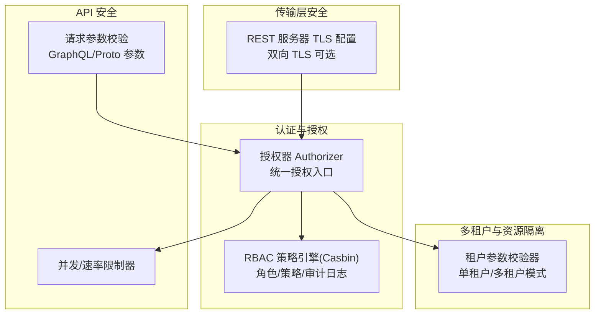
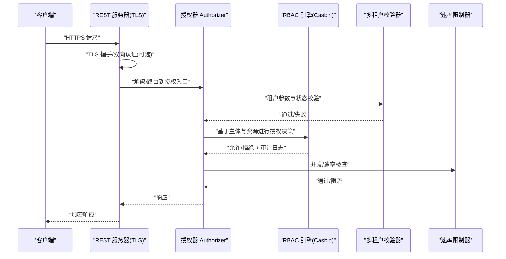
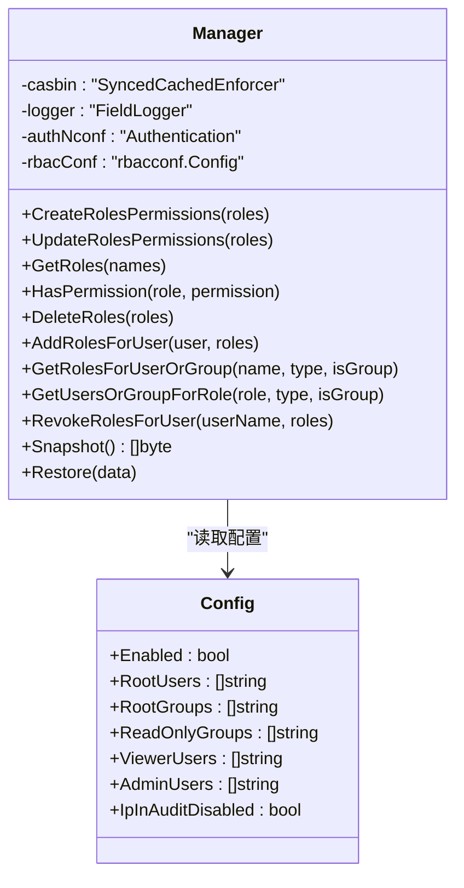
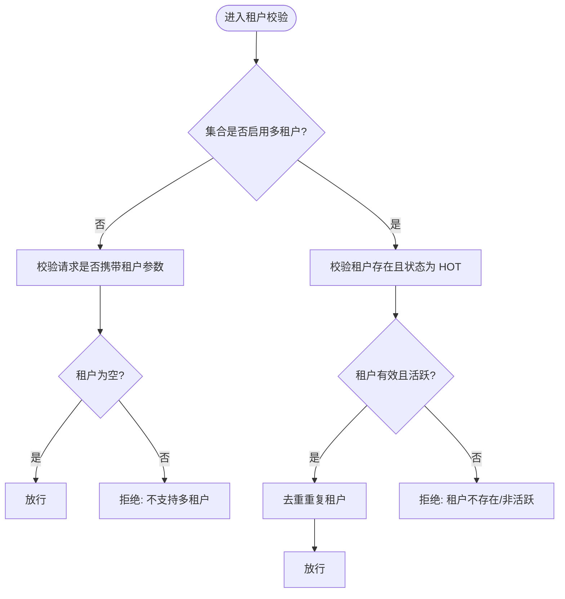
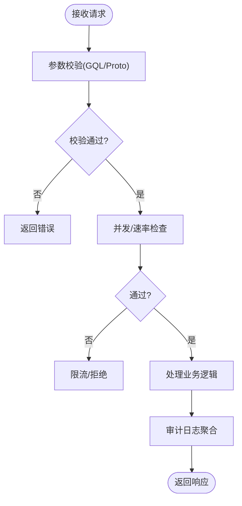
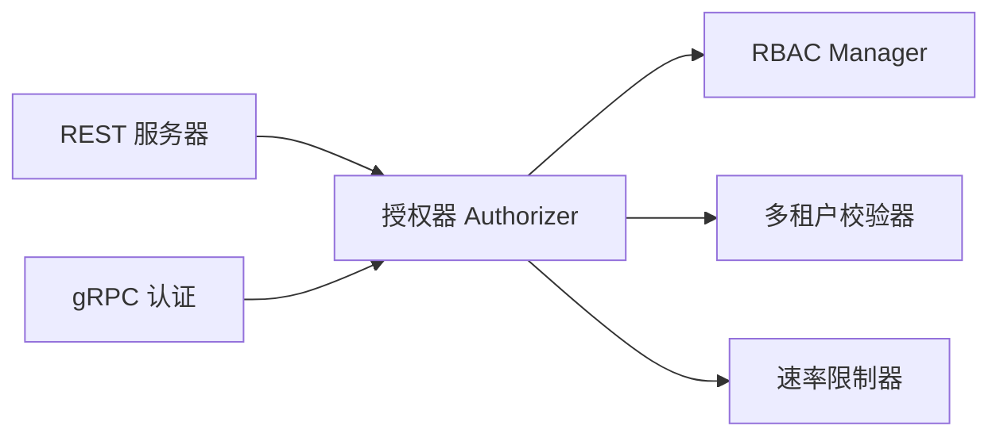

# 安全架构

<cite>
**本文引用的文件**
- [usecases/auth/authorization/rbac/manager.go](file://usecases/auth/authorization/rbac/manager.go)
- [usecases/auth/authorization/rbac/authorizer.go](file://usecases/auth/authorization/rbac/authorizer.go)
- [adapters/handlers/rest/server.go](file://adapters/handlers/rest/server.go)
- [usecases/auth/authorization/rbac/rbacconf/config.go](file://usecases/auth/authorization/rbac/rbacconf/config.go)
- [entities/models/permission.go](file://entities/models/permission.go)
- [adapters/handlers/rest/handlers_debug_test.go](file://adapters/handlers/rest/handlers_debug_test.go)
- [usecases/config/config_handler_test.go](file://usecases/config/config_handler_test.go)
- [adapters/handlers/rest/clusterapi/auth.go](file://adapters/handlers/rest/clusterapi/auth.go)
- [grpc/generated/protocol/v1/base_search.pb.go](file://grpc/generated/protocol/v1/base_search.pb.go)
- [usecases/ratelimiter/limiter.go](file://usecases/ratelimiter/limiter.go)
- [usecases/modulecomponents/arguments/nearThermal/param_test.go](file://usecases/modulecomponents/arguments/nearThermal/param_test.go)
- [usecases/modulecomponents/arguments/nearThermal/graphql_extract_test.go](file://usecases/modulecomponents/arguments/nearThermal/graphql_extract_test.go)
- [usecases/modulecomponents/arguments/nearThermal/graphql_argument.go](file://usecases/modulecomponents/arguments/nearThermal/graphql_argument.go)
- [usecases/modulecomponents/client_results.go](file://usecases/modulecomponents/client_results.go)
- [usecases/modulecomponents/clients/weaviateembed/weaviate_embed.go](file://usecases/modulecomponents/clients/weaviateembed/weaviate_embed.go)
- [adapters/handlers/grpc/v1/auth/auth.go](file://adapters/handlers/grpc/v1/auth/auth.go)
- [adapters/repos/db/multitenancy/validator.go](file://adapters/repos/db/multitenancy/validator.go)
- [cluster/schema/schema_thread_safety_test.go](file://cluster/schema/schema_thread_safety_test.go)
- [usecases/auth/authorization/rbac/authorizer_test.go](file://usecases/auth/authorization/rbac/authorizer_test.go)
</cite>

## 目录
1. [简介](#简介)
2. [项目结构](#项目结构)
3. [核心组件](#核心组件)
4. [架构总览](#架构总览)
5. [详细组件分析](#详细组件分析)
6. [依赖关系分析](#依赖关系分析)
7. [性能考量](#性能考量)
8. [故障排查指南](#故障排查指南)
9. [结论](#结论)
10. [附录](#附录)

## 简介
本文件系统化梳理 Weaviate 的安全架构，覆盖认证、授权与数据保护三大支柱，并深入解析多层安全防护（传输加密、访问控制、审计日志）、RBAC 授权模型（角色定义、权限分配、动态权限管理）、多租户隔离（数据隔离与资源限制）、API 安全（请求校验、速率限制与防攻击）以及安全配置最佳实践与威胁防护策略。文档以代码级证据为基础，辅以可视化图示帮助读者快速理解。

## 项目结构
Weaviate 的安全能力由“传输层安全”“认证与授权”“多租户与资源隔离”“API 请求与速率限制”等模块协同实现。关键位置如下：
- 传输层安全：REST 服务器 TLS 配置与双向 TLS 支持
- 认证与授权：基于 Casbin 的 RBAC 策略引擎与审计日志
- 多租户隔离：租户参数校验与状态检查
- API 安全：请求参数校验、速率限制与防攻击策略
- 配置与调试：敏感信息屏蔽与配置校验

图表来源
- [adapters/handlers/rest/server.go](file://adapters/handlers/rest/server.go#L253-L301)
- [usecases/auth/authorization/rbac/manager.go](file://usecases/auth/authorization/rbac/manager.go#L40-L55)
- [adapters/repos/db/multitenancy/validator.go](file://adapters/repos/db/multitenancy/validator.go#L39-L218)
- [usecases/ratelimiter/limiter.go](file://usecases/ratelimiter/limiter.go#L16-L60)
- [usecases/modulecomponents/arguments/nearThermal/param_test.go](file://usecases/modulecomponents/arguments/nearThermal/param_test.go#L16-L88)

章节来源
- [adapters/handlers/rest/server.go](file://adapters/handlers/rest/server.go#L253-L301)
- [usecases/auth/authorization/rbac/manager.go](file://usecases/auth/authorization/rbac/manager.go#L40-L55)
- [adapters/repos/db/multitenancy/validator.go](file://adapters/repos/db/multitenancy/validator.go#L39-L218)
- [usecases/ratelimiter/limiter.go](file://usecases/ratelimiter/limiter.go#L16-L60)
- [usecases/modulecomponents/arguments/nearThermal/param_test.go](file://usecases/modulecomponents/arguments/nearThermal/param_test.go#L16-L88)

## 核心组件
- 传输加密与证书管理：REST 服务器支持 TLS1.2+、现代密码套件与可选双向 TLS；支持加载服务端证书与客户端 CA 并强制双向认证。
- RBAC 授权引擎：基于 Casbin 的同步缓存增强型执行器，提供角色/策略 CRUD、快照/恢复、组权限继承与审计日志。
- 多租户隔离：对单租户/多租户两类集合进行严格参数校验与状态检查，拒绝非预期的租户参数或非活动租户操作。
- API 安全与速率限制：在 GraphQL/Proto 层进行输入参数校验；在服务层提供并发/速率限制器，结合模块侧令牌/请求数配额与窗口控制。
- 配置与调试：敏感配置字段在调试输出中被屏蔽；全局配置校验确保认证与授权组合的正确性。

章节来源
- [adapters/handlers/rest/server.go](file://adapters/handlers/rest/server.go#L253-L301)
- [usecases/auth/authorization/rbac/manager.go](file://usecases/auth/authorization/rbac/manager.go#L40-L55)
- [adapters/repos/db/multitenancy/validator.go](file://adapters/repos/db/multitenancy/validator.go#L39-L218)
- [usecases/ratelimiter/limiter.go](file://usecases/ratelimiter/limiter.go#L16-L60)
- [adapters/handlers/rest/handlers_debug_test.go](file://adapters/handlers/rest/handlers_debug_test.go#L28-L191)
- [usecases/config/config_handler_test.go](file://usecases/config/config_handler_test.go#L261-L294)

## 架构总览
下图展示从客户端到后端各层的安全控制点：TLS 终端、认证与授权、多租户校验、速率限制与审计日志。

图表来源
- [adapters/handlers/rest/server.go](file://adapters/handlers/rest/server.go#L253-L301)
- [usecases/auth/authorization/rbac/authorizer.go](file://usecases/auth/authorization/rbac/authorizer.go#L28-L51)
- [usecases/auth/authorization/rbac/manager.go](file://usecases/auth/authorization/rbac/manager.go#L444-L458)
- [adapters/repos/db/multitenancy/validator.go](file://adapters/repos/db/multitenancy/validator.go#L39-L218)
- [usecases/ratelimiter/limiter.go](file://usecases/ratelimiter/limiter.go#L16-L60)

## 详细组件分析

### 传输加密与证书管理
- TLS 配置要点
  - 最小版本：TLS1.2
  - 密码套件：优先使用 ECDHE + AES-GCM 或 ChaCha20-Poly1305
  - 协议选择：h2/http/1.1
  - 可选双向 TLS：通过 CA 证书启用客户端证书校验
- 证书加载：支持从文件加载服务端证书与私钥；若未提供则拒绝启动
- 适用范围：REST 服务器监听 HTTPS；gRPC 通道独立认证流程（见后续）

章节来源
- [adapters/handlers/rest/server.go](file://adapters/handlers/rest/server.go#L253-L301)

### RBAC 授权模型
- 设计与职责
  - 策略存储：基于 Casbin 同步缓存执行器，支持策略/分组策略的增删改查与快照/恢复
  - 授权决策：先按用户所属组逐个尝试，再回退到用户自身策略
  - 审计日志：统一记录授权动作、主体、资源、结果与版本字段
- 角色与权限
  - 角色定义：通过“角色名 + 策略集合”建模
  - 权限分配：支持为用户或组授予/撤销角色
  - 动态权限管理：支持批量更新、删除角色及策略，自动保存与缓存失效
- 配置项
  - 允许通过环境配置预设根用户/组、只读组、查看者与管理员等内置角色
  - 可配置是否在审计日志中记录源 IP

图表来源
- [usecases/auth/authorization/rbac/manager.go](file://usecases/auth/authorization/rbac/manager.go#L40-L55)
- [usecases/auth/authorization/rbac/rbacconf/config.go](file://usecases/auth/authorization/rbac/rbacconf/config.go#L14-L30)

章节来源
- [usecases/auth/authorization/rbac/manager.go](file://usecases/auth/authorization/rbac/manager.go#L57-L135)
- [usecases/auth/authorization/rbac/manager.go](file://usecases/auth/authorization/rbac/manager.go#L137-L251)
- [usecases/auth/authorization/rbac/manager.go](file://usecases/auth/authorization/rbac/manager.go#L253-L354)
- [usecases/auth/authorization/rbac/manager.go](file://usecases/auth/authorization/rbac/manager.go#L356-L438)
- [usecases/auth/authorization/rbac/authorizer.go](file://usecases/auth/authorization/rbac/authorizer.go#L28-L51)
- [usecases/auth/authorization/rbac/rbacconf/config.go](file://usecases/auth/authorization/rbac/rbacconf/config.go#L14-L30)

### 多租户隔离与资源限制
- 单租户模式
  - 拒绝任何带租户参数的请求，避免误用
- 多租户模式
  - 必须提供有效且处于热状态(HOT)的租户
  - 对重复租户去重处理，避免冗余开销
- 并发与一致性
  - 多租户场景下的集合元数据读写具备并发测试保障

图表来源
- [adapters/repos/db/multitenancy/validator.go](file://adapters/repos/db/multitenancy/validator.go#L39-L218)

章节来源
- [adapters/repos/db/multitenancy/validator.go](file://adapters/repos/db/multitenancy/validator.go#L39-L218)
- [cluster/schema/schema_thread_safety_test.go](file://cluster/schema/schema_thread_safety_test.go#L395-L456)

### API 安全：请求验证与速率限制
- 请求参数校验
  - GraphQL 输入对象对必填字段、互斥条件与目标向量数量进行校验
  - Proto 消息结构定义了 Thermal、Certainty、Distance、TargetVectors 等字段
- 速率限制
  - 通用并发/速率限制器：原子计数，上限不满足时拒绝
  - 模块侧令牌/请求配额：按窗口刷新，限制批内占比，避免突发
- 防攻击机制
  - 审计日志聚合：对大量重复资源进行聚合，降低日志风暴
  - 调试输出敏感信息屏蔽：避免泄露认证与授权配置

图表来源
- [usecases/modulecomponents/arguments/nearThermal/param_test.go](file://usecases/modulecomponents/arguments/nearThermal/param_test.go#L16-L88)
- [grpc/generated/protocol/v1/base_search.pb.go](file://grpc/generated/protocol/v1/base_search.pb.go#L1197-L1254)
- [usecases/ratelimiter/limiter.go](file://usecases/ratelimiter/limiter.go#L16-L60)
- [usecases/modulecomponents/client_results.go](file://usecases/modulecomponents/client_results.go#L52-L83)
- [adapters/handlers/rest/handlers_debug_test.go](file://adapters/handlers/rest/handlers_debug_test.go#L28-L191)

章节来源
- [usecases/modulecomponents/arguments/nearThermal/param_test.go](file://usecases/modulecomponents/arguments/nearThermal/param_test.go#L16-L88)
- [usecases/modulecomponents/arguments/nearThermal/graphql_extract_test.go](file://usecases/modulecomponents/arguments/nearThermal/graphql_extract_test.go#L74-L110)
- [usecases/modulecomponents/arguments/nearThermal/graphql_argument.go](file://usecases/modulecomponents/arguments/nearThermal/graphql_argument.go#L46-L65)
- [grpc/generated/protocol/v1/base_search.pb.go](file://grpc/generated/protocol/v1/base_search.pb.go#L1197-L1254)
- [usecases/ratelimiter/limiter.go](file://usecases/ratelimiter/limiter.go#L16-L60)
- [usecases/modulecomponents/client_results.go](file://usecases/modulecomponents/client_results.go#L52-L83)
- [adapters/handlers/rest/handlers_debug_test.go](file://adapters/handlers/rest/handlers_debug_test.go#L28-L191)

### 认证与授权集成点
- REST 与集群 API 的认证
  - REST 层支持多种认证方式（API Key、OIDC、数据库用户），具体实现位于对应处理器
  - 集群 API 认证同样遵循统一的认证体系
- 授权入口
  - 所有受控操作均需通过授权器进行统一判定，RBAC 引擎负责最终决策

章节来源
- [adapters/handlers/rest/clusterapi/auth.go](file://adapters/handlers/rest/clusterapi/auth.go)
- [adapters/handlers/grpc/v1/auth/auth.go](file://adapters/handlers/grpc/v1/auth/auth.go)

## 依赖关系分析
- 组件耦合
  - RBAC Manager 依赖 Casbin 执行器与配置；授权器 Authorizer 依赖 RBAC Manager 与日志
  - 多租户校验器与 Schema/存储层交互，确保集合与租户状态一致
  - 速率限制器与模块侧配额共同构成两级防护
- 外部依赖
  - TLS 依赖标准库 crypto/tls；RBAC 依赖 Casbin；日志依赖 logrus

图表来源
- [usecases/auth/authorization/rbac/authorizer.go](file://usecases/auth/authorization/rbac/authorizer.go#L28-L51)
- [usecases/auth/authorization/rbac/manager.go](file://usecases/auth/authorization/rbac/manager.go#L40-L55)
- [adapters/handlers/rest/server.go](file://adapters/handlers/rest/server.go#L253-L301)
- [adapters/handlers/grpc/v1/auth/auth.go](file://adapters/handlers/grpc/v1/auth/auth.go)

章节来源
- [usecases/auth/authorization/rbac/manager.go](file://usecases/auth/authorization/rbac/manager.go#L40-L55)
- [usecases/auth/authorization/rbac/authorizer.go](file://usecases/auth/authorization/rbac/authorizer.go#L28-L51)
- [adapters/handlers/rest/server.go](file://adapters/handlers/rest/server.go#L253-L301)

## 性能考量
- RBAC 决策路径
  - 组权限优先：命中即短路返回，减少多次匹配
  - 缓存与快照：策略变更后自动失效缓存，保证一致性与性能平衡
- 日志聚合
  - 对重复资源进行聚合，显著降低审计日志体量
- 速率限制
  - 原子计数器避免锁竞争；模块侧窗口刷新避免突发流量
- 多租户
  - 去重与状态检查在入口处完成，避免后续处理阶段的无效开销

章节来源
- [usecases/auth/authorization/rbac/manager.go](file://usecases/auth/authorization/rbac/manager.go#L444-L458)
- [usecases/auth/authorization/rbac/authorizer_test.go](file://usecases/auth/authorization/rbac/authorizer_test.go#L545-L601)
- [usecases/ratelimiter/limiter.go](file://usecases/ratelimiter/limiter.go#L16-L60)
- [adapters/repos/db/multitenancy/validator.go](file://adapters/repos/db/multitenancy/validator.go#L183-L198)

## 故障排查指南
- 传输层问题
  - TLS 启动失败：检查证书/密钥文件路径与格式；确认已启用双向 TLS 时提供了有效的 CA 证书
- 授权问题
  - 无权限：核对主体所属组与用户角色；检查策略资源域/集合/租户/对象是否匹配
  - 审计日志缺失：确认未开启“禁用审计中的源 IP”选项；检查日志级别
- 多租户问题
  - 单租户集合出现租户参数：属于预期拒绝行为
  - 多租户集合返回非活跃租户错误：检查租户状态是否为 HOT
- 配置问题
  - 认证与授权组合冲突：当启用匿名访问时不应同时启用 RBAC；反之亦然
  - 调试输出泄露：确认敏感字段已在调试输出中被屏蔽

章节来源
- [adapters/handlers/rest/server.go](file://adapters/handlers/rest/server.go#L276-L301)
- [usecases/auth/authorization/rbac/authorizer.go](file://usecases/auth/authorization/rbac/authorizer.go#L28-L51)
- [adapters/repos/db/multitenancy/validator.go](file://adapters/repos/db/multitenancy/validator.go#L39-L218)
- [usecases/config/config_handler_test.go](file://usecases/config/config_handler_test.go#L261-L294)
- [adapters/handlers/rest/handlers_debug_test.go](file://adapters/handlers/rest/handlers_debug_test.go#L28-L191)

## 结论
Weaviate 的安全架构以“传输加密 + RBAC 授权 + 多租户隔离 + API 安全与速率限制”为核心，通过统一授权入口与审计日志实现端到端的安全控制。Casbin 提供高扩展性的策略管理，TLS 与可选双向认证确保传输链路安全，模块级速率限制与参数校验有效缓解滥用与攻击风险。建议在生产环境中启用 TLS、合理配置 RBAC 与多租户策略，并结合审计日志与限流策略进行持续监控与优化。

## 附录
- 权限模型枚举与资源域
  - 权限动作涵盖备份、集群、数据、节点、角色、集合、租户、复制、别名、用户等领域的创建/读取/更新/删除与特定操作
  - 资源域细粒度到集合/租户/对象层级，便于最小权限原则落地

章节来源
- [entities/models/permission.go](file://entities/models/permission.go#L29-L68)
- [entities/models/permission.go](file://entities/models/permission.go#L136-L239)