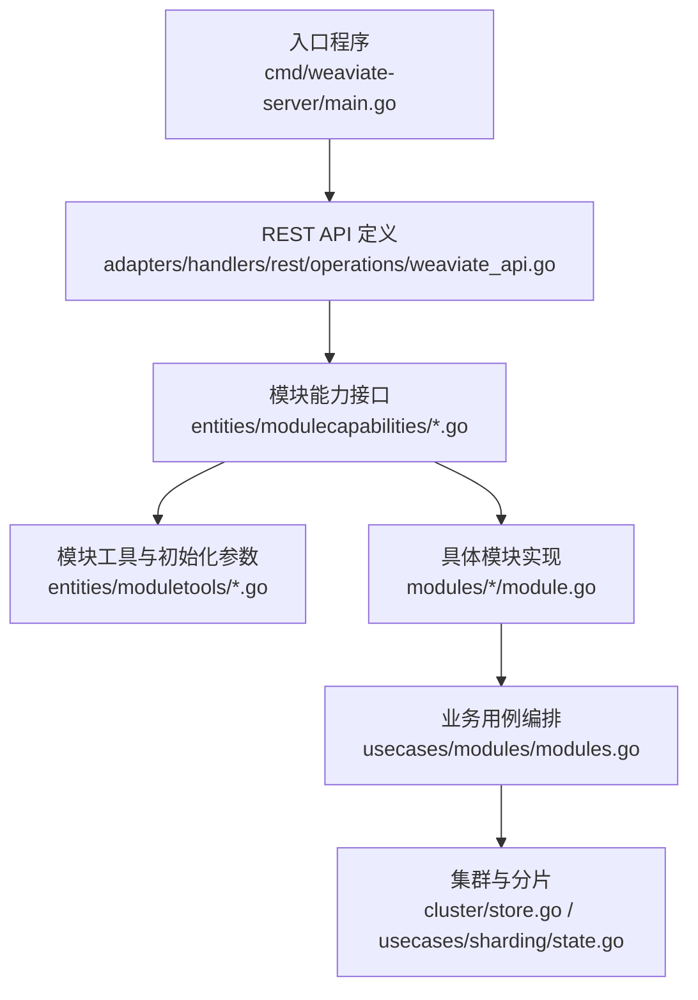
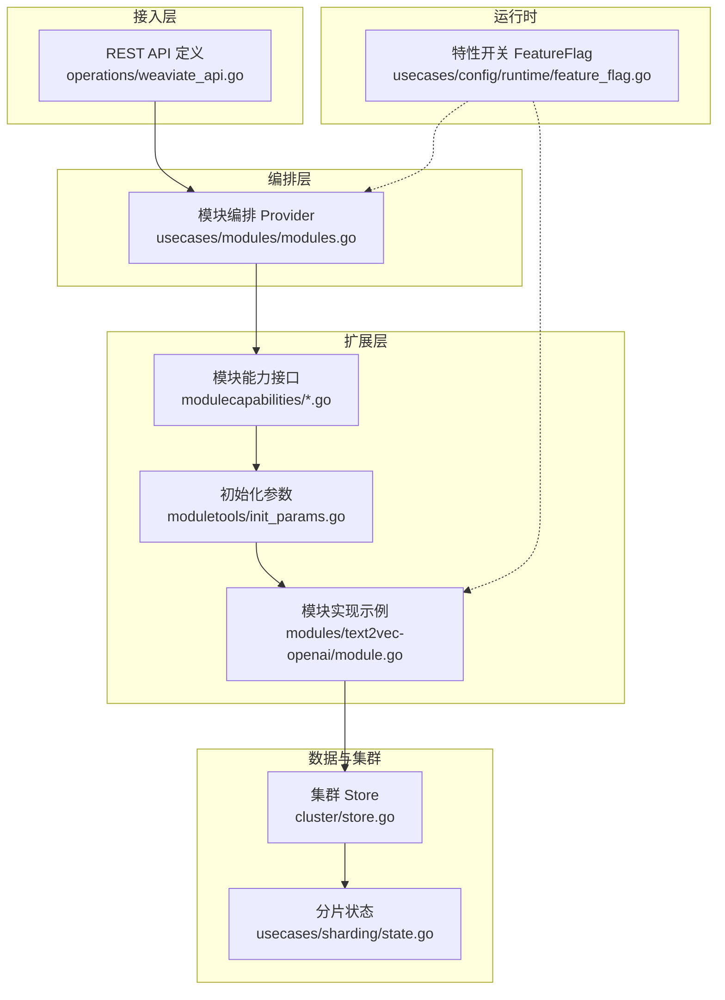
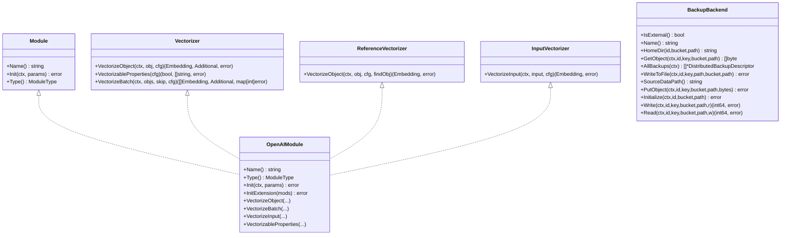
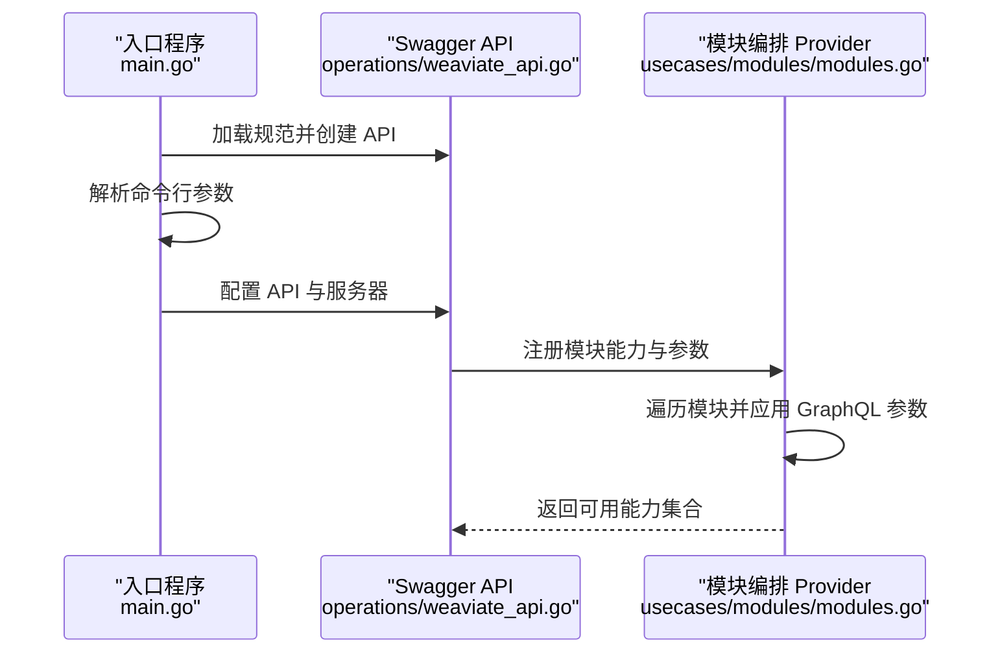
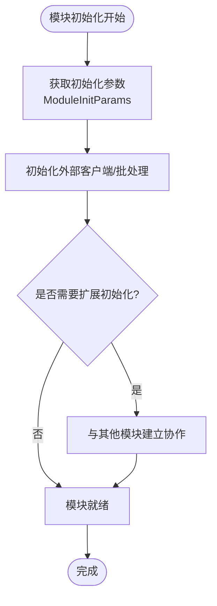
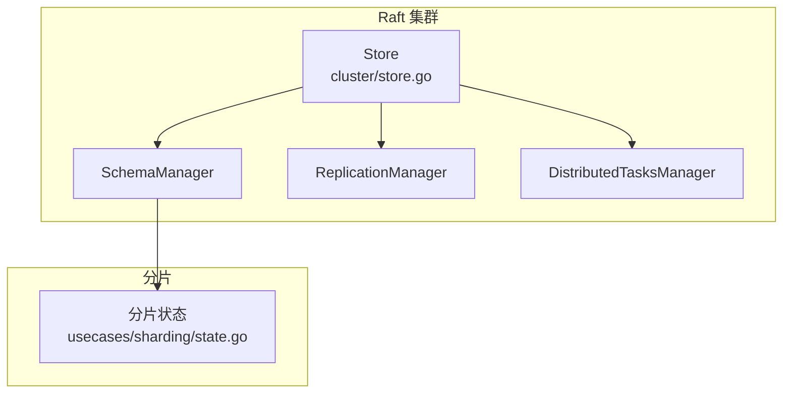
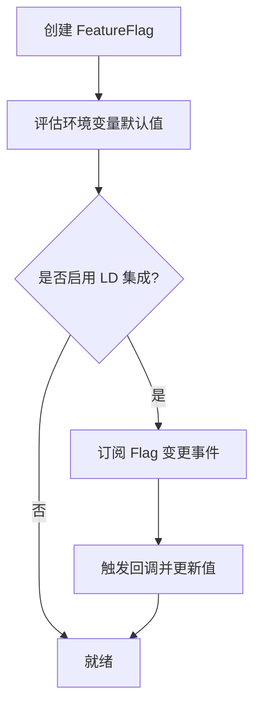
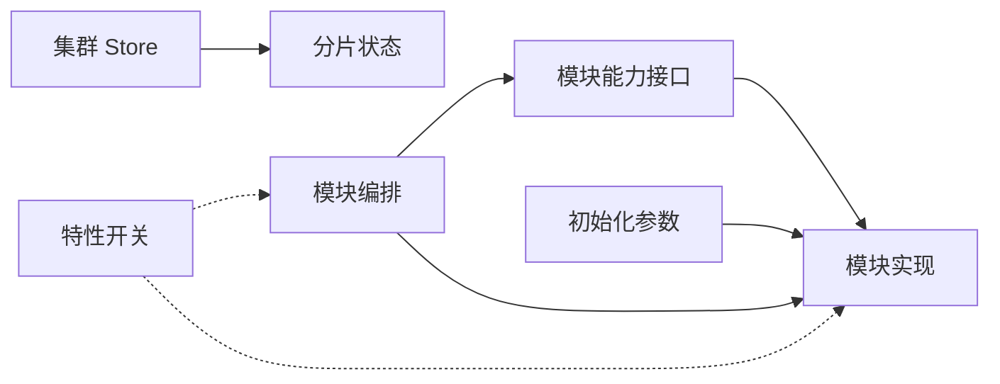

# 扩展性设计

<cite>
**本文引用的文件**
- [cmd/weaviate-server/main.go](file://cmd/weaviate-server/main.go)
- [entities/modulecapabilities/module.go](file://entities/modulecapabilities/module.go)
- [entities/modulecapabilities/vectorizer.go](file://entities/modulecapabilities/vectorizer.go)
- [entities/modulecapabilities/backup.go](file://entities/modulecapabilities/backup.go)
- [modules/text2vec-openai/module.go](file://modules/text2vec-openai/module.go)
- [entities/moduletools/init_params.go](file://entities/moduletools/init_params.go)
- [adapters/handlers/rest/operations/weaviate_api.go](file://adapters/handlers/rest/operations/weaviate_api.go)
- [cluster/store.go](file://cluster/store.go)
- [usecases/modules/modules.go](file://usecases/modules/modules.go)
- [usecases/config/runtime/feature_flag.go](file://usecases/config/runtime/feature_flag.go)
- [usecases/sharding/state.go](file://usecases/sharding/state.go)
</cite>

## 目录
1. [引言](#引言)
2. [项目结构](#项目结构)
3. [核心组件](#核心组件)
4. [架构总览](#架构总览)
5. [详细组件分析](#详细组件分析)
6. [依赖分析](#依赖分析)
7. [性能考量](#性能考量)
8. [故障排查指南](#故障排查指南)
9. [结论](#结论)
10. [附录：扩展点清单](#附录扩展点清单)

## 引言
本设计文档聚焦 Weaviate 的扩展性架构，系统阐述其插件化设计、接口抽象与扩展点定义，覆盖自定义向量化器、备份后端与业务逻辑扩展；同时分析水平扩展（分片、负载均衡、集群扩容）、垂直扩展（硬件资源与性能优化）以及配置驱动的运行时功能开关与参数调整机制，并给出扩展架构图与扩展点清单，帮助开发者在不修改核心代码的前提下实现定制化增强。

## 项目结构
Weaviate 采用分层清晰的模块化组织：入口程序负责启动与命令行解析；适配器层提供 REST/GraphQL/gRPC 等接入；实体层定义跨模块通用能力接口；usecases 层承载业务用例；modules 层提供各类扩展模块（如文本/图像向量化、生成式、备份等）。集群层通过 Raft 实现一致性与状态机复制，支撑水平扩展与高可用。

图表来源
- [cmd/weaviate-server/main.go](file://cmd/weaviate-server/main.go#L30-L66)
- [adapters/handlers/rest/operations/weaviate_api.go](file://adapters/handlers/rest/operations/weaviate_api.go#L52-L372)
- [entities/modulecapabilities/module.go](file://entities/modulecapabilities/module.go#L45-L89)
- [entities/moduletools/init_params.go](file://entities/moduletools/init_params.go#L21-L61)
- [modules/text2vec-openai/module.go](file://modules/text2vec-openai/module.go#L52-L102)
- [usecases/modules/modules.go](file://usecases/modules/modules.go#L432-L473)
- [cluster/store.go](file://cluster/store.go#L194-L339)
- [usecases/sharding/state.go](file://usecases/sharding/state.go#L601-L624)

章节来源
- [cmd/weaviate-server/main.go](file://cmd/weaviate-server/main.go#L30-L66)
- [adapters/handlers/rest/operations/weaviate_api.go](file://adapters/handlers/rest/operations/weaviate_api.go#L52-L372)

## 核心组件
- 模块接口与类型体系：统一的 Module 接口及多种能力接口（向量化、搜索、GraphQL 参数、备份后端等），支持模块发现、初始化与生命周期管理。
- 模块工具与初始化参数：通过 ModuleInitParams 提供存储、日志、配置与指标注册器，确保模块在统一上下文中运行。
- REST API 与模块编排：REST API 定义集中于 operations 包，模块能力通过 Provider 统一注入与编排，支持动态启用/禁用与参数传递。
- 集群与分片：基于 Raft 的集群状态机与分片状态管理，支撑水平扩展与一致性保障。
- 运行时特性开关：FeatureFlag 支持环境变量与外部平台（如 LaunchDarkly）驱动的运行时参数调整。

章节来源
- [entities/modulecapabilities/module.go](file://entities/modulecapabilities/module.go#L24-L89)
- [entities/moduletools/init_params.go](file://entities/moduletools/init_params.go#L21-L61)
- [adapters/handlers/rest/operations/weaviate_api.go](file://adapters/handlers/rest/operations/weaviate_api.go#L52-L372)
- [usecases/modules/modules.go](file://usecases/modules/modules.go#L432-L473)
- [cluster/store.go](file://cluster/store.go#L194-L339)
- [usecases/config/runtime/feature_flag.go](file://usecases/config/runtime/feature_flag.go#L33-L88)

## 架构总览
下图展示 Weaviate 扩展性架构的关键交互：入口程序加载 Swagger 规范并创建 API；REST 层将请求路由到业务用例；模块能力通过 Provider 注入；模块实现依赖统一的初始化参数与能力接口；集群层提供一致性与分片能力；运行时特性开关贯穿各层。

图表来源
- [adapters/handlers/rest/operations/weaviate_api.go](file://adapters/handlers/rest/operations/weaviate_api.go#L52-L372)
- [usecases/modules/modules.go](file://usecases/modules/modules.go#L432-L473)
- [entities/modulecapabilities/module.go](file://entities/modulecapabilities/module.go#L45-L89)
- [entities/moduletools/init_params.go](file://entities/moduletools/init_params.go#L21-L61)
- [modules/text2vec-openai/module.go](file://modules/text2vec-openai/module.go#L70-L102)
- [cluster/store.go](file://cluster/store.go#L194-L339)
- [usecases/sharding/state.go](file://usecases/sharding/state.go#L601-L624)
- [usecases/config/runtime/feature_flag.go](file://usecases/config/runtime/feature_flag.go#L54-L88)

## 详细组件分析

### 模块接口与扩展点
- 模块类型：涵盖向量化（Text2Vec、Multi2Vec、Img2Vec 等）、生成式、检索、备份、离线存储、使用量统计等。
- 能力接口：
  - Module：模块名称、初始化、类型声明。
  - 可选能力：关闭、HTTP 处理器根路径、扩展初始化、依赖初始化、使用量服务注入等。
  - 向量化接口：对象/输入向量化、批量向量化、属性可向量化范围。
  - 备份后端接口：外部存储判定、命名、路径、对象读写、初始化、列举等。
- 模块实现示例：以 OpenAI 文本向量化模块为例，展示如何实现模块名、类型、初始化、向量化能力与 GraphQL 参数注入。

图表来源
- [entities/modulecapabilities/module.go](file://entities/modulecapabilities/module.go#L45-L89)
- [entities/modulecapabilities/vectorizer.go](file://entities/modulecapabilities/vectorizer.go#L25-L53)
- [entities/modulecapabilities/backup.go](file://entities/modulecapabilities/backup.go#L21-L54)
- [modules/text2vec-openai/module.go](file://modules/text2vec-openai/module.go#L62-L102)

章节来源
- [entities/modulecapabilities/module.go](file://entities/modulecapabilities/module.go#L24-L89)
- [entities/modulecapabilities/vectorizer.go](file://entities/modulecapabilities/vectorizer.go#L25-L53)
- [entities/modulecapabilities/backup.go](file://entities/modulecapabilities/backup.go#L21-L54)
- [modules/text2vec-openai/module.go](file://modules/text2vec-openai/module.go#L62-L102)

### REST API 与模块编排流程
- 入口程序加载 Swagger 并创建 API 实例，随后注册命令行选项组，解析参数后启动服务器。
- REST API 定义集中于 operations 包，模块能力通过 Provider 注入，支持按类与模块类型动态添加 GraphQL 参数与能力。
- Provider 在遍历模块时，根据 AltNames 与模块名进行匹配，确保扩展模块可被正确识别与启用。

图表来源
- [cmd/weaviate-server/main.go](file://cmd/weaviate-server/main.go#L30-L66)
- [adapters/handlers/rest/operations/weaviate_api.go](file://adapters/handlers/rest/operations/weaviate_api.go#L52-L372)
- [usecases/modules/modules.go](file://usecases/modules/modules.go#L432-L473)

章节来源
- [cmd/weaviate-server/main.go](file://cmd/weaviate-server/main.go#L30-L66)
- [adapters/handlers/rest/operations/weaviate_api.go](file://adapters/handlers/rest/operations/weaviate_api.go#L52-L372)
- [usecases/modules/modules.go](file://usecases/modules/modules.go#L432-L473)

### 初始化参数与模块生命周期
- ModuleInitParams 提供存储提供者、应用状态、日志、配置与指标注册器，确保模块在统一上下文初始化。
- 模块实现通常在 Init 中完成客户端初始化、批处理设置、指标上报等；在 InitExtension 中与其他模块建立协作关系（如近似检索的文本变换器）。

图表来源
- [entities/moduletools/init_params.go](file://entities/moduletools/init_params.go#L21-L61)
- [modules/text2vec-openai/module.go](file://modules/text2vec-openai/module.go#L70-L102)

章节来源
- [entities/moduletools/init_params.go](file://entities/moduletools/init_params.go#L21-L61)
- [modules/text2vec-openai/module.go](file://modules/text2vec-openai/module.go#L70-L102)

### 集群与分片：水平扩展基础
- 集群 Store 基于 Raft 实现状态机复制，提供领导者选举、快照、日志缓存与传输配置，支撑多节点一致性与高可用。
- 分片状态管理负责虚拟分片到物理分片的映射与分配，支持扩容/缩容时的重新分配与权重计算。

图表来源
- [cluster/store.go](file://cluster/store.go#L194-L339)
- [usecases/sharding/state.go](file://usecases/sharding/state.go#L601-L624)

章节来源
- [cluster/store.go](file://cluster/store.go#L194-L339)
- [usecases/sharding/state.go](file://usecases/sharding/state.go#L601-L624)

### 运行时特性开关：配置驱动的扩展
- FeatureFlag 支持从环境变量与外部平台（如 LaunchDarkly）读取运行时值，提供回调通知变更，适用于动态开启/关闭功能或调整参数。
- 支持类型安全的布尔、字符串、整数、浮点数，具备回退与类型转换保护。

图表来源
- [usecases/config/runtime/feature_flag.go](file://usecases/config/runtime/feature_flag.go#L54-L88)
- [usecases/config/runtime/feature_flag.go](file://usecases/config/runtime/feature_flag.go#L90-L146)
- [usecases/config/runtime/feature_flag.go](file://usecases/config/runtime/feature_flag.go#L218-L260)

章节来源
- [usecases/config/runtime/feature_flag.go](file://usecases/config/runtime/feature_flag.go#L33-L88)
- [usecases/config/runtime/feature_flag.go](file://usecases/config/runtime/feature_flag.go#L218-L260)

## 依赖分析
- 模块与接口：模块实现依赖统一的能力接口与初始化参数，解耦具体实现与调用方。
- REST 编排：Provider 对模块进行统一编排，按类型与类维度注入 GraphQL 参数与能力。
- 集群与分片：Store 与分片状态相互配合，保证一致性与可扩展性。
- 运行时开关：FeatureFlag 作为横切关注点，贯穿模块与编排层。

图表来源
- [entities/modulecapabilities/module.go](file://entities/modulecapabilities/module.go#L45-L89)
- [entities/moduletools/init_params.go](file://entities/moduletools/init_params.go#L21-L61)
- [usecases/modules/modules.go](file://usecases/modules/modules.go#L432-L473)
- [cluster/store.go](file://cluster/store.go#L194-L339)
- [usecases/sharding/state.go](file://usecases/sharding/state.go#L601-L624)
- [usecases/config/runtime/feature_flag.go](file://usecases/config/runtime/feature_flag.go#L54-L88)

章节来源
- [entities/modulecapabilities/module.go](file://entities/modulecapabilities/module.go#L45-L89)
- [usecases/modules/modules.go](file://usecases/modules/modules.go#L432-L473)
- [cluster/store.go](file://cluster/store.go#L194-L339)

## 性能考量
- 水平扩展：通过分片与 Raft 集群提升吞吐与可用性；建议合理设置分片数量与副本策略，避免热点与跨节点高延迟。
- 垂直扩展：利用 FeatureFlag 动态调整批处理大小、超时与并发度；结合指标监控（Prometheus）观察外部调用延迟与错误率，及时调整模块批处理策略。
- 模块开销：向量化与生成式模块通常为外部调用，需关注网络抖动与速率限制；通过批处理与缓存降低调用次数。
- 集群稳定性：Raft 超时与快照阈值应结合网络状况调优，避免频繁选举导致的写放大。

## 故障排查指南
- 模块未生效：检查模块是否正确实现 Module/Vectorizer 等接口，确认 Provider 是否已注册该模块类型与参数。
- 初始化失败：核对 ModuleInitParams 提供的日志、配置与存储提供者是否可用；查看模块 Init/InitExtension 的错误返回。
- 备份后端异常：确认 BackupBackend 的 Initialize/Write/Read 行为与桶/路径配置；验证 IsExternal 与 HomeDir 返回值。
- 集群不一致：检查 Store 的 Ready/Leader 状态与分片映射；必要时重试或迁移旧 schema 快照。
- 特性开关无效：确认 FeatureFlag 的键名、环境变量与 LD 集成配置；检查回调是否阻塞后续更新。

章节来源
- [entities/modulecapabilities/module.go](file://entities/modulecapabilities/module.go#L45-L89)
- [entities/modulecapabilities/backup.go](file://entities/modulecapabilities/backup.go#L46-L54)
- [cluster/store.go](file://cluster/store.go#L572-L574)
- [usecases/config/runtime/feature_flag.go](file://usecases/config/runtime/feature_flag.go#L90-L146)

## 结论
Weaviate 的扩展性通过“接口抽象 + 模块实现 + 统一编排 + 集群分片 + 运行时特性开关”形成闭环：既保证了核心稳定，又允许灵活扩展。开发者可通过实现统一接口快速接入新能力，借助 Provider 与 REST 层无缝集成，结合集群与分片实现水平扩展，并通过 FeatureFlag 实现运行时可控的参数与功能切换。

## 附录：扩展点清单
- 自定义向量化器
  - 接口：Vectorizer、ReferenceVectorizer、InputVectorizer
  - 示例：modules/text2vec-openai/module.go
- 自定义备份后端
  - 接口：BackupBackend
  - 示例：modules/backup-*/module.go
- 业务逻辑扩展
  - 接口：Module、ModuleWithClose、ModuleWithHTTPHandlers、ModuleExtension、ModuleDependency、ModuleWithUsageService
  - 示例：modules/generative-*/module.go
- GraphQL 参数与额外属性
  - 接口：GraphQLArguments、AdditionalProperties、Searcher、MetaProvider
  - 编排：usecases/modules/modules.go
- 初始化与上下文
  - 接口：ModuleInitParams
  - 示例：entities/moduletools/init_params.go
- 集群与分片
  - 组件：cluster/store.go、usecases/sharding/state.go
- 运行时特性开关
  - 类型：FeatureFlag[T]
  - 示例：usecases/config/runtime/feature_flag.go

章节来源
- [entities/modulecapabilities/vectorizer.go](file://entities/modulecapabilities/vectorizer.go#L25-L53)
- [entities/modulecapabilities/backup.go](file://entities/modulecapabilities/backup.go#L21-L54)
- [entities/modulecapabilities/module.go](file://entities/modulecapabilities/module.go#L45-L89)
- [usecases/modules/modules.go](file://usecases/modules/modules.go#L432-L473)
- [entities/moduletools/init_params.go](file://entities/moduletools/init_params.go#L21-L61)
- [cluster/store.go](file://cluster/store.go#L194-L339)
- [usecases/sharding/state.go](file://usecases/sharding/state.go#L601-L624)
- [usecases/config/runtime/feature_flag.go](file://usecases/config/runtime/feature_flag.go#L33-L88)