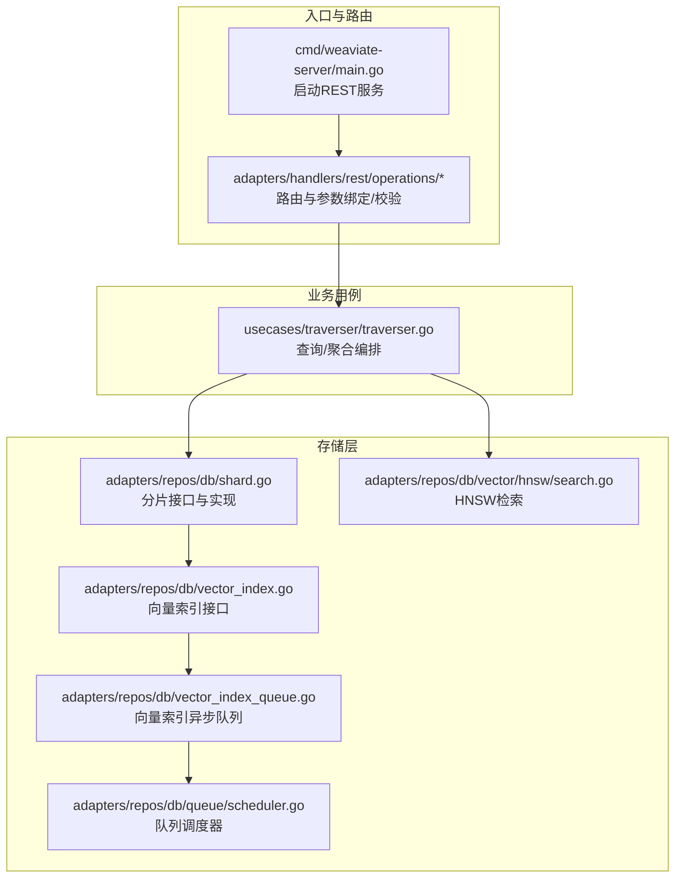
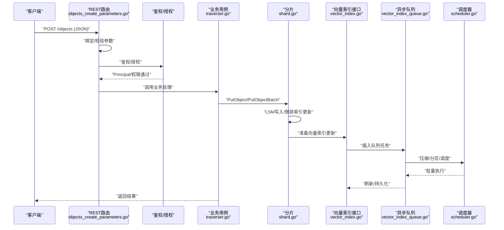
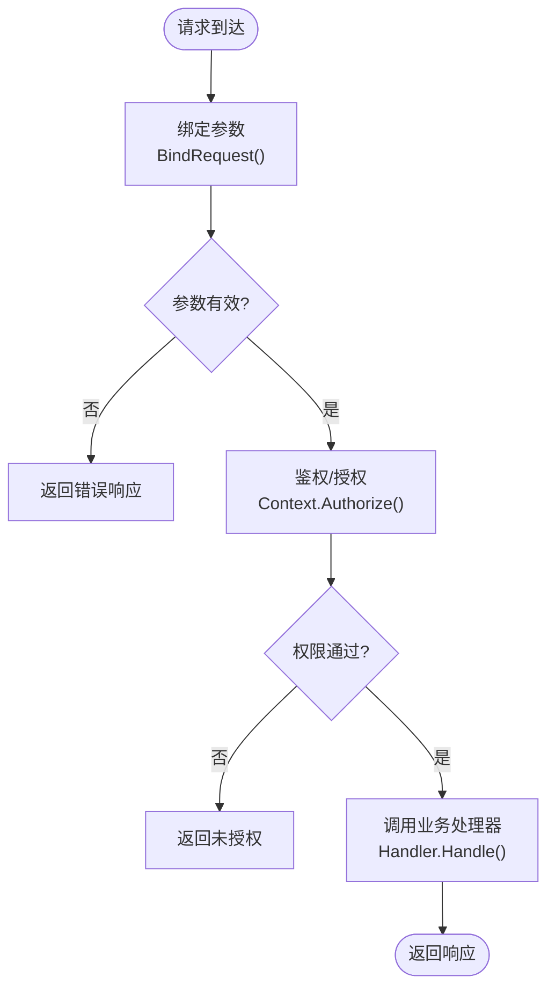
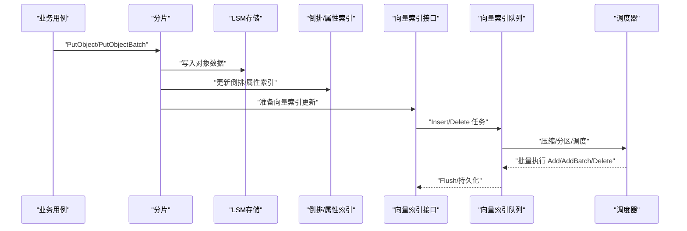
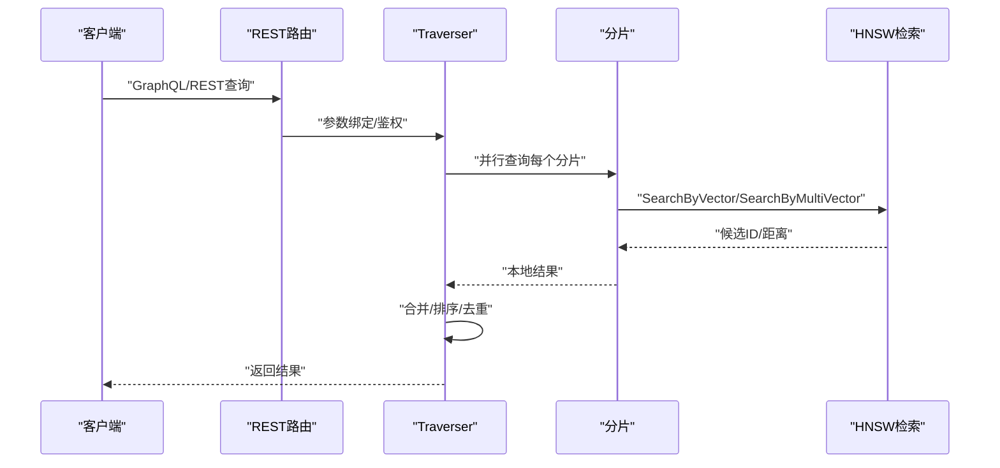
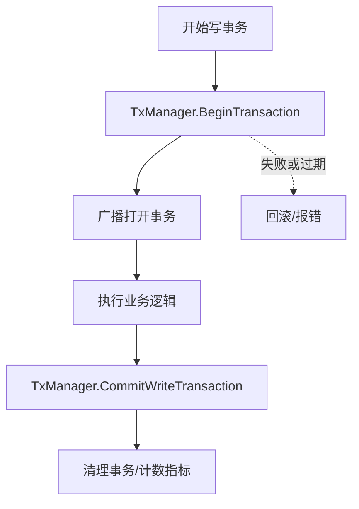
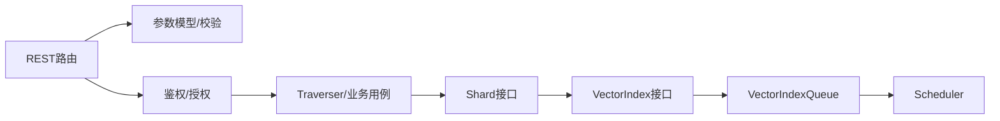

# 数据流设计

<cite>
**本文引用的文件**   
- [cmd/weaviate-server/main.go](file://cmd/weaviate-server/main.go)
- [adapters/handlers/rest/operations/weaviate_root.go](file://adapters/handlers/rest/operations/weaviate_root.go)
- [adapters/handlers/rest/operations/objects/objects_create_parameters.go](file://adapters/handlers/rest/operations/objects/objects_create_parameters.go)
- [adapters/handlers/rest/operations/objects/objects_get_parameters.go](file://adapters/handlers/rest/operations/objects/objects_get_parameters.go)
- [adapters/handlers/rest/operations/objects/objects_class_put.go](file://adapters/handlers/rest/operations/objects/objects_class_put.go)
- [adapters/repos/db/shard.go](file://adapters/repos/db/shard.go)
- [adapters/repos/db/vector_index.go](file://adapters/repos/db/vector_index.go)
- [adapters/repos/db/vector_index_queue.go](file://adapters/repos/db/vector_index_queue.go)
- [adapters/repos/db/shard_write_put.go](file://adapters/repos/db/shard_write_put.go)
- [adapters/repos/db/shard_async.go](file://adapters/repos/db/shard_async.go)
- [adapters/repos/db/queue/scheduler.go](file://adapters/repos/db/queue/scheduler.go)
- [adapters/repos/db/vector/hnsw/search.go](file://adapters/repos/db/vector/hnsw/search.go)
- [adapters/repos/db/vector/hnsw/flat_search.go](file://adapters/repos/db/vector/hnsw/flat_search.go)
- [adapters/repos/db/index.go](file://adapters/repos/db/index.go)
- [usecases/traverser/traverser.go](file://usecases/traverser/traverser.go)
- [usecases/cluster/transactions_write.go](file://usecases/cluster/transactions_write.go)
</cite>

## 目录
1. [简介](#简介)
2. [项目结构](#项目结构)
3. [核心组件](#核心组件)
4. [架构总览](#架构总览)
5. [详细组件分析](#详细组件分析)
6. [依赖分析](#依赖分析)
7. [性能考量](#性能考量)
8. [故障排查指南](#故障排查指南)
9. [结论](#结论)
10. [附录](#附录)

## 简介
本文件面向 Weaviate 的数据流设计，系统性描述从客户端请求到数据持久化的完整路径，覆盖请求解析与校验、权限检查、业务逻辑执行；数据写入路径（对象创建、向量计算、索引更新与持久化）；查询执行路径（解析、索引查找、结果合并与排序）；以及数据一致性保障（事务与并发控制）。同时提供数据流图与时序图，帮助读者快速把握关键操作的数据流转。

## 项目结构
Weaviate 服务通过命令入口启动，加载 Swagger 规范并初始化 REST 服务器，随后由各路由处理器承接请求，进入业务用例层，最终落到存储层（LSM-树、倒排索引、向量索引），并在必要时通过异步队列与调度器进行后台索引维护。

**图表来源**
- [cmd/weaviate-server/main.go](file://cmd/weaviate-server/main.go#L30-L66)
- [adapters/handlers/rest/operations/weaviate_root.go](file://adapters/handlers/rest/operations/weaviate_root.go#L62-L88)
- [usecases/traverser/traverser.go](file://usecases/traverser/traverser.go#L31-L76)
- [adapters/repos/db/shard.go](file://adapters/repos/db/shard.go#L68-L195)
- [adapters/repos/db/vector_index.go](file://adapters/repos/db/vector_index.go#L23-L66)
- [adapters/repos/db/vector_index_queue.go](file://adapters/repos/db/vector_index_queue.go#L38-L55)
- [adapters/repos/db/queue/scheduler.go](file://adapters/repos/db/queue/scheduler.go#L450-L495)
- [adapters/repos/db/vector/hnsw/search.go](file://adapters/repos/db/vector/hnsw/search.go#L78-L92)

**章节来源**
- [cmd/weaviate-server/main.go](file://cmd/weaviate-server/main.go#L30-L66)
- [adapters/handlers/rest/operations/weaviate_root.go](file://adapters/handlers/rest/operations/weaviate_root.go#L62-L88)

## 核心组件
- 入口与路由：REST 服务器加载 Swagger 并注册路由，完成参数绑定与基本校验，随后交由业务处理器。
- 业务用例：Traverser 负责查询/聚合编排，结合授权与限流等横切能力。
- 存储层：Shard 提供对象读写、倒排索引、向量索引、异步队列与调度器等能力；VectorIndex 定义向量索引统一接口；HNSW 实现高效近邻搜索。

**章节来源**
- [adapters/repos/db/shard.go](file://adapters/repos/db/shard.go#L68-L195)
- [adapters/repos/db/vector_index.go](file://adapters/repos/db/vector_index.go#L23-L66)
- [usecases/traverser/traverser.go](file://usecases/traverser/traverser.go#L31-L76)

## 架构总览
下图展示一次典型写入与一次典型查询在端到端的交互关系与数据流：

**图表来源**
- [adapters/handlers/rest/operations/objects/objects_create_parameters.go](file://adapters/handlers/rest/operations/objects/objects_create_parameters.go#L64-L107)
- [usecases/traverser/traverser.go](file://usecases/traverser/traverser.go#L44-L76)
- [adapters/repos/db/shard.go](file://adapters/repos/db/shard.go#L83-L96)
- [adapters/repos/db/vector_index.go](file://adapters/repos/db/vector_index.go#L25-L54)
- [adapters/repos/db/vector_index_queue.go](file://adapters/repos/db/vector_index_queue.go#L38-L55)
- [adapters/repos/db/queue/scheduler.go](file://adapters/repos/db/queue/scheduler.go#L450-L495)

## 详细组件分析

### 请求处理流程（解析、校验、鉴权、业务）
- 参数绑定与校验：路由处理器负责从 HTTP 请求中提取路径/查询/请求体参数，并调用模型的 Validate/ContextValidate 进行格式与语义校验。
- 鉴权与授权：路由在处理前调用上下文的 Authorize 获取 Principal，后续业务层可基于 Principal 决策访问控制。
- 业务处理：根据路由定义调用具体业务处理器（如对象创建/更新/查询），由用例层协调存储与模块能力。

**图表来源**
- [adapters/handlers/rest/operations/objects/objects_create_parameters.go](file://adapters/handlers/rest/operations/objects/objects_create_parameters.go#L64-L107)
- [adapters/handlers/rest/operations/objects/objects_get_parameters.go](file://adapters/handlers/rest/operations/objects/objects_get_parameters.go#L61-L81)
- [adapters/handlers/rest/operations/weaviate_root.go](file://adapters/handlers/rest/operations/weaviate_root.go#L62-L88)

**章节来源**
- [adapters/handlers/rest/operations/objects/objects_create_parameters.go](file://adapters/handlers/rest/operations/objects/objects_create_parameters.go#L64-L107)
- [adapters/handlers/rest/operations/objects/objects_get_parameters.go](file://adapters/handlers/rest/operations/objects/objects_get_parameters.go#L61-L81)
- [adapters/handlers/rest/operations/weaviate_root.go](file://adapters/handlers/rest/operations/weaviate_root.go#L62-L88)

### 数据写入流程（对象创建/更新 → 向量计算 → 索引更新 → 持久化）
- 对象写入：PutObject/PutObjectBatch 将对象写入 LSM 存储，并更新倒排索引与属性特定索引。
- 向量索引更新：当存在向量时，写入向量索引队列；若启用异步索引，则通过队列与调度器进行批处理与压缩。
- 刷新与持久化：队列 Flush 触发索引后端的持久化动作，确保数据落盘。

**图表来源**
- [adapters/repos/db/shard.go](file://adapters/repos/db/shard.go#L83-L96)
- [adapters/repos/db/shard_write_put.go](file://adapters/repos/db/shard_write_put.go#L746-L785)
- [adapters/repos/db/vector_index.go](file://adapters/repos/db/vector_index.go#L25-L54)
- [adapters/repos/db/vector_index_queue.go](file://adapters/repos/db/vector_index_queue.go#L38-L55)
- [adapters/repos/db/queue/scheduler.go](file://adapters/repos/db/queue/scheduler.go#L450-L495)

**章节来源**
- [adapters/repos/db/shard_write_put.go](file://adapters/repos/db/shard_write_put.go#L746-L785)
- [adapters/repos/db/vector_index_queue.go](file://adapters/repos/db/vector_index_queue.go#L38-L55)
- [adapters/repos/db/queue/scheduler.go](file://adapters/repos/db/queue/scheduler.go#L450-L495)

### 查询执行流程（解析 → 索引查找 → 结果合并 → 排序输出）
- 解析与编排：Traverser 负责解析查询参数、选择目标向量、执行向量搜索与跨类探索。
- 索引查找：HNSW 支持按向量检索，支持单/多向量场景；当允许列表较小时采用扁平搜索以提升命中率。
- 结果合并与排序：跨分片并行执行后，使用稳定排序策略对结果进行合并与排序。

**图表来源**
- [usecases/traverser/traverser.go](file://usecases/traverser/traverser.go#L44-L76)
- [adapters/repos/db/vector/hnsw/search.go](file://adapters/repos/db/vector/hnsw/search.go#L78-L92)
- [adapters/repos/db/index.go](file://adapters/repos/db/index.go#L1978-L2031)

**章节来源**
- [usecases/traverser/traverser.go](file://usecases/traverser/traverser.go#L44-L76)
- [adapters/repos/db/vector/hnsw/search.go](file://adapters/repos/db/vector/hnsw/search.go#L78-L92)
- [adapters/repos/db/vector/hnsw/flat_search.go](file://adapters/repos/db/vector/hnsw/flat_search.go#L28-L47)
- [adapters/repos/db/index.go](file://adapters/repos/db/index.go#L1978-L2031)

### 数据一致性与并发控制
- 事务管理：写事务通过 TxManager 管理开启、提交与过期控制，协调共识与本地状态变更。
- 并发与锁：分片内部使用原子变量与读写锁保护共享状态；文档 ID 锁池用于减少热点冲突。
- 异步复制与队列：异步队列与调度器在后台批量处理索引任务，避免阻塞主请求路径。

**图表来源**
- [usecases/cluster/transactions_write.go](file://usecases/cluster/transactions_write.go#L318-L409)
- [usecases/cluster/transactions_write.go](file://usecases/cluster/transactions_write.go#L411-L449)

**章节来源**
- [usecases/cluster/transactions_write.go](file://usecases/cluster/transactions_write.go#L318-L409)
- [usecases/cluster/transactions_write.go](file://usecases/cluster/transactions_write.go#L411-L449)
- [adapters/repos/db/shard.go](file://adapters/repos/db/shard.go#L61-L66)

### 批量操作的数据流优化
- 队列压缩与分区：调度器对连续相同操作进行压缩，合并为批量任务（如 Add→AddBatch），降低调用开销。
- 分片并行：查询与写入均支持跨分片并行执行，提高吞吐。
- 异步索引：向量索引更新通过队列与调度器异步化，配合批大小策略与磁盘队列，平衡延迟与吞吐。

**章节来源**
- [adapters/repos/db/queue/scheduler.go](file://adapters/repos/db/queue/scheduler.go#L450-L495)
- [adapters/repos/db/index.go](file://adapters/repos/db/index.go#L1978-L2031)
- [adapters/repos/db/vector_index_queue.go](file://adapters/repos/db/vector_index_queue.go#L38-L55)

## 依赖分析
- 路由层依赖模型校验与鉴权上下文，确保输入合法与权限正确。
- 业务用例依赖分片接口与向量索引接口，抽象了存储细节。
- 存储层内部通过队列与调度器解耦写入与索引维护，提升可扩展性。

**图表来源**
- [adapters/handlers/rest/operations/objects/objects_create_parameters.go](file://adapters/handlers/rest/operations/objects/objects_create_parameters.go#L64-L107)
- [usecases/traverser/traverser.go](file://usecases/traverser/traverser.go#L31-L76)
- [adapters/repos/db/shard.go](file://adapters/repos/db/shard.go#L68-L195)
- [adapters/repos/db/vector_index.go](file://adapters/repos/db/vector_index.go#L25-L54)
- [adapters/repos/db/vector_index_queue.go](file://adapters/repos/db/vector_index_queue.go#L38-L55)
- [adapters/repos/db/queue/scheduler.go](file://adapters/repos/db/queue/scheduler.go#L450-L495)

## 性能考量
- 向量检索：HNSW 在允许列表较小时采用扁平搜索，避免高复杂度遍历；自动 EF 计算保证召回与性能平衡。
- 写入路径：LSM 写放大与倒排索引更新需关注批量大小与刷盘频率；异步队列与调度器可显著降低尾延迟。
- 查询路径：跨分片并行与结果稳定排序有助于提升整体吞吐与可预测性。

## 故障排查指南
- 参数校验失败：检查请求体是否符合模型定义，确认必填字段与格式。
- 权限拒绝：确认鉴权头与角色权限配置，确保 Principal 具备相应操作权限。
- 向量索引异常：检查向量维度与索引配置，确认队列 Flush 是否成功触发。
- 查询无结果：确认索引是否存在、属性是否建立倒排/可搜索索引，以及过滤条件是否匹配。

**章节来源**
- [adapters/handlers/rest/operations/objects/objects_create_parameters.go](file://adapters/handlers/rest/operations/objects/objects_create_parameters.go#L81-L94)
- [adapters/handlers/rest/operations/objects/objects_get_parameters.go](file://adapters/handlers/rest/operations/objects/objects_get_parameters.go#L61-L81)
- [adapters/repos/db/vector/hnsw/search.go](file://adapters/repos/db/vector/hnsw/search.go#L78-L92)

## 结论
Weaviate 的数据流设计以“路由→业务用例→存储层”为主线，通过向量索引接口与异步队列实现高性能写入与查询；借助事务与并发控制保障一致性；并通过调度器与批量策略优化吞吐与延迟。该架构既满足高并发场景下的稳定性，又为扩展与演进提供了清晰的边界。

## 附录
- 关键流程参考路径
  - 写入：[PutObject/PutObjectBatch](file://adapters/repos/db/shard.go#L83-L96)，[向量索引更新](file://adapters/repos/db/shard_write_put.go#L746-L785)，[队列与调度](file://adapters/repos/db/vector_index_queue.go#L38-L55)，[调度器压缩/分区](file://adapters/repos/db/queue/scheduler.go#L450-L495)
  - 查询：[Traverser 接口](file://usecases/traverser/traverser.go#L44-L76)，[HNSW 检索](file://adapters/repos/db/vector/hnsw/search.go#L78-L92)，[扁平搜索](file://adapters/repos/db/vector/hnsw/flat_search.go#L28-L47)，[结果合并与排序](file://adapters/repos/db/index.go#L1978-L2031)
  - 事务：[Begin/Commit 写事务](file://usecases/cluster/transactions_write.go#L318-L409)，[提交流程](file://usecases/cluster/transactions_write.go#L411-L449)