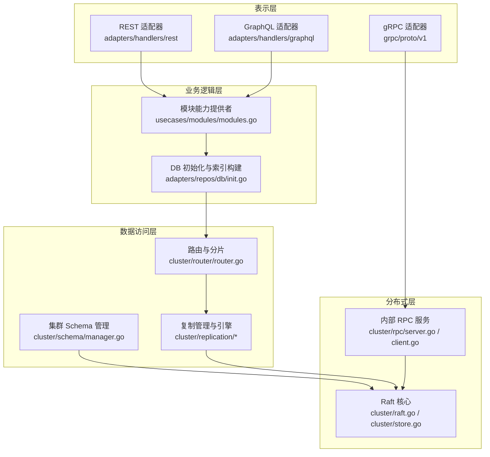
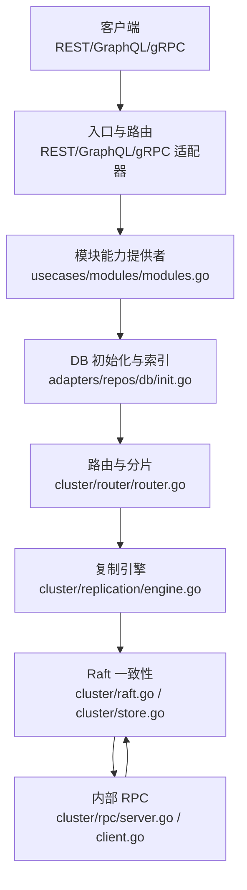
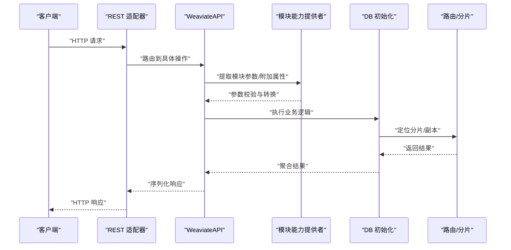
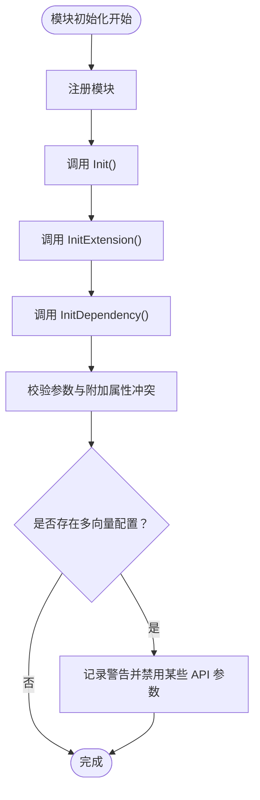
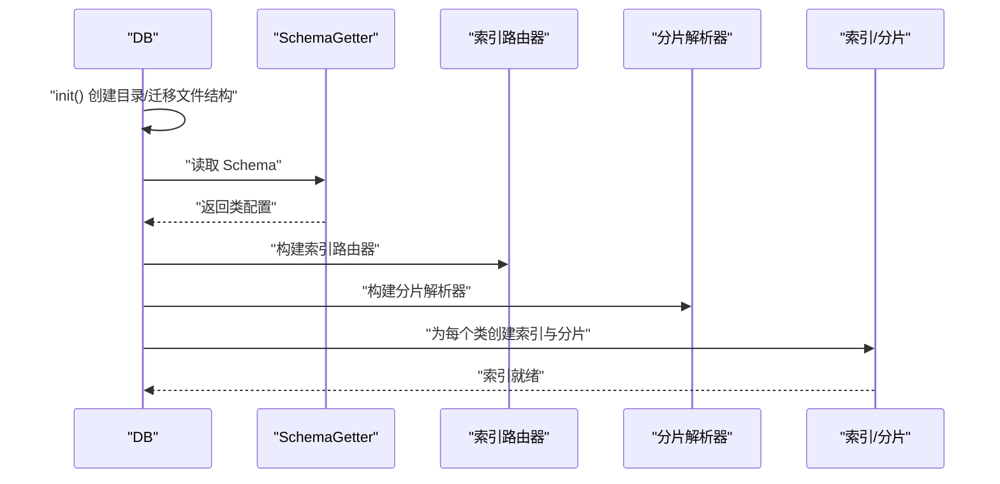
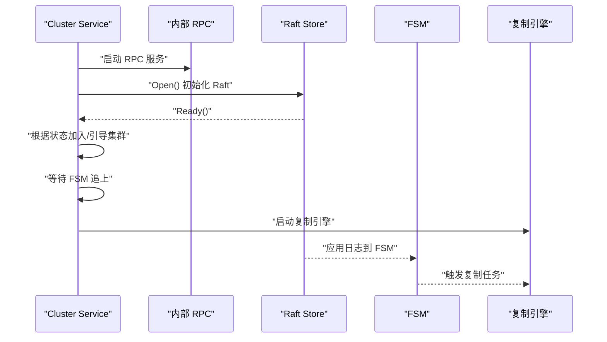
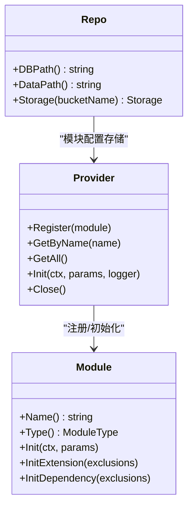
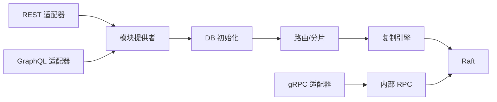

# 整体架构

<cite>
**本文引用的文件**
- [cmd/weaviate-server/main.go](file://cmd/weaviate-server/main.go)
- [adapters/handlers/rest/server.go](file://adapters/handlers/rest/server.go)
- [cluster/service.go](file://cluster/service.go)
- [adapters/repos/db/init.go](file://adapters/repos/db/init.go)
- [adapters/repos/modules/modules.go](file://adapters/repos/modules/modules.go)
- [usecases/modules/modules.go](file://usecases/modules/modules.go)
- [grpc/proto/v1/xxx.proto](file://grpc/proto/v1/xxx.proto)
- [adapters/handlers/graphql/buildGraphqlSchema.go](file://adapters/handlers/graphql/buildGraphqlSchema.go)
- [cluster/raft.go](file://cluster/raft.go)
- [cluster/store.go](file://cluster/store.go)
- [cluster/resolver/raft.go](file://cluster/resolver/raft.go)
- [cluster/rpc/server.go](file://cluster/rpc/server.go)
- [cluster/rpc/client.go](file://cluster/rpc/client.go)
- [cluster/replication/manager.go](file://cluster/replication/manager.go)
- [cluster/replication/engine.go](file://cluster/replication/engine.go)
- [cluster/router/router.go](file://cluster/router/router.go)
- [cluster/schema/manager.go](file://cluster/schema/manager.go)
- [modules/text2vec-openai/module.go](file://modules/text2vec-openai/module.go)
- [modules/generative-openai/module.go](file://modules/generative-openai/module.go)
- [modules/reranker-transformers/module.go](file://modules/reranker-transformers/module.go)
- [adapters/handlers/rest/operations/xxx.go](file://adapters/handlers/rest/operations/xxx.go)
</cite>

## 目录
1. [引言](#引言)
2. [项目结构](#项目结构)
3. [核心组件](#核心组件)
4. [架构总览](#架构总览)
5. [详细组件分析](#详细组件分析)
6. [依赖分析](#依赖分析)
7. [性能考虑](#性能考虑)
8. [故障排查指南](#故障排查指南)
9. [结论](#结论)
10. [附录](#附录)

## 引言
本文件面向 Weaviate 向量数据库的整体架构文档，聚焦分层架构与插件化设计，系统阐述表示层（REST、GraphQL、gRPC）、业务逻辑层、数据访问层的职责分离与交互关系；深入解析基于 Raft 的分布式事件驱动机制；总结系统边界与组件集成方式，并给出架构决策的技术考量、性能影响与可扩展性设计建议。文档同时提供架构图与组件关系图，帮助读者理解数据流与控制流。

## 项目结构
Weaviate 采用分层与模块化并行的组织方式：
- 表示层：REST、GraphQL、gRPC 三类入口，分别由独立适配器负责协议解析与路由
- 业务逻辑层：模块化能力提供者（modules provider），统一注册与初始化外部能力（向量化、生成式、重排序等）
- 数据访问层：DB 初始化与索引构建，结合分片与复制策略，支撑高可用与高性能
- 分布式层：Raft 一致性、gRPC 内部通信、复制引擎、路由与状态机

图表来源
- [adapters/handlers/rest/server.go](file://adapters/handlers/rest/server.go#L164-L337)
- [adapters/handlers/graphql/buildGraphqlSchema.go](file://adapters/handlers/graphql/buildGraphqlSchema.go)
- [grpc/proto/v1/xxx.proto](file://grpc/proto/v1/xxx.proto)
- [usecases/modules/modules.go](file://usecases/modules/modules.go#L138-L179)
- [adapters/repos/db/init.go](file://adapters/repos/db/init.go#L37-L191)
- [cluster/router/router.go](file://cluster/router/router.go)
- [cluster/replication/manager.go](file://cluster/replication/manager.go)
- [cluster/raft.go](file://cluster/raft.go)
- [cluster/store.go](file://cluster/store.go)
- [cluster/rpc/server.go](file://cluster/rpc/server.go)
- [cluster/rpc/client.go](file://cluster/rpc/client.go)
- [cluster/schema/manager.go](file://cluster/schema/manager.go)

章节来源
- [cmd/weaviate-server/main.go](file://cmd/weaviate-server/main.go#L30-L66)
- [adapters/handlers/rest/server.go](file://adapters/handlers/rest/server.go#L164-L337)

## 核心组件
- 服务入口与生命周期
  - 服务入口通过命令行启动 REST 服务器，加载 Swagger 规范并配置监听器（HTTP/HTTPS/Unix Socket）
  - 支持优雅关闭、信号处理与多监听器并发服务
- 模块化能力提供者
  - 统一注册模块（向量化、生成式、重排序、备份等），按类型校验与依赖初始化
  - 提供 GraphQL 参数、聚合参数、Explore 参数与附加属性的动态注入
- DB 初始化与索引构建
  - 读取现有 Schema，逐类构建索引与分片，支持异步索引检查点、文件系统迁移
- 分布式一致性与复制
  - 基于 Raft 的元数据一致性，内部 gRPC 通信，复制引擎在 FSM 追上后启动
  - 复制管理器协调跨节点复制与分片状态同步

章节来源
- [cmd/weaviate-server/main.go](file://cmd/weaviate-server/main.go#L30-L66)
- [adapters/handlers/rest/server.go](file://adapters/handlers/rest/server.go#L164-L337)
- [usecases/modules/modules.go](file://usecases/modules/modules.go#L138-L179)
- [adapters/repos/db/init.go](file://adapters/repos/db/init.go#L37-L191)
- [cluster/service.go](file://cluster/service.go#L149-L209)

## 架构总览
Weaviate 采用“三层+多模块”的架构：
- 表示层：REST、GraphQL、gRPC 三路入口，分别对应不同场景与客户端生态
- 业务逻辑层：模块能力提供者集中管理外部能力，屏蔽具体实现差异
- 数据访问层：DB 初始化、索引与分片、复制与路由，保证高可用与可扩展
- 分布式层：Raft 元数据一致、内部 RPC、复制引擎，形成事件驱动的分布式处理链

图表来源
- [adapters/handlers/rest/server.go](file://adapters/handlers/rest/server.go#L164-L337)
- [adapters/handlers/graphql/buildGraphqlSchema.go](file://adapters/handlers/graphql/buildGraphqlSchema.go)
- [grpc/proto/v1/xxx.proto](file://grpc/proto/v1/xxx.proto)
- [usecases/modules/modules.go](file://usecases/modules/modules.go#L138-L179)
- [adapters/repos/db/init.go](file://adapters/repos/db/init.go#L37-L191)
- [cluster/router/router.go](file://cluster/router/router.go)
- [cluster/replication/engine.go](file://cluster/replication/engine.go)
- [cluster/raft.go](file://cluster/raft.go)
- [cluster/store.go](file://cluster/store.go)
- [cluster/rpc/server.go](file://cluster/rpc/server.go)
- [cluster/rpc/client.go](file://cluster/rpc/client.go)

## 详细组件分析

### 表示层：REST、GraphQL、gRPC
- REST 适配器
  - 支持 HTTP/HTTPS/Unix Socket 多监听，超时、KeepAlive、连接数限制可配置
  - 通过 Swagger 规范生成 API 并注入处理器，支持优雅关闭与信号中断
- GraphQL 适配器
  - 动态构建 GraphQL Schema，按模块注入参数与附加字段，支持 Explore、Get、Aggregate
- gRPC 适配器
  - 通过 proto 定义服务契约，用于内部节点间通信（复制、路由、状态同步）

图表来源
- [adapters/handlers/rest/server.go](file://adapters/handlers/rest/server.go#L164-L337)
- [adapters/handlers/rest/operations/xxx.go](file://adapters/handlers/rest/operations/xxx.go)
- [usecases/modules/modules.go](file://usecases/modules/modules.go#L524-L559)
- [adapters/repos/db/init.go](file://adapters/repos/db/init.go#L37-L191)
- [cluster/router/router.go](file://cluster/router/router.go)

章节来源
- [adapters/handlers/rest/server.go](file://adapters/handlers/rest/server.go#L164-L337)
- [adapters/handlers/graphql/buildGraphqlSchema.go](file://adapters/handlers/graphql/buildGraphqlSchema.go)
- [grpc/proto/v1/xxx.proto](file://grpc/proto/v1/xxx.proto)

### 业务逻辑层：模块化能力提供者
- 注册与初始化
  - 统一注册模块，按顺序执行 Init、InitExtension、InitDependency，最后进行冲突与重复向量化校验
- GraphQL 参数与附加属性
  - 按类配置与模块类型动态注入参数与附加字段，避免与内部保留名冲突
- 附加属性扩展
  - 对 Get/List/Explore 等能力提供附加属性扩展，支持多向量与搜索向量注入

图表来源
- [usecases/modules/modules.go](file://usecases/modules/modules.go#L138-L179)
- [usecases/modules/modules.go](file://usecases/modules/modules.go#L181-L266)

章节来源
- [usecases/modules/modules.go](file://usecases/modules/modules.go#L138-L179)
- [usecases/modules/modules.go](file://usecases/modules/modules.go#L432-L519)
- [usecases/modules/modules.go](file://usecases/modules/modules.go#L691-L702)

### 数据访问层：DB 初始化与索引构建
- 初始化流程
  - 创建根目录与文件结构迁移，初始化索引检查点（异步索引启用时）
  - 读取 Schema，逐类构建索引与分片，设置复制与异步复制配置
- 路由与分片
  - 构建索引路由器与分片解析器，支持多租户与复制状态
- 指标与监控
  - 聚合节点级指标，便于运维观测

图表来源
- [adapters/repos/db/init.go](file://adapters/repos/db/init.go#L37-L191)

章节来源
- [adapters/repos/db/init.go](file://adapters/repos/db/init.go#L37-L191)

### 分布式层：Raft 一致性与事件驱动
- Raft 服务
  - 初始化 Raft Store、FSM、复制引擎与内部 RPC 服务，根据是否有历史状态决定加入或引导集群
  - FSM 追上后启动复制引擎，处理跨节点复制与分片同步
- 内部 RPC
  - 提供节点间通信，承载复制、路由与状态同步请求
- 事件驱动
  - 通过 Raft 日志应用到 FSM，触发复制引擎与路由更新，形成事件驱动的分布式处理链

图表来源
- [cluster/service.go](file://cluster/service.go#L149-L209)
- [cluster/raft.go](file://cluster/raft.go)
- [cluster/store.go](file://cluster/store.go)
- [cluster/rpc/server.go](file://cluster/rpc/server.go)
- [cluster/rpc/client.go](file://cluster/rpc/client.go)
- [cluster/replication/engine.go](file://cluster/replication/engine.go)

章节来源
- [cluster/service.go](file://cluster/service.go#L149-L209)

### 插件化架构与动态加载
- 模块注册与存储
  - 模块能力提供者统一注册模块，支持别名映射与类型识别
  - 模块配置与状态持久化至 BoltDB 存储桶，提供键值存取与扫描
- 能力注入
  - GraphQL 参数、附加属性、搜索参数提取均按模块能力动态注入，避免硬编码耦合
- 可扩展性
  - 新增模块仅需实现相应接口并通过提供者注册，即可参与 GraphQL/REST/gRPC 流程

图表来源
- [usecases/modules/modules.go](file://usecases/modules/modules.go#L46-L132)
- [adapters/repos/modules/modules.go](file://adapters/repos/modules/modules.go#L24-L140)

章节来源
- [usecases/modules/modules.go](file://usecases/modules/modules.go#L46-L132)
- [adapters/repos/modules/modules.go](file://adapters/repos/modules/modules.go#L24-L140)

## 依赖分析
- 组件耦合
  - 表示层与业务逻辑层通过模块提供者解耦，便于新增模块不影响入口
  - 数据访问层依赖路由与复制，复制依赖 Raft 与 RPC，形成清晰的单向依赖
- 外部依赖
  - gRPC/Proto 用于内部通信
  - Raft 用于一致性与状态机
  - BoltDB 用于模块配置持久化
- 循环依赖
  - 通过接口与分层避免循环依赖，模块提供者不直接依赖具体实现细节

图表来源
- [adapters/handlers/rest/server.go](file://adapters/handlers/rest/server.go#L164-L337)
- [adapters/handlers/graphql/buildGraphqlSchema.go](file://adapters/handlers/graphql/buildGraphqlSchema.go)
- [grpc/proto/v1/xxx.proto](file://grpc/proto/v1/xxx.proto)
- [usecases/modules/modules.go](file://usecases/modules/modules.go#L138-L179)
- [adapters/repos/db/init.go](file://adapters/repos/db/init.go#L37-L191)
- [cluster/router/router.go](file://cluster/router/router.go)
- [cluster/replication/engine.go](file://cluster/replication/engine.go)
- [cluster/raft.go](file://cluster/raft.go)
- [cluster/rpc/server.go](file://cluster/rpc/server.go)
- [cluster/rpc/client.go](file://cluster/rpc/client.go)

## 性能考虑
- 表示层
  - 多监听器并发服务，支持连接数限制与超时控制，避免资源耗尽
  - HTTPS/TLS 配置优化，启用现代密码套件与协议版本
- 业务逻辑层
  - 模块初始化顺序与依赖校验，避免运行期冲突与重复计算
  - 多向量配置下的 GraphQL/REST 参数限制，降低复杂度带来的开销
- 数据访问层
  - 异步索引检查点与文件系统层次化迁移，提升启动与写入性能
  - 分片与复制策略，结合路由与副本，提升查询吞吐与可用性
- 分布式层
  - Raft 日志应用与复制引擎异步化，降低主路径延迟
  - RPC 背压与超时控制，避免级联阻塞

## 故障排查指南
- 启动与监听
  - 若监听失败，检查端口占用与证书配置；确认 HTTPS/TLS 参数齐全
- 模块初始化
  - 若模块初始化失败，关注 Init/InitExtension/InitDependency 的错误堆栈
  - 多向量与保留参数冲突会触发告警，需调整配置
- 分布式一致性
  - Raft 无法启动或无法加入集群时，检查节点地址、投票配置与网络连通性
  - FSM 未追上导致复制引擎未启动，需等待状态同步或检查日志
- 复制与路由
  - 复制失败或分片状态异常，检查 RPC 服务与目标节点可达性

章节来源
- [adapters/handlers/rest/server.go](file://adapters/handlers/rest/server.go#L254-L316)
- [usecases/modules/modules.go](file://usecases/modules/modules.go#L172-L178)
- [cluster/service.go](file://cluster/service.go#L171-L209)

## 结论
Weaviate 通过分层架构与插件化设计实现了高内聚、低耦合的系统结构。表示层以 REST/GraphQL/gRPC 适配器提供统一接入，业务逻辑层由模块能力提供者集中管理外部能力，数据访问层结合分片与复制保障性能与可用性，分布式层以 Raft 与内部 RPC 形成事件驱动的一致性机制。该架构在可扩展性、可观测性与运维稳定性方面具备良好基础，适合在生产环境中持续演进。

## 附录
- 关键流程参考
  - REST 服务启动与多监听器并发服务：[adapters/handlers/rest/server.go](file://adapters/handlers/rest/server.go#L164-L337)
  - 模块初始化与依赖校验：[usecases/modules/modules.go](file://usecases/modules/modules.go#L138-L179)
  - DB 初始化与索引构建：[adapters/repos/db/init.go](file://adapters/repos/db/init.go#L37-L191)
  - Raft 服务打开与复制引擎启动：[cluster/service.go](file://cluster/service.go#L149-L209)
- 模块示例
  - 向量化模块：[modules/text2vec-openai/module.go](file://modules/text2vec-openai/module.go)
  - 生成式模块：[modules/generative-openai/module.go](file://modules/generative-openai/module.go)
  - 重排序模块：[modules/reranker-transformers/module.go](file://modules/reranker-transformers/module.go)