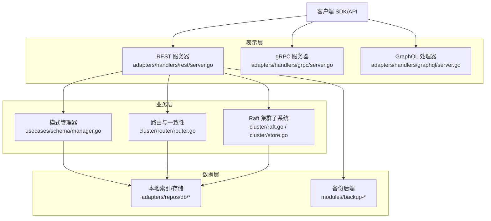
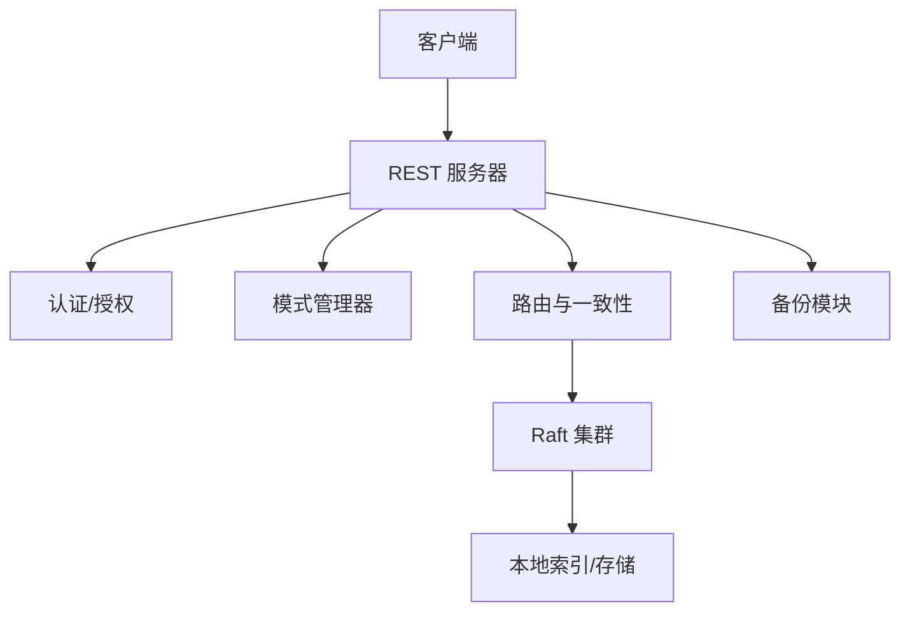
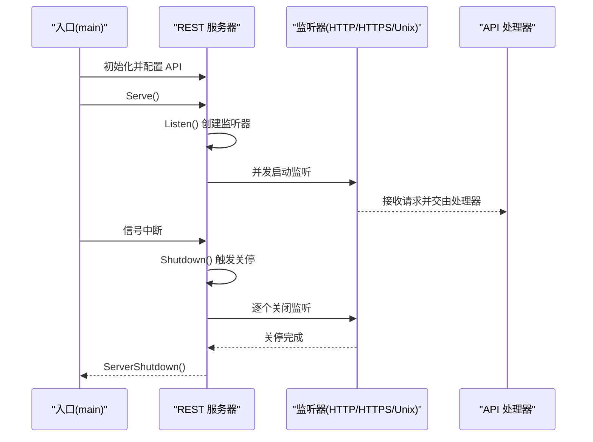
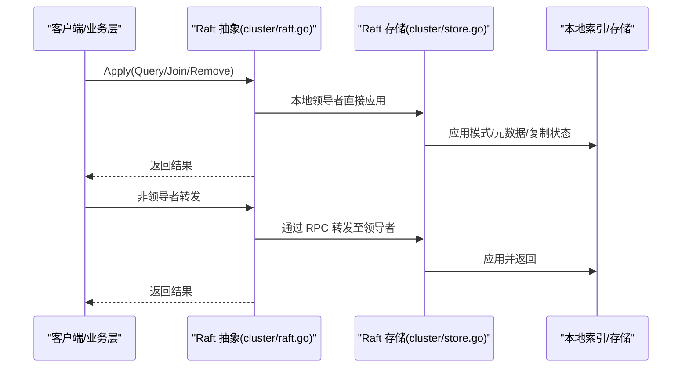
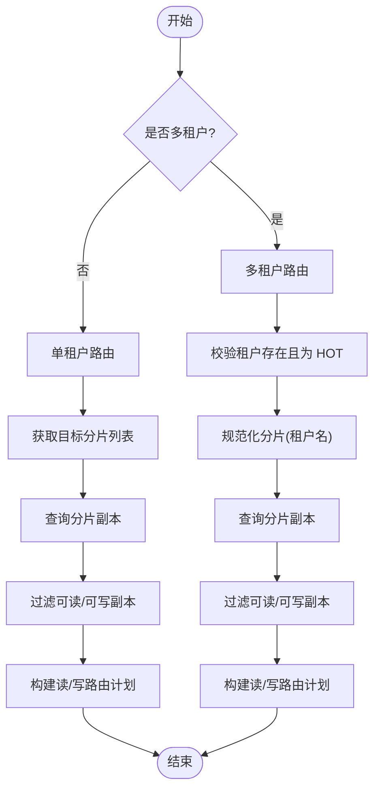
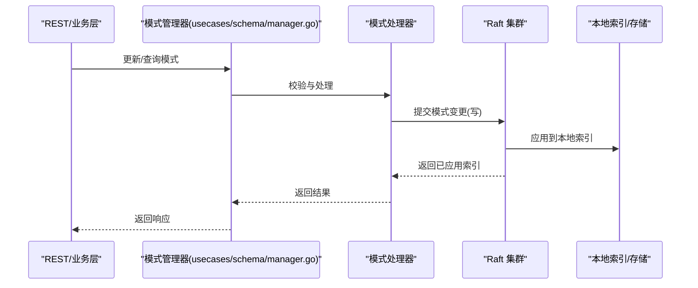
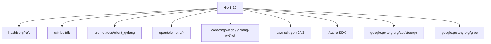

# 架构设计

<cite>
**本文引用的文件**
- [cmd/weaviate-server/main.go](file://cmd/weaviate-server/main.go)
- [adapters/handlers/rest/server.go](file://adapters/handlers/rest/server.go)
- [cluster/raft.go](file://cluster/raft.go)
- [cluster/store.go](file://cluster/store.go)
- [cluster/router/router.go](file://cluster/router/router.go)
- [usecases/schema/manager.go](file://usecases/schema/manager.go)
- [go.mod](file://go.mod)
- [README.md](file://README.md)
</cite>

## 目录
1. [引言](#引言)
2. [项目结构](#项目结构)
3. [核心组件](#核心组件)
4. [架构总览](#架构总览)
5. [详细组件分析](#详细组件分析)
6. [依赖分析](#依赖分析)
7. [性能考量](#性能考量)
8. [故障排查指南](#故障排查指南)
9. [结论](#结论)
10. [附录](#附录)

## 引言
本架构设计文档面向 Weaviate 向量数据库，聚焦高层架构、分层职责、插件化扩展、事件驱动与 Raft 分布式一致性、数据流路径、安全与监控、可扩展性与部署拓扑等主题。Weaviate 采用分层架构（表示层、业务层、数据层），通过 Raft 实现跨节点的一致性与事件处理，并以路由与复制状态机实现多租户与副本一致性保障。插件化模块体系（如向量化器、生成式模型、备份后端等）通过统一能力接口进行动态加载与扩展。

## 项目结构
Weaviate 采用模块化组织方式，核心目录与职责概览如下：
- cmd/weaviate-server：服务入口，初始化 Swagger/OpenAPI 规范并启动 REST 服务
- adapters/handlers：适配层，包含 REST、gRPC、GraphQL 等对外接口
- cluster：集群与 Raft 子系统，负责一致性、快照、日志、成员管理、复制状态机
- usecases：用例层，封装业务逻辑（如模式管理、对象操作、认证授权等）
- modules：插件模块集合，提供向量化、生成、重排序、离线/在线备份等能力
- entities：领域模型与配置定义
- openapi-specs：OpenAPI/Swagger 规范
- docs：指标与运维说明

图表来源
- [adapters/handlers/rest/server.go](file://adapters/handlers/rest/server.go#L164-L337)
- [usecases/schema/manager.go](file://usecases/schema/manager.go#L194-L231)
- [cluster/router/router.go](file://cluster/router/router.go#L35-L98)
- [cluster/raft.go](file://cluster/raft.go#L26-L99)
- [cluster/store.go](file://cluster/store.go#L191-L255)

章节来源
- [cmd/weaviate-server/main.go](file://cmd/weaviate-server/main.go#L30-L68)
- [README.md](file://README.md#L10-L128)

## 核心组件
- 服务入口与协议适配
  - 入口：cmd/weaviate-server/main.go 初始化 Swagger 规范并创建 REST 服务器
  - REST 服务器：adapters/handlers/rest/server.go 提供 HTTP/HTTPS/Unix Socket 监听、超时与 TLS 配置、优雅关停
- 集群与一致性
  - Raft 抽象：cluster/raft.go 提供对写/读操作的统一入口，确保在当前领导节点上执行；非领导者节点通过 RPC 转发
  - Raft 存储：cluster/store.go 构造 Raft 节点、日志/快照存储、传输层、领导者发现与迁移、关闭流程
- 路由与一致性
  - 路由器：cluster/router/router.go 根据单租户/多租户场景构建读写路由计划，结合复制状态机与节点选择器确定副本集合与一致性级别
- 模式管理
  - usecases/schema/manager.go 将模式变更抽象为用例层管理器，协调校验、处理器与存储（当前持久化由 Raft 保证）

章节来源
- [cmd/weaviate-server/main.go](file://cmd/weaviate-server/main.go#L30-L68)
- [adapters/handlers/rest/server.go](file://adapters/handlers/rest/server.go#L164-L337)
- [cluster/raft.go](file://cluster/raft.go#L26-L99)
- [cluster/store.go](file://cluster/store.go#L191-L255)
- [cluster/router/router.go](file://cluster/router/router.go#L35-L98)
- [usecases/schema/manager.go](file://usecases/schema/manager.go#L35-L51)

## 架构总览
Weaviate 采用分层架构与事件驱动的分布式一致性：
- 表示层：统一 REST/gRPC/GraphQL 接口，负责请求接入、参数解析与响应封装
- 业务层：模式管理、路由与一致性、认证授权、分布式任务与复制管理
- 数据层：本地索引/存储、备份后端、向量化与生成模块
- 集群层：Raft 日志/快照、成员管理、领导者选举与转移、复制状态机

图表来源
- [adapters/handlers/rest/server.go](file://adapters/handlers/rest/server.go#L164-L337)
- [usecases/schema/manager.go](file://usecases/schema/manager.go#L194-L231)
- [cluster/router/router.go](file://cluster/router/router.go#L35-L98)
- [cluster/raft.go](file://cluster/raft.go#L26-L99)
- [cluster/store.go](file://cluster/store.go#L360-L417)

## 详细组件分析

### 组件 A：REST 服务器与生命周期
- 职责
  - 监听 HTTP/HTTPS/Unix Socket，配置超时、监听限制、KeepAlive、TLS 证书与双向认证
  - 优雅关停：信号捕获、超时等待、逐监听器关停、回调钩子
- 关键流程
  - Listen：根据启用方案创建监听器
  - Serve：并发启动多个服务器实例，统一关停与回收
  - Shutdown：触发关停通道，按 GracefulTimeout 等待并调用 ServerShutdown

图表来源
- [adapters/handlers/rest/server.go](file://adapters/handlers/rest/server.go#L164-L337)
- [adapters/handlers/rest/server.go](file://adapters/handlers/rest/server.go#L418-L458)

章节来源
- [adapters/handlers/rest/server.go](file://adapters/handlers/rest/server.go#L164-L337)
- [adapters/handlers/rest/server.go](file://adapters/handlers/rest/server.go#L418-L458)

### 组件 B：Raft 集群与事件处理
- 职责
  - 对外提供 Apply/Query/Join/Remove 等统一接口，内部确保在当前领导者节点执行
  - 本地领导者直接应用，非领导者通过 RPC 转发
- 关键流程
  - Open：初始化日志/快照/传输层，构造 Raft 节点，必要时执行旧模式迁移
  - WaitUntilDBRestored：等待数据库加载完成
  - WaitForUpdate：等待指定版本在节点上应用
  - Close：领导者转移、成员离开、传输关闭、Raft 关闭、日志存储关闭、数据库关闭

图表来源
- [cluster/raft.go](file://cluster/raft.go#L26-L99)
- [cluster/store.go](file://cluster/store.go#L360-L417)
- [cluster/store.go](file://cluster/store.go#L520-L568)

章节来源
- [cluster/raft.go](file://cluster/raft.go#L26-L99)
- [cluster/store.go](file://cluster/store.go#L360-L417)
- [cluster/store.go](file://cluster/store.go#L520-L568)

### 组件 C：路由与一致性（单租户/多租户）
- 职责
  - 根据集合是否启用多租户，选择单租户或多租户路由器
  - 依据分片、副本与复制状态机，构建读写路由计划，支持一致性级别校验与首选节点排序
- 关键流程
  - 单租户：直接根据分片与副本映射获取读/写副本集
  - 多租户：校验租户存在且处于热状态（HOT），再获取副本集；若未显式分片则以租户名作为分片键
  - 一致性：对读/写副本集进行一致性级别验证与排序

图表来源
- [cluster/router/router.go](file://cluster/router/router.go#L78-L98)
- [cluster/router/router.go](file://cluster/router/router.go#L196-L210)
- [cluster/router/router.go](file://cluster/router/router.go#L437-L456)
- [cluster/router/router.go](file://cluster/router/router.go#L549-L577)

章节来源
- [cluster/router/router.go](file://cluster/router/router.go#L78-L98)
- [cluster/router/router.go](file://cluster/router/router.go#L196-L210)
- [cluster/router/router.go](file://cluster/router/router.go#L437-L456)
- [cluster/router/router.go](file://cluster/router/router.go#L549-L577)

### 组件 D：模式管理（用例层）
- 职责
  - 将模式变更抽象为用例层管理器，协调校验器、处理器与存储（当前持久化由 Raft 保证）
  - 提供多租户状态查询、乐观租户状态判定、租户激活等能力
- 关键流程
  - NewManager：组合校验器、处理器、只读/读写模式访问器、作者化器、集群状态等
  - 租户状态：乐观读取本地状态，必要时回退到领导者查询；隐式激活非 HOT 租户

图表来源
- [usecases/schema/manager.go](file://usecases/schema/manager.go#L194-L231)
- [cluster/raft.go](file://cluster/raft.go#L26-L99)
- [cluster/store.go](file://cluster/store.go#L360-L417)

章节来源
- [usecases/schema/manager.go](file://usecases/schema/manager.go#L194-L231)
- [usecases/schema/manager.go](file://usecases/schema/manager.go#L260-L358)

### 组件 E：插件架构与模块系统
- 设计理念
  - 通过统一能力接口（如向量化、生成、备份、离线/在线备份等）实现模块注册与动态加载
  - 模块提供者（Provider）负责默认配置、校验、能力声明与具体实现
- 关键点
  - 模块能力接口：向量化、生成、重排序、检索、附加能力等
  - 备份模块：S3/GCS/Azure/Filesystem 等后端插件
  - 生成式模块：OpenAI、Anthropic、AWS Bedrock、Ollama 等外部服务集成

章节来源
- [README.md](file://README.md#L110-L128)

## 依赖分析
- 技术栈与第三方依赖
  - Raft：hashicorp/raft 及 raft-boltdb 用于日志与快照存储
  - gRPC：用于内部 RPC 通信与客户端连接管理
  - Prometheus：指标采集与导出
  - OpenTelemetry：链路追踪与指标
  - 认证与授权：OIDC/JWT、RBAC/Casbin
  - 备份与对象存储：AWS S3、Azure Blob、Google Cloud Storage、MinIO
  - 向量化与生成：HuggingFace、OpenAI、Anthropic、Bedrock、Ollama 等
- 版本与兼容性
  - Go 版本：1.25
  - 依赖管理：go.mod 中列出各模块版本与间接依赖

图表来源
- [go.mod](file://go.mod#L3-L106)
- [go.mod](file://go.mod#L108-L274)

章节来源
- [go.mod](file://go.mod#L3-L106)
- [go.mod](file://go.mod#L108-L274)

## 性能考量
- Raft 性能
  - 日志缓存容量、快照阈值与间隔、尾随日志保留数影响快照频率与恢复时间
  - 超时乘数（心跳/选举/领导租约）用于网络抖动容忍，建议生产环境适当增大
- 路由与一致性
  - 读写副本集的选择与一致性级别直接影响延迟与可用性
  - 优先节点排序减少跨数据中心往返
- 监控与可观测性
  - Prometheus 指标：Raft 最后应用索引、FSM 应用耗时与失败计数
  - OpenTelemetry 链路追踪：请求端到端耗时与错误分布

章节来源
- [cluster/store.go](file://cluster/store.go#L50-L123)
- [cluster/store.go](file://cluster/store.go#L257-L307)
- [cluster/router/router.go](file://cluster/router/router.go#L348-L366)

## 故障排查指南
- 服务器关停
  - 若关停超时或部分监听器未关闭，检查 GracefulTimeout 设置与 ServerShutdown 回调
- Raft 启动与恢复
  - 检查工作目录权限、日志/快照存储初始化、传输层绑定地址与端口
  - 单节点恢复：启用单节点恢复逻辑或强制恢复，避免无法达成法定人数
- 路由与一致性
  - 读写路由计划为空：确认分片/副本映射、租户状态（多租户）、一致性级别是否合理
- 备份与恢复
  - 备份后端配置（S3/GCS/Azure/文件系统）需与实际环境一致，检查凭证与桶/容器权限

章节来源
- [adapters/handlers/rest/server.go](file://adapters/handlers/rest/server.go#L418-L458)
- [cluster/store.go](file://cluster/store.go#L360-L417)
- [cluster/store.go](file://cluster/store.go#L520-L568)
- [cluster/router/router.go](file://cluster/router/router.go#L348-L366)

## 结论
Weaviate 通过清晰的分层架构与 Raft 事件驱动一致性，实现了高可用、可扩展的向量数据库平台。插件化模块体系提供了强大的扩展能力，路由与复制状态机保障了多租户与副本一致性。结合完善的监控与可观测性，系统在生产环境中具备良好的稳定性与可维护性。

## 附录
- 基础设施需求
  - CPU/内存：根据数据规模与并发请求调整
  - 存储：本地磁盘用于日志/快照与索引，对象存储用于备份
  - 网络：Raft 与 gRPC 内部通信端口、REST/HTTPS 对外端口
- 部署拓扑
  - 单节点：适合开发与测试
  - 多节点 Raft 集群：建议奇数节点（3/5）以满足法定人数
  - 多数据中心：通过路由与一致性策略实现跨区容灾
- 安全与合规
  - TLS/双向认证、OIDC/JWT、RBAC/Casbin
  - 备份加密与访问控制
- 监控与告警
  - Prometheus 指标与 Grafana 可视化
  - OpenTelemetry 链路追踪与日志聚合