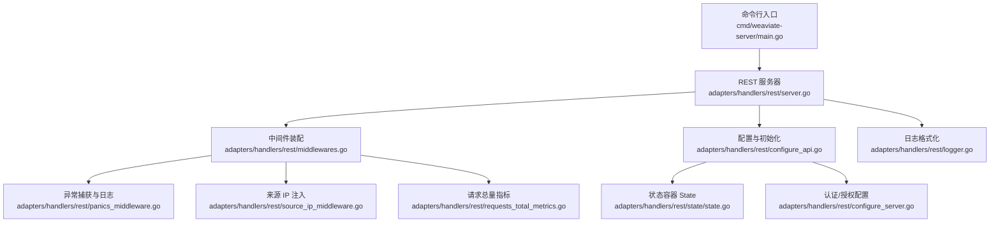
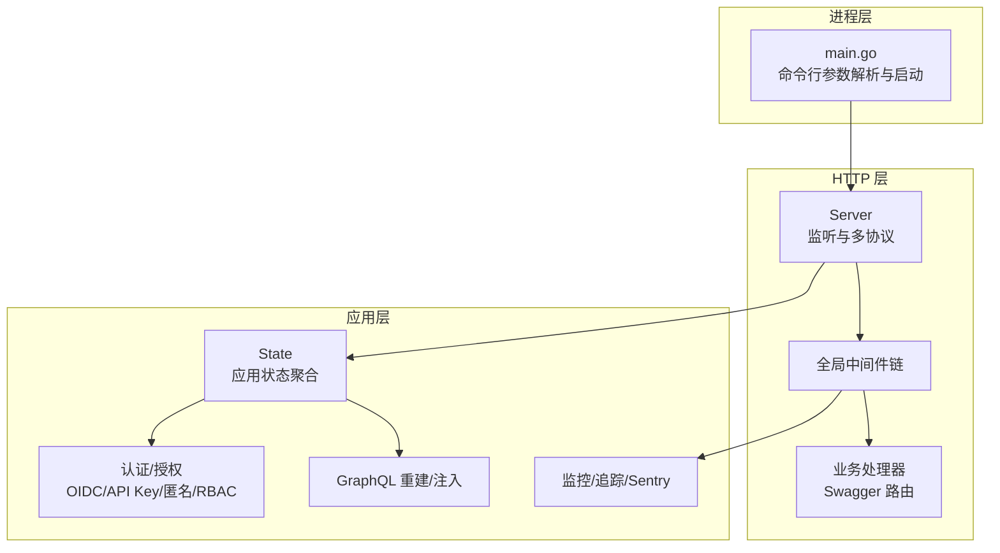
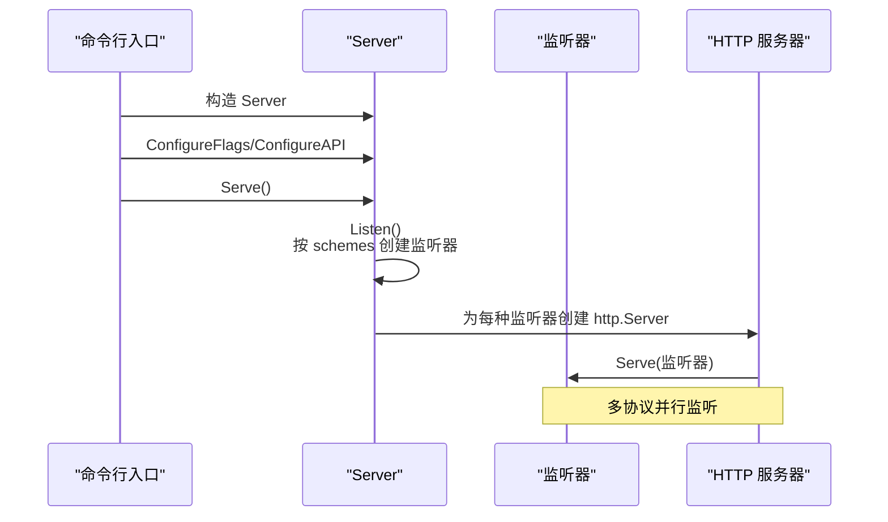
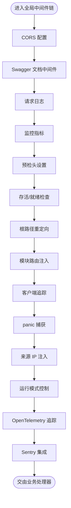
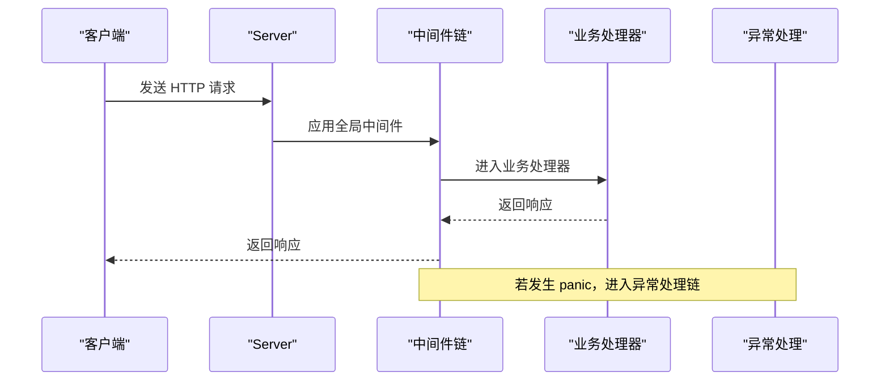
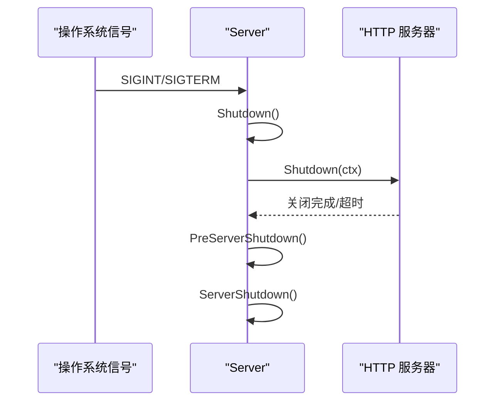
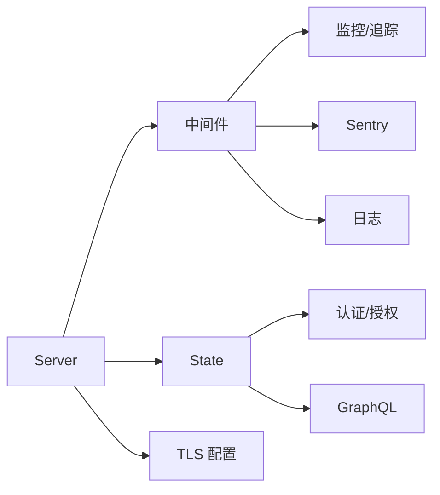

# REST 服务器

<cite>
**本文档引用的文件**
- [cmd/weaviate-server/main.go](file://cmd/weaviate-server/main.go)
- [adapters/handlers/rest/server.go](file://adapters/handlers/rest/server.go)
- [adapters/handlers/rest/configure_server.go](file://adapters/handlers/rest/configure_server.go)
- [adapters/handlers/rest/middlewares.go](file://adapters/handlers/rest/middlewares.go)
- [adapters/handlers/rest/state/state.go](file://adapters/handlers/rest/state/state.go)
- [adapters/handlers/rest/configure_api.go](file://adapters/handlers/rest/configure_api.go)
- [adapters/handlers/rest/logger.go](file://adapters/handlers/rest/logger.go)
- [adapters/handlers/rest/panics_middleware.go](file://adapters/handlers/rest/panics_middleware.go)
- [adapters/handlers/rest/source_ip_middleware.go](file://adapters/handlers/rest/source_ip_middleware.go)
- [adapters/handlers/rest/requests_total_metrics.go](file://adapters/handlers/rest/requests_total_metrics.go)
- [adapters/handlers/rest/handlers_debug.go](file://adapters/handlers/rest/handlers_debug.go)
</cite>

## 目录
1. [简介](#简介)
2. [项目结构](#项目结构)
3. [核心组件](#核心组件)
4. [架构总览](#架构总览)
5. [详细组件分析](#详细组件分析)
6. [依赖分析](#依赖分析)
7. [性能考虑](#性能考虑)
8. [故障排查指南](#故障排查指南)
9. [结论](#结论)
10. [附录](#附录)

## 简介
本文件面向 Weaviate REST 服务器，系统性梳理其启动流程、监听配置与多协议支持（HTTP、HTTPS、Unix Socket）、中间件体系（认证、授权、日志、限流、可观测性等）、请求处理链路、服务器配置项、优雅关闭与信号处理，并提供架构图与请求处理流程图，以及配置示例与性能调优建议。

## 项目结构
Weaviate 的 REST 服务器位于 adapters/handlers/rest 目录，入口程序位于 cmd/weaviate-server/main.go。核心职责包括：
- 服务器生命周期管理（启动、监听、优雅关闭）
- 多协议监听（HTTP/HTTPS/Unix Socket）
- 中间件装配（CORS、日志、监控、追踪、健康检查、模块路由等）
- 认证与授权（OIDC、API Key、匿名访问、RBAC/Admin List）
- 请求处理链路与错误恢复（panic 捕获、Sentry 集成）

图表来源
- [cmd/weaviate-server/main.go](file://cmd/weaviate-server/main.go#L30-L68)
- [adapters/handlers/rest/server.go](file://adapters/handlers/rest/server.go#L164-L337)
- [adapters/handlers/rest/middlewares.go](file://adapters/handlers/rest/middlewares.go#L93-L137)
- [adapters/handlers/rest/configure_api.go](file://adapters/handlers/rest/configure_api.go#L237-L308)
- [adapters/handlers/rest/state/state.go](file://adapters/handlers/rest/state/state.go#L53-L98)
- [adapters/handlers/rest/configure_server.go](file://adapters/handlers/rest/configure_server.go#L121-L149)
- [adapters/handlers/rest/logger.go](file://adapters/handlers/rest/logger.go#L22-L66)
- [adapters/handlers/rest/panics_middleware.go](file://adapters/handlers/rest/panics_middleware.go#L27-L86)
- [adapters/handlers/rest/source_ip_middleware.go](file://adapters/handlers/rest/source_ip_middleware.go#L21-L51)
- [adapters/handlers/rest/requests_total_metrics.go](file://adapters/handlers/rest/requests_total_metrics.go#L40-L119)

章节来源
- [cmd/weaviate-server/main.go](file://cmd/weaviate-server/main.go#L30-L68)
- [adapters/handlers/rest/server.go](file://adapters/handlers/rest/server.go#L164-L337)

## 核心组件
- 服务器核心（Server）
  - 监听与多协议支持：HTTP、HTTPS、Unix Socket
  - 超时与连接限制：读写超时、KeepAlive、ListenLimit、CleanupTimeout
  - TLS 配置：证书、CA、双向认证、密码套件与协议
  - 优雅关闭：信号处理、上下文超时、并发关闭
- 中间件体系
  - CORS、Swagger 文档、日志、监控、预检、存活/就绪、根路径重定向、模块路由
  - 客户端追踪、panic 捕获、来源 IP 注入、运行模式控制、Sentry 集成
- 认证与授权
  - OIDC、API Key、匿名访问
  - RBAC 或 Admin List 授权策略
- 状态容器（State）
  - 聚合应用级资源：配置、GraphQL、模块、Schema、Traverser、指标、集群、备份、对象管理等

章节来源
- [adapters/handlers/rest/server.go](file://adapters/handlers/rest/server.go#L80-L115)
- [adapters/handlers/rest/middlewares.go](file://adapters/handlers/rest/middlewares.go#L93-L137)
- [adapters/handlers/rest/configure_server.go](file://adapters/handlers/rest/configure_server.go#L121-L149)
- [adapters/handlers/rest/state/state.go](file://adapters/handlers/rest/state/state.go#L53-L98)

## 架构总览
下图展示从进程启动到服务监听、中间件装配与请求处理的整体架构。

图表来源
- [cmd/weaviate-server/main.go](file://cmd/weaviate-server/main.go#L30-L68)
- [adapters/handlers/rest/server.go](file://adapters/handlers/rest/server.go#L164-L337)
- [adapters/handlers/rest/middlewares.go](file://adapters/handlers/rest/middlewares.go#L93-L137)
- [adapters/handlers/rest/configure_api.go](file://adapters/handlers/rest/configure_api.go#L237-L308)
- [adapters/handlers/rest/state/state.go](file://adapters/handlers/rest/state/state.go#L53-L98)

## 详细组件分析

### 启动与监听流程
- 入口程序加载 Swagger 规范，创建 Weaviate API，构造 Server 并解析命令行参数，随后 ConfigureAPI 完成处理器与中间件装配，最后 Serve 启动监听。
- Listen 阶段根据启用的 schemes（http/https/unix）分别创建监听器；HTTPS 时可自动回填未指定的 TLS 参数（主机、端口、KeepAlive、读写超时、监听限制）。
- Serve 阶段为每种监听器启动独立 http.Server 实例，按需配置 MaxHeaderBytes、Read/WriteTimeout、KeepAlive、IdleTimeout、监听限制等；HTTPS 时构建 TLSConfig 并加载证书与 CA；最后通过信号处理触发优雅关闭。

图表来源
- [cmd/weaviate-server/main.go](file://cmd/weaviate-server/main.go#L30-L68)
- [adapters/handlers/rest/server.go](file://adapters/handlers/rest/server.go#L164-L337)
- [adapters/handlers/rest/server.go](file://adapters/handlers/rest/server.go#L339-L408)

章节来源
- [cmd/weaviate-server/main.go](file://cmd/weaviate-server/main.go#L30-L68)
- [adapters/handlers/rest/server.go](file://adapters/handlers/rest/server.go#L164-L337)
- [adapters/handlers/rest/server.go](file://adapters/handlers/rest/server.go#L339-L408)

### 多协议支持（HTTP/HTTPS/Unix Socket）
- HTTP：基于 TCP 监听，支持 ListenLimit、KeepAlive、Read/WriteTimeout、IdleTimeout。
- HTTPS：除上述参数外，支持 TLS 证书与 CA 加载、双向认证、密码套件与协议版本、ALPN 协议协商。
- Unix Socket：通过 domain socket 监听，适合本地高吞吐场景。

章节来源
- [adapters/handlers/rest/server.go](file://adapters/handlers/rest/server.go#L89-L106)
- [adapters/handlers/rest/server.go](file://adapters/handlers/rest/server.go#L209-L330)
- [adapters/handlers/rest/server.go](file://adapters/handlers/rest/server.go#L368-L374)

### 中间件体系
- 全局中间件顺序（示例）：CORS → Swagger 文档 → 日志 → 监控 → 预检 → 存活/就绪 → 根路径重定向 → 模块路由 → 客户端追踪 → panic 捕获 → 来源 IP 注入 → 运行模式控制 → OpenTelemetry 追踪 → Sentry。
- 认证/授权中间件：匿名访问、OIDC、API Key、RBAC/Admin List。
- 运行模式控制：根据 OperationalMode 对写/读进行白名单放行或拒绝。

图表来源
- [adapters/handlers/rest/middlewares.go](file://adapters/handlers/rest/middlewares.go#L93-L137)
- [adapters/handlers/rest/middlewares.go](file://adapters/handlers/rest/middlewares.go#L233-L285)
- [adapters/handlers/rest/configure_server.go](file://adapters/handlers/rest/configure_server.go#L121-L149)

章节来源
- [adapters/handlers/rest/middlewares.go](file://adapters/handlers/rest/middlewares.go#L93-L137)
- [adapters/handlers/rest/middlewares.go](file://adapters/handlers/rest/middlewares.go#L233-L285)
- [adapters/handlers/rest/configure_server.go](file://adapters/handlers/rest/configure_server.go#L121-L149)

### 认证与授权
- 认证：OIDC、API Key、匿名访问三类客户端统一接入，匿名访问中间件在全局链中优先执行。
- 授权：RBAC 或 Admin List；若配置为 RBAC 且控制器未初始化则报错；可通过 Authorizer 接口强制鉴权。

章节来源
- [adapters/handlers/rest/configure_server.go](file://adapters/handlers/rest/configure_server.go#L90-L119)
- [adapters/handlers/rest/configure_server.go](file://adapters/handlers/rest/configure_server.go#L121-L149)

### 请求处理链路
- 全局中间件 → 认证/授权 → 业务处理器（Swagger 路由）→ 响应返回。
- 异常处理：panic 捕获中间件负责区分 Broken Pipe、I/O Timeout 等并记录日志与指标，必要时上报 Sentry。

图表来源
- [adapters/handlers/rest/middlewares.go](file://adapters/handlers/rest/middlewares.go#L93-L137)
- [adapters/handlers/rest/panics_middleware.go](file://adapters/handlers/rest/panics_middleware.go#L27-L86)

章节来源
- [adapters/handlers/rest/middlewares.go](file://adapters/handlers/rest/middlewares.go#L93-L137)
- [adapters/handlers/rest/panics_middleware.go](file://adapters/handlers/rest/panics_middleware.go#L27-L86)

### 服务器配置选项
- 监听与协议
  - schemes：启用的监听方案（http/https/unix），默认 https
  - Host/Port/TLSHost/TLSPort：主机与端口
  - SocketPath：Unix Socket 路径
- 超时与连接
  - ReadTimeout/WriteTimeout/TLSReadTimeout/TLSWriteTimeout：请求读取与响应写入超时
  - KeepAlive/TLSKeepAlive：TCP KeepAlive
  - ListenLimit/TLSListenLimit：排队请求数限制
  - CleanupTimeout：空闲连接超时
  - MaxHeaderSize：请求头最大字节数
- TLS
  - TLSCertificate/TLSCertificateKey：服务端证书与私钥
  - TLSCACertificate：客户端 CA 证书，启用双向认证
  - 自定义 TLS 配置器：configureTLS
- 监控与可观测性
  - Monitoring.Enabled：开启 Prometheus 指标与 /metrics、/tenant-activity
  - Sentry.Enabled/DSN/环境/采样率/追踪开关
  - OpenTelemetry 追踪初始化
- 运行模式
  - OperationalMode：READ_ONLY、SCALE_OUT、WRITE_ONLY 及白名单控制

章节来源
- [adapters/handlers/rest/server.go](file://adapters/handlers/rest/server.go#L80-L115)
- [adapters/handlers/rest/server.go](file://adapters/handlers/rest/server.go#L253-L316)
- [adapters/handlers/rest/configure_api.go](file://adapters/handlers/rest/configure_api.go#L253-L308)

### 优雅关闭与信号处理
- 信号监听：SIGINT/SIGTERM
- 关闭流程：收到信号后触发 Shutdown，设置 GracefulTimeout 上下文，依次对各 http.Server 调用 Shutdown，等待成功或超时，最后执行 PreServerShutdown 与 ServerShutdown 钩子

图表来源
- [adapters/handlers/rest/server.go](file://adapters/handlers/rest/server.go#L418-L458)
- [adapters/handlers/rest/server.go](file://adapters/handlers/rest/server.go#L500-L514)

章节来源
- [adapters/handlers/rest/server.go](file://adapters/handlers/rest/server.go#L418-L458)
- [adapters/handlers/rest/server.go](file://adapters/handlers/rest/server.go#L500-L514)

### 日志与调试
- 日志格式：JSON/文本格式化器，附加构建信息字段
- 调试端点：/debug/config 输出非敏感配置快照，便于排障

章节来源
- [adapters/handlers/rest/logger.go](file://adapters/handlers/rest/logger.go#L22-L66)
- [adapters/handlers/rest/handlers_debug.go](file://adapters/handlers/rest/handlers_debug.go#L1061-L1096)

## 依赖分析
- Server 依赖中间件装配与状态容器，中间件依赖监控、追踪、Sentry、日志等基础设施
- 认证/授权通过配置函数注入，GraphQL 在 Schema 更新时动态重建
- TLS 配置与证书加载在 Serve 阶段完成，确保 HTTPS 监听前的完整性校验

图表来源
- [adapters/handlers/rest/server.go](file://adapters/handlers/rest/server.go#L164-L337)
- [adapters/handlers/rest/middlewares.go](file://adapters/handlers/rest/middlewares.go#L93-L137)
- [adapters/handlers/rest/configure_server.go](file://adapters/handlers/rest/configure_server.go#L121-L149)
- [adapters/handlers/rest/state/state.go](file://adapters/handlers/rest/state/state.go#L53-L98)

章节来源
- [adapters/handlers/rest/server.go](file://adapters/handlers/rest/server.go#L164-L337)
- [adapters/handlers/rest/middlewares.go](file://adapters/handlers/rest/middlewares.go#L93-L137)
- [adapters/handlers/rest/configure_server.go](file://adapters/handlers/rest/configure_server.go#L121-L149)
- [adapters/handlers/rest/state/state.go](file://adapters/handlers/rest/state/state.go#L53-L98)

## 性能考虑
- 监控与指标
  - 开启 Monitoring.Enabled 后，暴露 /metrics 与 /tenant-activity，结合 Prometheus 抓取
  - 批量写入路径有专门指标统计
- TLS 优化
  - 使用现代密码套件与协议版本，启用 ALPN h2 与 http/1.1
  - 合理设置 TLSReadTimeout/TLSWriteTimeout，避免长连接占用
- 连接与超时
  - ListenLimit 控制排队上限，防止突发流量击垮服务
  - KeepAlive 与 CleanupTimeout 降低僵尸连接占用
- 运行模式
  - 在 READ_ONLY/SCALE_OUT/WRITE_ONLY 模式下，白名单放行关键路径，避免不必要的处理
- 日志与追踪
  - Sentry 采样率与追踪开关按环境调整，避免高噪声影响性能

[本节为通用指导，无需特定文件引用]

## 故障排查指南
- panic 与错误分类
  - Broken Pipe：客户端提前断开，通常由超时或资源不足导致
  - I/O Timeout：服务端处理时间超过配置的超时
  - 其他错误：记录堆栈并上报 Sentry
- 常见问题定位
  - 使用 /debug/config 查看生效配置（过滤敏感字段）
  - 检查 /metrics 与 /tenant-activity，确认指标趋势
  - 核对 TLS 证书与 CA 配置，确保双向认证正确
  - 检查 OperationalMode 白名单，确认写/读被阻断的原因

章节来源
- [adapters/handlers/rest/panics_middleware.go](file://adapters/handlers/rest/panics_middleware.go#L88-L104)
- [adapters/handlers/rest/handlers_debug.go](file://adapters/handlers/rest/handlers_debug.go#L1061-L1096)

## 结论
Weaviate REST 服务器通过清晰的启动与监听流程、完善的多协议支持、可插拔的中间件体系、严格的认证授权与可观测性集成，提供了稳定、可观测、可扩展的 HTTP 入口。配合合理的超时与连接限制、TLS 与运行模式配置，可在生产环境中实现高可靠与高性能。

[本节为总结，无需特定文件引用]

## 附录

### 配置示例（命令行与环境变量）
- 启用多协议监听
  - --scheme=http --scheme=https --scheme=unix
- HTTP/HTTPS 参数
  - --host/--port、--tls-host/--tls-port
  - --read-timeout、--write-timeout、--keep-alive
  - --tls-read-timeout、--tls-write-timeout、--tls-keep-alive
  - --listen-limit、--tls-listen-limit
  - --max-header-size、--cleanup-timeout
- TLS
  - --tls-certificate、--tls-key、--tls-ca
- 监控与 Sentry
  - --monitoring.enabled=true、--monitoring.port=端口
  - --sentry.enabled=true、--sentry.dsn、--sentry.environment
- 运行模式
  - --operational-mode=read-only|scale-out|write-only

章节来源
- [adapters/handlers/rest/server.go](file://adapters/handlers/rest/server.go#L80-L115)
- [adapters/handlers/rest/server.go](file://adapters/handlers/rest/server.go#L253-L316)
- [adapters/handlers/rest/configure_api.go](file://adapters/handlers/rest/configure_api.go#L253-L308)