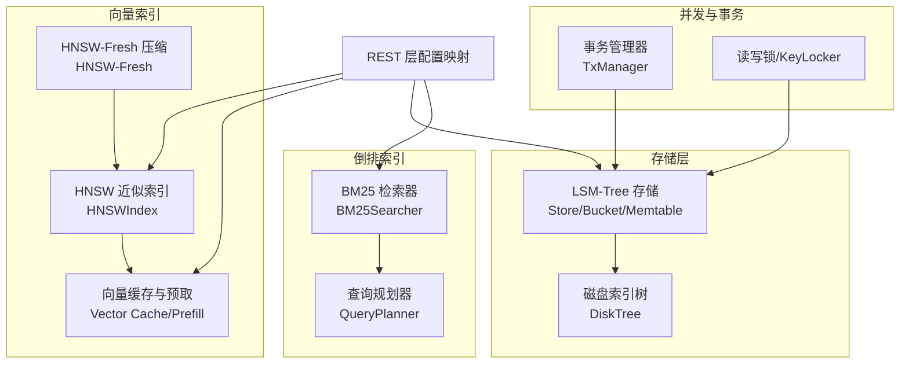
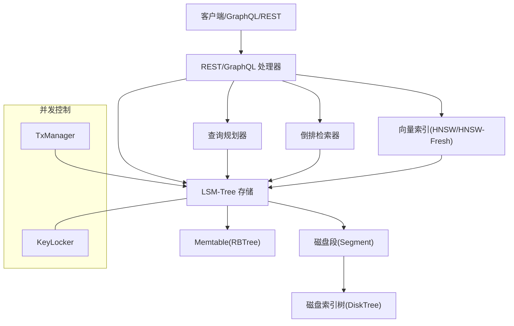
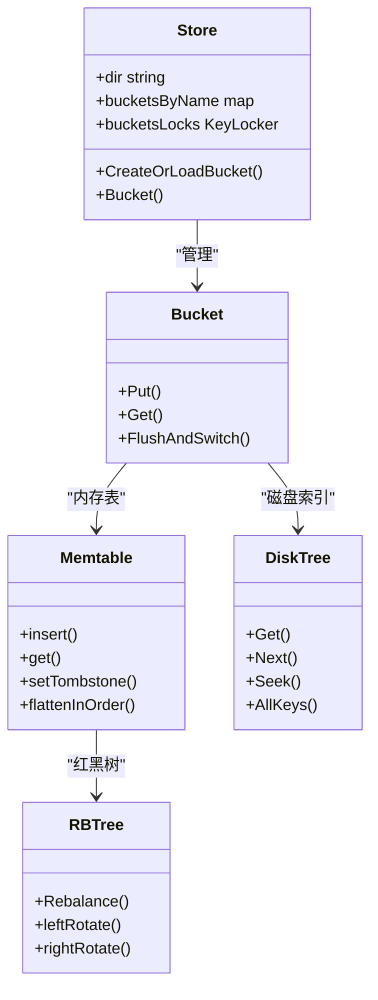
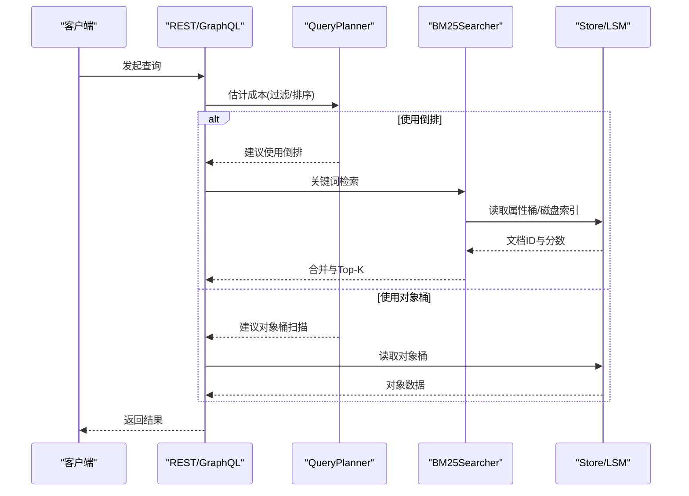
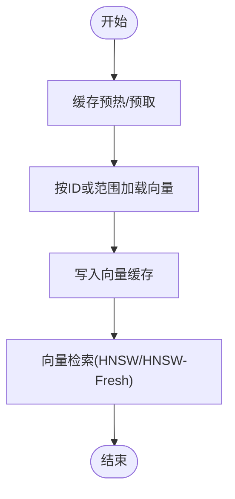
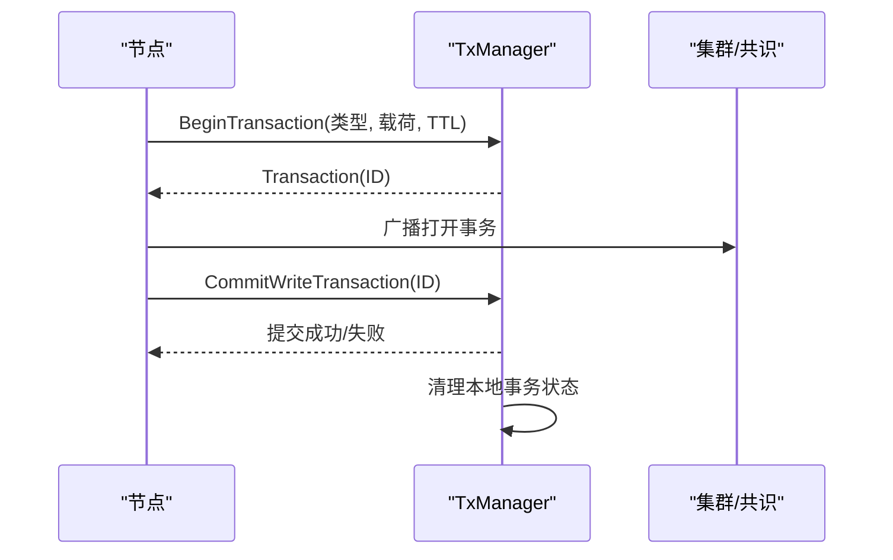
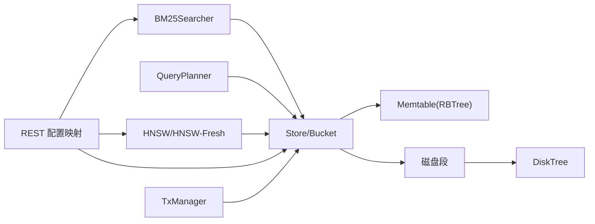

# 数据库引擎

<cite>
**本文引用的文件**
- [adapters/repos/db/lsmkv/store.go](file://adapters/repos/db/lsmkv/store.go)
- [adapters/repos/db/lsmkv/binary_search_tree.go](file://adapters/repos/db/lsmkv/binary_search_tree.go)
- [adapters/repos/db/lsmkv/binary_search_tree_multi.go](file://adapters/repos/db/lsmkv/binary_search_tree_multi.go)
- [adapters/repos/db/lsmkv/segmentindex/disk_tree.go](file://adapters/repos/db/lsmkv/segmentindex/disk_tree.go)
- [adapters/repos/db/lsmkv/rbtree/rbtree.go](file://adapters/repos/db/lsmkv/rbtree/rbtree.go)
- [adapters/repos/db/inverted/bm25_searcher.go](file://adapters/repos/db/inverted/bm25_searcher.go)
- [adapters/repos/db/inverted/bm25_searcher_block.go](file://adapters/repos/db/inverted/bm25_searcher_block.go)
- [adapters/repos/db/sorter/query_planner.go](file://adapters/repos/db/sorter/query_planner.go)
- [adapters/repos/db/vector/hnsw/vector_cache_prefiller_test.go](file://adapters/repos/db/vector/hnsw/vector_cache_prefiller_test.go)
- [adapters/repos/db/vector/flat/quantizer.go](file://adapters/repos/db/vector/flat/quantizer.go)
- [adapters/repos/db/vector/hfresh/hnsw.go](file://adapters/repos/db/vector/hfresh/hnsw.go)
- [usecases/config/config_handler.go](file://usecases/config/config_handler.go)
- [adapters/handlers/rest/configure_api.go](file://adapters/handlers/rest/configure_api.go)
- [usecases/cluster/transactions_write.go](file://usecases/cluster/transactions_write.go)
- [cluster/schema/schema_thread_safety_test.go](file://cluster/schema/schema_thread_safety_test.go)
</cite>

## 目录
1. [简介](#简介)
2. [项目结构](#项目结构)
3. [核心组件](#核心组件)
4. [架构总览](#架构总览)
5. [组件详解](#组件详解)
6. [依赖关系分析](#依赖关系分析)
7. [性能考量](#性能考量)
8. [故障排查指南](#故障排查指南)
9. [结论](#结论)
10. [附录：配置与调优](#附录配置与调优)

## 简介
本文件面向 Weaviate 数据库引擎，系统性梳理其存储子系统（LSM-Tree）、向量索引（HNSW/HNSW-Fresh）与倒排索引（BM25）的协同工作机制，覆盖数据持久化策略、查询执行计划、并发控制与事务、性能优化与缓存、以及关键配置参数与调优建议。文档以“由浅入深”的方式组织，既适合初学者快速理解整体架构，也为深入开发者提供代码级参考。

## 项目结构
Weaviate 的数据库引擎主要由以下模块构成：
- LSM-Tree 存储层：负责键值对的内存表（Memtable）、磁盘段（Segment）与索引树（DiskTree），支持多策略桶（如替换、Roaring 集合等）。
- 倒排索引层：基于 BM25 的文本检索，支持 Block Max WAND 优化与属性长度归一化（BM25F）。
- 向量索引层：HNSW 用于高维向量近似最近邻检索；HNSW-Fresh 提供压缩与量化能力。
- 查询规划器：根据过滤与排序需求选择最优执行路径（对象桶扫描 vs 倒排桶扫描）。
- 并发与事务：读写锁保护共享状态，分布式事务管理器协调写事务。
- 缓存与预取：向量缓存与预热，提升检索吞吐与延迟表现。
- 配置与导出：REST 层将配置映射到引擎运行时参数。

图表来源
- [adapters/repos/db/lsmkv/store.go](file://adapters/repos/db/lsmkv/store.go#L41-L86)
- [adapters/repos/db/lsmkv/segmentindex/disk_tree.go](file://adapters/repos/db/lsmkv/segmentindex/disk_tree.go#L24-L44)
- [adapters/repos/db/inverted/bm25_searcher.go](file://adapters/repos/db/inverted/bm25_searcher.go#L46-L86)
- [adapters/repos/db/sorter/query_planner.go](file://adapters/repos/db/sorter/query_planner.go#L50-L75)
- [adapters/repos/db/vector/hnsw/vector_cache_prefiller_test.go](file://adapters/repos/db/vector/hnsw/vector_cache_prefiller_test.go#L55-L125)
- [adapters/repos/db/vector/hfresh/hnsw.go](file://adapters/repos/db/vector/hfresh/hnsw.go#L50-L109)
- [adapters/handlers/rest/configure_api.go](file://adapters/handlers/rest/configure_api.go#L416-L430)

章节来源
- [adapters/repos/db/lsmkv/store.go](file://adapters/repos/db/lsmkv/store.go#L41-L200)
- [adapters/repos/db/lsmkv/segmentindex/disk_tree.go](file://adapters/repos/db/lsmkv/segmentindex/disk_tree.go#L24-L206)
- [adapters/repos/db/inverted/bm25_searcher.go](file://adapters/repos/db/inverted/bm25_searcher.go#L46-L86)
- [adapters/repos/db/sorter/query_planner.go](file://adapters/repos/db/sorter/query_planner.go#L50-L193)
- [adapters/repos/db/vector/hnsw/vector_cache_prefiller_test.go](file://adapters/repos/db/vector/hnsw/vector_cache_prefiller_test.go#L55-L125)
- [adapters/repos/db/vector/hfresh/hnsw.go](file://adapters/repos/db/vector/hfresh/hnsw.go#L50-L109)
- [adapters/handlers/rest/configure_api.go](file://adapters/handlers/rest/configure_api.go#L416-L430)

## 核心组件
- LSM-Tree 存储与索引
  - Store/Bucket：管理桶集合、目录、生命周期与并发控制。
  - Memtable：内存中的红黑树（RBTree）实现的二叉搜索树，支持插入、删除标记（墓碑）、统计与扁平化。
  - 磁盘索引树（DiskTree）：只读的磁盘段键范围索引，支持按键查找、顺序遍历与全量键收集。
- 倒排索引与查询规划
  - BM25Searcher：基于 BM25 的关键词检索，支持 Block Max WAND、属性长度归一化（BM25F）与多属性融合。
  - QueryPlanner：成本模型驱动的排序/过滤执行计划选择，决定使用对象桶扫描还是倒排桶扫描。
- 向量索引与缓存
  - HNSW：高维向量近似最近邻检索，支持 EF/EFc、过滤策略与压缩量化。
  - HNSW-Fresh：在 HNSW 基础上引入压缩与量化，降低存储与带宽开销。
  - Vector Cache/Prefill：向量缓存与预热，减少重复加载与冷启动延迟。
- 并发与事务
  - KeyLocker：按桶名粒度的读写锁，避免同一桶并发冲突。
  - TxManager：写事务的开启、提交与过期管理，保证跨节点一致性与可恢复性。

章节来源
- [adapters/repos/db/lsmkv/store.go](file://adapters/repos/db/lsmkv/store.go#L41-L200)
- [adapters/repos/db/lsmkv/binary_search_tree.go](file://adapters/repos/db/lsmkv/binary_search_tree.go#L21-L101)
- [adapters/repos/db/lsmkv/binary_search_tree_multi.go](file://adapters/repos/db/lsmkv/binary_search_tree_multi.go#L21-L77)
- [adapters/repos/db/lsmkv/segmentindex/disk_tree.go](file://adapters/repos/db/lsmkv/segmentindex/disk_tree.go#L24-L206)
- [adapters/repos/db/lsmkv/rbtree/rbtree.go](file://adapters/repos/db/lsmkv/rbtree/rbtree.go#L40-L177)
- [adapters/repos/db/inverted/bm25_searcher.go](file://adapters/repos/db/inverted/bm25_searcher.go#L46-L86)
- [adapters/repos/db/inverted/bm25_searcher_block.go](file://adapters/repos/db/inverted/bm25_searcher_block.go#L240-L373)
- [adapters/repos/db/sorter/query_planner.go](file://adapters/repos/db/sorter/query_planner.go#L50-L193)
- [adapters/repos/db/vector/hnsw/vector_cache_prefiller_test.go](file://adapters/repos/db/vector/hnsw/vector_cache_prefiller_test.go#L55-L125)
- [adapters/repos/db/vector/flat/quantizer.go](file://adapters/repos/db/vector/flat/quantizer.go#L325-L456)
- [adapters/repos/db/vector/hfresh/hnsw.go](file://adapters/repos/db/vector/hfresh/hnsw.go#L50-L109)
- [usecases/cluster/transactions_write.go](file://usecases/cluster/transactions_write.go#L318-L449)

## 架构总览
Weaviate 的数据库引擎采用“存储 + 索引 + 查询 + 并发”的分层设计：
- 存储层（LSM-Tree）：对象与属性数据通过 LSM-Tree 落盘，磁盘段辅以 DiskTree 快速定位键范围。
- 索引层（倒排 + 向量）：倒排索引支撑文本检索（BM25/BM25F），向量索引支撑语义检索（HNSW/HNSW-Fresh）。
- 查询层：QueryPlanner 依据成本模型选择最佳路径；BM25Searcher 负责关键词检索；向量检索由 HNSW/Fresh 执行。
- 并发与事务：KeyLocker 与 TxManager 保障并发安全与一致性。

图表来源
- [adapters/repos/db/lsmkv/store.go](file://adapters/repos/db/lsmkv/store.go#L41-L120)
- [adapters/repos/db/sorter/query_planner.go](file://adapters/repos/db/sorter/query_planner.go#L50-L193)
- [adapters/repos/db/inverted/bm25_searcher.go](file://adapters/repos/db/inverted/bm25_searcher.go#L46-L86)
- [adapters/repos/db/vector/hnsw/vector_cache_prefiller_test.go](file://adapters/repos/db/vector/hnsw/vector_cache_prefiller_test.go#L55-L125)
- [usecases/cluster/transactions_write.go](file://usecases/cluster/transactions_write.go#L318-L449)

## 组件详解

### LSM-Tree 存储与索引
- Store/Bucket
  - 负责桶的注册、加载与状态更新，提供目录隔离与并发控制（KeyLocker）。
  - 生命周期回调（周期任务）与限流器集成，确保资源可控。
- Memtable（红黑树）
  - 二叉搜索树（BST）与红黑树（RBTree）结合，插入时自动重平衡，支持墓碑标记与二次键集合。
  - 支持扁平化遍历与统计（upsert/tombstone 键集），便于后续 compaction。
- 磁盘索引树（DiskTree）
  - 只读的磁盘段键范围索引，支持按键查找、Next/Seek 与全量键收集。
  - 通过字节序读写器高效解析节点，避免多余内存拷贝。

图表来源
- [adapters/repos/db/lsmkv/store.go](file://adapters/repos/db/lsmkv/store.go#L41-L120)
- [adapters/repos/db/lsmkv/binary_search_tree.go](file://adapters/repos/db/lsmkv/binary_search_tree.go#L21-L101)
- [adapters/repos/db/lsmkv/binary_search_tree_multi.go](file://adapters/repos/db/lsmkv/binary_search_tree_multi.go#L21-L77)
- [adapters/repos/db/lsmkv/rbtree/rbtree.go](file://adapters/repos/db/lsmkv/rbtree/rbtree.go#L40-L177)
- [adapters/repos/db/lsmkv/segmentindex/disk_tree.go](file://adapters/repos/db/lsmkv/segmentindex/disk_tree.go#L24-L206)

章节来源
- [adapters/repos/db/lsmkv/store.go](file://adapters/repos/db/lsmkv/store.go#L41-L200)
- [adapters/repos/db/lsmkv/binary_search_tree.go](file://adapters/repos/db/lsmkv/binary_search_tree.go#L21-L442)
- [adapters/repos/db/lsmkv/binary_search_tree_multi.go](file://adapters/repos/db/lsmkv/binary_search_tree_multi.go#L21-L310)
- [adapters/repos/db/lsmkv/rbtree/rbtree.go](file://adapters/repos/db/lsmkv/rbtree/rbtree.go#L40-L177)
- [adapters/repos/db/lsmkv/segmentindex/disk_tree.go](file://adapters/repos/db/lsmkv/segmentindex/disk_tree.go#L24-L206)

### 倒排索引与查询规划
- BM25Searcher
  - 支持多属性检索、Block Max WAND、停用词检测与属性长度归一化（BM25F）。
  - 将各属性得分合并后进行 Top-K 排序与对象载入。
- QueryPlanner
  - 成本估算：基于对象桶总行数与过滤命中率，比较直接扫描与倒排扫描的成本。
  - 决策条件：逻辑类型与字节序一致、属性桶存在且可利用。

图表来源
- [adapters/repos/db/sorter/query_planner.go](file://adapters/repos/db/sorter/query_planner.go#L106-L193)
- [adapters/repos/db/inverted/bm25_searcher.go](file://adapters/repos/db/inverted/bm25_searcher.go#L46-L86)
- [adapters/repos/db/inverted/bm25_searcher_block.go](file://adapters/repos/db/inverted/bm25_searcher_block.go#L240-L373)

章节来源
- [adapters/repos/db/inverted/bm25_searcher.go](file://adapters/repos/db/inverted/bm25_searcher.go#L46-L86)
- [adapters/repos/db/inverted/bm25_searcher_block.go](file://adapters/repos/db/inverted/bm25_searcher_block.go#L240-L373)
- [adapters/repos/db/sorter/query_planner.go](file://adapters/repos/db/sorter/query_planner.go#L106-L193)

### 向量索引与缓存
- HNSW
  - 支持 EF/EFc、过滤策略与压缩量化；启动后进行缓存预填，提升检索性能。
- HNSW-Fresh
  - 在 HNSW 基础上引入压缩量化（旋转量化等），降低存储与带宽占用。
- 向量缓存与预热
  - 提供按 ID 获取、批量迭代、锁定/解锁与预加载接口；支持分页与允许列表过滤。

图表来源
- [adapters/repos/db/vector/hnsw/vector_cache_prefiller_test.go](file://adapters/repos/db/vector/hnsw/vector_cache_prefiller_test.go#L55-L125)
- [adapters/repos/db/vector/flat/quantizer.go](file://adapters/repos/db/vector/flat/quantizer.go#L325-L456)
- [adapters/repos/db/vector/hfresh/hnsw.go](file://adapters/repos/db/vector/hfresh/hnsw.go#L50-L109)

章节来源
- [adapters/repos/db/vector/hnsw/vector_cache_prefiller_test.go](file://adapters/repos/db/vector/hnsw/vector_cache_prefiller_test.go#L55-L125)
- [adapters/repos/db/vector/flat/quantizer.go](file://adapters/repos/db/vector/flat/quantizer.go#L325-L456)
- [adapters/repos/db/vector/hfresh/hnsw.go](file://adapters/repos/db/vector/hfresh/hnsw.go#L50-L109)

### 并发控制与事务
- 并发控制
  - KeyLocker：按桶名加锁，避免同一桶并发写入导致的数据竞争。
  - Store 的桶访问与状态更新均受读写锁保护。
- 分布式事务
  - TxManager：写事务的开启、提交与过期管理；校验事务有效性与 TTL；提交后清理本地事务状态并记录指标。

图表来源
- [usecases/cluster/transactions_write.go](file://usecases/cluster/transactions_write.go#L318-L449)
- [adapters/repos/db/lsmkv/store.go](file://adapters/repos/db/lsmkv/store.go#L41-L120)

章节来源
- [adapters/repos/db/lsmkv/store.go](file://adapters/repos/db/lsmkv/store.go#L41-L120)
- [usecases/cluster/transactions_write.go](file://usecases/cluster/transactions_write.go#L318-L449)
- [cluster/schema/schema_thread_safety_test.go](file://cluster/schema/schema_thread_safety_test.go#L568-L616)

## 依赖关系分析
- 组件耦合
  - Store 与 Bucket：强内聚，围绕桶生命周期与并发控制。
  - Memtable 与 RBTree：紧密耦合，插入/删除通过红黑树保持平衡。
  - DiskTree 与 Segment：只读索引与磁盘段配合，提供键范围快速定位。
  - BM25Searcher 与 Store：依赖对象桶与属性桶，通过磁盘索引加速。
  - HNSW/HNSW-Fresh 与 Store：依赖对象桶读取向量与元数据。
- 外部依赖
  - REST 层将配置映射到引擎运行时参数，影响 LSM 段大小、清理间隔、索引范围等。
  - 事务管理器与集群层协作，保证跨节点一致性。

图表来源
- [adapters/repos/db/lsmkv/store.go](file://adapters/repos/db/lsmkv/store.go#L41-L120)
- [adapters/repos/db/inverted/bm25_searcher.go](file://adapters/repos/db/inverted/bm25_searcher.go#L46-L86)
- [adapters/repos/db/sorter/query_planner.go](file://adapters/repos/db/sorter/query_planner.go#L50-L193)
- [adapters/repos/db/vector/hnsw/vector_cache_prefiller_test.go](file://adapters/repos/db/vector/hnsw/vector_cache_prefiller_test.go#L55-L125)
- [adapters/handlers/rest/configure_api.go](file://adapters/handlers/rest/configure_api.go#L416-L430)
- [usecases/cluster/transactions_write.go](file://usecases/cluster/transactions_write.go#L318-L449)

章节来源
- [adapters/repos/db/lsmkv/store.go](file://adapters/repos/db/lsmkv/store.go#L41-L120)
- [adapters/handlers/rest/configure_api.go](file://adapters/handlers/rest/configure_api.go#L416-L430)

## 性能考量
- LSM-Tree
  - Memtable 刷新策略：脏页保留时间、最大活跃时长、内存上限等参数直接影响写放大与内存占用。
  - 段大小与清理：段最大尺寸、清理间隔、是否分离对象 Compaction、校验开关等影响 I/O 与空间回收效率。
- 倒排索引
  - Block Max WAND、停用词与属性长度归一化（BM25F）显著提升检索质量与速度。
  - 查询规划器在过滤命中率低时优先对象桶扫描，避免倒排扫描的额外开销。
- 向量索引
  - HNSW 参数（EF/EFc、过滤策略）与缓存预热可显著降低延迟。
  - HNSW-Fresh 压缩量化减少存储与网络传输，适合大规模向量场景。
- 并发与事务
  - KeyLocker 降低锁竞争；TxManager 的提交流程与慢日志有助于定位瓶颈。

章节来源
- [usecases/config/config_handler.go](file://usecases/config/config_handler.go#L413-L463)
- [adapters/handlers/rest/configure_api.go](file://adapters/handlers/rest/configure_api.go#L416-L430)
- [adapters/repos/db/sorter/query_planner.go](file://adapters/repos/db/sorter/query_planner.go#L106-L193)
- [adapters/repos/db/vector/hnsw/vector_cache_prefiller_test.go](file://adapters/repos/db/vector/hnsw/vector_cache_prefiller_test.go#L55-L125)
- [adapters/repos/db/vector/hfresh/hnsw.go](file://adapters/repos/db/vector/hfresh/hnsw.go#L50-L109)

## 故障排查指南
- 写入阻塞
  - 检查 KeyLocker 是否被长时间持有；确认桶名是否正确；观察 Memtable 刷新是否频繁触发。
- 查询缓慢
  - 查看 QueryPlanner 的决策轨迹与成本估算；确认是否误用倒排扫描；检查 BM25 参数与 Block Max WAND 开关。
- 向量检索异常
  - 校验 HNSW 参数（EF/EFc、过滤策略）与缓存预热；确认 HNSW-Fresh 压缩配置是否匹配数据规模。
- 事务提交失败
  - 检查事务 ID 与 TTL；确认 TxManager 的提交流程与慢日志；核对集群健康状态。

章节来源
- [adapters/repos/db/lsmkv/store.go](file://adapters/repos/db/lsmkv/store.go#L41-L120)
- [adapters/repos/db/sorter/query_planner.go](file://adapters/repos/db/sorter/query_planner.go#L106-L193)
- [usecases/cluster/transactions_write.go](file://usecases/cluster/transactions_write.go#L318-L449)

## 结论
Weaviate 的数据库引擎通过 LSM-Tree、倒排索引与向量索引的协同，实现了高性能的结构化与非结构化数据检索。查询规划器在成本模型驱动下选择最优路径，配合缓存与预热策略进一步优化延迟与吞吐。并发控制与事务管理确保了在高并发与分布式环境下的稳定性与一致性。

## 附录：配置与调优
- 存储与 LSM-Tree 相关配置（Persistence）
  - 数据路径、Memtable 最大/最小活跃时长、刷新阈值、LSM 段最大尺寸、段清理间隔、是否分离对象 Compaction、段校验开关、周期任务并发因子、索引范围是否驻内存、最小 MMap 大小、懒加载段开关、段信息写入文件开关、最大重用 WAL 大小等。
- REST 层参数映射
  - 将 Persistence 中的关键参数映射到运行时，如段清理间隔、分离对象 Compaction、段大小、周期任务并发因子、索引范围驻内存、根路径、查询限制与最大结果数等。
- 调优建议
  - 写入密集场景：适当缩短 Memtable 最小活跃时长、增大 Memtable 最大尺寸，启用段分离 Compaction。
  - 查询密集场景：启用 Block Max WAND、合理设置 BM25 参数、开启索引范围驻内存、优化 HNSW 参数与缓存预热。
  - 分布式场景：关注事务 TTL 与慢日志，确保集群健康与锁粒度合理。

章节来源
- [usecases/config/config_handler.go](file://usecases/config/config_handler.go#L413-L463)
- [adapters/handlers/rest/configure_api.go](file://adapters/handlers/rest/configure_api.go#L416-L430)