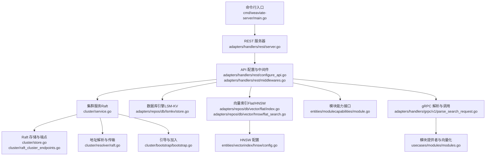
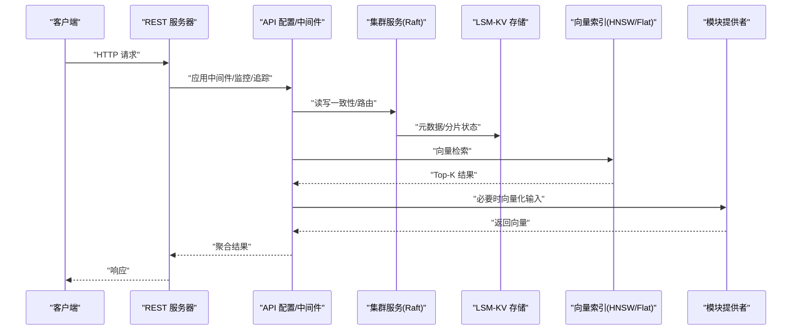
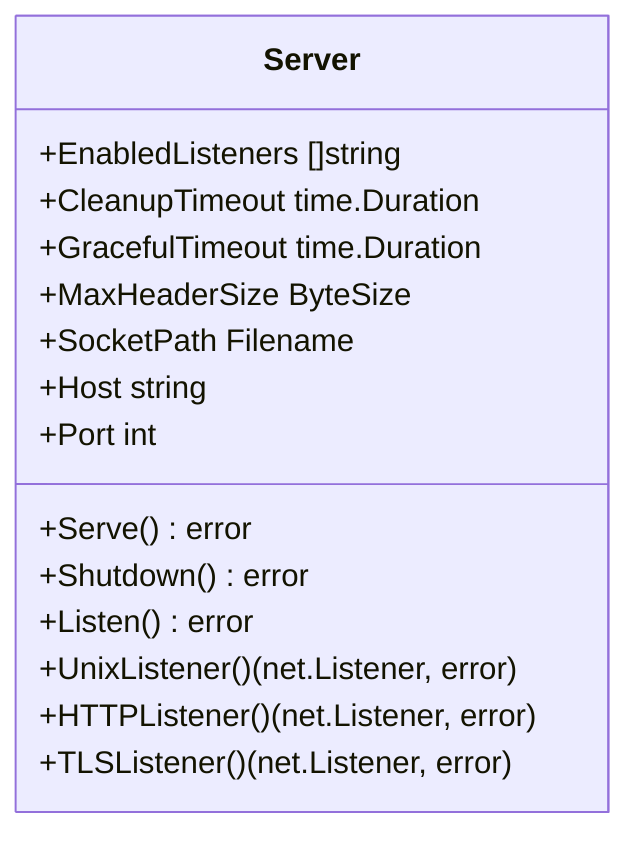
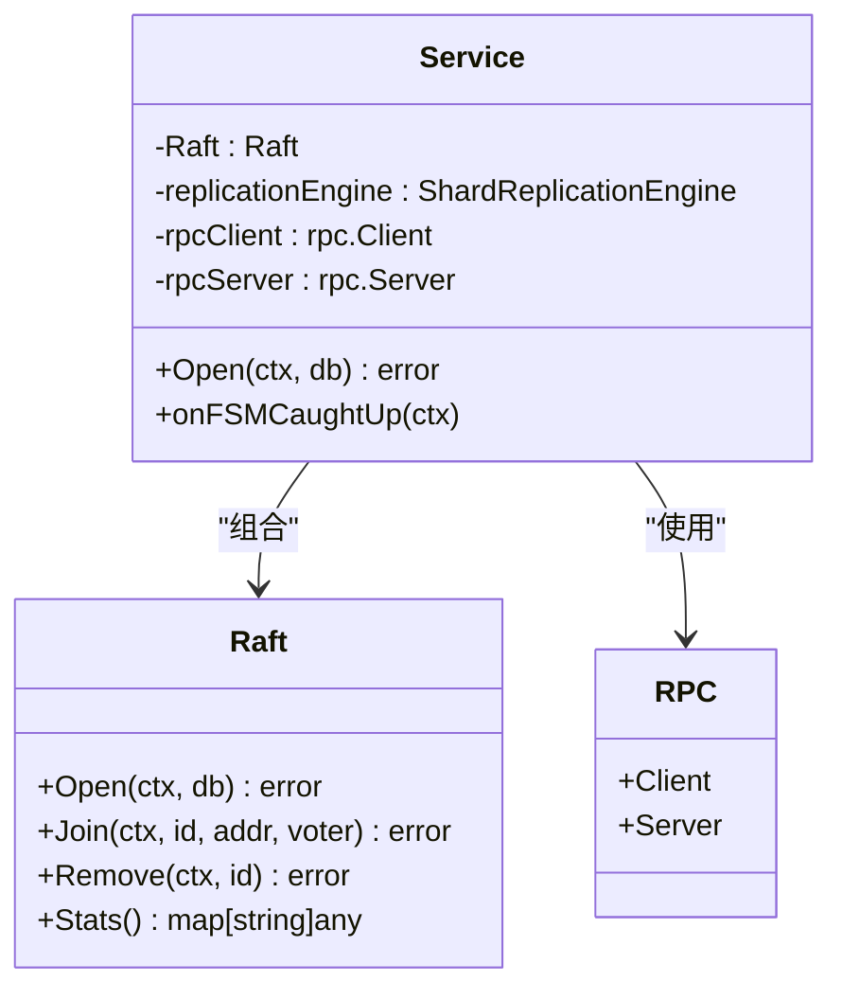
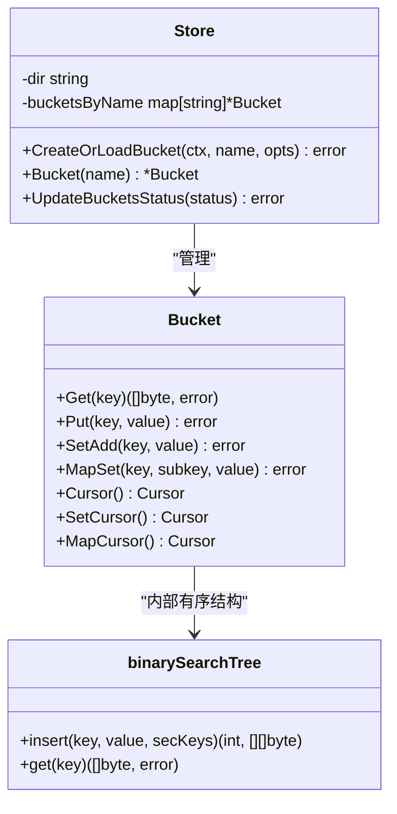
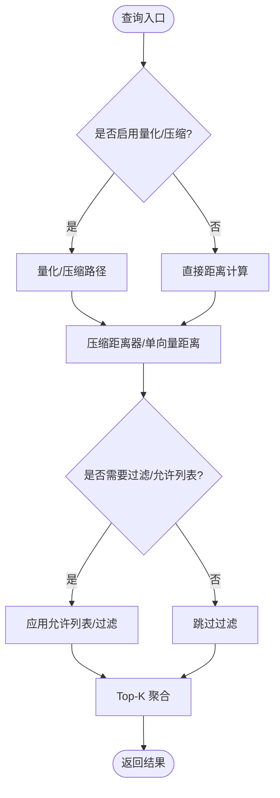
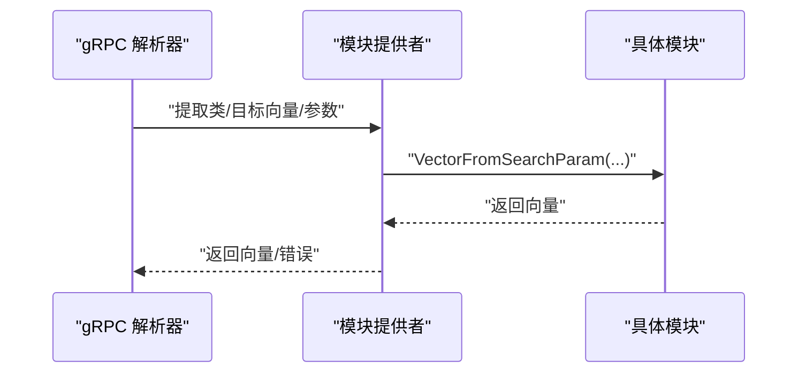
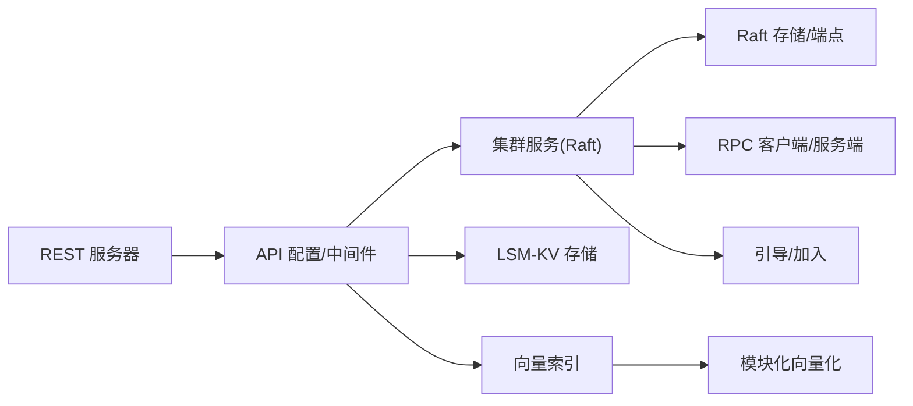

# 核心组件

<cite>
**本文引用的文件**
- [cmd/weaviate-server/main.go](file://cmd/weaviate-server/main.go)
- [adapters/handlers/rest/server.go](file://adapters/handlers/rest/server.go)
- [adapters/handlers/rest/configure_api.go](file://adapters/handlers/rest/configure_api.go)
- [adapters/handlers/rest/middlewares.go](file://adapters/handlers/rest/middlewares.go)
- [cluster/service.go](file://cluster/service.go)
- [cluster/store.go](file://cluster/store.go)
- [cluster/raft_cluster_endpoints.go](file://cluster/raft_cluster_endpoints.go)
- [cluster/resolver/raft.go](file://cluster/resolver/raft.go)
- [cluster/bootstrap/bootstrap.go](file://cluster/bootstrap/bootstrap.go)
- [adapters/repos/db/lsmkv/store.go](file://adapters/repos/db/lsmkv/store.go)
- [adapters/repos/db/lsmkv/binary_search_tree.go](file://adapters/repos/db/lsmkv/binary_search_tree.go)
- [adapters/repos/db/vector/flat/index.go](file://adapters/repos/db/vector/flat/index.go)
- [adapters/repos/db/vector/hnsw/flat_search.go](file://adapters/repos/db/vector/hnsw/flat_search.go)
- [entities/vectorindex/hnsw/config.go](file://entities/vectorindex/hnsw/config.go)
- [entities/modulecapabilities/module.go](file://entities/modulecapabilities/module.go)
- [adapters/handlers/grpc/v1/parse_search_request.go](file://adapters/handlers/grpc/v1/parse_search_request.go)
- [usecases/modules/modules.go](file://usecases/modules/modules.go)
</cite>

## 目录
1. [简介](#简介)
2. [项目结构](#项目结构)
3. [核心组件](#核心组件)
4. [架构总览](#架构总览)
5. [组件详解](#组件详解)
6. [依赖关系分析](#依赖关系分析)
7. [性能考量](#性能考量)
8. [故障排查指南](#故障排查指南)
9. [结论](#结论)
10. [附录](#附录)

## 简介
本文件面向 Weaviate 的核心组件架构，聚焦以下关键子系统：REST 服务器、集群管理器（基于 Raft）、数据库引擎（LSM-KV）、向量索引系统（Flat/HNSW）。文档从职责与接口、内部结构、生命周期与初始化顺序、组件间依赖与通信机制、可配置性与扩展点等方面进行系统化梳理，并辅以架构图与时序图帮助理解。

## 项目结构
Weaviate 的入口位于命令行程序，负责加载 Swagger 规范并启动 REST 服务器；REST 层在初始化阶段会串联集群状态、模块注册与数据库引擎；集群层基于 Raft 实现分布式一致性与复制；存储层采用 LSM-KV 提供键值持久化；向量索引层支持 Flat 与 HNSW 等策略，配合模块化向量化能力完成检索。

图表来源
- [cmd/weaviate-server/main.go](file://cmd/weaviate-server/main.go#L30-L68)
- [adapters/handlers/rest/server.go](file://adapters/handlers/rest/server.go#L164-L200)
- [adapters/handlers/rest/configure_api.go](file://adapters/handlers/rest/configure_api.go#L1253-L1283)
- [cluster/service.go](file://cluster/service.go#L69-L117)
- [cluster/store.go](file://cluster/store.go#L194-L200)
- [cluster/resolver/raft.go](file://cluster/resolver/raft.go#L74-L118)
- [cluster/bootstrap/bootstrap.go](file://cluster/bootstrap/bootstrap.go#L153-L178)
- [adapters/repos/db/lsmkv/store.go](file://adapters/repos/db/lsmkv/store.go#L66-L86)
- [adapters/repos/db/vector/flat/index.go](file://adapters/repos/db/vector/flat/index.go#L423-L458)
- [adapters/repos/db/vector/hnsw/flat_search.go](file://adapters/repos/db/vector/hnsw/flat_search.go#L28-L47)
- [entities/vectorindex/hnsw/config.go](file://entities/vectorindex/hnsw/config.go#L48-L136)
- [entities/modulecapabilities/module.go](file://entities/modulecapabilities/module.go#L45-L90)
- [adapters/handlers/grpc/v1/parse_search_request.go](file://adapters/handlers/grpc/v1/parse_search_request.go#L50-L93)
- [usecases/modules/modules.go](file://usecases/modules/modules.go#L879-L910)

章节来源
- [cmd/weaviate-server/main.go](file://cmd/weaviate-server/main.go#L30-L68)
- [adapters/handlers/rest/server.go](file://adapters/handlers/rest/server.go#L164-L200)

## 核心组件
- REST 服务器：承载 HTTP/gRPC 入口，负责路由、中间件、超时与监听配置、优雅关闭。
- 集群管理器（Raft）：提供分布式一致性、成员管理、快照、复制与引导流程。
- 数据库引擎（LSM-KV）：提供多桶策略的键值存储，支持替换、集合、映射等策略与游标访问。
- 向量索引系统：支持 Flat 与 HNSW，提供向量检索、距离计算、压缩与缓存策略。
- 模块化能力：统一模块接口，支持文本/图像/生成式/备份等扩展能力，并在查询时动态向量化。

章节来源
- [adapters/handlers/rest/server.go](file://adapters/handlers/rest/server.go#L80-L115)
- [cluster/service.go](file://cluster/service.go#L46-L64)
- [adapters/repos/db/lsmkv/store.go](file://adapters/repos/db/lsmkv/store.go#L41-L64)
- [adapters/repos/db/vector/flat/index.go](file://adapters/repos/db/vector/flat/index.go#L423-L458)
- [entities/modulecapabilities/module.go](file://entities/modulecapabilities/module.go#L45-L90)

## 架构总览
下图展示了从请求进入 REST 层到集群、存储与向量索引的完整链路，以及模块化向量化在 gRPC 路径中的参与。

图表来源
- [adapters/handlers/rest/server.go](file://adapters/handlers/rest/server.go#L164-L200)
- [adapters/handlers/rest/configure_api.go](file://adapters/handlers/rest/configure_api.go#L1253-L1283)
- [cluster/service.go](file://cluster/service.go#L149-L200)
- [adapters/repos/db/lsmkv/store.go](file://adapters/repos/db/lsmkv/store.go#L144-L200)
- [adapters/repos/db/vector/flat/index.go](file://adapters/repos/db/vector/flat/index.go#L423-L458)
- [usecases/modules/modules.go](file://usecases/modules/modules.go#L879-L910)

## 组件详解

### REST 服务器
- 职责
  - 初始化 Swagger 规范与操作集，构建 HTTP 服务器与监听器（HTTP/TLS/Unix Socket）。
  - 注册命令行参数与标志，处理优雅关闭与信号中断。
  - 应用中间件链（追踪、指标、安全、异常捕获等）。
- 关键接口与字段
  - 服务器结构体包含监听器、超时、清理时间、处理器等配置项。
  - 提供 Serve、Shutdown、Listen、UnixListener、HTTPListener、TLSListener 等方法。
- 生命周期
  - main 启动后加载 Swagger → 构建 API → 配置标志 → 配置 API → Serve。
  - 收到 SIGINT/SIGTERM 后触发优雅关闭。
- 可配置性
  - 支持多种监听方案、超时、头部大小限制、Unix Socket 路径等。
- 扩展点
  - 中间件注入、自定义处理器设置、监控与追踪集成。

图表来源
- [adapters/handlers/rest/server.go](file://adapters/handlers/rest/server.go#L80-L115)

章节来源
- [cmd/weaviate-server/main.go](file://cmd/weaviate-server/main.go#L30-L68)
- [adapters/handlers/rest/server.go](file://adapters/handlers/rest/server.go#L164-L200)
- [adapters/handlers/rest/middlewares.go](file://adapters/handlers/rest/middlewares.go#L110-L133)

### 集群管理器（Raft）
- 职责
  - 作为 Raft 层主入口，协调 Raft 存储、RPC 客户端/服务端、复制引擎、引导与成员管理。
  - 在 FSM 追上后启动复制引擎，处理节点加入/移除与统计信息。
- 关键接口与结构
  - Service 包含 Raft、复制引擎、RPC 客户端/服务端、日志与关闭通道。
  - New 构造函数创建 FSM、Raft、复制引擎与 RPC 服务。
  - Open 打开 RPC、打开 Raft 并根据是否存在已有状态执行加入或引导流程。
- 生命周期
  - New → Open → 引导/加入 → FSM 追上 → 启动复制引擎。
- 可配置性
  - 心跳/选举/租约超时、快照阈值/间隔、尾随日志、引导超时/期望、RPC 最大消息尺寸等。
- 扩展点
  - 节点选择器、地址解析器、复制拷贝器、RBAC/动态用户等。

图表来源
- [cluster/service.go](file://cluster/service.go#L46-L117)
- [cluster/store.go](file://cluster/store.go#L194-L200)
- [cluster/raft_cluster_endpoints.go](file://cluster/raft_cluster_endpoints.go#L66-L101)

章节来源
- [cluster/service.go](file://cluster/service.go#L69-L117)
- [cluster/store.go](file://cluster/store.go#L68-L189)
- [cluster/raft_cluster_endpoints.go](file://cluster/raft_cluster_endpoints.go#L66-L101)
- [cluster/resolver/raft.go](file://cluster/resolver/raft.go#L74-L118)
- [cluster/bootstrap/bootstrap.go](file://cluster/bootstrap/bootstrap.go#L153-L178)

### 数据库引擎（LSM-KV）
- 职责
  - 提供多桶键值存储，支持 Replace/Set/Map 等策略，提供游标遍历与二级索引。
  - 管理桶的并发访问、状态更新与生命周期。
- 关键接口与结构
  - Store 负责目录、桶注册与并发控制，提供 CreateOrLoadBucket、Bucket、UpdateBucketsStatus 等。
  - Bucket 支持不同策略与游标类型，二叉搜索树用于有序插入与查找。
- 生命周期
  - New 初始化目录与回调 → CreateOrLoadBucket 加载/创建桶 → 正常读写 → 关闭。
- 性能特性
  - 基于并发锁与限流器控制加载压力，支持周期性 Compaction/Aux 回调。
- 扩展点
  - 自定义桶策略、游标类型、回调钩子。

图表来源
- [adapters/repos/db/lsmkv/store.go](file://adapters/repos/db/lsmkv/store.go#L41-L116)
- [adapters/repos/db/lsmkv/binary_search_tree.go](file://adapters/repos/db/lsmkv/binary_search_tree.go#L21-L57)

章节来源
- [adapters/repos/db/lsmkv/store.go](file://adapters/repos/db/lsmkv/store.go#L66-L200)
- [adapters/repos/db/lsmkv/binary_search_tree.go](file://adapters/repos/db/lsmkv/binary_search_tree.go#L21-L57)

### 向量索引系统（Flat/HNSW）
- 职责
  - 提供向量检索能力，支持多种距离度量与压缩策略，结合缓存与过滤策略优化性能。
- Flat 索引
  - 支持量化（BQ/RQ/PQ/SQ）与普通浮点向量检索，按候选集计算距离并返回 Top-K。
- HNSW 索引
  - 支持动态 EF、过滤策略（Acorn/Sweeping）、多向量聚合与压缩距离器。
- 关键接口与配置
  - HNSW 用户配置包含最大连接数、EF/EFConstruction、动态 EF 参数、压缩配置、多向量聚合等。
- 生命周期
  - 索引构建与加载 → 查询时按策略选择路径 → 缓存命中/回退到磁盘扫描。
- 扩展点
  - 距离度量、压缩器、过滤策略、多向量聚合器。

图表来源
- [adapters/repos/db/vector/flat/index.go](file://adapters/repos/db/vector/flat/index.go#L423-L458)
- [adapters/repos/db/vector/hnsw/flat_search.go](file://adapters/repos/db/vector/hnsw/flat_search.go#L28-L47)
- [entities/vectorindex/hnsw/config.go](file://entities/vectorindex/hnsw/config.go#L48-L136)

章节来源
- [adapters/repos/db/vector/flat/index.go](file://adapters/repos/db/vector/flat/index.go#L423-L458)
- [adapters/repos/db/vector/hnsw/flat_search.go](file://adapters/repos/db/vector/hnsw/flat_search.go#L28-L47)
- [entities/vectorindex/hnsw/config.go](file://entities/vectorindex/hnsw/config.go#L48-L136)

### 模块化能力与向量化
- 职责
  - 统一模块接口，支持扩展文本/图像/生成式/备份/用量等能力；在查询时按目标向量动态向量化。
- 关键接口
  - Module 接口定义名称、类型与初始化；可选 RootHandler、Close、UsageService 等。
  - 模块提供者在查询路径中提取输入参数并调用相应模块生成向量。
- 生命周期
  - 启动阶段注册模块 → 查询阶段按需向量化 → 关闭阶段释放资源。
- 扩展点
  - 新增模块类型、依赖注入、扩展 HTTP 处理器。

图表来源
- [adapters/handlers/grpc/v1/parse_search_request.go](file://adapters/handlers/grpc/v1/parse_search_request.go#L50-L93)
- [usecases/modules/modules.go](file://usecases/modules/modules.go#L879-L910)
- [entities/modulecapabilities/module.go](file://entities/modulecapabilities/module.go#L45-L90)

章节来源
- [entities/modulecapabilities/module.go](file://entities/modulecapabilities/module.go#L45-L90)
- [adapters/handlers/grpc/v1/parse_search_request.go](file://adapters/handlers/grpc/v1/parse_search_request.go#L50-L93)
- [usecases/modules/modules.go](file://usecases/modules/modules.go#L879-L910)

## 依赖关系分析
- REST 服务器依赖 API 规范与中间件，向上游提供统一入口。
- REST 层在配置阶段依赖集群服务（初始化集群状态），并在运行期通过 Raft 保证一致性。
- 集群层依赖 Raft 存储、RPC 客户端/服务端、复制引擎与地址解析器。
- 存储层为数据库引擎提供 LSM-KV 桶与游标能力。
- 向量索引层依赖存储层的数据与模块化向量化能力。
- 模块化能力贯穿 REST/gRPC 查询路径，提供动态向量化与扩展。

图表来源
- [adapters/handlers/rest/configure_api.go](file://adapters/handlers/rest/configure_api.go#L1253-L1283)
- [cluster/service.go](file://cluster/service.go#L69-L117)
- [cluster/store.go](file://cluster/store.go#L194-L200)
- [adapters/repos/db/lsmkv/store.go](file://adapters/repos/db/lsmkv/store.go#L144-L200)
- [adapters/repos/db/vector/flat/index.go](file://adapters/repos/db/vector/flat/index.go#L423-L458)
- [usecases/modules/modules.go](file://usecases/modules/modules.go#L879-L910)

章节来源
- [adapters/handlers/rest/configure_api.go](file://adapters/handlers/rest/configure_api.go#L1253-L1283)
- [cluster/service.go](file://cluster/service.go#L69-L117)
- [cluster/store.go](file://cluster/store.go#L194-L200)

## 性能考量
- 监控与追踪：REST 层可启用 HTTP 指标与 OpenTelemetry 追踪，便于定位热点。
- Raft 与复制：合理设置心跳/选举超时、快照阈值与尾随日志，避免频繁快照与日志回放。
- LSM-KV：利用并发锁与加载限流器控制高并发加载压力；周期性 Compaction/Aux 回调降低写放大。
- 向量检索：HNSW 动态 EF 与过滤策略、Flat 量化与缓存、压缩距离器减少计算成本。
- 模块化：延迟初始化与按需向量化，避免不必要的模块开销。

## 故障排查指南
- REST 优雅关闭
  - 若收到中断信号，服务器会尝试优雅关闭；若关闭失败会记录日志。
- Raft 引导/加入
  - 若存在已有状态，节点会尝试加入 join 列表；否则执行引导流程；超时可适当增大。
- 模块启动
  - 模块注册失败会导致致命错误，检查模块配置与依赖发现。
- 向量检索
  - 若量化/压缩路径报错，检查向量维度与压缩配置一致性；确认允许列表与过滤策略正确。

章节来源
- [adapters/handlers/rest/server.go](file://adapters/handlers/rest/server.go#L500-L518)
- [cluster/service.go](file://cluster/service.go#L171-L200)
- [adapters/handlers/rest/configure_api.go](file://adapters/handlers/rest/configure_api.go#L1274-L1283)
- [adapters/repos/db/vector/flat/index.go](file://adapters/repos/db/vector/flat/index.go#L423-L458)

## 结论
Weaviate 的核心架构围绕“REST 入口 + Raft 集群 + LSM-KV 存储 + 向量索引 + 模块化扩展”展开。REST 层负责接入与治理，集群层保障一致性与复制，存储层提供高性能键值能力，向量索引层支撑大规模相似性检索，模块化能力则确保生态扩展性。通过清晰的生命周期与可配置性，系统在可用性、性能与可维护性之间取得平衡。

## 附录
- 接口规范与实现示例（以路径代替代码）
  - REST 服务器接口：[Server.Serve/Shutdown/Listen/UnixListener/HTTPListener/TLSListener](file://adapters/handlers/rest/server.go#L164-L200)
  - 集群服务接口：[Service.Open/onFSMCaughtUp](file://cluster/service.go#L149-L147)
  - Raft 端点接口：[Raft.Join/Remove/Stats](file://cluster/raft_cluster_endpoints.go#L66-L101)
  - LSM-KV 接口：[Store.CreateOrLoadBucket/Bucket/UpdateBucketsStatus](file://adapters/repos/db/lsmkv/store.go#L144-L116)
  - 向量索引接口：[Flat.SearchByVector/HNSW.flatSearch](file://adapters/repos/db/vector/flat/index.go#L423-L458)
  - 模块接口：[Module/ModuleWithHTTPHandlers/ModuleWithClose](file://entities/modulecapabilities/module.go#L45-L90)
  - gRPC 解析与模块调用：[Parser.Search/Provider.VectorFromSearchParam](file://adapters/handlers/grpc/v1/parse_search_request.go#L76-L93)