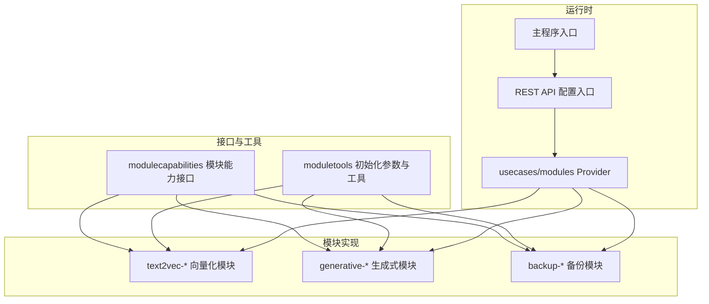
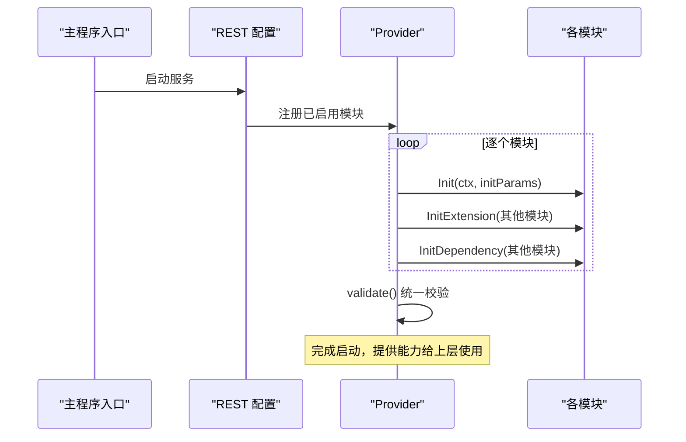
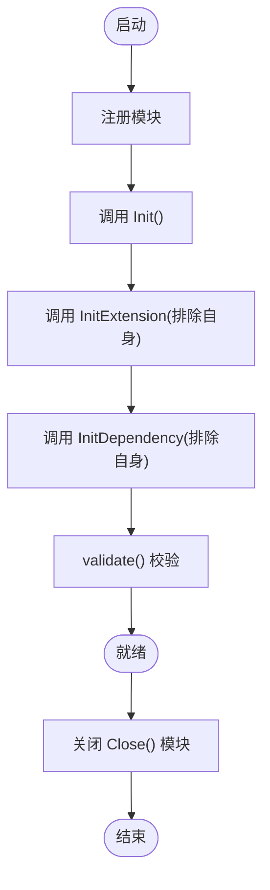
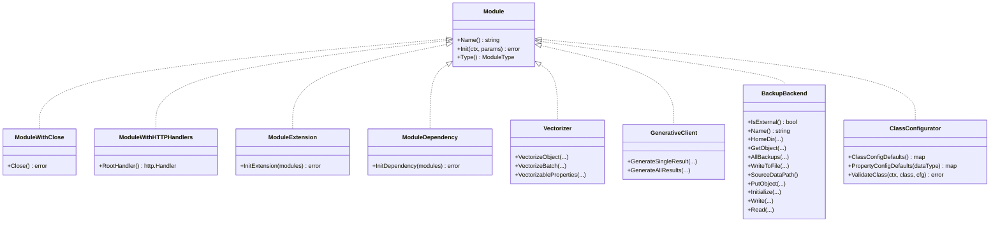
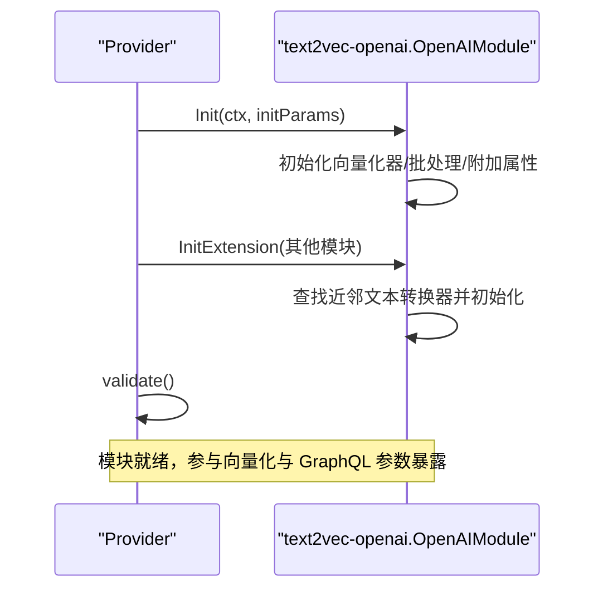
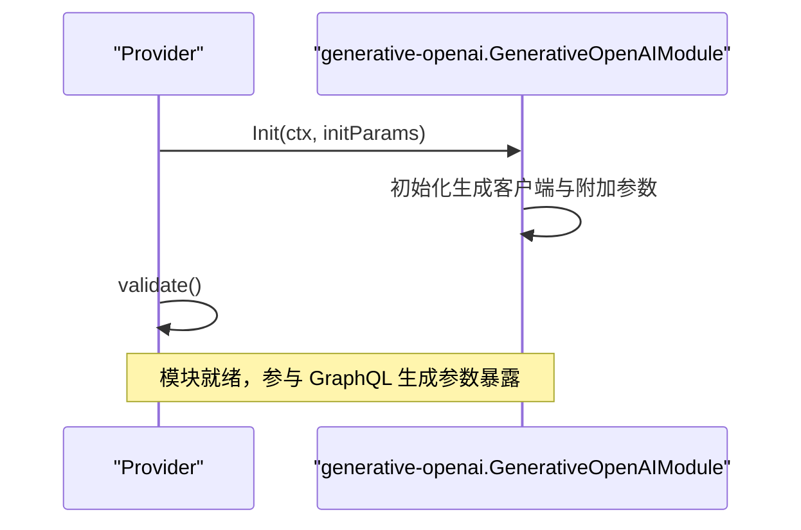
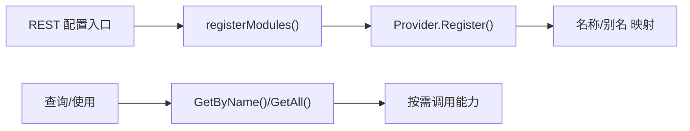
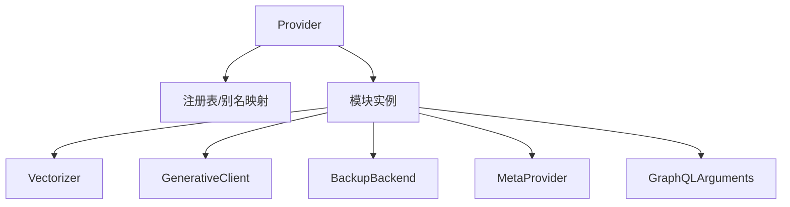

# 模块系统

<cite>
**本文引用的文件**
- [entities/modulecapabilities/module.go](file://entities/modulecapabilities/module.go)
- [entities/modulecapabilities/vectorizer.go](file://entities/modulecapabilities/vectorizer.go)
- [entities/modulecapabilities/generative.go](file://entities/modulecapabilities/generative.go)
- [entities/modulecapabilities/backup.go](file://entities/modulecapabilities/backup.go)
- [entities/modulecapabilities/config.go](file://entities/modulecapabilities/config.go)
- [entities/moduletools/init_params.go](file://entities/moduletools/init_params.go)
- [usecases/modules/modules.go](file://usecases/modules/modules.go)
- [modules/text2vec-openai/module.go](file://modules/text2vec-openai/module.go)
- [modules/generative-openai/module.go](file://modules/generative-openai/module.go)
- [cmd/weaviate-server/main.go](file://cmd/weaviate-server/main.go)
- [adapters/handlers/rest/configure_api.go](file://adapters/handlers/rest/configure_api.go)
</cite>

## 目录
1. [简介](#简介)
2. [项目结构](#项目结构)
3. [核心组件](#核心组件)
4. [架构总览](#架构总览)
5. [详细组件分析](#详细组件分析)
6. [依赖关系分析](#依赖关系分析)
7. [性能考量](#性能考量)
8. [故障排查指南](#故障排查指南)
9. [结论](#结论)
10. [附录：自定义模块开发指南与最佳实践](#附录自定义模块开发指南与最佳实践)

## 简介
本文件系统性梳理 Weaviate 的模块化架构与插件机制，围绕模块接口定义（向量化器、生成式模块、备份模块等）、生命周期管理（初始化、配置验证、资源清理）、模块间依赖与协调、注册与发现机制进行深入解析，并提供架构图、接口规范与自定义模块开发指南，帮助开发者快速理解并扩展 Weaviate 的能力边界。

## 项目结构
Weaviate 将“模块”抽象为可插拔能力单元，通过统一的 Provider 进行注册、发现与生命周期管理；具体实现位于 modules 目录下，按功能类型分包组织；接口规范集中在 entities/modulecapabilities 与 entities/moduletools 中，供所有模块共享。

图表来源
- [entities/modulecapabilities/module.go](file://entities/modulecapabilities/module.go#L24-L90)
- [entities/moduletools/init_params.go](file://entities/moduletools/init_params.go#L21-L62)
- [usecases/modules/modules.go](file://usecases/modules/modules.go#L46-L179)
- [adapters/handlers/rest/configure_api.go](file://adapters/handlers/rest/configure_api.go#L1273-L1282)
- [cmd/weaviate-server/main.go](file://cmd/weaviate-server/main.go#L30-L69)

章节来源
- [entities/modulecapabilities/module.go](file://entities/modulecapabilities/module.go#L24-L90)
- [entities/moduletools/init_params.go](file://entities/moduletools/init_params.go#L21-L62)
- [usecases/modules/modules.go](file://usecases/modules/modules.go#L46-L179)
- [adapters/handlers/rest/configure_api.go](file://adapters/handlers/rest/configure_api.go#L1273-L1282)
- [cmd/weaviate-server/main.go](file://cmd/weaviate-server/main.go#L30-L69)

## 核心组件
- 模块接口与类型
  - 基础接口：名称、初始化、类型
  - 可选能力：HTTP 处理器、关闭、扩展、依赖、使用统计、别名
  - 类型枚举：向量空间、文本/图像/多模态向量化、Ref2Vec、生成式、重排序、备份、离线存储、扩展等
- 能力接口族
  - 向量化器：对象/输入向量化、批量向量化、属性可向量化范围
  - 生成式：单/全部结果生成、额外参数、调试信息
  - 备份后端：外部存储检测、命名、路径、读写、列举、初始化
  - 配置：类默认值、属性默认值、类级校验、配置迁移
- 初始化参数
  - 存储提供者、应用状态、日志、配置、指标注册器
- Provider 生命周期
  - 注册、按序初始化、扩展初始化、依赖初始化、配置校验、关闭

章节来源
- [entities/modulecapabilities/module.go](file://entities/modulecapabilities/module.go#L24-L90)
- [entities/modulecapabilities/vectorizer.go](file://entities/modulecapabilities/vectorizer.go#L25-L54)
- [entities/modulecapabilities/generative.go](file://entities/modulecapabilities/generative.go#L48-L73)
- [entities/modulecapabilities/backup.go](file://entities/modulecapabilities/backup.go#L21-L55)
- [entities/modulecapabilities/config.go](file://entities/modulecapabilities/config.go#L22-L74)
- [entities/moduletools/init_params.go](file://entities/moduletools/init_params.go#L21-L62)
- [usecases/modules/modules.go](file://usecases/modules/modules.go#L71-L179)

## 架构总览
Weaviate 的模块系统采用“统一 Provider + 多实现”的模式。Provider 负责：
- 注册与发现：按名称与别名检索模块
- 生命周期：顺序调用 Init、InitExtension、InitDependency，并在最后统一校验
- 能力分发：根据类配置与模块类型决定是否暴露 GraphQL 参数、附加属性等
- 资源管理：统一关闭具备 Close 能力的模块

图表来源
- [adapters/handlers/rest/configure_api.go](file://adapters/handlers/rest/configure_api.go#L1273-L1282)
- [usecases/modules/modules.go](file://usecases/modules/modules.go#L138-L179)

章节来源
- [adapters/handlers/rest/configure_api.go](file://adapters/handlers/rest/configure_api.go#L1273-L1282)
- [usecases/modules/modules.go](file://usecases/modules/modules.go#L138-L179)

## 详细组件分析

### Provider 与模块生命周期
- 注册与发现
  - 支持主名与别名映射，便于兼容历史名称或别称
- 初始化顺序
  - 先调用每个模块的 Init
  - 再对每个模块调用 InitExtension，传入除自身外的所有模块
  - 最后对每个模块调用 InitDependency，传入除自身外的所有模块
- 配置验证
  - 校验 GraphQL 搜索参数、附加属性是否与内部保留冲突
  - 检测是否存在多向量空间，必要时禁用某些通用参数
- 关闭
  - 对具备 Close 能力的模块逐一关闭

图表来源
- [usecases/modules/modules.go](file://usecases/modules/modules.go#L71-L179)
- [usecases/modules/modules.go](file://usecases/modules/modules.go#L181-L216)

章节来源
- [usecases/modules/modules.go](file://usecases/modules/modules.go#L71-L179)
- [usecases/modules/modules.go](file://usecases/modules/modules.go#L181-L216)

### 模块接口族与职责边界
- 模块基础接口
  - 名称、类型、可选：HTTP 处理器、关闭、扩展、依赖、使用统计、别名
- 向量化器接口
  - 对象向量化、输入向量化、批量向量化、可向量化属性范围
- 生成式接口
  - 单/全部结果生成、请求参数提取、响应参数、调试信息
- 备份后端接口
  - 外部存储判定、命名、根目录、对象读写、列举、初始化
- 配置接口
  - 类默认值、属性默认值、类级校验、配置迁移

图表来源
- [entities/modulecapabilities/module.go](file://entities/modulecapabilities/module.go#L45-L90)
- [entities/modulecapabilities/vectorizer.go](file://entities/modulecapabilities/vectorizer.go#L25-L54)
- [entities/modulecapabilities/generative.go](file://entities/modulecapabilities/generative.go#L48-L73)
- [entities/modulecapabilities/backup.go](file://entities/modulecapabilities/backup.go#L21-L55)
- [entities/modulecapabilities/config.go](file://entities/modulecapabilities/config.go#L22-L74)

章节来源
- [entities/modulecapabilities/module.go](file://entities/modulecapabilities/module.go#L45-L90)
- [entities/modulecapabilities/vectorizer.go](file://entities/modulecapabilities/vectorizer.go#L25-L54)
- [entities/modulecapabilities/generative.go](file://entities/modulecapabilities/generative.go#L48-L73)
- [entities/modulecapabilities/backup.go](file://entities/modulecapabilities/backup.go#L21-L55)
- [entities/modulecapabilities/config.go](file://entities/modulecapabilities/config.go#L22-L74)

### 模块类型与能力映射
- 向量空间类：Text2Vec、Img2Vec、Multi2Vec、Text2ManyVec、Ref2Vec、Text2Multivec、Multi2Multivec
- 生成式：Text2TextGenerative
- 备份：Backup
- 离线存储：Offload
- 使用统计：Usage
- 扩展：Extension

章节来源
- [entities/modulecapabilities/module.go](file://entities/modulecapabilities/module.go#L26-L43)

### 典型模块实现示例

#### 文本向量化模块（text2vec-openai）
- 能力覆盖：对象/输入向量化、批量向量化、附加属性、元信息、配置迁移
- 生命周期：Init 初始化客户端与批处理器；InitExtension 发现近邻文本转换器；InitDependency 未使用
- 接口实现：Module、Vectorizer、MetaProvider、Searcher、GraphQLArguments、MigrateProperties

图表来源
- [modules/text2vec-openai/module.go](file://modules/text2vec-openai/module.go#L70-L102)
- [usecases/modules/modules.go](file://usecases/modules/modules.go#L138-L179)

章节来源
- [modules/text2vec-openai/module.go](file://modules/text2vec-openai/module.go#L70-L102)
- [modules/text2vec-openai/module.go](file://modules/text2vec-openai/module.go#L128-L161)

#### 生成式模块（generative-openai）
- 能力覆盖：生成式客户端、附加生成参数、元信息
- 生命周期：Init 初始化生成客户端与附加参数提供者
- 接口实现：Module、MetaProvider、AdditionalGenerativeProperties

图表来源
- [modules/generative-openai/module.go](file://modules/generative-openai/module.go#L51-L72)
- [usecases/modules/modules.go](file://usecases/modules/modules.go#L138-L179)

章节来源
- [modules/generative-openai/module.go](file://modules/generative-openai/module.go#L51-L72)

### 模块注册与发现机制
- 注册阶段
  - REST 配置入口在启动时调用注册函数，将启用的模块加入 Provider
  - Provider 以名称为主键注册，同时维护别名到主名的映射
- 发现阶段
  - 通过名称或别名查找模块
  - 在 GraphQL/搜索/分类等场景中，依据类配置与模块类型决定是否暴露能力

图表来源
- [adapters/handlers/rest/configure_api.go](file://adapters/handlers/rest/configure_api.go#L1273-L1282)
- [usecases/modules/modules.go](file://usecases/modules/modules.go#L71-L99)

章节来源
- [adapters/handlers/rest/configure_api.go](file://adapters/handlers/rest/configure_api.go#L1273-L1282)
- [usecases/modules/modules.go](file://usecases/modules/modules.go#L71-L99)

### 模块间依赖与协调
- 扩展依赖（InitExtension）
  - 模块可声明与其他模块的扩展关系，例如近邻文本转换器
- 依赖注入（InitDependency）
  - 模块可声明对其他模块的依赖，Provider 会传入除自身外的模块集合
- 能力暴露控制
  - Provider 依据类配置与模块类型，决定是否暴露 GraphQL 参数、附加属性等

章节来源
- [usecases/modules/modules.go](file://usecases/modules/modules.go#L150-L171)
- [usecases/modules/modules.go](file://usecases/modules/modules.go#L325-L372)

## 依赖关系分析
- Provider 与模块
  - Provider 维护模块注册表与别名映射，负责生命周期与能力分发
- 模块与能力接口
  - 模块实现多种能力接口，从而在不同场景被复用
- 模块与外部系统
  - 向量化/生成式模块通常依赖外部服务，模块内部封装客户端与批处理策略

图表来源
- [usecases/modules/modules.go](file://usecases/modules/modules.go#L46-L99)
- [entities/modulecapabilities/vectorizer.go](file://entities/modulecapabilities/vectorizer.go#L25-L54)
- [entities/modulecapabilities/generative.go](file://entities/modulecapabilities/generative.go#L48-L73)
- [entities/modulecapabilities/backup.go](file://entities/modulecapabilities/backup.go#L21-L55)

章节来源
- [usecases/modules/modules.go](file://usecases/modules/modules.go#L46-L99)
- [entities/modulecapabilities/vectorizer.go](file://entities/modulecapabilities/vectorizer.go#L25-L54)
- [entities/modulecapabilities/generative.go](file://entities/modulecapabilities/generative.go#L48-L73)
- [entities/modulecapabilities/backup.go](file://entities/modulecapabilities/backup.go#L21-L55)

## 性能考量
- 批处理与令牌限制
  - 向量化模块普遍内置批处理设置（如最大对象数、时间窗、令牌上限），以提升吞吐并避免外部服务限流
- 指标采集
  - 模块在关键路径上报指标（请求次数、批量长度、请求大小），便于监控与优化
- 多向量空间
  - 当存在多个向量空间时，系统会禁用某些通用 GraphQL/REST 参数，避免歧义与性能退化

章节来源
- [modules/text2vec-openai/module.go](file://modules/text2vec-openai/module.go#L37-L46)
- [modules/text2vec-openai/module.go](file://modules/text2vec-openai/module.go#L131-L139)
- [usecases/modules/modules.go](file://usecases/modules/modules.go#L175-L177)

## 故障排查指南
- 启动失败
  - 检查模块 Init 是否返回错误；查看 Provider 日志中的模块初始化字段
- 能力未生效
  - 确认模块类型与类配置匹配；检查 Provider 的 validate 结果，是否存在与内部保留关键字冲突
- 多向量空间问题
  - 若出现 GraphQL/REST 列表参数不可用，确认是否启用了多向量空间
- 备份后端异常
  - 确认模块类型为 Backup，且实现了 BackupBackend；检查 Initialize/Write/Read 等方法的返回错误

章节来源
- [usecases/modules/modules.go](file://usecases/modules/modules.go#L141-L149)
- [usecases/modules/modules.go](file://usecases/modules/modules.go#L204-L216)
- [usecases/modules/modules.go](file://usecases/modules/modules.go#L1106-L1121)

## 结论
Weaviate 的模块系统通过统一的接口与 Provider 生命周期管理，实现了高内聚、低耦合的插件化架构。模块以能力接口为边界，按需暴露 GraphQL/REST 能力，并通过扩展与依赖机制实现模块间的协作。结合严格的配置校验与资源清理，系统在灵活性与稳定性之间取得平衡，为生态扩展提供了清晰的路径。

## 附录：自定义模块开发指南与最佳实践
- 设计阶段
  - 明确模块类型（向量化器、生成式、备份、扩展等）与目标能力接口
  - 规划模块名称与别名，确保与现有模块命名风格一致
- 实现步骤
  - 实现基础接口：Name、Type、Init
  - 选择性实现能力接口：Vectorizer、GenerativeClient、BackupBackend、MetaProvider、GraphQLArguments、AdditionalGenerativeProperties、ClassConfigurator、MigrateProperties
  - 如需与其他模块协作，实现 InitExtension 或 InitDependency
  - 提供 Close 能力以便优雅退出
- 生命周期与资源管理
  - 在 Init 中完成外部客户端初始化、批处理策略配置、指标注册
  - 在 Close 中释放连接、缓存与后台任务
- 配置与校验
  - 提供 ClassConfigDefaults 与 PropertyConfigDefaults，简化用户配置
  - 实现 ValidateClass 进行模块内一致性校验
  - 如有配置项迁移需求，实现 MigrateProperties
- 能力暴露与兼容
  - 在 InitExtension 中探测近邻文本转换器等扩展能力
  - 在 GraphQLArguments 中仅暴露与当前模块相关的参数
- 性能与可观测性
  - 合理设置批处理参数，避免外部服务限流
  - 在关键路径上报指标，便于监控与容量规划
- 启动与注册
  - 在 REST 配置入口完成模块注册，确保 Provider 能正确发现与初始化
  - 启动上下文设置合理超时，避免阻塞整体启动

章节来源
- [entities/modulecapabilities/module.go](file://entities/modulecapabilities/module.go#L45-L90)
- [entities/modulecapabilities/vectorizer.go](file://entities/modulecapabilities/vectorizer.go#L25-L54)
- [entities/modulecapabilities/generative.go](file://entities/modulecapabilities/generative.go#L48-L73)
- [entities/modulecapabilities/backup.go](file://entities/modulecapabilities/backup.go#L21-L55)
- [entities/modulecapabilities/config.go](file://entities/modulecapabilities/config.go#L22-L74)
- [adapters/handlers/rest/configure_api.go](file://adapters/handlers/rest/configure_api.go#L1273-L1282)
- [usecases/modules/modules.go](file://usecases/modules/modules.go#L138-L179)