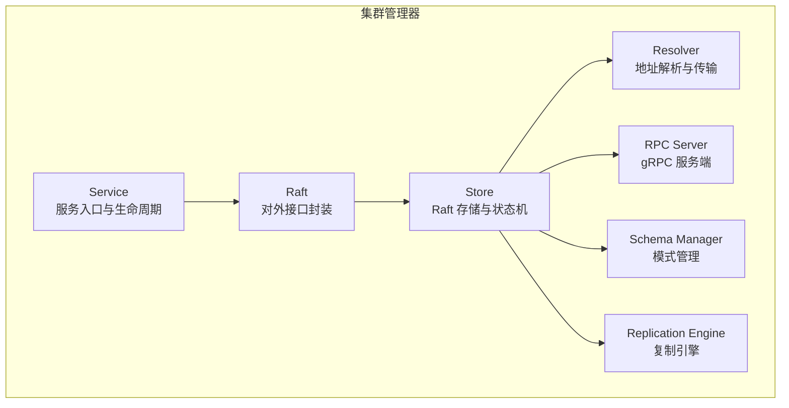
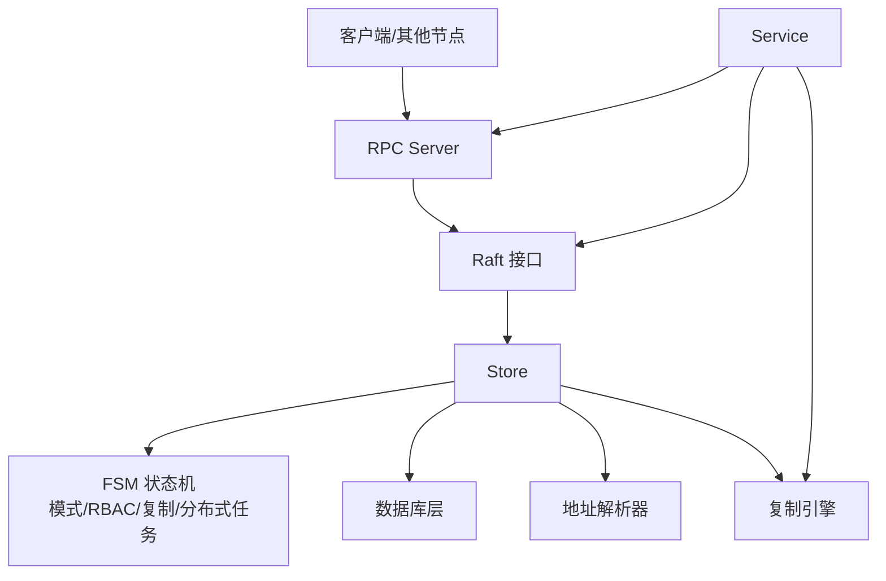
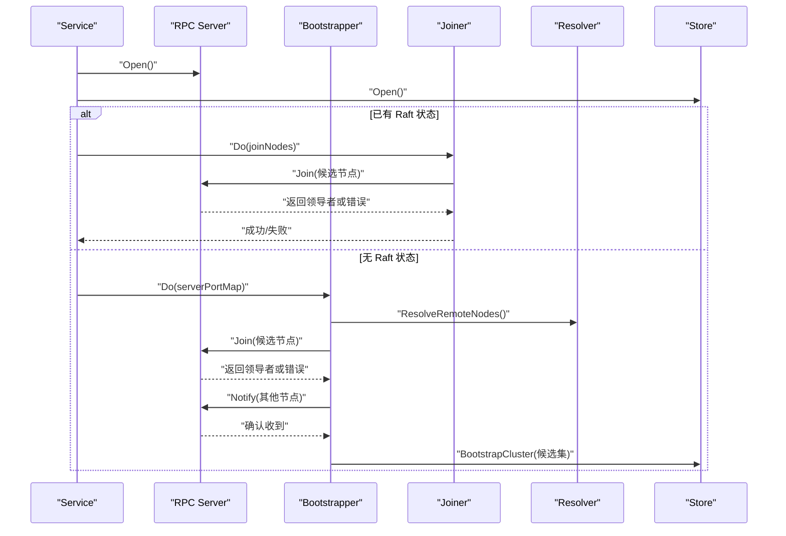
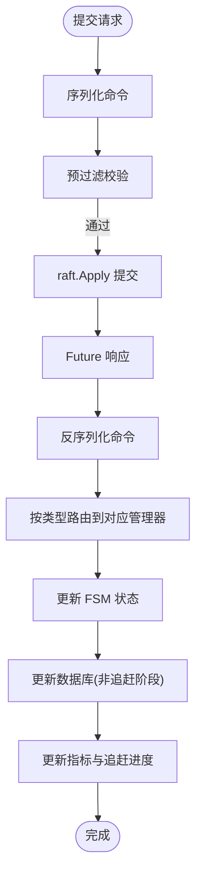
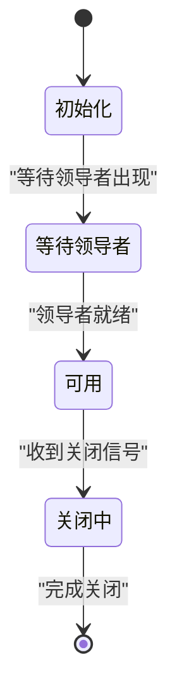
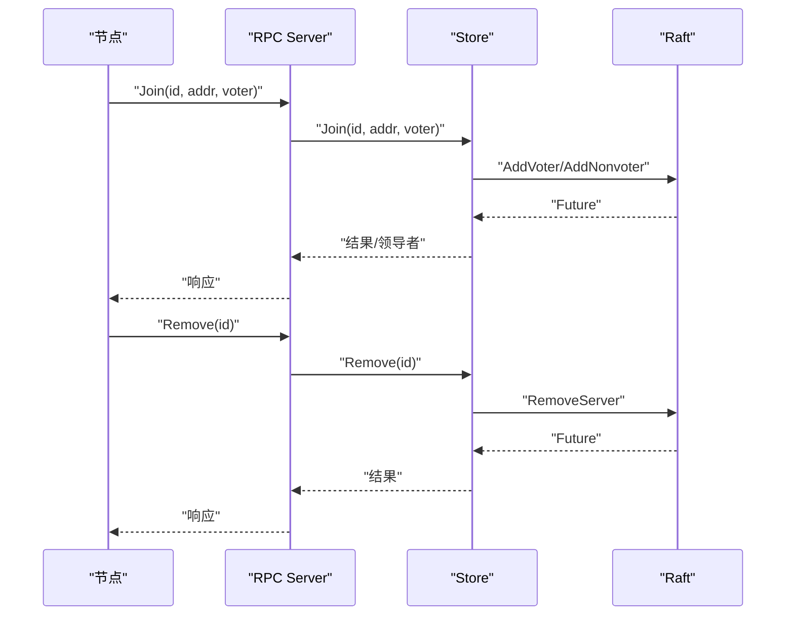
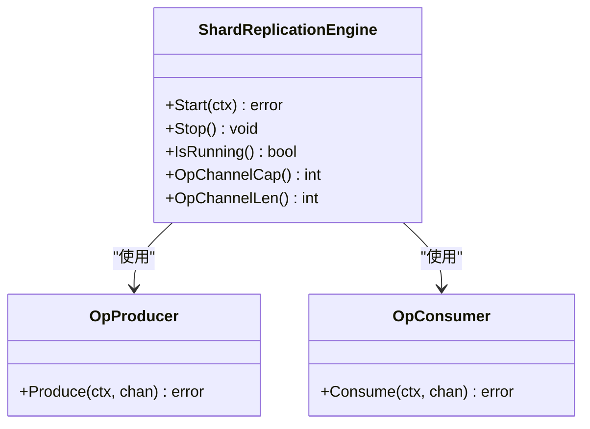
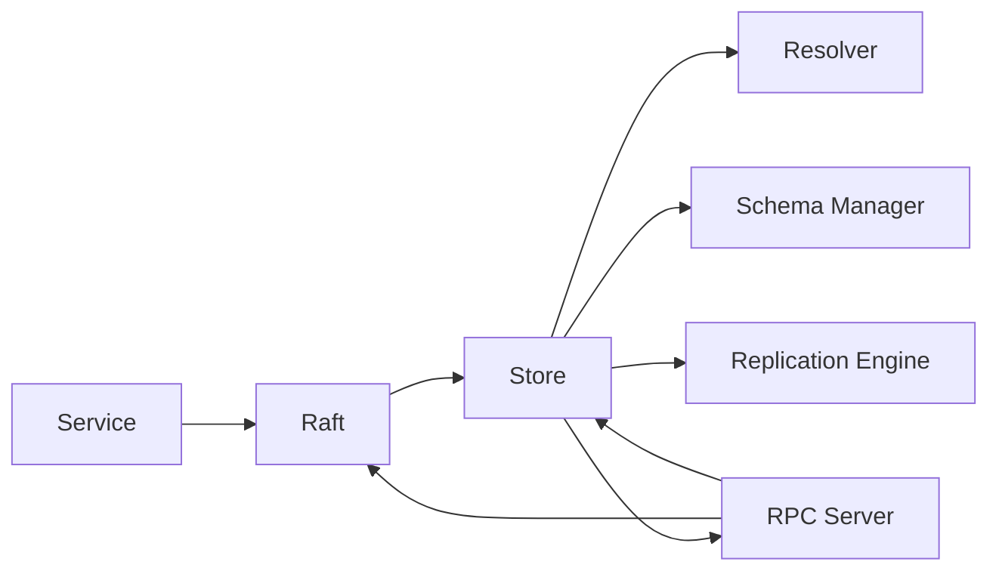

# 集群管理器

<cite>
**本文档引用的文件**
- [service.go](file://cluster/service.go)
- [store.go](file://cluster/store.go)
- [raft.go](file://cluster/raft.go)
- [bootstrap.go](file://cluster/bootstrap/bootstrap.go)
- [joiner.go](file://cluster/bootstrap/joiner.go)
- [raft.go](file://cluster/resolver/raft.go)
- [snapshot.go](file://cluster/fsm/snapshot.go)
- [shard_replication_engine.go](file://cluster/replication/shard_replication_engine.go)
- [server.go](file://cluster/rpc/server.go)
- [manager.go](file://cluster/schema/manager.go)
- [raft_cluster_endpoints.go](file://cluster/raft_cluster_endpoints.go)
- [store_apply.go](file://cluster/store_apply.go)
- [store_query.go](file://cluster/store_query.go)
- [store_cluster_rpc.go](file://cluster/store_cluster_rpc.go)
</cite>

## 目录
1. [简介](#简介)
2. [项目结构](#项目结构)
3. [核心组件](#核心组件)
4. [架构总览](#架构总览)
5. [详细组件分析](#详细组件分析)
6. [依赖关系分析](#依赖关系分析)
7. [性能考量](#性能考量)
8. [故障排除指南](#故障排除指南)
9. [结论](#结论)
10. [附录](#附录)

## 简介
本文件面向 Weaviate 集群管理器，系统性梳理其启动流程、节点发现与加入机制、Raft 协议实现（领导者选举、日志复制、状态机同步）、集群状态管理（健康检查与故障检测）、动态配置与一致性保障、成员变更处理流程，并提供架构图与 Raft 状态转换图。同时给出部署最佳实践与故障排除建议，帮助读者在生产环境中稳定运行 Weaviate 集群。

## 项目结构
Weaviate 集群管理器围绕 Raft 分布式共识协议构建，核心模块包括：
- 服务入口与生命周期：cluster/service.go
- Raft 存储与状态机：cluster/store.go、cluster/raft.go
- 节点发现与加入：cluster/bootstrap/*、cluster/resolver/*
- RPC 服务端与客户端：cluster/rpc/server.go
- 模式与复制管理：cluster/schema/manager.go、cluster/replication/*
- 应用与查询端点：cluster/store_apply.go、cluster/store_query.go、cluster/raft_cluster_endpoints.go
- 快照与恢复：cluster/fsm/snapshot.go

**图表来源**
- [service.go](file://cluster/service.go#L69-L117)
- [raft.go](file://cluster/raft.go#L44-L99)
- [store.go](file://cluster/store.go#L309-L339)
- [resolver/raft.go](file://cluster/resolver/raft.go#L46-L119)
- [rpc/server.go](file://cluster/rpc/server.go#L64-L82)
- [schema/manager.go](file://cluster/schema/manager.go#L52-L90)
- [replication/shard_replication_engine.go](file://cluster/replication/shard_replication_engine.go#L112-L133)

**章节来源**
- [service.go](file://cluster/service.go#L69-L117)
- [store.go](file://cluster/store.go#L309-L339)
- [resolver/raft.go](file://cluster/resolver/raft.go#L46-L119)
- [rpc/server.go](file://cluster/rpc/server.go#L64-L82)
- [schema/manager.go](file://cluster/schema/manager.go#L52-L90)
- [replication/shard_replication_engine.go](file://cluster/replication/shard_replication_engine.go#L112-L133)

## 核心组件
- Service：集群服务入口，负责初始化 Raft、RPC、复制引擎，协调启动与关闭流程，并在 FSM 追上后启动复制引擎。
- Raft：对 Store 的封装，提供统一的 Apply/Query/Join/Remove/Leader 等接口，屏蔽底层细节。
- Store：具体 Raft 实现，负责存储初始化、数据库加载、领导者发现迁移、配置变更应用、指标统计等。
- Resolver：基于 ClusterStateReader 解析节点地址，支持本地多端口与 Kubernetes 场景。
- RPC Server：提供 Join/Remove/Notify/Apply/Query 等 gRPC 接口，供其他节点调用或客户端访问。
- Schema Manager：负责模式（类、别名、租户、分片状态）的读写与应用，确保与数据库一致。
- Replication Engine：复制引擎，采用生产者-消费者模型，按缓冲通道背压并发执行复制任务。

**章节来源**
- [service.go](file://cluster/service.go#L48-L117)
- [raft.go](file://cluster/raft.go#L29-L99)
- [store.go](file://cluster/store.go#L194-L255)
- [resolver/raft.go](file://cluster/resolver/raft.go#L26-L85)
- [rpc/server.go](file://cluster/rpc/server.go#L49-L138)
- [schema/manager.go](file://cluster/schema/manager.go#L44-L90)
- [replication/shard_replication_engine.go](file://cluster/replication/shard_replication_engine.go#L48-L109)

## 架构总览
下图展示 Weaviate 集群管理器的整体交互：Service 作为入口协调 Raft、RPC、复制引擎；Store 承载 Raft 日志、快照与状态机；Schema Manager 与数据库保持一致；Resolver 提供地址解析；RPC Server 对外提供成员变更与读写接口。

**图表来源**
- [service.go](file://cluster/service.go#L149-L209)
- [raft.go](file://cluster/raft.go#L51-L99)
- [store.go](file://cluster/store.go#L363-L417)
- [rpc/server.go](file://cluster/rpc/server.go#L84-L138)
- [resolver/raft.go](file://cluster/resolver/raft.go#L87-L104)
- [replication/shard_replication_engine.go](file://cluster/replication/shard_replication_engine.go#L135-L218)

## 详细组件分析

### 启动流程与节点发现/加入
- Service.Open：启动 RPC 服务，打开 Raft Store，判断是否存在已有 Raft 状态；若存在则尝试加入 join 列表，否则通过 Bootstrapper 通知其他节点并引导集群形成初始配置。
- Bootstrapper：周期性解析远程节点，优先尝试 Join，若失败且当前节点为选民，则向其他节点 Notify 自身可加入；当收集到足够候选节点达到 BootstrapExpect 时，调用 BootstrapCluster 形成初始集群。
- Joiner：向候选节点发送 Join 请求，若返回非领导错误且携带领导者地址，则重定向到领导者再次尝试。
- Resolver：根据节点名称解析实际地址，支持本地多端口场景与 Kubernetes 动态 IP。

**图表来源**
- [service.go](file://cluster/service.go#L149-L209)
- [bootstrap/bootstrap.go](file://cluster/bootstrap/bootstrap.go#L64-L130)
- [bootstrap/joiner.go](file://cluster/bootstrap/joiner.go#L47-L114)
- [resolver/raft.go](file://cluster/resolver/raft.go#L156-L173)
- [store_cluster_rpc.go](file://cluster/store_cluster_rpc.go#L53-L102)

**章节来源**
- [service.go](file://cluster/service.go#L149-L209)
- [bootstrap/bootstrap.go](file://cluster/bootstrap/bootstrap.go#L64-L130)
- [bootstrap/joiner.go](file://cluster/bootstrap/joiner.go#L47-L114)
- [resolver/raft.go](file://cluster/resolver/raft.go#L156-L173)
- [store_cluster_rpc.go](file://cluster/store_cluster_rpc.go#L53-L102)

### Raft 协议实现（领导者选举、日志复制、状态机同步）
- 配置与超时：Store.raftConfig 支持心跳、选举、领导者租约、快照阈值、尾部日志保留等参数，可随运行时调整。
- 日志复制：客户端请求经 Raft.Apply 提交，返回 Future；Apply 阶段反序列化命令，按类型路由到 SchemaManager、RBAC、复制管理器或分布式任务管理器，最终落盘并更新指标。
- 状态机同步：Apply 完成后更新 lastAppliedIndex 与指标；在启动追赶阶段仅应用到内存模式而不更新数据库，追赶完成后一次性重载数据库，确保一致性。
- 领导者迁移：关闭前若为领导者且集群规模大于 1，会发起 LeadershipTransfer 将权限移交至其他节点，避免单点风险。

**图表来源**
- [store_apply.go](file://cluster/store_apply.go#L27-L61)
- [store_apply.go](file://cluster/store_apply.go#L77-L172)
- [store_apply.go](file://cluster/store_apply.go#L176-L424)

**章节来源**
- [store.go](file://cluster/store.go#L735-L785)
- [store_apply.go](file://cluster/store_apply.go#L27-L61)
- [store_apply.go](file://cluster/store_apply.go#L77-L172)
- [store_apply.go](file://cluster/store_apply.go#L176-L424)

### 集群状态管理（健康检查与故障检测）
- Ready 状态：Store.Ready 返回是否已打开、数据库已加载且存在领导者。
- 领导者检测：Store.Leader/LeaderWithID 提供当前领导者地址与 ID；onLeaderFound 在领导者出现后触发旧模式迁移。
- 成员列表与配置：Store.Stats 输出当前配置服务器列表、领导者信息、应用索引等；StorageCandidates 根据配置与成员列表计算可用存储节点。
- 故障转移：关闭时若为领导者，优先进行 LeadershipTransfer，再关闭传输与 Raft，最后关闭日志存储与数据库。

**图表来源**
- [store.go](file://cluster/store.go#L572-L574)
- [store.go](file://cluster/store.go#L626-L628)
- [store.go](file://cluster/store.go#L467-L518)
- [store.go](file://cluster/store.go#L520-L568)

**章节来源**
- [store.go](file://cluster/store.go#L572-L574)
- [store.go](file://cluster/store.go#L626-L628)
- [store.go](file://cluster/store.go#L467-L518)
- [store.go](file://cluster/store.go#L520-L568)

### 集群配置的动态更新与一致性保证
- 动态配置：通过 Store.raftConfig 支持在运行时调整心跳、选举、领导者租约、快照间隔与阈值等；StoreConfiguration 记录配置变更日志索引以维持指标正确性。
- 一致性等待：SchemaReader 的等待函数在查询前等待指定版本被应用，确保读取到最新一致状态。
- 元数据优先：MetadataOnlyVoters 模式下仅存储元数据，不加载本地数据库，降低资源占用。

**章节来源**
- [store.go](file://cluster/store.go#L735-L785)
- [store.go](file://cluster/store.go#L598-L623)
- [store.go](file://cluster/store.go#L787-L800)

### 成员变更处理流程
- Join：仅领导者可执行，支持选民与非选民两种角色；非选民可安全移除。
- Remove：领导者移除指定节点；非选民在关闭前自动从集群移除。
- Notify：在未形成领导者且满足 BootstrapExpect 条件时，接收候选节点通知并形成初始集群配置。

**图表来源**
- [raft_cluster_endpoints.go](file://cluster/raft_cluster_endpoints.go#L66-L96)
- [store_cluster_rpc.go](file://cluster/store_cluster_rpc.go#L26-L51)
- [rpc/server.go](file://cluster/rpc/server.go#L84-L103)

**章节来源**
- [raft_cluster_endpoints.go](file://cluster/raft_cluster_endpoints.go#L66-L96)
- [store_cluster_rpc.go](file://cluster/store_cluster_rpc.go#L26-L51)
- [rpc/server.go](file://cluster/rpc/server.go#L84-L103)

### 复制引擎与复制操作
- 生产者-消费者模型：FSM 生成复制操作，复制引擎以有限缓冲通道传递给消费者；消费者池并发执行复制任务。
- 并发与背压：通过 opBufferSize 控制队列长度，防止过载；maxWorkers 控制最大并发数。
- 生命周期：Start 启动生产者与消费者协程；Stop 触发优雅关闭；IsRunning 查询运行状态。

**图表来源**
- [replication/shard_replication_engine.go](file://cluster/replication/shard_replication_engine.go#L48-L109)
- [replication/shard_replication_engine.go](file://cluster/replication/shard_replication_engine.go#L135-L218)

**章节来源**
- [replication/shard_replication_engine.go](file://cluster/replication/shard_replication_engine.go#L112-L271)

### 快照与恢复
- 快照内容：包含模式、别名、RBAC、分布式任务、复制操作、动态用户等，用于恢复 FSM 至历史状态。
- 恢复流程：启动时根据快照重建状态机，随后在追赶完成后重载数据库，确保一致性。

**章节来源**
- [fsm/snapshot.go](file://cluster/fsm/snapshot.go#L14-L44)
- [store.go](file://cluster/store.go#L787-L800)
- [store_apply.go](file://cluster/store_apply.go#L114-L123)

## 依赖关系分析
- Service 依赖 Raft、RPC 客户端/服务端、复制引擎与 Snapshotter。
- Raft 封装 Store，暴露统一接口。
- Store 依赖 SchemaManager、RBAC、复制管理器、分布式任务管理器、Resolver、RPC Server。
- Resolver 依赖 ClusterStateReader 提供节点地址解析。
- RPC Server 提供 Join/Remove/Notify/Apply/Query 接口。

**图表来源**
- [service.go](file://cluster/service.go#L69-L117)
- [raft.go](file://cluster/raft.go#L44-L99)
- [store.go](file://cluster/store.go#L309-L339)
- [rpc/server.go](file://cluster/rpc/server.go#L64-L82)

**章节来源**
- [service.go](file://cluster/service.go#L69-L117)
- [raft.go](file://cluster/raft.go#L44-L99)
- [store.go](file://cluster/store.go#L309-L339)
- [rpc/server.go](file://cluster/rpc/server.go#L64-L82)

## 性能考量
- 背压与并发：复制引擎通过缓冲通道与最大工作线程限制控制并发，避免资源耗尽。
- 快照与日志：合理设置快照阈值与间隔，减少日志重放开销；保留尾部日志便于跟随者快速追赶。
- 传输与解析：Resolver 在本地多端口与动态 IP 场景下仍能稳定解析地址，降低连接失败率。
- 指标监控：Store 维护应用时长、失败计数、应用索引等指标，便于定位性能瓶颈。

[本节为通用指导，无需特定文件引用]

## 故障排除指南
- 无法加入集群：检查 join 列表与地址解析，确认目标节点可达；若返回非领导错误，跟随返回的领导者地址重试。
- 无领导者：等待领导者选举完成；可通过 Store.Stats 查看当前配置与领导者信息。
- 数据库未加载：等待数据库加载完成或检查 MetadataOnlyVoters 配置；确认追赶完成后重载数据库。
- 成员变更失败：仅领导者可执行 Join/Remove；非选民可在关闭前自动移除。
- 复制异常：检查复制引擎运行状态与通道长度；关注复制操作超时与重试策略。

**章节来源**
- [bootstrap/joiner.go](file://cluster/bootstrap/joiner.go#L47-L114)
- [store.go](file://cluster/store.go#L672-L708)
- [store_cluster_rpc.go](file://cluster/store_cluster_rpc.go#L26-L51)
- [replication/shard_replication_engine.go](file://cluster/replication/shard_replication_engine.go#L220-L238)

## 结论
Weaviate 集群管理器以 Raft 为核心，结合地址解析、RPC 服务、模式与复制管理，实现了高可用、可扩展的分布式架构。通过严格的启动流程、成员变更与状态机同步机制，确保了数据一致性与服务连续性。生产部署中建议合理配置超时与快照参数、启用健康检查与指标监控，并遵循成员变更与故障转移的最佳实践。

[本节为总结，无需特定文件引用]

## 附录
- 部署最佳实践
  - 合理设置心跳/选举/领导者租约超时，避免频繁选举。
  - 使用快照阈值与间隔降低日志重放时间。
  - 在 Kubernetes 中启用地址解析与成员列表，确保节点重启后地址变化不影响集群。
  - 非选民节点用于只读或过渡场景，避免影响选票。
  - 监控关键指标（应用时长、失败计数、应用索引），及时发现异常。
- 常见问题
  - 启动后长时间无领导者：检查网络连通性与地址解析配置。
  - 加入失败：确认目标节点为领导者或返回的领导者地址有效。
  - 数据不一致：等待追赶完成后再进行写入，或检查 MetadataOnlyVoters 配置。

[本节为通用指导，无需特定文件引用]