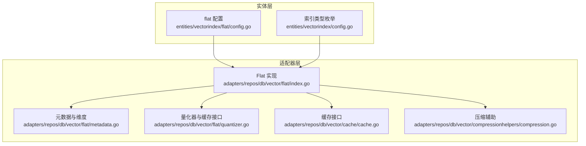
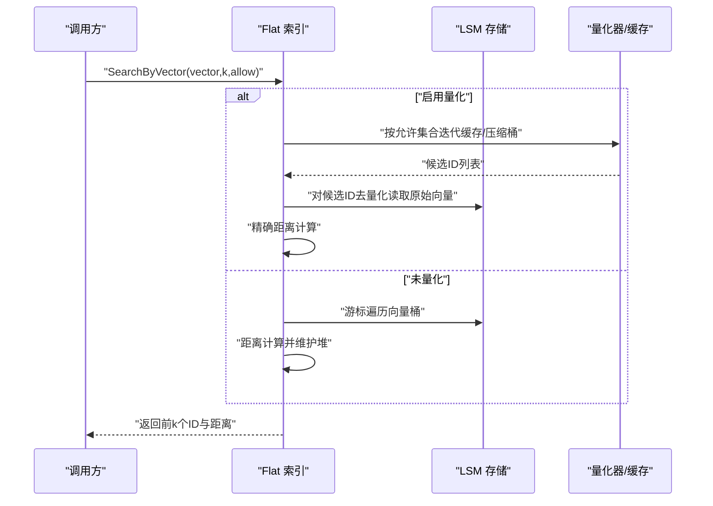
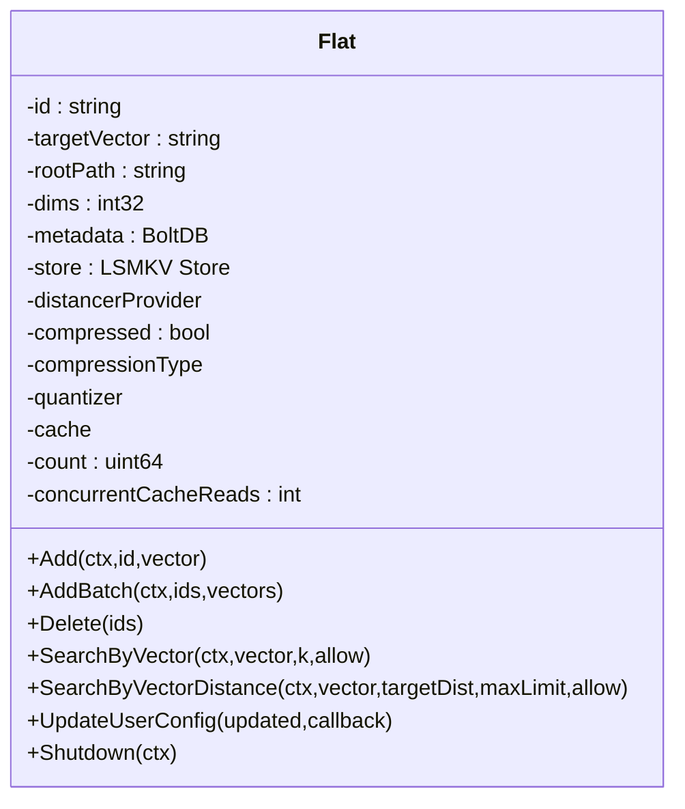
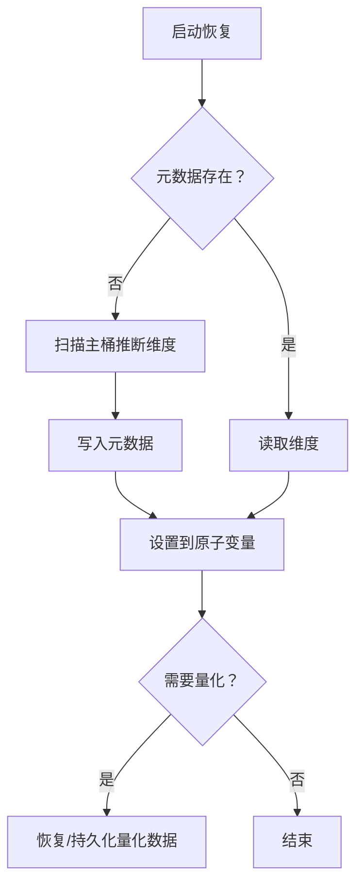
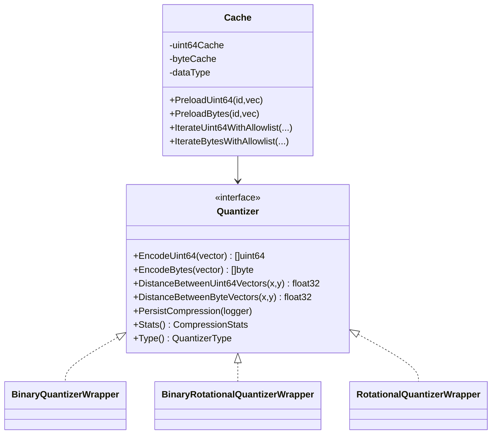
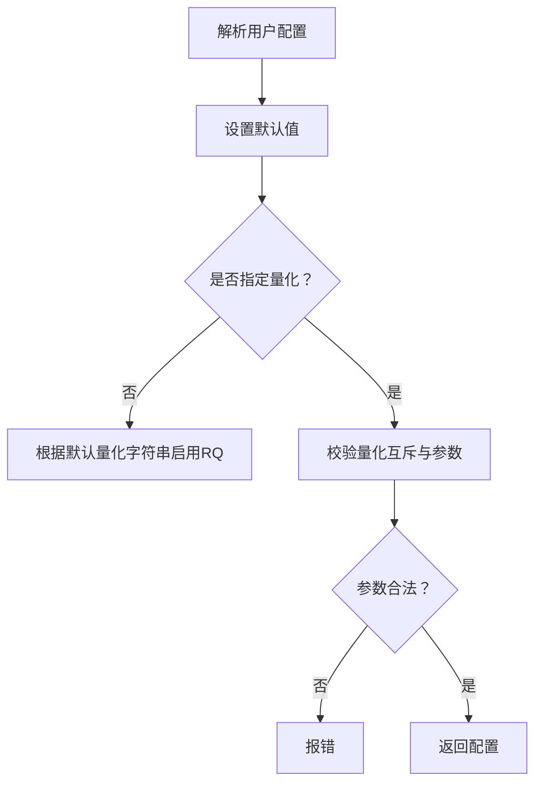
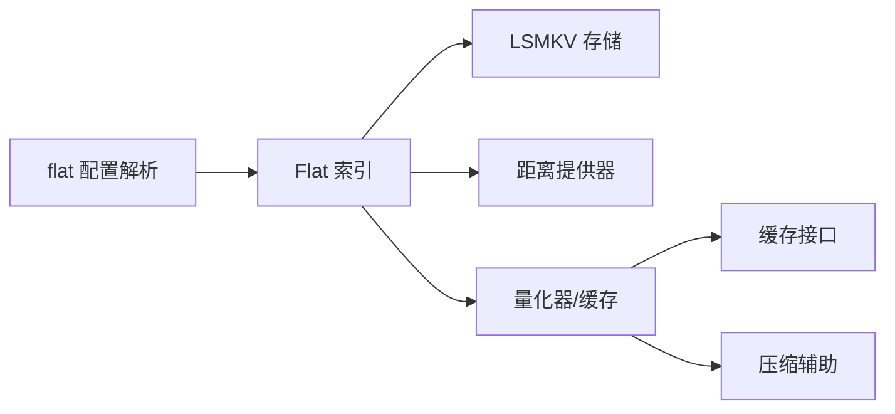

# Flat 索引

<cite>
**本文引用的文件**
- [index.go](file://adapters/repos/db/vector/flat/index.go)
- [metadata.go](file://adapters/repos/db/vector/flat/metadata.go)
- [quantizer.go](file://adapters/repos/db/vector/flat/quantizer.go)
- [config.go](file://entities/vectorindex/flat/config.go)
- [config.go](file://entities/vectorindex/config.go)
- [cache.go](file://adapters/repos/db/vector/cache/cache.go)
- [compression.go](file://adapters/repos/db/vector/compressionhelpers/compression.go)
- [index_test.go](file://adapters/repos/db/vector/flat/index_test.go)
</cite>

## 目录
1. [简介](#简介)
2. [项目结构](#项目结构)
3. [核心组件](#核心组件)
4. [架构总览](#架构总览)
5. [详细组件分析](#详细组件分析)
6. [依赖关系分析](#依赖关系分析)
7. [性能考量](#性能考量)
8. [故障排查指南](#故障排查指南)
9. [结论](#结论)
10. [附录：使用示例与配置建议](#附录使用示例与配置建议)

## 简介
本文件系统性介绍 Weaviate 中 Flat 向量索引的设计与实现。Flat 索引以“直接计算向量间距离”的方式执行检索，不维护额外的数据结构，因此在小规模数据集、高维向量或对精度要求极高的场景中具有天然优势。同时，Flat 索引支持可选的量化压缩与缓存机制，在保证精度的同时降低存储与查询开销。

## 项目结构
Flat 索引位于向量索引子系统中，核心实现集中在适配器层，配置定义在实体层，量化与缓存能力通过通用工具模块复用。

图表来源
- [config.go](file://entities/vectorindex/flat/config.go#L1-L299)
- [config.go](file://entities/vectorindex/config.go#L24-L51)
- [index.go](file://adapters/repos/db/vector/flat/index.go#L49-L72)
- [metadata.go](file://adapters/repos/db/vector/flat/metadata.go#L28-L46)
- [quantizer.go](file://adapters/repos/db/vector/flat/quantizer.go#L27-L70)
- [cache.go](file://adapters/repos/db/vector/cache/cache.go#L21-L49)
- [compression.go](file://adapters/repos/db/vector/compressionhelpers/compression.go#L48-L87)

章节来源
- [config.go](file://entities/vectorindex/flat/config.go#L1-L299)
- [config.go](file://entities/vectorindex/config.go#L24-L51)
- [index.go](file://adapters/repos/db/vector/flat/index.go#L49-L72)
- [metadata.go](file://adapters/repos/db/vector/flat/metadata.go#L28-L46)
- [quantizer.go](file://adapters/repos/db/vector/flat/quantizer.go#L27-L70)
- [cache.go](file://adapters/repos/db/vector/cache/cache.go#L21-L49)
- [compression.go](file://adapters/repos/db/vector/compressionhelpers/compression.go#L48-L87)

## 核心组件
- Flat 索引主体：负责插入、删除、按向量检索、按阈值检索、配置更新、生命周期管理等。
- 元数据与维度：持久化存储维度信息，支持启动时恢复与兼容性处理。
- 量化器与缓存：支持 BQ、RQ（1/8比特）量化与缓存，加速检索并降低内存占用。
- 配置解析：统一解析 flat 索引配置，校验量化参数与互斥关系。

章节来源
- [index.go](file://adapters/repos/db/vector/flat/index.go#L76-L125)
- [metadata.go](file://adapters/repos/db/vector/flat/metadata.go#L118-L168)
- [quantizer.go](file://adapters/repos/db/vector/flat/quantizer.go#L72-L99)
- [config.go](file://entities/vectorindex/flat/config.go#L86-L130)

## 架构总览
Flat 索引采用“无索引结构 + 可选量化/缓存”的设计。查询路径根据是否启用量化分为两类：未量化时直接遍历磁盘桶；量化时优先利用缓存或压缩桶，再对候选集做去量化精确距离计算。

图表来源
- [index.go](file://adapters/repos/db/vector/flat/index.go#L423-L532)
- [index.go](file://adapters/repos/db/vector/flat/index.go#L576-L619)
- [index.go](file://adapters/repos/db/vector/flat/index.go#L623-L663)
- [quantizer.go](file://adapters/repos/db/vector/flat/quantizer.go#L205-L392)

## 详细组件分析

### 组件一：Flat 索引主体
- 初始化与桶创建：根据是否启用量化创建对应的压缩桶，并设置强制压缩、预读策略等选项。
- 插入流程：标准化向量，写入主桶；若首次插入则初始化维度并持久化；并发安全地维护计数。
- 查询流程：根据是否量化选择不同路径；未量化时直接遍历游标；量化时先在缓存/压缩桶中筛选，再对候选去量化做精确距离计算。
- 删除流程：从主桶与压缩桶中删除对应键。
- 配置热更新：原子更新重打分阈值，不影响查询路径的并发读取。

图表来源
- [index.go](file://adapters/repos/db/vector/flat/index.go#L49-L72)
- [index.go](file://adapters/repos/db/vector/flat/index.go#L234-L282)
- [index.go](file://adapters/repos/db/vector/flat/index.go#L362-L390)
- [index.go](file://adapters/repos/db/vector/flat/index.go#L423-L532)
- [index.go](file://adapters/repos/db/vector/flat/index.go#L392-L411)

章节来源
- [index.go](file://adapters/repos/db/vector/flat/index.go#L234-L282)
- [index.go](file://adapters/repos/db/vector/flat/index.go#L362-L390)
- [index.go](file://adapters/repos/db/vector/flat/index.go#L423-L532)
- [index.go](file://adapters/repos/db/vector/flat/index.go#L392-L411)
- [index.go](file://adapters/repos/db/vector/flat/index.go#L763-L776)

### 组件二：元数据与维度
- 元数据文件：使用嵌入式数据库持久化维度与量化数据容器。
- 维度初始化：优先从元数据读取，否则扫描主桶首个向量推断维度，并回写元数据。
- RQ 数据持久化/恢复：序列化旋转量化参数，支持重启后重建量化器。

图表来源
- [metadata.go](file://adapters/repos/db/vector/flat/metadata.go#L118-L168)
- [metadata.go](file://adapters/repos/db/vector/flat/metadata.go#L195-L217)
- [metadata.go](file://adapters/repos/db/vector/flat/metadata.go#L244-L300)
- [metadata.go](file://adapters/repos/db/vector/flat/metadata.go#L382-L472)

章节来源
- [metadata.go](file://adapters/repos/db/vector/flat/metadata.go#L118-L168)
- [metadata.go](file://adapters/repos/db/vector/flat/metadata.go#L195-L217)
- [metadata.go](file://adapters/repos/db/vector/flat/metadata.go#L244-L300)
- [metadata.go](file://adapters/repos/db/vector/flat/metadata.go#L382-L472)

### 组件三：量化器与缓存
- 量化类型：BQ（二进制量化）、RQ-1（二进制旋转量化）、RQ-8（8比特旋转量化）。
- 缓存类型：针对不同量化数据类型提供独立缓存接口，支持分片锁缓存、批量预取、按允许集合迭代。
- 距离计算：量化路径下先用量化器快速估算，再对候选集去量化做精确距离计算。

图表来源
- [quantizer.go](file://adapters/repos/db/vector/flat/quantizer.go#L56-L70)
- [quantizer.go](file://adapters/repos/db/vector/flat/quantizer.go#L205-L392)
- [cache.go](file://adapters/repos/db/vector/cache/cache.go#L21-L49)

章节来源
- [quantizer.go](file://adapters/repos/db/vector/flat/quantizer.go#L56-L70)
- [quantizer.go](file://adapters/repos/db/vector/flat/quantizer.go#L205-L392)
- [cache.go](file://adapters/repos/db/vector/cache/cache.go#L21-L49)

### 组件四：配置解析与默认量化
- 支持字段：距离度量、向量缓存上限、量化开关与缓存、RQ 比特位、跳过默认量化、跟踪默认量化。
- 参数校验：禁止同时启用多个量化；RQ 比特必须为 1 或 8；启用缓存需同时启用对应量化。
- 默认量化：当未显式指定量化时，根据传入的默认量化字符串自动启用 RQ-1 或 RQ-8。

图表来源
- [config.go](file://entities/vectorindex/flat/config.go#L86-L130)
- [config.go](file://entities/vectorindex/flat/config.go#L156-L231)
- [config.go](file://entities/vectorindex/flat/config.go#L269-L298)

章节来源
- [config.go](file://entities/vectorindex/flat/config.go#L86-L130)
- [config.go](file://entities/vectorindex/flat/config.go#L156-L231)
- [config.go](file://entities/vectorindex/flat/config.go#L269-L298)

## 依赖关系分析
- 索引类型注册：通过统一入口解析并校验索引类型，flat 类型由 flat 包解析。
- 存储层：LSMKV 替换策略、强制压缩、布隆过滤器、预读策略等影响查询与写入性能。
- 距离计算：根据距离提供器类型决定是否归一化向量（如余弦点积）。
- 并发与池化：查询路径使用优先队列池、切片池、并发 goroutine 控制，减少分配与提升吞吐。

图表来源
- [config.go](file://entities/vectorindex/config.go#L32-L51)
- [index.go](file://adapters/repos/db/vector/flat/index.go#L76-L125)
- [index.go](file://adapters/repos/db/vector/flat/index.go#L234-L282)
- [index.go](file://adapters/repos/db/vector/flat/index.go#L497-L524)
- [compression.go](file://adapters/repos/db/vector/compressionhelpers/compression.go#L48-L87)

章节来源
- [config.go](file://entities/vectorindex/config.go#L32-L51)
- [index.go](file://adapters/repos/db/vector/flat/index.go#L76-L125)
- [index.go](file://adapters/repos/db/vector/flat/index.go#L234-L282)
- [index.go](file://adapters/repos/db/vector/flat/index.go#L497-L524)
- [compression.go](file://adapters/repos/db/vector/compressionhelpers/compression.go#L48-L87)

## 性能考量
- 时间复杂度
  - 未量化：O(N) 遍历所有向量，N 为已索引数量。
  - 量化：先在缓存/压缩桶中筛选 O(K)，随后对 K 个候选去量化计算距离，整体约 O(K) 去量化 + O(N) 量化桶遍历（取决于策略）。
- 内存占用
  - 未量化：每条向量以浮点数组形式存储，内存与 N×D×4 字节线性相关。
  - 量化：压缩桶存储量化向量，显著降低内存；缓存按页加载，受最大对象数限制。
- I/O 特征
  - 未量化：顺序扫描主桶，适合 SSD/机械盘；可通过强制压缩与预读策略优化。
  - 量化：压缩桶与缓存减少随机访问，提高命中率时可显著降低延迟。
- 并发与伸缩
  - 查询阶段使用并发 goroutine 对候选集去量化，CPU 利用更充分；缓存预取与分片锁提升吞吐。

[本节为通用性能讨论，无需特定文件引用]

## 故障排查指南
- 维度不一致
  - 现象：插入新向量时报维度错误。
  - 排查：检查已有向量维度与当前向量维度是否一致；首次插入会记录维度并持久化。
- 量化配置冲突
  - 现象：启用缓存但未启用量化，或同时启用多个量化。
  - 排查：确保仅启用一种量化且开启对应缓存；RQ 比特必须为 1 或 8。
- 查询结果异常
  - 现象：召回率低或延迟高。
  - 排查：确认是否启用量化与缓存；适当增大缓存上限；检查允许集合与重打分阈值。

章节来源
- [index.go](file://adapters/repos/db/vector/flat/index.go#L823-L842)
- [config.go](file://entities/vectorindex/flat/config.go#L194-L231)
- [index.go](file://adapters/repos/db/vector/flat/index.go#L413-L421)

## 结论
Flat 索引以“简单即高效”的理念服务于小规模、高维、对精度敏感的场景。通过可选的量化与缓存机制，可在保证检索精度的同时显著降低内存与 I/O 开销。对于大规模高吞吐场景，建议结合 HNSW 等近似最近邻索引；对于小规模或需要精确检索的场景，Flat 是稳定可靠的选择。

[本节为总结性内容，无需特定文件引用]

## 附录：使用示例与配置建议

### 使用示例（概念性步骤）
- 创建索引
  - 选择索引类型为 flat。
  - 指定距离度量（如余弦、L2）。
  - 可选启用 RQ-1 或 RQ-8 量化与缓存。
- 插入向量
  - 批量插入时注意维度一致性校验。
- 查询
  - 按向量检索返回前 k 个最相似项。
  - 按阈值检索返回小于等于目标距离的结果集。

[本节为操作指引，不直接分析具体源码文件]

### 配置参数说明与选择策略
- distance
  - 说明：距离度量名称。
  - 选择：余弦类任务建议 cosine-dot；局部敏感场景可选 L2。
- vectorCacheMaxObjects
  - 说明：缓存最大对象数。
  - 选择：根据可用内存与向量数量设定，量化场景可适度放大。
- RQ.enabled / RQ.bits / RQ.cache / RQ.rescoreLimit
  - 说明：RQ 启用、比特位（1/8）、缓存、重打分阈值。
  - 选择：RQ-8 更接近精度但存储更大；RQ-1 更节省空间；rescoreLimit 在高召回需求时可适当提高。
- 跳过/跟踪默认量化
  - 说明：skipDefaultQuantization 与 trackDefaultQuantization。
  - 选择：仅在明确控制默认量化时启用。

章节来源
- [config.go](file://entities/vectorindex/flat/config.go#L44-L84)
- [config.go](file://entities/vectorindex/flat/config.go#L101-L129)
- [config.go](file://entities/vectorindex/flat/config.go#L269-L298)

### 与其他索引类型的对比与选择建议
- Flat vs HNSW
  - Flat：O(N) 检索，精度最高，适合小规模或对精度要求极高；HNSW：近似检索，吞吐更高，适合大规模。
  - 选择：数据量小于阈值且需要精确检索时选 Flat；大规模高吞吐场景选 HNSW。
- Flat vs 动态索引
  - 动态索引在不同数据规模与查询模式下自动切换策略；Flat 则保持固定策略，便于预测与调优。
  - 选择：对行为可控性要求高时选 Flat；希望系统自动优化时选动态索引。

章节来源
- [config.go](file://entities/vectorindex/config.go#L24-L51)

### 测试与基准参考
- 单测覆盖
  - 并发读取、验证维度一致性、缓存预填充、量化路径正确性等。
- 基准思路
  - 随机生成向量与查询，统计召回率与平均延迟；对比启用/禁用量化与缓存的差异。

章节来源
- [index_test.go](file://adapters/repos/db/vector/flat/index_test.go#L194-L217)
- [index_test.go](file://adapters/repos/db/vector/flat/index_test.go#L366-L389)
- [index_test.go](file://adapters/repos/db/vector/flat/index_test.go#L502-L516)