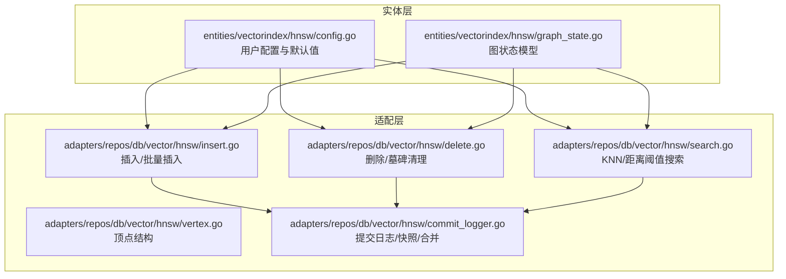
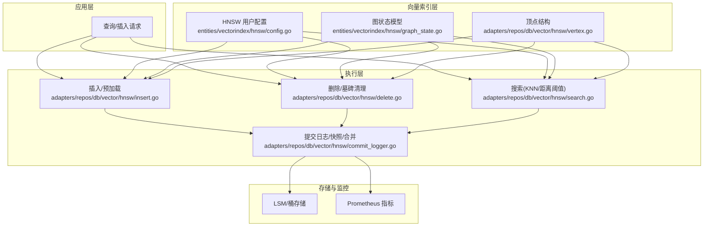
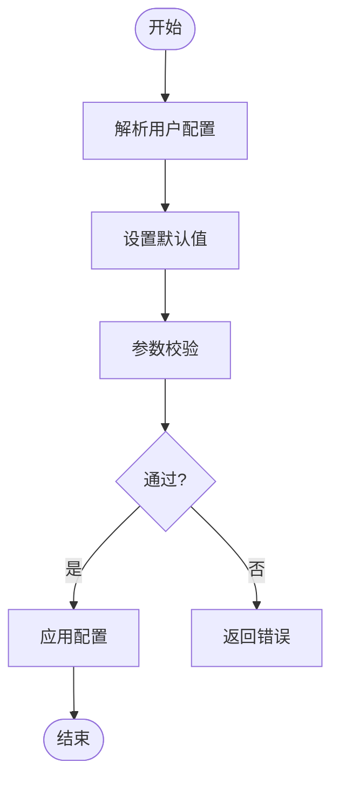
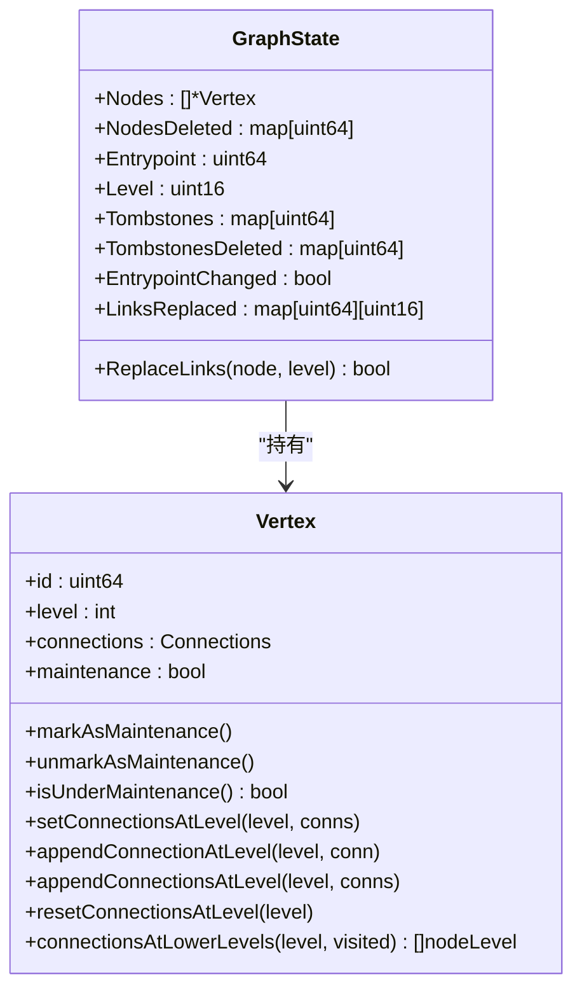
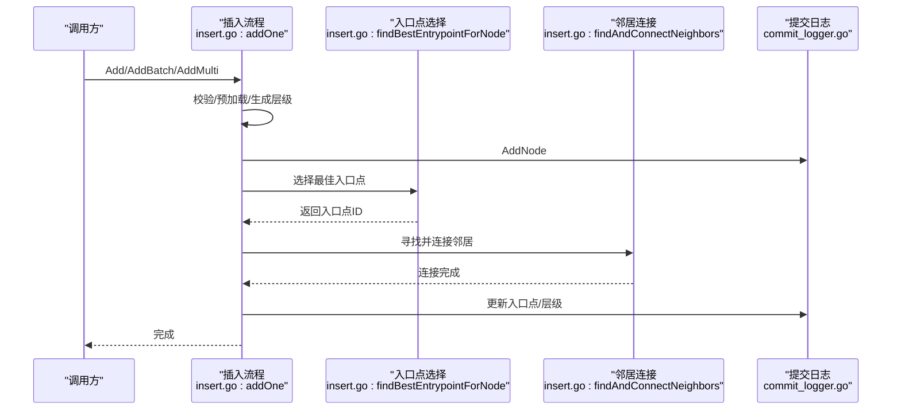
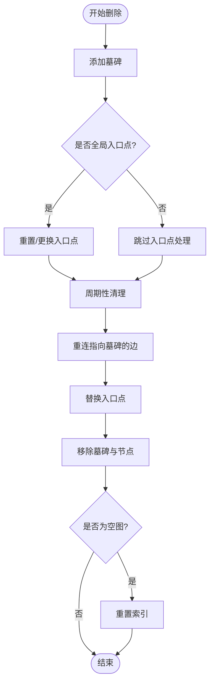
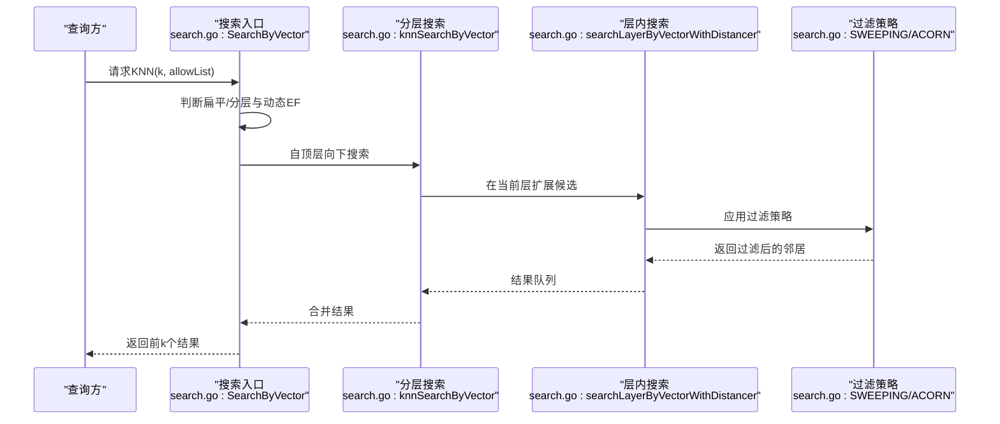
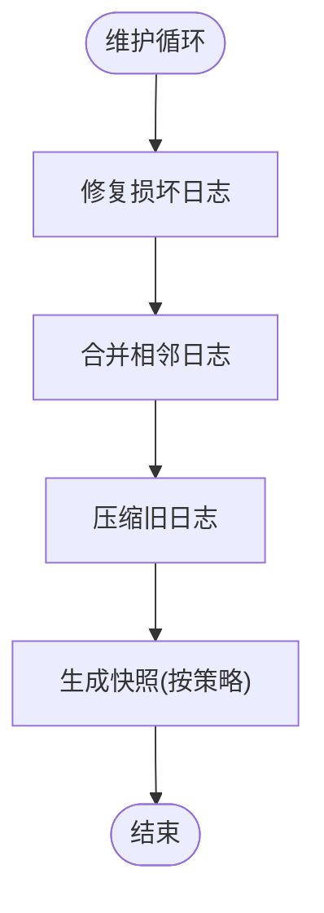
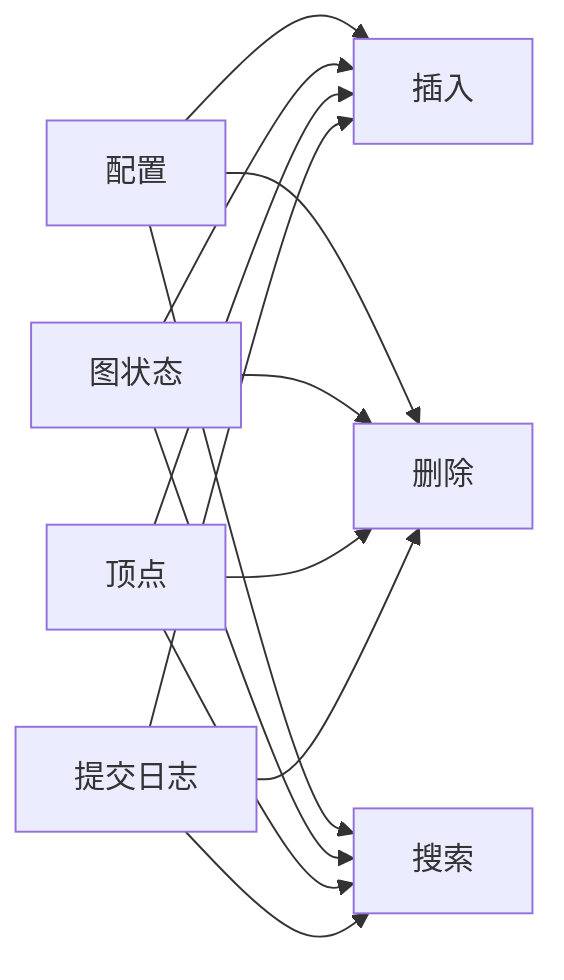

# HNSW 索引

<cite>
**本文引用的文件**
- [entities/vectorindex/hnsw/config.go](file://entities/vectorindex/hnsw/config.go)
- [entities/vectorindex/hnsw/graph_state.go](file://entities/vectorindex/hnsw/graph_state.go)
- [adapters/repos/db/vector/hnsw/search.go](file://adapters/repos/db/vector/hnsw/search.go)
- [adapters/repos/db/vector/hnsw/insert.go](file://adapters/repos/db/vector/hnsw/insert.go)
- [adapters/repos/db/vector/hnsw/delete.go](file://adapters/repos/db/vector/hnsw/delete.go)
- [adapters/repos/db/vector/hnsw/vertex.go](file://adapters/repos/db/vector/hnsw/vertex.go)
- [adapters/repos/db/vector/hnsw/commit_logger.go](file://adapters/repos/db/vector/hnsw/commit_logger.go)
- [adapters/repos/db/vector/hnsw/benchmark_test.go](file://adapters/repos/db/vector/hnsw/benchmark_test.go)
</cite>

## 目录
1. [简介](#简介)
2. [项目结构](#项目结构)
3. [核心组件](#核心组件)
4. [架构总览](#架构总览)
5. [详细组件分析](#详细组件分析)
6. [依赖关系分析](#依赖关系分析)
7. [性能考量](#性能考量)
8. [故障排查指南](#故障排查指南)
9. [结论](#结论)
10. [附录](#附录)

## 简介
本文件系统性阐述 Weaviate 中 HNSW（Hierarchical Navigable Small World）向量索引的实现与使用方法。内容覆盖算法原理、图结构与状态管理、节点增删改查流程、多层图设计与性能优势、关键参数配置与调优策略，并提供索引创建、查询与维护的实践示例，以及基准测试与最佳实践建议。目标读者为搜索引擎专家与性能调优工程师。

## 项目结构
Weaviate 将 HNSW 索引置于向量索引子模块中，核心实现位于数据库适配层的 vector/hnsw 目录，配置与图状态定义位于 entities/vectorindex/hnsw 目录。整体采用分层组织：实体层负责配置与图状态模型；适配层负责具体实现（插入、删除、搜索、提交日志等）。

图表来源
- [entities/vectorindex/hnsw/config.go](file://entities/vectorindex/hnsw/config.go#L47-L136)
- [entities/vectorindex/hnsw/graph_state.go](file://entities/vectorindex/hnsw/graph_state.go#L14-L48)
- [adapters/repos/db/vector/hnsw/insert.go](file://adapters/repos/db/vector/hnsw/insert.go#L39-L98)
- [adapters/repos/db/vector/hnsw/delete.go](file://adapters/repos/db/vector/hnsw/delete.go#L42-L103)
- [adapters/repos/db/vector/hnsw/search.go](file://adapters/repos/db/vector/hnsw/search.go#L78-L92)
- [adapters/repos/db/vector/hnsw/vertex.go](file://adapters/repos/db/vector/hnsw/vertex.go#L20-L26)
- [adapters/repos/db/vector/hnsw/commit_logger.go](file://adapters/repos/db/vector/hnsw/commit_logger.go#L36-L85)

章节来源
- [entities/vectorindex/hnsw/config.go](file://entities/vectorindex/hnsw/config.go#L47-L136)
- [entities/vectorindex/hnsw/graph_state.go](file://entities/vectorindex/hnsw/graph_state.go#L14-L48)
- [adapters/repos/db/vector/hnsw/insert.go](file://adapters/repos/db/vector/hnsw/insert.go#L39-L98)
- [adapters/repos/db/vector/hnsw/delete.go](file://adapters/repos/db/vector/hnsw/delete.go#L42-L103)
- [adapters/repos/db/vector/hnsw/search.go](file://adapters/repos/db/vector/hnsw/search.go#L78-L92)
- [adapters/repos/db/vector/hnsw/vertex.go](file://adapters/repos/db/vector/hnsw/vertex.go#L20-L26)
- [adapters/repos/db/vector/hnsw/commit_logger.go](file://adapters/repos/db/vector/hnsw/commit_logger.go#L36-L85)

## 核心组件
- 用户配置与默认值：定义 HNSW 关键参数（如最大连接数、构造时扩展因子、查询时扩展因子、动态 EF 范围、缓存上限、扁平搜索阈值、距离度量、压缩配置、过滤策略、多向量配置等），并提供校验与默认设置。
- 图状态模型：描述图的节点数组、已删除节点标记、入口点、最大层级、墓碑集合及其清理状态、以及针对 .condensed 文件的链接替换标志位，确保持久化与恢复的一致性。
- 插入流程：支持单向量与多向量批量插入，生成随机层级、选择最佳入口点、寻找并连接邻居、更新入口点与最大层级、写入提交日志。
- 删除与墓碑清理：为被删除节点附加墓碑，必要时重置或更换全局入口点；周期性扫描并重连指向墓碑节点的边，替换入口点，移除墓碑与节点，空图时重置。
- 搜索流程：根据允许列表与扁平搜索阈值选择扁平搜索或分层 KNN；支持动态 EF 计算；在不同层级按候选队列与结果队列迭代扩展；支持多向量与 MuVerA 编码场景。
- 提交日志与快照：维护提交日志文件、定期合并与压缩、周期性快照生成，保证索引状态可恢复与可备份。

章节来源
- [entities/vectorindex/hnsw/config.go](file://entities/vectorindex/hnsw/config.go#L47-L136)
- [entities/vectorindex/hnsw/graph_state.go](file://entities/vectorindex/hnsw/graph_state.go#L14-L48)
- [adapters/repos/db/vector/hnsw/insert.go](file://adapters/repos/db/vector/hnsw/insert.go#L398-L511)
- [adapters/repos/db/vector/hnsw/delete.go](file://adapters/repos/db/vector/hnsw/delete.go#L42-L103)
- [adapters/repos/db/vector/hnsw/search.go](file://adapters/repos/db/vector/hnsw/search.go#L78-L92)
- [adapters/repos/db/vector/hnsw/commit_logger.go](file://adapters/repos/db/vector/hnsw/commit_logger.go#L36-L85)

## 架构总览
下图展示 HNSW 在 Weaviate 中的整体架构：实体层的配置与图状态模型，适配层的插入、删除、搜索与提交日志模块，以及与外部存储（LSM/桶）和度量系统的交互。

图表来源
- [entities/vectorindex/hnsw/config.go](file://entities/vectorindex/hnsw/config.go#L47-L136)
- [entities/vectorindex/hnsw/graph_state.go](file://entities/vectorindex/hnsw/graph_state.go#L14-L48)
- [adapters/repos/db/vector/hnsw/insert.go](file://adapters/repos/db/vector/hnsw/insert.go#L398-L511)
- [adapters/repos/db/vector/hnsw/delete.go](file://adapters/repos/db/vector/hnsw/delete.go#L42-L103)
- [adapters/repos/db/vector/hnsw/search.go](file://adapters/repos/db/vector/hnsw/search.go#L78-L92)
- [adapters/repos/db/vector/hnsw/commit_logger.go](file://adapters/repos/db/vector/hnsw/commit_logger.go#L36-L85)

## 详细组件分析

### 组件A：HNSW 配置与参数
- 默认值与范围：提供最大连接数、构造扩展因子、查询扩展因子、动态 EF 范围、扁平搜索阈值、距离度量、压缩配置、过滤策略、多向量配置等默认值与最小/最大边界。
- 参数解析与校验：从输入映射解析各字段，校验范围与互斥条件（如仅允许启用一种压缩方式），并支持环境变量覆盖默认过滤策略。
- 多向量与量化：支持多向量聚合与 MuVerA 编码；支持 PQ/SQ/RQ/BQ 量化配置与默认量化策略。

图表来源
- [entities/vectorindex/hnsw/config.go](file://entities/vectorindex/hnsw/config.go#L138-L258)

章节来源
- [entities/vectorindex/hnsw/config.go](file://entities/vectorindex/hnsw/config.go#L47-L136)
- [entities/vectorindex/hnsw/config.go](file://entities/vectorindex/hnsw/config.go#L138-L258)

### 组件B：图状态与节点结构
- 图状态模型：包含节点数组、已删除节点、入口点、最大层级、墓碑集合及清理状态、链接替换标志，用于正确处理 .condensed 文件与链接替换逻辑。
- 顶点结构：包含节点 ID、层级、连接集合、维护标记；提供连接增删改、层级升级、维护状态管理等方法。

图表来源
- [entities/vectorindex/hnsw/graph_state.go](file://entities/vectorindex/hnsw/graph_state.go#L14-L48)
- [adapters/repos/db/vector/hnsw/vertex.go](file://adapters/repos/db/vector/hnsw/vertex.go#L20-L26)

章节来源
- [entities/vectorindex/hnsw/graph_state.go](file://entities/vectorindex/hnsw/graph_state.go#L14-L48)
- [adapters/repos/db/vector/hnsw/vertex.go](file://adapters/repos/db/vector/hnsw/vertex.go#L20-L26)

### 组件C：插入流程（含批量与多向量）
- 单向量/批量插入：校验维度一致性与 PQ 分段约束；估算内存占用并进行分配检查；生成随机层级；扩展索引容量；写入提交日志；预加载向量；选择最佳入口点；寻找并连接邻居；更新入口点与最大层级。
- 多向量插入：支持 MuVerA 编码与映射存储；批量预加载与节点映射写入；在压缩模式下预热压缩器。

图表来源
- [adapters/repos/db/vector/hnsw/insert.go](file://adapters/repos/db/vector/hnsw/insert.go#L398-L511)
- [adapters/repos/db/vector/hnsw/commit_logger.go](file://adapters/repos/db/vector/hnsw/commit_logger.go#L463-L476)

章节来源
- [adapters/repos/db/vector/hnsw/insert.go](file://adapters/repos/db/vector/hnsw/insert.go#L39-L98)
- [adapters/repos/db/vector/hnsw/insert.go](file://adapters/repos/db/vector/hnsw/insert.go#L398-L511)
- [adapters/repos/db/vector/hnsw/commit_logger.go](file://adapters/repos/db/vector/hnsw/commit_logger.go#L463-L476)

### 组件D：删除与墓碑清理
- 墓碑策略：为被删除节点附加墓碑，若删除的是全局入口点则尝试重置或更换入口点；对空图进行重置。
- 周期性清理：复制墓碑到允许列表，限制每轮清理数量；并发重连指向墓碑节点的边；替换入口点；移除墓碑与节点；空图时重置。

图表来源
- [adapters/repos/db/vector/hnsw/delete.go](file://adapters/repos/db/vector/hnsw/delete.go#L42-L103)
- [adapters/repos/db/vector/hnsw/delete.go](file://adapters/repos/db/vector/hnsw/delete.go#L290-L388)

章节来源
- [adapters/repos/db/vector/hnsw/delete.go](file://adapters/repos/db/vector/hnsw/delete.go#L42-L103)
- [adapters/repos/db/vector/hnsw/delete.go](file://adapters/repos/db/vector/hnsw/delete.go#L290-L388)

### 组件E：搜索流程（KNN/距离阈值/多向量/MuVerA）
- 查询入口：根据扁平搜索阈值与允许列表决定走扁平搜索还是分层 KNN；动态计算 EF 或使用用户指定 EF。
- 分层搜索：自顶层向下搜索，每层使用候选队列与结果队列扩展；支持两种过滤策略（扫荡/Acorn）；在底层结合允许列表过滤。
- 多向量与重评分：多向量场景先编码再查询；支持压缩模式下的重评分策略与缓存大小统计。

图表来源
- [adapters/repos/db/vector/hnsw/search.go](file://adapters/repos/db/vector/hnsw/search.go#L78-L92)
- [adapters/repos/db/vector/hnsw/search.go](file://adapters/repos/db/vector/hnsw/search.go#L729-L800)
- [adapters/repos/db/vector/hnsw/search.go](file://adapters/repos/db/vector/hnsw/search.go#L215-L225)

章节来源
- [adapters/repos/db/vector/hnsw/search.go](file://adapters/repos/db/vector/hnsw/search.go#L78-L92)
- [adapters/repos/db/vector/hnsw/search.go](file://adapters/repos/db/vector/hnsw/search.go#L215-L225)
- [adapters/repos/db/vector/hnsw/search.go](file://adapters/repos/db/vector/hnsw/search.go#L729-L800)

### 组件F：提交日志、合并与快照
- 日志管理：维护提交日志文件，达到阈值自动切换；支持修复损坏日志、合并相邻日志、压缩旧日志。
- 快照与分区：支持周期性快照生成，可配置最小间隔、块大小、分区策略，避免跨分区合并导致不一致。
- 内存压力控制：在压缩阶段进行内存压力检查，避免 OOM。

图表来源
- [adapters/repos/db/vector/hnsw/commit_logger.go](file://adapters/repos/db/vector/hnsw/commit_logger.go#L569-L605)
- [adapters/repos/db/vector/hnsw/commit_logger.go](file://adapters/repos/db/vector/hnsw/commit_logger.go#L664-L713)
- [adapters/repos/db/vector/hnsw/commit_logger.go](file://adapters/repos/db/vector/hnsw/commit_logger.go#L725-L741)

章节来源
- [adapters/repos/db/vector/hnsw/commit_logger.go](file://adapters/repos/db/vector/hnsw/commit_logger.go#L36-L85)
- [adapters/repos/db/vector/hnsw/commit_logger.go](file://adapters/repos/db/vector/hnsw/commit_logger.go#L569-L605)
- [adapters/repos/db/vector/hnsw/commit_logger.go](file://adapters/repos/db/vector/hnsw/commit_logger.go#L664-L713)
- [adapters/repos/db/vector/hnsw/commit_logger.go](file://adapters/repos/db/vector/hnsw/commit_logger.go#L725-L741)

## 依赖关系分析
- 配置与实现耦合：HNSW 的行为由用户配置驱动（如 EFConstruction、M、EF、动态 EF、扁平搜索阈值、过滤策略、压缩配置等），并在插入/删除/搜索过程中体现。
- 图状态与持久化：图状态模型与提交日志紧密配合，确保 .condensed 文件的链接替换语义正确，避免历史操作与新操作冲突。
- 并发与锁：插入/删除/搜索涉及多级锁（读写锁、分片锁、删除 vs 插入锁、压缩动作锁），以保证线程安全与高并发性能。
- 存储与缓存：在压缩模式与非压缩模式下分别使用压缩器与向量缓存，提升查询与重评分效率。

图表来源
- [entities/vectorindex/hnsw/config.go](file://entities/vectorindex/hnsw/config.go#L47-L136)
- [entities/vectorindex/hnsw/graph_state.go](file://entities/vectorindex/hnsw/graph_state.go#L14-L48)
- [adapters/repos/db/vector/hnsw/insert.go](file://adapters/repos/db/vector/hnsw/insert.go#L398-L511)
- [adapters/repos/db/vector/hnsw/delete.go](file://adapters/repos/db/vector/hnsw/delete.go#L42-L103)
- [adapters/repos/db/vector/hnsw/search.go](file://adapters/repos/db/vector/hnsw/search.go#L78-L92)
- [adapters/repos/db/vector/hnsw/commit_logger.go](file://adapters/repos/db/vector/hnsw/commit_logger.go#L463-L476)

章节来源
- [entities/vectorindex/hnsw/config.go](file://entities/vectorindex/hnsw/config.go#L47-L136)
- [entities/vectorindex/hnsw/graph_state.go](file://entities/vectorindex/hnsw/graph_state.go#L14-L48)
- [adapters/repos/db/vector/hnsw/insert.go](file://adapters/repos/db/vector/hnsw/insert.go#L398-L511)
- [adapters/repos/db/vector/hnsw/delete.go](file://adapters/repos/db/vector/hnsw/delete.go#L42-L103)
- [adapters/repos/db/vector/hnsw/search.go](file://adapters/repos/db/vector/hnsw/search.go#L78-L92)
- [adapters/repos/db/vector/hnsw/commit_logger.go](file://adapters/repos/db/vector/hnsw/commit_logger.go#L463-L476)

## 性能考量
- 层次化图结构：通过随机层级生成与逐层导航，显著降低搜索复杂度；入口点与最大层级的维护直接影响查询路径质量。
- 动态 EF 与过滤策略：动态 EF 可根据 k 自适应调整；在小规模允许列表时走扁平搜索；Acorn/扫荡策略在不同场景下权衡扩展与过滤成本。
- 压缩与缓存：压缩模式下减少内存占用但增加重评分开销；非压缩模式下缓存命中率影响查询延迟；合理设置缓存上限与扁平搜索阈值。
- 并发与锁粒度：分片锁与细粒度读写锁降低竞争；删除 vs 插入锁避免竞态；压缩动作锁保护压缩器状态。
- 日志与快照：定期合并与压缩减少磁盘占用；快照提供快速恢复能力；内存压力检查避免 OOM。

[本节为通用性能指导，无需特定文件引用]

## 故障排查指南
- 删除后查询异常：检查是否存在未清理的墓碑；确认入口点是否被删除且已更换；查看清理循环是否正常运行。
- 插入失败或内存不足：检查批量内存估算与分配检查；确认向量维度与现有索引一致；查看压缩器初始化与持久化是否成功。
- 搜索结果异常：确认动态 EF 设置与 k 的关系；检查允许列表大小与扁平搜索阈值；验证过滤策略是否符合预期。
- 提交日志问题：查看日志修复、合并与压缩是否成功；检查快照生成策略与分区配置；关注内存压力告警。

章节来源
- [adapters/repos/db/vector/hnsw/delete.go](file://adapters/repos/db/vector/hnsw/delete.go#L290-L388)
- [adapters/repos/db/vector/hnsw/insert.go](file://adapters/repos/db/vector/hnsw/insert.go#L107-L216)
- [adapters/repos/db/vector/hnsw/search.go](file://adapters/repos/db/vector/hnsw/search.go#L78-L92)
- [adapters/repos/db/vector/hnsw/commit_logger.go](file://adapters/repos/db/vector/hnsw/commit_logger.go#L569-L605)

## 结论
Weaviate 的 HNSW 实现通过清晰的配置模型、严谨的图状态管理、完善的插入/删除/搜索流程与健壮的提交日志体系，提供了高性能、可扩展、可恢复的向量检索能力。合理配置参数（如 M、efConstruction、ef、动态 EF、扁平搜索阈值、过滤策略与压缩配置）并结合实际数据规模与查询特征进行调优，可在召回质量与性能之间取得良好平衡。

[本节为总结性内容，无需特定文件引用]

## 附录

### 参数配置与调优要点
- M（最大连接数）：影响图稠密度与内存占用；较大 M 提升召回但增加存储与搜索成本。
- efConstruction：插入时扩展因子；较大 efConstruction 提升图质量但增加插入时间。
- ef（查询扩展因子）：动态 EF 由 k、min/max、factor 决定；可根据查询规模与延迟目标调整。
- 扁平搜索阈值：允许列表较小时走扁平搜索；合理设置可避免高层导航的无效扩展。
- 过滤策略：Acorn 在允许列表比例较高时更高效；扫荡策略在底层严格过滤。
- 压缩配置：PQ/SQ/RQ/BQ 各有适用场景；注意压缩带来的重评分成本与 RescoreLimit 设置。

章节来源
- [entities/vectorindex/hnsw/config.go](file://entities/vectorindex/hnsw/config.go#L24-L45)
- [entities/vectorindex/hnsw/config.go](file://entities/vectorindex/hnsw/config.go#L138-L258)
- [adapters/repos/db/vector/hnsw/search.go](file://adapters/repos/db/vector/hnsw/search.go#L44-L76)

### 索引创建、查询与维护示例（步骤说明）
- 创建索引：在类配置中选择向量索引类型为 HNSW，并设置相关参数（如 M、efConstruction、ef、扁平搜索阈值、距离度量、过滤策略、压缩配置等）。
- 插入向量：调用插入接口，批量插入可显著提升吞吐；多向量场景使用 AddMulti/ AddMultiBatch。
- 查询：根据需求选择 KNN 或距离阈值查询；允许列表用于过滤；动态 EF 会自动生效。
- 维护：定期触发墓碑清理；关注日志合并与压缩；必要时强制切换日志文件；生成快照用于备份恢复。

章节来源
- [adapters/repos/db/vector/hnsw/insert.go](file://adapters/repos/db/vector/hnsw/insert.go#L513-L519)
- [adapters/repos/db/vector/hnsw/search.go](file://adapters/repos/db/vector/hnsw/search.go#L131-L163)
- [adapters/repos/db/vector/hnsw/delete.go](file://adapters/repos/db/vector/hnsw/delete.go#L290-L388)
- [adapters/repos/db/vector/hnsw/commit_logger.go](file://adapters/repos/db/vector/hnsw/commit_logger.go#L607-L610)

### 基准测试与最佳实践
- 基准测试：参考内置基准测试文件，评估不同参数组合下的吞吐与延迟表现。
- 最佳实践：根据数据规模与查询特征设定参数；在高并发场景下优先使用分层搜索与动态 EF；合理设置扁平搜索阈值；启用压缩以节省内存；定期维护日志与快照。

章节来源
- [adapters/repos/db/vector/hnsw/benchmark_test.go](file://adapters/repos/db/vector/hnsw/benchmark_test.go)