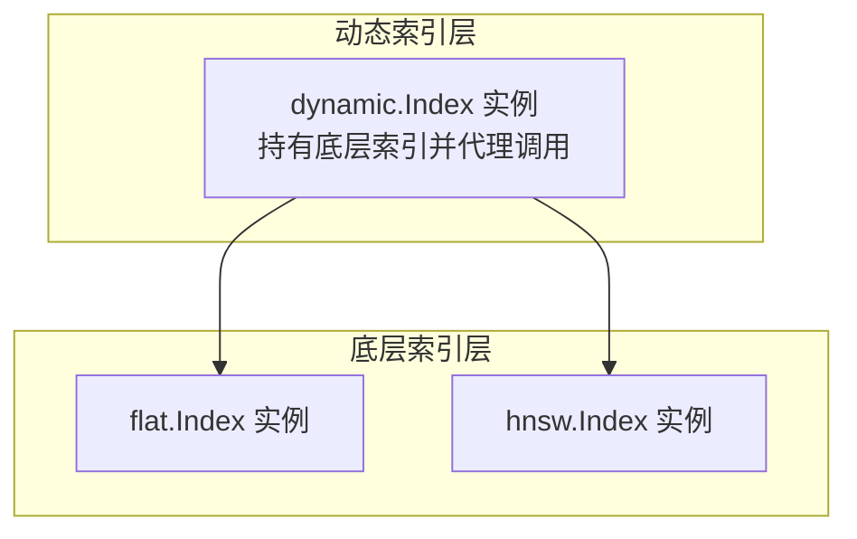
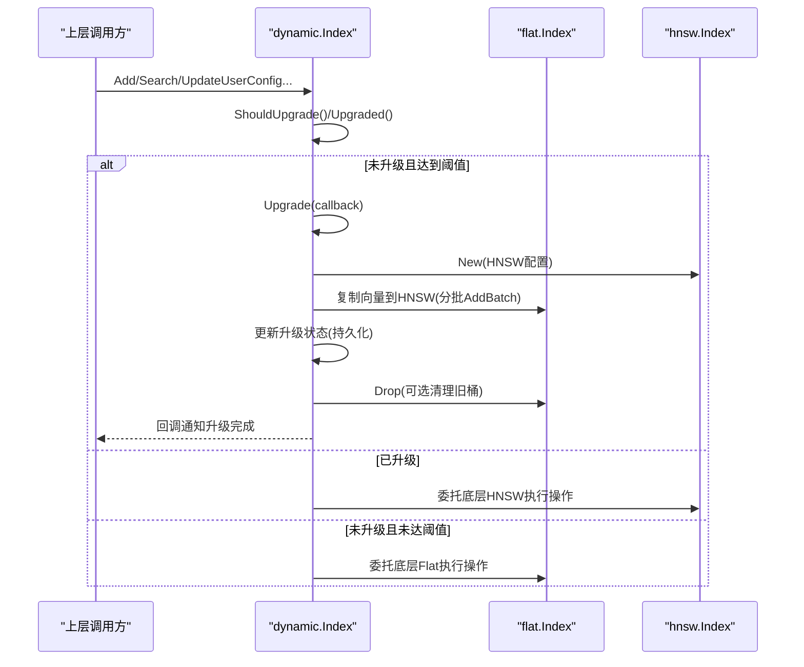
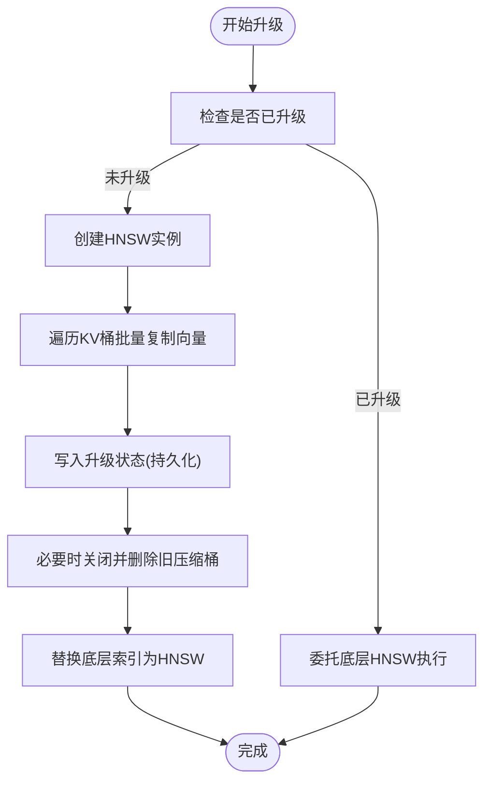
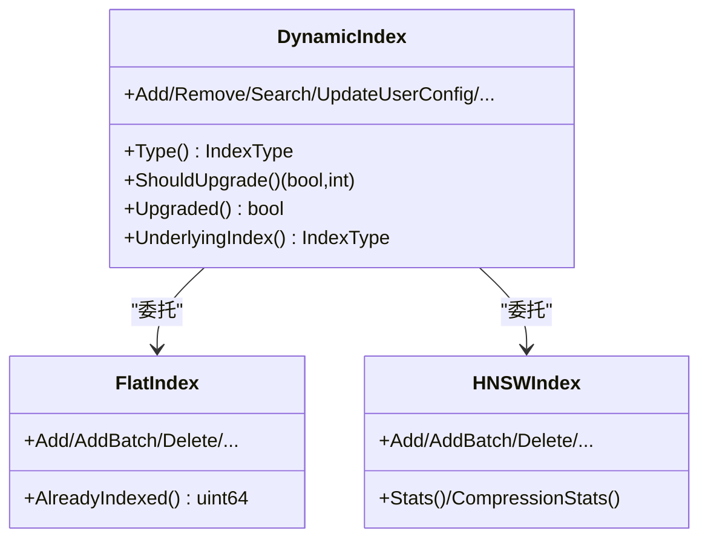

# 动态索引

<cite>
**本文引用的文件**
- [entities/vectorindex/dynamic/config.go](file://entities/vectorindex/dynamic/config.go)
- [adapters/repos/db/vector/dynamic/index.go](file://adapters/repos/db/vector/dynamic/index.go)
- [adapters/repos/db/vector/flat/index.go](file://adapters/repos/db/vector/flat/index.go)
- [adapters/repos/db/vector/hnsw/index.go](file://adapters/repos/db/vector/hnsw/index.go)
- [adapters/repos/db/shard_dimension_tracking.go](file://adapters/repos/db/shard_dimension_tracking.go)
- [adapters/repos/db/vector/dynamic/index_test.go](file://adapters/repos/db/vector/dynamic/index_test.go)
</cite>

## 目录
1. [简介](#简介)
2. [项目结构](#项目结构)
3. [核心组件](#核心组件)
4. [架构总览](#架构总览)
5. [组件详解](#组件详解)
6. [依赖关系分析](#依赖关系分析)
7. [性能考量](#性能考量)
8. [故障排查指南](#故障排查指南)
9. [结论](#结论)
10. [附录：配置与监控示例](#附录配置与监控示例)

## 简介
本文件针对 Weaviate 的“动态向量索引”进行深入技术说明，重点覆盖以下方面：
- 自适应机制：根据数据规模与特征在 HNSW 与 Flat 索引之间自动切换
- 切换策略与触发条件：阈值驱动、升级流程与状态持久化
- 配置参数与调优：阈值、底层索引配置、压缩策略对切换的影响
- 性能与内存权衡：查询延迟、吞吐与内存占用的平衡
- 监控与观测：指标采集、状态查询与回归测试验证
- 最佳实践：容量规划、阈值设定、异步升级与回滚策略

## 项目结构
Weaviate 的动态索引位于向量索引子系统中，采用“组合 + 委托”的模式：动态索引内部持有底层具体索引实例（Flat 或 HNSW），并在运行时根据阈值与已索引数量决定是否升级。

图示来源
- [adapters/repos/db/vector/dynamic/index.go](file://adapters/repos/db/vector/dynamic/index.go#L92-L122)
- [adapters/repos/db/vector/flat/index.go](file://adapters/repos/db/vector/flat/index.go#L76-L125)
- [adapters/repos/db/vector/hnsw/index.go](file://adapters/repos/db/vector/hnsw/index.go#L44-L200)

章节来源
- [adapters/repos/db/vector/dynamic/index.go](file://adapters/repos/db/vector/dynamic/index.go#L124-L220)
- [adapters/repos/db/vector/flat/index.go](file://adapters/repos/db/vector/flat/index.go#L76-L125)
- [adapters/repos/db/vector/hnsw/index.go](file://adapters/repos/db/vector/hnsw/index.go#L44-L200)

## 核心组件
- 动态索引实现：负责初始化、状态判断、阈值评估、升级流程与底层索引委托
- Flat 索引：无层次结构的线性检索，适合小规模或临时场景
- HNSW 索引：近似最近邻图索引，适合大规模高维向量的高效检索
- 配置解析：动态索引配置包含阈值与底层 HNSW/Flat 的用户配置
- 维度与压缩信息：用于统计与观测不同压缩策略下的维度类别

章节来源
- [adapters/repos/db/vector/dynamic/index.go](file://adapters/repos/db/vector/dynamic/index.go#L92-L122)
- [adapters/repos/db/vector/flat/index.go](file://adapters/repos/db/vector/flat/index.go#L49-L72)
- [adapters/repos/db/vector/hnsw/index.go](file://adapters/repos/db/vector/hnsw/index.go#L44-L100)
- [entities/vectorindex/dynamic/config.go](file://entities/vectorindex/dynamic/config.go#L28-L33)
- [adapters/repos/db/shard_dimension_tracking.go](file://adapters/repos/db/shard_dimension_tracking.go#L184-L222)

## 架构总览
动态索引通过阈值与已索引数量决定是否从 Flat 升级到 HNSW。升级过程以“渐进迁移”的方式完成，保证查询不中断，并在后台复制向量、重建索引后替换底层索引。

图示来源
- [adapters/repos/db/vector/dynamic/index.go](file://adapters/repos/db/vector/dynamic/index.go#L465-L512)
- [adapters/repos/db/vector/dynamic/index.go](file://adapters/repos/db/vector/dynamic/index.go#L514-L616)
- [adapters/repos/db/vector/dynamic/index.go](file://adapters/repos/db/vector/dynamic/index.go#L324-L371)

章节来源
- [adapters/repos/db/vector/dynamic/index.go](file://adapters/repos/db/vector/dynamic/index.go#L465-L512)
- [adapters/repos/db/vector/dynamic/index.go](file://adapters/repos/db/vector/dynamic/index.go#L514-L616)
- [adapters/repos/db/vector/dynamic/index.go](file://adapters/repos/db/vector/dynamic/index.go#L324-L371)

## 组件详解

### 动态索引配置与默认值
- 关键字段
  - threshold：触发升级的阈值（默认值见配置文件）
  - distance：距离度量名称
  - hnsw：HNSW 用户配置
  - flat：Flat 用户配置
- 默认行为：若未显式设置，使用默认阈值与默认底层配置
- 解析与校验：支持从映射解析，校验 HNSW 多矢量配置不可用于动态索引

章节来源
- [entities/vectorindex/dynamic/config.go](file://entities/vectorindex/dynamic/config.go#L28-L61)
- [entities/vectorindex/dynamic/config.go](file://entities/vectorindex/dynamic/config.go#L65-L125)

### 初始化与状态持久化
- 初始化阶段会检查是否存在 HNSW 提交日志目录，据此推断历史升级状态
- 使用嵌入式数据库写入/读取“升级状态键”，区分目标向量场景
- 支持目标向量特定键空间，兼容早期版本共享键的迁移

章节来源
- [adapters/repos/db/vector/dynamic/index.go](file://adapters/repos/db/vector/dynamic/index.go#L248-L306)
- [adapters/repos/db/vector/dynamic/index.go](file://adapters/repos/db/vector/dynamic/index.go#L226-L246)

### 切换策略与触发条件
- ShouldUpgrade 返回是否应升级及达到阈值所需的剩余数量
- Upgraded 返回当前底层索引是否已是 HNSW
- 当未升级且已索引数量达到阈值，或显式调用 Upgrade，触发升级流程

章节来源
- [adapters/repos/db/vector/dynamic/index.go](file://adapters/repos/db/vector/dynamic/index.go#L465-L478)

### 升级流程与并发控制
- 升级采用一次性门限（Once）避免重复升级
- 升级过程中先以读锁保护，允许查询继续；复制完成后写锁替换底层索引
- 复制采用短生命周期游标与批量写入，降低对 KV 存储的阻塞
- 升级完成后更新持久化状态，并按需清理旧压缩桶

图示来源
- [adapters/repos/db/vector/dynamic/index.go](file://adapters/repos/db/vector/dynamic/index.go#L487-L512)
- [adapters/repos/db/vector/dynamic/index.go](file://adapters/repos/db/vector/dynamic/index.go#L514-L616)
- [adapters/repos/db/vector/dynamic/index.go](file://adapters/repos/db/vector/dynamic/index.go#L618-L673)

章节来源
- [adapters/repos/db/vector/dynamic/index.go](file://adapters/repos/db/vector/dynamic/index.go#L487-L512)
- [adapters/repos/db/vector/dynamic/index.go](file://adapters/repos/db/vector/dynamic/index.go#L514-L616)
- [adapters/repos/db/vector/dynamic/index.go](file://adapters/repos/db/vector/dynamic/index.go#L618-L673)

### 底层索引委托与接口一致性
- 动态索引对外暴露统一接口，内部根据当前状态委托给 Flat 或 HNSW
- 查询、插入、删除、配置更新、统计等均通过委托实现
- 对于 HNSW 特有能力（如压缩统计、HNSW 统计），动态索引提供适配器方法

章节来源
- [adapters/repos/db/vector/dynamic/index.go](file://adapters/repos/db/vector/dynamic/index.go#L324-L371)
- [adapters/repos/db/vector/dynamic/index.go](file://adapters/repos/db/vector/dynamic/index.go#L683-L705)

### 压缩与维度信息
- 动态索引在“已升级”状态下返回 HNSW 的压缩统计，在“未升级”状态下返回 Flat 的压缩统计
- 维度跟踪函数根据 HNSW/Flat 配置提取压缩类别与参数，用于观测与指标

章节来源
- [adapters/repos/db/vector/dynamic/index.go](file://adapters/repos/db/vector/dynamic/index.go#L694-L705)
- [adapters/repos/db/shard_dimension_tracking.go](file://adapters/repos/db/shard_dimension_tracking.go#L184-L222)

### 类型与统计
- 动态索引类型标识为“dynamic”
- HNSW 统计包含维度、入口点、层级分布、墓碑数、缓存大小、压缩状态等

章节来源
- [adapters/repos/db/vector/dynamic/index.go](file://adapters/repos/db/vector/dynamic/index.go#L721-L725)
- [adapters/repos/db/vector/hnsw/index.go](file://adapters/repos/db/vector/hnsw/index.go#L1028-L1089)

## 依赖关系分析
动态索引与底层索引之间的耦合度低，主要通过接口委托实现解耦。动态索引仅关心“是否已升级”“是否应升级”“阈值”“底层索引类型”等状态，而不关心具体实现细节。

图示来源
- [adapters/repos/db/vector/dynamic/index.go](file://adapters/repos/db/vector/dynamic/index.go#L52-L83)
- [adapters/repos/db/vector/flat/index.go](file://adapters/repos/db/vector/flat/index.go#L76-L125)
- [adapters/repos/db/vector/hnsw/index.go](file://adapters/repos/db/vector/hnsw/index.go#L44-L200)

章节来源
- [adapters/repos/db/vector/dynamic/index.go](file://adapters/repos/db/vector/dynamic/index.go#L52-L83)
- [adapters/repos/db/vector/flat/index.go](file://adapters/repos/db/vector/flat/index.go#L76-L125)
- [adapters/repos/db/vector/hnsw/index.go](file://adapters/repos/db/vector/hnsw/index.go#L44-L200)

## 性能考量
- 查询性能
  - 小规模数据：Flat 检索简单直接，延迟较低
  - 大规模数据：HNSW 提供近似检索，延迟显著下降
- 内存使用
  - Flat：按存储向量本身，无额外图结构开销
  - HNSW：构建图结构与连接，内存占用更高；可通过压缩量化降低
- 升级时机
  - 过早升级：HNSW 初始化成本高，且小数据集收益有限
  - 过晚升级：早期查询延迟较高，影响用户体验
- 异步升级
  - 升级过程允许查询继续，减少停机窗口；但升级期间仍可能产生额外 IO 与 CPU 开销

章节来源
- [adapters/repos/db/vector/dynamic/index.go](file://adapters/repos/db/vector/dynamic/index.go#L487-L512)
- [adapters/repos/db/vector/dynamic/index.go](file://adapters/repos/db/vector/dynamic/index.go#L514-L616)
- [adapters/repos/db/vector/hnsw/index.go](file://adapters/repos/db/vector/hnsw/index.go#L1028-L1089)

## 故障排查指南
- 升级未生效
  - 检查阈值与已索引数量：调用 ShouldUpgrade 获取剩余数量
  - 确认升级状态：IsUpgraded 与 UnderlyingIndex 反映当前底层类型
- 升级被取消
  - 若在升级过程中关闭索引，升级会被取消；回调仍会触发
- 查询异常
  - 在升级过程中，底层索引可能处于替换阶段；等待回调完成或重试
- 数据丢失风险
  - 升级完成后会清理旧压缩桶（当底层配置变更导致不兼容时）；确保备份策略到位

章节来源
- [adapters/repos/db/vector/dynamic/index.go](file://adapters/repos/db/vector/dynamic/index.go#L465-L478)
- [adapters/repos/db/vector/dynamic/index.go](file://adapters/repos/db/vector/dynamic/index.go#L487-L512)
- [adapters/repos/db/vector/dynamic/index.go](file://adapters/repos/db/vector/dynamic/index.go#L514-L616)
- [adapters/repos/db/vector/dynamic/index_test.go](file://adapters/repos/db/vector/dynamic/index_test.go#L278-L360)

## 结论
动态索引通过“阈值 + 异步升级”的策略，在小规模数据的低延迟与大规模数据的高效率之间取得平衡。合理设置阈值、关注升级过程中的资源占用、结合压缩策略与监控指标，是获得稳定性能的关键。对于需要灵活索引策略的系统架构师，建议在容量规划阶段充分评估数据增长曲线，并制定灰度升级与回滚预案。

## 附录：配置与监控示例

### 配置参数说明
- threshold
  - 含义：达到该数量后触发升级
  - 默认值：参考动态配置默认值
  - 调优建议：结合业务 QPS 与延迟目标，预留安全余量
- distance
  - 含义：距离度量名称（由底层索引使用）
  - 默认值：通用默认距离度量
- hnsw 与 flat 的用户配置
  - 包含各自索引的参数（如 EF、最大连接数、压缩配置等）
  - 注意：动态索引不支持 HNSW 多矢量配置

章节来源
- [entities/vectorindex/dynamic/config.go](file://entities/vectorindex/dynamic/config.go#L28-L61)
- [entities/vectorindex/dynamic/config.go](file://entities/vectorindex/dynamic/config.go#L65-L125)

### 配置示例（路径引用）
- 动态索引默认配置与解析
  - [entities/vectorindex/dynamic/config.go](file://entities/vectorindex/dynamic/config.go#L49-L61)
  - [entities/vectorindex/dynamic/config.go](file://entities/vectorindex/dynamic/config.go#L65-L125)
- HNSW/Flat 用户配置默认值与校验
  - [adapters/repos/db/vector/hnsw/index.go](file://adapters/repos/db/vector/hnsw/index.go#L44-L200)
  - [adapters/repos/db/vector/flat/index.go](file://adapters/repos/db/vector/flat/index.go#L69-L84)

### 性能监控方法
- 查询延迟与召回率
  - 使用测试工具对升级前后进行对比，观察延迟与召回变化
- HNSW 统计
  - 通过 HNSW 统计接口获取维度、入口点、层级分布、墓碑数、缓存大小与压缩状态
- 压缩统计
  - 动态索引在不同状态下返回对应底层索引的压缩统计，便于观测压缩效果

章节来源
- [adapters/repos/db/vector/dynamic/index_test.go](file://adapters/repos/db/vector/dynamic/index_test.go#L101-L125)
- [adapters/repos/db/vector/hnsw/index.go](file://adapters/repos/db/vector/hnsw/index.go#L1028-L1089)
- [adapters/repos/db/vector/dynamic/index.go](file://adapters/repos/db/vector/dynamic/index.go#L694-L705)