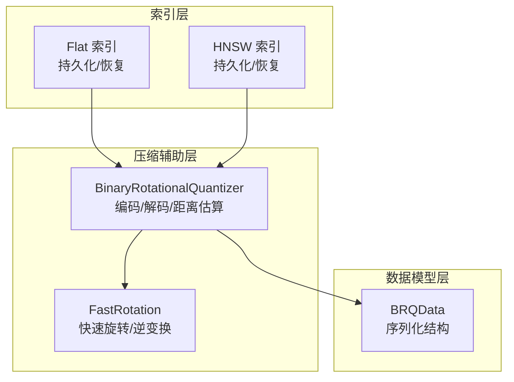
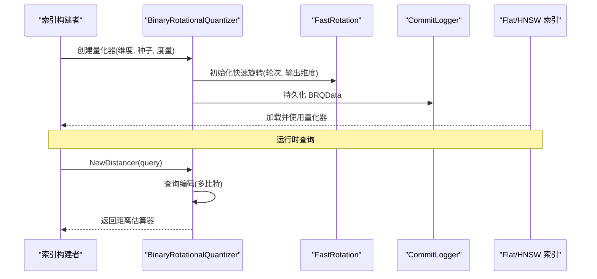
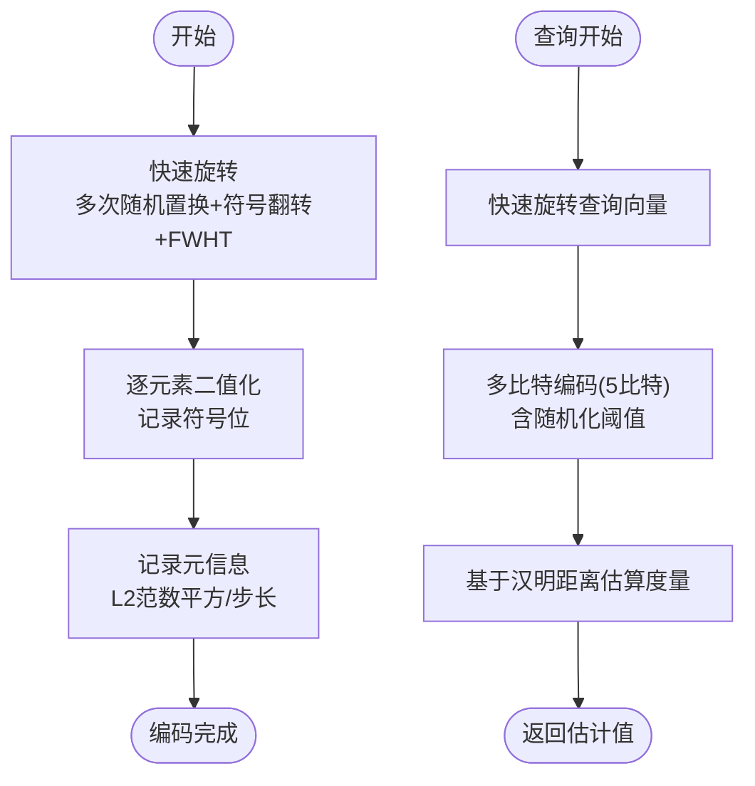
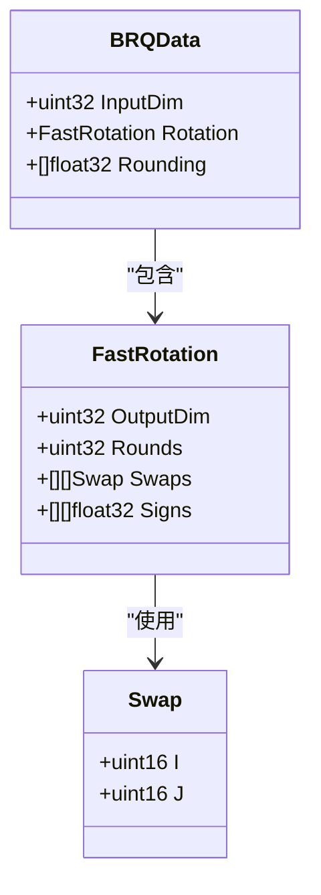
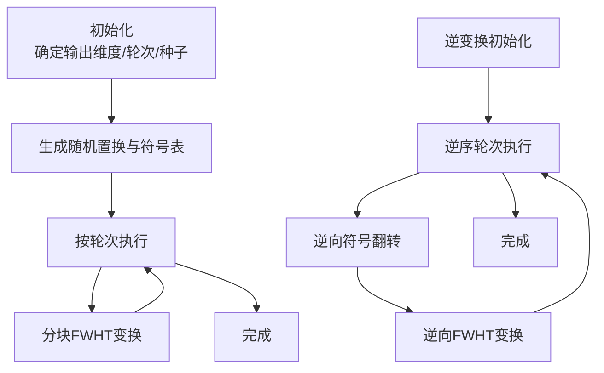
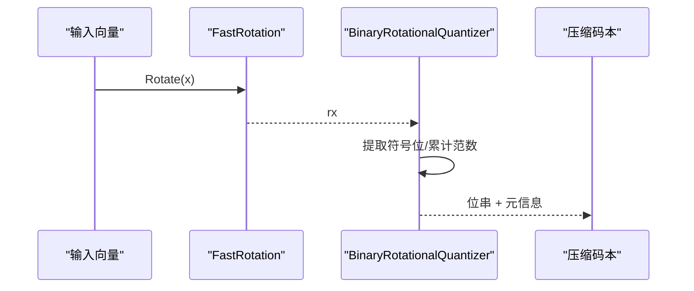
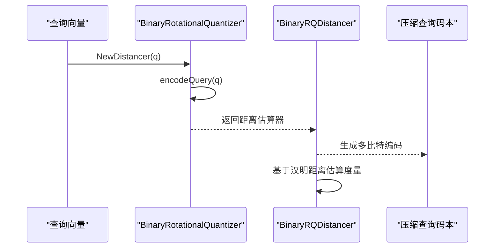
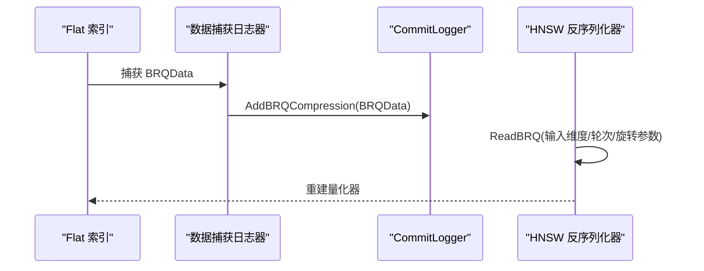
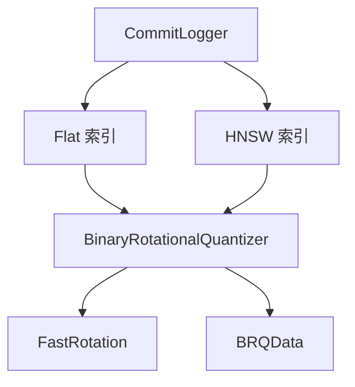

# BRQ 压缩算法

<cite>
**本文引用的文件**
- [binary_rotational_quantization.go](file://adapters/repos/db/vector/compressionhelpers/binary_rotational_quantization.go)
- [binary_rotational_quantization_test.go](file://adapters/repos/db/vector/compressionhelpers/binary_rotational_quantization_test.go)
- [fast_rotation.go](file://adapters/repos/db/vector/compressionhelpers/fast_rotation.go)
- [fast_rotation.go](file://entities/vectorindex/compression/fast_rotation.go)
- [brq_data.go](file://entities/vectorindex/compression/brq_data.go)
- [rq_config.go](file://entities/vectorindex/hnsw/rq_config.go)
- [metadata.go](file://adapters/repos/db/vector/flat/metadata.go)
- [deserializer.go](file://adapters/repos/db/vector/hnsw/deserializer.go)
- [commit_logger.go](file://adapters/repos/db/vector/hnsw/commit_logger.go)
- [commit_logger_snapshot.go](file://adapters/repos/db/vector/hnsw/commit_logger_snapshot.go)
- [commit_logger_noop.go](file://adapters/repos/db/vector/hnsw/commit_logger_noop.go)
- [index_test.go](file://adapters/repos/db/vector/flat/index_test.go)
</cite>

## 目录
1. [简介](#简介)
2. [项目结构](#项目结构)
3. [核心组件](#核心组件)
4. [架构总览](#架构总览)
5. [详细组件分析](#详细组件分析)
6. [依赖关系分析](#依赖关系分析)
7. [性能考量](#性能考量)
8. [故障排查指南](#故障排查指南)
9. [结论](#结论)
10. [附录：配置与迁移指南](#附录配置与迁移指南)

## 简介
本文件系统性阐述 Weaviate 中的 BRQ（Binary Randomized Quantization，二进制随机量化）压缩算法。BRQ 将高维浮点向量通过快速旋转与二值化映射到极低比特表示，并在查询时以汉明距离近似估计原始空间度量（如余弦、点积或 L2 平方）。其关键优势在于：
- 极高的内存效率：压缩后每维仅需 1/8 字节存储
- 快速的相似性评估：基于位运算的汉明距离与加权求和
- 对大规模向量检索的友好：支持 HNSW 与 Flat 索引

本文将从算法原理、数据结构、实现细节、性能特性、配置参数与迁移策略等方面进行深入解析。

## 项目结构
围绕 BRQ 的相关代码主要分布在以下模块：
- 压缩辅助层：提供 BRQ 编解码、距离估算与统计
- 快速旋转层：提供快速随机旋转与逆变换
- 数据模型层：定义 BRQData 序列化结构
- HNSW/Flat 索引层：持久化、反序列化与运行时使用
- 测试与基准：验证误差、性能与一致性

**图表来源**
- [binary_rotational_quantization.go](file://adapters/repos/db/vector/compressionhelpers/binary_rotational_quantization.go#L31-L86)
- [fast_rotation.go](file://adapters/repos/db/vector/compressionhelpers/fast_rotation.go#L21-L29)
- [brq_data.go](file://entities/vectorindex/compression/brq_data.go#L14-L19)
- [metadata.go](file://adapters/repos/db/vector/flat/metadata.go#L303-L328)
- [deserializer.go](file://adapters/repos/db/vector/hnsw/deserializer.go#L857-L869)

**章节来源**
- [binary_rotational_quantization.go](file://adapters/repos/db/vector/compressionhelpers/binary_rotational_quantization.go#L1-L533)
- [fast_rotation.go](file://adapters/repos/db/vector/compressionhelpers/fast_rotation.go#L1-L29)
- [brq_data.go](file://entities/vectorindex/compression/brq_data.go#L1-L20)
- [metadata.go](file://adapters/repos/db/vector/flat/metadata.go#L303-L328)
- [deserializer.go](file://adapters/repos/db/vector/hnsw/deserializer.go#L857-L869)

## 核心组件
- BinaryRotationalQuantizer：BRQ 主体实现，负责向量旋转、二值化编码、查询编码、距离估算与统计
- FastRotation：快速随机旋转器，提供可逆的旋转与逆旋转，支持分块 FWHT 变换
- BRQData：序列化结构，保存输入维度、旋转配置与随机化参数
- 距离估算器：基于汉明距离的近似度量，支持不同度量类型（余弦、点积、L2 平方）

**章节来源**
- [binary_rotational_quantization.go](file://adapters/repos/db/vector/compressionhelpers/binary_rotational_quantization.go#L31-L86)
- [fast_rotation.go](file://entities/vectorindex/compression/fast_rotation.go#L28-L101)
- [brq_data.go](file://entities/vectorindex/compression/brq_data.go#L14-L19)

## 架构总览
BRQ 在索引构建与查询阶段的关键交互如下：

**图表来源**
- [binary_rotational_quantization.go](file://adapters/repos/db/vector/compressionhelpers/binary_rotational_quantization.go#L50-L86)
- [fast_rotation.go](file://entities/vectorindex/compression/fast_rotation.go#L74-L92)
- [commit_logger.go](file://adapters/repos/db/vector/hnsw/commit_logger.go#L455-L459)
- [metadata.go](file://adapters/repos/db/vector/flat/metadata.go#L303-L328)

## 详细组件分析

### 二进制随机量化算法原理
- 快速旋转：对输入向量进行多次随机置换与符号翻转，并在每轮中应用分块快速沃尔什-哈达玛变换（FWHT），以获得近似均匀分布的旋转结果
- 二值化：对旋转后的向量逐元素比较符号，得到二进制位串；同时记录 L2 范数平方与归一化步长，用于后续距离估算
- 查询编码：针对查询向量采用多比特编码（5 比特），结合随机化阈值，提升估计无偏性
- 距离估算：基于汉明距离与权重因子估算点积/余弦/L2 平方等度量

**图表来源**
- [binary_rotational_quantization.go](file://adapters/repos/db/vector/compressionhelpers/binary_rotational_quantization.go#L180-L208)
- [binary_rotational_quantization.go](file://adapters/repos/db/vector/compressionhelpers/binary_rotational_quantization.go#L280-L335)
- [binary_rotational_quantization.go](file://adapters/repos/db/vector/compressionhelpers/binary_rotational_quantization.go#L387-L409)

**章节来源**
- [binary_rotational_quantization.go](file://adapters/repos/db/vector/compressionhelpers/binary_rotational_quantization.go#L180-L208)
- [binary_rotational_quantization.go](file://adapters/repos/db/vector/compressionhelpers/binary_rotational_quantization.go#L280-L335)
- [binary_rotational_quantization.go](file://adapters/repos/db/vector/compressionhelpers/binary_rotational_quantization.go#L387-L409)

### BRQData 结构体与持久化
BRQData 保存量化器的必要状态以便重建与恢复：
- 输入维度：原始向量维度
- 旋转配置：输出维度、轮次、随机置换与符号表
- 随机化阈值：用于查询编码的随机化偏移

**图表来源**
- [brq_data.go](file://entities/vectorindex/compression/brq_data.go#L14-L19)
- [fast_rotation.go](file://entities/vectorindex/compression/fast_rotation.go#L28-L34)
- [fast_rotation.go](file://entities/vectorindex/compression/fast_rotation.go#L23-L26)

**章节来源**
- [brq_data.go](file://entities/vectorindex/compression/brq_data.go#L14-L19)
- [fast_rotation.go](file://entities/vectorindex/compression/fast_rotation.go#L28-L101)

### 快速旋转器 FastRotation
- 输出维度对齐：输出维度按 64 上取整，确保位操作效率
- 随机置换与符号：每轮生成随机置换对与符号表，保证旋转的随机性与可逆性
- 分块 FWHT：优先使用 256 元素块，其次 64 元素块，显著降低复杂度
- 逆变换：逆序执行轮次，先逆向 FWHT 再逆向置换与符号

**图表来源**
- [fast_rotation.go](file://entities/vectorindex/compression/fast_rotation.go#L74-L92)
- [fast_rotation.go](file://entities/vectorindex/compression/fast_rotation.go#L103-L124)
- [fast_rotation.go](file://entities/vectorindex/compression/fast_rotation.go#L133-L158)

**章节来源**
- [fast_rotation.go](file://entities/vectorindex/compression/fast_rotation.go#L74-L158)

### 编码与解码流程
- 编码（数据向量）：旋转后逐元素提取符号位，打包为位串；同时记录 L2 范数平方与步长
- 解码（重建向量）：根据平均范数与位串重建 ± 常数的分段常值向量，再经逆旋转还原到原始维度

**图表来源**
- [binary_rotational_quantization.go](file://adapters/repos/db/vector/compressionhelpers/binary_rotational_quantization.go#L180-L208)
- [binary_rotational_quantization.go](file://adapters/repos/db/vector/compressionhelpers/binary_rotational_quantization.go#L218-L237)

**章节来源**
- [binary_rotational_quantization.go](file://adapters/repos/db/vector/compressionhelpers/binary_rotational_quantization.go#L180-L237)

### 查询编码与距离估算
- 查询编码：对查询向量进行旋转，采用 5 比特多级编码，结合随机化阈值，避免量化偏差
- 距离估算：基于汉明距离的加权和，结合度量类型（余弦/点积/L2）与范数信息，给出近似度量值

**图表来源**
- [binary_rotational_quantization.go](file://adapters/repos/db/vector/compressionhelpers/binary_rotational_quantization.go#L350-L367)
- [binary_rotational_quantization.go](file://adapters/repos/db/vector/compressionhelpers/binary_rotational_quantization.go#L280-L335)
- [binary_rotational_quantization.go](file://adapters/repos/db/vector/compressionhelpers/binary_rotational_quantization.go#L387-L409)

**章节来源**
- [binary_rotational_quantization.go](file://adapters/repos/db/vector/compressionhelpers/binary_rotational_quantization.go#L350-L409)

### 索引持久化与恢复
- Flat/HNSW 索引在构建时捕获 BRQData 并写入提交日志
- HNSW 反序列化器读取 BRQ 数据并重建量化器
- 提供快照与空实现的日志器，便于测试与兼容

**图表来源**
- [metadata.go](file://adapters/repos/db/vector/flat/metadata.go#L303-L328)
- [commit_logger.go](file://adapters/repos/db/vector/hnsw/commit_logger.go#L455-L459)
- [deserializer.go](file://adapters/repos/db/vector/hnsw/deserializer.go#L857-L869)
- [commit_logger_snapshot.go](file://adapters/repos/db/vector/hnsw/commit_logger_snapshot.go#L803-L803)
- [commit_logger_noop.go](file://adapters/repos/db/vector/hnsw/commit_logger_noop.go#L44-L44)

**章节来源**
- [metadata.go](file://adapters/repos/db/vector/flat/metadata.go#L303-L328)
- [deserializer.go](file://adapters/repos/db/vector/hnsw/deserializer.go#L857-L869)
- [commit_logger.go](file://adapters/repos/db/vector/hnsw/commit_logger.go#L455-L459)

## 依赖关系分析
- 组件耦合
  - BinaryRotationalQuantizer 依赖 FastRotation 完成旋转与逆旋转
  - BRQData 作为序列化契约，被 Flat/HNSW 索引读取与写入
  - CommitLogger 抽象了持久化接口，具体实现由 HNSW/Flat 使用
- 外部依赖
  - 随机数生成与位运算库
  - 度量提供器（余弦、点积、L2 平方）影响估算系数

**图表来源**
- [binary_rotational_quantization.go](file://adapters/repos/db/vector/compressionhelpers/binary_rotational_quantization.go#L31-L86)
- [fast_rotation.go](file://entities/vectorindex/compression/fast_rotation.go#L28-L101)
- [brq_data.go](file://entities/vectorindex/compression/brq_data.go#L14-L19)
- [commit_logger.go](file://adapters/repos/db/vector/hnsw/commit_logger.go#L455-L459)

**章节来源**
- [binary_rotational_quantization.go](file://adapters/repos/db/vector/compressionhelpers/binary_rotational_quantization.go#L31-L86)
- [fast_rotation.go](file://entities/vectorindex/compression/fast_rotation.go#L28-L101)
- [brq_data.go](file://entities/vectorindex/compression/brq_data.go#L14-L19)
- [commit_logger.go](file://adapters/repos/db/vector/hnsw/commit_logger.go#L455-L459)

## 性能考量
- 内存效率
  - 压缩比：原始大小为维度 × 4 字节，压缩后约为 8 字节元数据 + 每维 1 比特，即约 8 + D/8 字节
  - 适合大规模向量存储与传输
- 查询速度
  - 编码/解码：O(D) 位操作，汉明距离计算高效
  - 距离估算：基于位运算与少量乘加，支持大维度下的实时检索
- 基准测试
  - 测试覆盖不同维度与度量类型的误差与偏差，验证估计精度随维度增加而收敛
  - 提供编码、距离估算与新距离器创建的基准指标

**章节来源**
- [binary_rotational_quantization.go](file://adapters/repos/db/vector/compressionhelpers/binary_rotational_quantization.go#L518-L532)
- [binary_rotational_quantization_test.go](file://adapters/repos/db/vector/compressionhelpers/binary_rotational_quantization_test.go#L140-L188)
- [binary_rotational_quantization_test.go](file://adapters/repos/db/vector/compressionhelpers/binary_rotational_quantization_test.go#L190-L270)

## 故障排查指南
- 无 BRQ 数据被捕获
  - 现象：Flat 索引在序列化时提示未捕获 BRQ 数据
  - 排查：确认量化器已调用持久化接口并正确写入日志器
- 旋转参数不一致
  - 现象：重建量化器失败或距离估算异常
  - 排查：核对输入维度、轮次与旋转配置是否与序列化数据一致
- 度量类型不匹配
  - 现象：估算结果与预期度量不符
  - 排查：确认度量提供器类型（余弦/点积/L2）与量化器初始化一致

**章节来源**
- [metadata.go](file://adapters/repos/db/vector/flat/metadata.go#L308-L318)
- [deserializer.go](file://adapters/repos/db/vector/hnsw/deserializer.go#L857-L869)
- [binary_rotational_quantization.go](file://adapters/repos/db/vector/compressionhelpers/binary_rotational_quantization.go#L350-L367)

## 结论
BRQ 通过快速旋转与二值化，在保持检索质量的同时实现了极高的内存与计算效率，特别适用于大规模向量检索场景。其可逆的旋转机制与基于汉明距离的度量估计，使得在 HNSW 与 Flat 索引中均具备良好的工程落地性与扩展性。

## 附录：配置与迁移指南

### BRQ 配置参数
- 启用开关：RQ.Enabled
- 位宽：RQ.Bits（BRQ 使用 1）
- 重打分阈值：RQ.RescoreLimit（BRQ 默认较大阈值以平衡召回与性能）
- 度量类型：由度量提供器决定（余弦、点积、L2 平方）

**章节来源**
- [rq_config.go](file://entities/vectorindex/hnsw/rq_config.go#L21-L32)
- [rq_config.go](file://entities/vectorindex/hnsw/rq_config.go#L74-L76)

### 与传统量化方法的对比
- 与 8-bit RQ 对比
  - BRQ 每维仅 1 比特，存储开销更低；但 8-bit RQ 在某些场景下可能提供更稳定的召回
- 与 PQ/SQ 对比
  - BRQ 不引入码本，避免训练与维护成本；PQ/SQ 在高维下通常需要额外的量化误差校正
- 与 BQ 对比
  - BRQ 采用随机旋转与二值化，理论上更接近“无监督”方案；BQ 依赖特定投影矩阵

**章节来源**
- [binary_rotational_quantization.go](file://adapters/repos/db/vector/compressionhelpers/binary_rotational_quantization.go#L518-L532)
- [index_test.go](file://adapters/repos/db/vector/flat/index_test.go#L214-L287)

### 迁移与启用建议
- 从无量化迁移到 BRQ
  - 在 Flat/HNSW 索引配置中启用 RQ 并设置 Bits=1，保留默认 RescoreLimit 或按召回目标调整
  - 重新构建索引以捕获新的 BRQData
- 回退策略
  - 关闭 RQ.Enabled 即可回退至原始浮点向量存储与检索
- 性能调优
  - 若召回不足，适当提高 RescoreLimit；若延迟敏感，可考虑减少扫描范围或优化度量类型

**章节来源**
- [metadata.go](file://adapters/repos/db/vector/flat/metadata.go#L303-L328)
- [rq_config.go](file://entities/vectorindex/hnsw/rq_config.go#L74-L76)