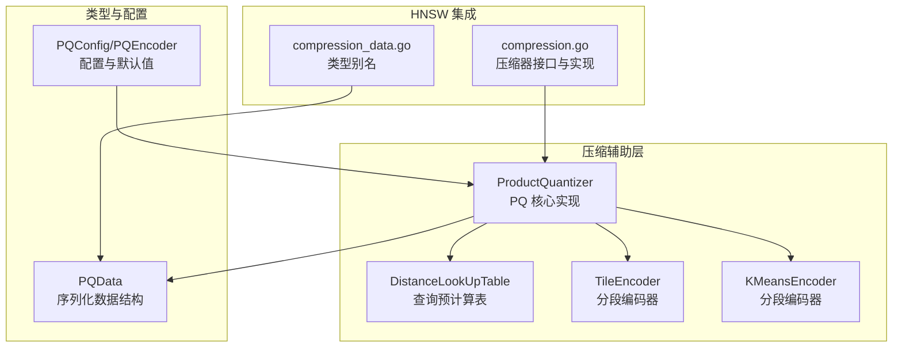
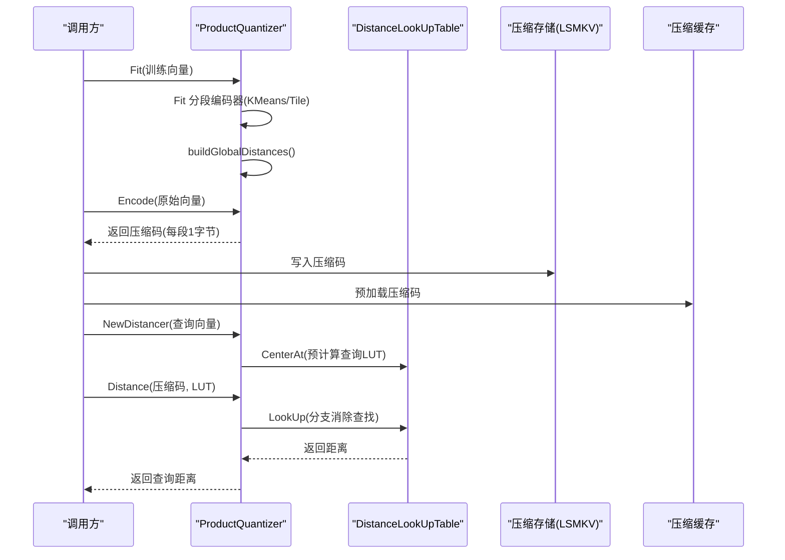
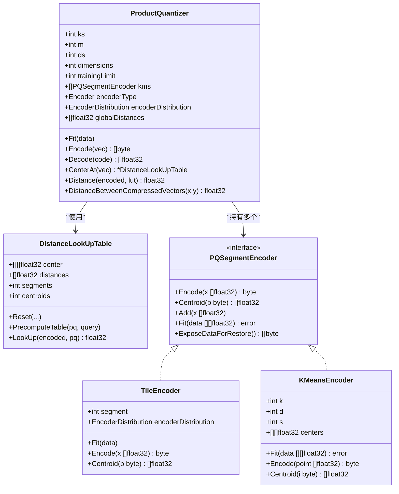
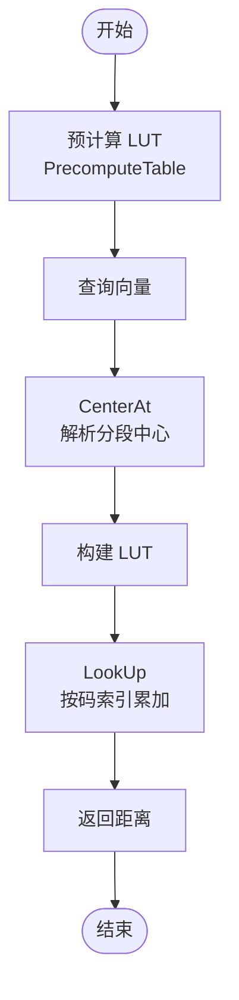
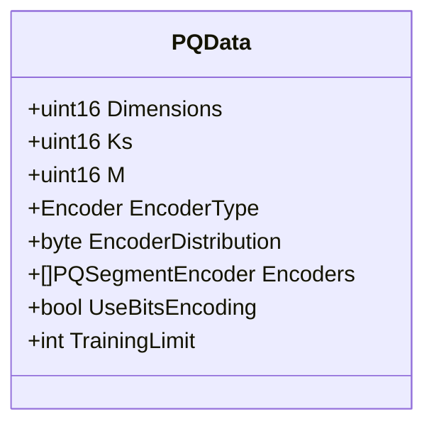
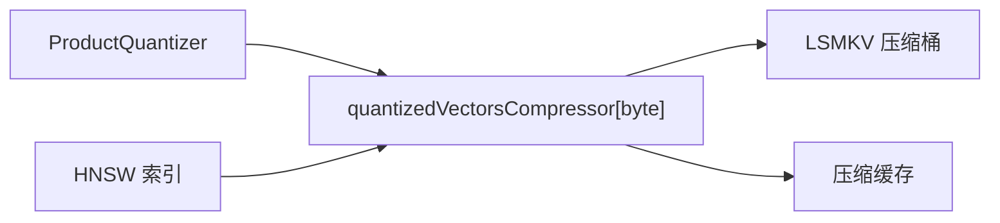
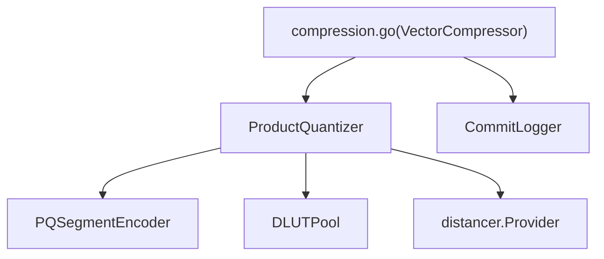

# PQ 压缩算法

<cite>
**本文引用的文件**
- [product_quantization.go](file://adapters/repos/db/vector/compressionhelpers/product_quantization.go)
- [pq_data.go](file://entities/vectorindex/compression/pq_data.go)
- [compression.go](file://adapters/repos/db/vector/compressionhelpers/compression.go)
- [tile_encoder.go](file://adapters/repos/db/vector/compressionhelpers/tile_encoder.go)
- [kmeans_encoder.go](file://adapters/repos/db/vector/compressionhelpers/kmeans_encoder.go)
- [pq_config.go](file://entities/vectorindex/hnsw/pq_config.go)
- [compression_data.go](file://entities/vectorindex/hnsw/compression_data.go)
- [product_quantization_test.go](file://adapters/repos/db/vector/compressionhelpers/product_quantization_test.go)
- [compress_sift_test.go](file://adapters/repos/db/vector/hnsw/compress_sift_test.go)
</cite>

## 目录
1. [简介](#简介)
2. [项目结构](#项目结构)
3. [核心组件](#核心组件)
4. [架构总览](#架构总览)
5. [详细组件分析](#详细组件分析)
6. [依赖关系分析](#依赖关系分析)
7. [性能考量](#性能考量)
8. [故障排查指南](#故障排查指南)
9. [结论](#结论)
10. [附录](#附录)

## 简介
本文件针对 Weaviate 中的 PQ（Product Quantization，乘积量化）压缩算法进行系统化技术文档整理。内容覆盖算法原理、码本生成、向量划分与量化编码流程；PQData 结构体设计与持久化；查询时的重构与距离计算；压缩率、内存占用与查询性能特征；配置参数详解；以及在 HNSW 向量索引中的集成方式与优化建议。目标读者为向量搜索工程师与算法优化专家。

## 项目结构
Weaviate 将 PQ 相关实现集中在压缩辅助模块中，并通过 HNSW 层面的配置与类型别名对外暴露。关键目录与文件如下：
- 压缩辅助层：定义 ProductQuantizer、DistanceLookUpTable、Tile/KMeans 编码器等
- 类型与配置：PQData、PQConfig、PQEncoder 等
- HNSW 集成：压缩类型别名、压缩持久化接口、压缩向量缓存与检索

**图表来源**
- [product_quantization.go](file://adapters/repos/db/vector/compressionhelpers/product_quantization.go#L176-L462)
- [pq_data.go](file://entities/vectorindex/compression/pq_data.go#L40-L51)
- [pq_config.go](file://entities/vectorindex/hnsw/pq_config.go#L44-L51)
- [compression.go](file://adapters/repos/db/vector/compressionhelpers/compression.go#L41-L87)
- [compression_data.go](file://entities/vectorindex/hnsw/compression_data.go#L34-L34)

**章节来源**
- [product_quantization.go](file://adapters/repos/db/vector/compressionhelpers/product_quantization.go#L1-L463)
- [pq_data.go](file://entities/vectorindex/compression/pq_data.go#L1-L51)
- [pq_config.go](file://entities/vectorindex/hnsw/pq_config.go#L1-L197)
- [compression.go](file://adapters/repos/db/vector/compressionhelpers/compression.go#L1-L800)
- [compression_data.go](file://entities/vectorindex/hnsw/compression_data.go#L1-L53)

## 核心组件
- ProductQuantizer：PQ 核心实现，负责维度划分、码本构建、编码/解码、查询距离计算与全局距离表构建
- DistanceLookUpTable：查询阶段的预计算距离表，加速分支消除的查找
- TileEncoder/KMeansEncoder：两种分段编码器，分别基于分布变换与 K-Means 聚类
- PQData：PQ 序列化数据结构，用于持久化与恢复
- PQConfig/PQEncoder：PQ 配置与默认值，约束参数范围与校验

**章节来源**
- [product_quantization.go](file://adapters/repos/db/vector/compressionhelpers/product_quantization.go#L176-L462)
- [pq_data.go](file://entities/vectorindex/compression/pq_data.go#L40-L51)
- [tile_encoder.go](file://adapters/repos/db/vector/compressionhelpers/tile_encoder.go#L93-L205)
- [kmeans_encoder.go](file://adapters/repos/db/vector/compressionhelpers/kmeans_encoder.go#L23-L132)
- [pq_config.go](file://entities/vectorindex/hnsw/pq_config.go#L44-L51)

## 架构总览
PQ 在 HNSW 中以“压缩向量缓存 + 查询距离器”的模式工作：
- 训练阶段：根据配置 Fit 分段编码器，构建全局距离表
- 存储阶段：将压缩后的字节码写入 LSMKV 桶并缓存
- 查询阶段：使用预计算 LUT 或直接查表计算压缩向量间距离

**图表来源**
- [compression.go](file://adapters/repos/db/vector/compressionhelpers/compression.go#L438-L582)
- [product_quantization.go](file://adapters/repos/db/vector/compressionhelpers/product_quantization.go#L342-L455)

**章节来源**
- [compression.go](file://adapters/repos/db/vector/compressionhelpers/compression.go#L438-L582)
- [product_quantization.go](file://adapters/repos/db/vector/compressionhelpers/product_quantization.go#L342-L455)

## 详细组件分析

### ProductQuantizer 组件
- 维度划分与参数
  - m：子空间（分段）数量，必须整除向量维度
  - ks：每个子空间的码本大小（聚类中心数），上限 256
  - ds：每段维度 = 维度 / m
  - trainingLimit：训练样本上限，超过则截断
- 码本生成
  - KMeansEncoder：对每段执行 K-Means 聚类，支持随机初始化与图剪枝赋值
  - TileEncoder：按分段维度的分布（正态或对数正态）进行分箱量化
- 编码/解码
  - Encode：逐段调用对应编码器得到一个字节码，拼接为压缩码
  - Decode：逐段查码本中心并拼接还原
- 查询距离
  - DistanceBetweenCompressedVectors：利用全局距离表 O(m) 计算两压缩向量距离
  - CenterAt + Distance：先为查询向量预计算 LUT，再通过 LookUp 查表
  - LookUp：手动展开循环，分支消除，提升热路径性能
- 全局距离表
  - buildGlobalDistances：预先计算同一段内任意两个码本中心的距离，避免重复计算

**图表来源**
- [product_quantization.go](file://adapters/repos/db/vector/compressionhelpers/product_quantization.go#L27-L189)
- [tile_encoder.go](file://adapters/repos/db/vector/compressionhelpers/tile_encoder.go#L93-L205)
- [kmeans_encoder.go](file://adapters/repos/db/vector/compressionhelpers/kmeans_encoder.go#L23-L132)

**章节来源**
- [product_quantization.go](file://adapters/repos/db/vector/compressionhelpers/product_quantization.go#L176-L462)
- [tile_encoder.go](file://adapters/repos/db/vector/compressionhelpers/tile_encoder.go#L93-L205)
- [kmeans_encoder.go](file://adapters/repos/db/vector/compressionhelpers/kmeans_encoder.go#L23-L132)

### DistanceLookUpTable 查询路径
- 预计算：对每个分段的每个码本中心与查询向量的分段中心计算距离，形成段×码本规模的表
- 查找：按压缩码索引 LUT，累加得到总距离；LookUp 手工展开循环，减少分支判断

**图表来源**
- [product_quantization.go](file://adapters/repos/db/vector/compressionhelpers/product_quantization.go#L69-L135)

**章节来源**
- [product_quantization.go](file://adapters/repos/db/vector/compressionhelpers/product_quantization.go#L69-L135)

### PQData 结构体与持久化
- 字段含义
  - Dimensions：原始向量维度
  - EncoderType：编码器类型（Tile/KMeans）
  - Ks/M：码本大小/分段数
  - EncoderDistribution：编码器分布（正态/对数正态）
  - Encoders：各分段编码器实例
  - TrainingLimit：训练样本上限
- 持久化入口
  - ProductQuantizer.PersistCompression 写入 CommitLogger，保存 PQData

**图表来源**
- [pq_data.go](file://entities/vectorindex/compression/pq_data.go#L40-L51)

**章节来源**
- [pq_data.go](file://entities/vectorindex/compression/pq_data.go#L40-L51)
- [product_quantization.go](file://adapters/repos/db/vector/compressionhelpers/product_quantization.go#L304-L314)

### HNSW 集成与压缩器
- 类型别名：HNSW 层面导出 compression 包中的类型，保持兼容
- 压缩器接口：VectorCompressor 定义统一的压缩/解压、缓存、距离计算与持久化能力
- HNSW-PQ 压缩器：NewHNSWPQCompressor/NewHNSWPQMultiCompressor 构建压缩器，Fit 编码器，写入压缩存储并预热缓存

**图表来源**
- [compression.go](file://adapters/repos/db/vector/compressionhelpers/compression.go#L438-L582)

**章节来源**
- [compression.go](file://adapters/repos/db/vector/compressionhelpers/compression.go#L438-L582)
- [compression_data.go](file://entities/vectorindex/hnsw/compression_data.go#L34-L34)

## 依赖关系分析
- ProductQuantizer 依赖
  - 编码器接口：PQSegmentEncoder（Tile/KMeans）
  - 距离提供者：distancer.Provider（如 L2 平方、点积）
  - 查询 LUT：DistanceLookUpTable 及其池化对象
- HNSW 集成
  - 通过 compression 包类型与 CommitLogger 接口完成持久化
  - 使用缓存与并行迭代器进行预填充与批量加载

**图表来源**
- [product_quantization.go](file://adapters/repos/db/vector/compressionhelpers/product_quantization.go#L176-L189)
- [compression.go](file://adapters/repos/db/vector/compressionhelpers/compression.go#L41-L58)

**章节来源**
- [product_quantization.go](file://adapters/repos/db/vector/compressionhelpers/product_quantization.go#L176-L189)
- [compression.go](file://adapters/repos/db/vector/compressionhelpers/compression.go#L41-L58)

## 性能考量
- 压缩率与内存
  - 压缩率：原始大小 = 维度 × 4 字节；压缩后大小 = 分段数 M；压缩比 = 原始大小 / 压缩大小
  - 码本大小限制：ks ≤ 256，避免距离表爆炸式增长
  - 全局距离表：段数 × 码本 × 码本 × 单精度浮点，需权衡内存与查询速度
- 查询性能
  - LUT 预计算：一次预计算，多次查询复用，显著降低热路径开销
  - LookUp 展开：减少分支判断，提高指令级并行
  - 并行 Fit：KMeans 编码器 Fit 支持并发，缩短训练时间
- 训练数据
  - trainingLimit：控制 Fit 截断长度，平衡质量与速度
  - 分段与码本：较小的分段与较大的码本通常带来更高精度但更大内存

**章节来源**
- [product_quantization.go](file://adapters/repos/db/vector/compressionhelpers/product_quantization.go#L200-L206)
- [product_quantization.go](file://adapters/repos/db/vector/compressionhelpers/product_quantization.go#L255-L270)
- [product_quantization.go](file://adapters/repos/db/vector/compressionhelpers/product_quantization.go#L383-L429)

## 故障排查指南
- 参数校验错误
  - 分段数非正或不是维度的整数因子
  - 码本大小超过 256
  - 编码器类型或分布非法
- 距离计算异常
  - 压缩向量长度不一致导致距离计算失败
- 训练问题
  - 训练样本被截断至 trainingLimit
  - KMeans Fit 失败或收敛不佳

建议排查步骤：
- 检查 PQConfig 的 segments、centroids、encoder.type/distribution 是否合法
- 确认 Fit 输入维度与配置一致
- 校验压缩码长度与 m 是否匹配
- 关注日志输出与错误返回值

**章节来源**
- [product_quantization_test.go](file://adapters/repos/db/vector/compressionhelpers/product_quantization_test.go#L137-L210)
- [product_quantization_test.go](file://adapters/repos/db/vector/compressionhelpers/product_quantization_test.go#L226-L251)
- [product_quantization.go](file://adapters/repos/db/vector/compressionhelpers/product_quantization.go#L209-L217)
- [product_quantization.go](file://adapters/repos/db/vector/compressionhelpers/product_quantization.go#L316-L333)

## 结论
Weaviate 的 PQ 实现通过分段编码与码本量化，在保证较高召回的前提下显著降低内存占用与加速查询。ProductQuantizer 提供了可插拔的编码器接口、完善的预计算与缓存机制，并与 HNSW 索引无缝集成。合理设置分段数与码本大小、选择合适的编码器与分布、控制训练样本规模，是获得最佳性能的关键。

## 附录

### PQ 配置参数详解
- enabled：是否启用 PQ
- bitCompression：位压缩（未在核心实现中使用，保留兼容）
- segments：分段数，必须整除维度
- centroids：每段码本大小，最大 256
- trainingLimit：训练样本上限
- encoder.type：编码器类型，kmeans 或 tile
- encoder.distribution：编码器分布，log-normal 或 normal

默认值参考：
- 默认启用：false
- 默认分段：0
- 默认码本：256
- 默认训练上限：100000
- 默认编码器：kmeans
- 默认分布：log-normal

**章节来源**
- [pq_config.go](file://entities/vectorindex/hnsw/pq_config.go#L27-L51)
- [pq_config.go](file://entities/vectorindex/hnsw/pq_config.go#L132-L196)

### PQ 在 HNSW 中的使用示例与基准
- 测试用例展示了不同参数组合下的召回与延迟表现，可用于指导参数选择
- 建议结合数据集规模与硬件资源，逐步调整 centroids 与 segments，观察召回与延迟变化

**章节来源**
- [compress_sift_test.go](file://adapters/repos/db/vector/hnsw/compress_sift_test.go#L305-L501)