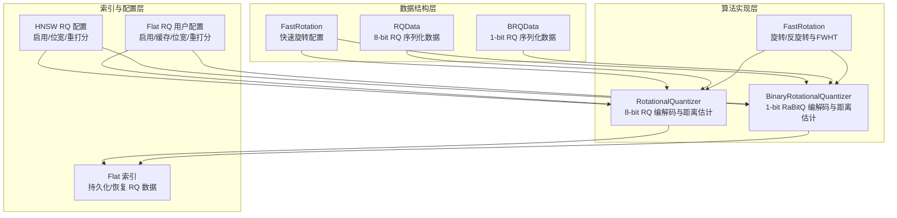
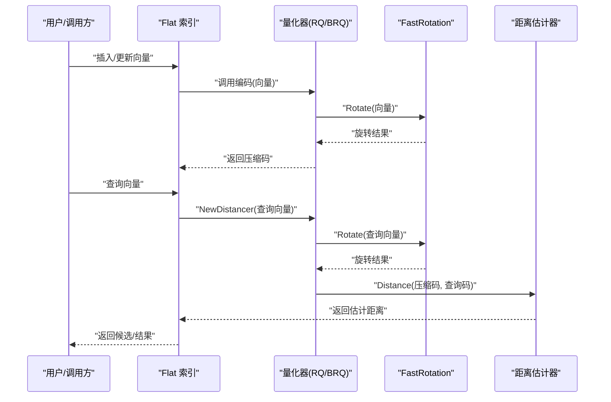
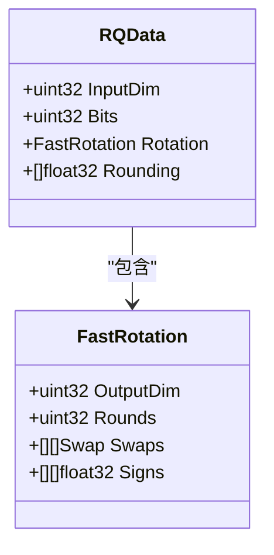
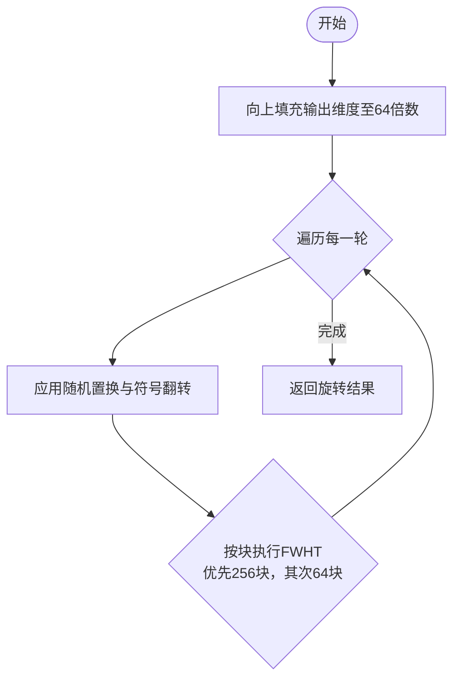
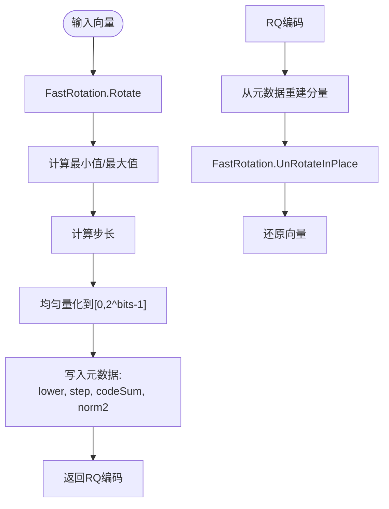
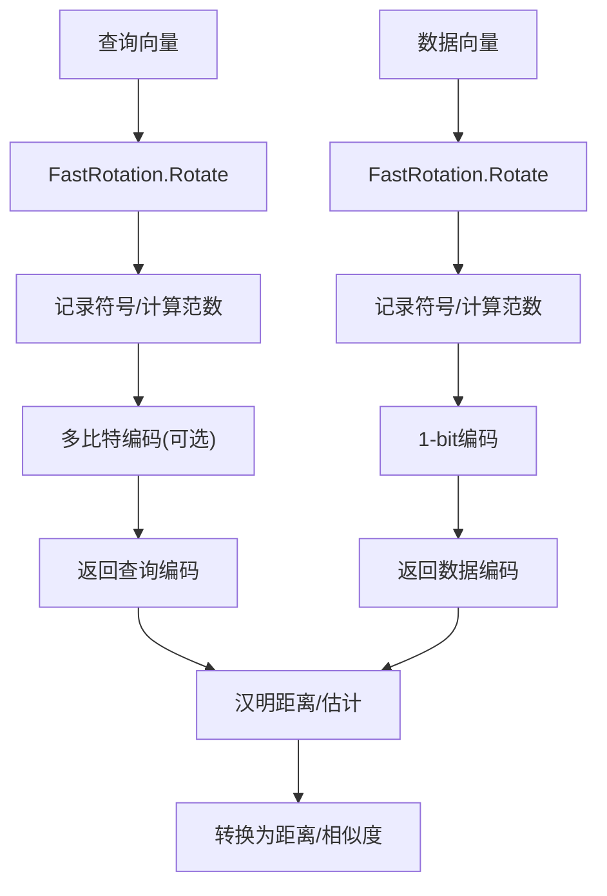
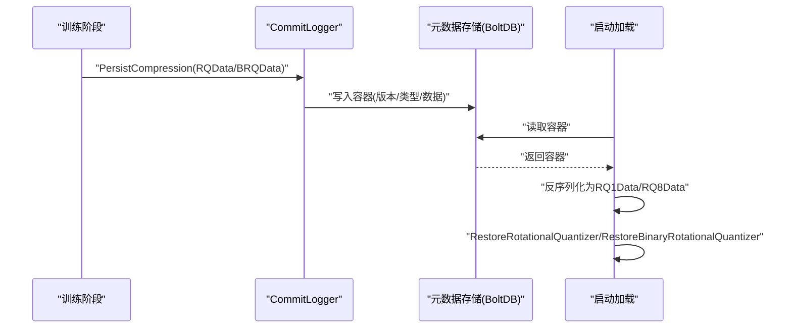
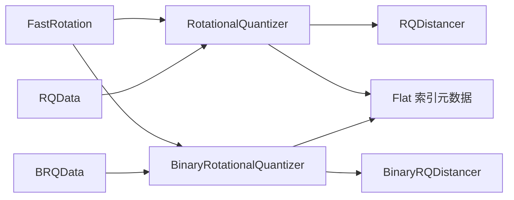

# RQ 压缩算法

<cite>
**本文档引用的文件**
- [entities/vectorindex/compression/rq_data.go](file://entities/vectorindex/compression/rq_data.go)
- [adapters/repos/db/vector/compressionhelpers/rotational_quantization.go](file://adapters/repos/db/vector/compressionhelpers/rotational_quantization.go)
- [adapters/repos/db/vector/compressionhelpers/binary_rotational_quantization.go](file://adapters/repos/db/vector/compressionhelpers/binary_rotational_quantization.go)
- [adapters/repos/db/vector/compressionhelpers/fast_rotation.go](file://adapters/repos/db/vector/compressionhelpers/fast_rotation.go)
- [entities/vectorindex/compression/fast_rotation.go](file://entities/vectorindex/compression/fast_rotation.go)
- [adapters/repos/db/vector/flat/metadata.go](file://adapters/repos/db/vector/flat/metadata.go)
- [entities/vectorindex/hnsw/rq_config.go](file://entities/vectorindex/hnsw/rq_config.go)
- [adapters/repos/db/vector/compressionhelpers/rotational_quantization_test.go](file://adapters/repos/db/vector/compressionhelpers/rotational_quantization_test.go)
- [adapters/repos/db/vector/compressionhelpers/binary_rotational_quantization_test.go](file://adapters/repos/db/vector/compressionhelpers/binary_rotational_quantization_test.go)
</cite>

## 目录
1. [简介](#简介)
2. [项目结构](#项目结构)
3. [核心组件](#核心组件)
4. [架构总览](#架构总览)
5. [详细组件分析](#详细组件分析)
6. [依赖关系分析](#依赖关系分析)
7. [性能考量](#性能考量)
8. [故障排查指南](#故障排查指南)
9. [结论](#结论)
10. [附录](#附录)

## 简介
本文件系统性解析 Weaviate 中的 RQ（Randomized Quantization，随机化量化）压缩算法，涵盖其核心思想、数据结构设计、快速旋转算法优化、配置参数与使用方式，并对 RQ 在高维向量压缩中的优势、复杂度与与其他压缩方法的对比进行深入分析。目标读者为机器学习工程师与高性能计算专家。

## 项目结构
RQ 相关实现主要分布在以下模块：
- 数据结构定义：位于 entities/vectorindex/compression，包含 RQData、BRQData 以及 FastRotation。
- 算法实现：位于 adapters/repos/db/vector/compressionhelpers，包含 8-bit RQ、1-bit（RaBitQ）二进制 RQ 及其距离估计器。
- 索引集成：位于 adapters/repos/db/vector/flat，负责持久化与恢复 RQ 配置与旋转矩阵。
- 配置接口：位于 entities/vectorindex/hnsw 与 flat 下的用户配置，定义启用开关、位宽与重打分阈值等。

**图表来源**
- [entities/vectorindex/compression/rq_data.go](file://entities/vectorindex/compression/rq_data.go#L14-L20)
- [entities/vectorindex/compression/fast_rotation.go](file://entities/vectorindex/compression/fast_rotation.go#L28-L34)
- [adapters/repos/db/vector/compressionhelpers/rotational_quantization.go](file://adapters/repos/db/vector/compressionhelpers/rotational_quantization.go#L26-L36)
- [adapters/repos/db/vector/compressionhelpers/binary_rotational_quantization.go](file://adapters/repos/db/vector/compressionhelpers/binary_rotational_quantization.go#L31-L39)
- [adapters/repos/db/vector/flat/metadata.go](file://adapters/repos/db/vector/flat/metadata.go#L41-L66)
- [entities/vectorindex/hnsw/rq_config.go](file://entities/vectorindex/hnsw/rq_config.go#L28-L32)

**章节来源**
- [entities/vectorindex/compression/rq_data.go](file://entities/vectorindex/compression/rq_data.go#L14-L20)
- [adapters/repos/db/vector/compressionhelpers/rotational_quantization.go](file://adapters/repos/db/vector/compressionhelpers/rotational_quantization.go#L26-L36)
- [adapters/repos/db/vector/compressionhelpers/binary_rotational_quantization.go](file://adapters/repos/db/vector/compressionhelpers/binary_rotational_quantization.go#L31-L39)
- [adapters/repos/db/vector/flat/metadata.go](file://adapters/repos/db/vector/flat/metadata.go#L41-L66)
- [entities/vectorindex/hnsw/rq_config.go](file://entities/vectorindex/hnsw/rq_config.go#L28-L32)

## 核心组件
- RQData 结构体：用于序列化 8-bit RQ 的输入维度、量化位宽与旋转矩阵配置，便于持久化与恢复。
- FastRotation 快速旋转：通过多轮随机置换、符号翻转与分块 FWHT（Friedman Walsh Hadamard Transform）实现高效随机旋转，保证旋转矩阵的正交性与可逆性。
- RotationalQuantizer（8-bit RQ）：对旋转后的向量进行区间归一化与均匀量化，输出字节级编码；提供编码、解码、距离估计与统计信息。
- BinaryRotationalQuantizer（1-bit RaBitQ）：对旋转后的向量按符号量化，支持查询端的多比特编码与高效的汉明距离估计；提供编码、解码、距离估计与统计信息。
- Flat 索引集成：负责将 RQ/BRQ 的序列化数据写入/读取到元数据存储，确保重启后可恢复压缩配置。
- 配置接口：HNSW 与 Flat 的用户配置分别控制是否启用 RQ、量化位宽（1 或 8）、重打分阈值等。

**章节来源**
- [entities/vectorindex/compression/rq_data.go](file://entities/vectorindex/compression/rq_data.go#L14-L20)
- [entities/vectorindex/compression/fast_rotation.go](file://entities/vectorindex/compression/fast_rotation.go#L28-L34)
- [adapters/repos/db/vector/compressionhelpers/rotational_quantization.go](file://adapters/repos/db/vector/compressionhelpers/rotational_quantization.go#L26-L36)
- [adapters/repos/db/vector/compressionhelpers/binary_rotational_quantization.go](file://adapters/repos/db/vector/compressionhelpers/binary_rotational_quantization.go#L31-L39)
- [adapters/repos/db/vector/flat/metadata.go](file://adapters/repos/db/vector/flat/metadata.go#L41-L66)
- [entities/vectorindex/hnsw/rq_config.go](file://entities/vectorindex/hnsw/rq_config.go#L28-L32)

## 架构总览
RQ 算法在 Weaviate 中的运行链路如下：
- 训练阶段：构建 FastRotation（多轮随机置换、符号翻转、分块 FWHT），并保存至 RQData/BRQData。
- 存储阶段：Flat 索引将 RQData/BRQData 写入元数据存储，供后续恢复。
- 查询阶段：根据启用的位宽（1 或 8），使用对应量化器进行编码/解码与距离估计；对于 8-bit RQ 使用浮点估计，对于 1-bit RaBitQ 使用符号估计与汉明距离。

**图表来源**
- [adapters/repos/db/vector/compressionhelpers/rotational_quantization.go](file://adapters/repos/db/vector/compressionhelpers/rotational_quantization.go#L169-L216)
- [adapters/repos/db/vector/compressionhelpers/binary_rotational_quantization.go](file://adapters/repos/db/vector/compressionhelpers/binary_rotational_quantization.go#L180-L208)
- [adapters/repos/db/vector/flat/metadata.go](file://adapters/repos/db/vector/flat/metadata.go#L244-L300)

## 详细组件分析

### RQData 结构体与序列化
- 字段含义
  - InputDim：输入向量维度
  - Bits：量化位宽（8-bit RQ）
  - Rotation：FastRotation 配置（轮数、置换、符号、输出维度）
  - Rounding：查询端随机化参数（仅 1-bit RaBitQ 使用）
- 设计要点
  - 将旋转矩阵的关键信息（轮数、置换对、符号）序列化，避免存储完整矩阵，降低空间开销。
  - 与 FastRotation 的输出维度保持一致，确保编码/解码一致性。

**图表来源**
- [entities/vectorindex/compression/rq_data.go](file://entities/vectorindex/compression/rq_data.go#L14-L20)
- [entities/vectorindex/compression/fast_rotation.go](file://entities/vectorindex/compression/fast_rotation.go#L28-L34)

**章节来源**
- [entities/vectorindex/compression/rq_data.go](file://entities/vectorindex/compression/rq_data.go#L14-L20)
- [entities/vectorindex/compression/fast_rotation.go](file://entities/vectorindex/compression/fast_rotation.go#L28-L34)

### 快速旋转算法（FastRotation）
- 核心思想
  - 多轮随机置换（每轮对输出维度进行两两交换）与随机符号翻转，随后对分块执行 FWHT（256 或 64 元素），实现近似正交变换。
  - 输出维度自动向上填充至 64 的倍数，保证分块处理效率。
- 优化策略
  - 分块处理：优先使用 256 元素块，其次 64 元素块，减少循环开销。
  - 近似正交性：FWHT 自逆且常数归一化，避免显式正交化，显著降低计算成本。
  - 内存局部性：排序后的置换对顺序访问，提高缓存命中率。
- 性能提升机制
  - 通过多轮随机化与分块 FWHT，使旋转后的向量各分量接近独立同分布，利于后续量化。
  - UnRotate 采用逆序执行，先做逆向 FWHT 再逆向置换，保证可逆性与数值稳定。

**图表来源**
- [entities/vectorindex/compression/fast_rotation.go](file://entities/vectorindex/compression/fast_rotation.go#L74-L92)
- [entities/vectorindex/compression/fast_rotation.go](file://entities/vectorindex/compression/fast_rotation.go#L103-L124)

**章节来源**
- [entities/vectorindex/compression/fast_rotation.go](file://entities/vectorindex/compression/fast_rotation.go#L74-L92)
- [entities/vectorindex/compression/fast_rotation.go](file://entities/vectorindex/compression/fast_rotation.go#L103-L124)
- [adapters/repos/db/vector/compressionhelpers/fast_rotation.go](file://adapters/repos/db/vector/compressionhelpers/fast_rotation.go#L21-L28)

### 8-bit RQ 编码与量化
- 向量预处理
  - 使用 FastRotation 对输入向量进行随机旋转，得到旋转向量。
  - 计算旋转向量的最小值与最大值，确定量化区间，步长为 (max-min)/(2^bits-1)。
- 量化编码
  - 对每个旋转分量进行均匀量化，映射到 [0, 2^bits-1]，以字节存储。
  - 保存元数据：下界、步长、量化和、向量范数平方，便于还原与距离估计。
- 解码与还原
  - 通过元数据重建每个分量：x_i = lower + step * c_i。
  - 使用 FastRotation 的 UnRotateInPlace 将还原后的向量反旋转回原始维度。
- 距离估计
  - 提供 RQDistancer，预提取元数据字段，避免重复解析。
  - 基于估计的点积与范数进行距离估计，支持余弦-点积、L2 平方与点积三种指标。

**图表来源**
- [adapters/repos/db/vector/compressionhelpers/rotational_quantization.go](file://adapters/repos/db/vector/compressionhelpers/rotational_quantization.go#L185-L216)
- [adapters/repos/db/vector/compressionhelpers/rotational_quantization.go](file://adapters/repos/db/vector/compressionhelpers/rotational_quantization.go#L226-L233)

**章节来源**
- [adapters/repos/db/vector/compressionhelpers/rotational_quantization.go](file://adapters/repos/db/vector/compressionhelpers/rotational_quantization.go#L185-L216)
- [adapters/repos/db/vector/compressionhelpers/rotational_quantization.go](file://adapters/repos/db/vector/compressionhelpers/rotational_quantization.go#L226-L233)

### 1-bit RaBitQ 编码与距离估计
- 编码流程
  - 对旋转向量逐位记录符号，形成位串；同时计算 L2 范数平方与 L1 范数，构造“步长”= L2^2/L1，作为估计因子。
  - 恢复时按平均范数 ±step，将位串映射为 ±norm/sqrt(D)。
- 查询端多比特编码（可选）
  - 对查询向量进行多比特编码（如 5 比特），使用随机化取整避免偏差，结合汉明距离进行估计。
- 距离估计
  - 1-bit RaBitQ 使用汉明距离与 Cos(π·Δ) 的组合估计余弦相似度，再转换为点积估计。
  - 1-bit RaBitQ 支持两种距离估计路径：纯位串汉明距离与 SIMD 加速版本。

**图表来源**
- [adapters/repos/db/vector/compressionhelpers/binary_rotational_quantization.go](file://adapters/repos/db/vector/compressionhelpers/binary_rotational_quantization.go#L180-L208)
- [adapters/repos/db/vector/compressionhelpers/binary_rotational_quantization.go](file://adapters/repos/db/vector/compressionhelpers/binary_rotational_quantization.go#L280-L335)
- [adapters/repos/db/vector/compressionhelpers/binary_rotational_quantization.go](file://adapters/repos/db/vector/compressionhelpers/binary_rotational_quantization.go#L387-L409)

**章节来源**
- [adapters/repos/db/vector/compressionhelpers/binary_rotational_quantization.go](file://adapters/repos/db/vector/compressionhelpers/binary_rotational_quantization.go#L180-L208)
- [adapters/repos/db/vector/compressionhelpers/binary_rotational_quantization.go](file://adapters/repos/db/vector/compressionhelpers/binary_rotational_quantization.go#L280-L335)
- [adapters/repos/db/vector/compressionhelpers/binary_rotational_quantization.go](file://adapters/repos/db/vector/compressionhelpers/binary_rotational_quantization.go#L387-L409)

### Flat 索引中的持久化与恢复
- 持久化
  - Flat 索引在训练完成后，通过 CommitLogger 捕获 RQData/BRQData，并写入 BoltDB 元数据桶。
- 恢复
  - 启动时从元数据读取容器，反序列化为 RQ1Data/RQ8Data，再调用 Restore 接口重建量化器。
- 版本与类型校验
  - 容器包含版本号与压缩类型字符串，确保兼容性与一致性。

**图表来源**
- [adapters/repos/db/vector/flat/metadata.go](file://adapters/repos/db/vector/flat/metadata.go#L244-L300)
- [adapters/repos/db/vector/flat/metadata.go](file://adapters/repos/db/vector/flat/metadata.go#L382-L472)

**章节来源**
- [adapters/repos/db/vector/flat/metadata.go](file://adapters/repos/db/vector/flat/metadata.go#L244-L300)
- [adapters/repos/db/vector/flat/metadata.go](file://adapters/repos/db/vector/flat/metadata.go#L382-L472)

### 配置参数说明
- HNSW RQ 配置
  - Enabled：是否启用 RQ
  - Bits：量化位宽（仅允许 1 或 8）
  - RescoreLimit：重打分阈值（1-bit 默认较大，以平衡召回）
- Flat RQ 用户配置
  - Enabled：是否启用 RQ
  - Cache：是否启用缓存（需配合 Enabled）
  - RescoreLimit：重打分阈值
  - Bits：量化位宽（1 或 8）

注意：Weaviate 当前 Flat 索引不支持 PQ/SQ，默认仅支持 RQ 与 BQ；RQ 与 BQ 不可同时启用。

**章节来源**
- [entities/vectorindex/hnsw/rq_config.go](file://entities/vectorindex/hnsw/rq_config.go#L28-L32)
- [entities/vectorindex/hnsw/rq_config.go](file://entities/vectorindex/hnsw/rq_config.go#L34-L43)
- [adapters/repos/db/vector/flat/metadata.go](file://adapters/repos/db/vector/flat/metadata.go#L48-L66)

## 依赖关系分析
- 组件耦合
  - RotationalQuantizer/BinaryRotationalQuantizer 依赖 FastRotation 完成旋转/反旋转。
  - RQData/BRQData 作为序列化契约，被 Flat 索引持久化/恢复。
  - 距离估计器（RQDistancer、BinaryRQDistancer）依赖量化器提供的元数据与编码格式。
- 外部依赖
  - Go 标准库 rand/v2 用于生成随机置换与符号。
  - CPU 特定 SIMD 指令（如 AVX2/AVX-512/NEON）加速汉明距离计算（在 RaBitQ 距离估计中使用）。

**图表来源**
- [entities/vectorindex/compression/fast_rotation.go](file://entities/vectorindex/compression/fast_rotation.go#L28-L34)
- [adapters/repos/db/vector/compressionhelpers/rotational_quantization.go](file://adapters/repos/db/vector/compressionhelpers/rotational_quantization.go#L26-L36)
- [adapters/repos/db/vector/compressionhelpers/binary_rotational_quantization.go](file://adapters/repos/db/vector/compressionhelpers/binary_rotational_quantization.go#L31-L39)
- [adapters/repos/db/vector/flat/metadata.go](file://adapters/repos/db/vector/flat/metadata.go#L41-L66)

**章节来源**
- [entities/vectorindex/compression/fast_rotation.go](file://entities/vectorindex/compression/fast_rotation.go#L28-L34)
- [adapters/repos/db/vector/compressionhelpers/rotational_quantization.go](file://adapters/repos/db/vector/compressionhelpers/rotational_quantization.go#L26-L36)
- [adapters/repos/db/vector/compressionhelpers/binary_rotational_quantization.go](file://adapters/repos/db/vector/compressionhelpers/binary_rotational_quantization.go#L31-L39)
- [adapters/repos/db/vector/flat/metadata.go](file://adapters/repos/db/vector/flat/metadata.go#L41-L66)

## 性能考量
- 时间复杂度
  - 旋转：O(D)，其中 D 为输出维度（按 64/256 块分治，FWHT 常数因子较小）。
  - 8-bit RQ 编码/解码：O(D)，一次量化与一次重建。
  - 1-bit RaBitQ 编码：O(D)，逐位记录符号；距离估计使用汉明距离，O(D)。
- 空间复杂度
  - 8-bit RQ：元数据 16 字节 + 每维 1 字节，整体约为 16+D 字节。
  - 1-bit RaBitQ：元数据 8 字节 + 每维 0.125 字节（位存储），整体约为 8+D/8 字节。
- 优化点
  - FastRotation 使用分块 FWHT 与排序后的置换对，减少分支与提升缓存局部性。
  - 1-bit RaBitQ 在高维场景启用 SIMD 汉明距离加速（阈值约 512 维）。
  - 8-bit RQ 的距离估计预提取元数据，避免重复解析，减少热路径开销。

[本节为通用性能讨论，无需具体文件分析]

## 故障排查指南
- 编码/解码长度不匹配
  - 现象：距离估计或解码时报错“向量长度不匹配”。
  - 排查：确认输入维度与 FastRotation 输出维度一致；检查是否截断或填充导致长度差异。
- 零向量与退化情况
  - 现象：编码返回零码或距离估计异常。
  - 排查：当旋转后范围为 0 或输入为零向量时，算法会返回零码；需在上层逻辑处理。
- 元数据版本/类型不匹配
  - 现象：恢复失败或提示未知格式。
  - 排查：检查容器版本号与压缩类型字符串是否与当前实现兼容。
- 位宽配置错误
  - 现象：Flat/HNSW 配置校验失败。
  - 排查：确保 Bits 为 1 或 8；若启用缓存，需同时启用压缩。

**章节来源**
- [adapters/repos/db/vector/compressionhelpers/rotational_quantization.go](file://adapters/repos/db/vector/compressionhelpers/rotational_quantization.go#L297-L309)
- [adapters/repos/db/vector/compressionhelpers/rotational_quantization_test.go](file://adapters/repos/db/vector/compressionhelpers/rotational_quantization_test.go#L94-L99)
- [adapters/repos/db/vector/flat/metadata.go](file://adapters/repos/db/vector/flat/metadata.go#L425-L436)

## 结论
RQ（尤其是 RaBitQ）在高维向量检索中提供了极高的压缩比与较低的查询延迟，尤其适合大规模向量索引场景。8-bit RQ 在精度与压缩比之间取得良好平衡，而 1-bit RaBitQ 则进一步降低存储与带宽开销，适合对召回要求较高的场景。通过 FastRotation 的高效随机旋转与分块 FWHT，RQ 在工程上具备良好的可扩展性与稳定性。

[本节为总结性内容，无需具体文件分析]

## 附录

### RQ 与其他压缩方法的对比与选择建议
- 8-bit RQ vs 1-bit RaBitQ
  - 8-bit RQ：更高的精度，适合对召回敏感的场景；存储开销略高。
  - 1-bit RaBitQ：极致压缩比，适合超大规模向量库；可通过重打分阈值与随机化取整平衡召回。
- 与 PQ/SQ 的关系
  - Weaviate Flat 索引当前默认不支持 PQ/SQ；RQ 与 BQ 互斥，不可同时启用。
- 选择建议
  - 若内存/磁盘受限且可接受稍低精度：优先 1-bit RaBitQ。
  - 若对召回要求较高且资源充足：优先 8-bit RQ。
  - 需要与 HNSW 结合：参考 HNSW RQ 配置，合理设置 RescoreLimit。

**章节来源**
- [entities/vectorindex/hnsw/rq_config.go](file://entities/vectorindex/hnsw/rq_config.go#L28-L32)
- [adapters/repos/db/vector/flat/metadata.go](file://adapters/repos/db/vector/flat/metadata.go#L218-L231)