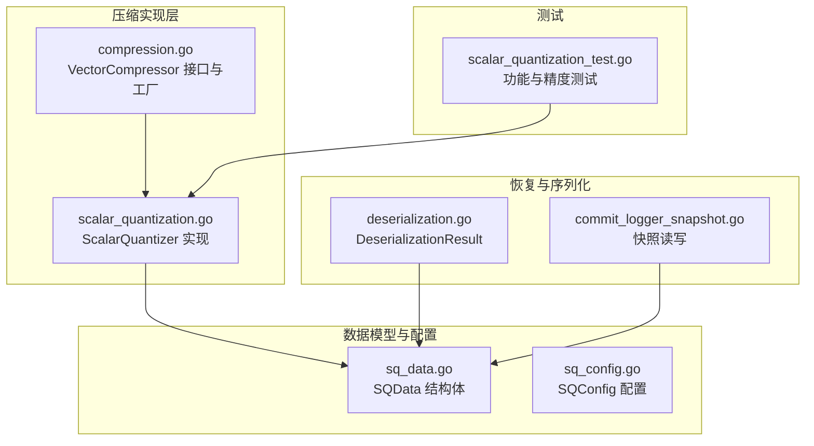
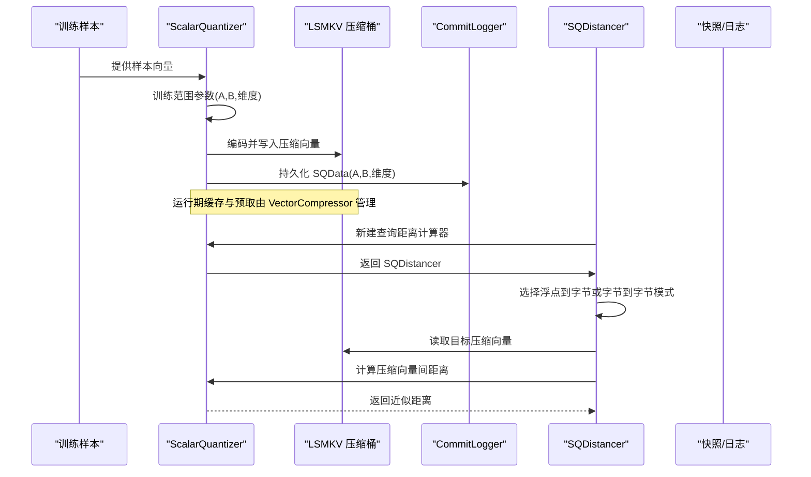
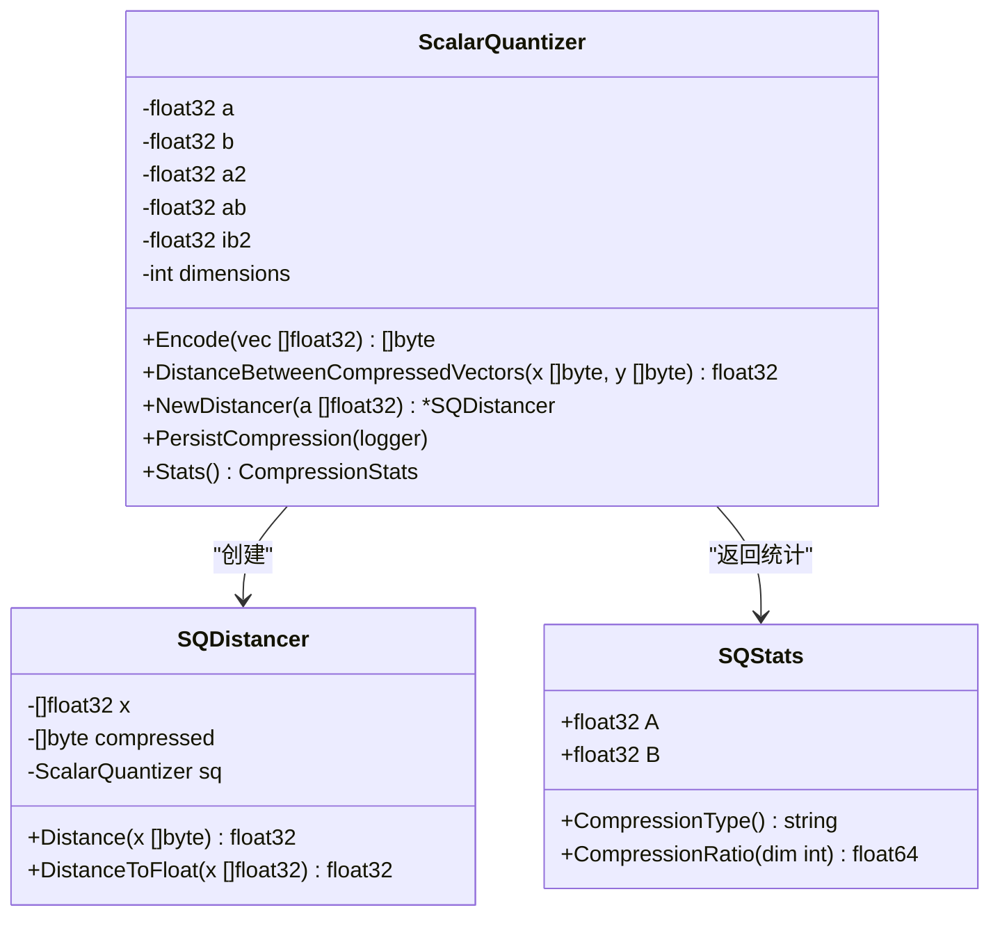
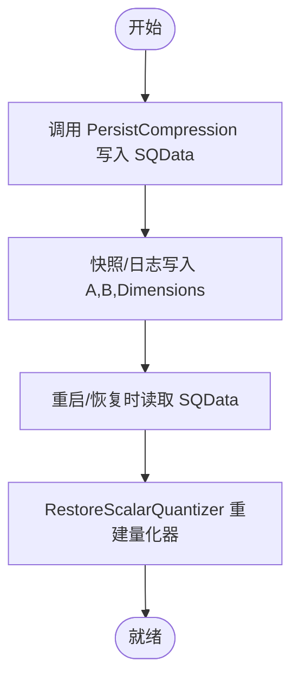
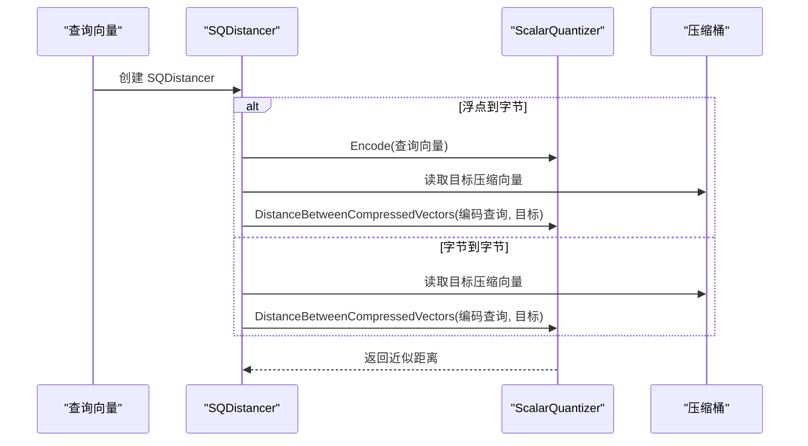
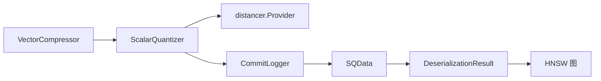

# SQ 压缩算法

<cite>
**本文引用的文件**
- [scalar_quantization.go](file://adapters/repos/db/vector/compressionhelpers/scalar_quantization.go)
- [compression.go](file://adapters/repos/db/vector/compressionhelpers/compression.go)
- [sq_data.go](file://entities/vectorindex/compression/sq_data.go)
- [sq_config.go](file://entities/vectorindex/hnsw/sq_config.go)
- [deserialization.go](file://entities/vectorindex/hnsw/deserialization.go)
- [commit_logger_snapshot.go](file://adapters/repos/db/vector/hnsw/commit_logger_snapshot.go)
- [scalar_quantization_test.go](file://adapters/repos/db/vector/compressionhelpers/scalar_quantization_test.go)
</cite>

## 目录
1. [简介](#简介)
2. [项目结构](#项目结构)
3. [核心组件](#核心组件)
4. [架构总览](#架构总览)
5. [详细组件分析](#详细组件分析)
6. [依赖关系分析](#依赖关系分析)
7. [性能考量](#性能考量)
8. [故障排查指南](#故障排查指南)
9. [结论](#结论)
10. [附录](#附录)

## 简介
本文件系统化梳理 Weaviate 中的 Scalar Quantization（SQ）压缩算法，面向存储优化工程师与向量数据库管理员，提供从原理到实现、从配置到最佳实践的完整技术文档。内容涵盖：
- SQ 基本原理：标量量化、范围映射与位宽策略
- SQData 结构体与持久化机制
- 反量化能力现状与精度控制
- 与其他压缩方案的对比与适用场景
- 训练统计、内存优化与性能调优建议
- 不同向量维度下的表现与配置建议

## 项目结构
SQ 压缩相关代码主要分布在以下模块：
- 压缩实现与接口层：compressionhelpers 包中的量化器与通用压缩接口
- 数据模型与配置：entities/vectorindex/compression 与 entities/vectorindex/hnsw 下的 SQData 与 SQConfig
- 恢复与序列化：hnsw 的提交日志与快照读写
- 测试与验证：compressionhelpers 包中的单元测试

图表来源
- [scalar_quantization.go](file://adapters/repos/db/vector/compressionhelpers/scalar_quantization.go#L29-L232)
- [compression.go](file://adapters/repos/db/vector/compressionhelpers/compression.go#L41-L87)
- [sq_data.go](file://entities/vectorindex/compression/sq_data.go#L14-L19)
- [sq_config.go](file://entities/vectorindex/hnsw/sq_config.go#L22-L26)
- [deserialization.go](file://entities/vectorindex/hnsw/deserialization.go#L37-L44)
- [commit_logger_snapshot.go](file://adapters/repos/db/vector/hnsw/commit_logger_snapshot.go#L1684-L1708)
- [scalar_quantization_test.go](file://adapters/repos/db/vector/compressionhelpers/scalar_quantization_test.go#L31-L131)

章节来源
- [scalar_quantization.go](file://adapters/repos/db/vector/compressionhelpers/scalar_quantization.go#L1-L233)
- [compression.go](file://adapters/repos/db/vector/compressionhelpers/compression.go#L1-L1031)
- [sq_data.go](file://entities/vectorindex/compression/sq_data.go#L1-L20)
- [sq_config.go](file://entities/vectorindex/hnsw/sq_config.go#L1-L59)
- [deserialization.go](file://entities/vectorindex/hnsw/deserialization.go#L1-L200)
- [commit_logger_snapshot.go](file://adapters/repos/db/vector/hnsw/commit_logger_snapshot.go#L1649-L1733)
- [scalar_quantization_test.go](file://adapters/repos/db/vector/compressionhelpers/scalar_quantization_test.go#L1-L205)

## 核心组件
- ScalarQuantizer：标量量化器，负责训练范围参数、编码/解码、距离计算与统计输出
- SQData：SQ 压缩参数的序列化载体（A、B、维度）
- SQConfig：SQ 在 HNSW 索引中的启用开关、训练上限与重评分上限
- VectorCompressor 接口族：统一的压缩向量存取与距离计算抽象
- SQDistancer：基于已编码查询向量的距离计算器

章节来源
- [scalar_quantization.go](file://adapters/repos/db/vector/compressionhelpers/scalar_quantization.go#L29-L232)
- [sq_data.go](file://entities/vectorindex/compression/sq_data.go#L14-L19)
- [sq_config.go](file://entities/vectorindex/hnsw/sq_config.go#L22-L26)
- [compression.go](file://adapters/repos/db/vector/compressionhelpers/compression.go#L41-L87)

## 架构总览
SQ 在 Weaviate 中的运行路径如下：
- 训练阶段：从样本向量中估计范围 [b, b+a]，得到量化参数 A=a/codes, B=b
- 编码阶段：对每个维度进行离散化并附加归一化统计（sum、sum2），形成压缩向量
- 存储阶段：压缩向量与键值对存储于 LSMKV 桶中，并通过 CommitLogger 持久化 SQData
- 查询阶段：支持两种模式
  - 浮点到字节：先对查询向量编码，再计算压缩向量间的距离
  - 字节到字节：直接以已编码查询向量参与距离计算
- 恢复阶段：从快照或提交日志读取 SQData 并重建量化器

图表来源
- [scalar_quantization.go](file://adapters/repos/db/vector/compressionhelpers/scalar_quantization.go#L68-L134)
- [compression.go](file://adapters/repos/db/vector/compressionhelpers/compression.go#L640-L701)
- [commit_logger_snapshot.go](file://adapters/repos/db/vector/hnsw/commit_logger_snapshot.go#L1684-L1708)

## 详细组件分析

### ScalarQuantizer 类与实现要点
- 参数训练
  - 通过扫描样本向量确定最小值 b 与范围 a，从而得到量化区间 [b, b+a]
  - 预计算常量 A=a/codes²、B=a*b/codes、C=b²*dimensions，用于距离近似
- 编码流程
  - 对每个维度执行 codeFor(x,a,b,codes)，将浮点映射到 [0,255] 的字节
  - 附加 8 字节统计：前 4 字节为 sum，后 4 字节为 sum2，便于后续距离近似
- 距离计算
  - 支持 L2-Squared、Dot、Cosine-Dot 三种度量
  - 利用量化参数与统计值进行闭式近似，避免解码回浮点
- 解码
  - 当前实现未提供 Decode 方法，解码仅在测试中使用，生产环境不依赖

图表来源
- [scalar_quantization.go](file://adapters/repos/db/vector/compressionhelpers/scalar_quantization.go#L29-L232)

章节来源
- [scalar_quantization.go](file://adapters/repos/db/vector/compressionhelpers/scalar_quantization.go#L29-L232)

### SQData 结构体与持久化
- 字段含义
  - A、B：训练得到的量化参数
  - Dimensions：向量维度
- 持久化位置
  - 通过 CommitLogger.AddSQCompression 写入
  - 快照与提交日志中以固定格式读写
- 恢复流程
  - 从快照/日志读取 A、B、Dimensions 后，调用 RestoreScalarQuantizer 重建量化器

图表来源
- [sq_data.go](file://entities/vectorindex/compression/sq_data.go#L14-L19)
- [scalar_quantization.go](file://adapters/repos/db/vector/compressionhelpers/scalar_quantization.go#L194-L200)
- [commit_logger_snapshot.go](file://adapters/repos/db/vector/hnsw/commit_logger_snapshot.go#L1684-L1708)

章节来源
- [sq_data.go](file://entities/vectorindex/compression/sq_data.go#L14-L19)
- [scalar_quantization.go](file://adapters/repos/db/vector/compressionhelpers/scalar_quantization.go#L194-L200)
- [commit_logger_snapshot.go](file://adapters/repos/db/vector/hnsw/commit_logger_snapshot.go#L1684-L1708)

### SQDistancer 与查询路径
- 浮点到字节模式
  - 先对查询向量编码，再与目标压缩向量计算距离
- 字节到字节模式
  - 使用已编码查询向量直接参与距离计算
- 距离类型
  - L2-Squared、Dot、Cosine-Dot 三种度量均支持

图表来源
- [scalar_quantization.go](file://adapters/repos/db/vector/compressionhelpers/scalar_quantization.go#L146-L170)

章节来源
- [scalar_quantization.go](file://adapters/repos/db/vector/compressionhelpers/scalar_quantization.go#L146-L170)

### SQConfig 与默认行为
- Enabled：是否启用 SQ 压缩
- TrainingLimit：训练样本上限
- RescoreLimit：重评分候选上限
- 默认值：SQ 默认关闭，训练上限与重评分上限有默认常量定义

章节来源
- [sq_config.go](file://entities/vectorindex/hnsw/sq_config.go#L16-L26)

### 统计与压缩比
- SQStats 提供压缩类型标识与压缩比估算
- 压缩比约为 4:1（原始 float32=4 字节/维度，压缩=1 字节+8 字节统计，对大维度而言统计开销可忽略）

章节来源
- [scalar_quantization.go](file://adapters/repos/db/vector/compressionhelpers/scalar_quantization.go#L206-L232)

## 依赖关系分析
- ScalarQuantizer 依赖 distancer.Provider 以支持多种距离度量
- VectorCompressor 抽象屏蔽了具体量化器差异，统一提供预取、缓存、距离计算等能力
- SQData 作为跨进程/跨版本的稳定序列化载体，被快照与提交日志读写
- 恢复流程通过 DeserializationResult 将压缩状态注入到 HNSW 图结构中

图表来源
- [scalar_quantization.go](file://adapters/repos/db/vector/compressionhelpers/scalar_quantization.go#L14-L22)
- [compression.go](file://adapters/repos/db/vector/compressionhelpers/compression.go#L41-L87)
- [sq_data.go](file://entities/vectorindex/compression/sq_data.go#L14-L19)
- [deserialization.go](file://entities/vectorindex/hnsw/deserialization.go#L37-L44)

章节来源
- [scalar_quantization.go](file://adapters/repos/db/vector/compressionhelpers/scalar_quantization.go#L14-L22)
- [compression.go](file://adapters/repos/db/vector/compressionhelpers/compression.go#L41-L87)
- [sq_data.go](file://entities/vectorindex/compression/sq_data.go#L14-L19)
- [deserialization.go](file://entities/vectorindex/hnsw/deserialization.go#L37-L44)

## 性能考量
- 压缩比与内存占用
  - 压缩比约 4:1，适合大规模向量索引的内存优化
  - 大维度下统计开销占比极小，整体接近 4x 压缩
- 训练成本
  - 训练复杂度与样本数量线性相关，可通过 TrainingLimit 控制
- 查询延迟
  - 距离计算在压缩域完成，避免解码回浮点，查询延迟显著降低
- 缓存与预取
  - VectorCompressor 提供缓存与并行预取，减少磁盘 IO
- 精度与召回
  - 测试表明在常见距离度量下，召回率可达 95%+，满足大多数检索需求

章节来源
- [scalar_quantization.go](file://adapters/repos/db/vector/compressionhelpers/scalar_quantization.go#L215-L225)
- [scalar_quantization_test.go](file://adapters/repos/db/vector/compressionhelpers/scalar_quantization_test.go#L72-L131)

## 故障排查指南
- 无法解码
  - 当前实现未提供 Decode 方法，如需解码请参考测试中的使用方式
- 距离计算异常
  - 确认输入向量长度与训练维度一致
  - 检查距离类型是否受支持
- 恢复失败
  - 确认快照/日志中 SQData 字段完整且顺序正确
  - 校验 A/B 是否为有效数值
- 训练不足
  - 若样本过少导致范围估计不准，可适当提高 TrainingLimit 或增加样本多样性

章节来源
- [scalar_quantization.go](file://adapters/repos/db/vector/compressionhelpers/scalar_quantization.go#L136-L138)
- [commit_logger_snapshot.go](file://adapters/repos/db/vector/hnsw/commit_logger_snapshot.go#L1684-L1708)

## 结论
SQ 压缩在 Weaviate 中提供了稳定的 4x 压缩比与高效的查询性能，适用于大规模向量索引的内存与吞吐优化。其训练简单、部署便捷，且在多种距离度量下保持良好召回。对于需要更高压缩比或更灵活位宽的场景，可结合其他压缩方案（如 PQ、RQ、BRQ）进行组合使用。

## 附录

### SQ 压缩配置最佳实践
- 启用策略
  - 默认关闭，建议在生产环境中按需开启
  - 对高维向量（如 1000+）优先考虑启用
- 训练统计
  - TrainingLimit 建议设置为 10万~100万之间，确保范围估计稳定
  - 若数据分布变化较大，可定期重新训练
- 内存优化
  - 合理设置 VectorCompressor 缓存大小，平衡命中率与内存占用
  - 使用并行预取与分片缓存提升冷启动性能
- 精度控制
  - 在 L2-Squared、Dot、Cosine-Dot 三类度量下均可使用
  - 如对精度敏感，可结合重评分（RescoreLimit）策略提升 Top-K 准确性

章节来源
- [sq_config.go](file://entities/vectorindex/hnsw/sq_config.go#L16-L26)
- [compression.go](file://adapters/repos/db/vector/compressionhelpers/compression.go#L640-L701)

### 不同维度下的性能与适用场景
- 低维（<512）
  - 压缩比收益有限，建议评估是否启用
- 中高维（512~2048）
  - SQ 压缩比稳定，查询延迟显著下降，推荐启用
- 超高维（>2048）
  - 压缩比接近 4x，内存节省显著，强烈推荐启用

章节来源
- [scalar_quantization.go](file://adapters/repos/db/vector/compressionhelpers/scalar_quantization.go#L215-L225)