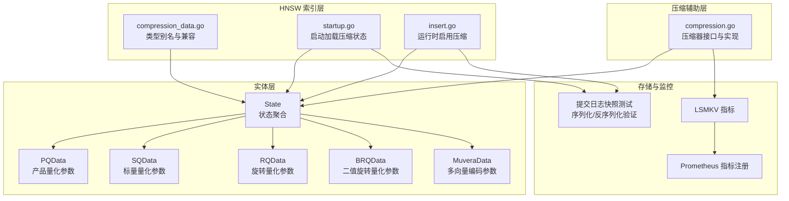
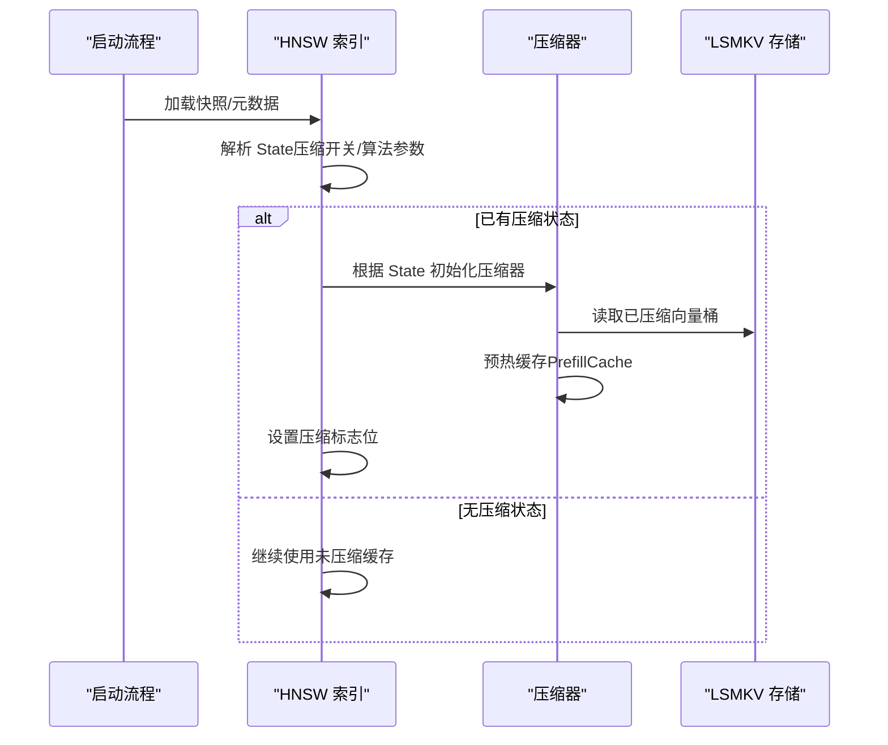
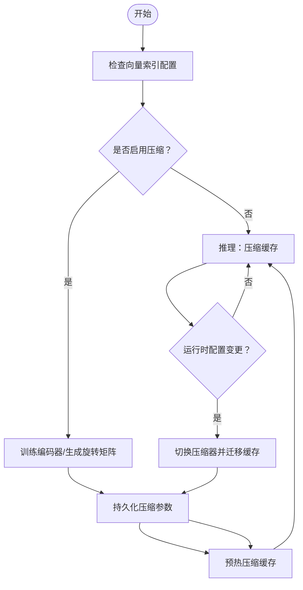
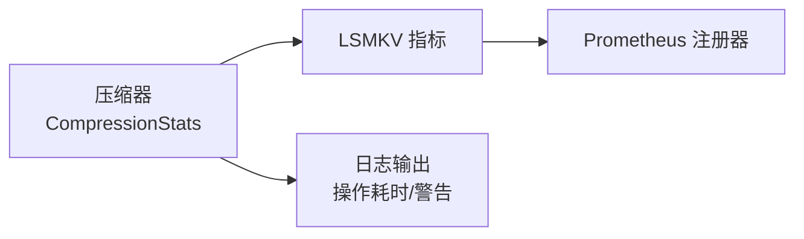
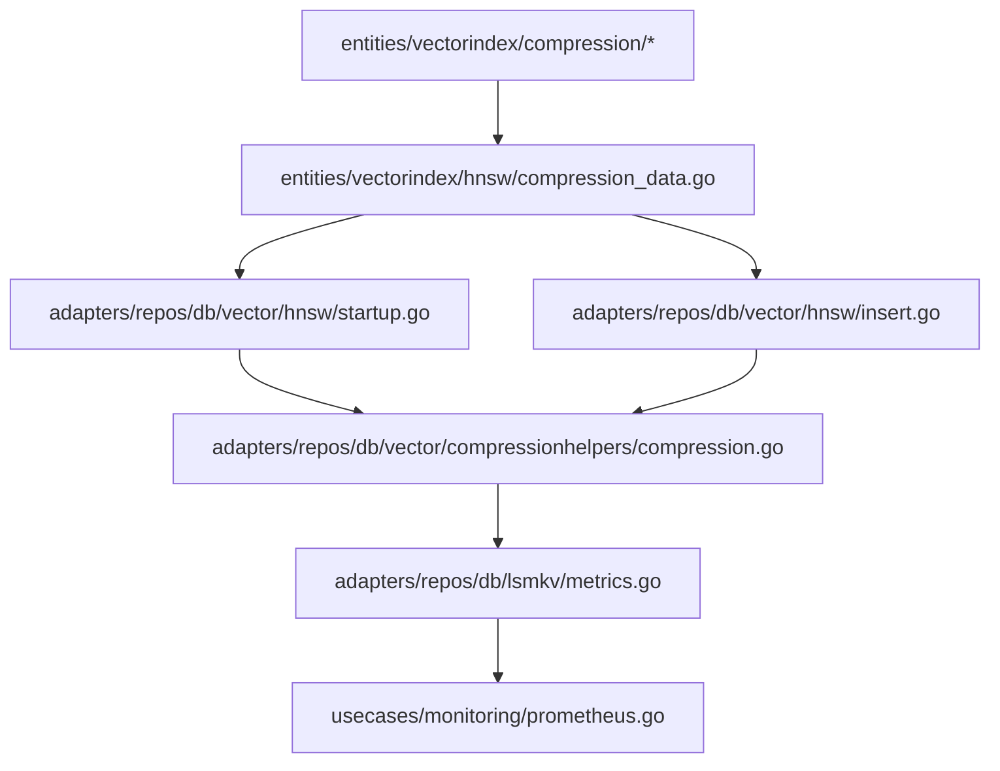

# 压缩状态管理

<cite>
**本文引用的文件**
- [state.go](file://entities/vectorindex/compression/state.go)
- [pq_data.go](file://entities/vectorindex/compression/pq_data.go)
- [sq_data.go](file://entities/vectorindex/compression/sq_data.go)
- [rq_data.go](file://entities/vectorindex/compression/rq_data.go)
- [brq_data.go](file://entities/vectorindex/compression/brq_data.go)
- [muvera_data.go](file://entities/vectorindex/compression/muvera_data.go)
- [compression_data.go](file://entities/vectorindex/hnsw/compression_data.go)
- [compression.go](file://adapters/repos/db/vector/compressionhelpers/compression.go)
- [startup.go](file://adapters/repos/db/vector/hnsw/startup.go)
- [insert.go](file://adapters/repos/db/vector/hnsw/insert.go)
- [commit_logger_snapshot_test.go](file://adapters/repos/db/vector/hnsw/commit_logger_snapshot_test.go)
- [compression_test.go](file://test/acceptance_with_go_client/compression/compression_test.go)
- [metrics.go](file://adapters/repos/db/lsmkv/metrics.go)
- [prometheus.go](file://usecases/monitoring/prometheus.go)
</cite>

## 目录
1. [简介](#简介)
2. [项目结构](#项目结构)
3. [核心组件](#核心组件)
4. [架构总览](#架构总览)
5. [详细组件分析](#详细组件分析)
6. [依赖关系分析](#依赖关系分析)
7. [性能考量](#性能考量)
8. [故障排查指南](#故障排查指南)
9. [结论](#结论)
10. [附录](#附录)

## 简介
本文件针对 Weaviate 向量索引的“压缩状态管理”进行系统化技术文档编制，覆盖以下关键目标：
- 压缩状态的数据结构设计：状态序列化、版本管理与持久化机制
- 压缩状态生命周期：训练状态、推理状态、更新状态的转换流程
- 分布式环境中的同步策略与一致性保障
- 监控与调试方法：状态查询、性能指标采集与异常处理
- 对系统性能的影响与优化策略
- 迁移、备份与恢复、故障诊断的实用指南

## 项目结构
Weaviate 将压缩状态相关的核心定义集中在实体层（entities/vectorindex/compression），并在 HNSW 索引层与压缩辅助层（compressionhelpers）中实现状态的读取、持久化与运行时行为。

**图表来源**
- [state.go](file://entities/vectorindex/compression/state.go#L14-L37)
- [pq_data.go](file://entities/vectorindex/compression/pq_data.go#L40-L50)
- [sq_data.go](file://entities/vectorindex/compression/sq_data.go#L14-L19)
- [rq_data.go](file://entities/vectorindex/compression/rq_data.go#L14-L20)
- [brq_data.go](file://entities/vectorindex/compression/brq_data.go#L14-L19)
- [muvera_data.go](file://entities/vectorindex/compression/muvera_data.go#L14-L23)
- [compression_data.go](file://entities/vectorindex/hnsw/compression_data.go#L18-L52)
- [startup.go](file://adapters/repos/db/vector/hnsw/startup.go#L189-L232)
- [insert.go](file://adapters/repos/db/vector/hnsw/insert.go#L274-L304)
- [compression.go](file://adapters/repos/db/vector/compressionhelpers/compression.go#L48-L87)
- [commit_logger_snapshot_test.go](file://adapters/repos/db/vector/hnsw/commit_logger_snapshot_test.go#L870-L1323)
- [metrics.go](file://adapters/repos/db/lsmkv/metrics.go#L103-L126)
- [prometheus.go](file://usecases/monitoring/prometheus.go#L407-L424)

**章节来源**
- [state.go](file://entities/vectorindex/compression/state.go#L14-L37)
- [compression_data.go](file://entities/vectorindex/hnsw/compression_data.go#L18-L52)
- [compression.go](file://adapters/repos/db/vector/compressionhelpers/compression.go#L48-L87)

## 核心组件
- 状态聚合 State：统一承载压缩开关与各类压缩算法参数，作为 HNSW 索引压缩能力的根数据结构。
- 各类压缩参数结构：PQData、SQData、RQData、BRQData、MuveraData，分别对应产品量化、标量量化、旋转量化、二值旋转量化与多向量编码。
- 压缩器接口与实现：VectorCompressor 抽象了压缩向量的增删改查、距离计算、缓存预热与持久化等能力；具体实现按压缩算法选择。
- 启动与运行时切换：startup 负责从磁盘恢复压缩状态；insert 在运行时根据配置触发压缩启用与缓存迁移。

**章节来源**
- [state.go](file://entities/vectorindex/compression/state.go#L14-L37)
- [pq_data.go](file://entities/vectorindex/compression/pq_data.go#L40-L50)
- [sq_data.go](file://entities/vectorindex/compression/sq_data.go#L14-L19)
- [rq_data.go](file://entities/vectorindex/compression/rq_data.go#L14-L20)
- [brq_data.go](file://entities/vectorindex/compression/brq_data.go#L14-L19)
- [muvera_data.go](file://entities/vectorindex/compression/muvera_data.go#L14-L23)
- [compression.go](file://adapters/repos/db/vector/compressionhelpers/compression.go#L60-L87)
- [startup.go](file://adapters/repos/db/vector/hnsw/startup.go#L189-L232)
- [insert.go](file://adapters/repos/db/vector/hnsw/insert.go#L274-L304)

## 架构总览
Weaviate 的压缩状态管理采用“状态驱动 + 存储持久化 + 缓存加速”的三层架构：
- 状态层：以 State 为核心，承载压缩开关与算法参数，用于序列化/反序列化与跨进程/节点传播。
- 存储层：通过 LSMKV 桶存储压缩后的向量字节，并由压缩器负责读写与缓存预热。
- 运行时层：在启动阶段恢复压缩状态，在运行时根据配置动态启用压缩并完成缓存迁移。

**图表来源**
- [startup.go](file://adapters/repos/db/vector/hnsw/startup.go#L189-L232)
- [compression.go](file://adapters/repos/db/vector/compressionhelpers/compression.go#L292-L366)

**章节来源**
- [startup.go](file://adapters/repos/db/vector/hnsw/startup.go#L189-L232)
- [commit_logger_snapshot_test.go](file://adapters/repos/db/vector/hnsw/commit_logger_snapshot_test.go#L870-L1323)

## 详细组件分析

### 数据结构与序列化
- State：聚合压缩开关与各算法参数，支持快速判断是否启用压缩与多向量编码。
- PQData：包含分段数、码本规模、维度、编码器类型与分布、是否使用位压缩、训练上限等。
- SQData/RQData/BRQData：分别描述线性变换与量化参数、旋转矩阵与舍入参数、输入维度与旋转参数。
- MuveraData：多向量编码的超参集合，含相似度阈值、聚类数、维度、投影数、重复次数及高斯与投影矩阵。

这些结构在 HNSW 快照与提交日志中被序列化/反序列化，确保跨版本与跨实例的一致性。

**章节来源**
- [state.go](file://entities/vectorindex/compression/state.go#L14-L37)
- [pq_data.go](file://entities/vectorindex/compression/pq_data.go#L40-L50)
- [sq_data.go](file://entities/vectorindex/compression/sq_data.go#L14-L19)
- [rq_data.go](file://entities/vectorindex/compression/rq_data.go#L14-L20)
- [brq_data.go](file://entities/vectorindex/compression/brq_data.go#L14-L19)
- [muvera_data.go](file://entities/vectorindex/compression/muvera_data.go#L14-L23)
- [commit_logger_snapshot_test.go](file://adapters/repos/db/vector/hnsw/commit_logger_snapshot_test.go#L870-L1323)

### 生命周期管理：训练、推理、更新
- 训练状态：在创建或更新向量索引配置时，若启用 PQ/SQ/RQ/BRQ/Muvera，系统会基于样本数据训练编码器或生成旋转矩阵等参数。
- 推理状态：启动时根据快照/元数据恢复压缩器，将已压缩向量加载到缓存，随后所有查询均通过压缩器进行距离计算。
- 更新状态：在运行时根据配置变更动态启用压缩（如插入路径中检测到 RQ 开关），完成缓存迁移与持久化。

**图表来源**
- [insert.go](file://adapters/repos/db/vector/hnsw/insert.go#L274-L304)
- [startup.go](file://adapters/repos/db/vector/hnsw/startup.go#L189-L232)
- [compression.go](file://adapters/repos/db/vector/compressionhelpers/compression.go#L434-L436)

**章节来源**
- [insert.go](file://adapters/repos/db/vector/hnsw/insert.go#L274-L304)
- [startup.go](file://adapters/repos/db/vector/hnsw/startup.go#L189-L232)
- [compression_test.go](file://test/acceptance_with_go_client/compression/compression_test.go#L287-L325)

### 分布式同步与一致性
- 版本化快照：通过提交日志与快照文件记录压缩状态字段，测试用例覆盖 v3 元数据的完整字段校验，确保不同版本间可正确恢复。
- 类型别名与兼容：HNSW 层提供类型别名，保证历史代码与新实体包的兼容性。
- 一致性保障：在恢复过程中，若检测到不支持的压缩类型则返回错误；在运行时启用压缩前，先预热缓存再切换，避免查询路径中断。

**章节来源**
- [commit_logger_snapshot_test.go](file://adapters/repos/db/vector/hnsw/commit_logger_snapshot_test.go#L870-L1323)
- [compression_data.go](file://entities/vectorindex/hnsw/compression_data.go#L18-L52)
- [startup.go](file://adapters/repos/db/vector/hnsw/startup.go#L217-L227)

### 监控与调试
- 指标采集：LSMKV 指标包含压缩向量桶的段数量、大小、IO 等，便于评估压缩带来的存储与 IO 变化。
- Prometheus 注册：指标通过注册器确保幂等注册，避免重复注册导致的异常。
- 查询与统计：压缩器暴露 CompressionStats 接口，可用于查询压缩类型与压缩比等信息。

**图表来源**
- [compression.go](file://adapters/repos/db/vector/compressionhelpers/compression.go#L202-L204)
- [metrics.go](file://adapters/repos/db/lsmkv/metrics.go#L103-L126)
- [prometheus.go](file://usecases/monitoring/prometheus.go#L407-L424)

**章节来源**
- [compression.go](file://adapters/repos/db/vector/compressionhelpers/compression.go#L202-L204)
- [metrics.go](file://adapters/repos/db/lsmkv/metrics.go#L103-L126)
- [prometheus.go](file://usecases/monitoring/prometheus.go#L407-L424)

## 依赖关系分析
- 实体层依赖：HNSW 层通过类型别名复用压缩数据结构，降低耦合。
- 运行时依赖：压缩器依赖 LSMKV 存储桶、缓存模块与距离提供器；启动与插入路径共同决定压缩状态的生命周期。
- 监控依赖：LSMKV 指标与 Prometheus 注册器形成解耦的观测面。

**图表来源**
- [compression_data.go](file://entities/vectorindex/hnsw/compression_data.go#L18-L52)
- [startup.go](file://adapters/repos/db/vector/hnsw/startup.go#L189-L232)
- [insert.go](file://adapters/repos/db/vector/hnsw/insert.go#L274-L304)
- [compression.go](file://adapters/repos/db/vector/compressionhelpers/compression.go#L48-L87)
- [metrics.go](file://adapters/repos/db/lsmkv/metrics.go#L103-L126)
- [prometheus.go](file://usecases/monitoring/prometheus.go#L407-L424)

**章节来源**
- [compression_data.go](file://entities/vectorindex/hnsw/compression_data.go#L18-L52)
- [startup.go](file://adapters/repos/db/vector/hnsw/startup.go#L189-L232)
- [insert.go](file://adapters/repos/db/vector/hnsw/insert.go#L274-L304)
- [compression.go](file://adapters/repos/db/vector/compressionhelpers/compression.go#L48-L87)
- [metrics.go](file://adapters/repos/db/lsmkv/metrics.go#L103-L126)
- [prometheus.go](file://usecases/monitoring/prometheus.go#L407-L424)

## 性能考量
- 缓存预热：在恢复或启用压缩后，通过批量迭代与一次性增长缓存容量，显著减少 CPU 占用与内存碎片。
- 并发控制：压缩器使用分片锁缓存，提升并发场景下的吞吐与稳定性。
- 存储 IO：压缩后向量以字节形式存储，LSMKV 指标可观察段数量与大小变化，辅助容量规划与调优。

**章节来源**
- [compression.go](file://adapters/repos/db/vector/compressionhelpers/compression.go#L306-L366)
- [compression.go](file://adapters/repos/db/vector/compressionhelpers/compression.go#L368-L432)

## 故障排查指南
- 快照版本不匹配：测试用例覆盖了无效版本导致失败的情况，建议在升级或迁移时严格校验快照版本。
- 不支持的压缩类型：启动时若遇到未知压缩类型，会返回错误；请确认配置与算法支持范围。
- 缓存预热中断：若预热过程被中断，日志会记录“预热压缩向量缓存已中止”，需检查资源与并发设置。
- 指标缺失：若指标未出现，请确认 Prometheus 注册器已初始化且未重复注册。

**章节来源**
- [commit_logger_snapshot_test.go](file://adapters/repos/db/vector/hnsw/commit_logger_snapshot_test.go#L1299-L1323)
- [startup.go](file://adapters/repos/db/vector/hnsw/startup.go#L225-L227)
- [compression.go](file://adapters/repos/db/vector/compressionhelpers/compression.go#L339-L345)
- [prometheus.go](file://usecases/monitoring/prometheus.go#L407-L424)

## 结论
Weaviate 的压缩状态管理以 State 为核心，结合实体层参数结构、HNSW 启动与运行时逻辑以及压缩器实现，形成了从训练、推理到更新的完整生命周期闭环。通过版本化快照与类型别名兼容，系统在分布式环境中具备良好的一致性与可移植性；配合 LSMKV 与 Prometheus 指标体系，能够有效监控与优化压缩带来的性能收益。

## 附录
- 迁移与备份：利用快照与提交日志进行状态迁移；在备份前确保压缩状态已持久化。
- 恢复与回滚：通过快照恢复压缩状态；若配置变更导致问题，可回退到上一版本快照。
- 故障诊断：结合日志、指标与测试用例中的断言点，定位压缩启用、缓存预热与持久化环节的问题。