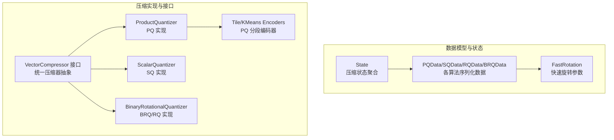
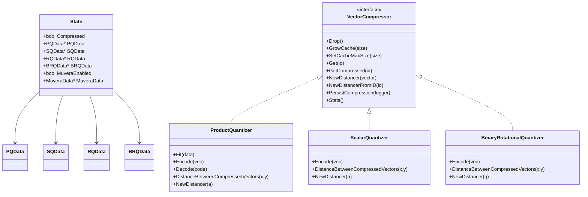
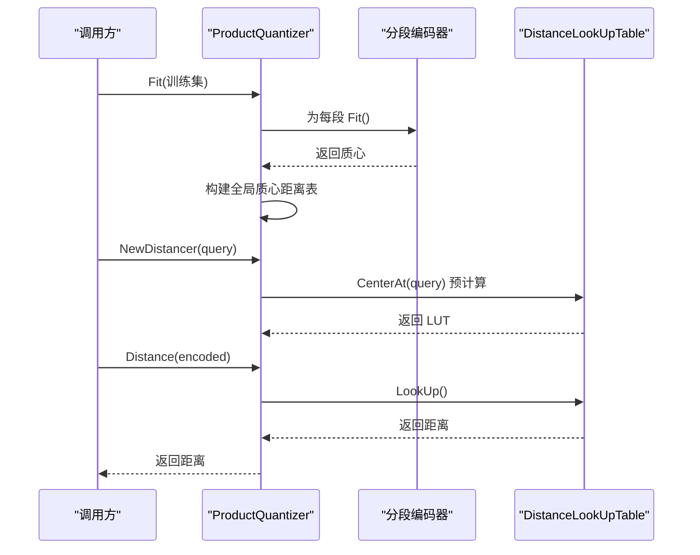
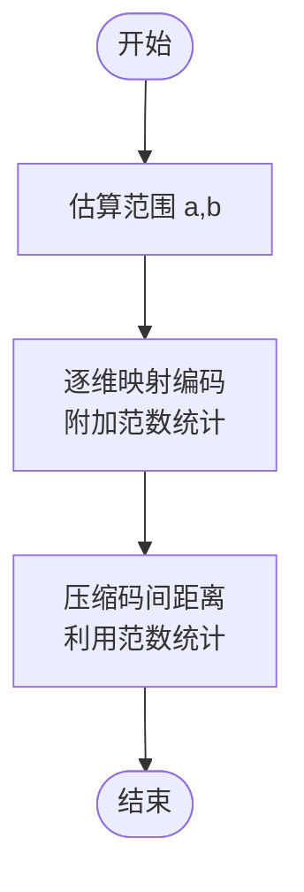
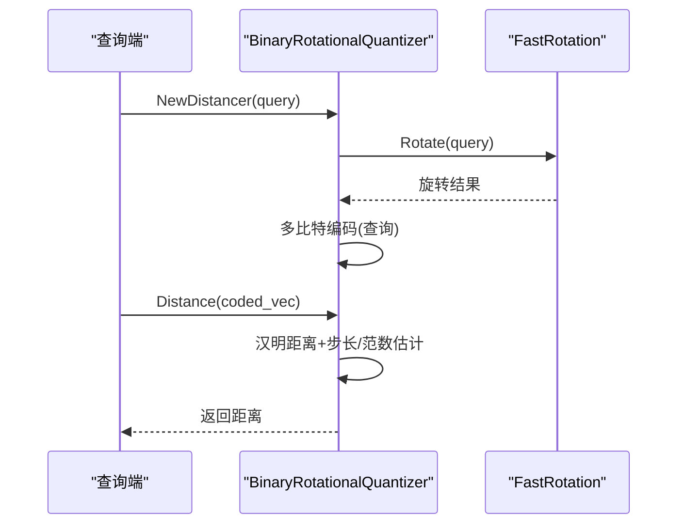
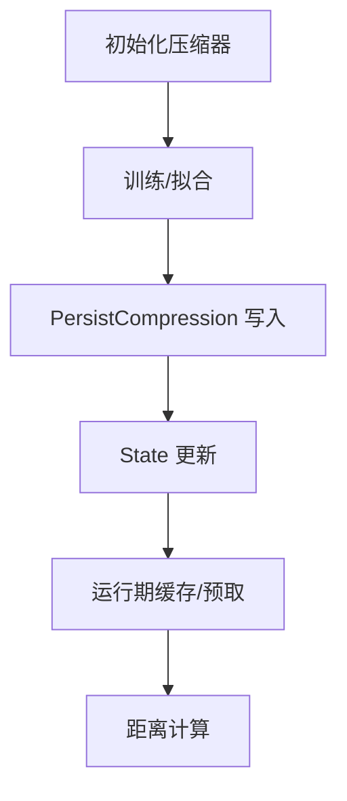
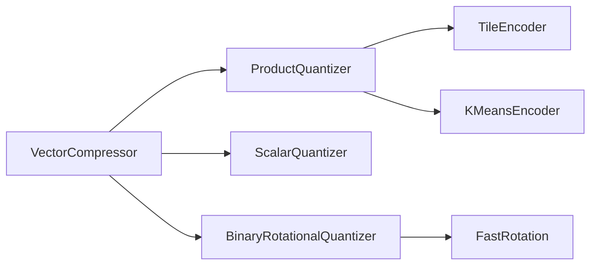

# 向量压缩技术

<cite>
**本文引用的文件**
- [state.go](file://entities/vectorindex/compression/state.go)
- [pq_data.go](file://entities/vectorindex/compression/pq_data.go)
- [sq_data.go](file://entities/vectorindex/compression/sq_data.go)
- [rq_data.go](file://entities/vectorindex/compression/rq_data.go)
- [brq_data.go](file://entities/vectorindex/compression/brq_data.go)
- [fast_rotation.go](file://entities/vectorindex/compression/fast_rotation.go)
- [compression.go](file://adapters/repos/db/vector/compressionhelpers/compression.go)
- [product_quantization.go](file://adapters/repos/db/vector/compressionhelpers/product_quantization.go)
- [scalar_quantization.go](file://adapters/repos/db/vector/compressionhelpers/scalar_quantization.go)
- [binary_rotational_quantization.go](file://adapters/repos/db/vector/compressionhelpers/binary_rotational_quantization.go)
- [tile_encoder.go](file://adapters/repos/db/vector/compressionhelpers/tile_encoder.go)
- [kmeans_encoder.go](file://adapters/repos/db/vector/compressionhelpers/kmeans_encoder.go)
- [binary_rotational_quantization_test.go](file://adapters/repos/db/vector/compressionhelpers/binary_rotational_quantization_test.go)
</cite>

## 目录
1. [简介](#简介)
2. [项目结构](#项目结构)
3. [核心组件](#核心组件)
4. [架构总览](#架构总览)
5. [详细组件分析](#详细组件分析)
6. [依赖关系分析](#依赖关系分析)
7. [性能考量](#性能考量)
8. [故障排查指南](#故障排查指南)
9. [结论](#结论)
10. [附录](#附录)

## 简介
本文件系统性梳理 Weaviate 的向量压缩技术，覆盖 PQ（Product Quantization）、SQ（Scalar Quantization）、RQ（Rotational Quantization）与 BRQ（Binary Rotational Quantization）等算法的原理、实现、训练与推理流程、状态管理、性能特征与最佳实践。文档同时给出压缩率与精度的权衡说明、评估指标与监控方法，帮助存储优化专家与大数据工程师在生产环境中进行选型与调优。

## 项目结构
Weaviate 的向量压缩能力主要位于以下模块：
- 数据模型与状态：entities/vectorindex/compression
- 压缩实现与接口：adapters/repos/db/vector/compressionhelpers

**图表来源**
- [state.go](file://entities/vectorindex/compression/state.go#L14-L37)
- [pq_data.go](file://entities/vectorindex/compression/pq_data.go#L40-L50)
- [sq_data.go](file://entities/vectorindex/compression/sq_data.go#L14-L19)
- [rq_data.go](file://entities/vectorindex/compression/rq_data.go#L14-L20)
- [brq_data.go](file://entities/vectorindex/compression/brq_data.go#L14-L19)
- [fast_rotation.go](file://entities/vectorindex/compression/fast_rotation.go#L28-L34)
- [compression.go](file://adapters/repos/db/vector/compressionhelpers/compression.go#L60-L87)
- [product_quantization.go](file://adapters/repos/db/vector/compressionhelpers/product_quantization.go#L176-L189)
- [scalar_quantization.go](file://adapters/repos/db/vector/compressionhelpers/scalar_quantization.go#L29-L37)
- [binary_rotational_quantization.go](file://adapters/repos/db/vector/compressionhelpers/binary_rotational_quantization.go#L31-L39)

**章节来源**
- [state.go](file://entities/vectorindex/compression/state.go#L14-L37)
- [compression.go](file://adapters/repos/db/vector/compressionhelpers/compression.go#L60-L87)

## 核心组件
- 压缩状态聚合 State：封装是否启用压缩、以及各算法的数据结构指针，支持查询是否启用压缩或 Muvera 多向量编码。
- 各算法数据结构：
  - PQData：包含分段数、质心数、维度、编码器类型与分布、编码器实例、位编码开关、训练上限等。
  - SQData：线性范围映射参数 a、b 与维度。
  - RQData/BRQData：输入维度、旋转矩阵参数、舍入噪声等。
- 快速旋转 FastRotation：轮次、交换对、符号表，以及前向/反向变换实现。
- 压缩器接口 VectorCompressor：统一的压缩/解压、缓存、距离计算、持久化与统计接口。

**章节来源**
- [state.go](file://entities/vectorindex/compression/state.go#L14-L37)
- [pq_data.go](file://entities/vectorindex/compression/pq_data.go#L40-L50)
- [sq_data.go](file://entities/vectorindex/compression/sq_data.go#L14-L19)
- [rq_data.go](file://entities/vectorindex/compression/rq_data.go#L14-L20)
- [brq_data.go](file://entities/vectorindex/compression/brq_data.go#L14-L19)
- [fast_rotation.go](file://entities/vectorindex/compression/fast_rotation.go#L28-L34)
- [compression.go](file://adapters/repos/db/vector/compressionhelpers/compression.go#L60-L87)

## 架构总览
Weaviate 在 HNSW 索引中集成压缩器，通过 VectorCompressor 抽象屏蔽不同算法差异，提供统一的预加载、缓存、距离计算与持久化能力。PQ 使用分段编码器（Tile/KMeans）训练质心表；SQ 使用线性范围映射；BRQ/RQ 使用快速旋转与二进制/多比特编码。

**图表来源**
- [state.go](file://entities/vectorindex/compression/state.go#L14-L37)
- [compression.go](file://adapters/repos/db/vector/compressionhelpers/compression.go#L60-L87)
- [product_quantization.go](file://adapters/repos/db/vector/compressionhelpers/product_quantization.go#L176-L189)
- [scalar_quantization.go](file://adapters/repos/db/vector/compressionhelpers/scalar_quantization.go#L29-L37)
- [binary_rotational_quantization.go](file://adapters/repos/db/vector/compressionhelpers/binary_rotational_quantization.go#L31-L39)

## 详细组件分析

### PQ（Product Quantization）
- 原理要点
  - 将维度划分为 M 段，每段独立量化为 0..Ks-1 的码字，最终向量被表示为 M 个字节的码表索引。
  - 支持两种分段编码器：TileEncoder（基于分布的分箱）与 KMeansEncoder（K-means 聚类）。
  - 训练阶段并行拟合各段编码器，构建全局质心距离表以加速压缩向量间的距离计算。
- 关键实现
  - ProductQuantizer：构造、Fit、Encode/Decode、距离计算、DLUT 查表加速。
  - TileEncoder/KMeansEncoder：分别基于分布分箱与 K-means 聚类。
  - DistanceLookUpTable：按查询向量预计算段内码距，避免热路径分支。
- 压缩率与精度
  - 压缩率≈原尺寸/段数，典型可达 4~16 倍（取决于 M）；精度受 Ks 与编码器质量影响。
- 适用场景
  - 高维稠密向量检索，追求高吞吐与低存储占用；对召回有较高要求时可增大 Ks 或使用 KMeans。
- 最佳实践
  - 维度需能整除 M；M 通常取 8~32；Ks 建议 256（1-byte 码）；优先 KMeans 编码器。
  - 控制训练样本上限以平衡速度与质量。
- 性能特征
  - 查询时通过 DLUT 减少分支与内存访问；编码/解码 O(M·d)；距离 O(M)。
- 监控与评估
  - 关注召回曲线、P@K、倒排命中率；观察 Fit 并行耗时与 DLUT 内存占用。

**图表来源**
- [product_quantization.go](file://adapters/repos/db/vector/compressionhelpers/product_quantization.go#L383-L429)
- [product_quantization.go](file://adapters/repos/db/vector/compressionhelpers/product_quantization.go#L447-L455)
- [tile_encoder.go](file://adapters/repos/db/vector/compressionhelpers/tile_encoder.go#L151-L154)
- [kmeans_encoder.go](file://adapters/repos/db/vector/compressionhelpers/kmeans_encoder.go#L48-L65)

**章节来源**
- [product_quantization.go](file://adapters/repos/db/vector/compressionhelpers/product_quantization.go#L176-L206)
- [tile_encoder.go](file://adapters/repos/db/vector/compressionhelpers/tile_encoder.go#L106-L121)
- [kmeans_encoder.go](file://adapters/repos/db/vector/compressionhelpers/kmeans_encoder.go#L31-L45)

### SQ（Scalar Quantization）
- 原理要点
  - 对每个维度进行独立的均匀量化，使用常量 a、b 定义线性映射范围，并在压缩码末尾附加局部范数统计以支持点积/余弦距离的近似。
- 关键实现
  - ScalarQuantizer：训练确定 a、b；编码时逐维映射并累加求和；距离计算复用范数统计。
  - SQDistancer：支持压缩码间与压缩码与浮点向量间的距离。
- 压缩率与精度
  - 压缩率≈4x（每个维度1字节+8字节统计），精度与 a、b 的范围估计密切相关。
- 适用场景
  - 对存储极度敏感且对召回要求适中的场景；适合点积/余弦距离。
- 最佳实践
  - 确保 a、b 能覆盖数据范围；注意浮点到字节的映射边界处理。
- 性能特征
  - 编码/解码 O(d)；距离计算 O(d)，但可利用局部范数减少开销。
- 监控与评估
  - 关注召回、点积误差分布、a/b 的稳定性。

**图表来源**
- [scalar_quantization.go](file://adapters/repos/db/vector/compressionhelpers/scalar_quantization.go#L68-L93)
- [scalar_quantization.go](file://adapters/repos/db/vector/compressionhelpers/scalar_quantization.go#L122-L134)
- [scalar_quantization.go](file://adapters/repos/db/vector/compressionhelpers/scalar_quantization.go#L39-L53)

**章节来源**
- [scalar_quantization.go](file://adapters/repos/db/vector/compressionhelpers/scalar_quantization.go#L194-L232)

### RQ/BRQ（Rotational Quantization / Binary Rotational Quantization）
- 原理要点
  - 使用快速旋转（Fast Rotation）对向量进行随机旋转，随后对旋转后的向量进行二进制或多位量化。
  - BRQ 使用 1-bit 码（仅符号）并携带步长与范数信息；RQ 可扩展到多比特（如 5-bit）用于查询量化。
  - 通过哈希汉明距离近似点积/余弦距离。
- 关键实现
  - BinaryRotationalQuantizer：编码/解码、距离计算、压缩码与查询码格式。
  - FastRotation：多轮随机交换、符号翻转与 FWHT 变换，支持前向/反向。
- 压缩率与精度
  - BRQ：原始尺寸≈输入维度×4；压缩尺寸≈8字节元数据+输入维度/8；压缩率≈4×（1-bit）；精度与旋转质量、随机舍入有关。
  - RQ：多比特查询量化，精度更高但带宽与计算增加。
- 适用场景
  - 对高维稀疏/半稠密向量、点积/余弦距离敏感的场景；BRQ 适合极致压缩，RQ 适合更高精度。
- 最佳实践
  - BRQ：默认 3 轮旋转；查询端使用随机舍入降低偏差；注意零向量与极端情况。
  - RQ：根据召回需求选择比特数；注意旋转维度填充与内存对齐。
- 性能特征
  - 编码/解码涉及旋转与位操作；距离计算通过汉明距离与 SIMD 加速。
- 监控与评估
  - 关注召回、点积/余弦近似误差、汉明距离 SIMD 加速收益。

**图表来源**
- [binary_rotational_quantization.go](file://adapters/repos/db/vector/compressionhelpers/binary_rotational_quantization.go#L350-L367)
- [binary_rotational_quantization.go](file://adapters/repos/db/vector/compressionhelpers/binary_rotational_quantization.go#L387-L409)
- [fast_rotation.go](file://entities/vectorindex/compression/fast_rotation.go#L103-L124)

**章节来源**
- [binary_rotational_quantization.go](file://adapters/repos/db/vector/compressionhelpers/binary_rotational_quantization.go#L50-L86)
- [binary_rotational_quantization.go](file://adapters/repos/db/vector/compressionhelpers/binary_rotational_quantization.go#L423-L429)
- [fast_rotation.go](file://entities/vectorindex/compression/fast_rotation.go#L74-L92)

### 压缩状态管理与持久化
- 状态聚合 State：集中持有各算法数据结构指针，支持 HasCompression/HasMuvera 查询。
- 持久化接口 CommitLogger：各算法通过 PersistCompression 写入对应 Data 结构。
- 运行期缓存与预取：quantizedVectorsCompressor 提供缓存增长、预加载、并发预取与释放逻辑，显著降低磁盘 IO 与重复计算。

**图表来源**
- [compression.go](file://adapters/repos/db/vector/compressionhelpers/compression.go#L434-L436)
- [state.go](file://entities/vectorindex/compression/state.go#L14-L37)

**章节来源**
- [state.go](file://entities/vectorindex/compression/state.go#L14-L37)
- [compression.go](file://adapters/repos/db/vector/compressionhelpers/compression.go#L434-L436)

## 依赖关系分析
- 组件耦合
  - VectorCompressor 抽象隔离了具体算法实现，便于替换与扩展。
  - PQ 依赖分段编码器；BRQ/RQ 依赖 FastRotation；SQ 独立于外部编码器。
- 外部依赖
  - 距离提供者 Provider（L2、点积、余弦）贯穿各算法的距离计算与估计。
  - 缓存层采用分片锁与预取策略，提升并发与吞吐。
- 循环依赖
  - 未见直接循环依赖；接口与数据结构单向依赖。

**图表来源**
- [compression.go](file://adapters/repos/db/vector/compressionhelpers/compression.go#L60-L87)
- [product_quantization.go](file://adapters/repos/db/vector/compressionhelpers/product_quantization.go#L176-L189)
- [scalar_quantization.go](file://adapters/repos/db/vector/compressionhelpers/scalar_quantization.go#L29-L37)
- [binary_rotational_quantization.go](file://adapters/repos/db/vector/compressionhelpers/binary_rotational_quantization.go#L31-L39)
- [fast_rotation.go](file://entities/vectorindex/compression/fast_rotation.go#L28-L34)

**章节来源**
- [compression.go](file://adapters/repos/db/vector/compressionhelpers/compression.go#L60-L87)

## 性能考量
- 编码/解码复杂度
  - PQ：O(M·d)，M 为段数，d 为段维度。
  - SQ：O(d)，逐维映射与范数统计。
  - BRQ/RQ：旋转 O(d)、位操作与汉明距离计算，查询端多比特编码。
- 查询性能
  - PQ：DLUT 预计算消除分支，距离 O(M)。
  - SQ：利用局部范数统计，减少重复计算。
  - BRQ/RQ：汉明距离 SIMD 优化，阈值以上收益明显。
- 存储与带宽
  - PQ：压缩率≈原尺寸/M；SQ：≈原尺寸/4；BRQ：≈原尺寸/4（1-bit）。
- 并发与内存
  - 预取与分片缓存显著降低 IO；注意缓存最大容量与淘汰策略。

[本节为通用性能讨论，不直接分析具体文件]

## 故障排查指南
- 常见问题
  - 编码器参数非法：检查 PQ 的 Segments、Centroids、Encoder 类型与分布。
  - 维度不匹配：PQ 的维度必须能被 Segments 整除；SQ/RQ/BRQ 维度需一致。
  - 训练数据不足：适当增大 TrainingLimit 或调整 Ks。
  - 零向量/极值：BRQ 对零向量有特殊处理，注意边界条件。
- 排查步骤
  - 核对 State 中各算法启用状态与数据结构完整性。
  - 观察 Fit 并行日志与耗时；确认 DLUT/缓存大小设置合理。
  - 使用基准测试定位瓶颈（参考 BRQ 基准）。
- 相关测试
  - BRQ 编码与 NewDistancer 性能基准可用于对比不同维度下的性能表现。

**章节来源**
- [binary_rotational_quantization_test.go](file://adapters/repos/db/vector/compressionhelpers/binary_rotational_quantization_test.go#L190-L222)

## 结论
Weaviate 的向量压缩体系通过统一接口抽象与模块化设计，在 HNSW 索引中高效集成多种压缩算法。PQ 适合高吞吐检索；SQ 适合极致压缩；BRQ/RQ 在保持较高精度的同时显著降低存储与带宽。结合合理的参数调优与监控，可在不同业务场景下取得存储与性能的最优平衡。

[本节为总结性内容，不直接分析具体文件]

## 附录
- 压缩配置最佳实践
  - PQ：M=8~32，Ks=256，优先 KMeans；控制训练样本上限。
  - SQ：确保 a、b 覆盖范围；关注召回与点积误差。
  - BRQ：默认 3 轮旋转；查询端随机舍入；注意零向量处理。
- 评估指标与监控
  - 召回曲线、P@K、倒排命中率、压缩比、查询延迟分布、内存与 CPU 利用率、缓存命中率。

[本节为通用指导，不直接分析具体文件]