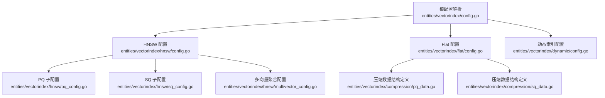
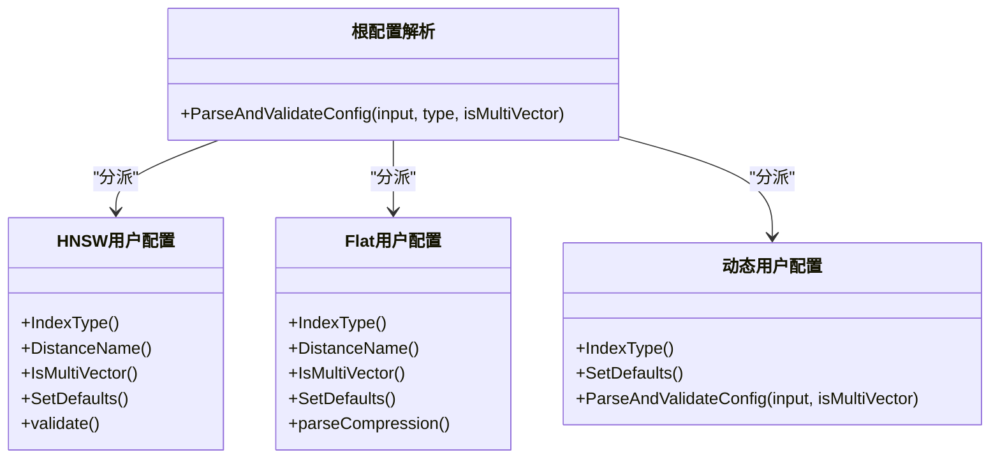
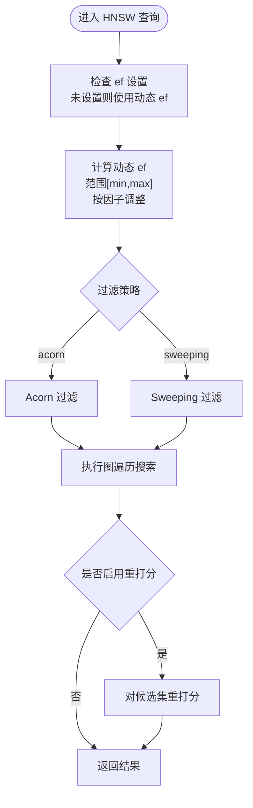
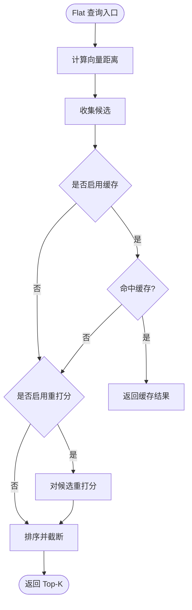
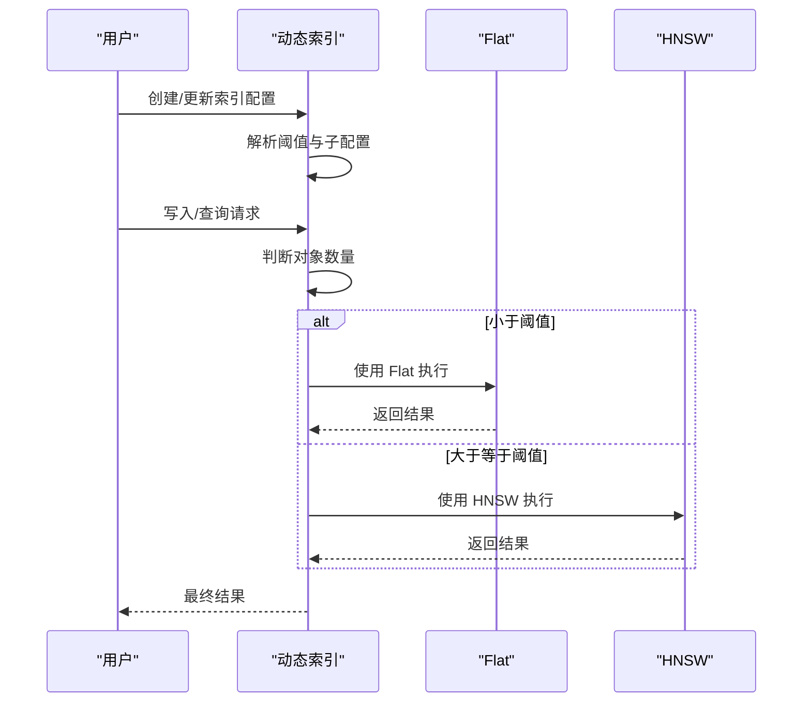
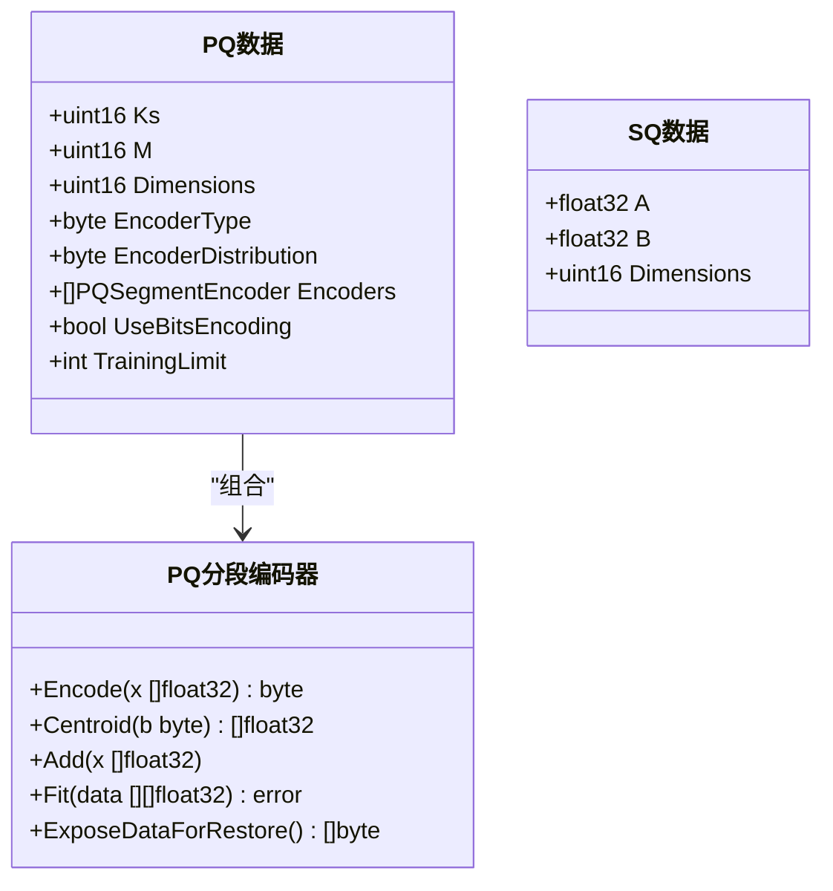
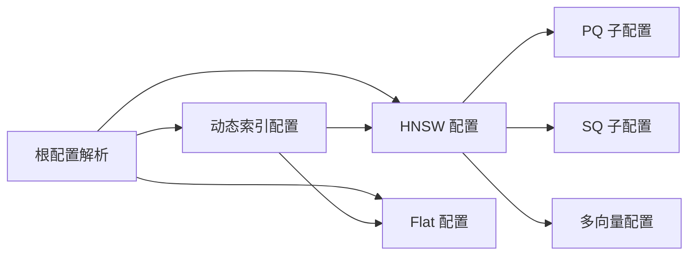

# 向量索引系统

<cite>
**本文引用的文件**
- [entities/vectorindex/config.go](file://entities/vectorindex/config.go)
- [entities/vectorindex/hnsw/config.go](file://entities/vectorindex/hnsw/config.go)
- [entities/vectorindex/hnsw/pq_config.go](file://entities/vectorindex/hnsw/pq_config.go)
- [entities/vectorindex/hnsw/sq_config.go](file://entities/vectorindex/hnsw/sq_config.go)
- [entities/vectorindex/hnsw/multivector_config.go](file://entities/vectorindex/hnsw/multivector_config.go)
- [entities/vectorindex/flat/config.go](file://entities/vectorindex/flat/config.go)
- [entities/vectorindex/dynamic/config.go](file://entities/vectorindex/dynamic/config.go)
- [entities/vectorindex/compression/pq_data.go](file://entities/vectorindex/compression/pq_data.go)
- [entities/vectorindex/compression/sq_data.go](file://entities/vectorindex/compression/sq_data.go)
</cite>

## 目录
1. [简介](#简介)
2. [项目结构](#项目结构)
3. [核心组件](#核心组件)
4. [架构总览](#架构总览)
5. [详细组件分析](#详细组件分析)
6. [依赖关系分析](#依赖关系分析)
7. [性能考量](#性能考量)
8. [故障排查指南](#故障排查指南)
9. [结论](#结论)
10. [附录：配置与示例](#附录配置与示例)

## 简介
本文件面向性能调优专家，系统化梳理 Weaviate 的向量索引体系，重点覆盖以下内容：
- HNSW（Hierarchical Navigable Small World）图构建、搜索路径优化与参数调优
- Flat 索引的简单实现与适用场景
- 动态索引系统的自适应切换机制与性能平衡策略
- 向量压缩技术：PQ（Product Quantization）、SQ（Scalar Quantization）、RQ（Randomized Quantization）等
- 索引选择策略与性能特征对比
- 索引配置优化建议与内存使用优化方案
- 具体的索引创建、查询与维护示例（以配置与流程为主）

## 项目结构
Weaviate 将向量索引相关配置与实现集中在 entities/vectorindex 下，并按类型拆分模块：
- 根级解析与类型分发：entities/vectorindex/config.go
- HNSW 配置与压缩子配置：entities/vectorindex/hnsw/*
- Flat 配置与压缩子配置：entities/vectorindex/flat/*
- 动态索引配置：entities/vectorindex/dynamic/*
- 压缩数据结构定义：entities/vectorindex/compression/*

图表来源
- [entities/vectorindex/config.go](file://entities/vectorindex/config.go#L32-L51)
- [entities/vectorindex/hnsw/config.go](file://entities/vectorindex/hnsw/config.go#L138-L258)
- [entities/vectorindex/flat/config.go](file://entities/vectorindex/flat/config.go#L86-L130)
- [entities/vectorindex/dynamic/config.go](file://entities/vectorindex/dynamic/config.go#L63-L125)
- [entities/vectorindex/hnsw/pq_config.go](file://entities/vectorindex/hnsw/pq_config.go#L132-L196)
- [entities/vectorindex/hnsw/sq_config.go](file://entities/vectorindex/hnsw/sq_config.go#L28-L58)
- [entities/vectorindex/compression/pq_data.go](file://entities/vectorindex/compression/pq_data.go#L40-L50)
- [entities/vectorindex/compression/sq_data.go](file://entities/vectorindex/compression/sq_data.go#L14-L19)

章节来源
- [entities/vectorindex/config.go](file://entities/vectorindex/config.go#L24-L51)

## 核心组件
- 根配置解析器：根据索引类型分派到具体实现，支持 hnsw、flat、dynamic、hfresh。
- HNSW 用户配置：包含图参数（如 maxConnections、efConstruction、ef、动态 ef 范围）、过滤策略、缓存与切点、距离度量、压缩子配置（PQ/SQ/RQ/BQ）以及多向量聚合配置。
- Flat 用户配置：包含距离度量、向量缓存上限、压缩开关与缓存、RQ 参数、默认量化跳过与追踪。
- 动态索引配置：在对象数量低于阈值时使用 Flat，超过阈值时使用 HNSW；两者共享距离度量并可独立配置。
- 压缩数据结构：定义 PQ、SQ 的序列化数据载体。

章节来源
- [entities/vectorindex/config.go](file://entities/vectorindex/config.go#L32-L51)
- [entities/vectorindex/hnsw/config.go](file://entities/vectorindex/hnsw/config.go#L47-L136)
- [entities/vectorindex/flat/config.go](file://entities/vectorindex/flat/config.go#L43-L84)
- [entities/vectorindex/dynamic/config.go](file://entities/vectorindex/dynamic/config.go#L28-L55)
- [entities/vectorindex/compression/pq_data.go](file://entities/vectorindex/compression/pq_data.go#L40-L50)
- [entities/vectorindex/compression/sq_data.go](file://entities/vectorindex/compression/sq_data.go#L14-L19)

## 架构总览
Weaviate 在 schema 层通过统一接口暴露向量索引配置，运行时根据类型选择具体实现。HNSW 支持多种压缩策略与多向量聚合；Flat 提供简单直接的近邻检索与可选压缩；动态索引在小规模数据上用 Flat，在大规模数据上自动切换到 HNSW。

图表来源
- [entities/vectorindex/config.go](file://entities/vectorindex/config.go#L32-L51)
- [entities/vectorindex/hnsw/config.go](file://entities/vectorindex/hnsw/config.go#L70-L136)
- [entities/vectorindex/flat/config.go](file://entities/vectorindex/flat/config.go#L54-L84)
- [entities/vectorindex/dynamic/config.go](file://entities/vectorindex/dynamic/config.go#L35-L55)

## 详细组件分析

### HNSW 组件分析
- 图参数与搜索控制
  - 连接数、构建扩展因子、动态 ef 的最小/最大/因子，清理间隔，向量缓存上限，平面搜索切点，过滤策略（acorn/sweeping），距离度量。
  - ef 与动态 ef 的交互：当 ef 未显式设置时由系统选择；动态 ef 在查询时按因子与上下界调整，以平衡召回与延迟。
- 压缩配置
  - PQ：分段数、码本大小、编码器类型（tile/kmeans）与分布（log-normal/normal）、是否位压缩、训练上限。
  - SQ：启用、训练上限、重打分阈值。
  - RQ/BQ：启用标志（RQ 支持位数配置）。
- 多向量聚合
  - 当前仅支持 maxSim 聚合方式；MuVerA 可选开启并配置 ksims、投影维度与重复次数。

图表来源
- [entities/vectorindex/hnsw/config.go](file://entities/vectorindex/hnsw/config.go#L24-L45)
- [entities/vectorindex/hnsw/config.go](file://entities/vectorindex/hnsw/config.go#L138-L258)

章节来源
- [entities/vectorindex/hnsw/config.go](file://entities/vectorindex/hnsw/config.go#L24-L136)
- [entities/vectorindex/hnsw/pq_config.go](file://entities/vectorindex/hnsw/pq_config.go#L27-L90)
- [entities/vectorindex/hnsw/sq_config.go](file://entities/vectorindex/hnsw/sq_config.go#L16-L26)
- [entities/vectorindex/hnsw/multivector_config.go](file://entities/vectorindex/hnsw/multivector_config.go#L20-L67)

### Flat 组件分析
- 特性
  - 简单线性扫描，适合小规模或对延迟要求极低的场景。
  - 支持压缩与缓存：PQ/SQ 暂不支持（当前报错），RQ 支持 1/8 位，可配置 rescoreLimit 与 cache。
  - 默认量化策略可通过解析器注入，支持跳过默认量化与追踪。
- 适用场景
  - 数据量较小（例如小于阈值）或对精度优先于吞吐的场景。
  - 作为动态索引在小规模数据下的后备。

图表来源
- [entities/vectorindex/flat/config.go](file://entities/vectorindex/flat/config.go#L86-L130)
- [entities/vectorindex/flat/config.go](file://entities/vectorindex/flat/config.go#L156-L231)

章节来源
- [entities/vectorindex/flat/config.go](file://entities/vectorindex/flat/config.go#L22-L84)
- [entities/vectorindex/flat/config.go](file://entities/vectorindex/flat/config.go#L156-L231)

### 动态索引组件分析
- 自适应机制
  - 以阈值为界：小于阈值使用 Flat，大于等于阈值使用 HNSW。
  - 两者的距离度量需一致，且可分别配置各自的用户参数。
- 默认量化策略
  - 对 HNSW 与 Flat 分别应用默认量化策略，若已有任一压缩启用或跳过，则不覆盖。

图表来源
- [entities/vectorindex/dynamic/config.go](file://entities/vectorindex/dynamic/config.go#L63-L125)

章节来源
- [entities/vectorindex/dynamic/config.go](file://entities/vectorindex/dynamic/config.go#L24-L55)
- [entities/vectorindex/dynamic/config.go](file://entities/vectorindex/dynamic/config.go#L63-L125)

### 压缩数据结构与编码器
- PQ 数据结构
  - 包含分段数、维度、编码器类型与分布、编码器实例数组、是否位压缩、训练上限等字段。
  - 编码器接口定义了 Encode/Centroid/Add/Fit/恢复数据导出等方法。
- SQ 数据结构
  - 线性标量量化参数 A、B 与维度。

图表来源
- [entities/vectorindex/compression/pq_data.go](file://entities/vectorindex/compression/pq_data.go#L40-L50)
- [entities/vectorindex/compression/sq_data.go](file://entities/vectorindex/compression/sq_data.go#L14-L19)

章节来源
- [entities/vectorindex/compression/pq_data.go](file://entities/vectorindex/compression/pq_data.go#L14-L50)
- [entities/vectorindex/compression/sq_data.go](file://entities/vectorindex/compression/sq_data.go#L14-L19)

## 依赖关系分析
- 类型解析与分派
  - 根配置解析器依据索引类型调用对应 ParseAndValidateConfig，确保类型一致性与参数校验。
- HNSW 与压缩配置
  - HNSW 用户配置内嵌 PQ/SQ/RQ/BQ 子配置，validate 会限制同时启用多个压缩策略，并对特定参数进行边界检查。
- 动态索引与子索引
  - 动态索引持有 HNSW 与 Flat 的用户配置，二者独立生效，且动态索引禁止在其中启用多向量索引。

图表来源
- [entities/vectorindex/config.go](file://entities/vectorindex/config.go#L32-L51)
- [entities/vectorindex/hnsw/config.go](file://entities/vectorindex/hnsw/config.go#L138-L258)
- [entities/vectorindex/dynamic/config.go](file://entities/vectorindex/dynamic/config.go#L63-L125)

章节来源
- [entities/vectorindex/config.go](file://entities/vectorindex/config.go#L32-L51)
- [entities/vectorindex/hnsw/config.go](file://entities/vectorindex/hnsw/config.go#L292-L318)
- [entities/vectorindex/dynamic/config.go](file://entities/vectorindex/dynamic/config.go#L102-L104)

## 性能考量
- HNSW
  - 连接数与 efConstruction：连接数越大，图稠密，构建成本高但搜索更稳定；efConstruction 影响图质量与内存占用。
  - 动态 ef：在高并发下通过因子与上下界动态调节 ef，可在召回与延迟间取得平衡。
  - 平面搜索切点：当对象数低于切点时可切换到平面搜索，减少图维护开销。
  - 压缩策略：PQ/SQ/RQ/BQ 可显著降低存储与带宽压力，但会引入重建/训练成本与精度损失，需结合 rescoreLimit 控制重打分范围。
- Flat
  - 线性扫描，延迟低、实现简单；在小规模数据上具备优势；压缩目前仅支持 RQ，且位数与缓存需谨慎配置。
- 动态索引
  - 通过阈值在 Flat 与 HNSW 之间切换，兼顾小规模的低延迟与大规模的高吞吐；需监控对象数量变化以避免频繁切换带来的抖动。

## 故障排查指南
- 参数校验错误
  - HNSW：maxConnections 超出范围、efConstruction 太小、同时启用了多个压缩策略、过滤策略非法、MuVerA 的 ksim 超限等。
  - Flat：启用压缩但未开启压缩、同时启用多个压缩策略、RQ 位数非法（仅允许 1/8）。
- 默认量化问题
  - 若已显式启用压缩或跳过默认量化，则不会被覆盖；如出现意外行为，检查 TrackDefaultQuantization 与 SkipDefaultQuantization 的状态。
- 多向量配置
  - 动态索引不支持多向量索引；若启用会触发错误。

章节来源
- [entities/vectorindex/hnsw/config.go](file://entities/vectorindex/hnsw/config.go#L260-L318)
- [entities/vectorindex/flat/config.go](file://entities/vectorindex/flat/config.go#L194-L231)
- [entities/vectorindex/dynamic/config.go](file://entities/vectorindex/dynamic/config.go#L102-L104)

## 结论
Weaviate 的向量索引体系通过统一的配置接口与类型分派，实现了 HNSW、Flat 与动态索引的灵活组合。HNSW 在大规模场景下提供高效的近邻检索能力，并通过多种压缩策略进一步优化存储与带宽；Flat 适合小规模或对延迟敏感的场景；动态索引在不同规模间自动切换，提升整体可用性。实际部署中应结合数据规模、精度与延迟目标，合理设置参数与压缩策略，并持续监控性能指标以进行迭代优化。

## 附录：配置与示例
以下示例以“配置项说明 + 适用场景”形式给出，便于快速落地与调优。

- HNSW 基础配置
  - 关键参数：maxConnections、efConstruction、ef、dynamicEfMin/Max/Factor、flatSearchCutoff、distance、filterStrategy、vectorCacheMaxObjects。
  - 场景：中大型向量集合，追求高召回与可调延迟。
  - 参考路径：[HNSW 用户配置](file://entities/vectorindex/hnsw/config.go#L47-L136)

- HNSW 压缩策略
  - PQ：适用于高维向量，需设置分段数、码本大小与编码器类型；注意训练上限与位压缩选项。
    - 参考路径：[PQ 子配置](file://entities/vectorindex/hnsw/pq_config.go#L43-L90)
  - SQ：线性标量化，适合对存储敏感的场景，需设置训练与重打分阈值。
    - 参考路径：[SQ 子配置](file://entities/vectorindex/hnsw/sq_config.go#L22-L26)
  - RQ/BQ：随机/二进制量化，适合极致压缩与带宽受限场景；RQ 支持 1/8 位。
    - 参考路径：[HNSW 用户配置（RQ/BQ 字段）](file://entities/vectorindex/hnsw/config.go#L60-L67)

- Flat 压缩与缓存
  - 当前不支持 PQ/SQ；RQ 支持 1/8 位，可配置 rescoreLimit 与 cache。
  - 参考路径：[Flat 压缩解析](file://entities/vectorindex/flat/config.go#L156-L231)

- 动态索引
  - 阈值 threshold 决定 Flat/HNSW 切换点；两者的距离度量需一致；禁止在动态索引中启用多向量。
  - 参考路径：[动态索引配置](file://entities/vectorindex/dynamic/config.go#L28-L55)

- 默认量化策略
  - HNSW/Flat 支持基于字符串的默认量化注入（如 rq-1/rq-8/bq），并可跳过默认量化与追踪。
  - 参考路径：[HNSW 默认量化](file://entities/vectorindex/hnsw/config.go#L334-L365)、[Flat 默认量化](file://entities/vectorindex/flat/config.go#L269-L298)

- 多向量聚合
  - 当前仅支持 maxSim；可配置 MuVerA 的 ksims、投影维度与重复次数。
  - 参考路径：[多向量配置](file://entities/vectorindex/hnsw/multivector_config.go#L33-L67)