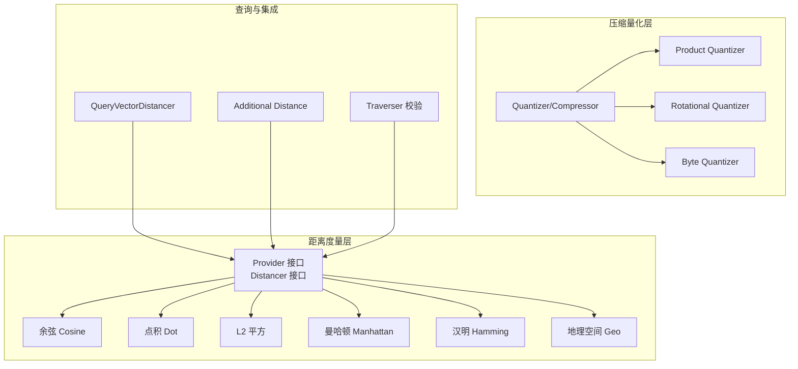
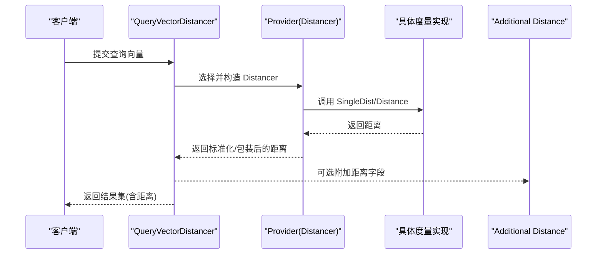
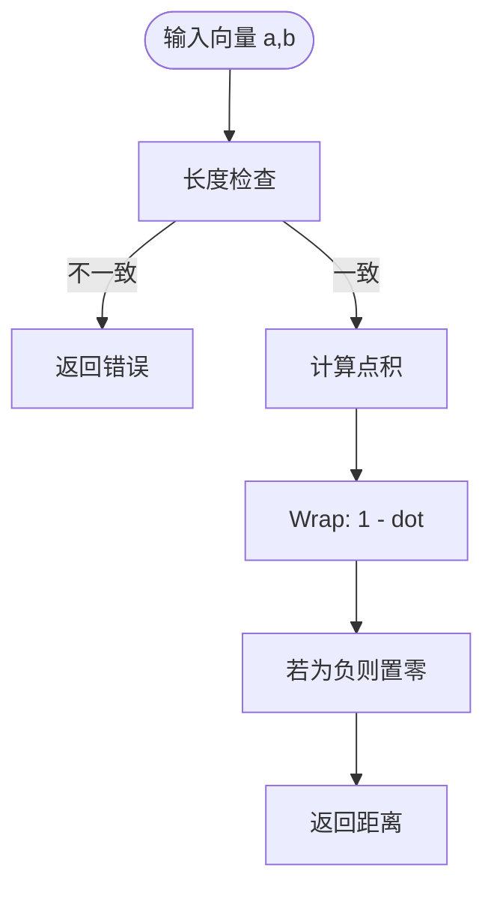
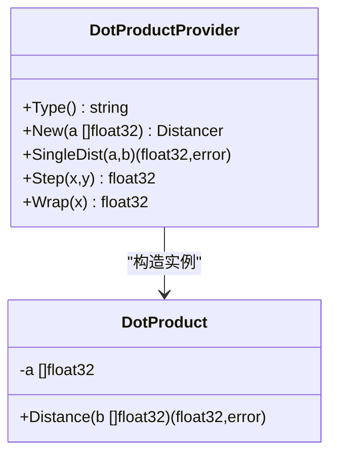
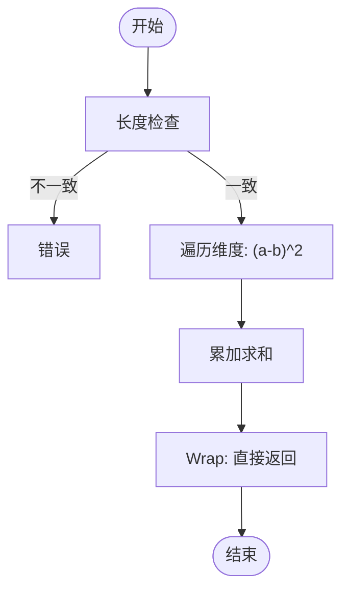
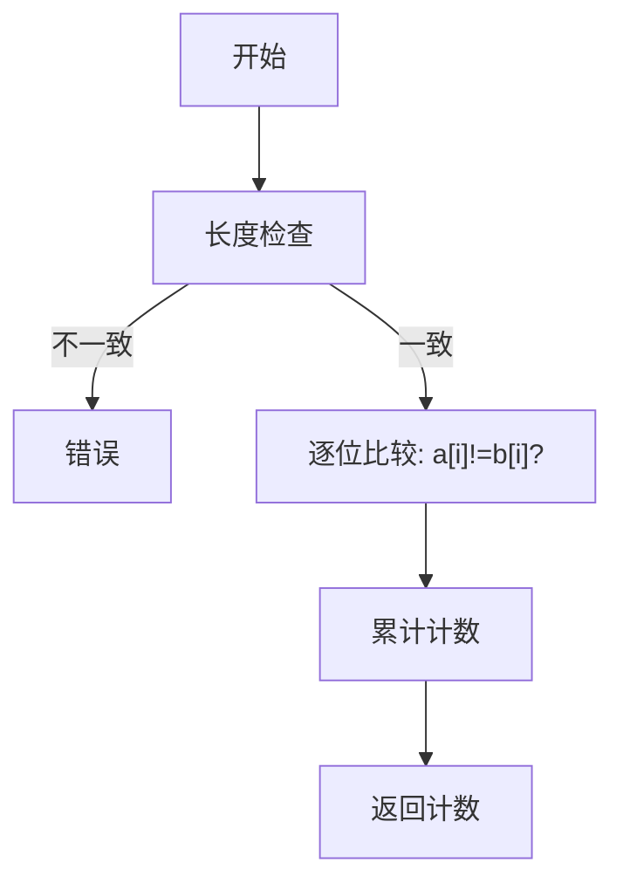
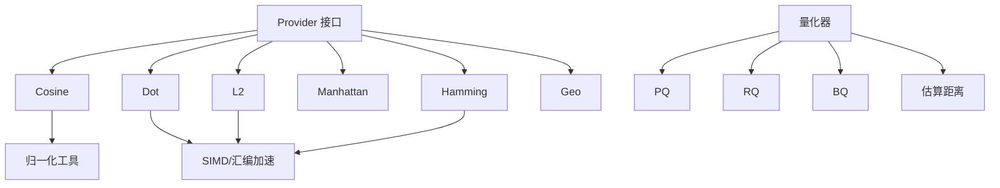

# 向量距离度量

<cite>
**本文引用的文件**
- [provider.go](file://adapters/repos/db/vector/hnsw/distancer/provider.go)
- [cosine_dist.go](file://adapters/repos/db/vector/hnsw/distancer/cosine_dist.go)
- [dot_product.go](file://adapters/repos/db/vector/hnsw/distancer/dot_product.go)
- [l2.go](file://adapters/repos/db/vector/hnsw/distancer/l2.go)
- [manhattan.go](file://adapters/repos/db/vector/hnsw/distancer/manhattan.go)
- [hamming.go](file://adapters/repos/db/vector/hnsw/distancer/hamming.go)
- [normalize.go](file://adapters/repos/db/vector/hnsw/distancer/normalize.go)
- [geo_spatial.go](file://adapters/repos/db/vector/hnsw/distancer/geo_spatial.go)
- [dot_product_amd64.go](file://adapters/repos/db/vector/hnsw/distancer/dot_product_amd64.go)
- [dot_product_arm64.go](file://adapters/repos/db/vector/hnsw/distancer/dot_product_arm64.go)
- [l2_amd64.go](file://adapters/repos/db/vector/hnsw/distancer/l2_amd64.go)
- [l2_arm64.go](file://adapters/repos/db/vector/hnsw/distancer/l2_arm64.go)
- [hamming_amd64.go](file://adapters/repos/db/vector/hnsw/distancer/hamming_amd64.go)
- [hamming_arm64.go](file://adapters/repos/db/vector/hnsw/distancer/hamming_arm64.go)
- [c/l2_avx256_amd64.c](file://adapters/repos/db/vector/hnsw/distancer/c/l2_avx256_amd64.c)
- [c/l2_byte_avx256_amd64.c](file://adapters/repos/db/vector/hnsw/distancer/c/l2_byte_avx256_amd64.c)
- [c/l2_float_byte_avx256.c](file://adapters/repos/db/vector/hnsw/distancer/c/l2_float_byte_avx256.c)
- [compression.go](file://adapters/repos/db/vector/compressionhelpers/compression.go)
- [distance.go](file://adapters/repos/db/vector/compressionhelpers/distance.go)
- [product_quantization_bench_test.go](file://adapters/repos/db/vector/compressionhelpers/product_quantization_bench_test.go)
- [quantizer.go](file://adapters/repos/db/vector/flat/quantizer.go)
- [query_vector_distancer.go](file://adapters/repos/db/vector/common/query_vector_distancer.go)
- [vector_distance_query_integration_test.go](file://adapters/repos/db/vector_distance_query_integration_test.go)
- [additional/distance.go](file://entities/additional/distance.go)
- [usecases/vectorizer/distance.go](file://usecases/vectorizer/distance.go)
- [usecases/traverser/traverser_validate_distance_metrics.go](file://usecases/traverser/traverser_validate_distance_metrics.go)
</cite>

## 目录
1. [引言](#引言)
2. [项目结构](#项目结构)
3. [核心组件](#核心组件)
4. [架构总览](#架构总览)
5. [详细组件分析](#详细组件分析)
6. [依赖关系分析](#依赖关系分析)
7. [性能考量](#性能考量)
8. [故障排查指南](#故障排查指南)
9. [结论](#结论)
10. [附录](#附录)

## 引言
本文件面向算法工程师与数据科学家，系统梳理 Weaviate 向量索引中的距离度量体系，覆盖余弦相似度、点积（内积）、欧氏平方、曼哈顿、汉明以及地理空间距离等，并结合压缩量化与硬件加速实现，给出数学原理、适用场景、性能优化策略、配置建议与实践指南。

## 项目结构
Weaviate 的向量距离度量主要位于向量索引子系统中，核心接口与多种度量实现集中在 distancer 包；同时通过压缩量化模块支持 PQ/RQ/BQ 等向量压缩，配合查询路径与额外返回字段进行统一管理。

图表来源
- [provider.go](file://adapters/repos/db/vector/hnsw/distancer/provider.go#L14-L24)
- [cosine_dist.go](file://adapters/repos/db/vector/hnsw/distancer/cosine_dist.go#L18-L79)
- [dot_product.go](file://adapters/repos/db/vector/hnsw/distancer/dot_product.go#L48-L99)
- [l2.go](file://adapters/repos/db/vector/hnsw/distancer/l2.go#L1-L200)
- [manhattan.go](file://adapters/repos/db/vector/hnsw/distancer/manhattan.go#L20-L64)
- [hamming.go](file://adapters/repos/db/vector/hnsw/distancer/hamming.go#L20-L107)
- [geo_spatial.go](file://adapters/repos/db/vector/hnsw/distancer/geo_spatial.go#L1-L200)
- [quantizer.go](file://adapters/repos/db/vector/flat/quantizer.go#L27-L49)
- [compression.go](file://adapters/repos/db/vector/compressionhelpers/compression.go#L434-L475)
- [query_vector_distancer.go](file://adapters/repos/db/vector/common/query_vector_distancer.go#L1-L200)
- [additional/distance.go](file://entities/additional/distance.go#L1-L200)
- [usecases/traverser/traverser_validate_distance_metrics.go](file://usecases/traverser/traverser_validate_distance_metrics.go#L1-L200)

章节来源
- [provider.go](file://adapters/repos/db/vector/hnsw/distancer/provider.go#L1-L25)
- [quantizer.go](file://adapters/repos/db/vector/flat/quantizer.go#L1-L49)

## 核心组件
- Provider/Distancer 接口：定义统一的距离提供者与实例化接口，支持按需替换具体度量实现。
- 多种度量实现：余弦、点积、L2 平方、曼哈顿、汉明、地理空间。
- 压缩量化：PQ/RQ/BQ 支持，降低存储与带宽，提升检索吞吐。
- 查询路径与额外返回：查询阶段可返回距离值，Traverser 层校验度量类型。

章节来源
- [provider.go](file://adapters/repos/db/vector/hnsw/distancer/provider.go#L14-L24)
- [cosine_dist.go](file://adapters/repos/db/vector/hnsw/distancer/cosine_dist.go#L18-L79)
- [dot_product.go](file://adapters/repos/db/vector/hnsw/distancer/dot_product.go#L48-L99)
- [l2.go](file://adapters/repos/db/vector/hnsw/distancer/l2.go#L1-L200)
- [manhattan.go](file://adapters/repos/db/vector/hnsw/distancer/manhattan.go#L20-L64)
- [hamming.go](file://adapters/repos/db/vector/hnsw/distancer/hamming.go#L20-L107)
- [geo_spatial.go](file://adapters/repos/db/vector/hnsw/distancer/geo_spatial.go#L1-L200)
- [quantizer.go](file://adapters/repos/db/vector/flat/quantizer.go#L27-L49)

## 架构总览
Weaviate 在查询阶段通过 Provider 统一抽象不同距离度量，底层可利用 SIMD/汇编加速（如 AVX）与压缩量化（PQ/RQ/BQ）优化性能。查询路径根据配置选择对应 Provider，并在必要时返回额外的距离信息。

图表来源
- [query_vector_distancer.go](file://adapters/repos/db/vector/common/query_vector_distancer.go#L1-L200)
- [provider.go](file://adapters/repos/db/vector/hnsw/distancer/provider.go#L14-L24)
- [additional/distance.go](file://entities/additional/distance.go#L1-L200)

## 详细组件分析

### 余弦距离（Cosine）
- 数学原理：基于向量点积与归一化，衡量夹角差异，输出范围通常为非负值。
- 实现要点：使用点积实现函数，再经 Wrap 计算 1 - dot；Step 用于逐元素乘积累加。
- 适用场景：文本/图像嵌入等高维稀疏或归一化向量，关注方向一致性。
- 性能优化：点积实现可替换为 AVX/NEON 等硬件加速版本。

图表来源
- [cosine_dist.go](file://adapters/repos/db/vector/hnsw/distancer/cosine_dist.go#L22-L79)
- [normalize.go](file://adapters/repos/db/vector/hnsw/distancer/normalize.go#L1-L200)

章节来源
- [cosine_dist.go](file://adapters/repos/db/vector/hnsw/distancer/cosine_dist.go#L18-L79)
- [normalize.go](file://adapters/repos/db/vector/hnsw/distancer/normalize.go#L1-L200)

### 点积（Dot Product）
- 数学原理：向量逐元素相乘求和，常用于近似余弦（未归一化时）或内积相似度。
- 实现要点：提供浮点与字节两种实现，Step 为逐元素乘积累加，Wrap 对结果取负以转换为“距离”。
- 适用场景：已归一化向量或需要最大化内积的场景；亦可作为余弦的替代。
- 性能优化：多平台 SIMD 加速（amd64/arm64），支持 AVX/AVX2/AVX512/NEON/SVE。

图表来源
- [dot_product.go](file://adapters/repos/db/vector/hnsw/distancer/dot_product.go#L48-L99)

章节来源
- [dot_product.go](file://adapters/repos/db/vector/hnsw/distancer/dot_product.go#L1-L99)
- [dot_product_amd64.go](file://adapters/repos/db/vector/hnsw/distancer/dot_product_amd64.go#L1-L200)
- [dot_product_arm64.go](file://adapters/repos/db/vector/hnsw/distancer/dot_product_arm64.go#L1-L200)

### 欧氏平方（L2 Squared）
- 数学原理：向量差的平方和，常用于局部敏感性散列与图搜索。
- 实现要点：Step 计算 (a_i - b_i)^2，Wrap 直接返回累加和；提供字节/混合精度的 C 实现与 SIMD 加速。
- 适用场景：高维稠密向量，对距离平滑性要求较高。
- 性能优化：AVX256/AVX512/NEON/SVE 批处理，减少内存带宽压力。

图表来源
- [l2.go](file://adapters/repos/db/vector/hnsw/distancer/l2.go#L1-L200)
- [l2_amd64.go](file://adapters/repos/db/vector/hnsw/distancer/l2_amd64.go#L1-L200)
- [l2_arm64.go](file://adapters/repos/db/vector/hnsw/distancer/l2_arm64.go#L1-L200)
- [c/l2_avx256_amd64.c](file://adapters/repos/db/vector/hnsw/distancer/c/l2_avx256_amd64.c#L1-L54)
- [c/l2_byte_avx256_amd64.c](file://adapters/repos/db/vector/hnsw/distancer/c/l2_byte_avx256_amd64.c#L1-L47)
- [c/l2_float_byte_avx256.c](file://adapters/repos/db/vector/hnsw/distancer/c/l2_float_byte_avx256.c#L1-L50)

章节来源
- [l2.go](file://adapters/repos/db/vector/hnsw/distancer/l2.go#L1-L200)
- [l2_amd64.go](file://adapters/repos/db/vector/hnsw/distancer/l2_amd64.go#L1-L200)
- [l2_arm64.go](file://adapters/repos/db/vector/hnsw/distancer/l2_arm64.go#L1-L200)
- [c/l2_avx256_amd64.c](file://adapters/repos/db/vector/hnsw/distancer/c/l2_avx256_amd64.c#L1-L54)
- [c/l2_byte_avx256_amd64.c](file://adapters/repos/db/vector/hnsw/distancer/c/l2_byte_avx256_amd64.c#L1-L47)
- [c/l2_float_byte_avx256.c](file://adapters/repos/db/vector/hnsw/distancer/c/l2_float_byte_avx256.c#L1-L50)

### 曼哈顿距离（Manhattan）
- 数学原理：向量差绝对值之和，对异常值鲁棒性强。
- 实现要点：Step 计算 |a_i - b_i|，Wrap 直接返回累加和。
- 适用场景：特征维度具有明显边界或噪声的高维数据。
- 性能优化：循环展开与向量化（见其他度量的 SIMD 策略）。

章节来源
- [manhattan.go](file://adapters/repos/db/vector/hnsw/distancer/manhattan.go#L20-L64)

### 汉明距离（Hamming）
- 数学原理：向量分量不等个数，适用于二值或离散编码。
- 实现要点：提供逐位异或计 1 的位运算实现，以及按 float 分量比较的实现；Step 为逐位比较计数。
- 适用场景：布尔向量、哈希编码、压缩后向量的快速比较。
- 性能优化：位运算与 SIMD（如 AVX256/AVX512）加速。

图表来源
- [hamming.go](file://adapters/repos/db/vector/hnsw/distancer/hamming.go#L20-L107)
- [hamming_amd64.go](file://adapters/repos/db/vector/hnsw/distancer/hamming_amd64.go#L1-L200)
- [hamming_arm64.go](file://adapters/repos/db/vector/hnsw/distancer/hamming_arm64.go#L1-L200)

章节来源
- [hamming.go](file://adapters/repos/db/vector/hnsw/distancer/hamming.go#L20-L107)
- [hamming_amd64.go](file://adapters/repos/db/vector/hnsw/distancer/hamming_amd64.go#L1-L200)
- [hamming_arm64.go](file://adapters/repos/db/vector/hnsw/distancer/hamming_arm64.go#L1-L200)

### 地理空间距离（Geo）
- 数学原理：经纬度球面距离（单位米），用于地理位置向量。
- 实现要点：提供 Provider 与 Distancer，适配经纬度坐标。
- 适用场景：POI/地图类向量检索。

章节来源
- [geo_spatial.go](file://adapters/repos/db/vector/hnsw/distancer/geo_spatial.go#L1-L200)

### 压缩量化与距离
- 压缩类型：无压缩、二进制量化（BQ）、旋转量化（RQ-1/RQ-8）、产品量化（PQ）。
- 距离计算：压缩后向量通过量化器估算与真实向量之间的距离，平衡精度与性能。
- 配置入口：HNSW/PQ/RQ/BQ 的压缩器初始化与 Fit 过程。

图表来源
- [quantizer.go](file://adapters/repos/db/vector/flat/quantizer.go#L27-L49)
- [compression.go](file://adapters/repos/db/vector/compressionhelpers/compression.go#L434-L475)
- [distance.go](file://adapters/repos/db/vector/compressionhelpers/distance.go#L1-L200)

章节来源
- [quantizer.go](file://adapters/repos/db/vector/flat/quantizer.go#L1-L49)
- [compression.go](file://adapters/repos/db/vector/compressionhelpers/compression.go#L434-L475)
- [distance.go](file://adapters/repos/db/vector/compressionhelpers/distance.go#L1-L200)
- [product_quantization_bench_test.go](file://adapters/repos/db/vector/compressionhelpers/product_quantization_bench_test.go#L24-L49)

## 依赖关系分析
- Provider/Distancer 抽象贯穿所有度量实现，保证上层调用一致性。
- 具体度量实现依赖通用点积/归一化工具与硬件加速实现。
- 压缩量化模块依赖 Provider 与底层存储，提供 Fit 与估算距离能力。
- 查询路径与 Traverser 校验确保配置正确性与兼容性。

图表来源
- [provider.go](file://adapters/repos/db/vector/hnsw/distancer/provider.go#L14-L24)
- [cosine_dist.go](file://adapters/repos/db/vector/hnsw/distancer/cosine_dist.go#L18-L79)
- [dot_product.go](file://adapters/repos/db/vector/hnsw/distancer/dot_product.go#L48-L99)
- [l2.go](file://adapters/repos/db/vector/hnsw/distancer/l2.go#L1-L200)
- [hamming.go](file://adapters/repos/db/vector/hnsw/distancer/hamming.go#L20-L107)
- [quantizer.go](file://adapters/repos/db/vector/flat/quantizer.go#L27-L49)
- [compression.go](file://adapters/repos/db/vector/compressionhelpers/compression.go#L434-L475)

章节来源
- [provider.go](file://adapters/repos/db/vector/hnsw/distancer/provider.go#L1-L25)
- [quantizer.go](file://adapters/repos/db/vector/flat/quantizer.go#L1-L49)
- [compression.go](file://adapters/repos/db/vector/compressionhelpers/compression.go#L434-L475)

## 性能考量
- 硬件加速：优先启用 AVX/AVX2/AVX512/NEON/SVE 等指令集，显著降低标量循环开销。
- 循环展开与向量化：在步长计算（Step）中充分利用寄存器并行。
- 压缩量化：PQ/RQ/BQ 显著降低内存占用与带宽，适合大规模检索；注意估算误差与精度权衡。
- 归一化：余弦前的向量归一化可避免数值不稳定与额外开销。
- 缓存友好：批量访问与连续内存布局有助于提高缓存命中率。
- 查询路径：仅在需要时返回额外距离字段，减少序列化与网络传输成本。

## 故障排查指南
- 向量长度不匹配：Provider 在构造 Distancer 或执行 Distance 时会进行长度校验并返回错误。
- 负值/异常距离：余弦 Wrap 会对负值进行钳制，确保非负输出；点积 Wrap 取负以转换为“距离”。
- 压缩量化误差：PQ/RQ/BQ 估算距离可能与真实距离存在偏差，可通过基准测试评估影响。
- 配置校验：Traverser 层对距离度量类型进行校验，避免不兼容配置导致的运行时错误。

章节来源
- [provider.go](file://adapters/repos/db/vector/hnsw/distancer/provider.go#L14-L24)
- [cosine_dist.go](file://adapters/repos/db/vector/hnsw/distancer/cosine_dist.go#L22-L79)
- [dot_product.go](file://adapters/repos/db/vector/hnsw/distancer/dot_product.go#L52-L99)
- [usecases/traverser/traverser_validate_distance_metrics.go](file://usecases/traverser/traverser_validate_distance_metrics.go#L1-L200)

## 结论
Weaviate 的向量距离度量体系以 Provider 抽象为核心，结合多平台 SIMD 加速与压缩量化，在精度与性能之间提供灵活选择。针对不同场景（文本/图像/地理/布尔）应选择合适的度量与预处理策略，并通过基准测试与配置校验保障稳定性与效率。

## 附录
- 配置与使用建议
  - 文本/图像嵌入：优先余弦（已归一化）或点积；启用 SIMD 加速。
  - 高维稠密向量：L2 平方；结合 PQ/RQ/BQ 压缩。
  - 稀疏/布尔向量：汉明；位运算与 SIMD 加速。
  - 地理位置：地理空间距离。
  - 压缩量化：先 Fit 再查询；根据召回/延迟目标调整 PQ 分段与 Centroids。
- 关键参考路径
  - Provider/Distancer 接口与实现：[provider.go](file://adapters/repos/db/vector/hnsw/distancer/provider.go#L14-L24)，[cosine_dist.go](file://adapters/repos/db/vector/hnsw/distancer/cosine_dist.go#L18-L79)，[dot_product.go](file://adapters/repos/db/vector/hnsw/distancer/dot_product.go#L48-L99)，[l2.go](file://adapters/repos/db/vector/hnsw/distancer/l2.go#L1-L200)，[manhattan.go](file://adapters/repos/db/vector/hnsw/distancer/manhattan.go#L20-L64)，[hamming.go](file://adapters/repos/db/vector/hnsw/distancer/hamming.go#L20-L107)，[geo_spatial.go](file://adapters/repos/db/vector/hnsw/distancer/geo_spatial.go#L1-L200)
  - 压缩量化与估算：[quantizer.go](file://adapters/repos/db/vector/flat/quantizer.go#L27-L49)，[compression.go](file://adapters/repos/db/vector/compressionhelpers/compression.go#L434-L475)，[distance.go](file://adapters/repos/db/vector/compressionhelpers/distance.go#L1-L200)
  - 查询与额外返回：[query_vector_distancer.go](file://adapters/repos/db/vector/common/query_vector_distancer.go#L1-L200)，[additional/distance.go](file://entities/additional/distance.go#L1-L200)
  - 集成测试与验证：[vector_distance_query_integration_test.go](file://adapters/repos/db/vector_distance_query_integration_test.go#L1-L200)，[usecases/traverser/traverser_validate_distance_metrics.go](file://usecases/traverser/traverser_validate_distance_metrics.go#L1-L200)